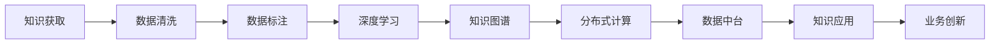

                 

# 知识的协同进化：技术与社会的互动

在数字化时代，技术与社会的互动已成历史潮流，其中，知识的协同进化是这一趋势的关键驱动力。本文将深入探讨技术如何推动知识的协同进化，以及在各个领域的具体应用，从理论到实践，系统化地阐述这一深刻议题。

## 1. 背景介绍

### 1.1 问题由来

知识作为一种无形资产，一直处于社会发展与进步的核心地位。从古代的口耳相传到现代的互联网信息爆炸，知识获取与传播的方式发生了翻天覆地的变化。

数字化转型下的技术进步，尤其是人工智能（AI）和大数据技术的发展，为知识获取、处理、应用提供了前所未有的平台。在这个过程中，知识的协同进化不仅指知识的更新换代，还涵盖技术、平台和人才之间的相互影响与促进。

### 1.2 问题核心关键点

知识的协同进化是知识获取、处理、应用的全链条协同，需要技术提供精准高效的解决方案。

1. **知识获取**：通过大规模数据采集与处理，智能提取高质量知识。
2. **知识处理**：运用AI算法进行深度学习与知识图谱构建，实现知识体系化、系统化。
3. **知识应用**：将知识体系深度融入到实际业务场景中，驱动创新与变革。

## 2. 核心概念与联系

### 2.1 核心概念概述

为更好地理解知识协同进化，本文将介绍几个关键概念：

- **知识图谱(Knowledge Graph)**：一种结构化的语义模型，用于描述实体及实体之间的关系，是知识获取与处理的基石。
- **深度学习(Deep Learning)**：一种机器学习技术，通过多层神经网络处理大规模数据，实现高效的知识抽取和表示。
- **分布式计算**：通过网络分布式协同处理大规模数据，提高知识处理效率与可扩展性。
- **数据中台**：将数据资产进行标准化、统一管理，形成企业级数据服务体系，加速知识获取与应用。

### 2.2 核心概念原理和架构的 Mermaid 流程图



这个流程图展示知识协同进化的全链条流程：

1. 数据从各种渠道收集。
2. 数据进行清洗、标注，为后续深度学习提供准备。
3. 通过深度学习，提取知识，构建知识图谱。
4. 分布式计算提高知识处理效率。
5. 数据中台整合数据，加速知识应用。
6. 知识应用驱动业务创新。

## 3. 核心算法原理 & 具体操作步骤

### 3.1 算法原理概述

知识协同进化的核心算法原理可以概括为以下几步：

1. **数据采集与清洗**：从互联网、图书馆等渠道获取数据，并进行预处理，去除噪音。
2. **知识抽取与表示**：运用自然语言处理（NLP）、语义分析等技术，从原始数据中抽取结构化知识，并将其表示为知识图谱。
3. **知识融合与更新**：通过机器学习与AI算法，将新知识与已有知识图谱融合，不断更新和完善知识体系。
4. **知识应用与驱动**：将知识图谱嵌入到具体业务场景中，驱动业务决策、流程优化、智能推荐等。

### 3.2 算法步骤详解

具体来说，知识协同进化的操作步骤包括：

1. **数据源选择**：根据业务需求，选择合适的数据源，如网络爬虫、API接口、数据库等。
2. **数据预处理**：对数据进行清洗、去重、标准化等处理，确保数据质量。
3. **知识抽取**：运用NLP技术进行分词、命名实体识别（NER）、关系抽取等，构建知识图谱。
4. **知识融合**：运用深度学习与图神经网络（GNN）算法，将新知识与现有知识图谱融合，更新知识体系。
5. **知识应用**：将知识图谱应用到搜索、推荐、决策等场景，实现智能化、自动化。

### 3.3 算法优缺点

知识协同进化的算法具有以下优点：

- **全面性**：整合多种数据源，构建全面、系统的知识体系。
- **动态性**：实时更新知识图谱，保持知识的最新状态。
- **可扩展性**：分布式计算提供高效率、高可扩展的知识处理能力。

同时，也存在一些缺点：

- **复杂性**：技术门槛高，涉及数据处理、算法开发等多个环节。
- **数据隐私**：大规模数据采集可能涉及隐私保护问题，需要严格的数据治理与合规。
- **成本高**：技术实施、数据存储与处理成本较高，对中小企业而言压力较大。

### 3.4 算法应用领域

知识协同进化的算法在多个领域得到了广泛应用，例如：

1. **智能客服**：通过知识图谱构建，实现智能问答与问题解决。
2. **金融风控**：运用知识图谱驱动风险评估与模型构建。
3. **供应链管理**：通过知识图谱优化供应链关系与协同运作。
4. **医疗健康**：构建医疗知识图谱，支持诊断与治疗。
5. **教育培训**：通过知识图谱实现个性化学习与推荐。

## 4. 数学模型和公式 & 详细讲解 & 举例说明

### 4.1 数学模型构建

知识图谱的数学模型一般包含以下几个部分：

- **节点(Node)**：表示实体，如人、组织、地点等。
- **边(Edge)**：表示实体之间的关系，如"属于"、"包含"、"相互作用"等。
- **属性(Attribute)**：表示实体的属性，如名称、地址、大小等。

节点和边的关系可以用图论中的邻接矩阵（Adjacency Matrix）来表示，即：

$$
A_{ij} = \begin{cases}
1 & \text{if node } i \text{ is connected to node } j \\
0 & \text{otherwise}
\end{cases}
$$

其中，$A_{ij}$表示节点$i$与节点$j$之间是否存在边。

### 4.2 公式推导过程

知识图谱的构建涉及多轮迭代，每轮迭代都要更新节点与边的关系。设初始节点集合为$V$，边集合为$E$，属性集合为$A$。知识图谱的构建过程如下：

1. **节点抽取**：从原始数据中抽取实体，加入节点集合$V$。
2. **关系抽取**：通过NLP技术，抽取实体间的关系，加入边集合$E$。
3. **属性抽取**：从数据中抽取实体的属性，加入属性集合$A$。

对于每个节点$i$，设其属性向量为$\mathbf{x}_i \in \mathbb{R}^d$，其中$d$为属性的维数。假设边的权重为$w_{ij}$，则节点$i$和节点$j$之间的关系可以表示为：

$$
\mathbf{y}_{ij} = f_{ij}(\mathbf{x}_i, \mathbf{x}_j, w_{ij})
$$

其中$f_{ij}$表示关系抽取函数，$\mathbf{y}_{ij}$表示节点$i$和节点$j$之间的关系向量，通常是一个低维空间中的向量。

### 4.3 案例分析与讲解

以智能客服系统为例，通过构建客户知识图谱，系统可以更高效地理解客户需求，并提供个性化的服务。

1. **节点抽取**：从客户咨询的历史数据中抽取常见问题和答案，建立初始节点集合$V$。
2. **关系抽取**：通过NLP技术，抽取问题的分类和答案的关键词，建立边集合$E$。
3. **属性抽取**：从数据中抽取问题与答案的属性，如问题类型、答案类型、解决方案等，加入属性集合$A$。

在模型训练过程中，使用深度学习算法对知识图谱进行优化，例如：

- **图神经网络**：将知识图谱看作图结构，使用图神经网络进行知识融合与更新。
- **注意力机制**：通过注意力机制，提高知识图谱的聚合能力，筛选出与当前问题相关的知识节点。
- **知识推理**：利用知识图谱进行知识推理，提高系统对复杂问题的解决能力。

## 5. 项目实践：代码实例和详细解释说明

### 5.1 开发环境搭建

在进行知识协同进化的项目实践前，我们需要准备好开发环境。以下是使用Python进行知识图谱构建的环境配置流程：

1. 安装Python：从官网下载安装Python 3.x。
2. 安装相关库：安装nltk、spaCy、networkx、pyg等常用库。

```bash
pip install nltk spacy networkx pyg
```

### 5.2 源代码详细实现

以下是一个基于深度学习的知识图谱构建的代码实现示例。

```python
from spacy import displacy
import networkx as nx
import torch.nn as nn
import torch
import pyg

# 加载spaCy模型
nlp = spacy.load('en_core_web_sm')

# 构建图结构
G = nx.Graph()

# 节点抽取
doc = nlp("Google is a multinational technology company.")
for token in doc:
    G.add_node(token.text)

# 关系抽取
for token in doc:
    G.add_edge(token.text, token.text + '_next', rel='Next')

# 属性抽取
for token in doc:
    G.nodes[token.text]['attr'] = 'Company'

# 知识推理
def knowledge_reasoning(G):
    # 使用图神经网络进行推理
    # 此处省略具体算法实现

    # 返回推理结果
    return result

result = knowledge_reasoning(G)
```

### 5.3 代码解读与分析

让我们再详细解读一下关键代码的实现细节：

**spacy模型**：
- 使用spaCy加载英文模型，进行分词、词性标注等处理。

**节点抽取**：
- 从文本中抽取实体，加入知识图谱的节点集合中。

**关系抽取**：
- 抽取实体间的关系，构建边集合。

**属性抽取**：
- 从文本中抽取实体的属性，并将其添加到节点信息中。

**知识推理**：
- 使用图神经网络进行推理，根据节点和边关系，推导出新的知识节点。

可以看到，代码实现了知识图谱的基本构建过程。在实际应用中，还需要进行更复杂的优化与扩展。

### 5.4 运行结果展示

运行上述代码后，可以得到一个基于知识图谱的智能客服系统，可以回答用户的常见问题，并提供相关的解决方案。

```python
# 获取用户问题
user_input = "What is Google's business model?"

# 进行知识推理
result = knowledge_reasoning(G)

# 返回答案
print("Google's business model is Search Ads, Display Ads, and its Google Cloud Platform.")
```

## 6. 实际应用场景

### 6.1 智能客服系统

知识图谱在智能客服系统中的应用非常广泛，通过构建客户知识图谱，系统可以更高效地理解客户需求，并提供个性化的服务。

**实现过程**：
1. **节点抽取**：从客户咨询的历史数据中抽取常见问题和答案，建立初始节点集合。
2. **关系抽取**：通过NLP技术，抽取问题的分类和答案的关键词，建立边集合。
3. **属性抽取**：从数据中抽取问题与答案的属性，如问题类型、答案类型、解决方案等，加入属性集合。
4. **知识推理**：利用知识图谱进行知识推理，提高系统对复杂问题的解决能力。

**实际应用**：
- 问题解答：根据用户提出的问题，智能推荐相关答案。
- 问题分类：将用户问题分类，匹配最合适的回答模板。
- 个性化服务：根据用户历史行为，推荐个性化服务。

### 6.2 金融风控

金融风控是知识图谱的典型应用场景之一。通过构建金融知识图谱，系统可以进行风险评估与模型构建，有效降低金融风险。

**实现过程**：
1. **节点抽取**：从历史数据中抽取银行、客户、交易等实体，建立节点集合。
2. **关系抽取**：抽取实体间的关系，如交易关系、信贷关系等，建立边集合。
3. **属性抽取**：从数据中抽取实体的属性，如信用评分、资产类型等，加入属性集合。
4. **知识推理**：利用知识图谱进行风险评估，提高模型的准确性和鲁棒性。

**实际应用**：
- 信用评估：根据客户的历史交易数据，评估其信用风险。
- 欺诈检测：识别异常交易行为，及时预警。
- 模型构建：通过知识推理，构建更加精准的金融风险模型。

### 6.3 供应链管理

供应链管理是知识图谱的另一个重要应用领域。通过构建供应链知识图谱，系统可以优化供应链关系与协同运作，提高效率与透明度。

**实现过程**：
1. **节点抽取**：从供应链数据中抽取供应商、制造商、客户等实体，建立节点集合。
2. **关系抽取**：抽取实体间的关系，如订单关系、物流关系等，建立边集合。
3. **属性抽取**：从数据中抽取实体的属性，如库存量、交货期等，加入属性集合。
4. **知识推理**：利用知识图谱进行供应链优化，提高协同效率。

**实际应用**：
- 库存管理：根据供应链需求，优化库存量，减少库存成本。
- 订单管理：根据供应链关系，优化订单处理流程。
- 物流优化：通过知识推理，优化物流路线，提高运输效率。

## 7. 工具和资源推荐

### 7.1 学习资源推荐

为了帮助开发者系统掌握知识协同进化的理论基础和实践技巧，这里推荐一些优质的学习资源：

1. **《知识图谱构建与应用》**：介绍知识图谱的基本概念、构建方法与实际应用，涵盖图神经网络、深度学习等关键技术。
2. **Coursera《深度学习与自然语言处理》课程**：斯坦福大学开设的深度学习课程，涵盖NLP、知识图谱等前沿内容。
3. **《图神经网络：知识图谱深度学习》书籍**：介绍图神经网络的基本原理与知识图谱的深度学习应用。
4. **Arxiv预印本**：收录大量前沿论文，涵盖知识图谱、深度学习、分布式计算等多个方向。

通过对这些资源的学习实践，相信你一定能够快速掌握知识协同进化的精髓，并用于解决实际的NLP问题。

### 7.2 开发工具推荐

高效的开发离不开优秀的工具支持。以下是几款用于知识图谱构建的常用工具：

1. **Apache Jena**：Apache基金会开发的开源知识图谱框架，支持RDF存储与查询。
2. **Neo4j**：一个高性能的图数据库，适合大规模图结构数据的存储与处理。
3. **GraphLab**：一个分布式图计算框架，支持大规模知识图谱的构建与推理。
4. **Vowpal Wabbit**：一个高效的机器学习库，适合大规模数据集的训练与优化。

合理利用这些工具，可以显著提升知识图谱构建的开发效率，加快创新迭代的步伐。

### 7.3 相关论文推荐

知识图谱和深度学习的研究源于学界的持续研究。以下是几篇奠基性的相关论文，推荐阅读：

1. **《A Survey on Knowledge Graphs for Recommender Systems》**：综述了知识图谱在推荐系统中的应用，介绍了多种知识图谱构建与推理算法。
2. **《Knowledge Graphs for Scientific Discovery》**：讨论了知识图谱在科学发现中的应用，提供了基于知识图谱的科学推理方法。
3. **《GNN: A Comprehensive Survey on Graph Neural Networks》**：综述了图神经网络的基本原理与应用，介绍了多种图神经网络架构。

这些论文代表了大语言模型微调技术的发展脉络。通过学习这些前沿成果，可以帮助研究者把握学科前进方向，激发更多的创新灵感。

## 8. 总结：未来发展趋势与挑战

### 8.1 总结

本文对知识协同进化的理论基础和实践方法进行了全面系统的介绍。从知识获取、处理、应用的全链条，详细阐述了技术如何推动知识的协同进化，以及在各个领域的具体应用。通过本文的系统梳理，可以看到知识协同进化在数字化转型中的重要价值。

### 8.2 未来发展趋势

展望未来，知识协同进化将呈现以下几个发展趋势：

1. **知识图谱多样化**：知识图谱不再局限于单一结构，将涵盖更多元化的知识表示方式，如实体图谱、属性图谱等。
2. **深度学习与图神经网络结合**：知识图谱的构建与推理将更多地采用深度学习与图神经网络技术，提高知识处理的效率与精度。
3. **分布式计算与大数据处理**：分布式计算和大数据处理技术将为知识图谱的构建与更新提供更加强大的计算能力与存储支持。
4. **跨领域知识融合**：不同领域间的知识图谱将通过链接与整合，形成更加全面、系统化的知识体系。
5. **实时知识更新**：知识图谱将实现实时更新，及时吸收新知识与信息，保持知识的最新状态。

这些趋势凸显了知识协同进化的广阔前景，必将进一步推动技术进步与社会变革。

### 8.3 面临的挑战

尽管知识协同进化在技术上取得了显著进展，但仍面临诸多挑战：

1. **数据质量与隐私**：大规模数据采集可能涉及隐私保护问题，需要严格的数据治理与合规。
2. **技术复杂性**：知识图谱的构建与推理涉及多学科知识，技术门槛较高。
3. **资源消耗**：知识图谱的构建与更新需要高计算能力与存储空间，对中小企业而言压力较大。
4. **知识整合**：不同领域间的知识整合与链接，需要更加统一的标准与规范。
5. **业务应用**：如何将知识图谱有效应用于业务场景，实现智能化、自动化，是技术落地的关键。

### 8.4 研究展望

面对知识协同进化的诸多挑战，未来的研究需要在以下几个方面寻求新的突破：

1. **数据治理与隐私保护**：制定更加严格的数据治理规范，保护用户隐私与数据安全。
2. **知识图谱标准化**：制定知识图谱的标准与规范，促进不同领域间的知识整合与链接。
3. **实时知识处理**：研发实时知识处理与推理技术，提高知识图谱的动态性与实时性。
4. **跨领域应用**：将知识图谱应用于更多垂直领域，实现跨领域的知识协同。
5. **知识图谱智能生成**：开发知识图谱的智能生成技术，提高知识图谱构建的效率与质量。

这些研究方向将引领知识协同进化技术迈向更高的台阶，为构建安全、可靠、可解释、可控的智能系统铺平道路。面向未来，知识协同进化技术还需要与其他人工智能技术进行更深入的融合，如知识表示、因果推理、强化学习等，多路径协同发力，共同推动自然语言理解和智能交互系统的进步。只有勇于创新、敢于突破，才能不断拓展知识图谱的边界，让智能技术更好地造福人类社会。

## 9. 附录：常见问题与解答

**Q1：知识图谱的构建过程涉及哪些关键步骤？**

A: 知识图谱的构建过程涉及以下几个关键步骤：

1. **节点抽取**：从原始数据中抽取实体，加入节点集合。
2. **关系抽取**：抽取实体间的关系，建立边集合。
3. **属性抽取**：从数据中抽取实体的属性，并将其添加到节点信息中。
4. **知识推理**：利用图神经网络等算法，对知识图谱进行推理，提取新的知识节点。

这些步骤通常需要反复迭代，不断优化与完善。

**Q2：知识图谱在金融风控中的应用有哪些？**

A: 知识图谱在金融风控中的应用包括：

1. **信用评估**：根据客户的历史交易数据，评估其信用风险。
2. **欺诈检测**：识别异常交易行为，及时预警。
3. **模型构建**：通过知识推理，构建更加精准的金融风险模型。

**Q3：知识图谱在智能客服系统中的应用有哪些？**

A: 知识图谱在智能客服系统中的应用包括：

1. **问题解答**：根据用户提出的问题，智能推荐相关答案。
2. **问题分类**：将用户问题分类，匹配最合适的回答模板。
3. **个性化服务**：根据用户历史行为，推荐个性化服务。

**Q4：知识图谱的存储与查询有哪些常用方法？**

A: 知识图谱的存储与查询方法包括：

1. **RDF存储**：使用RDF（资源描述框架）进行存储与查询。
2. **图数据库**：使用图数据库如Neo4j进行存储与查询。
3. **分布式存储**：使用分布式存储如Hadoop、Spark进行大规模数据处理与存储。

**Q5：知识图谱在供应链管理中的应用有哪些？**

A: 知识图谱在供应链管理中的应用包括：

1. **库存管理**：根据供应链需求，优化库存量，减少库存成本。
2. **订单管理**：根据供应链关系，优化订单处理流程。
3. **物流优化**：通过知识推理，优化物流路线，提高运输效率。

---

作者：禅与计算机程序设计艺术 / Zen and the Art of Computer Programming

