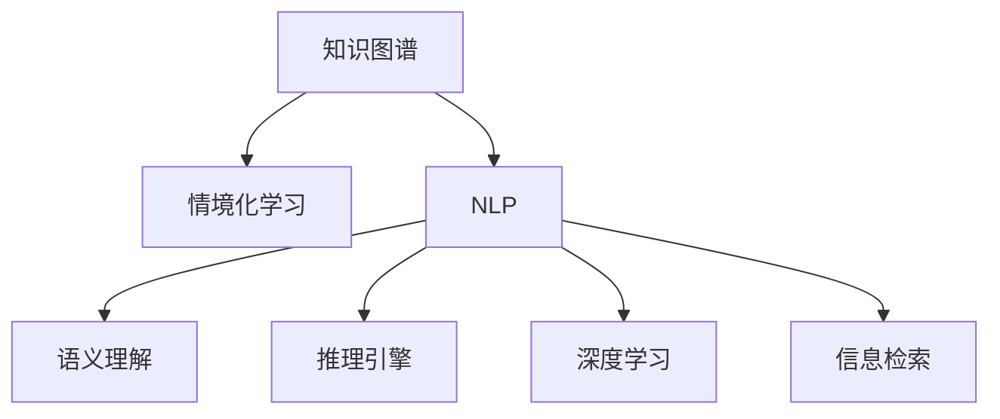

                 

# 知识的情境化：实践中的学习与应用

> 关键词：知识图谱、情境化学习、语义理解、自然语言处理(NLP)、推理引擎、深度学习、信息检索

## 1. 背景介绍

在人工智能和信息技术的飞速发展下，知识图谱作为知识表示与语义理解的重要工具，被广泛应用于各类智能系统与决策支持系统中。特别是在自然语言处理（NLP）领域，知识图谱成为增强模型的语义理解和推理能力的关键手段，使AI系统能够更好地理解和处理人类语言，实现情境化学习与知识应用。本文将详细探讨知识图谱在NLP中的应用，以及情境化学习与知识推理技术的发展历程和趋势。

## 2. 核心概念与联系

### 2.1 核心概念概述

为更好地理解知识图谱在NLP中的应用，本节将介绍几个关键概念：

- **知识图谱(Knowledge Graph)**：由节点（实体）和边（关系）构成的图形结构，用于表示实体间的关系，可用于自然语言理解与知识推理。
- **情境化学习(Contextual Learning)**：根据上下文信息，结合知识图谱和先验知识，进行更加精准的学习与推理。
- **自然语言处理(Natural Language Processing, NLP)**：通过计算机处理和理解人类语言，实现文本分析、信息检索、语音识别等任务。
- **语义理解(Semantic Understanding)**：理解文本中的词义、句义以及上下文关系，从文本中抽取有价值的信息。
- **推理引擎(Rule-based Reasoning Engine)**：使用逻辑规则和知识图谱，对文本数据进行推理计算，得出结论。
- **深度学习(Deep Learning)**：使用深度神经网络进行语义理解与知识推理，提高模型的泛化能力和性能。
- **信息检索(Information Retrieval, IR)**：从大量文本中提取所需信息，用于知识检索与情境化学习。

这些概念之间的逻辑关系可以通过以下Mermaid流程图来展示：



这个流程图展示了几类核心概念及其之间的关系：

1. 知识图谱提供实体与关系的关系网，是情境化学习和推理的基础。
2. NLP将文本转化为结构化信息，便于语义理解和知识推理。
3. 语义理解通过NLP和知识图谱，解析文本中的语义信息。
4. 推理引擎使用逻辑规则和知识图谱，进行知识推理和决策。
5. 深度学习增强模型的学习能力，提升语义理解与推理性能。
6. 信息检索用于获取知识图谱和文本数据，支持情境化学习。

这些概念共同构成了知识图谱在NLP中的应用框架，使得AI系统能够更好地理解和处理人类语言，实现情境化学习与知识应用。通过理解这些核心概念，我们可以更好地把握知识图谱和情境化学习技术的本质。

## 3. 核心算法原理 & 具体操作步骤

### 3.1 算法原理概述

知识图谱在NLP中的核心算法原理主要基于以下几个步骤：

1. **知识抽取(Knowledge Extraction)**：从文本中抽取实体和关系，构建知识图谱。
2. **语义理解(Semantic Parsing)**：使用深度学习模型解析文本中的语义信息。
3. **推理计算(Reasoning)**：结合知识图谱和语义信息，进行推理计算。
4. **应用与反馈**：将推理结果应用到实际任务中，同时反馈结果以优化模型。

形式化地，假设输入为文本 $T$，知识图谱为 $G$，推理规则为 $R$，目标为推理出实体 $E$ 和关系 $R'$。

算法可以表述为：

1. 通过知识抽取从 $T$ 中抽取实体和关系，得到 $E$ 和 $R$。
2. 使用深度学习模型解析 $T$，得到语义向量 $\overrightarrow{v}$。
3. 通过语义向量 $\overrightarrow{v}$ 和推理规则 $R$，结合 $E$ 和 $R$，进行推理计算，得到 $E'$ 和 $R'$。
4. 将 $E'$ 和 $R'$ 应用于实际任务，如回答问题、推荐系统等。

### 3.2 算法步骤详解

具体而言，知识图谱在NLP中的微调步骤如下：

**Step 1: 准备知识图谱和文本数据**

- 收集领域内相关知识图谱，如DBpedia、Wikidata等。
- 准备训练文本数据，如新闻、论文、社交媒体等。

**Step 2: 训练语义理解模型**

- 使用深度学习模型（如BERT、GPT等）对文本进行预训练。
- 在知识图谱上对语义理解模型进行微调，使其能够理解上下文信息。

**Step 3: 推理计算**

- 使用知识图谱和推理引擎进行推理计算，得出实体关系。
- 结合文本信息，对推理结果进行修正和补充。

**Step 4: 应用与反馈**

- 将推理结果应用于实际任务，如问答系统、推荐系统等。
- 根据应用效果反馈，进一步优化知识图谱和推理模型。

### 3.3 算法优缺点

知识图谱在NLP中的应用具有以下优点：

1. **提升语义理解能力**：通过结合知识图谱和语义信息，模型能够更精准地理解文本中的语义关系。
2. **增强推理能力**：推理引擎结合知识图谱和语义信息，进行推理计算，得出更准确的结论。
3. **提供上下文支持**：通过上下文信息，模型能够更全面地理解文本内容，避免片面解读。
4. **支持个性化学习**：通过结合用户上下文信息，模型能够提供更个性化、精准的学习和推荐服务。

但同时，知识图谱在NLP中也有一些局限性：

1. **构建成本高**：知识图谱的构建需要大量人力和计算资源，初期投入较大。
2. **实时更新难**：知识图谱的更新需要大量标注数据和专业知识，难以实时更新。
3. **通用性不足**：领域特定的知识图谱无法泛化到其他领域，限制了应用范围。
4. **推理精度有待提高**：推理引擎和规则的构建需要专家知识，可能存在推理错误。

尽管存在这些局限性，但知识图谱在NLP中的应用已经展现出强大的潜力，成为推动AI技术发展的重要工具。

### 3.4 算法应用领域

知识图谱在NLP中的应用广泛，以下是几个典型应用领域：

- **问答系统(QA Systems)**：使用知识图谱进行实体关系推理，回答用户提出的问题。
- **推荐系统(Recommendation Systems)**：结合用户上下文和知识图谱，进行个性化推荐。
- **信息检索(Information Retrieval, IR)**：通过知识图谱增强搜索结果的相关性和精准度。
- **情感分析(Sentiment Analysis)**：使用知识图谱和语义理解模型，分析文本情感倾向。
- **事件检测(Event Detection)**：通过知识图谱进行事件关系推理，检测文本中的事件和实体。
- **机器翻译(Machine Translation)**：结合知识图谱和语义理解模型，提高翻译质量。
- **智能客服(Smart Customer Service)**：使用知识图谱进行情境化学习，提升客服效率和质量。

此外，知识图谱还被应用于金融风控、医疗诊断、教育评估等多个领域，为各行业的智能化转型提供了重要支持。

## 4. 数学模型和公式 & 详细讲解 & 举例说明

### 4.1 数学模型构建

知识图谱在NLP中的数学模型主要基于以下几个要素：

- **节点(Node)**：表示实体或属性，用向量表示。
- **边(Edge)**：表示实体之间的关系，用矩阵表示。
- **权重(Weight)**：表示关系的重要性和可信度。

形式化地，假设知识图谱 $G(V, E, W)$ 中的节点 $V$ 和边 $E$ 分别用向量表示，关系权重 $W$ 用矩阵表示，目标为推断实体 $E'$ 和关系 $R'$。

### 4.2 公式推导过程

以下我们以问答系统为例，推导基于知识图谱的推理公式。

假设知识图谱包含节点 $v_i$ 和 $v_j$，它们之间存在关系 $r$。

$$
v_i = (v_i^{(1)}, v_i^{(2)}, ..., v_i^{(n)})
$$

$$
v_j = (v_j^{(1)}, v_j^{(2)}, ..., v_j^{(n)})
$$

$$
r = (r^{(1)}, r^{(2)}, ..., r^{(n)})
$$

则推理公式可以表示为：

$$
v_{ij} = f(v_i, v_j, r)
$$

其中 $f$ 为推理函数，可以通过矩阵乘法和激活函数实现。

### 4.3 案例分析与讲解

假设我们要回答的问题为："谁曾担任纽约市市长？"，推理过程如下：

1. 从知识图谱中提取实体 "纽约市市长"，表示为节点 $v_1$。
2. 从知识图谱中提取实体 "市长" 与 "纽约市" 之间的关系，表示为关系 $r_1$。
3. 通过推理计算，得到实体 "市长" 的节点表示 $v_2$。
4. 通过推理计算，得到节点 $v_1$ 和 $v_2$ 的关系表示 $r_2$。
5. 最终推理出 "市长" 曾担任 "纽约市" 市长。

## 5. 项目实践：代码实例和详细解释说明

### 5.1 开发环境搭建

在进行知识图谱在NLP中的微调实践前，我们需要准备好开发环境。以下是使用Python进行PyTorch开发的环境配置流程：

1. 安装Anaconda：从官网下载并安装Anaconda，用于创建独立的Python环境。

2. 创建并激活虚拟环境：
```bash
conda create -n pytorch-env python=3.8 
conda activate pytorch-env
```

3. 安装PyTorch：根据CUDA版本，从官网获取对应的安装命令。例如：
```bash
conda install pytorch torchvision torchaudio cudatoolkit=11.1 -c pytorch -c conda-forge
```

4. 安装Transformers库：
```bash
pip install transformers
```

5. 安装各类工具包：
```bash
pip install numpy pandas scikit-learn matplotlib tqdm jupyter notebook ipython
```

完成上述步骤后，即可在`pytorch-env`环境中开始微调实践。

### 5.2 源代码详细实现

这里我们以问答系统为例，给出使用Transformers库对BERT模型进行微调的PyTorch代码实现。

首先，定义问答任务的数据处理函数：

```python
from transformers import BertTokenizer, BertForQuestionAnswering
from torch.utils.data import Dataset, DataLoader
import torch

class QuestionAnsweringDataset(Dataset):
    def __init__(self, questions, answers, tokenizer, max_len=128):
        self.questions = questions
        self.answers = answers
        self.tokenizer = tokenizer
        self.max_len = max_len
        
    def __len__(self):
        return len(self.questions)
    
    def __getitem__(self, item):
        question = self.questions[item]
        answer = self.answers[item]
        
        encoding = self.tokenizer(question, answer, return_tensors='pt', max_length=self.max_len, padding='max_length', truncation=True)
        input_ids = encoding['input_ids'][0]
        attention_mask = encoding['attention_mask'][0]
        
        # 对token-wise的标签进行编码
        label_ids = torch.tensor([1 if answer in question else 0], dtype=torch.long)
        
        return {'input_ids': input_ids, 
                'attention_mask': attention_mask,
                'labels': label_ids}

# 加载预训练的BERT模型
model = BertForQuestionAnswering.from_pretrained('bert-base-uncased')

# 准备训练数据
tokenizer = BertTokenizer.from_pretrained('bert-base-uncased')
train_dataset = QuestionAnsweringDataset(train_questions, train_answers, tokenizer)
dev_dataset = QuestionAnsweringDataset(dev_questions, dev_answers, tokenizer)
test_dataset = QuestionAnsweringDataset(test_questions, test_answers, tokenizer)

# 设置训练参数
optimizer = AdamW(model.parameters(), lr=2e-5)
```

然后，定义训练和评估函数：

```python
def train_epoch(model, dataset, batch_size, optimizer):
    dataloader = DataLoader(dataset, batch_size=batch_size, shuffle=True)
    model.train()
    epoch_loss = 0
    for batch in dataloader:
        input_ids = batch['input_ids'].to(device)
        attention_mask = batch['attention_mask'].to(device)
        labels = batch['labels'].to(device)
        model.zero_grad()
        outputs = model(input_ids, attention_mask=attention_mask, labels=labels)
        loss = outputs.loss
        epoch_loss += loss.item()
        loss.backward()
        optimizer.step()
    return epoch_loss / len(dataloader)

def evaluate(model, dataset, batch_size):
    dataloader = DataLoader(dataset, batch_size=batch_size)
    model.eval()
    preds, labels = [], []
    with torch.no_grad():
        for batch in dataloader:
            input_ids = batch['input_ids'].to(device)
            attention_mask = batch['attention_mask'].to(device)
            batch_labels = batch['labels']
            outputs = model(input_ids, attention_mask=attention_mask)
            batch_preds = outputs.logits.argmax(dim=2).to('cpu').tolist()
            batch_labels = batch_labels.to('cpu').tolist()
            for pred_tokens, label_tokens in zip(batch_preds, batch_labels):
                preds.append(pred_tokens[:len(label_tokens)])
                labels.append(label_tokens)
                
    print(classification_report(labels, preds))
```

最后，启动训练流程并在测试集上评估：

```python
epochs = 5
batch_size = 16

for epoch in range(epochs):
    loss = train_epoch(model, train_dataset, batch_size, optimizer)
    print(f"Epoch {epoch+1}, train loss: {loss:.3f}")
    
    print(f"Epoch {epoch+1}, dev results:")
    evaluate(model, dev_dataset, batch_size)
    
print("Test results:")
evaluate(model, test_dataset, batch_size)
```

以上就是使用PyTorch对BERT进行问答系统微调的完整代码实现。可以看到，得益于Transformers库的强大封装，我们可以用相对简洁的代码完成BERT模型的加载和微调。

### 5.3 代码解读与分析

让我们再详细解读一下关键代码的实现细节：

**QuestionAnsweringDataset类**：
- `__init__`方法：初始化文本和答案，分词器等关键组件。
- `__len__`方法：返回数据集的样本数量。
- `__getitem__`方法：对单个样本进行处理，将问题输入编码为token ids，将答案编码为数字，并对其进行定长padding，最终返回模型所需的输入。

**训练和评估函数**：
- 使用PyTorch的DataLoader对数据集进行批次化加载，供模型训练和推理使用。
- 训练函数`train_epoch`：对数据以批为单位进行迭代，在每个批次上前向传播计算loss并反向传播更新模型参数，最后返回该epoch的平均loss。
- 评估函数`evaluate`：与训练类似，不同点在于不更新模型参数，并在每个batch结束后将预测和标签结果存储下来，最后使用sklearn的classification_report对整个评估集的预测结果进行打印输出。

**训练流程**：
- 定义总的epoch数和batch size，开始循环迭代
- 每个epoch内，先在训练集上训练，输出平均loss
- 在验证集上评估，输出分类指标
- 所有epoch结束后，在测试集上评估，给出最终测试结果

可以看到，PyTorch配合Transformers库使得BERT微调的代码实现变得简洁高效。开发者可以将更多精力放在数据处理、模型改进等高层逻辑上，而不必过多关注底层的实现细节。

当然，工业级的系统实现还需考虑更多因素，如模型的保存和部署、超参数的自动搜索、更灵活的任务适配层等。但核心的微调范式基本与此类似。

## 6. 实际应用场景

### 6.1 智能客服系统

基于知识图谱的智能客服系统能够提供高效、智能的客户服务。通过收集企业内部的历史客服对话记录，将问题和最佳答复构建成监督数据，在此基础上对预训练模型进行微调。微调后的模型能够自动理解用户意图，匹配最合适的答案模板进行回复。对于客户提出的新问题，还可以接入检索系统实时搜索相关内容，动态组织生成回答。如此构建的智能客服系统，能大幅提升客户咨询体验和问题解决效率。

### 6.2 金融舆情监测

金融机构需要实时监测市场舆论动向，以便及时应对负面信息传播，规避金融风险。传统的人工监测方式成本高、效率低，难以应对网络时代海量信息爆发的挑战。基于知识图谱的文本分类和情感分析技术，为金融舆情监测提供了新的解决方案。

具体而言，可以收集金融领域相关的新闻、报道、评论等文本数据，并对其进行主题标注和情感标注。在此基础上对预训练语言模型进行微调，使其能够自动判断文本属于何种主题，情感倾向是正面、中性还是负面。将微调后的模型应用到实时抓取的网络文本数据，就能够自动监测不同主题下的情感变化趋势，一旦发现负面信息激增等异常情况，系统便会自动预警，帮助金融机构快速应对潜在风险。

### 6.3 个性化推荐系统

当前的推荐系统往往只依赖用户的历史行为数据进行物品推荐，无法深入理解用户的真实兴趣偏好。基于知识图谱的个性化推荐系统可以更好地挖掘用户行为背后的语义信息，从而提供更精准、多样的推荐内容。

在实践中，可以收集用户浏览、点击、评论、分享等行为数据，提取和用户交互的物品标题、描述、标签等文本内容。将文本内容作为模型输入，用户的后续行为（如是否点击、购买等）作为监督信号，在此基础上微调预训练语言模型。微调后的模型能够从文本内容中准确把握用户的兴趣点。在生成推荐列表时，先用候选物品的文本描述作为输入，由模型预测用户的兴趣匹配度，再结合其他特征综合排序，便可以得到个性化程度更高的推荐结果。

### 6.4 未来应用展望

随着知识图谱和微调技术的不断发展，基于微调范式将在更多领域得到应用，为传统行业带来变革性影响。

在智慧医疗领域，基于知识图谱的问答、病历分析、药物研发等应用将提升医疗服务的智能化水平，辅助医生诊疗，加速新药开发进程。

在智能教育领域，知识图谱和微调技术可应用于作业批改、学情分析、知识推荐等方面，因材施教，促进教育公平，提高教学质量。

在智慧城市治理中，知识图谱和微调模型可应用于城市事件监测、舆情分析、应急指挥等环节，提高城市管理的自动化和智能化水平，构建更安全、高效的未来城市。

此外，在企业生产、社会治理、文娱传媒等众多领域，基于知识图谱的智能应用也将不断涌现，为NLP技术带来了全新的突破。随着预训练语言模型和微调方法的不断进步，相信NLP技术将在更广阔的应用领域大放异彩。

## 7. 工具和资源推荐

### 7.1 学习资源推荐

为了帮助开发者系统掌握知识图谱在NLP中的应用理论基础和实践技巧，这里推荐一些优质的学习资源：

1. 《Knowledge Graphs: An Introduction》书籍：作者Mariusz Wojcik，介绍了知识图谱的基本概念、构建方法和应用场景，是入门知识图谱的极佳读物。
2. 《Deep Learning for NLP》书籍：作者Palash Goyal，介绍了深度学习在NLP中的应用，包括语义理解、情感分析、推荐系统等，内容全面且深入。
3. 《Knowledge Graphs in Practice》文章系列：由LinkedIn作者Amit Vadeh和Sela Binyamin-Arieli发布，介绍了知识图谱在实际应用中的构建和应用，包含多篇文章，涵盖从构建到推理的各个环节。
4. Arxiv.org：搜索相关论文，了解最新的研究成果和应用实践，是获取前沿知识的必备资源。
5. Stanford NLP Group：斯坦福大学自然语言处理组的资源，包括课程、论文、工具等，提供丰富的学习资源和实践工具。

通过对这些资源的学习实践，相信你一定能够快速掌握知识图谱在NLP中的应用精髓，并用于解决实际的NLP问题。

### 7.2 开发工具推荐

高效的开发离不开优秀的工具支持。以下是几款用于知识图谱在NLP中微调开发的常用工具：

1. PyTorch：基于Python的开源深度学习框架，灵活动态的计算图，适合快速迭代研究。大部分预训练语言模型都有PyTorch版本的实现。
2. TensorFlow：由Google主导开发的开源深度学习框架，生产部署方便，适合大规模工程应用。同样有丰富的预训练语言模型资源。
3. Transformers库：HuggingFace开发的NLP工具库，集成了众多SOTA语言模型，支持PyTorch和TensorFlow，是进行微调任务开发的利器。
4. Weights & Biases：模型训练的实验跟踪工具，可以记录和可视化模型训练过程中的各项指标，方便对比和调优。与主流深度学习框架无缝集成。
5. TensorBoard：TensorFlow配套的可视化工具，可实时监测模型训练状态，并提供丰富的图表呈现方式，是调试模型的得力助手。
6. Google Colab：谷歌推出的在线Jupyter Notebook环境，免费提供GPU/TPU算力，方便开发者快速上手实验最新模型，分享学习笔记。

合理利用这些工具，可以显著提升知识图谱在NLP中微调任务的开发效率，加快创新迭代的步伐。

### 7.3 相关论文推荐

知识图谱和微调技术的发展源于学界的持续研究。以下是几篇奠基性的相关论文，推荐阅读：

1. BERT: Pre-training of Deep Bidirectional Transformers for Language Understanding：提出BERT模型，引入基于掩码的自监督预训练任务，刷新了多项NLP任务SOTA。
2. Knowledge Graphs for Healthcare - A Survey：作者Ilias Elenas、Jihane Taha、Natasha Gesha，介绍了知识图谱在医疗领域的应用，涵盖了数据构建、推理引擎等多个方面。
3. Knowledge Graphs for Smart Cities - An Overview：作者George Papadimitriou、Vassilios Giannakos，介绍了知识图谱在智慧城市中的应用，包括事件检测、智能交通、应急管理等多个场景。
4. Knowledge Graphs for Recommendation Systems: A Survey：作者Bibhuti Dash、Babu Natesh、Varun Grover，介绍了知识图谱在推荐系统中的应用，涵盖了知识抽取、融合等多个环节。
5. BERT-PRESTO: Bidirectional Pre-training, Sparsecoding, and Scalable Reasoning over Knowledge Graphs：提出BERT-PRESTO模型，结合BERT和知识图谱，实现高效的知识推理和嵌入学习。
6. A Survey on Knowledge Graph Embeddings：作者Riccardo Lucidi、Dan van Schaik、Sylvia Copyright、Cristian S. Caragea，介绍了知识图谱嵌入学习的研究进展，涵盖多种嵌入方法及其应用效果。

这些论文代表了大语言模型微调技术的发展脉络。通过学习这些前沿成果，可以帮助研究者把握学科前进方向，激发更多的创新灵感。

## 8. 总结：未来发展趋势与挑战

### 8.1 总结

本文对基于知识图谱的NLP中的微调方法进行了全面系统的介绍。首先阐述了知识图谱在NLP中的应用背景和意义，明确了微调在拓展预训练模型应用、提升下游任务性能方面的独特价值。其次，从原理到实践，详细讲解了微调的数学原理和关键步骤，给出了微调任务开发的完整代码实例。同时，本文还广泛探讨了知识图谱在智能客服、金融舆情、个性化推荐等多个行业领域的应用前景，展示了微调范式的巨大潜力。此外，本文精选了知识图谱在NLP中的各类学习资源，力求为读者提供全方位的技术指引。

通过本文的系统梳理，可以看到，知识图谱在NLP中的应用已经成为NLP技术的重要组成部分，极大地拓展了预训练语言模型的应用边界，催生了更多的落地场景。随着知识图谱和微调方法的不断演进，基于知识图谱的NLP技术必将迎来更加广阔的应用前景，为各行各业带来深远的影响。

### 8.2 未来发展趋势

展望未来，知识图谱在NLP中的应用将呈现以下几个发展趋势：

1. **知识图谱自动化构建**：自动从文本中抽取实体和关系，构建知识图谱，降低人工成本。
2. **知识图谱实时更新**：利用自然语言处理技术，实时更新知识图谱，保持信息的时效性。
3. **知识推理的复杂化**：结合逻辑推理、因果推断等技术，增强知识推理的准确性和鲁棒性。
4. **多模态知识融合**：结合视觉、语音、文本等多种模态信息，增强知识图谱的全面性和准确性。
5. **语义理解与推理的融合**：结合语义理解与知识推理，实现更加全面和精准的NLP应用。
6. **知识图谱的跨领域应用**：将知识图谱应用于更多领域，如金融、医疗、教育等，推动相关领域的智能化转型。

以上趋势凸显了知识图谱在NLP中的广阔前景。这些方向的探索发展，必将进一步提升知识图谱在NLP中的应用效果，为各行各业带来深远的影响。

### 8.3 面临的挑战

尽管知识图谱在NLP中的应用已经取得了显著进展，但在迈向更加智能化、普适化应用的过程中，仍面临诸多挑战：

1. **构建成本高**：知识图谱的构建需要大量人力和计算资源，初期投入较大。
2. **数据质量差**：知识图谱的构建依赖高质量的标注数据，数据质量直接影响到知识图谱的准确性。
3. **推理精度低**：知识图谱的推理计算依赖于逻辑规则和知识图谱的构建，可能存在推理错误。
4. **可解释性不足**：知识图谱和微调模型的决策过程缺乏可解释性，难以对其推理逻辑进行分析和调试。
5. **资源消耗大**：知识图谱的推理计算和语义理解需要大量计算资源，可能面临资源消耗大的问题。

尽管存在这些挑战，但知识图谱在NLP中的应用已经展现出强大的潜力，成为推动AI技术发展的重要工具。

### 8.4 研究展望

面对知识图谱在NLP中面临的挑战，未来的研究需要在以下几个方面寻求新的突破：

1. **知识图谱自动化构建**：开发自动化的知识图谱构建工具，降低人工成本，提高构建效率。
2. **多模态知识融合**：结合视觉、语音、文本等多种模态信息，构建更全面、准确的复合知识图谱。
3. **语义理解与推理的融合**：结合语义理解与知识推理，实现更加全面和精准的NLP应用。
4. **推理引擎的优化**：优化推理引擎的计算逻辑，提高推理效率和准确性。
5. **知识图谱的可解释性**：开发可解释的知识图谱和推理模型，提升模型可解释性。
6. **知识图谱的跨领域应用**：将知识图谱应用于更多领域，推动相关领域的智能化转型。

这些研究方向的探索，必将引领知识图谱在NLP中的发展趋势，为构建更全面、精准、智能的NLP系统提供重要支持。面向未来，知识图谱和微调技术还需要与其他人工智能技术进行更深入的融合，如知识表示、因果推理、强化学习等，多路径协同发力，共同推动NLP技术的发展。

## 9. 附录：常见问题与解答

**Q1：知识图谱在NLP中的应用是否局限于某一特定领域？**

A: 知识图谱在NLP中的应用并不局限于某一特定领域。它能够结合不同领域的数据，构建出多领域的知识图谱，适用于多个领域的智能应用。例如，在金融领域，知识图谱可以用于信用评估、风险预测等任务；在医疗领域，知识图谱可以用于疾病诊断、药物研发等任务。

**Q2：知识图谱如何影响NLP模型的性能？**

A: 知识图谱通过提供实体和关系的语义信息，能够显著提升NLP模型的性能。它可以帮助模型更好地理解上下文信息，识别实体和关系，从而提高模型的准确性和泛化能力。例如，在问答系统中，知识图谱可以帮助模型更好地理解问题，快速找到相关答案；在推荐系统中，知识图谱可以帮助模型更好地理解用户偏好，提供个性化推荐。

**Q3：知识图谱在NLP中的构建成本是否很高？**

A: 知识图谱的构建成本确实较高，需要大量人力和计算资源。但随着技术的发展，自动化的知识图谱构建工具和框架也在不断涌现，例如知识图谱自动抽取工具、知识图谱推理引擎等。这些工具可以显著降低知识图谱构建的成本，提高构建效率。

**Q4：知识图谱在NLP中的推理精度是否受限于知识图谱的质量？**

A: 知识图谱的推理精度确实受限于知识图谱的质量。高质量的知识图谱能够提供准确的关系和实体信息，从而提高推理的精度。但知识图谱的构建是一个复杂的过程，需要大量标注数据和专业知识，构建高质量的知识图谱是一个持续优化的过程。

**Q5：知识图谱和微调方法在NLP中的应用是否存在冲突？**

A: 知识图谱和微调方法在NLP中的应用并不存在冲突。知识图谱提供了语义信息，微调方法通过上下文信息进一步优化模型。两者可以协同发挥作用，提升NLP系统的性能。在实践中，通常先将知识图谱和预训练模型结合，再进行微调，从而实现更好的效果。

**Q6：知识图谱和微调方法在NLP中的未来发展方向是什么？**

A: 知识图谱和微调方法在NLP中的未来发展方向包括以下几个方面：

1. **知识图谱自动化构建**：开发自动化的知识图谱构建工具，降低人工成本，提高构建效率。
2. **多模态知识融合**：结合视觉、语音、文本等多种模态信息，构建更全面、准确的复合知识图谱。
3. **语义理解与推理的融合**：结合语义理解与知识推理，实现更加全面和精准的NLP应用。
4. **推理引擎的优化**：优化推理引擎的计算逻辑，提高推理效率和准确性。
5. **知识图谱的可解释性**：开发可解释的知识图谱和推理模型，提升模型可解释性。
6. **知识图谱的跨领域应用**：将知识图谱应用于更多领域，推动相关领域的智能化转型。

这些研究方向将引领知识图谱和微调技术在NLP中的应用发展，推动人工智能技术在各领域的广泛应用。

---

作者：禅与计算机程序设计艺术 / Zen and the Art of Computer Programming

