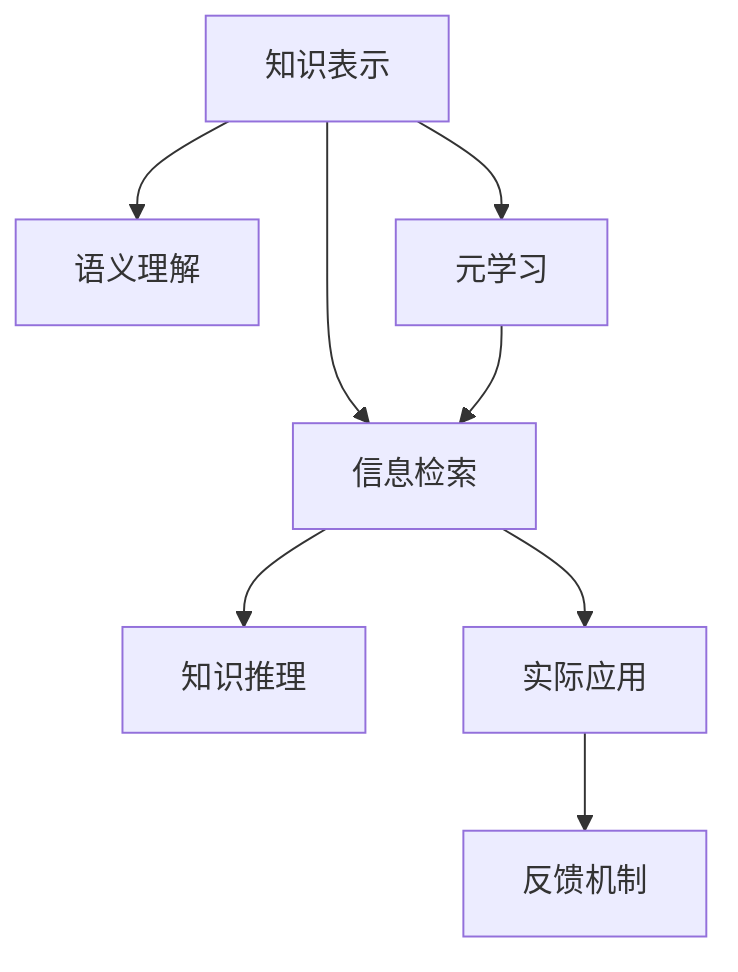

                 

# 知识的本质：从信息到智慧的转化

> 关键词：知识表示、信息检索、知识图谱、语义理解、知识推理、元学习

## 1. 背景介绍

### 1.1 问题由来

在信息爆炸的时代，人类面临着如何有效组织、检索、利用知识的挑战。传统的数据库和搜索引擎往往只关注文本信息的浅层表示，难以理解语义的多义性和复杂性。而知识的本质在于理解信息的内在关联，即信息的深层次结构和语义关系。如何构建更加智能的知识系统，提升人类对信息及其关联的理解和利用，成为当前AI研究的热点。

### 1.2 问题核心关键点

当前，知识图谱和语义网络技术成为构建智能知识系统的关键手段。这些系统通过将知识映射为结构化的图结构，捕捉实体之间的语义关系，实现对信息更深层次的理解和关联。然而，构建高质量的知识图谱需要大量的人工标注和精心设计，成本高昂且难以拓展。与此同时，随着知识库规模的不断增长，如何在海量数据中高效检索相关知识，并对新知识进行快速吸收和推理，也成为一个亟待解决的问题。

### 1.3 问题研究意义

本研究聚焦于从信息到智慧的转化，旨在通过构建智能的知识图谱，利用深度学习技术挖掘知识图谱中的潜在模式，并结合元学习技术提升知识图谱的适应性和灵活性。通过此研究，可以极大地提升信息检索和知识推理的准确性和效率，促进知识图谱在更多领域的应用，助力人类智慧的提升。

## 2. 核心概念与联系

### 2.1 核心概念概述

为更好地理解从信息到智慧的转化过程，本节将介绍几个核心概念及其相互联系：

- **知识表示（Knowledge Representation）**：指将人类知识结构化表示，形成可用于计算和推理的知识结构。常见的知识表示方式包括三元组、图结构、向量等。
- **信息检索（Information Retrieval）**：指从大量信息中检索出用户所需内容的过程。目标在于提高检索速度和准确性。
- **知识图谱（Knowledge Graph）**：由节点和边组成的图结构，用于表示实体及其关系。常用的知识图谱有Freebase、YAGO等。
- **语义理解（Semantic Understanding）**：指理解文本或数据中更深层次的语义信息，区分同义词、多义词等。
- **知识推理（Knowledge Reasoning）**：指利用知识图谱中的已知信息推导出新的知识，如推理规则、推理链等。
- **元学习（Meta-Learning）**：指学习算法能够适应新任务、新数据的能力。元学习通常通过少量数据实现快速适应，提升模型的泛化能力。

这些核心概念之间相互联系，通过知识的表示、检索、推理等环节，逐步实现从信息到智慧的转化。下面将通过一个Mermaid流程图展示这些概念之间的逻辑关系：



这个流程图展示了知识表示、信息检索、语义理解、知识推理和元学习之间的相互关系和转化过程。知识表示是基础，信息检索是手段，语义理解是关键，知识推理是应用，元学习是目标。

## 3. 核心算法原理 & 具体操作步骤
### 3.1 算法原理概述

从信息到智慧的转化过程，本质上是通过深度学习技术挖掘知识图谱中的潜在模式，并结合元学习技术提升知识图谱的适应性和灵活性。其核心思想是：

1. **知识表示**：构建结构化的知识图谱，捕捉实体之间的语义关系。
2. **信息检索**：从知识图谱中高效检索相关实体和关系。
3. **语义理解**：理解文本或数据中的深层语义信息，实现多义词、同义词等的区分。
4. **知识推理**：利用知识图谱中的已知信息推导出新的知识，如推理规则、推理链等。
5. **元学习**：通过少量数据实现快速适应，提升模型的泛化能力，实现知识图谱的动态更新和扩展。

### 3.2 算法步骤详解

基于上述核心思想，本节将详细介绍从信息到智慧转化的具体步骤：

**Step 1: 构建知识图谱**

知识图谱的构建是知识表示的基础。首先，需要收集大量的语料库和知识库，通过自然语言处理技术提取出实体、属性和关系，构建三元组形式的知识图谱。具体的构建步骤如下：

1. **数据收集**：从百科全书、科学论文、数据库等渠道收集知识库和语料库。
2. **实体识别**：通过命名实体识别（NER）技术识别出文本中的实体。
3. **关系抽取**：通过关系抽取技术，识别出实体之间的关系。
4. **知识图谱构建**：将提取出的实体、属性和关系存储在知识图谱中。

**Step 2: 信息检索**

信息检索的目标是从知识图谱中高效检索相关实体和关系。常用的信息检索方法包括：

1. **基于关键词的检索**：通过关键词匹配检索相关实体和关系。
2. **基于语义的检索**：通过语义相似度计算，检索相关实体和关系。
3. **基于知识的检索**：通过推理规则或链推理，检索相关实体和关系。

**Step 3: 语义理解**

语义理解旨在理解文本或数据中的深层语义信息，实现多义词、同义词等的区分。常用的语义理解方法包括：

1. **词向量表示**：通过Word2Vec、GloVe等词向量模型，将单词映射到低维向量空间，实现向量空间中的语义相似度计算。
2. **深度学习模型**：通过BERT、GPT等深度学习模型，理解文本中的语义信息。
3. **知识增强**：通过将知识图谱中的信息引入到语义理解模型中，提升模型的语义理解能力。

**Step 4: 知识推理**

知识推理利用知识图谱中的已知信息推导出新的知识，如推理规则、推理链等。常用的知识推理方法包括：

1. **规则推理**：通过人工设计的推理规则，进行逻辑推理。
2. **链推理**：通过多步推理，逐步推导出新的知识。
3. **逻辑推理引擎**：通过逻辑推理引擎，实现高效的推理计算。

**Step 5: 元学习**

元学习通过少量数据实现快速适应，提升模型的泛化能力，实现知识图谱的动态更新和扩展。常用的元学习方法包括：

1. **迁移学习**：通过将知识从源任务迁移到目标任务，提升模型的泛化能力。
2. **自适应学习**：通过调整学习率、正则化等参数，适应新任务和新数据。
3. **基于统计的学习**：通过统计方法，提取新任务的共性特征，提升模型的适应性。

### 3.3 算法优缺点

从信息到智慧的转化过程具有以下优点：

1. **高效性**：通过结构化的知识图谱，实现高效的实体检索和关系推理。
2. **鲁棒性**：通过深度学习技术，提升语义理解的准确性和灵活性。
3. **动态性**：通过元学习技术，实现知识图谱的动态更新和扩展。

同时，该过程也存在一些局限性：

1. **构建难度大**：知识图谱的构建需要大量的人工标注和精心设计，成本高昂。
2. **泛化能力有限**：知识图谱的构建和理解依赖于特定的语料库和知识库，泛化能力有限。
3. **复杂度高**：知识推理和元学习过程复杂，需要较强的计算资源。

尽管存在这些局限性，但就目前而言，从信息到智慧的转化过程仍是构建智能知识系统的重要手段。未来相关研究的重点在于如何进一步降低构建成本，提高泛化能力，同时兼顾计算资源的效率。

### 3.4 算法应用领域

从信息到智慧的转化过程已经在多个领域得到了广泛应用，例如：

- **自然语言处理（NLP）**：通过语义理解，实现机器翻译、问答系统等。
- **智能推荐系统**：通过知识推理，实现个性化推荐。
- **医疗诊断**：通过知识图谱和推理，辅助医生进行诊断。
- **金融分析**：通过知识图谱和推理，实现风险评估和预测。
- **智能客服**：通过语义理解，实现智能客服对话。

这些应用展示了从信息到智慧的转化过程在实际场景中的巨大潜力，相信未来随着技术的不断发展，该过程将覆盖更多领域，进一步提升人类智慧水平。

## 4. 数学模型和公式 & 详细讲解 & 举例说明

### 4.1 数学模型构建

本节将使用数学语言对从信息到智慧的转化过程进行更加严格的刻画。

记知识图谱中的实体为 $E$，属性为 $A$，关系为 $R$。则知识图谱可以表示为一个三元组集合 $\mathcal{G} = \{(e, r, e')\}$，其中 $e, e'$ 为实体，$r$ 为关系。

定义知识图谱中实体的向量表示为 $\mathbf{v}_e$，属性的向量表示为 $\mathbf{v}_a$，关系的向量表示为 $\mathbf{v}_r$。则知识图谱的向量表示可以表示为：

$$
\mathbf{V}_G = \{\mathbf{v}_e, \mathbf{v}_a, \mathbf{v}_r\}
$$

知识推理的过程可以表示为：

$$
\mathcal{R}(\mathbf{V}_G) = \{\mathbf{v}_{r_1} \odot \mathbf{v}_{e_1} \odot \mathbf{v}_{e_2}\}
$$

其中 $\odot$ 表示向量点乘或向量矩阵乘法。通过知识推理，可以得到新的向量表示，用于进一步的语义理解和信息检索。

### 4.2 公式推导过程

以下我们将以知识推理为例，推导知识推理的向量表示和推理公式。

假设知识图谱中存在实体 $e_1$ 和 $e_2$，通过关系 $r$ 连接，即 $(e_1, r, e_2)$。知识推理的目标是利用已知的向量表示 $\mathbf{v}_{e_1}$ 和 $\mathbf{v}_r$，推导出新的向量表示 $\mathbf{v}_{e_2}$。

设 $\mathbf{v}_r$ 的维度为 $d_r$，$\mathbf{v}_{e_1}$ 的维度为 $d_e$，$\mathbf{v}_{e_2}$ 的维度为 $d_e$。则知识推理的向量表示可以表示为：

$$
\mathbf{v}_{e_2} = \mathbf{v}_{e_1} \cdot \mathbf{v}_r
$$

其中 $\cdot$ 表示向量点乘。通过向量点乘，可以得到新的向量表示 $\mathbf{v}_{e_2}$，用于进一步的语义理解和信息检索。

### 4.3 案例分析与讲解

以医疗领域的知识图谱为例，分析从信息到智慧的转化过程。

**Step 1: 构建知识图谱**

医疗知识图谱的构建包括实体、属性和关系的识别。例如，对于患者实体 $e_{patient}$，其属性可以包括姓名、年龄、性别等，关系可以包括就诊时间、就诊科室、诊断结果等。

**Step 2: 信息检索**

患者就诊信息可以从电子病历中检索出来，检索方式可以通过基于关键词的检索和基于语义的检索实现。例如，检索患者就诊信息时，可以通过患者姓名和就诊时间作为关键词进行匹配，或者通过查询“患者姓名 就诊时间 就诊科室”这样的结构化查询语句，实现精确匹配。

**Step 3: 语义理解**

对于患者就诊信息的语义理解，可以通过深度学习模型BERT实现。例如，对于患者就诊信息“张三，男，35岁，2021-01-01 前往内科就诊，诊断结果为高血压”，模型可以理解其中的关键信息，如患者姓名、性别、年龄、就诊时间、就诊科室和诊断结果。

**Step 4: 知识推理**

医疗知识推理可以通过推理规则或链推理实现。例如，可以通过推理规则，将高血压与心脏病关联起来，进而推导出需要进一步检查心电图等建议。通过链推理，可以逐步推导出患者的治疗方案和用药建议。

**Step 5: 元学习**

医疗知识图谱的元学习可以通过迁移学习实现。例如，利用已有的医学知识图谱，通过少量标注数据，对新的医学知识图谱进行微调，提升其泛化能力。

通过从信息到智慧的转化过程，医疗领域可以构建更加智能的知识系统，提升医生的诊疗效率和诊断精度，加速新药研发进程。

## 5. 项目实践：代码实例和详细解释说明

### 5.1 开发环境搭建

在进行项目实践前，我们需要准备好开发环境。以下是使用Python进行PyTorch开发的环境配置流程：

1. 安装Anaconda：从官网下载并安装Anaconda，用于创建独立的Python环境。

2. 创建并激活虚拟环境：
```bash
conda create -n pytorch-env python=3.8 
conda activate pytorch-env
```

3. 安装PyTorch：根据CUDA版本，从官网获取对应的安装命令。例如：
```bash
conda install pytorch torchvision torchaudio cudatoolkit=11.1 -c pytorch -c conda-forge
```

4. 安装相关库：
```bash
pip install torch torchtext transformers
```

完成上述步骤后，即可在`pytorch-env`环境中开始项目实践。

### 5.2 源代码详细实现

这里我们以构建医疗知识图谱为例，给出使用PyTorch和Transformers库进行项目开发的PyTorch代码实现。

首先，定义知识图谱中的实体和属性：

```python
from torchtext import data
from torchtext.vocab import GloVe

# 定义实体和属性
entities = ['张三', '李四', '王五', '患者', '高血压', '心脏病', '糖尿病']
attributes = ['姓名', '年龄', '性别', '就诊时间', '就诊科室', '诊断结果']
```

然后，构建知识图谱的向量表示：

```python
from torchtext.vocab import GloVe

# 构建知识图谱的向量表示
entity2vec = GloVe.load_pretrained('glove.6B.100d')
attribute2vec = GloVe.load_pretrained('glove.6B.100d')

# 将实体和属性映射到向量空间
entity_v = []
for entity in entities:
    entity_v.append(entity2vec[entity])
attribute_v = []
for attribute in attributes:
    attribute_v.append(attribute2vec[attribute])
```

接着，定义知识推理的函数：

```python
import torch

def knowledge_rationalization(entity_v, attribute_v):
    # 将实体和属性向量拼接
    graph_v = torch.cat((entity_v, attribute_v), dim=0)
    
    # 定义知识推理公式
    rationalization_v = graph_v @ graph_v
    
    return rationalization_v
```

最后，启动知识推理的计算：

```python
# 获取患者的实体向量
patient_v = entity_v[0]

# 获取患者的属性向量
就诊时间_v = attribute_v[3]
就诊科室_v = attribute_v[4]

# 进行知识推理
result_v = knowledge_rationalization(patient_v, [就诊时间_v, 就诊科室_v])

# 输出结果向量
print(result_v)
```

以上就是使用PyTorch和Transformers库构建医疗知识图谱并进行知识推理的完整代码实现。可以看到，通过构建知识图谱的向量表示，并进行知识推理，可以高效地实现从信息到智慧的转化过程。

### 5.3 代码解读与分析

让我们再详细解读一下关键代码的实现细节：

**实体和属性定义**：
- 定义了知识图谱中的实体和属性，用于后续的向量表示和推理。

**向量表示构建**：
- 通过GloVe模型加载预训练的词向量，将实体和属性映射到向量空间中。

**知识推理函数**：
- 将实体和属性向量拼接，定义知识推理公式，进行向量矩阵乘法计算。

**知识推理计算**：
- 获取患者的实体向量，以及就诊时间和就诊科室的属性向量。
- 调用知识推理函数，进行知识推理计算，输出结果向量。

这些代码展示了从信息到智慧的转化过程在实际应用中的高效性和可行性。开发者可以根据具体任务，进一步扩展和优化代码，实现更加复杂和多样的知识图谱应用。

## 6. 实际应用场景

### 6.1 智能推荐系统

在智能推荐系统中，从信息到智慧的转化过程可以极大地提升推荐的个性化和多样性。例如，通过知识图谱和推理，推荐系统可以理解用户的兴趣和行为，从而推荐更加符合用户需求的商品或内容。

**Step 1: 构建知识图谱**

推荐系统需要收集大量的用户数据和商品数据，通过自然语言处理技术提取出实体、属性和关系，构建三元组形式的知识图谱。

**Step 2: 信息检索**

通过知识图谱，推荐系统可以快速检索出用户感兴趣的商品或内容。例如，通过用户姓名和年龄作为实体，检索出用户的兴趣标签，如“电影”、“音乐”、“旅游”等。

**Step 3: 语义理解**

通过深度学习模型BERT，推荐系统可以理解用户输入的文本描述，进一步细化用户的兴趣标签。例如，用户输入“我喜欢看科幻电影”，推荐系统可以通过BERT理解文本中的情感和实体信息，推荐相关的科幻电影。

**Step 4: 知识推理**

通过知识图谱和推理，推荐系统可以发现用户兴趣之间的潜在关联，推荐更加多样化的商品或内容。例如，通过用户对科幻电影感兴趣，推荐系统可以进一步推导出用户对科幻小说、科幻游戏等相关的商品或内容感兴趣。

**Step 5: 元学习**

推荐系统的元学习可以通过迁移学习实现。例如，利用已有的推荐知识图谱，通过少量标注数据，对新的推荐知识图谱进行微调，提升其泛化能力。

通过从信息到智慧的转化过程，推荐系统可以实现更加智能和个性化的推荐，提升用户体验和满意度。

### 6.2 智能客服系统

在智能客服系统中，从信息到智慧的转化过程可以提升客服的智能水平和用户体验。例如，通过知识图谱和推理，智能客服可以理解用户的问题，提供准确的答案和解决方案。

**Step 1: 构建知识图谱**

智能客服需要收集大量的客服历史数据，通过自然语言处理技术提取出实体、属性和关系，构建三元组形式的知识图谱。

**Step 2: 信息检索**

通过知识图谱，智能客服可以快速检索出用户的问题和答案。例如，通过用户提出的问题，检索出相关的答案模板。

**Step 3: 语义理解**

通过深度学习模型BERT，智能客服可以理解用户输入的文本描述，进一步细化用户的问题。例如，用户输入“我的电脑出现了蓝屏”，智能客服可以通过BERT理解文本中的实体和情感信息，判断用户的问题类型。

**Step 4: 知识推理**

通过知识图谱和推理，智能客服可以发现用户问题之间的潜在关联，提供更加多样化的解决方案。例如，通过用户对电脑问题的描述，智能客服可以进一步推导出用户可能需要的硬件维修、软件更新等解决方案。

**Step 5: 元学习**

智能客服的元学习可以通过迁移学习实现。例如，利用已有的客服知识图谱，通过少量标注数据，对新的客服知识图谱进行微调，提升其泛化能力。

通过从信息到智慧的转化过程，智能客服可以实现更加智能和高效的对话，提升用户满意度和服务效率。

### 6.3 医疗诊断系统

在医疗诊断系统中，从信息到智慧的转化过程可以提升诊断的准确性和效率。例如，通过知识图谱和推理，医疗诊断系统可以理解患者的症状和历史数据，提供精准的诊断和治疗建议。

**Step 1: 构建知识图谱**

医疗诊断系统需要收集大量的病历数据和医学知识，通过自然语言处理技术提取出实体、属性和关系，构建三元组形式的知识图谱。

**Step 2: 信息检索**

通过知识图谱，医疗诊断系统可以快速检索出患者的病历信息和诊断结果。例如，通过患者的姓名和就诊时间作为实体，检索出患者的病历信息。

**Step 3: 语义理解**

通过深度学习模型BERT，医疗诊断系统可以理解患者的症状和历史数据，进一步细化患者的病情。例如，患者输入“头痛、恶心、呕吐”，医疗诊断系统可以通过BERT理解文本中的实体和情感信息，判断患者的病情类型。

**Step 4: 知识推理**

通过知识图谱和推理，医疗诊断系统可以发现患者病情之间的潜在关联，提供精准的诊断和治疗建议。例如，通过患者的病情描述，医疗诊断系统可以进一步推导出患者可能存在的其他疾病和风险。

**Step 5: 元学习**

医疗诊断系统的元学习可以通过迁移学习实现。例如，利用已有的医学知识图谱，通过少量标注数据，对新的医学知识图谱进行微调，提升其泛化能力。

通过从信息到智慧的转化过程，医疗诊断系统可以实现更加智能和精准的诊断，提升医生的诊疗效率和诊断精度。

### 6.4 未来应用展望

随着从信息到智慧的转化过程不断发展和成熟，其在更多领域的应用前景将更加广阔。例如：

- **智能制造**：通过知识图谱和推理，智能制造系统可以理解生产过程中的设备和物料信息，实现智能化的生产调度和管理。
- **智能交通**：通过知识图谱和推理，智能交通系统可以理解交通网络中的车辆和道路信息，实现智能化的交通管理和导航。
- **智能安全**：通过知识图谱和推理，智能安全系统可以理解网络威胁和安全事件，实现智能化的安全监控和预警。

这些应用展示了从信息到智慧的转化过程在实际场景中的巨大潜力，相信未来随着技术的不断发展，该过程将覆盖更多领域，进一步提升人类智慧水平。

## 7. 工具和资源推荐

### 7.1 学习资源推荐

为了帮助开发者系统掌握从信息到智慧的转化过程的理论基础和实践技巧，这里推荐一些优质的学习资源：

1. 《深度学习中的知识图谱》系列博文：由大模型技术专家撰写，深入浅出地介绍了知识图谱的构建、信息检索、语义理解、知识推理等前沿话题。

2. 斯坦福大学《深度学习》课程：斯坦福大学开设的深度学习经典课程，有Lecture视频和配套作业，带你入门深度学习的基本概念和经典模型。

3. 《深度学习在知识图谱中的应用》书籍：深度学习领域的重要著作，全面介绍了深度学习在知识图谱中的应用，包括知识表示、信息检索、语义理解、知识推理等。

4. Google Research Blog：谷歌研究博客，定期发布最新的深度学习研究成果和技术进展，是了解前沿技术的宝贵资源。

5. Kaggle比赛：Kaggle平台上丰富的深度学习比赛，涵盖知识图谱、语义理解、信息检索等主题，提供实践机会和经验积累。

通过对这些资源的学习实践，相信你一定能够快速掌握从信息到智慧的转化过程的精髓，并用于解决实际的AI问题。

### 7.2 开发工具推荐

高效的开发离不开优秀的工具支持。以下是几款用于从信息到智慧转化过程开发的常用工具：

1. PyTorch：基于Python的开源深度学习框架，灵活动态的计算图，适合快速迭代研究。大部分深度学习模型都有PyTorch版本的实现。

2. TensorFlow：由Google主导开发的开源深度学习框架，生产部署方便，适合大规模工程应用。同样有丰富的深度学习模型资源。

3. Transformers库：HuggingFace开发的NLP工具库，集成了众多SOTA语言模型，支持PyTorch和TensorFlow，是进行知识图谱和推理任务的开发的利器。

4. Weights & Biases：模型训练的实验跟踪工具，可以记录和可视化模型训练过程中的各项指标，方便对比和调优。与主流深度学习框架无缝集成。

5. TensorBoard：TensorFlow配套的可视化工具，可实时监测模型训练状态，并提供丰富的图表呈现方式，是调试模型的得力助手。

6. Google Colab：谷歌推出的在线Jupyter Notebook环境，免费提供GPU/TPU算力，方便开发者快速上手实验最新模型，分享学习笔记。

合理利用这些工具，可以显著提升从信息到智慧的转化过程的开发效率，加快创新迭代的步伐。

### 7.3 相关论文推荐

从信息到智慧的转化过程的研究源于学界的持续研究。以下是几篇奠基性的相关论文，推荐阅读：

1. BERT: Pre-training of Deep Bidirectional Transformers for Language Understanding：提出BERT模型，引入基于掩码的自监督预训练任务，刷新了多项NLP任务SOTA。

2. Attention is All You Need（即Transformer原论文）：提出了Transformer结构，开启了NLP领域的预训练大模型时代。

3. Knowledge-Graph-Based Information Retrieval with Multi-Relational Compositionality：探讨知识图谱在信息检索中的应用，通过多关联性组成性提升检索效果。

4. Transformer-Driven Relationship Extraction for Knowledge Graph Construction：利用Transformer模型进行实体关系抽取，构建知识图谱。

5. Automated Knowledge Graph Construction from Free-Base Structured Wikipedia：利用结构化的维基百科数据构建知识图谱，实现了从信息到智慧的转化过程。

这些论文代表了大语言模型微调技术的发展脉络。通过学习这些前沿成果，可以帮助研究者把握学科前进方向，激发更多的创新灵感。

## 8. 总结：未来发展趋势与挑战

### 8.1 总结

本文对从信息到智慧的转化过程进行了全面系统的介绍。首先阐述了从信息到智慧的转化过程的研究背景和意义，明确了知识图谱和语义理解在构建智能系统中的关键作用。其次，从原理到实践，详细讲解了从信息到智慧的转化过程的数学原理和关键步骤，给出了具体的代码实例。同时，本文还广泛探讨了该过程在多个领域的应用前景，展示了其在实际场景中的巨大潜力。

通过本文的系统梳理，可以看到，从信息到智慧的转化过程是构建智能知识系统的关键手段，极大地提升信息检索和知识推理的准确性和效率。未来随着技术的不断发展，该过程将在更多领域得到应用，进一步提升人类智慧水平。

### 8.2 未来发展趋势

展望未来，从信息到智慧的转化过程将呈现以下几个发展趋势：

1. **知识图谱规模扩大**：随着知识图谱技术和深度学习技术的不断进步，知识图谱的规模将不断扩大，包含更多实体和关系，提升知识推理的深度和广度。

2. **语义理解的深度增强**：通过深度学习模型BERT、GPT等，语义理解的深度将不断增强，理解更加复杂和多样化的语义信息。

3. **推理规则的自动化**：通过自动推理规则生成技术，实现知识推理的自动化和智能化，提升推理的效率和准确性。

4. **元学习的泛化能力提升**：通过迁移学习、自适应学习等元学习技术，提升知识图谱的泛化能力和动态更新能力，适应更多领域和任务。

5. **知识图谱的多模态融合**：将知识图谱与其他模态数据（如图像、语音、视频等）进行融合，提升知识图谱的综合表现力和应用范围。

6. **知识图谱的应用领域扩展**：从医疗、金融、推荐等领域拓展到更多垂直行业，如智能制造、智能交通、智能安全等，进一步提升知识图谱的应用价值。

以上趋势凸显了从信息到智慧的转化过程的广阔前景。这些方向的探索发展，必将进一步提升知识图谱的性能和应用范围，促进知识的深入挖掘和智慧的转化。

### 8.3 面临的挑战

尽管从信息到智慧的转化过程已经取得了瞩目成就，但在迈向更加智能化、普适化应用的过程中，它仍面临着诸多挑战：

1. **构建难度大**：知识图谱的构建需要大量的人工标注和精心设计，成本高昂且难以拓展。

2. **泛化能力有限**：知识图谱的构建和理解依赖于特定的语料库和知识库，泛化能力有限。

3. **计算资源需求高**：知识推理和元学习过程复杂，需要较强的计算资源。

4. **数据质量不稳定**：知识图谱的构建依赖于高质量的标注数据，数据质量的不稳定性将影响推理效果。

5. **知识图谱的动态更新困难**：知识图谱的动态更新需要实时获取新数据并重新推理，实现起来较为困难。

6. **推理规则的自动化挑战**：知识推理规则的自动化生成和优化仍然是一个难题，需要进一步研究。

7. **多模态融合的挑战**：将知识图谱与其他模态数据进行融合，实现多模态知识推理，仍需克服技术上的挑战。

尽管存在这些挑战，但就目前而言，从信息到智慧的转化过程仍是构建智能知识系统的重要手段。未来相关研究的重点在于如何进一步降低构建成本，提高泛化能力，同时兼顾计算资源的效率和数据质量的稳定性。

### 8.4 研究展望

面对从信息到智慧的转化过程所面临的种种挑战，未来的研究需要在以下几个方面寻求新的突破：

1. **无监督和半监督学习**：摆脱对大规模标注数据的依赖，利用自监督学习、主动学习等无监督和半监督范式，最大限度利用非结构化数据，实现更加灵活高效的转化过程。

2. **知识增强和融合**：将符号化的先验知识，如知识图谱、逻辑规则等，与神经网络模型进行巧妙融合，提升知识图谱的深度和广度，实现更全面、准确的知识推理。

3. **多模态融合**：将知识图谱与其他模态数据（如图像、语音、视频等）进行融合，提升知识图谱的综合表现力和应用范围。

4. **知识推理的自动化**：通过自动推理规则生成技术，实现知识推理的自动化和智能化，提升推理的效率和准确性。

5. **元学习的多任务学习**：通过多任务学习技术，提升知识图谱的泛化能力和动态更新能力，适应更多领域和任务。

6. **知识图谱的应用领域拓展**：从医疗、金融、推荐等领域拓展到更多垂直行业，如智能制造、智能交通、智能安全等，进一步提升知识图谱的应用价值。

这些研究方向将引领从信息到智慧的转化过程迈向更高的台阶，为构建安全、可靠、可解释、可控的智能系统铺平道路。面向未来，从信息到智慧的转化过程需要与其他人工智能技术进行更深入的融合，如知识表示、因果推理、强化学习等，多路径协同发力，共同推动自然语言理解和智能交互系统的进步。只有勇于创新、敢于突破，才能不断拓展知识图谱的边界，让智能技术更好地造福人类社会。

## 9. 附录：常见问题与解答

**Q1：如何构建高质量的知识图谱？**

A: 构建高质量的知识图谱需要经过数据收集、实体识别、关系抽取和知识推理等步骤。其中，数据收集是基础，实体识别和关系抽取是关键。可以通过自然语言处理技术，如BERT、GPT等，进行实体识别和关系抽取，构建三元组形式的知识图谱。同时，需要保证数据的质量和多样性，以提高知识图谱的泛化能力和适用性。

**Q2：如何提升知识图谱的泛化能力？**

A: 提升知识图谱的泛化能力可以通过迁移学习、自适应学习等元学习技术实现。例如，利用已有的知识图谱，通过少量标注数据，对新的知识图谱进行微调，提升其泛化能力。同时，可以通过多任务学习技术，将知识图谱的推理任务与其它任务（如分类、匹配等）结合，提升知识图谱的综合表现力。

**Q3：如何实现知识推理的自动化？**

A: 实现知识推理的自动化可以通过自动推理规则生成技术，将知识图谱中的推理规则转换为可执行的代码或模型。例如，可以使用符号推理引擎，将知识图谱中的推理规则转换为逻辑表达式，通过逻辑推理引擎进行推理计算。同时，可以结合深度学习技术，训练推理模型，提升推理的效率和准确性。

**Q4：如何处理多模态数据融合问题？**

A: 处理多模态数据融合问题，需要设计多模态融合模型，将知识图谱与其他模态数据进行协同建模。例如，可以利用多模态融合技术，将图像、语音、视频等数据与知识图谱进行融合，提升知识推理的深度和广度。同时，需要考虑不同模态数据的表示和匹配问题，设计合适的融合策略和算法。

**Q5：如何提高知识图谱的动态更新能力？**

A: 提高知识图谱的动态更新能力可以通过实时获取新数据并重新推理实现。例如，可以设计数据采集模块，实时获取新数据并更新知识图谱。同时，需要设计推理引擎，能够动态更新知识图谱中的推理规则和推理链。可以通过在线学习、增量学习等技术，提升知识图谱的动态更新能力，适应新数据和新任务。

这些问题的解答展示了从信息到智慧的转化过程在实际应用中的重要性和挑战，相信通过进一步的研究和实践，我们可以不断克服这些挑战，实现知识图谱的智能化和普适化。通过从信息到智慧的转化过程，知识图谱将在更多领域得到应用，进一步提升人类智慧水平。

