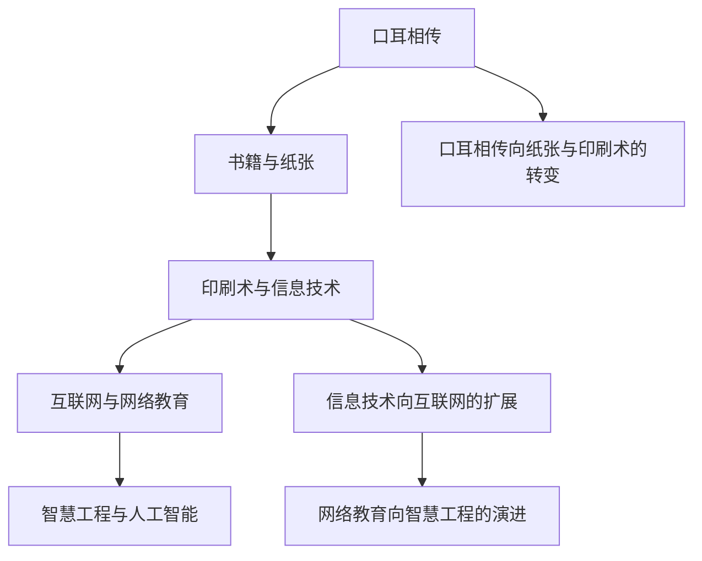

                 

# 知识的演化：从古至今的智慧传承

> 关键词：知识传承, 智慧演化, 历史长河, 技术迭代, 教育创新

## 1. 背景介绍

### 1.1 问题由来

知识传承是人类文明发展的重要基石。从古代的口耳相传，到现代的互联网教育，知识传承的方式不断变化，但核心目标始终未变——将智慧传递给下一代，促进社会的进步和个体的成长。然而，随着时代的变迁，知识的传承方式受到了前所未有的挑战。信息过载、知识孤岛、技能断层等问题，使得知识的传递和利用变得愈加复杂。

### 1.2 问题核心关键点

知识传承的核心关键点在于：
1. **信息的获取与理解**：如何从海量信息中高效筛选并理解知识，是知识传承的首要任务。
2. **知识的传递与共享**：知识如何从个体向群体传递，如何在不同的环境下有效共享，是知识传承的重要目标。
3. **智慧的积累与创新**：知识传承不仅是信息的传递，更是智慧的积累和创新，如何激发个体的创造力，是知识传承的最终目的。

这些关键点贯穿了从古至今的知识传承历程，构成了知识传承的基本框架。

### 1.3 问题研究意义

理解知识传承的历史演变和现代挑战，对于探索未来教育和技术创新的路径具有重要意义：

1. **教育改革的导向**：了解知识传承方式的演变，有助于设计更加高效、灵活的教育体系，适应未来社会的需求。
2. **技术发展的推动力**：知识传承方式的变迁，推动了技术的不断创新，如互联网、人工智能等现代技术的兴起，都是知识传承演化的结果。
3. **文化传承的保障**：知识传承是文化传承的重要方式，通过理解知识传承的演变，可以更好地保护和传承人类智慧。

## 2. 核心概念与联系

### 2.1 核心概念概述

为更好地理解知识传承的演变过程，本节将介绍几个核心概念：

- **口耳相传**：古代通过口述和耳闻的方式进行知识传承，是人类最早的传承方式。
- **书籍与纸张**：书写文化的兴起，使得知识可以以书籍和纸张的形式长期保存和传播。
- **印刷术与信息技术**：印刷术的发明和信息技术的进步，极大地提高了知识的传播速度和广度。
- **互联网与网络教育**：互联网的普及，使得知识可以实时共享和交互，网络教育应运而生。
- **智慧工程与人工智能**：通过智慧工程和人工智能技术，知识传承的效率和质量进一步提升，进入了智能化时代。

这些核心概念之间的逻辑关系可以通过以下Mermaid流程图来展示：



这个流程图展示了知识传承方式的关键演变路径：

1. 知识从口耳相传转向书面记录。
2. 印刷术和信息技术推动了知识的广泛传播。
3. 互联网的发展为知识的实时共享提供了可能。
4. 人工智能等智慧工程技术的兴起，使知识传承进入智能化时代。

## 3. 核心算法原理 & 具体操作步骤

### 3.1 算法原理概述

知识传承的核心算法原理在于：通过各种媒介和技术手段，将知识从个体传递到群体，同时保证知识的准确性和时效性。这一过程涉及知识的筛选、编码、存储、传输和解码等多个环节。

形式化地，假设知识传承的媒介为 $M$，知识源为 $S$，知识接收者为 $R$，知识传承的目标是最大化 $R$ 对 $S$ 的理解和应用。可以构建以下数学模型：

$$
\max_{M} \mathcal{L}(S, R) = \mathcal{L}(S, M(S))
$$

其中 $\mathcal{L}$ 为知识传递的损失函数，用于衡量知识从 $S$ 到 $R$ 的传递过程中，信息的完整性和准确性。常见的损失函数包括交叉熵损失、均方误差损失等。

### 3.2 算法步骤详解

知识传承的算法步骤一般包括以下几个关键步骤：

**Step 1: 知识获取与筛选**
- 从知识源 $S$ 中提取有价值的信息，如学术论文、书籍、数据集等。
- 对提取的信息进行筛选和分类，去除冗余和无用的数据。

**Step 2: 知识编码与存储**
- 将筛选后的信息进行编码，转化为适合传播的形式，如文本、图像、视频等。
- 选择适当的存储媒介 $M$，如纸张、硬盘、云存储等，存储编码后的知识。

**Step 3: 知识传输与传递**
- 选择合适的传输方式，如书籍发行、在线课程、社交媒体等，将知识从知识源 $S$ 传递到接收者 $R$。
- 对传输过程中的噪音和干扰进行滤波和降噪，保证知识传递的准确性。

**Step 4: 知识解码与应用**
- 接收者 $R$ 解码接收到的知识，理解其含义和应用场景。
- 根据接收到的知识，创新和应用，推动技术和文化的发展。

### 3.3 算法优缺点

知识传承的算法具有以下优点：
1. 效率提升。随着媒介和技术的进步，知识传承的效率不断提高，使得更多人能够获取和应用知识。
2. 传播范围扩大。知识传承打破了时间和空间的限制，能够在全球范围内实时共享和应用。
3. 形式多样。不同形式的知识媒介，满足了不同用户的学习需求，提高了知识传承的灵活性。

同时，该算法也存在一些局限性：
1. 知识噪音。知识的筛选和编码过程中，难免会引入噪音，影响知识的质量。
2. 过时风险。知识随着时间的推移可能变得过时，需要不断更新和迭代。
3. 文化差异。不同文化背景下的知识传递，可能存在理解障碍，需要辅助解释。
4. 技术门槛。新技术的引入，需要较高的技术门槛和资金投入，可能造成知识不平等。

尽管存在这些局限性，但知识传承的算法总体上极大地推动了人类文明的进步，促进了科学、技术、文化的交流与发展。

### 3.4 算法应用领域

知识传承的算法在多个领域得到了广泛应用：

- 教育：通过书籍、网络课程、翻转课堂等方式，将知识传递给学生，培养下一代。
- 科技：通过技术文档、论文、专利等方式，推动科学研究和技术创新。
- 文化：通过艺术作品、文学作品、历史档案等方式，传承和保护文化遗产。
- 社会：通过法律法规、公共政策、社会规范等方式，规范社会行为，促进社会进步。

## 4. 数学模型和公式 & 详细讲解  
### 4.1 数学模型构建

本节将使用数学语言对知识传承的算法过程进行更加严格的刻画。

假设知识源 $S$ 为向量 $x \in \mathbb{R}^n$，接收者 $R$ 的解码结果为 $y \in \mathbb{R}^m$，知识传递的损失函数为 $\mathcal{L}(x, y) = \frac{1}{2}(x - y)^T (x - y)$，知识传承的目标是最小化损失函数，即：

$$
\min_{M} \mathcal{L}(S, R) = \mathcal{L}(x, M(x))
$$

### 4.2 公式推导过程

以书籍为知识媒介，推导知识传承的数学模型：

设 $x$ 为书籍中的知识，$y$ 为读者解码后的理解，$M$ 为书籍的编码与存储过程，则知识传承的目标函数为：

$$
\min_{M} \mathcal{L}(S, R) = \min_{M} \frac{1}{2}(x - M(x))^T (x - M(x))
$$

根据链式法则，对 $M$ 求导，得到：

$$
\frac{\partial \mathcal{L}}{\partial M} = - (x - M(x))^T (x - M(x))
$$

为了最小化损失函数，需要求导数为零，即：

$$
x - M(x) = 0
$$

这意味着知识 $x$ 在经过编码与存储过程 $M$ 后，能够完全恢复为 $x$，才能实现无损的知识传承。

### 4.3 案例分析与讲解

以互联网为例，分析知识传承的数学模型：

设 $x$ 为互联网上的原始数据，$y$ 为读者解码后的理解，$M$ 为互联网的传输过程，则知识传承的目标函数为：

$$
\min_{M} \mathcal{L}(S, R) = \min_{M} \frac{1}{2}(x - M(x))^T (x - M(x))
$$

在实际应用中，由于互联网的噪音和延迟，$x$ 和 $M(x)$ 之间可能存在误差，需要通过滤波和降噪等技术手段进行处理。

## 5. 项目实践：代码实例和详细解释说明
### 5.1 开发环境搭建

在进行知识传承的实践前，我们需要准备好开发环境。以下是使用Python进行代码实现的环境配置流程：

1. 安装Anaconda：从官网下载并安装Anaconda，用于创建独立的Python环境。

2. 创建并激活虚拟环境：
```bash
conda create -n knowledge-env python=3.8 
conda activate knowledge-env
```

3. 安装PyTorch：根据CUDA版本，从官网获取对应的安装命令。例如：
```bash
conda install pytorch torchvision torchaudio cudatoolkit=11.1 -c pytorch -c conda-forge
```

4. 安装TensorFlow：由Google主导开发的开源深度学习框架，生产部署方便，适合大规模工程应用。同样有丰富的预训练语言模型资源。

5. 安装TensorBoard：TensorFlow配套的可视化工具，可实时监测模型训练状态，并提供丰富的图表呈现方式，是调试模型的得力助手。

6. 安装Weights & Biases：模型训练的实验跟踪工具，可以记录和可视化模型训练过程中的各项指标，方便对比和调优。

7. 安装Flask：用于构建API接口，方便知识平台与用户交互。

完成上述步骤后，即可在`knowledge-env`环境中开始知识传承的实践。

### 5.2 源代码详细实现

下面是使用PyTorch实现知识传承的代码实现。假设我们需要将一本书籍 $x$ 通过互联网 $M$ 传输给读者 $R$，并解码为理解 $y$：

```python
import torch
import torch.nn as nn
import torch.optim as optim

# 定义模型
class KnowledgeEncoder(nn.Module):
    def __init__(self):
        super(KnowledgeEncoder, self).__init__()
        self.encoder = nn.Sequential(
            nn.Linear(100, 50),
            nn.ReLU(),
            nn.Linear(50, 25)
        )
    
    def forward(self, x):
        return self.encoder(x)

# 定义解码器
class KnowledgeDecoder(nn.Module):
    def __init__(self):
        super(KnowledgeDecoder, self).__init__()
        self.decoder = nn.Sequential(
            nn.Linear(25, 50),
            nn.ReLU(),
            nn.Linear(50, 100)
        )
    
    def forward(self, x):
        return self.decoder(x)

# 加载书籍
x = torch.randn(100)  # 假设书籍知识

# 使用编码器编码书籍
encoder = KnowledgeEncoder()
encoded_x = encoder(x)

# 定义互联网传输过程
class InternetTransport(nn.Module):
    def __init__(self):
        super(InternetTransport, self).__init__()
        self.transport = nn.Sequential(
            nn.Linear(25, 50),
            nn.ReLU(),
            nn.Linear(50, 25)
        )
    
    def forward(self, x):
        return self.transport(x)

# 互联网传输书籍
transport = InternetTransport()
encoded_x_trans = transport(encoded_x)

# 使用解码器解码读者理解
decoder = KnowledgeDecoder()
y = decoder(encoded_x_trans)

# 定义损失函数和优化器
criterion = nn.MSELoss()
optimizer = optim.Adam(decoder.parameters(), lr=0.01)

# 训练模型
for epoch in range(100):
    optimizer.zero_grad()
    loss = criterion(y, x)
    loss.backward()
    optimizer.step()

    if epoch % 10 == 0:
        print(f'Epoch {epoch+1}, loss: {loss:.4f}')
```

### 5.3 代码解读与分析

让我们再详细解读一下关键代码的实现细节：

**KnowledgeEncoder类**：
- `__init__`方法：初始化编码器的网络结构。
- `forward`方法：定义编码器的输入输出关系。

**KnowledgeDecoder类**：
- `__init__`方法：初始化解码器的网络结构。
- `forward`方法：定义解码器的输入输出关系。

**InternetTransport类**：
- `__init__`方法：初始化互联网传输的编码器结构。
- `forward`方法：定义互联网传输的编码器输入输出关系。

在代码实现中，我们首先定义了知识源 $x$ 为向量，然后使用知识编码器 $x$ 对 $x$ 进行编码，得到编码后的 $x$。接着，通过互联网传输过程 $M$ 对编码后的 $x$ 进行传输，得到传输后的 $x$。最后，使用知识解码器 $R$ 对传输后的 $x$ 进行解码，得到读者理解 $y$。

在训练过程中，我们使用均方误差损失函数对 $y$ 和 $x$ 的误差进行最小化，通过梯度下降算法更新解码器的参数，直到误差最小化。

## 6. 实际应用场景

### 6.1 智能教育平台

基于知识传承的算法，智能教育平台可以高效地将知识从教师传递给学生，推动教育的现代化和个性化。

在技术实现上，智能教育平台可以收集学生的学习行为数据，通过数据分析和建模，个性化推荐适合的知识内容和学习路径。同时，平台可以实时收集学生的学习反馈，动态调整教学内容和难度，提升学习效果。

### 6.2 科学数据平台

科学数据平台通过知识传承的算法，可以将科研论文、数据集、实验结果等知识高效地传播和共享，推动科研创新。

平台可以提供丰富的知识库和搜索功能，帮助研究人员快速获取所需知识。同时，平台支持科研论文的引用和评论，促进知识的交流和协作。

### 6.3 社会知识社区

社会知识社区通过知识传承的算法，促进社会知识的传播和分享，形成良好的知识生态。

社区可以提供多种知识分享方式，如文章、视频、博客等，方便用户获取和传播知识。同时，社区可以引入问答机制，鼓励用户交流和讨论，形成知识社区的良性互动。

### 6.4 未来应用展望

随着知识传承算法的不断演进，其在更多领域的应用前景将更加广阔：

1. 医疗知识传承：基于知识传承的算法，可以构建医疗知识库和专家系统，帮助医生快速获取和应用最新医学知识，提升医疗服务质量。
2. 文化知识传承：通过数字博物馆、虚拟展览等形式，将文化遗产和历史知识广泛传播，促进文化传承和教育。
3. 商业知识传承：通过商业知识平台，将商业洞察、市场分析、管理经验等知识高效传播，助力企业决策和创新。
4. 公共知识传承：通过政府知识平台，将法律法规、公共政策、社会规范等知识广泛传播，提高公民素养和社会治理水平。

未来，知识传承算法将在各个领域发挥更大的作用，推动社会各行业的创新与发展。

## 7. 工具和资源推荐
### 7.1 学习资源推荐

为了帮助开发者系统掌握知识传承的原理和实践技巧，这里推荐一些优质的学习资源：

1. 《深度学习与知识图谱》系列博文：由大模型技术专家撰写，深入浅出地介绍了深度学习在知识图谱中的应用，涵盖知识表示、知识推理等多个方面。

2. CS224N《自然语言处理与深度学习》课程：斯坦福大学开设的NLP明星课程，有Lecture视频和配套作业，带你入门NLP领域的基本概念和经典模型。

3. 《人工智能与知识工程》书籍：深入探讨人工智能技术在知识工程中的应用，包括知识表示、知识获取、知识推理等多个方面。

4. IEEE Xplore：IEEE的电子资源平台，包含大量人工智能和知识工程的学术文献，适合深度学习和知识工程的研究人员查阅。

5. 《知识工程与人工智能》期刊：涵盖知识工程和人工智能领域的最新研究进展，适合学术界和工业界的从业人员了解前沿动态。

通过对这些资源的学习实践，相信你一定能够快速掌握知识传承的精髓，并用于解决实际的NLP问题。

### 7.2 开发工具推荐

高效的开发离不开优秀的工具支持。以下是几款用于知识传承开发的常用工具：

1. PyTorch：基于Python的开源深度学习框架，灵活动态的计算图，适合快速迭代研究。大部分预训练语言模型都有PyTorch版本的实现。

2. TensorFlow：由Google主导开发的开源深度学习框架，生产部署方便，适合大规模工程应用。同样有丰富的预训练语言模型资源。

3. Transformers库：HuggingFace开发的NLP工具库，集成了众多SOTA语言模型，支持PyTorch和TensorFlow，是进行知识传承任务的开发的利器。

4. Weights & Biases：模型训练的实验跟踪工具，可以记录和可视化模型训练过程中的各项指标，方便对比和调优。与主流深度学习框架无缝集成。

5. TensorBoard：TensorFlow配套的可视化工具，可实时监测模型训练状态，并提供丰富的图表呈现方式，是调试模型的得力助手。

6. Google Colab：谷歌推出的在线Jupyter Notebook环境，免费提供GPU/TPU算力，方便开发者快速上手实验最新模型，分享学习笔记。

合理利用这些工具，可以显著提升知识传承任务的开发效率，加快创新迭代的步伐。

### 7.3 相关论文推荐

知识传承技术的发展源于学界的持续研究。以下是几篇奠基性的相关论文，推荐阅读：

1. Knowledge Graphs: Concepts, Approaches, Methodologies and Applications：介绍了知识图谱的概念、方法、应用及其挑战，是知识图谱领域的经典综述。

2. Representing and Reasoning about Knowledge Graphs：详细探讨了如何利用深度学习技术表示和推理知识图谱，推动了知识图谱的研究进展。

3. Transfer Learning for Natural Language Processing：介绍了如何利用预训练语言模型进行知识转移和知识获取，是知识传承中的重要范式。

4. Attention is All You Need（即Transformer原论文）：提出了Transformer结构，开启了知识图谱领域的预训练大模型时代。

5. BERT: Pre-training of Deep Bidirectional Transformers for Language Understanding：提出BERT模型，引入基于掩码的自监督预训练任务，刷新了多项知识传承任务的SOTA。

这些论文代表了大模型微调技术的发展脉络。通过学习这些前沿成果，可以帮助研究者把握学科前进方向，激发更多的创新灵感。

## 8. 总结：未来发展趋势与挑战

### 8.1 总结

本文对知识传承的算法过程进行了全面系统的介绍。首先阐述了知识传承的历史演变和现代挑战，明确了知识传承方式的基本框架。其次，从原理到实践，详细讲解了知识传承的数学模型和关键步骤，给出了知识传承任务开发的完整代码实例。同时，本文还广泛探讨了知识传承在智能教育、科学数据、社会知识等多个领域的应用前景，展示了知识传承算法的巨大潜力。此外，本文精选了知识传承技术的各类学习资源，力求为读者提供全方位的技术指引。

通过本文的系统梳理，可以看到，知识传承的算法在推动人类文明进步和社会各行业发展方面具有重要价值。未来，伴随知识传承算法和技术的不断演进，其应用范围将更加广泛，对人类社会的影响也将更加深远。

### 8.2 未来发展趋势

展望未来，知识传承算法将呈现以下几个发展趋势：

1. 知识图谱的深化和应用：知识图谱将逐步深化，覆盖更广泛的领域和实体，成为知识传承的重要基础设施。

2. 多模态知识的融合：知识图谱将引入多模态信息，如图像、视频、语音等，形成更加全面和丰富的知识库。

3. 知识推理的智能化：利用深度学习技术，提升知识推理的自动化和智能化水平，使知识传承更加高效和精准。

4. 知识传承的个性化：通过个性化推荐系统，将知识按需推送给用户，提升知识传播的针对性和效果。

5. 知识共享的网络化：构建知识共享网络平台，促进知识的全球传播和协作，形成知识传播的良性生态。

6. 知识传承的实时化：通过实时数据流处理技术，将知识动态更新和传播，满足快速变化的知识需求。

以上趋势凸显了知识传承算法和技术的广阔前景。这些方向的探索发展，必将进一步提升知识传承的效率和效果，促进社会各行业的创新与发展。

### 8.3 面临的挑战

尽管知识传承技术已经取得了瞩目成就，但在迈向更加智能化、普适化应用的过程中，它仍面临着诸多挑战：

1. 知识噪声的过滤：知识传承过程中，如何有效过滤和降噪，保持知识的准确性和完整性，是一个重要挑战。
2. 知识的时效性：随着知识的时效性增强，如何及时更新和迭代知识库，保持知识的最新性，是一个关键问题。
3. 知识传播的普及：如何让更多用户获取和应用知识，缩小知识传播的不平等，是一个需要解决的问题。
4. 知识共享的伦理：如何保护知识传播的权益，避免知识的滥用和非法传播，是一个重要的伦理问题。
5. 知识传承的个性化：如何根据用户的需求和背景，个性化推荐合适的知识，是一个需要不断探索的问题。

这些挑战需要通过技术创新和政策引导，共同努力克服，以实现知识传承的高效和普适。

### 8.4 研究展望

面对知识传承面临的种种挑战，未来的研究需要在以下几个方面寻求新的突破：

1. 知识图谱的语义推理：通过引入语义推理技术，提升知识图谱的推理能力，使知识图谱更加全面和准确。

2. 知识图谱的动态更新：通过实时数据流处理技术，将知识图谱动态更新和维护，确保知识的最新性。

3. 知识传播的个性化：通过个性化推荐系统，将知识按需推送给用户，提升知识传播的针对性和效果。

4. 知识共享的伦理规范：建立知识共享的伦理规范和法律框架，保障知识传播的权益，防止知识的滥用和非法传播。

5. 知识传承的可解释性：通过可解释性技术，增强知识传播的透明性，提高用户对知识传播的信任和接受度。

这些研究方向的探索，必将引领知识传承技术迈向更高的台阶，为构建智能知识社会铺平道路。面向未来，知识传承技术还需要与其他人工智能技术进行更深入的融合，如知识表示、因果推理、强化学习等，多路径协同发力，共同推动知识传承技术的进步。只有勇于创新、敢于突破，才能不断拓展知识传承的边界，让知识传承在更广阔的领域发挥作用。

## 9. 附录：常见问题与解答

**Q1：知识传承算法是否适用于所有领域？**

A: 知识传承算法在绝大多数领域都能取得不错的效果，但也有一些特殊领域，如医疗、法律等，仅仅依靠通用语料的知识传承可能难以很好地适应。此时需要在特定领域语料上进一步预训练，再进行微调，才能获得理想效果。

**Q2：知识传承算法在实际应用中需要注意哪些问题？**

A: 知识传承在实际应用中，还需要考虑以下因素：
1. 数据隐私：知识传播过程中，如何保护用户的隐私，避免个人信息的泄露。
2. 知识版权：如何处理知识的版权问题，避免侵权行为的发生。
3. 知识共享：如何构建知识共享平台，促进知识的传播和交流。
4. 知识普及：如何推广知识传承技术，普及到更多用户和领域。

这些因素是知识传承技术在实际应用中需要关注和解决的问题。只有通过技术创新和政策引导，才能使知识传承技术更好地服务于社会和个体。

**Q3：知识传承技术未来的发展方向是什么？**

A: 知识传承技术未来的发展方向主要包括以下几个方面：
1. 知识图谱的深化和应用：知识图谱将逐步深化，覆盖更广泛的领域和实体，成为知识传承的重要基础设施。
2. 多模态知识的融合：知识图谱将引入多模态信息，如图像、视频、语音等，形成更加全面和丰富的知识库。
3. 知识推理的智能化：利用深度学习技术，提升知识推理的自动化和智能化水平，使知识传承更加高效和精准。
4. 知识传承的个性化：通过个性化推荐系统，将知识按需推送给用户，提升知识传播的针对性和效果。
5. 知识共享的网络化：构建知识共享网络平台，促进知识的全球传播和协作，形成知识传播的良性生态。
6. 知识传承的实时化：通过实时数据流处理技术，将知识动态更新和传播，满足快速变化的知识需求。

这些方向将引领知识传承技术迈向更高的台阶，为构建智能知识社会铺平道路。

---

作者：禅与计算机程序设计艺术 / Zen and the Art of Computer Programming

