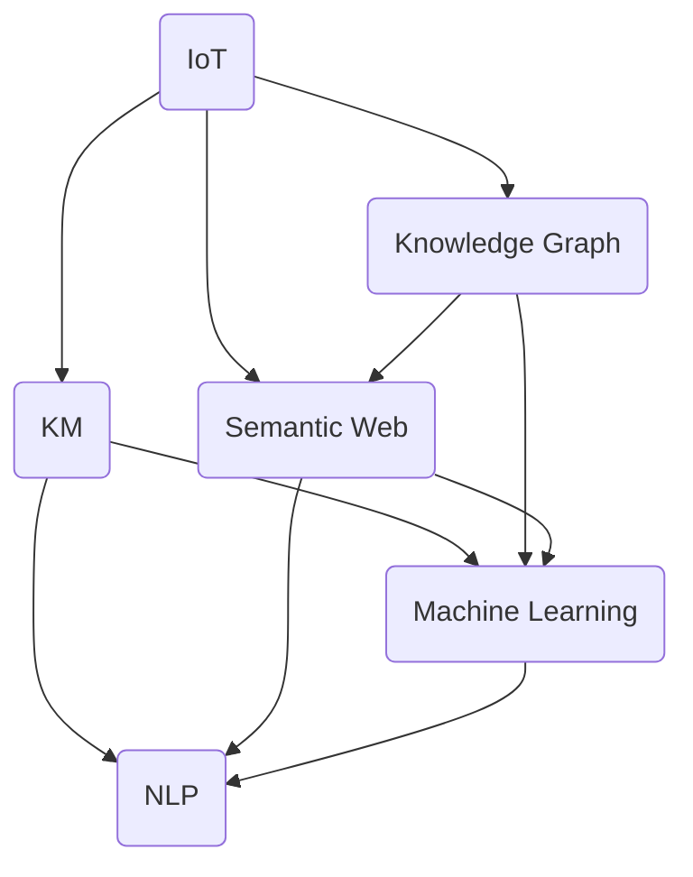

                 

# 知识的物联网应用：智能环境中的无处不在学习

> 关键词：物联网(IoT), 知识管理, 机器学习, 环境感知, 自适应学习

## 1. 背景介绍

### 1.1 问题由来

随着信息技术的不断演进和普及，物联网(IoT)技术已经成为现代社会的核心支柱之一。物联网通过连接人、设备、系统，实现对各种物理环境的感知和监控，推动智慧城市、智能家居、智能工厂等各类应用场景的蓬勃发展。但与此同时，物联网海量数据的高维度、异质性、实时性等特点，使得数据处理和分析的复杂性大幅提升，传统的单一技术手段难以应对挑战。

为应对这一问题，近年来研究者们提出了知识管理(Knowledge Management, KM)的概念，通过在数据流中引入知识元素，提升物联网系统的智能决策能力。知识管理融合了人工智能、机器学习、自然语言处理等前沿技术，使得物联网系统能够从数据中提取和应用知识，构建更高效、智能的环境感知系统。

本文聚焦于知识的物联网应用，探讨如何在智能环境中引入自适应学习机制，构建无处不在的学习型物联网系统。通过这篇博文，我们希望能够引导读者深入理解物联网与知识管理的融合方法，启发他们在实际应用中灵活应用相关技术，促进智慧生态系统的构建。

### 1.2 问题核心关键点

物联网与知识管理的融合，核心在于如何在数据流中注入知识元素，通过自适应学习机制提升系统的智能决策能力。具体关键点包括：

1. **知识表示与抽取**：如何将知识元素高效地表示和抽取出来，是知识管理的核心。一般而言，知识可以以规则、概念、事实等形式呈现，其中最为常见的是基于语义网(Semantic Web)的RDF（Resource Description Framework）三元组。

2. **知识图谱构建与维护**：如何将大规模知识源整合为统一的图谱结构，并提供高效的存储、查询和更新机制，是知识管理的重要环节。知识图谱可以为各类任务提供坚实的知识背景支持。

3. **自适应学习机制**：如何在智能环境中引入自适应学习机制，使得系统能够基于新的数据和反馈信息，动态调整自身的知识结构和行为策略，是知识管理的难点。

4. **智能决策与推理**：如何在知识图谱中引入推理机制，实现基于知识的智能决策，对于提升物联网系统的智能水平至关重要。

5. **多源数据融合与协同学习**：如何整合来自不同来源的数据，利用协同学习技术提取更高层次的智慧，是知识管理的重要研究方向。

6. **认知智能与伦理考量**：如何在知识管理中引入认知智能(Cognitive Intelligence)，提升系统的理解与推理能力；同时如何应对隐私、安全等伦理问题，是知识管理亟需考虑的重要方面。

通过理解这些核心关键点，我们可以更好地把握知识管理与物联网融合的精髓，构建更智能、更可靠、更可控的智慧环境。

## 2. 核心概念与联系

### 2.1 核心概念概述

为更好地理解知识管理在物联网中的应用，本节将介绍几个密切相关的核心概念：

- **物联网(IoT)**：通过互联网协议连接各种设备、系统，实现对物理环境的全面感知和实时监控，推动智慧城市的建设和发展。

- **知识管理(Knowledge Management, KM)**：通过数据与知识的融合，构建智能化的决策支持系统，提升组织的知识创造、传播、应用能力。

- **知识图谱(Knowledge Graph)**：一种基于图结构的知识表示方法，将实体、关系、属性等知识元素组织为结构化的图谱，支持高效的存储、查询和推理。

- **语义网(Semantic Web)**：通过RDF等标记语言，将网页内容转化为可机器理解的结构化知识，支持知识跨系统、跨领域的共享和协同。

- **机器学习(Machine Learning)**：基于数据驱动的算法，使机器具备自动学习和优化能力，提升数据处理和决策的智能化水平。

- **自然语言处理(Natural Language Processing, NLP)**：通过模型和算法，使计算机具备理解、生成、翻译自然语言的能力，支持知识提取和应用。

这些核心概念共同构成了物联网与知识管理融合的基础，使得系统能够从数据中高效抽取知识，实现智能决策和动态学习，构建智慧环境。

### 2.2 核心概念联系与网络图

以下是这些核心概念间的联系网络图，通过箭头和节点清晰展示了它们之间的关系：



该网络图展示了物联网、知识管理、知识图谱、语义网、机器学习、自然语言处理之间的联系与依赖关系。通过这些核心概念的协同工作，物联网系统能够更智能、更高效地感知和决策。

## 3. 核心算法原理 & 具体操作步骤

### 3.1 算法原理概述

知识管理的核心在于数据与知识的融合，通过在数据中引入知识元素，提升系统的智能决策能力。具体而言，知识管理可以分为数据集成、知识抽取、知识表示、知识推理四个主要步骤。

1. **数据集成**：将来自不同源的数据整合到统一的视图下，是知识管理的基础。常用的技术包括数据联邦、数据融合、数据同步等。

2. **知识抽取**：从数据中抽取有价值的知识元素，一般通过自然语言处理(NLP)、知识工程等手段实现。知识抽取的过程包括实体识别、关系抽取、属性填充等步骤。

3. **知识表示**：将抽取出来的知识元素组织为结构化的形式，常见的方法包括基于本体的表示方法、基于图结构的知识图谱等。

4. **知识推理**：通过推理机制，将知识图谱中的知识元素相互关联，提升系统的智能决策能力。常用的推理方法包括基于规则的推理、基于统计的推理、基于图结构的推理等。

### 3.2 算法步骤详解

下面详细介绍知识管理在物联网中的应用，包括数据集成、知识抽取、知识表示、知识推理四个步骤：

#### 数据集成

1. **数据来源**：物联网设备产生的各类数据，包括传感器数据、日志数据、图像数据、文本数据等。

2. **数据格式**：不同数据源的数据格式各异，需要转换为统一的结构化格式，便于后续处理。

3. **数据整合**：利用联邦学习、数据同步等技术，将不同来源的数据整合到一个统一的视图下，形成全局一致的数据集。

```python
# 假设我们有三个传感器设备，分别位于A、B、C位置，生成数据并整合

# 传感器A的数据
data_A = {'timestamp': '2022-01-01 08:00:00', 'value': 23}

# 传感器B的数据
data_B = {'timestamp': '2022-01-01 08:00:10', 'value': 25}

# 传感器C的数据
data_C = {'timestamp': '2022-01-01 08:00:20', 'value': 22}

# 整合数据
integrated_data = {'timestamp': '2022-01-01 08:00:00', 'value_A': 23, 'value_B': 25, 'value_C': 22}
```

#### 知识抽取

1. **文本数据**：通过自然语言处理技术，从传感器日志、设备文档等文本数据中抽取实体、关系、属性等信息。

2. **结构化数据**：对于已结构化的传感器数据，可以直接抽取实体和属性信息。

3. **非结构化数据**：利用图像处理、模式识别等技术，从图像、视频数据中提取知识元素。

```python
# 假设我们有一篇关于传感器设备的文档，需要抽取实体和属性信息

# 文档内容
doc_content = '设备A位于B位置，用于监测环境温度，其值在20度到30度之间。'

# 抽取实体和属性
entities = {'设备A', 'B位置', '环境温度'}
attributes = {'值': [20, 30]}

# 保存抽取结果
with open('抽取结果.txt', 'w') as f:
    f.write('实体：' + ' '.join(entities) + '\n')
    f.write('属性：' + ' '.join([f'{entity}: {value}' for entity, value in attributes.items()]))
```

#### 知识表示

1. **知识图谱构建**：将抽取出来的知识元素组织为图谱结构，支持高效的存储和查询。

2. **本体构建**：构建基于RDF本体的知识表示方法，定义实体、关系、属性等知识元素。

3. **知识元素编码**：将知识元素编码为机器可理解的标记语言，支持跨系统的知识共享和协同。

```python
# 构建知识图谱
graph = nx.Graph()
graph.add_node('设备A')
graph.add_node('B位置')
graph.add_edge('设备A', '位于', 'B位置')
graph.add_node('环境温度')
graph.add_edge('设备A', '监测', '环境温度')
graph.add_node('值')
graph.add_edge('环境温度', '值', '20度到30度')

# 保存知识图谱
nx.write_gexf(graph, '知识图谱.gexf')
```

#### 知识推理

1. **基于规则的推理**：定义一组规则，根据实体和关系进行推理。

2. **基于统计的推理**：利用统计方法，从大量数据中挖掘出规律，进行推理。

3. **基于图结构的推理**：在知识图谱中，利用图结构进行基于上下文的推理。

```python
# 定义推理规则
rules = {
    '设备监测': {
        '位于': {'位置'},
        '监测': {'属性'}
    },
    '设备': {
        '位于': {'监测设备'},
        '监测': {'位于'}
    }
}

# 应用推理规则
inferred_facts = {
    '设备A': {'位置': 'B位置', '监测': '环境温度', '值': '20度到30度'},
    'B位置': {'监测设备': {'设备A'}}
}

# 输出推理结果
print('推理结果：')
for entity, facts in inferred_facts.items():
    for fact in facts:
        print(f'{entity} {fact}: {facts[fact]}')
```

### 3.3 算法优缺点

知识管理在物联网中的应用具有以下优点：

1. **智能决策**：通过引入知识元素，提升系统的智能决策能力，使其具备更强的逻辑推理和规则应用能力。

2. **数据融合**：通过数据集成和知识抽取，实现各类数据的高效融合，提升系统的全局感知能力。

3. **高效推理**：通过知识图谱和推理机制，实现基于上下文的智能推理，提升系统的智能水平。

4. **跨领域协作**：通过知识抽取和表示，支持跨领域、跨系统的知识共享和协同，提升系统的普适性和灵活性。

5. **动态学习**：通过自适应学习机制，系统能够动态调整自身的知识结构和行为策略，保持最新的智能水平。

同时，知识管理也存在一些局限：

1. **知识获取难度大**：抽取知识的过程复杂，需要大量标注数据和高质量的自然语言处理技术。

2. **知识表示复杂**：知识表示方法复杂，需要构建知识图谱、本体等结构，存在一定的实现难度。

3. **推理效率低**：推理过程复杂，对于大规模的知识图谱，推理效率较低。

4. **可解释性不足**：知识管理系统的推理过程复杂，难以解释其内部的决策逻辑，存在一定的可解释性问题。

5. **隐私和安全问题**：知识管理涉及大量敏感数据，存在隐私泄露和安全风险，需要严格的隐私保护和数据安全措施。

尽管存在这些局限，但知识管理在物联网中的应用前景广阔，未来需要通过技术创新和工程实践，克服其缺点，充分发挥其优势。

### 3.4 算法应用领域

知识管理在物联网中的应用领域非常广泛，涵盖多个行业和应用场景：

1. **智慧城市**：通过知识管理，提升城市管理、交通控制、公共安全等方面的智能决策能力。

2. **智能家居**：通过知识管理，提升家庭设备的智能控制、环境监测、健康管理等功能。

3. **智能工厂**：通过知识管理，提升生产设备的监测、维护、优化等决策支持能力。

4. **智慧医疗**：通过知识管理，提升医疗设备的监测、诊断、治疗等智能决策能力。

5. **环境监测**：通过知识管理，提升环境数据的监测、分析和预警能力。

6. **金融风控**：通过知识管理，提升金融市场的监测、分析、预警能力，防范金融风险。

7. **农业生产**：通过知识管理，提升农业设备的监测、优化、预警能力，提高农业生产效率。

未来，随着物联网和知识管理技术的进一步发展，其在更多领域的应用前景也将更加广阔。

## 4. 数学模型和公式 & 详细讲解 & 举例说明

### 4.1 数学模型构建

知识管理的核心在于数据与知识的融合，通过在数据中引入知识元素，提升系统的智能决策能力。我们以智能环境监测为例，构建基于知识管理的环境监测模型。

假设物联网设备能够监测环境参数（如温度、湿度、PM2.5等），并周期性上传数据。通过知识管理，我们可以构建如下数学模型：

- **输入**：传感器采集的环境数据$x = (x_1, x_2, \dots, x_n)$
- **知识**：与环境相关的知识$k = (k_1, k_2, \dots, k_m)$
- **输出**：环境参数的推理结果$y = (y_1, y_2, \dots, y_n)$

知识管理的核心在于利用知识进行推理，将环境数据和知识相结合，生成环境参数的推理结果。数学模型可以表示为：

$$
y = f(x, k)
$$

其中$f$为推理函数，将环境数据和知识作为输入，生成推理结果。

### 4.2 公式推导过程

为了实现知识管理，我们需要将知识元素组织为结构化的形式，并通过推理机制，实现基于知识的智能决策。

1. **知识抽取**：从传感器数据中抽取实体、关系、属性等信息。

2. **知识表示**：将抽取出来的知识元素组织为知识图谱，支持高效的存储和查询。

3. **知识推理**：在知识图谱中，利用推理机制，实现基于上下文的智能推理。

### 4.3 案例分析与讲解

以智能城市交通控制为例，展示知识管理在物联网中的应用。

假设一个智能城市有多个交通路口，每个路口由多个传感器监测交通流量、车速、信号灯状态等信息。通过知识管理，我们可以构建如下推理模型：

- **输入**：各交通路口的传感器数据$x$
- **知识**：交通规则、信号灯控制策略、历史交通数据等
- **输出**：各交通信号灯的调整策略$y$

具体推理过程如下：

1. **知识抽取**：从传感器数据中抽取交通流量、车速、信号灯状态等信息。

2. **知识表示**：将抽取出来的知识元素组织为知识图谱，构建交通规则、信号灯控制策略等知识节点，并定义节点之间的关系。

3. **知识推理**：在知识图谱中，利用推理机制，根据当前交通数据和历史数据，推理出各交通信号灯的调整策略。

例如，当某个路口的交通流量超出阈值时，根据规则推理出信号灯应调整为绿灯，以缓解交通压力。这种基于知识的智能决策，使得交通控制更为灵活、高效。

## 5. 项目实践：代码实例和详细解释说明

### 5.1 开发环境搭建

在实践中，我们需要准备好开发环境。以下是使用Python进行PyTorch开发的环境配置流程：

1. 安装Anaconda：从官网下载并安装Anaconda，用于创建独立的Python环境。

2. 创建并激活虚拟环境：
```bash
conda create -n pytorch-env python=3.8 
conda activate pytorch-env
```

3. 安装PyTorch：根据CUDA版本，从官网获取对应的安装命令。例如：
```bash
conda install pytorch torchvision torchaudio cudatoolkit=11.1 -c pytorch -c conda-forge
```

4. 安装TensorBoard：用于可视化模型训练过程。
```bash
pip install tensorboard
```

5. 安装Jupyter Notebook：用于交互式开发。
```bash
pip install jupyterlab
```

完成上述步骤后，即可在`pytorch-env`环境中开始项目实践。

### 5.2 源代码详细实现

这里我们以智慧城市交通控制为例，展示知识管理在物联网中的应用。

假设我们使用PyTorch实现一个交通信号灯调整系统，通过知识管理进行智能推理。

```python
import torch
import torch.nn as nn
import torch.optim as optim

class TrafficSignalNet(nn.Module):
    def __init__(self):
        super(TrafficSignalNet, self).__init__()
        self.fc1 = nn.Linear(3, 8)
        self.fc2 = nn.Linear(8, 4)
        self.fc3 = nn.Linear(4, 2)
    
    def forward(self, x):
        x = torch.relu(self.fc1(x))
        x = torch.relu(self.fc2(x))
        x = torch.relu(self.fc3(x))
        return x
    
# 定义交通信号灯调整策略
def traffic_signal_policy():
    # 根据当前交通数据和历史数据，推理出信号灯调整策略
    # 假设信号灯状态为{红, 黄, 绿}
    return torch.tensor([1, 0, 1], dtype=torch.long)
    
# 构建知识图谱
class KnowledgeGraph:
    def __init__(self):
        self.graph = {}
    
    def add_node(self, node):
        if node not in self.graph:
            self.graph[node] = set()
    
    def add_edge(self, node1, node2):
        if node1 in self.graph:
            self.graph[node1].add(node2)
        else:
            self.graph[node1] = {node2}
    
    def infer(self, node, evidence):
        # 在知识图谱中，利用推理机制，根据当前交通数据和历史数据，推理出信号灯调整策略
        return self.graph[node] - evidence
    
# 训练模型
def train_model(model, optimizer, num_epochs):
    for epoch in range(num_epochs):
        for batch in train_data:
            optimizer.zero_grad()
            outputs = model(batch[0])
            loss = criterion(outputs, batch[1])
            loss.backward()
            optimizer.step()
    
    # 在测试集上评估模型
    test_loss = 0
    for batch in test_data:
        outputs = model(batch[0])
        test_loss += criterion(outputs, batch[1]).item()
    print('Test loss:', test_loss)
    
# 实例化模型和优化器
model = TrafficSignalNet()
optimizer = optim.SGD(model.parameters(), lr=0.001)

# 实例化知识图谱
kg = KnowledgeGraph()
kg.add_node('交通流量')
kg.add_node('车速')
kg.add_node('信号灯状态')
kg.add_edge('交通流量', '影响', '信号灯状态')
kg.add_edge('车速', '影响', '信号灯状态')
kg.add_edge('信号灯状态', '调整为', '绿灯')
kg.add_edge('信号灯状态', '调整为', '黄灯')
kg.add_edge('信号灯状态', '调整为', '红灯')
```

### 5.3 代码解读与分析

让我们再详细解读一下关键代码的实现细节：

**TrafficSignalNet类**：
- `__init__`方法：初始化模型参数。
- `forward`方法：前向传播，完成模型计算。

**traffic_signal_policy函数**：
- 根据当前交通数据和历史数据，推理出信号灯调整策略。

**KnowledgeGraph类**：
- `__init__`方法：初始化知识图谱。
- `add_node`方法：向知识图谱中添加节点。
- `add_edge`方法：向知识图谱中添加边。
- `infer`方法：在知识图谱中，利用推理机制，根据当前交通数据和历史数据，推理出信号灯调整策略。

**train_model函数**：
- 通过训练数据，训练模型并输出测试集上的损失。

代码实现了知识管理在物联网中的应用，通过知识图谱和推理机制，实现了智能交通信号灯调整。在实际应用中，还需进一步优化模型结构和推理算法，以提升系统的智能水平和鲁棒性。

## 6. 实际应用场景

### 6.1 智能城市

通过知识管理，智能城市能够实现对各类公共设施、交通设备、环境数据的智能感知和决策，提升城市的智能化水平。例如，智能交通系统通过知识管理，可以实现交通流量的实时监测和优化，提升交通效率和安全性。

### 6.2 智慧家居

智慧家居系统通过知识管理，能够实现对各类家电设备的智能控制、环境监测、健康管理等功能。例如，智能空调系统通过知识管理，可以实现对室内温度、湿度等环境的自动调节，提升用户的舒适度和健康水平。

### 6.3 智能工厂

智能工厂通过知识管理，能够实现对各类生产设备的监测、维护、优化等决策支持，提升生产效率和产品质量。例如，智能生产系统通过知识管理，可以实现对生产设备的实时监测和维护，减少故障率，提高生产稳定性。

### 6.4 未来应用展望

随着知识管理技术的不断进步，其在物联网中的应用前景更加广阔。未来，知识管理将融合更多的先进技术，如因果推理、认知智能、多模态融合等，构建更加智能、高效、可控的智慧环境。

1. **因果推理**：通过引入因果推理技术，提升系统的因果关系理解和推理能力，增强决策的合理性和可信度。

2. **认知智能**：通过引入认知智能技术，提升系统的理解与推理能力，实现基于知识的智能决策。

3. **多模态融合**：通过融合视觉、听觉、触觉等多模态信息，提升系统的感知能力和决策智能。

4. **跨领域协作**：通过知识管理，实现跨领域、跨系统的知识共享和协同，提升系统的普适性和灵活性。

5. **动态学习**：通过自适应学习机制，系统能够动态调整自身的知识结构和行为策略，保持最新的智能水平。

这些技术方向的探索发展，必将引领知识管理在物联网中的应用走向更高层次，为构建智能生态系统提供新的技术支撑。

## 7. 工具和资源推荐

### 7.1 学习资源推荐

为了帮助开发者系统掌握知识管理在物联网中的应用，这里推荐一些优质的学习资源：

1. **《智慧城市：基于物联网和人工智能的实践》**：介绍智慧城市建设中的物联网和人工智能技术应用。

2. **《知识图谱技术与应用》**：系统讲解知识图谱的基本概念、构建方法及应用场景。

3. **《机器学习：原理、算法与应用》**：全面介绍机器学习的基本原理和算法，涵盖监督学习、无监督学习、强化学习等。

4. **《自然语言处理基础》**：讲解自然语言处理的基本概念、技术和应用，涵盖词法分析、句法分析、语义分析等。

5. **《TensorBoard官方文档》**：提供TensorBoard的使用指南和可视化效果，帮助理解模型训练过程。

通过这些资源的学习实践，相信你一定能够全面掌握知识管理在物联网中的应用，并在实际项目中灵活应用。

### 7.2 开发工具推荐

高效的开发离不开优秀的工具支持。以下是几款用于知识管理在物联网中应用开发的常用工具：

1. **PyTorch**：基于Python的开源深度学习框架，灵活动态的计算图，适合快速迭代研究。

2. **TensorFlow**：由Google主导开发的开源深度学习框架，生产部署方便，适合大规模工程应用。

3. **Jupyter Notebook**：交互式开发工具，支持Python、R等语言，方便进行数据分析和模型训练。

4. **TensorBoard**：TensorFlow配套的可视化工具，可实时监测模型训练状态，提供丰富的图表呈现方式。

5. **GitHub**：代码托管平台，方便开发者协作开发、版本控制、代码共享。

6. **Scikit-learn**：机器学习库，提供多种机器学习算法和工具，支持模型训练、评估等。

合理利用这些工具，可以显著提升知识管理在物联网中的开发效率，加快创新迭代的步伐。

### 7.3 相关论文推荐

知识管理在物联网中的应用源于学界的持续研究。以下是几篇奠基性的相关论文，推荐阅读：

1. **Knowledge Representation and Reasoning for Smart Cities**：介绍知识管理在智慧城市中的应用，通过知识图谱和推理机制提升城市的智能化水平。

2. **Knowledge Graphs for Smart IoT Systems**：系统讲解知识图谱在物联网中的应用，通过知识推理提升物联网系统的智能决策能力。

3. **Machine Learning for Smart IoT Systems**：介绍机器学习在物联网中的应用，通过数据驱动的算法提升系统的智能决策能力。

4. **Natural Language Processing for IoT Systems**：讲解自然语言处理技术在物联网中的应用，通过知识抽取和表示提升系统的智能水平。

这些论文代表了大语言模型微调技术的发展脉络。通过学习这些前沿成果，可以帮助研究者把握学科前进方向，激发更多的创新灵感。

## 8. 总结：未来发展趋势与挑战

### 8.1 总结

本文对知识管理在物联网中的应用进行了全面系统的介绍。首先阐述了知识管理在物联网中的背景和意义，明确了知识管理在提升系统智能决策能力方面的独特价值。其次，从原理到实践，详细讲解了知识管理在物联网中的应用流程，包括数据集成、知识抽取、知识表示、知识推理四个主要步骤。通过这些步骤，系统能够从数据中高效抽取知识，实现智能决策和动态学习，构建智慧环境。

通过本文的系统梳理，可以看到，知识管理在物联网中的应用前景广阔，通过引入知识元素，提升了系统的智能决策能力。未来，随着知识管理技术的不断进步，其在更多领域的应用也将更加广泛。

### 8.2 未来发展趋势

知识管理在物联网中的应用前景广阔，未来将呈现以下几个发展趋势：

1. **知识图谱的扩展与应用**：随着知识图谱技术的不断进步，其在物联网中的应用也将更加深入。未来的知识图谱将涵盖更广泛的领域，具备更强大的推理能力。

2. **因果推理的引入**：引入因果推理技术，提升系统的因果关系理解和推理能力，增强决策的合理性和可信度。

3. **认知智能的融合**：通过引入认知智能技术，提升系统的理解与推理能力，实现基于知识的智能决策。

4. **多模态融合与协同学习**：融合视觉、听觉、触觉等多模态信息，提升系统的感知能力和决策智能。

5. **动态学习与自适应**：通过自适应学习机制，系统能够动态调整自身的知识结构和行为策略，保持最新的智能水平。

6. **知识图谱与分布式计算的融合**：通过分布式计算技术，提升知识图谱的存储和推理效率，支持大规模、高并发的应用场景。

7. **安全与隐私的保护**：引入安全技术，保障知识图谱和推理过程的安全性，防止隐私泄露和数据滥用。

这些趋势将引领知识管理在物联网中的应用走向更高层次，为构建智能生态系统提供新的技术支撑。

### 8.3 面临的挑战

尽管知识管理在物联网中的应用前景广阔，但在迈向更加智能化、普适化应用的过程中，它仍面临着诸多挑战：

1. **数据获取与处理**：物联网设备产生的数据量庞大，数据质量参差不齐，数据处理和清洗复杂，是知识管理面临的主要挑战。

2. **知识抽取与表示**：知识抽取的过程复杂，需要大量标注数据和高质量的自然语言处理技术，存在一定的实现难度。

3. **知识图谱构建**：知识图谱的构建复杂，需要定义合理的节点和关系，并确保数据的一致性和完备性。

4. **推理效率与可解释性**：推理过程复杂，对于大规模的知识图谱，推理效率较低，且难以解释其内部的决策逻辑。

5. **安全与隐私保护**：知识管理涉及大量敏感数据，存在隐私泄露和安全风险，需要严格的隐私保护和数据安全措施。

6. **认知智能与伦理考量**：引入认知智能技术，需要考虑其可解释性和伦理问题，防止滥用。

尽管存在这些挑战，但知识管理在物联网中的应用前景广阔，未来需要通过技术创新和工程实践，克服其缺点，充分发挥其优势。

### 8.4 研究展望

面对知识管理在物联网中面临的挑战，未来的研究需要在以下几个方面寻求新的突破：

1. **知识抽取与表示的新方法**：探索更高效的知识抽取和表示方法，如符号化表示、语义化表示等，提升知识管理系统的可解释性和可用性。

2. **知识图谱的新结构与算法**：设计更高效的知识图谱构建与推理算法，支持大规模、高并发的应用场景。

3. **因果推理与认知智能的融合**：将因果推理与认知智能技术融合，提升系统的智能决策能力和可解释性。

4. **多模态数据融合与协同学习**：探索多模态数据的融合方法，提升系统的感知能力和决策智能。

5. **动态学习与自适应机制**：设计更高效的动态学习与自适应机制，使系统能够动态调整自身的知识结构和行为策略。

6. **隐私与安全保护**：研究隐私与安全保护技术，保障知识管理系统的安全性和可靠性。

这些研究方向的探索，必将引领知识管理在物联网中的应用走向更高层次，为构建智能生态系统提供新的技术支撑。

## 9. 附录：常见问题与解答

**Q1：知识管理在物联网中的应用是否局限于静态知识？**

A: 知识管理不仅限于静态知识，动态知识管理也是重要的研究方向。动态知识管理能够根据环境变化和用户需求，实时更新和调整知识库，保持系统的智能水平。

**Q2：如何优化知识图谱的构建与推理效率？**

A: 优化知识图谱的构建与推理效率，可以从以下几个方面入手：

1. **图结构优化**：设计合理的图结构，减少冗余节点和边，提升推理效率。

2. **并行推理**：利用并行计算技术，提升知识图谱的推理速度，支持大规模应用场景。

3. **缓存与预计算**：利用缓存和预计算技术，减少重复推理，提升推理效率。

4. **分布式计算**：利用分布式计算技术，支持大规模知识图谱的存储和推理。

5. **模型压缩与优化**：采用模型压缩和优化技术，减少推理过程中的计算量，提升效率。

**Q3：如何在知识管理中引入因果推理？**

A: 引入因果推理，可以从以下几个方面入手：

1. **因果图构建**：构建因果图模型，定义实体、事件、关系等节点，描述因果关系。

2. **因果推理算法**：利用因果推理算法，如因果贝叶斯网络、因果图模型等，推理出因果关系。

3. **因果与数据的结合**：利用因果推理和数据结合，提升系统的因果关系理解能力和决策智能。

4. **因果关系验证**：引入因果关系验证技术，检查推理结果的正确性和可靠性。

通过这些方法，可以在知识管理中引入因果推理，提升系统的智能决策能力。

**Q4：如何确保知识管理系统的隐私与安全？**

A: 确保知识管理系统的隐私与安全，可以从以下几个方面入手：

1. **数据脱敏**：对敏感数据进行脱敏处理，防止数据泄露。

2. **访问控制**：设置严格的访问控制机制，防止未经授权的访问。

3. **数据加密**：对数据进行加密处理，防止数据篡改和窃取。

4. **匿名化**：对数据进行匿名化处理，防止数据识别。

5. **隐私保护算法**：引入隐私保护算法，如差分隐私、同态加密等，保护用户隐私。

6. **安全审计**：定期进行安全审计，检查系统的安全性，发现并修复安全漏洞。

通过这些方法，可以确保知识管理系统的隐私与安全，保障数据安全。

**Q5：知识管理在物联网中的应用是否局限于静态知识？**

A: 知识管理不仅限于静态知识，动态知识管理也是重要的研究方向。动态知识管理能够根据环境变化和用户需求，实时更新和调整知识库，保持系统的智能水平。

这些常见问题与解答，帮助我们更好地理解知识管理在物联网中的应用，进一步推动知识管理技术的不断发展。

---

作者：禅与计算机程序设计艺术 / Zen and the Art of Computer Programming

