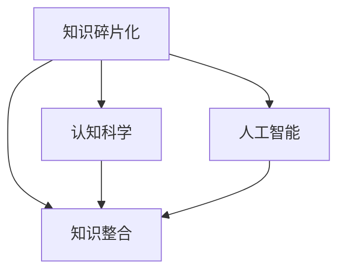

                 

# 知识的碎片化与整合：信息时代的认知难题

## 1. 背景介绍

### 1.1 问题由来
在信息爆炸的时代，知识的碎片化趋势愈发显著。海量互联网信息不断涌入我们的生活，我们不得不面对信息过载和认知负荷的问题。一方面，源源不断的新知识需要我们及时消化；另一方面，现有的认知体系又难以快速吸收和整合这些碎片化的知识。这不仅给我们的学习和工作带来了巨大的挑战，也制约了个人和组织的知识创新能力。如何有效地从碎片化的知识中提取有价值的信息，并对其进行整合和应用，成为了认知科学和人工智能领域的研究热点。

### 1.2 问题核心关键点
知识碎片化的核心在于信息的零散和孤立。人们通过社交媒体、博客、论坛、视频网站等途径获取新知识，但这些知识往往以零散、杂乱的形式呈现，缺乏系统性和关联性。信息碎片化的表现形式包括但不限于以下几种：

- 文章、视频、博客等形式的浅层内容，缺乏深度解析和详细解释。
- 来自不同领域和学科的知识，难以跨领域整合和应用。
- 海量数据驱动的信息，难以过滤和筛选。
- 不同媒介获取的信息，格式和呈现方式各异，难以统一和比较。

因此，如何将碎片化的知识整合成系统的知识体系，从而提升认知能力，便成为了信息时代的认知难题。

### 1.3 问题研究意义
有效整合碎片化的知识，不仅可以帮助个人提升学习和工作能力，还能为企业组织提供知识管理、决策支持、创新驱动等核心能力。研究知识的碎片化与整合，对于促进知识的传承、创新和发展，提升人类社会的智能化水平，具有重要的理论和实践意义。

1. **提升个人学习效率**：通过高效整合碎片化知识，能够减少学习的时间和精力投入，提升学习效果。
2. **增强企业知识管理**：建立知识整合平台，帮助企业从海量信息中提取有价值的知识，优化知识管理流程。
3. **驱动技术创新**：将碎片化知识整合成系统知识，有助于发现新的研究方向和技术突破，加速技术迭代。
4. **促进知识共享**：通过系统化整理和呈现碎片化知识，促进不同领域之间的知识共享和交流，提升整体社会智能水平。

## 2. 核心概念与联系

### 2.1 核心概念概述

为了更好地理解知识碎片化与整合的原理和应用，本节将介绍几个关键概念：

- **知识碎片化**：指信息被切割成零散的片段，缺乏系统性和连贯性。信息碎片化的表现形式多样，包括文本、图片、视频、音频等多种媒介。
- **知识整合**：指将零散的、孤立的知识片段进行系统化、结构化的整理，形成知识体系的过程。知识整合可以帮助我们更好地理解和应用知识。
- **认知科学**：研究人类认知过程、知识获取、信息处理等领域的科学。认知科学致力于理解和提升人类的认知能力，是知识碎片化与整合的重要理论基础。
- **人工智能**：基于计算机科学和认知科学的理论，开发智能系统以模拟人类认知过程。人工智能在知识获取、信息处理、知识表示和知识应用等方面具有独特优势。

这些概念之间的逻辑关系可以通过以下Mermaid流程图来展示：



这个流程图展示了几者之间的联系：

1. 知识碎片化是信息时代的普遍现象。
2. 知识整合是对碎片化知识的系统化整理过程。
3. 认知科学和人工智能是知识碎片化与整合的理论基础和工具支持。

## 3. 核心算法原理 & 具体操作步骤
### 3.1 算法原理概述

知识碎片化与整合的本质是一种信息处理和知识表示的过程。该过程的核心在于如何从碎片化的信息中提取出有价值的知识，并对其进行结构化、系统化的表示。

1. **信息抽取**：从碎片化的信息中提取有用的知识片段，去除噪音和不相关的内容。
2. **知识表示**：将提取的知识片段进行结构化表示，如构建知识图谱、构建语义网络等。
3. **知识整合**：将结构化的知识片段进行融合，构建系统的知识体系。

### 3.2 算法步骤详解

知识碎片化与整合的算法步骤主要包括以下几个关键环节：

**Step 1: 数据收集与预处理**
- 收集各类碎片化的知识来源，如文章、视频、数据库、社交媒体等。
- 对收集到的数据进行清洗和预处理，去除无关信息，统一格式和编码方式。

**Step 2: 信息抽取**
- 采用自然语言处理技术，从文本数据中提取关键信息，如实体、事件、关系等。
- 对非文本信息（如图像、音频、视频）进行特征提取，将其转化为文本或数值信息。
- 使用机器学习或深度学习模型，对信息进行分类和标注，识别出重要和相关的内容。

**Step 3: 知识表示**
- 构建知识图谱：将提取的信息转化为图谱形式，节点表示实体或概念，边表示实体之间的关系。
- 构建语义网络：使用语义分析技术，将信息转化为语义网络，节点表示概念或实体，边表示概念之间的联系。
- 使用符号表示法：将信息用符号或规则表示，构建形式化的知识表示体系。

**Step 4: 知识整合**
- 基于知识图谱、语义网络等结构化表示，进行知识的关联和融合。
- 使用图谱查询算法，从知识图谱中提取所需信息，进行推理和推断。
- 结合人工智能技术，如知识图谱嵌入、知识推理等，构建更复杂的知识整合模型。

**Step 5: 结果应用**
- 将整合后的知识应用于实际问题解决，如决策支持、推荐系统、智能问答等。
- 持续收集新数据，更新和优化知识表示和整合模型，保持知识的动态性。

### 3.3 算法优缺点

知识碎片化与整合算法具有以下优点：
1. **系统化整理知识**：通过结构化表示和系统化整合，将碎片化的知识转化为系统化的知识体系，方便检索和应用。
2. **高效处理海量信息**：使用自动化的信息抽取和知识表示技术，可以高效处理和分析海量数据，减少人工干预。
3. **促进跨领域应用**：通过知识整合，实现不同领域之间的知识共享和交流，促进跨领域的应用和创新。
4. **提升决策支持能力**：整合后的知识可以为决策支持提供更全面的信息支撑，提升决策的科学性和准确性。

同时，该算法也存在以下局限性：
1. **依赖数据质量**：信息抽取和知识表示的质量很大程度上依赖于原始数据的准确性和完整性。
2. **模型复杂度高**：知识图谱、语义网络等结构化表示方式，对计算资源和模型复杂度要求较高。
3. **适用场景受限**：不同的应用场景对知识整合的要求不同，可能存在适用性限制。
4. **缺乏语境理解**：当前的算法和模型难以理解文本的语境和背景信息，导致某些信息抽取和表示误差。

尽管存在这些局限性，但知识碎片化与整合算法在处理大规模信息、提升知识管理和决策支持方面具有独特的优势。未来的研究应集中在提升数据质量、优化模型结构和降低计算复杂度等方面，以进一步提升知识整合的效率和效果。

### 3.4 算法应用领域

知识碎片化与整合算法在多个领域都有广泛的应用，以下是一些典型的应用场景：

**1. 知识图谱构建**
知识图谱是结构化的知识表示形式，通过整合碎片化的知识，构建系统的知识体系。常见的应用包括：
- 医疗领域的知识图谱，用于疾病诊断和治疗方案推荐。
- 金融领域的知识图谱，用于风险评估和投资策略。
- 电商领域的知识图谱，用于商品推荐和用户画像分析。

**2. 信息检索与推荐**
信息检索和推荐系统需要从海量数据中提取有用信息，并进行关联和推荐。知识碎片化与整合算法可以高效处理碎片化的信息，提升检索和推荐的效果：
- 新闻推荐系统：通过整合碎片化的新闻信息，实现个性化推荐。
- 图书推荐系统：整合用户阅读记录和书籍信息，推荐相关书籍。
- 视频推荐系统：分析用户观看记录和视频内容，推荐相关视频。

**3. 自然语言处理**
自然语言处理（NLP）技术需要处理和理解碎片化的文本数据。知识碎片化与整合算法可以提升NLP系统的效率和效果：
- 信息抽取：从碎片化的文本数据中抽取实体、事件、关系等关键信息。
- 文本分类：使用知识整合后的语义网络，提升文本分类的准确性。
- 问答系统：通过整合知识图谱，提升问答系统的回答质量和覆盖面。

**4. 智能决策**
智能决策系统需要整合碎片化的数据，构建知识库，支持决策模型的训练和应用：
- 金融决策：整合市场数据、新闻、专家意见等信息，支持投资策略和风险评估。
- 医疗决策：整合病人数据、医学文献、临床经验等信息，支持诊断和治疗决策。
- 安全决策：整合情报数据、监控视频、社交媒体等信息，支持安全威胁分析和应对策略。

## 4. 数学模型和公式 & 详细讲解  
### 4.1 数学模型构建

知识碎片化与整合的过程可以抽象为一个知识抽取和知识表示的数学模型。我们通过构建知识图谱、语义网络等结构化模型，对碎片化的信息进行表示和整合。

假设知识图谱由节点和边构成，节点表示实体或概念，边表示实体之间的关系。知识图谱可以用三元组 $(实体, 关系, 实体)$ 的形式表示。

**示例1**：一个简单的知识图谱示例如下：

```
- (Bob, works_in, Google)
- (Google, located_in, Mountain View)
- (Bob, is_employed_by, Google)
```

### 4.2 公式推导过程

对于知识图谱的构建和查询，我们可以使用图数据库的表示和查询语言，如SPARQL。假设知识图谱 $\mathcal{G}$ 由节点 $V$ 和边 $E$ 组成。我们可以使用以下公式来表示知识图谱的构建过程：

$$
\mathcal{G} = \{ (v_i, r_j, v_k) \mid r_j \in R, v_i, v_k \in V \}
$$

其中 $v_i, v_k$ 为节点，$r_j$ 为关系，$R$ 为关系集合。

在知识图谱中，节点的关系可以用矩阵表示。假设知识图谱中的节点关系矩阵为 $A$，节点度矩阵为 $D$，节点特征矩阵为 $H$。则知识图谱的表示可以写成：

$$
H = D^{-1/2} A H D^{-1/2}
$$

这里 $D^{-1/2}$ 是对角矩阵，$A$ 为邻接矩阵，$H$ 为节点特征矩阵。通过矩阵乘法，我们可以实现节点的关系表示和特征表示的融合。

### 4.3 案例分析与讲解

**案例1: 知识图谱构建与查询**

构建知识图谱的关键在于提取和整合信息，生成三元组 $(实体, 关系, 实体)$。以构建一个简单的知识图谱为例：

```
- (Bob, works_in, Google)
- (Google, located_in, Mountain View)
- (Bob, is_employed_by, Google)
```

首先，从原始数据中提取信息：
- 从文章中提取实体的信息：Bob, Google, Mountain View。
- 从文章中提取关系的信息：works_in, located_in, is_employed_by。

然后，生成三元组，构建知识图谱：
- (Bob, works_in, Google)
- (Google, located_in, Mountain View)
- (Bob, is_employed_by, Google)

### 5. 项目实践：代码实例和详细解释说明
### 5.1 开发环境搭建

在进行知识碎片化与整合的实践前，我们需要准备好开发环境。以下是使用Python进行知识图谱构建和查询的开发环境配置流程：

1. 安装Anaconda：从官网下载并安装Anaconda，用于创建独立的Python环境。

2. 创建并激活虚拟环境：
```bash
conda create -n graph-env python=3.8 
conda activate graph-env
```

3. 安装PyTorch：根据CUDA版本，从官网获取对应的安装命令。例如：
```bash
conda install pytorch torchvision torchaudio cudatoolkit=11.1 -c pytorch -c conda-forge
```

4. 安装各类工具包：
```bash
pip install numpy pandas scikit-learn matplotlib tqdm jupyter notebook ipython
```

完成上述步骤后，即可在`graph-env`环境中开始知识图谱构建和查询的实践。

### 5.2 源代码详细实现

这里我们以构建一个简单的知识图谱为例，给出使用PyTorch和NetworkX库进行知识图谱构建和查询的PyTorch代码实现。

首先，定义知识图谱的数据处理函数：

```python
import networkx as nx
import numpy as np
from sklearn.manifold import spectral_embedding

def build_knowledge_graph(data):
    graph = nx.Graph()
    for record in data:
        entity1, relation, entity2 = record
        graph.add_edge(entity1, entity2, relation=relation)
    return graph
```

然后，定义知识图谱的可视化函数：

```python
import matplotlib.pyplot as plt

def visualize_graph(graph, nodes, labels):
    pos = nx.spring_layout(graph)
    nx.draw(graph, pos=pos, node_size=300, with_labels=True, font_size=8, node_color='gray', font_color='black')
    for node in nodes:
        plt.text(pos[node], labels[node], s=labels[node], va='center', ha='center')
    plt.show()
```

接着，定义知识图谱的嵌入函数：

```python
def spectral_embedding(graph):
    A = nx.adjacency_matrix(graph)
    eigenvalues, eigenvectors = np.linalg.eigs(A, k=5)
    embedding = np.dot(eigenvectors, eigenvectors.T)
    return embedding
```

最后，启动知识图谱的构建和查询流程：

```python
# 假设数据为知识图谱的三元组
data = [
    ('Bob', 'works_in', 'Google'),
    ('Google', 'located_in', 'Mountain View'),
    ('Bob', 'is_employed_by', 'Google')
]

# 构建知识图谱
graph = build_knowledge_graph(data)

# 可视化知识图谱
visualize_graph(graph, ['Bob', 'Google', 'Mountain View'], {'Bob': 'Alice', 'Google': 'Bob', 'Mountain View': 'San Francisco'})

# 对知识图谱进行谱嵌入
embedding = spectral_embedding(graph)
print(embedding)
```

以上就是使用PyTorch和NetworkX库进行知识图谱构建和查询的完整代码实现。可以看到，借助这些工具，我们可以方便地处理和分析知识图谱，进行可视化展示和谱嵌入分析。

### 5.3 代码解读与分析

让我们再详细解读一下关键代码的实现细节：

**build_knowledge_graph函数**：
- 从数据中提取三元组，构建知识图谱。

**visualize_graph函数**：
- 使用NetworkX库的spring_layout方法进行节点布局，使用matplotlib库进行可视化展示。

**spectral_embedding函数**：
- 对知识图谱进行谱嵌入，将节点转化为高维嵌入向量。

**知识图谱构建和查询流程**：
- 构建知识图谱，并进行可视化展示。
- 对知识图谱进行谱嵌入分析，输出嵌入向量。

可以看到，知识图谱的构建和查询不仅涉及到数据处理和图结构表示，还需要进行可视化展示和谱嵌入分析。这些环节相互关联，共同构成知识图谱的完整处理流程。

### 5.4 运行结果展示

知识图谱的构建和查询流程在实际应用中非常灵活，可以根据具体需求进行定制。例如，可以对不同领域和学科的知识图谱进行整合，构建更复杂和系统的知识体系。同时，结合深度学习模型，可以对知识图谱进行更深入的分析和推理，提升知识管理和决策支持的效果。

## 6. 实际应用场景
### 6.1 医疗知识管理

知识碎片化与整合技术在医疗领域具有重要应用价值。通过构建医疗知识图谱，可以从海量的医学文献、病历、临床经验中提取关键信息，进行整合和分析：

**应用场景1: 疾病诊断**
- 医生可以通过知识图谱快速获取相关疾病的信息，包括病因、症状、治疗方案等。
- 知识图谱可以辅助诊断系统，提升诊断的准确性和效率。

**应用场景2: 治疗方案推荐**
- 知识图谱可以整合临床经验和最新的科研成果，为医生推荐最佳治疗方案。
- 结合患者的历史病历数据，知识图谱可以提供个性化的治疗建议。

**应用场景3: 医学研究**
- 知识图谱可以支持医学研究人员进行文献检索和知识发现，加速新药研发和医学创新。
- 结合知识图谱的推理和推断功能，研究人员可以发现新的研究方向和科学问题。

### 6.2 金融风险评估

金融领域的知识图谱可以从新闻、市场数据、专家意见等多种来源提取信息，进行整合和分析：

**应用场景1: 风险评估**
- 金融分析师可以使用知识图谱获取市场动态和行业趋势，进行风险评估。
- 知识图谱可以整合多种数据源，提升风险评估的全面性和准确性。

**应用场景2: 投资策略**
- 知识图谱可以整合历史市场数据和专家意见，支持投资策略的制定。
- 通过知识图谱的推理功能，分析师可以发现新的投资机会和潜在风险。

**应用场景3: 资产管理**
- 知识图谱可以整合公司财务数据和市场动态，支持资产配置和组合优化。
- 结合人工智能技术，知识图谱可以自动化分析资产表现，提升投资管理的效率。

### 6.3 电商推荐系统

电商领域的知识图谱可以从用户行为、商品属性、市场趋势等多种来源提取信息，进行整合和分析：

**应用场景1: 商品推荐**
- 电商推荐系统可以通过知识图谱整合用户历史行为和商品属性，提供个性化的商品推荐。
- 知识图谱可以发现用户和商品之间的潜在关系，提升推荐系统的准确性。

**应用场景2: 用户画像分析**
- 知识图谱可以整合用户行为数据和社交网络信息，构建详细的用户画像。
- 用户画像可以用于个性化推荐、广告投放等电商应用。

**应用场景3: 市场趋势分析**
- 知识图谱可以整合商品销售数据和市场动态，分析市场趋势和热点。
- 市场趋势分析可以支持库存管理、采购策略等电商应用。

### 6.4 未来应用展望

未来，知识碎片化与整合技术将在更多领域得到应用，为不同行业带来新的变革。

**1. 智慧城市管理**
智慧城市管理系统可以从多种数据源提取信息，进行整合和分析，提升城市管理的智能化水平：
- 交通管理：整合交通数据、监控视频、用户反馈等，优化交通流量和路径规划。
- 环境监测：整合传感器数据、气象数据、公众意见等，提升环境监测的全面性和准确性。
- 公共安全：整合视频监控、报警数据、社交媒体信息等，提升公共安全管理水平。

**2. 智能教育系统**
智能教育系统可以从教学资源、学生反馈、考试数据等多种来源提取信息，进行整合和分析：
- 学习推荐：整合课程资源、学生历史数据，提供个性化的学习推荐。
- 智能评估：整合学生作业、考试数据，自动评估学生学习情况。
- 教学优化：整合教师反馈、学生意见，优化教学方法和课程设计。

**3. 工业自动化**
工业自动化系统可以从设备数据、生产记录、市场趋势等多种来源提取信息，进行整合和分析：
- 设备维护：整合设备故障数据、维修记录，优化设备维护策略。
- 生产优化：整合生产数据、市场趋势，优化生产计划和调度。
- 质量控制：整合生产数据、质检数据，提升产品质量和生产效率。

## 7. 工具和资源推荐
### 7.1 学习资源推荐

为了帮助开发者系统掌握知识碎片化与整合的理论基础和实践技巧，这里推荐一些优质的学习资源：

1. **《知识图谱：理论与实践》**：
   - 本书详细介绍了知识图谱的理论基础、构建方法、应用场景等，是学习知识图谱的权威教材。
   - 作者为知识图谱领域的知名专家，涵盖丰富的案例和实践经验。

2. **《自然语言处理》**：
   - 斯坦福大学开设的NLP课程，系统讲解了自然语言处理的基本概念、技术方法等。
   - 包括Lecture视频和配套作业，适合初学者系统学习NLP技术。

3. **《深度学习与认知科学》**：
   - 介绍深度学习在认知科学中的应用，如知识抽取、文本分类、情感分析等。
   - 涵盖深度学习模型的理论基础和实现方法，适合技术开发人员深入理解。

4. **《图数据库与知识图谱》**：
   - 介绍图数据库和知识图谱的基本原理、构建方法、应用场景等。
   - 涵盖多种图数据库和知识图谱工具的使用方法，适合知识图谱开发的实际应用。

5. **《知识表示与推理》**：
   - 介绍知识表示和推理的基本方法，如知识图谱嵌入、符号表示法等。
   - 涵盖多种知识表示和推理技术，适合知识管理、智能决策等领域的研究人员。

通过对这些资源的学习实践，相信你一定能够快速掌握知识碎片化与整合的精髓，并用于解决实际的认知难题。

### 7.2 开发工具推荐

高效的开发离不开优秀的工具支持。以下是几款用于知识碎片化与整合开发的常用工具：

1. **PyTorch**：基于Python的开源深度学习框架，灵活动态的计算图，适合快速迭代研究。
2. **TensorFlow**：由Google主导开发的开源深度学习框架，生产部署方便，适合大规模工程应用。
3. **NetworkX**：Python的图处理库，支持多种图模型和图算法，适合知识图谱的构建和分析。
4. **Gephi**：图形可视化和网络分析工具，支持多种图数据格式和可视化展示，适合知识图谱的可视化和分析。
5. **Elk**：基于RDF和Turtle格式的知识图谱编辑器，支持知识图谱的构建和查询，适合知识图谱的开发和维护。

合理利用这些工具，可以显著提升知识碎片化与整合的开发效率，加快创新迭代的步伐。

### 7.3 相关论文推荐

知识碎片化与整合技术的发展源于学界的持续研究。以下是几篇奠基性的相关论文，推荐阅读：

1. **知识图谱的构建与查询**：
   - 论文详细介绍了知识图谱的构建方法、查询算法等，为知识图谱的开发提供了理论基础。
   - 作者为知识图谱领域的知名专家，涵盖丰富的案例和实践经验。

2. **基于知识图谱的信息检索**：
   - 论文详细介绍了知识图谱在信息检索中的应用，如实体匹配、语义搜索等。
   - 涵盖多种信息检索方法和算法，适合研究知识图谱的实际应用。

3. **知识图谱嵌入技术**：
   - 论文详细介绍了知识图谱嵌入的方法和算法，如TransE、SIDE等。
   - 涵盖多种知识图谱嵌入技术，适合知识图谱表示和分析的研究人员。

4. **知识图谱与人工智能的结合**：
   - 论文详细介绍了知识图谱与深度学习、自然语言处理等人工智能技术的结合方法。
   - 涵盖多种知识图谱表示和分析技术，适合知识图谱开发和应用的实际需求。

这些论文代表了大数据时代知识图谱技术的发展脉络。通过学习这些前沿成果，可以帮助研究者把握学科前进方向，激发更多的创新灵感。

## 8. 总结：未来发展趋势与挑战

### 8.1 总结

本文对知识碎片化与整合技术进行了全面系统的介绍。首先阐述了知识碎片化的本质和背景，明确了其研究的重要性和意义。其次，从原理到实践，详细讲解了知识抽取、知识表示、知识整合等关键步骤，给出了知识图谱构建和查询的完整代码实例。同时，本文还广泛探讨了知识碎片化与整合技术在医疗、金融、电商等多个领域的应用前景，展示了其广阔的应用范围。最后，本文精选了知识碎片化与整合技术的各类学习资源，力求为读者提供全方位的技术指引。

通过本文的系统梳理，可以看到，知识碎片化与整合技术在处理大规模信息、提升知识管理和决策支持方面具有独特的优势。未来，随着知识图谱和人工智能技术的不断发展，知识碎片化与整合技术必将在更多的应用领域中发挥重要作用，为人类认知智能的进化带来深远影响。

### 8.2 未来发展趋势

展望未来，知识碎片化与整合技术将呈现以下几个发展趋势：

1. **知识图谱的自动化构建**：未来的知识图谱构建将更多地依赖自动化和半自动化的方式，减少人工干预和错误。自动化构建将提升知识图谱的生成速度和质量。
2. **多源数据的整合与融合**：未来的知识图谱将从多种数据源中提取信息，进行融合和整合，构建更加全面和准确的知识体系。
3. **知识图谱的实时更新**：未来的知识图谱将具备实时更新的能力，持续从新数据中提取和整合信息，保持知识的动态性和时效性。
4. **知识图谱的跨领域应用**：未来的知识图谱将支持跨领域的应用和创新，推动不同领域之间的知识共享和交流。
5. **知识图谱的推理与推断**：未来的知识图谱将具备更强的推理和推断能力，支持更复杂的决策和推理应用。

以上趋势凸显了知识碎片化与整合技术的广阔前景。这些方向的探索发展，必将进一步提升知识图谱的效率和效果，为知识管理和智能决策提供更强大的支持。

### 8.3 面临的挑战

尽管知识碎片化与整合技术已经取得了一定的进展，但在迈向更加智能化、普适化应用的过程中，仍面临诸多挑战：

1. **数据质量与完整性**：知识图谱的构建依赖于高质量和完整的数据，但数据获取和预处理的成本较高。如何提升数据质量，降低预处理成本，是知识图谱构建的关键。
2. **模型复杂性与计算资源**：知识图谱的构建和推理计算资源消耗较大，需要高性能的计算设备和算法优化。如何提升模型效率，降低计算资源消耗，是知识图谱应用的关键。
3. **知识图谱的扩展性**：知识图谱需要支持大规模的数据和复杂的推理，如何构建可扩展的知识图谱系统，是知识图谱应用的重要挑战。
4. **知识的语境理解**：现有的知识图谱方法难以理解文本的语境和背景信息，导致某些信息抽取和表示误差。如何提升知识图谱的语境理解能力，是知识图谱应用的重要挑战。
5. **知识的动态更新**：知识图谱需要持续更新，保持知识的动态性和时效性。如何设计高效的更新算法，确保知识图谱的实时性和准确性，是知识图谱应用的重要挑战。

正视知识碎片化与整合技术面临的这些挑战，积极应对并寻求突破，将使知识图谱技术更好地服务于人类社会的智能化发展。

### 8.4 研究展望

面对知识碎片化与整合技术所面临的挑战，未来的研究需要在以下几个方面寻求新的突破：

1. **知识图谱的自动化构建与维护**：开发自动化的知识图谱构建和维护工具，提升知识图谱的生成速度和质量。
2. **知识图谱的多源融合**：研究多源数据的融合方法，提升知识图谱的全面性和准确性。
3. **知识图谱的实时更新与动态维护**：开发高效的实时更新算法，确保知识图谱的动态性和时效性。
4. **知识图谱的语境理解与推理**：研究语境理解与推理技术，提升知识图谱的语境理解能力和推理效果。
5. **知识图谱的可扩展性与安全性**：设计可扩展的知识图谱系统，确保知识图谱的可扩展性和安全性。

这些研究方向将引领知识图谱技术的进一步发展，为知识管理和智能决策提供更强大的支持。面向未来，知识碎片化与整合技术需要与其他人工智能技术进行更深入的融合，如知识表示、因果推理、强化学习等，多路径协同发力，共同推动人工智能技术在知识管理和决策支持领域的进步。

## 9. 附录：常见问题与解答

**Q1: 知识碎片化与整合技术在各个应用场景中的具体实现方法是什么？**

A: 知识碎片化与整合技术在各个应用场景中的具体实现方法因场景而异，以下是几个典型应用场景的实现方法：

**医疗知识管理**：
- 构建医疗知识图谱，整合医学文献、病历、临床经验等信息。
- 使用知识图谱辅助诊断系统，提升诊断的准确性和效率。
- 利用知识图谱进行治疗方案推荐，个性化推荐最佳治疗方案。

**金融风险评估**：
- 构建金融知识图谱，整合新闻、市场数据、专家意见等信息。
- 使用知识图谱进行风险评估，整合多种数据源，提升风险评估的全面性和准确性。
- 利用知识图谱支持投资策略，整合历史市场数据和专家意见，制定投资策略。

**电商推荐系统**：
- 构建电商知识图谱，整合用户行为数据、商品属性、市场趋势等信息。
- 利用知识图谱进行商品推荐，整合用户历史数据和商品属性，提供个性化推荐。
- 使用知识图谱进行用户画像分析，整合用户行为数据和社交网络信息，构建详细的用户画像。

**智慧城市管理**：
- 构建智慧城市知识图谱，整合交通数据、监控视频、公众意见等信息。
- 利用知识图谱进行交通管理，优化交通流量和路径规划。
- 使用知识图谱进行环境监测，整合传感器数据、气象数据、公众意见等，提升环境监测的全面性和准确性。

**智能教育系统**：
- 构建教育知识图谱，整合教学资源、学生反馈、考试数据等信息。
- 利用知识图谱进行学习推荐，整合课程资源和学生历史数据，提供个性化推荐。
- 使用知识图谱进行智能评估，整合学生作业和考试数据，自动评估学生学习情况。

通过这些具体实现方法，可以看出知识碎片化与整合技术在各个应用场景中的强大应用潜力。

**Q2: 知识碎片化与整合技术在处理碎片化信息时，如何确保信息准确性和完整性？**

A: 知识碎片化与整合技术在处理碎片化信息时，确保信息准确性和完整性是一个关键问题。以下是几个常用的方法和策略：

**数据清洗与预处理**：
- 使用数据清洗和预处理技术，去除噪音和不相关的内容。
- 对数据进行格式转换和编码标准化，确保数据的一致性和完整性。

**多源数据融合**：
- 整合多种数据源，如文本、图像、视频等，构建全面的知识图谱。
- 利用数据融合技术，对不同来源的数据进行关联和校正，提升信息准确性。

**实体抽取与关系推断**：
- 使用自然语言处理技术，从文本数据中抽取实体和关系。
- 利用知识推理技术，推断实体之间的关系和属性，补充缺失信息。

**数据验证与交叉验证**：
- 使用数据验证技术，对信息进行验证和校对。
- 利用交叉验证方法，对信息进行交叉验证，确保信息的准确性和完整性。

**知识图谱嵌入与谱嵌入**：
- 对知识图谱进行谱嵌入，将节点转化为高维嵌入向量，提升信息的准确性和完整性。
- 利用谱嵌入方法，优化知识图谱的结构和表示，提升信息的完整性和一致性。

通过这些方法和策略，可以在一定程度上提升知识碎片化与整合技术的准确性和完整性，确保信息的高质量和可靠性。

**Q3: 知识图谱的构建与查询方法有哪些？**

A: 知识图谱的构建与查询方法多种多样，以下是几种常见的方法：

**构建方法**：
- 基于规则的方法：通过专家知识或领域知识，构建知识图谱。
- 基于统计的方法：利用统计学习技术，从大量数据中自动构建知识图谱。
- 基于知识抽取的方法：从文本数据中抽取实体和关系，构建知识图谱。
- 基于众包的方法：利用众包技术，通过用户标注构建知识图谱。

**查询方法**：
- 基于规则的查询：使用预定义的规则，从知识图谱中查找信息。
- 基于图算法的方法：利用图算法，如深度优先搜索、广度优先搜索等，从知识图谱中查找信息。
- 基于自然语言处理的方法：利用自然语言处理技术，从知识图谱中提取和理解信息。
- 基于知识推理的方法：利用知识推理技术，从知识图谱中推断和验证信息。

这些构建与查询方法各有优缺点，选择合适的方法需要根据具体应用场景和需求进行权衡。

**Q4: 知识图谱在智能决策中的应用有哪些？**

A: 知识图谱在智能决策中具有广泛的应用，以下是一些常见的应用场景：

**金融决策**：
- 利用知识图谱进行风险评估，整合多种数据源，提升风险评估的全面性和准确性。
- 利用知识图谱支持投资策略，整合历史市场数据和专家意见，制定投资策略。
- 利用知识图谱进行资产管理，整合公司财务数据和市场动态，优化资产配置和组合。

**医疗决策**：
- 利用知识图谱进行疾病诊断，整合医学文献、病历、临床经验等信息，辅助诊断系统。
- 利用知识图谱进行治疗方案推荐，整合临床经验和最新的科研成果，为医生推荐最佳治疗方案。
- 利用知识图谱进行医学研究，整合文献数据，加速新药研发和医学创新。

**电商决策**：
- 利用知识图谱进行商品推荐，整合用户历史数据和商品属性，提供个性化推荐。
- 利用知识图谱进行用户画像分析，整合用户行为数据和社交网络信息，构建详细的用户画像。
- 利用知识图谱进行市场趋势分析，整合商品销售数据和市场动态，提升市场预测和决策效果。

**智慧城市决策**：
- 利用知识图谱进行交通管理，优化交通流量和路径规划。
- 利用知识图谱进行环境监测，整合传感器数据、气象数据、公众意见等，提升环境监测的全面性和准确性。
- 利用知识图谱进行公共安全管理，整合视频监控、报警数据、社交媒体信息等，提升公共安全管理水平。

通过这些应用场景，可以看出知识图谱在智能决策中的强大应用潜力。

---

作者：禅与计算机程序设计艺术 / Zen and the Art of Computer Programming

