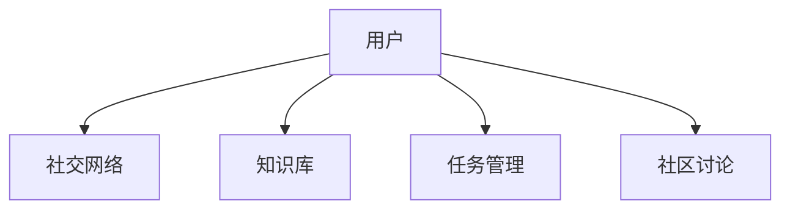

                 

## 1. 背景介绍

### 1.1 问题由来
在当今这个信息爆炸的时代，知识更新速度迅猛，个人难以独自跟上所有领域的最新动态。知识的获取、更新和分享变得愈发重要，而传统的以书本、课堂为中心的学习方式已难以适应需求。一种新型的学习方式正在逐渐兴起——协作学习，通过协作平台，学习者可以共同分享知识，互相辅助，共同成长。

### 1.2 问题核心关键点
协作学习平台的核心在于“社交化”，即通过社交网络、知识共享、协同工作等方式，促进知识的传递与积累。在这样的平台上，学习者不仅能获得传统学习方式下的知识，还能获取来自同行和专家的洞见与经验。

### 1.3 问题研究意义
研究协作平台的兴起，对于加速知识的社会化学习、提升学习效率、促进知识共享、推动跨领域知识的融合具有重要意义。具体而言：

- **加速知识获取**：借助协作平台，学习者可以快速获取领域内的最新知识，避免时间浪费在信息过载的海洋中。
- **提升学习效率**：通过与同侪和专家的互动，学习者可以更有效地理解复杂问题，快速掌握关键技能。
- **促进知识共享**：协作平台为知识的积累和传播提供了新的途径，有助于构建更为开放和包容的学习环境。
- **推动跨领域知识融合**：通过跨学科的交流与合作，协作平台可以促进不同领域知识之间的交流与融合，推动学科间的交叉创新。

## 2. 核心概念与联系

### 2.1 核心概念概述
协作平台（Collaborative Platforms）是指基于互联网的社交网络工具，旨在促进用户之间的知识交流和协作。常见的协作平台包括但不限于微信、Slack、GitHub、知乎等。

**2.1.1 协作平台的核心组成**

协作平台通常包括以下几个关键组成部分：

- **社交网络**：允许用户建立个人或小组档案，添加好友或关注者，进行文字、图片、视频等多种形式的交流。
- **知识库**：存储并共享文档、笔记、代码等知识资源，用户可以发布和评论。
- **任务管理**：提供任务分配、进度跟踪等功能，支持团队协作。
- **社区讨论**：用户可以参与各种讨论话题，分享经验，获取反馈。

**2.1.2 知识共享与协同工作**

在协作平台上，用户可以自由地共享知识和资源，进行协同工作。具体方式包括：

- **文档共享**：用户可以将文档、PPT、笔记等资源上传到平台，供他人查阅和使用。
- **代码托管与协作**：如GitHub，用户可以将代码项目上传并协作开发。
- **实时编辑与评论**：通过协作编辑工具（如Google Docs），用户可以实时编辑文档，并在旁边添加评论。

这些功能大大提高了知识的获取、分享和应用效率。

### 2.2 核心概念原理和架构的 Mermaid 流程图



这个流程图展示了用户在使用协作平台时的基本操作路径：

1. 用户通过社交网络建立联系。
2. 用户向知识库上传或下载知识资源。
3. 用户参与任务管理流程。
4. 用户参与社区讨论。

这些模块之间相互交织，共同构成了协作平台的完整生态。

## 3. 核心算法原理 & 具体操作步骤

### 3.1 算法原理概述

协作平台的算法原理主要基于以下两个方面：

- **推荐算法**：通过分析用户行为数据，推荐相关的内容和知识，提升用户的学习效率和体验。
- **协同过滤**：通过分析用户之间的互动关系，推荐潜在的学习伙伴和资源，促进知识的传播和共享。

这些算法旨在通过数据驱动的方式，构建知识网络，提升用户之间的互动和协作。

### 3.2 算法步骤详解

以推荐算法为例，主要步骤包括：

1. **数据收集**：收集用户的行为数据，如浏览记录、搜索记录、互动记录等。
2. **特征提取**：从行为数据中提取有用的特征，如浏览时间、评论内容、互动频率等。
3. **模型训练**：使用机器学习算法训练推荐模型，如协同过滤、内容推荐、混合推荐等。
4. **推荐输出**：根据用户的行为和偏好，输出个性化推荐结果。

### 3.3 算法优缺点

协作平台的推荐算法具有以下优点：

- **高效性**：能够快速响应用户的查询需求，提供个性化推荐。
- **可扩展性**：可以轻松扩展到大规模用户和资源，支持多语言、多文化环境。
- **互动性**：通过实时互动，提升用户的学习体验。

同时，也存在以下缺点：

- **隐私问题**：在收集和分析用户行为数据时，可能引发隐私和安全问题。
- **冷启动问题**：新用户或新资源可能面临难以获得推荐的困境。
- **算法偏见**：算法可能因数据偏差而产生推荐偏见，影响推荐效果。

### 3.4 算法应用领域

协作平台的推荐算法在多个领域有广泛应用，包括：

- **在线教育**：推荐相关的课程、资料和讨论，帮助学生高效学习。
- **职业发展**：推荐相关的招聘信息、培训课程和学习资源，助力职业成长。
- **科学研究**：推荐相关的论文、数据集和工具，促进科研协作。
- **知识分享**：推荐相关的文章、书籍和视频，促进知识传播。
- **技术创新**：推荐相关的代码、项目和工具，促进技术交流和创新。

## 4. 数学模型和公式 & 详细讲解 & 举例说明

### 4.1 数学模型构建

推荐算法主要基于协同过滤和内容推荐两种模型。以协同过滤为例，其数学模型可以表示为：

$$ P(u,i) = \frac{e^{sim(u,v_i)\sigma (\sum_{j=1}^k r_{v_ji}x_{uj}x_{v_ji})}}{\sum_{j=1}^k e^{sim(u,v_j)\sigma (\sum_{j=1}^k r_{v_ji}x_{uj}x_{v_ji})}} $$

其中 $P(u,i)$ 表示用户 $u$ 对项目 $i$ 的评分，$sim(u,v_i)$ 表示用户 $u$ 与项目 $v_i$ 的相似度，$x_{uj}$ 表示用户 $u$ 对项目 $j$ 的评分，$r_{v_ji}$ 表示项目 $v_j$ 与 $i$ 的相关度，$k$ 表示相似度计算中的维度。

### 4.2 公式推导过程

协同过滤模型的推导过程主要基于以下假设：

- **局部相似性**：假设相似用户或物品具有相似的偏好。
- **稀疏性**：实际数据中用户对物品的评分往往是稀疏的，只有部分数据是已知的。
- **矩阵分解**：通过矩阵分解的方式，可以将用户-物品评分矩阵分解为用户-隐向量矩阵与物品-隐向量矩阵的乘积。

### 4.3 案例分析与讲解

以Netflix的协同过滤推荐系统为例，其基本流程如下：

1. **数据收集**：Netflix收集用户对电影的评分数据。
2. **特征提取**：提取用户的性别、年龄、观影历史等特征，以及电影的类别、演员、导演等特征。
3. **模型训练**：使用协同过滤算法训练推荐模型。
4. **推荐输出**：根据用户的行为和偏好，输出个性化电影推荐。

## 5. 项目实践：代码实例和详细解释说明

### 5.1 开发环境搭建

要搭建一个协作平台，需要以下开发环境：

1. **Python环境**：使用Anaconda创建虚拟环境，安装必要的Python库和依赖。
2. **前端框架**：选择Flask、Django等Python Web框架。
3. **数据库**：使用MySQL、MongoDB等关系型或非关系型数据库。
4. **缓存**：使用Redis等缓存系统，提升系统性能。
5. **消息队列**：使用RabbitMQ、Kafka等消息队列，支持异步任务处理。

### 5.2 源代码详细实现

以一个简单的协作平台为例，实现功能包括用户注册、登录、发布文档、评论等。

```python
# 用户注册和登录
from flask import Flask, render_template, request

app = Flask(__name__)

@app.route('/register', methods=['GET', 'POST'])
def register():
    if request.method == 'POST':
        # 处理注册逻辑
        return '注册成功'
    else:
        return render_template('register.html')

@app.route('/login', methods=['GET', 'POST'])
def login():
    if request.method == 'POST':
        # 处理登录逻辑
        return '登录成功'
    else:
        return render_template('login.html')

# 发布文档
@app.route('/upload', methods=['GET', 'POST'])
def upload():
    if request.method == 'POST':
        # 处理文档上传逻辑
        return '文档发布成功'
    else:
        return render_template('upload.html')

# 评论功能
@app.route('/comment', methods=['GET', 'POST'])
def comment():
    if request.method == 'POST':
        # 处理评论逻辑
        return '评论成功'
    else:
        return render_template('comment.html')
```

### 5.3 代码解读与分析

在上述代码中，我们使用了Flask框架来实现协作平台的基本功能。主要步骤如下：

1. **路由设置**：定义不同的URL路由，处理对应的请求。
2. **用户注册和登录**：处理用户的注册和登录请求，返回成功或失败信息。
3. **发布文档**：处理用户上传文档的请求，返回发布成功的信息。
4. **评论功能**：处理用户发表评论的请求，返回评论成功的信息。

### 5.4 运行结果展示

运行上述代码后，协作平台的基本界面和功能已经实现。用户可以通过注册和登录进入系统，发布文档和发表评论。接下来可以进一步扩展功能，如文档搜索、用户交流、任务管理等。

## 6. 实际应用场景

### 6.1 在线教育

在线教育平台通过协作学习，帮助学生高效学习。平台可以提供以下功能：

- **课程推荐**：根据学生的学习进度和兴趣，推荐相关课程和资料。
- **学习小组**：将学生按兴趣和专业分组，组成学习小组。
- **作业提交与反馈**：支持学生提交作业，教师进行批改和反馈。

### 6.2 职业发展

职业发展平台通过协作学习，助力职业成长。平台可以提供以下功能：

- **培训课程推荐**：根据用户的职业规划，推荐相关的培训课程。
- **职业社区**：提供职业交流和分享的平台，促进职业发展。
- **职业指导**：提供职业咨询和指导，帮助用户制定职业规划。

### 6.3 科学研究

科学研究平台通过协作学习，促进科研协作。平台可以提供以下功能：

- **文献推荐**：推荐相关的科研论文和数据集。
- **实验协作**：支持多地协作实验，共享实验数据和成果。
- **科研讨论**：提供科研交流平台，促进学术讨论和知识共享。

### 6.4 知识分享

知识分享平台通过协作学习，促进知识传播。平台可以提供以下功能：

- **文章发布**：用户可以发布和分享文章、笔记、视频等。
- **知识问答**：提供问答社区，帮助用户解决学习中的问题。
- **知识库管理**：管理知识库，分类存储和检索知识资源。

## 7. 工具和资源推荐

### 7.1 学习资源推荐

以下是一些推荐的协作学习资源：

1. **Coursera和edX**：提供大量在线课程和资源，支持协作学习。
2. **Kaggle**：提供数据竞赛和协作平台，支持数据科学学习。
3. **Github**：提供代码协作和版本控制，支持技术协作。
4. **Zoom和Teams**：提供视频会议和协作工具，支持远程学习。
5. **Slack和Microsoft Teams**：提供即时通讯和协作工具，支持团队协作。

### 7.2 开发工具推荐

以下是一些推荐的协作开发工具：

1. **Flask和Django**：轻量级和重量级的Python Web框架，支持协作开发。
2. **MySQL和MongoDB**：关系型和NoSQL数据库，支持数据存储和查询。
3. **Redis**：缓存系统，提升系统性能。
4. **RabbitMQ和Kafka**：消息队列，支持异步任务处理。
5. **PostgreSQL和Oracle**：关系型数据库，支持复杂数据处理。

### 7.3 相关论文推荐

以下是一些推荐的协作学习论文：

1. **《A Survey on Learning and Collaboration in Online Education》**：综述在线教育中的学习与协作技术。
2. **《Collaborative Filtering Techniques》**：介绍协同过滤推荐算法的基本原理和应用。
3. **《Social Learning Analytics》**：研究在线学习平台的社交网络分析方法。
4. **《Knowledge Sharing and Collaboration in Online Learning》**：研究在线学习平台中的知识共享和协作机制。
5. **《Collaborative Systems: Concepts, Models, and Architectures》**：研究协作系统的一般概念、模型和架构。

## 8. 总结：未来发展趋势与挑战

### 8.1 总结

本文对协作平台的兴起进行了系统介绍。协作平台通过社交化学习，促进知识的传递和积累，提升学习效率和体验。协作平台的算法原理主要基于推荐算法和协同过滤，通过数据驱动的方式，构建知识网络，提升用户之间的互动和协作。

### 8.2 未来发展趋势

协作平台的未来发展趋势如下：

1. **智能化推荐**：基于人工智能和大数据分析，实现更精准的个性化推荐。
2. **多模态融合**：融合文本、视频、音频等多种数据形式，提升学习体验。
3. **泛在学习**：覆盖多种学习场景，如家庭、办公室、校园等，实现无处不在的学习。
4. **社区自治**：通过社区自治机制，提升平台的活跃度和用户粘性。
5. **国际化支持**：支持多语言和多文化环境，实现全球范围内的协作学习。

### 8.3 面临的挑战

协作平台面临以下挑战：

1. **数据隐私和安全**：用户数据和行为隐私的保护，防止数据泄露和滥用。
2. **算法公平性**：避免推荐算法中的偏见，确保公平性和公正性。
3. **系统可扩展性**：平台需要支持大规模用户和资源，确保系统的稳定性和可靠性。
4. **用户互动质量**：提升用户之间的互动质量，减少无效和低质量的交流。
5. **内容质量控制**：控制平台上内容的真实性和质量，防止虚假信息和垃圾内容的传播。

### 8.4 研究展望

未来的研究可以在以下几个方向进行突破：

1. **推荐算法优化**：改进推荐算法，提升推荐效果和速度。
2. **社区自治机制**：设计社区自治机制，提升平台的自治性和自我管理能力。
3. **多模态融合**：研究多模态数据融合方法，提升学习体验。
4. **智能辅助**：开发智能辅助工具，帮助用户更高效地学习。
5. **隐私保护技术**：研究隐私保护技术，保障用户数据的安全和隐私。

## 9. 附录：常见问题与解答

**Q1：协作平台推荐算法有哪些？**

A: 协作平台的推荐算法主要包括协同过滤和内容推荐两种。协同过滤通过分析用户行为数据，推荐相关的内容和知识。内容推荐则通过分析内容的特征，推荐相关的用户和内容。

**Q2：如何提高协作平台的推荐精度？**

A: 提高协作平台的推荐精度需要以下几个方面：

1. **数据质量**：确保推荐算法所使用的数据质量高，避免数据偏差。
2. **特征工程**：合理设计特征提取和选择，提升算法的准确性。
3. **算法优化**：改进推荐算法，提升推荐效果和速度。
4. **上下文信息**：结合上下文信息，如时间、地点、环境等，提升推荐的精准度。
5. **反馈机制**：通过用户反馈机制，不断优化推荐算法。

**Q3：协作平台面临的隐私和安全问题有哪些？**

A: 协作平台面临的隐私和安全问题主要包括：

1. **数据隐私**：用户数据和行为隐私的保护，防止数据泄露和滥用。
2. **数据安全**：确保数据在传输和存储过程中的安全性。
3. **用户身份验证**：确保用户身份的真实性和合法性。
4. **访问控制**：对不同用户和角色进行访问控制，防止恶意访问和操作。
5. **数据脱敏**：对敏感数据进行脱敏处理，保护用户隐私。

**Q4：协作平台如何提升用户互动质量？**

A: 提升协作平台的用户互动质量需要以下几个方面：

1. **社区规范**：制定和推广社区规范，防止无效和低质量的交流。
2. **激励机制**：设计合理的激励机制，鼓励用户积极参与互动。
3. **智能推荐**：通过智能推荐，引导用户参与互动和交流。
4. **社区管理**：加强社区管理，及时处理和删除低质量内容。
5. **用户反馈**：通过用户反馈机制，不断优化平台互动机制。

**Q5：协作平台的内容质量控制有哪些方法？**

A: 协作平台的内容质量控制主要包括以下方法：

1. **内容审核**：对上传内容进行审核，防止虚假信息和垃圾内容的传播。
2. **用户评价**：引入用户评价机制，对内容进行质量评分。
3. **专家评审**：邀请领域专家进行评审，确保内容的专业性和准确性。
4. **社区监督**：通过社区监督机制，防止不良内容的传播。
5. **自动检测**：利用自然语言处理和机器学习技术，自动检测和过滤低质量内容。

---

作者：禅与计算机程序设计艺术 / Zen and the Art of Computer Programming

