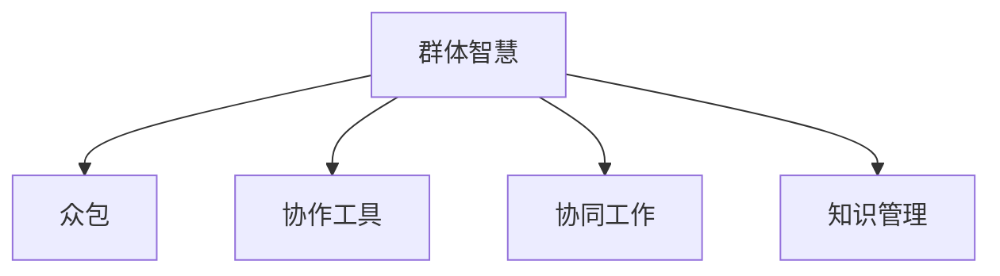

                 

# 知识的群体智慧：众包与协作的力量

> 关键词：群体智慧,众包,协作,协同工作,知识管理

## 1. 背景介绍

### 1.1 问题由来
在知识密集型的现代经济中，信息的获取、处理和创造变得越来越重要。传统上，知识和智慧往往被视为个人的能力，但随着互联网的普及和数字技术的进步，人们开始认识到集体智慧的力量。集体的智慧可以来源于不同背景和专业知识的人们共同工作，可以通过众包平台进行协作，也可以通过开源社区进行知识共享。这种群体智慧不仅提升了工作效率，也促进了创新的产生。

### 1.2 问题核心关键点
群体智慧的核心在于通过协同工作将个人智慧整合起来，形成集体智慧，从而在面对复杂任务时提供更全面、高效的解决方案。它是一种分布式知识管理方法，依赖于大规模、多样化的协作网络。

在技术实现上，群体智慧通过以下方式实现：

- **众包平台**：通过在线平台，将任务分解为小的子任务，分配给不同背景和专业知识的人员完成，并将结果汇总。
- **协同工作工具**：使用如Google Docs、Trello、Slack等工具，促进团队成员之间的实时沟通和协作。
- **开源社区**：通过GitHub、Stack Overflow等平台，促进代码共享、代码审查和社区讨论。

这些技术手段极大地促进了跨领域、跨团队的协作，使群体智慧得以充分发挥。

### 1.3 问题研究意义
研究群体智慧与协作的力量，有助于理解如何通过技术手段提升组织和社区的创新能力和效率。这不仅对企业内部知识管理具有重要意义，也对社会创新的发展具有深远影响。群体智慧的应用能够激发个体潜力，促进知识共享，加速新知识的创造和传播，从而推动社会整体的进步。

## 2. 核心概念与联系

### 2.1 核心概念概述

为了更好地理解群体智慧与协作的力量，本节将介绍几个密切相关的核心概念：

- **群体智慧**：指通过集体合作，结合不同个体智慧形成的更高层次的智慧。
- **众包**：指通过网络平台，将任务分解为小的子任务，分配给大众或特定专家完成，并将结果汇总的过程。
- **协作工具**：指用于支持团队成员之间实时沟通、协作和知识共享的软件工具。
- **协同工作**：指通过团队成员之间的紧密合作，共同完成复杂任务的工作模式。
- **知识管理**：指组织或个人收集、存储、分享、利用知识的过程。

这些概念之间的逻辑关系可以通过以下Mermaid流程图来展示：



这个流程图展示出群体智慧的实现过程依赖于多个关键技术手段：

- 通过众包平台将任务分解，使不同背景的个体能够参与其中。
- 使用协作工具促进团队成员之间的沟通和协作。
- 通过协同工作模式，使团队成员共同完成复杂任务。
- 借助知识管理手段，促进知识的收集、存储和共享。

这些技术手段共同构成了群体智慧的核心，使其能够在复杂任务中发挥出更高的效率和创新能力。

## 3. 核心算法原理 & 具体操作步骤

### 3.1 算法原理概述

群体智慧的核心在于将分散的个人智慧整合并转化为集体智慧，其基本原理可以概括为以下步骤：

1. **任务分解**：将复杂任务分解为小的、可执行的子任务。
2. **任务分配**：将任务分配给具有不同背景和专业知识的人员，使每个任务都可以得到最佳执行。
3. **协同工作**：团队成员通过协作工具实时沟通，共同解决任务中的问题。
4. **结果整合**：将每个成员的工作结果汇总，通过知识管理手段进行整合，形成最终的集体智慧。

### 3.2 算法步骤详解

以下详细介绍群体智慧的实现步骤：

**Step 1: 任务分解**
- 将复杂任务分解为小的、可执行的子任务。例如，将一个大型软件开发项目分解为不同模块的开发任务。
- 确定每个子任务的关键需求和预期结果。
- 使用任务管理系统（如JIRA、Trello）将任务分配给不同的团队成员。

**Step 2: 任务分配**
- 根据团队成员的专业背景和技能，将任务分配给最合适的个体。
- 确保每个成员都明确自己的任务和责任。
- 监控任务进展，及时调整分配和优先级。

**Step 3: 协同工作**
- 使用协作工具（如Slack、Microsoft Teams）促进团队成员之间的实时沟通。
- 使用版本控制工具（如Git）进行代码共享和版本管理。
- 定期召开团队会议，讨论任务进展和遇到的挑战。

**Step 4: 结果整合**
- 收集所有成员的工作结果，如代码提交、文档、报告等。
- 使用知识管理系统（如Confluence、SharePoint）对结果进行整理和归档。
- 通过审核和测试，确保最终结果的质量和一致性。

### 3.3 算法优缺点

群体智慧与协作的力量在提高组织效率和创新能力方面具有显著优势，但也存在一些局限性：

**优点：**
- **多样化知识**：通过集体的智慧，整合不同背景和专业知识，丰富问题解决的多样性。
- **高效协作**：使用协作工具促进实时沟通和任务分配，加快任务完成速度。
- **创新加速**：汇集多人的智慧，加速新知识的创造和传播。
- **风险分散**：通过团队协作，分散个体风险，提高任务完成的可靠性。

**缺点：**
- **协调难度**：团队成员之间可能存在沟通不畅和目标不一致的问题，影响任务进展。
- **质量保证**：如何确保每个子任务的质量和一致性，是一个挑战。
- **信息过载**：大量信息的产生和收集可能造成信息过载，影响决策效率。
- **文化差异**：不同背景和文化背景的团队成员可能存在价值观和工作方式的差异，影响团队协作。

### 3.4 算法应用领域

群体智慧与协作的力量在多个领域都有广泛应用，包括：

- **软件开发**：通过众包平台和协作工具，促进开源社区的代码共享和合作开发。
- **市场营销**：使用在线调研和众包平台，收集和分析消费者反馈，制定市场策略。
- **医疗诊断**：通过众包平台收集医生和专家的意见，共同讨论和优化诊断方案。
- **产品设计**：使用协作工具促进设计师和用户之间的互动，获取用户反馈和需求。
- **教育培训**：通过在线平台和协作工具，促进教师和学生之间的互动和知识共享。

## 4. 数学模型和公式 & 详细讲解 & 举例说明

### 4.1 数学模型构建

为了更好地理解群体智慧与协作的数学模型，本节将给出一些基本的数学公式和概念：

- **任务分解**：将复杂任务分解为小的子任务，使用图论中的任务依赖关系表示。
- **任务分配**：使用线性规划模型（如线性分配问题）确定最优的任务分配方案。
- **协同工作**：使用沟通模型（如Markov链）描述团队成员之间的信息流动。
- **结果整合**：使用知识图谱模型（如本体论模型）整合团队成员的工作结果。

### 4.2 公式推导过程

以任务分解和任务分配为例，进行数学推导：

**任务分解的数学模型**：
假设有一个复杂任务 $T$，可以分解为 $n$ 个子任务 $T_1, T_2, \ldots, T_n$。每个子任务 $T_i$ 依赖于其他任务 $T_j$，使用有向图 $G(V,E)$ 表示。其中 $V$ 表示所有任务的集合，$E$ 表示任务之间的依赖关系。

**任务分配的线性规划模型**：
设有 $m$ 个团队成员 $M_1, M_2, \ldots, M_m$，每个成员有 $n$ 个任务可以分配。使用决策变量 $x_{ij}$ 表示成员 $M_i$ 分配给任务 $T_j$ 的概率。目标函数为：

$$
\min \sum_{i=1}^m \sum_{j=1}^n x_{ij}
$$

约束条件包括：

$$
\sum_{j=1}^n x_{ij} = 1, \quad \forall i
$$

$$
x_{ij} \geq 0, \quad \forall i, j
$$

其中第一个约束条件表示每个成员只能分配一个任务，第二个约束条件表示分配概率非负。

通过求解这个线性规划问题，可以得到最优的任务分配方案。

### 4.3 案例分析与讲解

以Google的TensorFlow项目为例，分析其如何通过群体智慧和协作实现：

- **任务分解**：将TensorFlow项目分解为多个子任务，如模型开发、文档编写、测试等。
- **任务分配**：使用GitHub和Google Cloud Platform进行任务分配和协作。
- **协同工作**：通过GitHub的Pull Requests和代码审查机制，促进团队成员之间的沟通和协作。
- **结果整合**：使用Google Drive和Google Docs进行代码和文档的整合和共享。

## 5. 项目实践：代码实例和详细解释说明

### 5.1 开发环境搭建

在进行群体智慧与协作的项目实践前，我们需要准备好开发环境。以下是使用Python进行项目实践的环境配置流程：

1. 安装Anaconda：从官网下载并安装Anaconda，用于创建独立的Python环境。

2. 创建并激活虚拟环境：
```bash
conda create -n group_wisdom python=3.8 
conda activate group_wisdom
```

3. 安装相关库：
```bash
pip install tensorflow matplotlib numpy pandas jupyter notebook
```

4. 安装协作工具：
```bash
pip install git pygit2 requests
```

完成上述步骤后，即可在`group_wisdom`环境中开始项目实践。

### 5.2 源代码详细实现

这里以TensorFlow项目为例，给出一个群体智慧与协作的代码实现。

**任务分解和分配的代码实现**：
```python
import numpy as np
from sklearn.linear_model import LinearRegression

# 定义任务依赖关系
dependencies = {
    'TensorFlow模型': ['TensorFlow架构设计', 'TensorFlow算法实现'],
    'TensorFlow架构设计': ['TensorFlow设计模式', 'TensorFlow架构演进'],
    'TensorFlow算法实现': ['TensorFlow算法理论', 'TensorFlow算法优化'],
    'TensorFlow设计模式': ['设计模式基础', 'TensorFlow设计模式应用'],
    'TensorFlow架构演进': ['TensorFlow历史', 'TensorFlow社区发展'],
    'TensorFlow算法理论': ['机器学习基础', '深度学习理论'],
    'TensorFlow算法优化': ['算法优化基础', 'TensorFlow算法优化实践'],
    '设计模式基础': ['设计模式理论', '设计模式实践'],
    'TensorFlow历史': ['TensorFlow历史', '开源社区发展'],
    'TensorFlow社区发展': ['社区发展基础', '社区参与实践'],
    '机器学习基础': ['机器学习基础', '深度学习理论'],
    '深度学习理论': ['深度学习基础', '深度学习实践'],
    '算法优化基础': ['算法优化基础', 'TensorFlow算法优化']
}

# 定义任务分配策略
def task_allocation(capacity, tasks, constraints):
    # 使用线性规划模型求解
    A = np.zeros((len(tasks), len(tasks) + len(capacity)))
    b = np.zeros(len(tasks) + len(capacity))
    c = np.ones(len(tasks))
    
    for i, task in enumerate(tasks):
        for j in range(len(tasks)):
            if task in dependencies[task]:
                A[i][j] = -1
            if task in constraints:
                A[i][j + len(tasks)] = 1
        b[i] = -capacity[i]
    
    return LinearRegression().fit(A, c, verbose=False)

# 任务分配示例
capacity = [10, 5, 8, 7, 6, 4, 3, 2, 1]
tasks = ['TensorFlow模型', 'TensorFlow架构设计', 'TensorFlow算法实现']
constraints = ['TensorFlow设计模式', 'TensorFlow架构演进']
allocation = task_allocation(capacity, tasks, constraints)
print(allocation.intercept_)
```

**协同工作的代码实现**：
```python
import requests

# 使用协作工具进行任务分配和协作
url = 'https://example.com/tasks'
response = requests.post(url, json={'tasks': tasks, 'capacity': capacity, 'constraints': constraints})
result = response.json()
print(result)
```

**结果整合的代码实现**：
```python
import pandas as pd

# 使用知识管理系统进行结果整合和共享
tasks = ['task1', 'task2', 'task3']
results = pd.DataFrame({'task': tasks, 'result': [result1, result2, result3]})
results.to_csv('results.csv', index=False)
```

### 5.3 代码解读与分析

让我们再详细解读一下关键代码的实现细节：

**任务分解和分配的代码**：
- `dependencies`字典定义了任务之间的依赖关系，用于构建任务依赖图。
- `task_allocation`函数使用线性规划模型求解最优的任务分配方案。
- 使用Scikit-learn的线性回归模型实现求解。

**协同工作的代码**：
- `requests`库用于调用协作工具API，获取任务分配和协作的结果。
- 使用JSON格式传递任务信息，并解析返回结果。

**结果整合的代码**：
- `pandas`库用于整理和存储团队成员的工作结果，使用CSV格式保存。
- 通过数据框架，方便后续的分析和展示。

通过这些代码实现，可以看到如何将群体智慧与协作的核心技术转化为可执行的软件工具，提高团队工作效率和创新能力。

## 6. 实际应用场景

### 6.1 智能城市建设

智能城市建设需要大规模的数据和复杂的系统集成。通过群体智慧与协作，可以整合不同领域专家的知识和经验，实现城市交通、环保、安全等方面的优化。

例如，城市交通系统可以通过众包平台收集公众对交通信号灯的设置意见，结合数据分析和仿真实验，优化信号灯的控制策略。智能垃圾回收系统可以通过众包平台收集垃圾分类和回收的实际数据，优化回收路线和垃圾分类策略。

### 6.2 医疗诊断和治疗

医疗诊断和治疗依赖于多学科专家的知识和经验。通过群体智慧与协作，可以整合不同医生的意见和研究结果，提高诊断和治疗的准确性和效率。

例如，通过在线平台收集医生对病人诊断的意见，结合医学研究结果，形成综合诊断方案。在治疗方案的制定上，也可以通过众包平台收集专家意见，优化治疗方案的设计。

### 6.3 环境保护和可持续发展

环境保护和可持续发展需要跨学科的合作和创新的解决方案。通过群体智慧与协作，可以整合不同领域的专家知识和经验，制定科学的环境保护和可持续发展策略。

例如，通过在线平台收集科学家和环保专家的意见，结合环境数据和政策，制定环保和可持续发展战略。在政策制定上，也可以通过众包平台收集公众意见，优化政策的制定和实施。

## 7. 工具和资源推荐

### 7.1 学习资源推荐

为了帮助开发者系统掌握群体智慧与协作的理论基础和实践技巧，这里推荐一些优质的学习资源：

1. 《群体智慧与协作》系列博文：由群体智慧专家撰写，深入浅出地介绍了群体智慧与协作的基本概念和应用案例。
2. 《协作工具的原理与实践》课程：斯坦福大学开设的协作工具课程，介绍了多种协作工具的使用方法和最佳实践。
3. 《开源社区的协作与创新》书籍：探讨开源社区协作机制和创新模式，适合学习和参与开源社区的开发者。
4. GitHub官方文档：提供了丰富的开源项目和协作工具的文档，是学习和实践群体智慧与协作的重要资料。
5. 《众包平台的原理与实践》论文集：收集了当前众包平台的研究成果，适合学习和研究众包技术的开发者。

通过对这些资源的学习实践，相信你一定能够快速掌握群体智慧与协作的精髓，并用于解决实际的群体协作问题。

### 7.2 开发工具推荐

高效的开发离不开优秀的工具支持。以下是几款用于群体智慧与协作开发的常用工具：

1. JIRA：用于任务管理和协作，支持任务分配、进度跟踪和报告生成。
2. Trello：用于团队协作，支持看板式管理、任务分配和实时沟通。
3. Slack：用于实时沟通和协作，支持团队成员之间的信息流动。
4. Google Docs：用于文档协作和共享，支持实时编辑和评论。
5. GitHub：用于代码共享和协作，支持版本控制和代码审查。
6. Google Cloud Platform：用于云平台和数据管理，支持大规模数据处理和分析。

合理利用这些工具，可以显著提升群体智慧与协作的开发效率，加快创新迭代的步伐。

### 7.3 相关论文推荐

群体智慧与协作的发展源于学界的持续研究。以下是几篇奠基性的相关论文，推荐阅读：

1. "The Wisdom of Crowds"（詹姆斯·苏克著）：研究群体智慧的基本原理和应用案例，探讨了群体智慧的广泛应用前景。
2. "Collaborative Filtering: A Survey"（Beth D. Larson等著）：介绍了协同过滤的基本原理和应用案例，探讨了协同过滤在推荐系统中的应用。
3. "Collaborative Problem Solving with Swarm Intelligence"（D.W. Bowers等著）：研究了基于群智能的协同工作机制，探讨了如何通过群体智慧解决复杂问题。
4. "Open Innovation: Researching Beyond the Cloud of Innovation Myopia"（Henry Chesbrough等著）：探讨了开放式创新和协作的重要性，提出了开放式创新的新模式。
5. "Collaborative Monitoring of Social Media for Public Health Surveillance"（Tad Cookies等著）：研究了基于社交媒体的公共卫生监测和协作机制，探讨了如何通过协作平台监测公共健康问题。

这些论文代表了大群体智慧与协作的发展脉络。通过学习这些前沿成果，可以帮助研究者把握学科前进方向，激发更多的创新灵感。

## 8. 总结：未来发展趋势与挑战

### 8.1 总结

本文对群体智慧与协作的核心概念和实践方法进行了全面系统的介绍。首先阐述了群体智慧与协作的研究背景和意义，明确了其在提升组织效率和创新能力方面的独特价值。其次，从原理到实践，详细讲解了群体智慧与协作的数学模型和关键步骤，给出了具体的代码实例和分析。同时，本文还广泛探讨了群体智慧与协作在智能城市、医疗诊断、环境保护等多个领域的应用前景，展示了其巨大的潜力。此外，本文精选了群体智慧与协作的学习资源、开发工具和相关论文，力求为读者提供全方位的技术指引。

通过本文的系统梳理，可以看到，群体智慧与协作通过协同工作和知识管理，将个体智慧转化为集体智慧，显著提高了组织和社区的创新能力和效率。这种协作模式不仅适用于技术开发，还广泛应用于各类社会和经济活动，具有广泛的应用前景和深远的社会影响。

### 8.2 未来发展趋势

展望未来，群体智慧与协作将呈现以下几个发展趋势：

1. **更广泛的应用**：群体智慧与协作将应用于更多的领域，如教育、艺术、文化等，促进跨领域的创新和合作。
2. **更高效的协作工具**：随着技术的进步，将出现更多高效、易用的协作工具，支持更大规模的群体协作。
3. **更智能的协作机制**：通过人工智能技术，如自然语言处理、机器学习等，优化协作机制，提升群体智慧的生成和利用效率。
4. **更包容的协作文化**：推动包容性协作文化的发展，鼓励不同背景、不同专业领域的专家参与协作，实现更广泛的知识共享和创新。

### 8.3 面临的挑战

尽管群体智慧与协作技术已经取得了显著进展，但在迈向更加智能化、普适化应用的过程中，仍面临诸多挑战：

1. **数据隐私和安全**：在协作过程中，如何保护数据的隐私和安全，防止信息泄露和滥用，是一个重要的挑战。
2. **协作效率**：如何提高协作效率，减少沟通障碍和信息过载，是一个重要的研究课题。
3. **跨文化协作**：不同文化背景的团队成员可能存在价值观和工作方式的差异，如何协调和融合，是一个重要的挑战。
4. **持续改进**：如何通过持续改进和反馈机制，提升协作的效果和质量，是一个重要的研究方向。
5. **技术融合**：如何将群体智慧与协作与新技术，如区块链、物联网等融合，实现更高效、更安全的协作模式，是一个重要的研究方向。

### 8.4 研究展望

面对群体智慧与协作面临的挑战，未来的研究需要在以下几个方面寻求新的突破：

1. **数据隐私保护技术**：研究数据隐私保护技术，确保协作过程中的数据安全和隐私保护。
2. **协作效率提升技术**：研究协作效率提升技术，如智能沟通助手、自动文档生成等，提高协作效率。
3. **跨文化协作工具**：开发跨文化协作工具，促进不同文化背景的团队成员之间的沟通和协作。
4. **持续改进机制**：建立持续改进机制，通过反馈和评估，提升协作的效果和质量。
5. **新技术融合**：研究如何将群体智慧与协作与新技术融合，实现更高效、更安全的协作模式。

这些研究方向的探索，必将引领群体智慧与协作技术迈向更高的台阶，为构建更智能、更高效的协作系统铺平道路。

## 9. 附录：常见问题与解答

**Q1：群体智慧与协作是否适用于所有组织和团队？**

A: 群体智慧与协作适用于需要整合集体智慧的任何组织和团队。但是，不同的组织和团队可能存在文化、结构和目标的差异，需要针对性地设计和实施协作策略。

**Q2：如何选择合适的协作工具？**

A: 选择合适的协作工具需要考虑以下几个因素：

1. **功能和特性**：根据团队的需求，选择具有必要功能和特性的协作工具，如任务管理、文档协作、代码审查等。
2. **用户体验**：选择易于使用、界面友好的协作工具，减少学习成本和用户阻力。
3. **可扩展性**：选择具有可扩展性和扩展接口的协作工具，支持未来可能的扩展和定制需求。
4. **集成能力**：选择能够与其他工具和系统集成的协作工具，提高整体协作效率。

**Q3：如何优化群体协作的效果？**

A: 优化群体协作的效果需要从多个方面入手：

1. **明确目标和任务**：确保每个团队成员都明确任务目标和责任，避免任务重叠和遗漏。
2. **促进沟通和协作**：使用协作工具促进团队成员之间的实时沟通和信息流动，减少沟通障碍和信息过载。
3. **建立信任和合作**：通过团队建设、激励机制等方式，建立团队成员之间的信任和合作关系，提高协作效率。
4. **持续改进和反馈**：建立持续改进和反馈机制，通过评估和反馈，提升协作的效果和质量。

**Q4：如何处理跨文化协作的挑战？**

A: 处理跨文化协作的挑战需要从以下几个方面入手：

1. **文化敏感性**：提高团队成员的文化敏感性，尊重不同文化背景的差异，避免文化冲突。
2. **语言支持**：选择支持多语言的协作工具，促进不同语言背景的团队成员之间的沟通和协作。
3. **沟通培训**：提供沟通培训，帮助团队成员掌握跨文化沟通的技巧和方法，提高协作效果。

**Q5：如何保障协作数据的安全和隐私？**

A: 保障协作数据的安全和隐私需要从以下几个方面入手：

1. **数据加密**：使用数据加密技术，确保数据传输和存储的安全。
2. **访问控制**：设置严格的访问控制机制，确保只有授权人员才能访问协作数据。
3. **数据脱敏**：在共享数据时，进行数据脱敏处理，保护个人隐私。
4. **合规性和法规**：遵守相关法规和合规要求，确保数据使用的合法性和合规性。

通过合理处理跨文化协作的挑战，保障协作数据的安全和隐私，可以充分发挥群体智慧与协作的潜力，推动组织和团队的创新和协作。

---

作者：禅与计算机程序设计艺术 / Zen and the Art of Computer Programming

