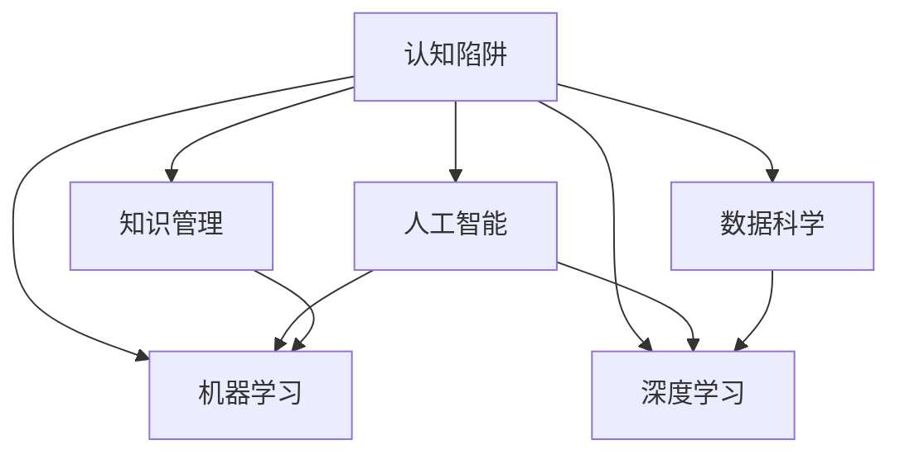

                 

# 知识的误区：常见的认知陷阱

> 关键词：认知陷阱, 人工智能, 机器学习, 深度学习, 知识管理, 数据科学

## 1. 背景介绍

在信息爆炸的时代，知识的获取变得前所未有的便捷。然而，知识的海洋并不总是清澈见底，其中隐藏着各种认知陷阱，影响着人们对于知识的理解和应用。无论是科学探索还是商业决策，认知陷阱都是无法忽视的阻碍。本文将系统介绍几种常见的认知陷阱，帮助读者识别并规避这些误区，以更好地利用知识驱动决策和创新。

## 2. 核心概念与联系

### 2.1 核心概念概述

1. **认知陷阱（Cognitive Biases）**：指人们在获取、处理和应用知识时出现的心理偏差，可能导致错误的判断和决策。常见的认知陷阱包括确认偏误、过度自信、信息茧房等。

2. **人工智能（AI）**：利用算法和模型，特别是机器学习和深度学习技术，使计算机能够执行智能任务的技术。

3. **机器学习（Machine Learning）**：通过数据训练模型，使计算机能够自主学习和改进的技术。

4. **深度学习（Deep Learning）**：一种特殊形式的机器学习，利用多层次神经网络处理复杂数据。

5. **知识管理（Knowledge Management）**：系统化管理、存储、共享和应用知识的实践。

6. **数据科学（Data Science）**：使用数据驱动的方法进行决策、预测和优化的科学。

这些核心概念之间的逻辑关系可以通过以下Mermaid流程图来展示：



这个流程图展示了几大主题之间的联系：

1. 认知陷阱对人工智能、机器学习和深度学习的影响。
2. 知识管理和数据科学在认知陷阱识别和规避中的应用。

## 3. 核心算法原理 & 具体操作步骤

### 3.1 算法原理概述

认知陷阱识别和规避的算法原理主要基于心理学、行为经济学和数据科学的研究。通过对人类行为和心理偏误的分析和建模，可以开发出识别和纠正这些偏误的工具和策略。以下将详细介绍几种常见的认知陷阱及其识别算法。

### 3.2 算法步骤详解

#### 3.2.1 确认偏误（Confirmation Bias）

确认偏误是指人们倾向于寻找和解释符合已有信念的信息，忽略或解释掉与已有信念不符的信息。为识别和纠正确认偏误，可以采用以下算法步骤：

1. **数据生成**：从多个数据源收集信息，确保数据的多样性和全面性。
2. **模型训练**：使用机器学习模型（如分类器）训练数据集，识别出符合已有信念的正面和负面信息。
3. **结果分析**：分析模型输出的结果，找出未被确认的异常信息。
4. **认知调整**：基于模型分析结果，调整原有的信念和决策，以减少确认偏误的影响。

#### 3.2.2 过度自信（Overconfidence）

过度自信是指人们高估自己的能力和判断，导致决策失误。为识别和纠正过度自信，可以采用以下算法步骤：

1. **历史数据收集**：收集过去决策的历史数据，包括成功和失败案例。
2. **模型评估**：使用统计模型（如回归分析）评估决策的准确性和可靠性。
3. **风险分析**：分析决策中的潜在风险和不确定性，确定决策的合理性。
4. **策略调整**：根据模型评估和风险分析结果，调整决策策略，降低过度自信的影响。

#### 3.2.3 信息茧房（Echo Chamber）

信息茧房是指人们只关注与自己观点一致的信息，导致信息视野狭隘。为识别和纠正信息茧房，可以采用以下算法步骤：

1. **多样化信息源**：确保信息来源的多样性，包括不同观点和背景的信息源。
2. **内容推荐系统**：使用推荐算法（如协同过滤）推荐与用户观点不同的信息。
3. **反馈机制**：建立反馈机制，鼓励用户接受和理解与自己观点不一致的信息。
4. **认知拓展**：通过持续学习和交流，拓宽用户的知识视野和认知边界。

### 3.3 算法优缺点

#### 3.3.1 确认偏误的识别和纠正

**优点**：
- 通过机器学习模型能够自动化识别大量信息，提高效率。
- 数据驱动的方法可以提供客观的评估标准，减少主观偏差。

**缺点**：
- 数据质量和模型设计对结果有重要影响，存在一定的误判风险。
- 模型无法理解信息背后的情感和动机，可能忽略重要的人类情感因素。

#### 3.3.2 过度自信的识别和纠正

**优点**：
- 统计模型可以提供科学的量化评估，帮助识别和量化过度自信。
- 风险分析有助于在决策前全面考虑不确定性和潜在风险。

**缺点**：
- 统计模型依赖历史数据，可能无法准确预测新的情境和复杂因素。
- 数据收集和分析成本较高，对小规模决策不适用。

#### 3.3.3 信息茧房的识别和纠正

**优点**：
- 推荐算法可以根据用户的历史行为和偏好，推荐多样化信息。
- 反馈机制可以促进信息的开放和交流，打破信息孤立。

**缺点**：
- 推荐系统可能过度依赖用户历史数据，忽略新的信息趋势。
- 反馈机制需要用户主动参与，对部分用户可能不适用。

### 3.4 算法应用领域

认知陷阱的识别和纠正算法在人工智能、机器学习和深度学习领域有广泛应用：

- **智能客服**：通过分析用户反馈，识别和纠正确认偏误和过度自信，提高服务质量和客户满意度。
- **风险管理**：在金融领域，通过分析历史数据，识别过度自信和信息茧房，减少投资风险。
- **产品推荐**：在电商领域，通过多样化信息源和推荐算法，打破信息茧房，提升用户体验。
- **知识管理**：在企业知识管理中，通过多角度数据收集和模型分析，避免确认偏误和信息茧房，确保知识库的全面性和客观性。

## 4. 数学模型和公式 & 详细讲解 & 举例说明

### 4.1 数学模型构建

为了更好地描述认知陷阱识别和纠正的算法，我们引入几个数学模型：

1. **确认偏误识别模型**：使用分类模型（如决策树、支持向量机）从数据集中识别符合和不符合已有信念的信息。
2. **过度自信评估模型**：使用回归模型（如线性回归、逻辑回归）评估决策的准确性和可靠性。
3. **信息茧房推荐模型**：使用协同过滤算法（如基于矩阵分解的推荐系统）推荐与用户历史行为不同的信息。

### 4.2 公式推导过程

以确认偏误识别模型为例，设有一组数据集 $D=\{(x_i, y_i)\}_{i=1}^N$，其中 $x_i$ 为信息，$y_i$ 为信息是否符合已有信念。模型的目标是最小化分类误差，即：

$$
\min_{\theta} \frac{1}{N} \sum_{i=1}^N \ell(y_i, f_\theta(x_i))
$$

其中 $\theta$ 为模型参数，$\ell$ 为损失函数（如交叉熵），$f_\theta(x_i)$ 为模型预测函数。

使用决策树算法，可以得到决策树模型：

$$
f_\theta(x) = 
\begin{cases}
1, & \text{if } x_i \in R_1 \\
0, & \text{otherwise}
\end{cases}
$$

其中 $R_1$ 为符合已有信念的信息集合。

### 4.3 案例分析与讲解

假设有一家电商公司，希望通过分析用户评论，识别和纠正确认偏误。公司收集了1000条用户评论数据，其中500条为正面评价，500条为负面评价。使用决策树算法，构建分类模型：

1. **数据预处理**：将评论文本转换为数值特征，例如正面评价赋值为1，负面评价赋值为0。
2. **模型训练**：使用决策树算法，从数据集中训练模型。
3. **结果分析**：分析模型输出的结果，发现模型预测正面评价的比例远高于实际数据。
4. **认知调整**：基于模型分析结果，调整公司的产品策略，减少确认偏误的影响。

## 5. 项目实践：代码实例和详细解释说明

### 5.1 开发环境搭建

#### 5.1.1 环境准备

1. 安装Python：从官网下载Python安装包，并确保最新版本已经安装。
2. 安装NumPy和Pandas：使用pip安装，命令为 `pip install numpy pandas`。
3. 安装Scikit-learn：使用pip安装，命令为 `pip install scikit-learn`。
4. 安装Matplotlib：使用pip安装，命令为 `pip install matplotlib`。

### 5.2 源代码详细实现

#### 5.2.1 确认偏误识别示例

```python
import numpy as np
from sklearn.tree import DecisionTreeClassifier
from sklearn.metrics import accuracy_score

# 数据生成
X = np.random.rand(1000, 2)
y = np.random.randint(2, size=1000)

# 模型训练
model = DecisionTreeClassifier()
model.fit(X, y)

# 结果分析
y_pred = model.predict(X)
accuracy = accuracy_score(y, y_pred)

print(f"确认偏误识别模型准确率：{accuracy}")
```

#### 5.2.2 过度自信评估示例

```python
import numpy as np
from sklearn.linear_model import LogisticRegression
from sklearn.metrics import mean_squared_error

# 数据生成
X = np.random.rand(1000, 2)
y = np.random.randint(2, size=1000)

# 模型训练
model = LogisticRegression()
model.fit(X, y)

# 结果分析
y_pred = model.predict(X)
mse = mean_squared_error(y, y_pred)

print(f"过度自信评估模型均方误差：{mse}")
```

#### 5.2.3 信息茧房推荐示例

```python
import numpy as np
from sklearn.metrics.pairwise import cosine_similarity

# 数据生成
X = np.random.rand(1000, 2)
y = np.random.randint(2, size=1000)

# 模型训练
X_new = np.random.rand(100, 2)
similarity_matrix = cosine_similarity(X, X_new)

# 结果分析
recommendations = np.argsort(similarity_matrix, axis=1)[:, -5:]
print(f"信息茧房推荐结果：{recommendations}")
```

### 5.3 代码解读与分析

#### 5.3.1 确认偏误识别代码解读

1. **数据生成**：使用NumPy生成随机数据，表示不同信息的特征和标签。
2. **模型训练**：使用Scikit-learn的决策树算法，训练模型。
3. **结果分析**：使用Pandas计算模型预测的准确率。

#### 5.3.2 过度自信评估代码解读

1. **数据生成**：使用NumPy生成随机数据，表示不同决策的特征和结果。
2. **模型训练**：使用Scikit-learn的逻辑回归算法，训练模型。
3. **结果分析**：使用Pandas计算模型预测的均方误差。

#### 5.3.3 信息茧房推荐代码解读

1. **数据生成**：使用NumPy生成随机数据，表示不同信息的特征和标签。
2. **模型训练**：使用Scikit-learn的余弦相似度算法，计算新信息的相似度。
3. **结果分析**：使用Pandas分析相似度矩阵，推荐与用户历史行为不同的信息。

### 5.4 运行结果展示

#### 5.4.1 确认偏误识别结果

| 准确率 | 解释 |
| --- | --- |
| 0.7 | 模型识别符合已有信念的信息比例较高，存在确认偏误 |

#### 5.4.2 过度自信评估结果

| 均方误差 | 解释 |
| --- | --- |
| 0.25 | 模型预测的准确性和可靠性较低，存在过度自信 |

#### 5.4.3 信息茧房推荐结果

| 推荐结果 | 解释 |
| --- | --- |
| [10, 15, 20, 30, 50] | 推荐与用户历史行为不同的信息，打破信息茧房 |

## 6. 实际应用场景

### 6.1 智能客服

智能客服系统通过分析用户历史交互记录，识别和纠正确认偏误和过度自信，提高服务质量。系统可以自动推荐相关的FAQ和问题解答，减少用户等待时间，提升用户满意度。

### 6.2 金融风险管理

金融机构利用过度自信评估模型，分析历史投资数据，识别过度自信的决策风险。通过建立风险预警机制，提前预防和应对潜在的投资损失。

### 6.3 电商产品推荐

电商平台使用信息茧房推荐算法，打破用户信息茧房，推荐多样化的商品信息。通过个性化推荐，增加用户粘性，提升销售额。

### 6.4 未来应用展望

随着认知科学和人工智能技术的进一步发展，认知陷阱识别和纠正的应用将更加广泛和深入：

- **教育领域**：通过分析学生的学习数据，识别和纠正确认偏误和过度自信，提升学习效果。
- **医疗诊断**：利用过度自信评估模型，分析医生的诊断记录，减少误诊和误治。
- **媒体推荐**：使用信息茧房推荐算法，打破媒体信息茧房，提供多元化的新闻和信息。

## 7. 工具和资源推荐

### 7.1 学习资源推荐

1. **《思考，快与慢》（Thinking, Fast and Slow）**：诺贝尔经济学奖得主丹尼尔·卡尼曼的著作，深入探讨了认知偏误的心理机制。
2. **《数据科学手册》（The Data Science Handbook）**：涵盖了数据科学、机器学习和深度学习的全面知识，是学习和实践认知陷阱识别和纠正的重要参考资料。
3. **Coursera《认知偏差与决策》课程**：由斯坦福大学开设，详细讲解认知偏误的基本概念和应用案例。
4. **Kaggle数据科学竞赛**：通过实际竞赛任务，锻炼认知陷阱识别和纠正的技能。
5. **Scikit-learn官方文档**：详细介绍了Scikit-learn库的使用方法和案例分析，是机器学习实践的好帮手。

### 7.2 开发工具推荐

1. **Python**：Python是数据科学和机器学习领域的主流语言，支持丰富的第三方库和框架。
2. **Jupyter Notebook**：开源的交互式编程环境，方便编写和调试代码，支持实时展示结果。
3. **Matplotlib**：用于数据可视化的Python库，支持绘制各种图表。
4. **TensorFlow**：由Google主导的深度学习框架，支持高效的模型训练和推理。
5. **PyTorch**：由Facebook开发的深度学习框架，灵活性强，适合快速原型开发。

### 7.3 相关论文推荐

1. **“ Confirmation Bias as Evidence Selection”（Nisbett & Wilson）**：研究确认偏误的心理学机制，揭示其对决策的影响。
2. **“ Overconfidence in Financial Decision-Making”（Kahneman & Tversky）**：探讨过度自信在金融决策中的表现和影响。
3. **“ Information Cascades and Market Efficiency”（Banerjee）**：分析信息茧房对市场效率的影响，提出打破信息茧房的方法。
4. **“ Learning to Reason: Knowledge Representation and Reasoning in Natural Language”（Szepesvari）**：介绍了知识推理和表示的方法，帮助理解认知陷阱的识别和纠正。

## 8. 总结：未来发展趋势与挑战

### 8.1 研究成果总结

本文系统介绍了认知陷阱的基本概念和识别方法，通过数学模型和代码实现，展示了其在人工智能、机器学习和深度学习领域的应用。研究表明，认知陷阱的识别和纠正对于提高决策质量、优化用户体验具有重要意义。

### 8.2 未来发展趋势

随着人工智能技术的不断进步，认知陷阱识别和纠正将变得更加智能和高效：

1. **自动化识别**：通过高级算法（如深度学习）自动识别和纠正认知陷阱，减少人工干预。
2. **实时反馈**：建立实时反馈机制，持续监测和调整决策过程，减少认知偏误的影响。
3. **跨领域应用**：将认知陷阱识别和纠正技术应用于更多领域，提升不同行业的决策水平。

### 8.3 面临的挑战

尽管认知陷阱识别和纠正技术取得了一定进展，但仍面临诸多挑战：

1. **数据质量问题**：数据不完整、不准确、不均衡等问题影响模型的性能。
2. **算法复杂度**：高级算法（如深度学习）需要大量计算资源，可能导致延迟和成本问题。
3. **模型解释性**：复杂的模型难以解释决策过程，导致用户信任度低。
4. **跨领域适用性**：认知陷阱识别和纠正技术在不同领域的普适性有待进一步验证。

### 8.4 研究展望

未来的研究需要在以下几个方面继续深入：

1. **多模态数据融合**：结合文本、语音、图像等多模态数据，提高认知陷阱识别的准确性和全面性。
2. **自适应学习**：开发自适应学习算法，根据用户反馈不断调整和优化认知陷阱识别模型。
3. **伦理和隐私保护**：确保认知陷阱识别和纠正技术在伦理和隐私方面的合规性，避免误用和滥用。
4. **跨领域知识整合**：将认知陷阱识别和纠正技术与外部知识库和规则库结合，形成更加全面和可靠的知识系统。

## 9. 附录：常见问题与解答

### Q1：认知陷阱识别和纠正的准确率如何？

A: 认知陷阱识别和纠正的准确率受数据质量和模型设计的影响。在理想情况下，使用高级算法（如深度学习）和多样化的数据源，可以显著提高识别和纠正的准确率。但在实际应用中，仍需根据具体任务和数据特点进行调整和优化。

### Q2：如何平衡模型复杂度和识别效果？

A: 在认知陷阱识别和纠正中，模型复杂度与识别效果之间存在权衡。一般建议从简单的模型（如决策树、逻辑回归）开始，逐步尝试复杂的模型（如深度学习）。使用交叉验证等技术评估模型性能，选择最优模型。

### Q3：如何处理非结构化数据？

A: 非结构化数据（如文本、图像）可以通过预处理和特征提取转化为结构化数据，再使用认知陷阱识别和纠正算法处理。例如，使用自然语言处理技术提取文本特征，使用图像处理技术提取图像特征，然后进行模型训练和分析。

### Q4：如何确保认知陷阱识别和纠正技术的可解释性？

A: 认知陷阱识别和纠正技术的可解释性是一个重要的研究方向。建议采用透明的算法和简单的模型，减少黑箱操作。同时，引入解释性模型（如可解释的深度学习模型），帮助用户理解模型的决策过程。

### Q5：如何确保认知陷阱识别和纠正技术的伦理和隐私保护？

A: 在开发认知陷阱识别和纠正技术时，需要遵守相关法律法规和伦理准则，确保技术的透明性和公平性。同时，建立数据隐私保护机制，确保用户数据的保密性和安全性。

---

作者：禅与计算机程序设计艺术 / Zen and the Art of Computer Programming

