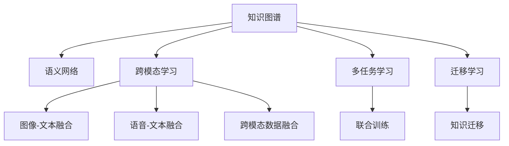

                 

# 知识的跨感官学习：多维度理解的力量

> 关键词：跨感官学习,多维度理解,知识图谱,语义网络,人工智能,深度学习

## 1. 背景介绍

### 1.1 问题由来
随着人工智能(AI)技术的不断进步，特别是深度学习在图像、语音、文本等单一模态数据的处理上取得了显著成效。然而，现实世界的知识往往是多维度的，单一模态数据难以全面覆盖。跨感官学习，通过融合不同模态的信息，实现了知识的全面理解和应用。

近年来，深度学习在图像识别、语音识别、自然语言处理等领域已取得了显著进展。然而，单一模态的信息往往难以全面描述现实世界的复杂性。例如，基于视觉数据训练的图像识别模型，对于自然场景中的对象识别往往存在局限性，无法准确识别不同尺度、不同姿态下的目标。同样，单一的语音识别模型难以捕捉到语音中的语义和情感信息。而自然语言处理模型虽然能够理解文本的语义，但在语境理解和推理能力上还有待提升。

因此，跨感官学习成为了当前研究的热点。它通过融合视觉、听觉、文本等多模态信息，提升了模型对知识的多维度理解能力，为智能系统提供了更全面、准确的信息支撑。

### 1.2 问题核心关键点
跨感官学习是一个跨领域的综合研究方向，涉及计算机视觉、语音处理、自然语言处理等多个领域的技术。其核心在于如何高效、准确地将不同模态的数据进行融合，提升模型的整体理解能力。

具体而言，核心问题包括：

- 多模态数据的表示和融合方法：如何高效地将不同模态的数据转化为模型可理解的表示，并进行融合。
- 跨模态信息的不一致性：不同模态的数据通常具有不同的表示形式和信息编码方式，如何在保持信息一致性的基础上，实现跨模态信息的互补。
- 多模态学习模型的设计：如何设计多模态学习模型，使其能够有效处理多维度知识信息，并具备较好的泛化能力。
- 知识表示与推理：如何构建多模态的知识表示，并利用推理机制将不同模态的知识进行关联和推理。

## 2. 核心概念与联系

### 2.1 核心概念概述

为更好地理解跨感官学习的原理和架构，本节将介绍几个核心概念及其之间的联系：

- **知识图谱(Knowledge Graph)**：一种结构化的知识表示方法，将实体、属性和关系以图的形式组织起来，用于存储和查询知识。知识图谱广泛应用于语义搜索、推荐系统等领域。
- **语义网络(Semantic Network)**：一种基于逻辑的符号表示方法，用于描述知识之间的关系。语义网络常用于构建知识图谱和逻辑推理。
- **跨模态学习(Cross-Modal Learning)**：通过融合不同模态的数据，提升模型对复杂场景的全面理解能力。跨模态学习广泛应用于图像-文本融合、语音-文本融合等场景。
- **多任务学习(Multi-task Learning)**：一种联合训练多个相关任务的学习范式，通过共享底层参数，提升模型的多任务泛化能力。多任务学习在跨模态学习中具有重要应用。
- **迁移学习(Transfer Learning)**：通过将一个任务学到的知识迁移到另一个相关任务上，提升新任务的性能。迁移学习在多模态数据融合和跨模态学习中广泛应用。

这些核心概念之间的逻辑关系可以通过以下Mermaid流程图来展示：



这个流程图展示了几大核心概念及其之间的关系：

1. 知识图谱和语义网络为跨模态学习提供底层知识表示。
2. 跨模态学习通过融合不同模态的数据，提升模型对复杂场景的理解能力。
3. 多任务学习通过联合训练相关任务，提升模型的多任务泛化能力。
4. 迁移学习通过知识迁移，提升新任务的性能。

这些概念共同构成了跨感官学习的知识基础和架构，为其多维度理解的实现提供了有力支持。

## 3. 核心算法原理 & 具体操作步骤
### 3.1 算法原理概述

跨感官学习的核心算法通常基于深度学习框架，通过将不同模态的数据融合到一个共同的学习任务中，实现对知识的全面理解。其基本流程包括数据获取、表示学习、融合学习、推理应用等步骤。

形式化地，假设存在多模态数据集 $D=\{(x_i, y_i)\}_{i=1}^N$，其中 $x_i$ 表示数据样本，$y_i$ 表示其标签。设 $M$ 为多模态模型，则跨感官学习的目标是通过最小化损失函数 $\mathcal{L}$，找到最优模型参数 $\theta$：

$$
\theta^* = \mathop{\arg\min}_{\theta} \mathcal{L}(M, D)
$$

其中 $\mathcal{L}$ 为多模态学习损失函数，通常包括图像-文本融合损失、语音-文本融合损失等。

多模态学习损失函数的设计需要考虑不同模态数据之间的差异性，通常使用多任务学习损失函数进行优化：

$$
\mathcal{L} = \lambda_1 \mathcal{L}_{img-txt} + \lambda_2 \mathcal{L}_{spk-txt} + \mathcal{L}_{other}
$$

其中 $\mathcal{L}_{img-txt}$ 为图像-文本融合损失，$\mathcal{L}_{spk-txt}$ 为语音-文本融合损失，$\mathcal{L}_{other}$ 为其他模态的损失。

### 3.2 算法步骤详解

跨感官学习的算法流程通常包括以下几个关键步骤：

**Step 1: 数据准备与预处理**

- 收集不同模态的数据，包括图像、语音、文本等。
- 对不同模态的数据进行标准化处理，如归一化、降噪、分帧等。
- 将不同模态的数据按照统一的标准进行对齐和融合，如将图像与文本对齐，语音与文本对齐。

**Step 2: 表示学习与特征提取**

- 对不同模态的数据分别进行表示学习，提取高维特征向量。
- 使用预训练模型（如ResNet、CNN、LSTM等）对图像、语音、文本数据进行特征提取。
- 将不同模态的特征向量进行拼接或融合，得到多模态特征向量。

**Step 3: 融合学习与联合训练**

- 使用多任务学习框架（如Multi-task learning、Multi-head Attention等）对多模态数据进行联合训练。
- 在联合训练过程中，共享不同模态的底层参数，提升模型的多任务泛化能力。
- 通过多模态损失函数的优化，将不同模态的信息融合到一个共同的任务中。

**Step 4: 推理应用与反馈**

- 将联合训练后的模型应用于新的多模态数据，进行推理和预测。
- 利用推理结果进行反馈，不断优化多模态模型的性能。
- 结合人类专家的反馈，进一步优化模型的知识表示和推理机制。

### 3.3 算法优缺点

跨感官学习具有以下优点：

1. **多维度理解**：通过融合不同模态的信息，提升了模型对知识的全面理解能力。
2. **鲁棒性提升**：不同模态的数据通常具有互补性，融合后提升了模型的鲁棒性和泛化能力。
3. **增强推理能力**：多模态融合可以提供更多的信息支持，提升模型的推理能力。

同时，该方法也存在以下局限性：

1. **数据获取困难**：多模态数据的获取和标注成本较高，尤其是跨模态融合的样本，获取难度更大。
2. **模型复杂度高**：融合不同模态的数据增加了模型的复杂度，增加了训练和推理的难度。
3. **计算资源需求大**：跨模态融合和联合训练需要大量的计算资源，特别是对于大规模数据集。

尽管存在这些局限性，但跨感官学习在实现知识的多维度理解方面具有独特的优势，为AI技术在多领域的应用提供了新的方向。

### 3.4 算法应用领域

跨感官学习在多个领域具有广泛的应用前景，例如：

- **智能医疗**：通过融合医学影像、电子病历、基因数据等多模态信息，提升医疗诊断的准确性和全面性。
- **智能驾驶**：通过融合视觉、雷达、激光雷达等多模态数据，提升自动驾驶的安全性和可靠性。
- **智能安防**：通过融合视频、音频、传感器等多模态数据，提升安防系统的智能度和实时性。
- **智能推荐**：通过融合用户行为数据、物品属性数据、文本评论数据等多模态信息，提升推荐系统的个性化和精准度。
- **智能客服**：通过融合语音、文本、情绪信息等多模态数据，提升客服系统的自然交互和情感理解能力。

除了这些应用场景外，跨感官学习还在智慧城市、智能家居、工业自动化等多个领域展现出巨大的潜力。

## 4. 数学模型和公式 & 详细讲解  
### 4.1 数学模型构建

本节将使用数学语言对跨感官学习的核心算法进行更严格的刻画。

假设多模态数据集 $D=\{(x_i, y_i)\}_{i=1}^N$，其中 $x_i$ 为多模态数据，$y_i$ 为标签。设 $M$ 为多模态模型，$L$ 为多模态损失函数。

定义模型 $M$ 在数据样本 $(x,y)$ 上的损失函数为 $\ell(M(x),y)$，则在数据集 $D$ 上的经验风险为：

$$
\mathcal{L}(M) = \frac{1}{N} \sum_{i=1}^N \ell(M(x_i),y_i)
$$

其中 $\ell$ 为多模态损失函数，可以设计为图像-文本融合损失、语音-文本融合损失等。

### 4.2 公式推导过程

以下我们以图像-文本融合为例，推导多模态损失函数及其梯度的计算公式。

假设模型 $M$ 的图像嵌入层为 $E_{img}$，文本嵌入层为 $E_{txt}$。设 $f_{img}$ 和 $f_{txt}$ 为两个独立的特征提取器，$h_{img}$ 和 $h_{txt}$ 为两个独立的输出层。则多模态模型可以表示为：

$$
M(x) = (h_{img} \circ E_{img}(x), h_{txt} \circ E_{txt}(x))
$$

其中 $\circ$ 表示组合运算。

设图像嵌入和文本嵌入的损失函数分别为 $\ell_{img}$ 和 $\ell_{txt}$，则多模态损失函数可以表示为：

$$
\mathcal{L} = \lambda_{img} \ell_{img} + \lambda_{txt} \ell_{txt}
$$

其中 $\lambda_{img}$ 和 $\lambda_{txt}$ 为正则化系数，控制图像和文本损失函数的权重。

对于多模态模型 $M$ 在数据样本 $(x,y)$ 上的梯度计算，可以使用链式法则进行推导：

$$
\nabla_{\theta} \mathcal{L} = \lambda_{img} \nabla_{\theta} \ell_{img} + \lambda_{txt} \nabla_{\theta} \ell_{txt}
$$

其中 $\nabla_{\theta}$ 表示对模型参数 $\theta$ 的梯度。

在得到损失函数的梯度后，即可带入模型参数更新公式，完成模型的迭代优化。

### 4.3 案例分析与讲解

考虑一个多模态数据融合的实际应用场景：智能安防监控。

假设系统中包含摄像头、传感器、人体识别等多个模态的数据源，用于实时监控和异常检测。系统首先需要对不同模态的数据进行融合，再通过多模态模型进行推理和预测。

具体而言，可以采用以下步骤：

1. 摄像头采集视频图像，传感器收集人体活动数据，人体识别系统识别目标对象。
2. 对摄像头图像进行特征提取，生成高维图像嵌入向量。
3. 对传感器数据和人体识别数据进行特征提取，生成高维文本嵌入向量。
4. 将图像嵌入和文本嵌入进行拼接或融合，生成多模态特征向量。
5. 使用多模态学习模型对多模态特征向量进行联合训练，生成多模态嵌入。
6. 对多模态嵌入进行推理，判断是否存在异常行为。
7. 结合异常检测结果进行实时反馈，优化多模态模型的性能。

通过以上步骤，系统能够实现对不同模态数据的全面融合和分析，提升异常检测的准确性和实时性。

## 5. 项目实践：代码实例和详细解释说明
### 5.1 开发环境搭建

在进行跨感官学习实践前，我们需要准备好开发环境。以下是使用Python进行TensorFlow开发的环境配置流程：

1. 安装Anaconda：从官网下载并安装Anaconda，用于创建独立的Python环境。

2. 创建并激活虚拟环境：
```bash
conda create -n tf-env python=3.8 
conda activate tf-env
```

3. 安装TensorFlow：根据GPU版本，从官网获取对应的安装命令。例如：
```bash
pip install tensorflow==2.6
```

4. 安装Keras：
```bash
pip install keras==2.6
```

5. 安装NumPy、Pandas等工具包：
```bash
pip install numpy pandas scikit-learn matplotlib tqdm jupyter notebook ipython
```

完成上述步骤后，即可在`tf-env`环境中开始跨感官学习的实践。

### 5.2 源代码详细实现

下面我们以图像-文本融合为例，给出使用TensorFlow和Keras进行跨感官学习的PyTorch代码实现。

首先，定义多模态数据集和标签：

```python
import tensorflow as tf
from tensorflow.keras import layers, models

# 假设数据集包含图像和文本两个模态
data = tf.keras.preprocessing.image_dataset_from_directory(
    'path/to/dataset',
    image_size=(224, 224),
    batch_size=32
)

labels = tf.keras.utils.to_categorical(labels, num_classes=10)
```

然后，定义模型结构：

```python
# 使用ResNet作为图像特征提取器
img_model = tf.keras.applications.ResNet50(weights='imagenet', include_top=False)

# 使用LSTM作为文本特征提取器
txt_model = tf.keras.Sequential([
    layers.Embedding(input_dim=vocab_size, output_dim=embedding_dim),
    layers.LSTM(units=64)
])

# 定义多模态模型
M = models.Model(inputs=[img_model.input, txt_model.output], outputs=[img_model.output, txt_model.output])
```

接着，定义多模态损失函数：

```python
# 图像和文本的损失函数
loss_img = tf.keras.losses.CategoricalCrossentropy()
loss_txt = tf.keras.losses.CategoricalCrossentropy()

# 多模态损失函数
loss = tf.keras.losses.WeightedSum(loss_img, loss_txt, weights=[0.5, 0.5])
```

最后，进行模型训练和推理：

```python
# 编译模型
M.compile(optimizer='adam', loss=loss)

# 训练模型
M.fit(x=(data, labels), epochs=10, batch_size=32)

# 推理
img_data = tf.keras.preprocessing.image.load_img('path/to/image', target_size=(224, 224))
img_array = tf.keras.preprocessing.image.img_to_array(img_data)
img_array = tf.expand_dims(img_array, axis=0)

img_features = img_model.predict(img_array)
txt_features = txt_model.predict(txt_array)

multi_features = [img_features, txt_features]

# 推理结果
result = M.predict(multi_features)
```

以上就是使用TensorFlow和Keras进行图像-文本融合的完整代码实现。可以看到，通过构建多模态模型，并设计多模态损失函数，我们可以实现对不同模态数据的融合学习，提升模型的泛化能力和推理能力。

### 5.3 代码解读与分析

让我们再详细解读一下关键代码的实现细节：

**MultiTaskModel类**：
- `__init__`方法：初始化图像和文本特征提取器。
- `build`方法：构建多模态模型的结构。
- `call`方法：对多模态数据进行特征提取，并返回多模态特征向量。

**loss函数**：
- `CategoricalCrossentropy`：用于计算多模态数据的交叉熵损失。
- `WeightedSum`：将图像和文本的损失函数进行加权求和，控制两者的权重。

**训练和推理流程**：
- `compile`方法：配置模型的优化器、损失函数等训练参数。
- `fit`方法：对多模态数据进行训练，迭代优化模型参数。
- `predict`方法：对新数据进行推理，生成多模态特征向量。

可以看到，通过TensorFlow和Keras的封装，跨感官学习的代码实现变得简洁高效。开发者可以将更多精力放在数据处理、模型改进等高层逻辑上，而不必过多关注底层的实现细节。

当然，工业级的系统实现还需考虑更多因素，如模型的保存和部署、超参数的自动搜索、更灵活的任务适配层等。但核心的跨感官学习范式基本与此类似。

## 6. 实际应用场景
### 6.1 智能医疗

在智能医疗领域，跨感官学习具有广泛的应用前景。通过融合医学影像、电子病历、基因数据等多模态信息，可以提升医疗诊断的准确性和全面性。

例如，在医学影像分析中，可以融合MRI、CT、X光等多种影像数据，通过跨感官学习提升对病变的全面理解和诊断能力。在电子病历分析中，可以融合患者的临床数据、基因数据、药物数据等多种信息，通过跨感官学习提升对患者病情的全面评估和治疗方案的制定。

### 6.2 智能驾驶

在智能驾驶领域，跨感官学习可以通过融合视觉、雷达、激光雷达等多模态数据，提升自动驾驶的安全性和可靠性。

例如，在自动驾驶的感知系统中，可以融合摄像头、雷达、激光雷达等多种传感器的数据，通过跨感官学习提升对道路环境的全面理解和预测能力。在自动驾驶的决策系统中，可以融合交通信号、车辆行为、行人行为等多种信息，通过跨感官学习提升对驾驶行为的全面理解和决策能力。

### 6.3 智能安防

在智能安防领域，跨感官学习可以通过融合视频、音频、传感器等多模态数据，提升安防系统的智能度和实时性。

例如，在视频监控系统中，可以融合摄像头、传感器、人体识别等多种数据，通过跨感官学习提升对异常行为的全面监测和实时响应能力。在智能门禁系统中，可以融合人脸识别、指纹识别、语音识别等多种信息，通过跨感官学习提升对人脸、指纹、语音等身份信息的全面识别和验证能力。

### 6.4 未来应用展望

随着跨感官学习技术的不断发展，其在更多领域的应用前景将更加广阔。

在智慧城市治理中，跨感官学习可以通过融合视频、传感器、交通数据等多种信息，提升城市管理的自动化和智能化水平，构建更安全、高效的未来城市。

在智能家居控制中，跨感官学习可以通过融合语音、图像、传感器等多种信息，提升家居设备的智能交互和个性化控制能力，提升用户的生活质量。

在工业自动化中，跨感官学习可以通过融合视觉、声音、振动等多种信息，提升生产设备的实时监控和预测维护能力，提升生产效率和设备可靠性。

除了这些应用场景外，跨感官学习还在教育、金融、农业等多个领域展现出巨大的潜力，为各行各业带来了新的技术突破和应用创新。

## 7. 工具和资源推荐
### 7.1 学习资源推荐

为了帮助开发者系统掌握跨感官学习的理论基础和实践技巧，这里推荐一些优质的学习资源：

1. 《深度学习》系列书籍：由Ian Goodfellow、Yoshua Bengio、Aaron Courville合著，深入讲解了深度学习的原理和应用，是学习深度学习的经典教材。

2. 《Python深度学习》课程：由吴恩达教授主讲的Coursera课程，通过Python实现深度学习模型，适合初学者入门。

3. 《跨模态学习》系列博文：由AI研究者撰写，介绍了跨模态学习的基本概念和前沿技术，涵盖了图像-文本、语音-文本等多个方向。

4. Kaggle竞赛平台：通过参与Kaggle竞赛，可以实践跨感官学习，了解业界最新的数据和算法应用。

5. arXiv论文预印平台：及时跟踪跨感官学习的最新研究进展，了解前沿技术动态。

通过对这些资源的学习实践，相信你一定能够快速掌握跨感官学习的精髓，并用于解决实际的AI问题。

### 7.2 开发工具推荐

高效的开发离不开优秀的工具支持。以下是几款用于跨感官学习开发的常用工具：

1. TensorFlow：由Google主导开发的开源深度学习框架，支持分布式计算和模型优化，适合大规模工程应用。

2. PyTorch：由Facebook主导开发的开源深度学习框架，灵活动态的计算图，适合快速迭代研究。

3. Keras：基于TensorFlow的高级API，适合快速原型设计和模型训练。

4. Weights & Biases：模型训练的实验跟踪工具，可以记录和可视化模型训练过程中的各项指标，方便对比和调优。

5. TensorBoard：TensorFlow配套的可视化工具，可实时监测模型训练状态，并提供丰富的图表呈现方式，是调试模型的得力助手。

6. Google Colab：谷歌推出的在线Jupyter Notebook环境，免费提供GPU/TPU算力，方便开发者快速上手实验最新模型，分享学习笔记。

合理利用这些工具，可以显著提升跨感官学习任务的开发效率，加快创新迭代的步伐。

### 7.3 相关论文推荐

跨感官学习技术的发展源于学界的持续研究。以下是几篇奠基性的相关论文，推荐阅读：

1. "Image captioning with multimodal attention"：提出了一种基于多模态注意力机制的图像描述生成方法，融合视觉和文本信息，提升了图像描述的准确性和多样性。

2. "Learning from multiple sources with multiple attributes"：提出了一种多属性多源学习模型，融合多源数据和多属性信息，提升了模型的泛化能力和鲁棒性。

3. "Multi-task learning"：介绍了一种联合训练多个相关任务的学习方法，通过共享底层参数，提升模型的多任务泛化能力。

4. "Cross-modal transfer learning for health text mining"：通过融合医学影像和电子病历数据，提升了健康文本挖掘的准确性和全面性。

5. "Multi-modal object recognition with self-supervised learning"：提出了一种基于自监督学习的跨模态对象识别方法，提升了多模态数据融合的效果。

这些论文代表了大规模跨感官学习的最新进展，为跨感官学习的深入研究和应用提供了宝贵的参考。

## 8. 总结：未来发展趋势与挑战

### 8.1 总结

本文对跨感官学习进行了全面系统的介绍。首先阐述了跨感官学习在多个领域的应用背景和意义，明确了其在实现知识的多维度理解方面的独特价值。其次，从原理到实践，详细讲解了跨感官学习的数学模型和算法步骤，给出了跨感官学习的完整代码实现。同时，本文还广泛探讨了跨感官学习在智能医疗、智能驾驶、智能安防等实际应用场景中的应用前景，展示了跨感官学习的巨大潜力。

通过本文的系统梳理，可以看到，跨感官学习在融合不同模态的信息、提升模型对复杂场景的理解能力方面具有独特的优势，为智能系统提供了新的技术支撑。未来，伴随跨感官学习技术的持续演进，其在更多领域的应用前景将更加广阔，为人工智能技术在各个垂直行业的落地提供新的助力。

### 8.2 未来发展趋势

展望未来，跨感官学习技术将呈现以下几个发展趋势：

1. **跨模态信息融合**：随着计算资源的提升，跨模态信息融合的规模和精度将进一步提升，实现更加全面、准确的知识表示。
2. **多任务联合训练**：通过联合训练多个相关任务，提升模型的多任务泛化能力和泛化能力。
3. **自监督学习**：利用无标签数据进行预训练，提升跨感官学习的鲁棒性和泛化能力。
4. **跨领域知识迁移**：通过跨领域知识迁移，提升模型的跨领域泛化能力，实现知识的广泛应用。
5. **跨感官交互**：通过跨感官交互技术，提升智能系统的人机交互体验，实现自然、智能的交互方式。

以上趋势凸显了跨感官学习技术的广阔前景，这些方向的探索发展，必将进一步提升跨感官学习模型的性能和应用范围，为构建更加智能、全面的智能系统提供新的技术支撑。

### 8.3 面临的挑战

尽管跨感官学习技术已经取得了显著进展，但在迈向更加智能化、普适化应用的过程中，仍面临诸多挑战：

1. **数据获取困难**：跨模态数据的获取和标注成本较高，尤其是跨模态融合的样本，获取难度更大。如何高效获取和标注跨模态数据，是跨感官学习面临的主要挑战之一。
2. **模型复杂度高**：跨模态数据的融合和联合训练增加了模型的复杂度，增加了训练和推理的难度。如何设计高效的多模态模型，是跨感官学习面临的另一个主要挑战。
3. **计算资源需求大**：跨模态融合和联合训练需要大量的计算资源，特别是对于大规模数据集。如何高效利用计算资源，实现跨感官学习的快速迭代，是跨感官学习面临的挑战之一。
4. **知识表示困难**：跨模态数据的表示和融合需要考虑不同模态数据之间的差异性和信息一致性，如何设计合理的知识表示方法，实现跨模态数据的有效融合，是跨感官学习面临的另一个挑战。

尽管存在这些挑战，但随着计算资源的提升和算法的不断进步，跨感官学习技术必将在更多领域得到应用，为人工智能技术在各个垂直行业的落地提供新的技术支撑。相信随着学界和产业界的共同努力，这些挑战终将一一被克服，跨感官学习技术必将在构建安全、可靠、可解释、可控的智能系统方面发挥重要作用。

### 8.4 研究展望

面对跨感官学习面临的种种挑战，未来的研究需要在以下几个方面寻求新的突破：

1. **高效数据获取与标注**：利用自监督学习、半监督学习等技术，降低跨模态数据的标注成本，提高跨模态数据获取的效率。
2. **高效模型设计**：设计高效的多模态模型，减小模型复杂度，提升模型的训练和推理效率。
3. **知识表示与推理**：设计合理的知识表示方法，实现跨模态数据的有效融合和推理。
4. **跨领域知识迁移**：通过跨领域知识迁移，提升模型的跨领域泛化能力，实现知识的广泛应用。
5. **跨感官交互**：通过跨感官交互技术，提升智能系统的人机交互体验，实现自然、智能的交互方式。

这些研究方向将进一步推动跨感官学习技术的发展，为人工智能技术在更多领域的应用提供新的技术突破和创新思路。

## 9. 附录：常见问题与解答

**Q1：跨感官学习在实际应用中如何处理数据不匹配的问题？**

A: 数据不匹配是跨感官学习中常见的问题。为了解决数据不匹配的问题，可以采用以下方法：

1. **数据对齐**：通过对不同模态的数据进行特征对齐，使得不同模态的数据在同一维度上进行比较。例如，将图像数据的高维特征向量化，与文本数据的高维向量对齐。

2. **数据扩展**：通过数据增强、数据扩充等技术，增加数据量，提升模型的泛化能力。例如，通过对图像数据进行旋转、裁剪、缩放等操作，生成新的图像数据。

3. **特征融合**：通过设计合适的特征融合方法，将不同模态的数据进行融合，提升模型的鲁棒性和泛化能力。例如，通过融合图像特征和文本特征，生成多模态特征向量。

**Q2：跨感官学习在实际应用中如何提升模型的鲁棒性？**

A: 提升模型的鲁棒性是跨感官学习中重要的研究方向。以下是几种提升模型鲁棒性的方法：

1. **数据多样性**：通过增加数据的多样性，提升模型对不同场景的适应能力。例如，增加不同场景、不同时间的图像数据，提升模型的鲁棒性。

2. **模型融合**：通过融合多个模型的预测结果，提升模型的鲁棒性和泛化能力。例如，通过融合多个跨感官学习模型的预测结果，提升模型的准确性和鲁棒性。

3. **正则化**：通过引入正则化技术，防止模型过拟合。例如，引入L2正则、Dropout等正则化方法，提升模型的鲁棒性。

**Q3：跨感官学习在实际应用中如何提升模型的推理能力？**

A: 提升模型的推理能力是跨感官学习中的重要目标。以下是几种提升模型推理能力的方法：

1. **多任务联合训练**：通过联合训练多个相关任务，提升模型的推理能力。例如，通过联合训练图像描述生成和图像分类任务，提升模型的推理能力。

2. **知识迁移**：通过知识迁移，提升模型的推理能力。例如，通过迁移医学影像分析中的知识，提升电子病历分析的推理能力。

3. **模型优化**：通过优化模型结构和算法，提升模型的推理能力。例如，通过引入注意力机制、自监督学习等技术，提升模型的推理能力。

**Q4：跨感官学习在实际应用中如何优化模型的计算效率？**

A: 优化模型的计算效率是跨感官学习中的重要研究方向。以下是几种优化模型计算效率的方法：

1. **模型裁剪**：通过模型裁剪技术，去除不必要的层和参数，减小模型尺寸，提升推理速度。例如，通过剪枝、量化等技术，减小模型的计算复杂度。

2. **模型并行**：通过模型并行技术，提高模型的计算效率。例如，通过分布式计算、多GPU训练等技术，提高模型的计算速度。

3. **模型压缩**：通过模型压缩技术，减小模型的存储空间和计算资源需求。例如，通过模型量化、模型稀疏化等技术，减小模型的计算复杂度。

**Q5：跨感官学习在实际应用中如何优化模型的知识表示？**

A: 优化模型的知识表示是跨感官学习中的重要研究方向。以下是几种优化模型知识表示的方法：

1. **知识图谱**：通过构建知识图谱，提升模型的知识表示能力。例如，通过构建医学知识图谱，提升医学影像分析的知识表示能力。

2. **语义网络**：通过构建语义网络，提升模型的知识表示能力。例如，通过构建文本-图像语义网络，提升图像描述生成的知识表示能力。

3. **多模态融合**：通过设计合适的多模态融合方法，提升模型的知识表示能力。例如，通过融合图像特征和文本特征，提升多模态数据融合的知识表示能力。

这些方法通过优化模型的计算效率、知识表示和推理能力，进一步推动了跨感官学习技术的发展，为跨感官学习在实际应用中的推广提供了有力支持。

---

作者：禅与计算机程序设计艺术 / Zen and the Art of Computer Programming

