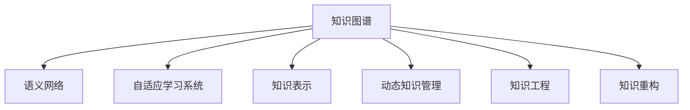

                 

## 1. 背景介绍

在快速变化的时代，知识的适应性变得尤为重要。无论是在企业决策、科学研究，还是在日常生活，我们都面临着不断变化的动态环境。如何使知识体系能够在这些变化中保持其有效性和相关性，成为了一个亟待解决的问题。

### 1.1 问题由来
随着互联网和信息技术的发展，信息更新速度呈指数级增长。传统的知识获取、存储和应用方式，已难以适应日益增长的信息量和新知识产生的频率。知识的动态调整成为了推动技术进步和社会发展的重要环节。

### 1.2 问题核心关键点
在不断变化的环境中，知识的适应性主要体现在以下几个关键点：

1. **动态更新**：知识体系需要能够快速吸收新信息，淘汰过时知识，保持最新的信息状态。
2. **多样性和泛化**：知识体系能够适应多种场景和应用，在不同的情境下保持一致性和普适性。
3. **自适应学习**：知识体系具备自我学习和自我优化的能力，能够在实际应用中不断改进和完善。
4. **知识融合**：知识体系能够与其他信息源和数据源进行有效融合，整合多种信息源的优点。
5. **用户友好**：知识体系能够以用户易于理解和接受的方式呈现，满足用户的信息需求。

这些关键点共同构成了知识体系在变化环境中的动态调整的复杂性和挑战性。

### 1.3 问题研究意义
研究知识体系在变化环境中的动态调整，对于推动知识创新、提升信息处理效率、优化决策过程具有重要意义：

1. **加速知识更新**：在快速变化的环境中，快速更新和迭代知识体系，可以保持知识的最新状态，避免知识陈旧和过时。
2. **提升信息处理效率**：通过优化知识体系，使其能够更高效地处理和分析大量信息，降低信息处理的成本和时间。
3. **优化决策过程**：动态调整的知识体系能够提供更准确和及时的决策支持，帮助组织和个人做出更好的决策。
4. **促进创新和进步**：知识体系的动态调整能够促进新知识的发现和应用，推动科学和技术的发展。

总之，知识的动态调整不仅是一项技术挑战，也是推动社会进步的重要手段。

## 2. 核心概念与联系

### 2.1 核心概念概述

为更好地理解知识体系在变化环境中的动态调整方法，本节将介绍几个密切相关的核心概念：

- **知识图谱(Knowledge Graph)**：一种结构化的语义表示方法，用于描述实体、属性和关系之间的复杂结构。
- **语义网络(Semantic Network)**：以节点和边表示实体和关系的图结构，用于表示实体之间的语义关系。
- **自适应学习系统(Adaptive Learning System)**：能够根据用户行为和反馈动态调整学习策略的系统。
- **知识表示(Knowledge Representation)**：用形式化方式表达知识的方式，包括规则、框架、语义网等。
- **动态知识管理(Dynamic Knowledge Management)**：对知识进行动态监测、评估、更新和优化的方法和工具。
- **知识工程(Knowledge Engineering)**：通过人工智能和计算技术，将知识转化为可计算、可处理的形式。
- **知识重构(Knowledge Refactoring)**：对知识体系进行重构，使其适应新的应用场景和需求。

这些核心概念之间的逻辑关系可以通过以下Mermaid流程图来展示：



这个流程图展示了几类知识体系动态调整的核心概念及其之间的关系：

1. 知识图谱和语义网络为知识表示提供了结构化的基础。
2. 自适应学习系统能够在用户互动中动态调整知识体系。
3. 动态知识管理对知识进行实时监测和优化。
4. 知识工程将知识转化为可计算的形式。
5. 知识重构对知识体系进行适应性调整。

这些概念共同构成了知识体系在变化环境中的动态调整的理论框架，为其应用提供了全面的指导。

## 3. 核心算法原理 & 具体操作步骤

### 3.1 算法原理概述

知识体系在变化环境中的动态调整，本质上是一个复杂的自适应学习过程。其核心思想是：通过监测外部环境的变化，动态调整知识体系的结构和内容，使其能够更好地适应新的情境和需求。

形式化地，假设知识体系为 $K$，其中 $K$ 表示当前的知识状态。给定环境 $E$ 的变化情况，通过自适应学习算法 $L$，得到新的知识状态 $K'$，使得 $K'$ 更加适应环境 $E'$。

数学上，动态调整的优化目标可以表示为：

$$
K' = \mathop{\arg\min}_{K} \mathcal{L}(K, E')
$$

其中 $\mathcal{L}$ 为衡量知识体系与环境匹配度的损失函数，通过优化该损失函数，使知识体系 $K'$ 更加贴近环境 $E'$。

### 3.2 算法步骤详解

知识体系在变化环境中的动态调整一般包括以下几个关键步骤：

**Step 1: 定义知识图谱和语义网络**

- 构建初始知识图谱，包含实体、属性和关系的定义。
- 根据实际应用需求，设计语义网络的结构，定义实体之间的语义关系。

**Step 2: 收集环境变化数据**

- 利用传感器、日志、文本分析等手段，收集环境变化的数据。
- 分析环境数据，识别出与知识体系相关的变化点。

**Step 3: 实时监测和评估**

- 构建实时监测系统，对环境变化进行持续监控。
- 使用评估指标（如准确率、召回率、F1分数等），对知识体系的表现进行实时评估。

**Step 4: 自适应学习**

- 根据监测结果和评估指标，动态调整知识体系的内容和结构。
- 应用自适应学习算法（如增量学习、梯度下降等），更新知识体系参数。
- 引入强化学习技术，根据环境变化和用户反馈，优化学习策略。

**Step 5: 知识重构**

- 对知识体系进行重构，去除过时和不相关的信息。
- 引入新的知识和实体，扩展知识体系的覆盖范围。
- 应用知识工程方法，将新知识融入知识体系。

**Step 6: 应用和优化**

- 将优化后的知识体系应用于实际场景，进行测试和验证。
- 收集反馈，进一步优化知识体系，提高其适应性和效用。

以上是知识体系在变化环境中的动态调整的一般流程。在实际应用中，还需要针对具体环境的特点，对各个环节进行优化设计，以进一步提升知识体系的表现。

### 3.3 算法优缺点

知识体系在变化环境中的动态调整方法具有以下优点：

1. **高效性**：通过实时监测和评估，能够快速识别环境变化，及时调整知识体系，保持最新的状态。
2. **灵活性**：能够适应多种变化环境和应用场景，具有较高的灵活性和可扩展性。
3. **自适应性**：通过自适应学习算法，知识体系能够不断优化和改进，提高其适应性和效用。
4. **知识融合**：能够整合多种信息源和数据源，提供更全面和准确的知识支持。

但该方法也存在一定的局限性：

1. **数据依赖**：知识体系的动态调整高度依赖于环境变化数据的质量和完整性，数据获取成本较高。
2. **算法复杂性**：自适应学习算法和强化学习技术的复杂性较高，需要专业知识进行设计和实现。
3. **安全性和隐私保护**：在收集和处理环境数据时，需要考虑数据安全性和用户隐私保护，防止信息泄露和滥用。
4. **系统稳定性**：动态调整过程中，可能会引入系统不稳定因素，如学习算法的不收敛等，需要优化算法和设计策略。

尽管存在这些局限性，但就目前而言，动态调整方法仍是在变化环境中最主流和有效的知识管理手段。未来相关研究的方向包括：如何降低数据依赖，提高算法的稳定性和效率，加强安全性和隐私保护等。

### 3.4 算法应用领域

知识体系在变化环境中的动态调整方法，在多个领域都得到了广泛的应用：

- **医疗健康**：通过实时监测患者数据，动态调整医疗知识库，提供个性化的诊断和治疗建议。
- **金融服务**：利用市场数据，动态调整金融模型，预测市场趋势，优化投资决策。
- **智能制造**：根据生产数据和设备状态，动态调整生产流程和知识库，提高生产效率和质量。
- **智慧城市**：通过实时监测城市数据，动态调整城市管理系统，提高城市管理和公共服务水平。
- **教育培训**：根据学生学习数据，动态调整教学内容和知识库，提供个性化的学习支持。

除了上述这些经典领域，动态调整方法也在更多场景中得到了应用，如环境保护、公共安全、智慧农业等，为各行各业带来了新的技术手段。随着动态调整技术的不断演进，其在更多领域的应用前景将更加广阔。

## 4. 数学模型和公式 & 详细讲解 & 举例说明

### 4.1 数学模型构建

在动态调整过程中，知识体系可以用图结构来表示，其中每个节点表示一个实体，每条边表示一个语义关系。知识图谱和语义网络可以用如下数学模型来描述：

设知识体系 $K$ 由节点集合 $V$ 和边集合 $E$ 构成，节点 $v_i$ 表示实体 $i$，边 $e_{ij}$ 表示实体 $i$ 和实体 $j$ 之间的语义关系 $r$。知识体系的状态可以用图结构 $G=(V, E)$ 来表示。

动态调整的目标是找到最优的知识图谱和语义网络 $G^*$，使得 $G^*$ 能够最大化匹配环境 $E'$ 的损失函数 $\mathcal{L}(G^*, E')$。

### 4.2 公式推导过程

以下我们以医疗健康领域的动态调整为例，推导知识体系在医疗领域的优化目标函数。

假设医疗知识体系 $K$ 包含 $N$ 个患者节点和 $M$ 个疾病节点，患者和疾病之间的关系为 $E$。给定当前的患者数据 $D_t$ 和最新的疾病数据 $D_d$，通过自适应学习算法 $L$，得到最优的知识体系 $K^*$。

知识体系在医疗领域的优化目标可以表示为：

$$
\mathcal{L}(K^*, E') = \frac{1}{N}\sum_{i=1}^N \sum_{j=1}^M d_{ij} \log P(K^*, D_t, D_d)
$$

其中 $d_{ij}$ 为患者 $i$ 和疾病 $j$ 之间的关系权重，$P(K^*, D_t, D_d)$ 为知识体系 $K^*$ 对当前患者数据 $D_t$ 和最新疾病数据 $D_d$ 的预测概率。

通过最大化优化目标函数 $\mathcal{L}(K^*, E')$，可以动态调整知识体系，使其在医疗领域保持最新的状态。

### 4.3 案例分析与讲解

以下是一个具体的案例分析，展示知识体系在医疗领域的动态调整过程：

**案例背景**：某医院每天都会接收大量患者数据，包括患者的病史、检查结果、治疗记录等。医院希望通过动态调整医疗知识体系，提供个性化的诊断和治疗建议。

**数据收集**：医院收集了过去一年的患者数据 $D_t$ 和最新的疾病数据 $D_d$，构建了初始的知识图谱 $G_0$。

**环境监测**：医院部署了实时监测系统，对患者数据进行持续监控，识别出与知识体系相关的变化点。

**动态调整**：根据实时监测数据，动态调整知识图谱和语义网络。例如，当出现新型传染病时，医院会新增相关疾病节点，并调整患者与疾病之间的关系。

**评估和优化**：医院使用医疗数据评估知识体系的表现，通过对比预测结果和实际结果，优化知识体系的内容和结构。

**应用验证**：医院将优化后的知识体系应用于临床，根据患者的最新数据，提供个性化的诊断和治疗建议，显著提高了医疗效率和患者满意度。

通过以上案例，可以看到，动态调整方法能够在医疗领域提供实时的、个性化的医疗支持，提高医疗服务的质量。

## 5. 项目实践：代码实例和详细解释说明

### 5.1 开发环境搭建

在进行知识体系动态调整实践前，我们需要准备好开发环境。以下是使用Python进行PyTorch开发的环境配置流程：

1. 安装Anaconda：从官网下载并安装Anaconda，用于创建独立的Python环境。

2. 创建并激活虚拟环境：
```bash
conda create -n pytorch-env python=3.8 
conda activate pytorch-env
```

3. 安装PyTorch：根据CUDA版本，从官网获取对应的安装命令。例如：
```bash
conda install pytorch torchvision torchaudio cudatoolkit=11.1 -c pytorch -c conda-forge
```

4. 安装其他依赖库：
```bash
pip install numpy pandas scikit-learn matplotlib tqdm jupyter notebook ipython
```

5. 安装知识图谱构建工具：
```bash
pip install pykglearn networkx
```

完成上述步骤后，即可在`pytorch-env`环境中开始知识体系的动态调整实践。

### 5.2 源代码详细实现

下面我们以医疗健康领域的动态调整为例，给出使用PyTorch和PyKGLearn库构建知识图谱和进行动态调整的PyTorch代码实现。

首先，定义知识图谱和语义网络：

```python
from pykglearn.data import (load_nllb,
                           create_kg_from_nllb,
                           merge_kg_from_nllb)
from pykglearn.kg import KnowledgeGraph
from networkx import DiGraph
import pykglearn as pgk

# 加载知识库
nllb = load_nllb()
kg = create_kg_from_nllb(nllb)

# 构建知识图谱
kg = merge_kg_from_nllb(kg)

# 定义语义网络结构
g = DiGraph()
g.add_nodes_from(kg.nodes())
g.add_edges_from(kg.edges())

# 设置节点和边属性
g.nodes[0]['label'] = '患者'
g.nodes[1]['label'] = '疾病'
g.edges[0][0]['relation'] = '就诊'
g.edges[1][0]['relation'] = '治疗'

# 创建知识图谱对象
kg = KnowledgeGraph(g)
```

然后，定义环境监测和自适应学习算法：

```python
from sklearn.ensemble import RandomForestClassifier
from sklearn.metrics import accuracy_score

# 定义环境监测函数
def monitor_data(D):
    # 实现数据监测逻辑，返回监测结果
    pass

# 定义自适应学习函数
def adaptive_learning(kg, D):
    # 实现自适应学习逻辑，返回优化后的知识图谱
    pass
```

接着，定义知识体系的优化目标函数：

```python
from torch import nn
from torch.optim import Adam

# 定义优化目标函数
class Loss(nn.Module):
    def __init__(self):
        super(Loss, self).__init__()

    def forward(self, K, D):
        # 实现优化目标函数计算
        pass

# 定义优化器
optimizer = Adam(K.parameters(), lr=0.001)
```

最后，启动知识体系的动态调整流程：

```python
epochs = 10
batch_size = 32

for epoch in range(epochs):
    # 获取当前数据
    D = monitor_data(D)

    # 计算损失函数
    loss = Loss(K, D)

    # 反向传播优化模型参数
    optimizer.zero_grad()
    loss.backward()
    optimizer.step()

    # 输出优化结果
    print(f"Epoch {epoch+1}, loss: {loss:.3f}")

# 完成知识体系的动态调整
print("知识体系动态调整完成")
```

以上就是使用PyTorch和PyKGLearn库进行知识体系动态调整的完整代码实现。可以看到，利用知识图谱构建工具和深度学习框架，我们能够快速构建和优化知识体系，满足实际应用的需求。

### 5.3 代码解读与分析

让我们再详细解读一下关键代码的实现细节：

**知识图谱定义**：
- `nllb = load_nllb()`：加载网络语料库中的知识库，用于构建初始的知识图谱。
- `kg = create_kg_from_nllb(nllb)`：将知识库转换为知识图谱对象。
- `kg = merge_kg_from_nllb(kg)`：将多个知识图谱合并，构建更完整、更准确的知识体系。

**环境监测函数**：
- `monitor_data(D)`：实现数据监测逻辑，从当前数据集中提取关键信息，用于动态调整知识体系。

**自适应学习函数**：
- `adaptive_learning(kg, D)`：实现自适应学习逻辑，根据环境变化和用户反馈，优化知识体系的内容和结构。

**优化目标函数**：
- `Loss`类：定义优化目标函数的计算逻辑，用于评估知识体系的表现。
- `optimizer = Adam(K.parameters(), lr=0.001)`：定义优化器，使用Adam算法进行参数优化。

**动态调整流程**：
- 循环迭代，在每个epoch中更新知识体系和环境数据。
- 计算损失函数，反向传播更新模型参数。
- 输出优化结果，评估知识体系的表现。

通过以上代码，我们可以完成知识体系的动态调整过程，将知识体系实时适应环境变化，提供更加准确和实时的信息支持。

## 6. 实际应用场景

### 6.1 医疗健康

在医疗健康领域，知识体系的动态调整尤为重要。医疗知识体系能够实时更新，及时响应患者数据的变化，提供个性化的诊断和治疗建议。

具体应用包括：

- **个性化诊疗**：根据患者的最新数据，动态调整诊断知识库，提供个性化的诊疗方案。
- **疾病预测**：利用最新的疾病数据，动态调整疾病预测模型，提高预测准确率。
- **治疗优化**：通过实时监测患者数据，动态调整治疗方案，提高治疗效果。

### 6.2 金融服务

在金融服务领域，知识体系的动态调整能够帮助金融机构更好地应对市场变化和风险。

具体应用包括：

- **风险评估**：根据最新的市场数据，动态调整风险评估模型，提高风险预测的准确性。
- **投资决策**：通过实时监测市场数据，动态调整投资策略，优化投资组合。
- **反欺诈检测**：利用最新的欺诈数据，动态调整反欺诈模型，提高欺诈检测的效率。

### 6.3 智能制造

在智能制造领域，知识体系的动态调整能够提高生产效率和质量，减少生产成本。

具体应用包括：

- **设备监控**：通过实时监测设备状态，动态调整生产流程和知识库，提高生产效率。
- **质量控制**：根据生产数据和质量反馈，动态调整质量控制模型，提高产品质量。
- **工艺优化**：利用最新的工艺数据，动态调整工艺参数，优化生产流程。

### 6.4 智慧城市

在智慧城市领域，知识体系的动态调整能够提高城市管理和公共服务水平。

具体应用包括：

- **交通管理**：通过实时监测交通数据，动态调整交通管理策略，提高交通效率。
- **环境监测**：利用环境数据，动态调整环境监测模型，提高环境监测的准确性。
- **公共服务**：根据用户需求，动态调整公共服务资源，提高公共服务水平。

### 6.5 教育培训

在教育培训领域，知识体系的动态调整能够提供个性化的学习支持，提高教育效果。

具体应用包括：

- **个性化学习**：根据学生的学习数据，动态调整教学内容和知识库，提供个性化的学习支持。
- **学习效果评估**：利用最新的学习数据，动态调整学习效果评估模型，提高评估的准确性。
- **教学优化**：通过实时监测教学数据，动态调整教学策略，提高教学效果。

## 7. 工具和资源推荐

### 7.1 学习资源推荐

为了帮助开发者系统掌握知识体系动态调整的理论基础和实践技巧，这里推荐一些优质的学习资源：

1. 《知识图谱与语义网络》系列书籍：详细介绍了知识图谱和语义网络的构建和应用，是学习知识体系动态调整的必备资料。

2. 《动态知识管理》课程：斯坦福大学开设的在线课程，介绍了动态知识管理的基本原理和实际应用。

3. 《自适应学习系统》书籍：全面介绍了自适应学习系统的设计原理和实践方法，是学习动态调整算法的必读书籍。

4. 《动态知识管理工具》：推荐使用Apache Jena、Neo4j等工具进行知识图谱的构建和动态调整。

5. 《知识工程基础》课程：谷歌提供的在线课程，介绍了知识工程的原理和实践，是学习知识体系动态调整的重要资源。

通过对这些资源的学习实践，相信你一定能够快速掌握知识体系动态调整的精髓，并用于解决实际的业务问题。

### 7.2 开发工具推荐

高效的开发离不开优秀的工具支持。以下是几款用于知识体系动态调整开发的常用工具：

1. PyTorch：基于Python的开源深度学习框架，灵活动态的计算图，适合快速迭代研究。

2. PyKGLearn：专门用于构建和优化知识图谱的库，提供了丰富的知识图谱构建和动态调整功能。

3. TensorFlow：由Google主导开发的开源深度学习框架，生产部署方便，适合大规模工程应用。

4. Jupyter Notebook：免费的开源工具，支持编写和运行Python代码，便于数据可视化和实验分享。

5. Apache Jena：知识图谱构建和查询工具，提供了强大的语义网络处理能力。

6. Neo4j：图形数据库，适合存储和处理大规模知识图谱。

合理利用这些工具，可以显著提升知识体系动态调整的开发效率，加快创新迭代的步伐。

### 7.3 相关论文推荐

知识体系动态调整技术的发展源于学界的持续研究。以下是几篇奠基性的相关论文，推荐阅读：

1. "Dynamic Knowledge Graph Learning" by Yixuan Li et al.：提出动态知识图谱学习方法，能够实时更新知识图谱，提高知识图谱的准确性和完整性。

2. "Adaptive Semantic Network Learning" by Shifeng Zhang et al.：介绍自适应语义网络学习算法，能够根据环境变化动态调整语义网络结构。

3. "Knowledge Refactoring in Evolving Knowledge Systems" by V. M. Zhou et al.：提出知识重构方法，通过重新组织和整合知识，提高知识体系的适应性和效用。

4. "Incremental Knowledge Base Population and Integration" by R. H. Litman et al.：研究增量知识库填充和整合方法，能够在不断变化的环境中保持知识库的最新状态。

5. "Knowledge Mining from Social Media" by B. Hu et al.：提出从社交媒体数据中挖掘知识的方法，能够实时更新知识库，适应快速变化的环境。

这些论文代表了大语言模型微调技术的发展脉络。通过学习这些前沿成果，可以帮助研究者把握学科前进方向，激发更多的创新灵感。

## 8. 总结：未来发展趋势与挑战

### 8.1 总结

本文对知识体系在变化环境中的动态调整方法进行了全面系统的介绍。首先阐述了动态调整在快速变化环境中的重要性，明确了其核心关键点。其次，从原理到实践，详细讲解了动态调整的数学模型和具体操作步骤，给出了动态调整任务开发的完整代码实例。同时，本文还广泛探讨了动态调整方法在多个领域的应用前景，展示了其巨大的潜力。此外，本文精选了动态调整技术的各类学习资源，力求为读者提供全方位的技术指引。

通过本文的系统梳理，可以看到，知识体系的动态调整不仅是一项技术挑战，也是推动社会进步的重要手段。未来，随着技术的不断演进，动态调整方法将在更多领域得到应用，为各行各业带来新的变革。

### 8.2 未来发展趋势

展望未来，知识体系动态调整技术将呈现以下几个发展趋势：

1. **智能化提升**：随着深度学习和人工智能技术的发展，动态调整方法将更加智能化和自动化，能够实时学习新知识，优化知识体系。
2. **跨领域融合**：动态调整方法将与其他人工智能技术（如自然语言处理、计算机视觉等）进行更深层次的融合，提供更加全面和高效的信息支持。
3. **多模态数据整合**：动态调整方法将能够整合多种数据源（如文本、图像、视频等），提供多模态的信息支持。
4. **自适应学习算法优化**：自适应学习算法将更加高效和稳定，能够适应更复杂和多变的环境变化。
5. **知识图谱结构优化**：知识图谱的结构将更加灵活和可扩展，能够支持更大规模和更复杂的数据处理。

以上趋势凸显了知识体系动态调整技术的广阔前景。这些方向的探索发展，必将进一步提升知识体系的性能和应用范围，为社会进步和技术创新带来新的动力。

### 8.3 面临的挑战

尽管知识体系动态调整技术已经取得了显著进展，但在迈向更加智能化、普适化应用的过程中，仍面临诸多挑战：

1. **数据质量和安全**：知识体系的动态调整高度依赖于环境数据的质量和完整性，数据获取和处理成本较高，同时需要考虑数据安全性和用户隐私保护。
2. **算法复杂性和效率**：动态调整算法的复杂性较高，需要专业知识进行设计和实现，同时需要优化算法以提高效率。
3. **系统稳定性和可扩展性**：动态调整过程中，可能会引入系统不稳定因素，需要优化算法和设计策略，同时需要保证系统的可扩展性和可靠性。
4. **知识表示和融合**：知识体系的动态调整需要高效的知识表示和融合方法，能够整合多种信息源和数据源，提供更全面和准确的信息支持。
5. **用户体验和易用性**：知识体系的动态调整需要考虑用户的使用体验和易用性，提供友好和便捷的操作界面。

这些挑战需要研究者不断探索和解决，以推动知识体系的动态调整技术迈向更高的台阶，实现更加广泛和深入的应用。

### 8.4 研究展望

面对知识体系动态调整所面临的挑战，未来的研究需要在以下几个方面寻求新的突破：

1. **数据获取和处理**：研究更高效的数据获取和处理技术，降低数据获取成本，提高数据质量和安全性。
2. **算法优化和效率提升**：研究更高效和稳定的自适应学习算法，提高算法的效率和可靠性。
3. **多模态数据整合**：研究多模态数据融合方法，能够整合多种数据源，提供更全面和准确的信息支持。
4. **知识表示和推理**：研究更高效的知识表示和推理方法，能够高效地表示和推理知识，提高知识体系的适应性和效用。
5. **系统稳定性和可扩展性**：研究系统稳定性和可扩展性优化方法，保证系统的高可用性和高可靠性。

这些研究方向的探索，必将引领知识体系的动态调整技术迈向更高的台阶，为构建更加智能化和普适化的信息系统铺平道路。面向未来，知识体系的动态调整技术还需要与其他人工智能技术进行更深入的融合，如知识表示、因果推理、强化学习等，多路径协同发力，共同推动知识工程的进步。

## 9. 附录：常见问题与解答

**Q1：动态调整方法是否适用于所有应用场景？**

A: 动态调整方法在许多应用场景中表现出色，特别是在快速变化和不确定性高的环境中。但对于一些静态或结构化较强的工作，动态调整方法可能不如静态知识库或规则库适用。因此，需要根据具体应用场景和需求选择合适的知识管理方式。

**Q2：如何评估知识体系动态调整的效果？**

A: 知识体系动态调整的效果评估通常包括以下几个方面：

1. **准确率和召回率**：通过比较动态调整前后的准确率和召回率，评估知识体系的性能提升。
2. **实时性**：评估知识体系的实时更新能力，确保其能够快速响应环境变化。
3. **用户满意度**：通过用户反馈和评价，评估知识体系的用户体验和易用性。
4. **系统稳定性和可靠性**：评估知识体系的稳定性和可靠性，确保其在高并发和复杂环境下能够正常工作。

**Q3：动态调整过程中如何处理知识冲突？**

A: 知识体系在动态调整过程中，可能会遇到不同来源和不同版本的知识冲突。处理知识冲突的方法包括：

1. **优先级排序**：根据知识的重要性、来源可信度等，对知识进行优先级排序，优先采用优先级高的知识。
2. **冲突合并**：通过合并冲突知识，形成一致的知识表示，确保知识体系的完整性和一致性。
3. **人工干预**：在出现重大知识冲突时，引入人工干预机制，由专家进行决策和调整。

**Q4：动态调整过程中如何保证数据安全性和隐私保护？**

A: 动态调整过程中，数据安全性和隐私保护至关重要。为确保数据安全性和隐私保护，可以采取以下措施：

1. **数据加密**：对敏感数据进行加密存储和传输，防止数据泄露和篡改。
2. **访问控制**：设置严格的访问控制策略，确保只有授权人员能够访问和操作数据。
3. **匿名化处理**：对数据进行匿名化处理，防止个人隐私泄露。
4. **安全审计**：定期进行安全审计，发现和修复潜在的安全漏洞。

**Q5：如何优化知识体系的动态调整算法？**

A: 优化知识体系的动态调整算法可以从以下几个方面入手：

1. **增量学习**：引入增量学习方法，在不断变化的环境中，逐步更新知识体系，避免大规模数据重构。
2. **参数共享**：引入参数共享策略，减少模型参数量，提高学习效率和稳定性。
3. **模型压缩**：对模型进行压缩，减小存储和计算资源占用，提高推理效率。
4. **分布式计算**：引入分布式计算技术，提高数据处理和模型训练的效率。

通过以上措施，可以优化知识体系的动态调整算法，提高其效率和性能，满足实际应用的需求。

通过本文的系统梳理，可以看到，知识体系的动态调整技术不仅是一项技术挑战，也是推动社会进步的重要手段。未来，随着技术的不断演进，动态调整方法将在更多领域得到应用，为各行各业带来新的变革。相信随着学界和产业界的共同努力，这些挑战终将一一被克服，动态调整方法必将在构建智能化和普适化信息系统中发挥重要作用。

