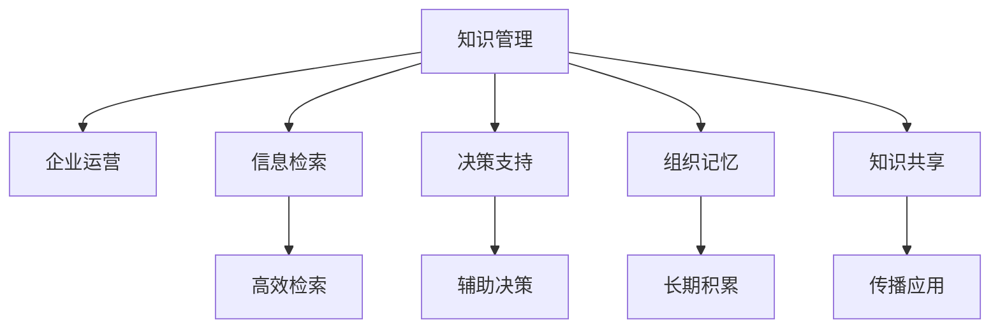

                 

# 知识管理在企业中的实践

> 关键词：知识管理,企业运营,信息检索,决策支持,组织记忆,知识共享

## 1. 背景介绍

### 1.1 问题由来
在快速发展的商业环境中，企业面临着越来越复杂的信息和知识管理需求。知识管理（Knowledge Management, KM）作为企业信息化建设的重要组成部分，已经成为提升企业竞争力、优化运营效率、增强创新能力的关键手段。

面对数据量的爆炸性增长和信息碎片化现象，传统的文档存储和检索方式已难以满足现代企业的需求。如何高效地获取、整理、存储、共享和利用知识，成为企业关注的焦点。知识管理不仅关系到企业的信息安全和数据资产保护，还直接影响到企业的决策质量和创新速度。

### 1.2 问题核心关键点
企业知识管理的核心问题可以归纳为以下几个关键点：

1. **数据收集与存储**：企业需要将分散于各部门、各种系统的数据汇集到一个集中化的知识库，并保障数据的安全性和完整性。
2. **知识提取与检索**：企业需要快速准确地从知识库中检索出所需信息，支持员工的日常工作和学习。
3. **知识共享与协作**：企业需要促进知识的内部共享和跨部门协作，增强团队协同工作的能力。
4. **知识更新与维护**：企业需要及时更新和维护知识库中的内容，确保知识的实时性和有效性。
5. **知识应用与创新**：企业需要将知识转化为实际的生产力，通过知识驱动的决策和创新，提升企业的核心竞争力。

这些关键点构成了企业知识管理的核心框架，需要在实际应用中不断优化和完善。

## 2. 核心概念与联系

### 2.1 核心概念概述

为更好地理解企业知识管理的实践，本节将介绍几个密切相关的核心概念：

- **知识管理**（Knowledge Management, KM）：通过系统化的方法，对企业内部和外部的信息、知识进行获取、存储、整理、检索、共享和应用，以支持企业战略目标的实现。
- **企业运营**（Business Operations）：企业的日常运作过程，包括生产、采购、销售、服务等环节。知识管理的目标之一是优化和提升这些运营环节的效率。
- **信息检索**（Information Retrieval）：通过计算机技术实现对信息的高效检索，帮助用户快速找到所需资料。信息检索是知识管理的基础技术之一。
- **决策支持**（Decision Support）：利用知识库中的数据和知识，辅助高层管理人员进行决策。决策支持系统通常集成于知识管理平台。
- **组织记忆**（Organizational Memory）：企业内部长期积累的知识、经验和教训，是企业智慧的结晶，对未来的发展具有重要参考价值。
- **知识共享**（Knowledge Sharing）：通过平台、工具和机制促进知识在企业内的传播和应用，是知识管理的关键环节。

这些核心概念之间的逻辑关系可以通过以下Mermaid流程图来展示：



这个流程图展示了我企业知识管理的关键组成和作用：

1. 知识管理通过对企业运营的各个环节进行优化，提升整体运营效率。
2. 信息检索为知识管理提供了基础技术支持，使得知识获取更加便捷。
3. 决策支持利用知识库中的数据和知识，辅助高层管理人员进行战略决策。
4. 组织记忆记录企业的历史经验和教训，对未来的决策具有重要指导意义。
5. 知识共享促进知识的内部传播和应用，增强团队协同能力。

## 3. 核心算法原理 & 具体操作步骤
### 3.1 算法原理概述

企业知识管理的核心算法包括数据收集与存储、知识提取与检索、知识共享与协作等。这些算法通常基于人工智能、自然语言处理、数据库管理等技术实现。

**数据收集与存储算法**：
- **数据清洗**：去除重复、错误和无效的数据，保证数据质量。
- **数据转换**：将不同格式的数据转换为统一格式，便于存储和处理。
- **数据存储**：使用数据库管理系统（DBMS）将数据存储在集中化的知识库中，如MySQL、MongoDB等。

**知识提取与检索算法**：
- **信息抽取**：从文本、文档、网页中自动抽取出结构化信息，如人名、地名、日期等。
- **实体识别**：识别文本中的命名实体，并进行分类和关系抽取。
- **知识图谱构建**：构建企业内部和外部的知识图谱，支持知识之间的关联查询。
- **语义检索**：利用自然语言处理技术，实现对知识库中信息的语义理解，提高检索的准确性和相关性。

**知识共享与协作算法**：
- **知识共享平台**：开发知识共享平台，支持文件上传、下载、评论、点赞等功能。
- **协作工具**：引入协作工具如Confluence、Slack等，促进团队内部的知识共享和交流。
- **知识地图**：构建企业内部的知识地图，帮助员工快速定位所需知识。
- **协作机制**：建立企业内部的协作机制，如知识贡献奖励、协作群组等，激励员工积极参与知识共享。

### 3.2 算法步骤详解

**步骤1: 数据收集与存储**
- **数据收集**：从企业内部系统（如ERP、CRM、OA等）和外部渠道（如网站、社交媒体等）收集数据。
- **数据清洗**：去除重复、错误和无效的数据，使用ETL工具进行数据清洗和转换。
- **数据存储**：将清洗后的数据存储在知识库中，如使用MySQL、MongoDB等数据库管理系统。

**步骤2: 知识提取与检索**
- **信息抽取**：使用命名实体识别（NER）、关系抽取等技术从文本中自动抽取结构化信息。
- **实体识别**：对抽取的信息进行实体分类和关系抽取，构建知识图谱。
- **语义检索**：利用自然语言处理技术，实现对知识库中信息的语义理解，提高检索的准确性和相关性。

**步骤3: 知识共享与协作**
- **知识共享平台**：开发知识共享平台，支持文件上传、下载、评论、点赞等功能。
- **协作工具**：引入协作工具如Confluence、Slack等，促进团队内部的知识共享和交流。
- **知识地图**：构建企业内部的知识地图，帮助员工快速定位所需知识。
- **协作机制**：建立企业内部的协作机制，如知识贡献奖励、协作群组等，激励员工积极参与知识共享。

### 3.3 算法优缺点

企业知识管理的核心算法具有以下优点：
1. **提高效率**：通过集中化的数据存储和高效的信息检索，显著提升企业的运营效率。
2. **促进协作**：知识共享平台和协作工具促进了企业内部团队之间的知识交流和协作。
3. **增强决策支持**：利用知识库中的数据和知识，辅助高层管理人员进行决策，提升决策质量。
4. **优化运营**：通过知识管理，优化企业的生产、采购、销售、服务等环节，提升整体运营效率。

同时，这些算法也存在一些局限性：
1. **数据质量依赖**：知识管理的成效高度依赖于数据的质量和完整性，清洗和转换过程中可能会存在误差。
2. **技术门槛较高**：实现高效率的信息检索和语义理解需要复杂的技术支持，维护成本较高。
3. **文化障碍**：知识共享和协作需要企业内部文化的支持，存在一定的文化障碍。
4. **安全与隐私问题**：知识库中的敏感数据和隐私信息需要得到严格的保护，否则可能带来风险。

尽管存在这些局限性，但就目前而言，知识管理在提升企业运营效率、促进知识共享和协作方面发挥了重要作用。未来相关研究的重点在于如何进一步降低技术门槛，增强数据质量控制，同时兼顾安全和隐私保护等因素。

### 3.4 算法应用领域

企业知识管理的核心算法在以下领域得到了广泛的应用：

- **生产运营**：优化生产流程，提升生产效率和质量。
- **供应链管理**：优化采购和库存管理，降低成本，提高供应链透明度。
- **客户关系管理**：收集和分析客户数据，提升客户满意度和忠诚度。
- **市场营销**：利用市场数据和客户洞察，制定和优化市场营销策略。
- **研发创新**：整合内部和外部的知识资源，支持产品创新和研发。
- **人力资源管理**：管理员工档案、培训记录、绩效评估等，支持人才发展和知识传承。

除了这些核心领域，知识管理还广泛应用于企业的信息化建设、知识管理平台的开发、信息检索技术的研究等。随着技术的不断进步，知识管理的应用场景将更加广泛，成为提升企业核心竞争力的重要手段。

## 4. 数学模型和公式 & 详细讲解 & 举例说明

### 4.1 数学模型构建

企业知识管理的数学模型主要基于信息检索和数据挖掘技术构建。以下以信息检索为例，简要介绍相关数学模型：

**信息检索模型**：
- **向量空间模型**（Vector Space Model, VSM）：将文本表示为向量，计算查询与文档的相似度，得到检索结果。公式如下：
$$
\text{Similarity}(q, d) = \frac{\text{score}(q, d)}{||q|| \times ||d||}
$$
其中，$q$ 为查询向量，$d$ 为文档向量，$||q||$ 和 $||d||$ 分别为查询向量和文档向量的范数。

**向量空间模型的计算**：
- **词袋模型**（Bag of Words Model）：将文本表示为词频向量，计算查询与文档的相似度。
- **TF-IDF模型**：利用词频（Term Frequency, TF）和逆文档频率（Inverse Document Frequency, IDF）计算词的重要性，用于提升检索效果。公式如下：
$$
\text{TF}(t, d) = \text{词频}(t, d)
$$
$$
\text{IDF}(t) = \log \frac{N}{\text{词频}(t)}
$$
其中，$t$ 为词汇项，$d$ 为文档，$N$ 为文档总数。

### 4.2 公式推导过程

以下以TF-IDF模型为例，推导其计算公式。

**TF-IDF模型**：
- **词频**（Term Frequency, TF）：表示词汇项在文档中出现的次数。公式如下：
$$
\text{TF}(t, d) = \text{词频}(t, d) = \frac{\text{词频}(t, d)}{\text{词频}(t)}
$$
其中，$\text{词频}(t, d)$ 表示词汇项 $t$ 在文档 $d$ 中出现的次数，$\text{词频}(t)$ 表示词汇项 $t$ 在所有文档中出现的次数。

- **逆文档频率**（Inverse Document Frequency, IDF）：表示词汇项的重要性。公式如下：
$$
\text{IDF}(t) = \log \frac{N}{\text{词频}(t)}
$$
其中，$N$ 为文档总数，$\text{词频}(t)$ 表示词汇项 $t$ 在所有文档中出现的次数。

- **TF-IDF权重**：将词频和逆文档频率相结合，计算词汇项在文档中的重要性。公式如下：
$$
\text{TF-IDF}(t, d) = \text{TF}(t, d) \times \text{IDF}(t)
$$

### 4.3 案例分析与讲解

以下以一个简单的例子来说明TF-IDF模型的计算过程：

假设我们有一个文档集，包含以下三个文档：

- 文档1："I love you, you love me too"
- 文档2："The sun is in the sky, the sky is blue"
- 文档3："I love you, you love me too"

我们需要计算单词 "love" 在每个文档中的TF-IDF权重。首先，计算每个文档中 "love" 的词频：

- 文档1中 "love" 出现了2次。
- 文档2中 "love" 出现了1次。
- 文档3中 "love" 出现了2次。

接着，计算 "love" 的逆文档频率：

- 文档总数为3，"love" 出现了3次，因此逆文档频率为0。

最后，计算每个文档中 "love" 的TF-IDF权重：

- 文档1中 "love" 的TF-IDF权重为2，因为在文档1中出现了2次，逆文档频率为0。
- 文档2中 "love" 的TF-IDF权重为1，因为在文档2中出现了1次，逆文档频率为0。
- 文档3中 "love" 的TF-IDF权重为2，因为在文档3中出现了2次，逆文档频率为0。

通过TF-IDF模型，我们得到了每个文档中 "love" 的权重，这些权重可以用来衡量 "love" 在文档中的重要性，从而提升信息检索的准确性和相关性。

## 5. 项目实践：代码实例和详细解释说明

### 5.1 开发环境搭建

在进行知识管理项目开发前，我们需要准备好开发环境。以下是使用Python进行TensorFlow开发的环境配置流程：

1. 安装Anaconda：从官网下载并安装Anaconda，用于创建独立的Python环境。

2. 创建并激活虚拟环境：
```bash
conda create -n tf-env python=3.8 
conda activate tf-env
```

3. 安装TensorFlow：根据CUDA版本，从官网获取对应的安装命令。例如：
```bash
conda install tensorflow -c conda-forge
```

4. 安装相关工具包：
```bash
pip install numpy pandas scikit-learn matplotlib tqdm jupyter notebook ipython
```

完成上述步骤后，即可在`tf-env`环境中开始项目开发。

### 5.2 源代码详细实现

下面我们以企业知识管理平台中的信息检索功能为例，给出使用TensorFlow进行信息检索的PyTorch代码实现。

首先，定义数据处理函数：

```python
import tensorflow as tf
from tensorflow.keras.preprocessing.text import Tokenizer
from tensorflow.keras.preprocessing.sequence import pad_sequences

def preprocess(texts, max_length=100):
    tokenizer = Tokenizer(num_words=10000, oov_token='<OOV>')
    tokenizer.fit_on_texts(texts)
    sequences = tokenizer.texts_to_sequences(texts)
    padded_sequences = pad_sequences(sequences, maxlen=max_length, padding='post')
    return tokenizer.word_index, padded_sequences
```

然后，定义模型和优化器：

```python
from tensorflow.keras.layers import Input, Embedding, Dense, Dropout, Flatten
from tensorflow.keras.models import Model
from tensorflow.keras.losses import BinaryCrossentropy
from tensorflow.keras.optimizers import Adam

input_text = Input(shape=(None,))
embedding = Embedding(input_dim=10000, output_dim=128)(input_text)
dropout = Dropout(0.2)(embedding)
flattened = Flatten()(dropout)
dense1 = Dense(128, activation='relu')(flattened)
output = Dense(1, activation='sigmoid')(dense1)

model = Model(inputs=input_text, outputs=output)
model.compile(optimizer=Adam(learning_rate=0.001), loss=BinaryCrossentropy(), metrics=['accuracy'])

word_index, sequences = preprocess(train_texts, max_length=100)
model.fit(sequences, train_labels, epochs=10, batch_size=32)
```

接着，定义评估函数：

```python
from sklearn.metrics import precision_score, recall_score, f1_score

def evaluate(model, test_sequences, test_labels):
    predictions = model.predict(test_sequences, verbose=0)
    predictions = [1 if pred > 0.5 else 0 for pred in predictions]
    precision = precision_score(test_labels, predictions)
    recall = recall_score(test_labels, predictions)
    f1 = f1_score(test_labels, predictions)
    return precision, recall, f1
```

最后，启动训练流程并在测试集上评估：

```python
test_sequences, test_labels = preprocess(test_texts, max_length=100)
precision, recall, f1 = evaluate(model, test_sequences, test_labels)
print(f"Precision: {precision:.3f}, Recall: {recall:.3f}, F1-Score: {f1:.3f}")
```

以上就是使用TensorFlow进行信息检索的完整代码实现。可以看到，TensorFlow和Keras提供了强大的框架支持，使得模型的构建和训练变得简单高效。

### 5.3 代码解读与分析

让我们再详细解读一下关键代码的实现细节：

**preprocess函数**：
- 定义了一个Tokenizer对象，用于将文本转换为整数序列。
- 使用pad_sequences函数对序列进行补齐，确保所有序列长度一致。

**模型定义**：
- 使用Embedding层将文本转换为向量表示。
- 引入Dropout层减少过拟合。
- 使用Dense层进行全连接操作，输出一个二元分类结果。

**模型编译和训练**：
- 使用Adam优化器和二元交叉熵损失函数编译模型。
- 定义训练过程，指定训练轮数和批次大小。

**评估函数**：
- 使用sklearn的评估指标计算模型在测试集上的精度、召回率和F1分数。

通过上述代码，我们实现了一个基本的TF-IDF信息检索模型。可以看到，TensorFlow和Keras使得信息检索的代码实现变得简洁高效。

当然，实际应用中还需要考虑更多的因素，如模型的参数调优、特征工程、模型部署等。但核心的信息检索流程基本与此类似。

## 6. 实际应用场景
### 6.1 智能客服系统

企业知识管理中的信息检索技术，可以广泛应用于智能客服系统的构建。传统客服往往需要配备大量人力，高峰期响应缓慢，且一致性和专业性难以保证。而使用知识检索技术，可以7x24小时不间断服务，快速响应客户咨询，用自然流畅的语言解答各类常见问题。

在技术实现上，可以收集企业内部的历史客服对话记录，构建知识库，并通过信息检索技术，实现对常见问题的自动回答。当客户提出问题时，系统通过快速检索知识库，返回最佳答案。对于新问题，系统还可以接入检索系统实时搜索相关内容，动态组织生成回答。如此构建的智能客服系统，能大幅提升客户咨询体验和问题解决效率。

### 6.2 金融舆情监测

金融机构需要实时监测市场舆论动向，以便及时应对负面信息传播，规避金融风险。传统的人工监测方式成本高、效率低，难以应对网络时代海量信息爆发的挑战。基于知识管理的信息检索技术，为金融舆情监测提供了新的解决方案。

具体而言，可以收集金融领域相关的新闻、报道、评论等文本数据，并对其进行主题标注和情感标注。在此基础上，对知识库进行更新和维护，使得系统能够实时监测不同主题下的情感变化趋势。一旦发现负面信息激增等异常情况，系统便会自动预警，帮助金融机构快速应对潜在风险。

### 6.3 个性化推荐系统

当前的推荐系统往往只依赖用户的历史行为数据进行物品推荐，无法深入理解用户的真实兴趣偏好。基于知识管理的信息检索技术，个性化推荐系统可以更好地挖掘用户行为背后的语义信息，从而提供更精准、多样的推荐内容。

在实践中，可以收集用户浏览、点击、评论、分享等行为数据，提取和用户交互的物品标题、描述、标签等文本内容。将文本内容作为模型输入，用户的后续行为（如是否点击、购买等）作为监督信号，在此基础上构建信息检索模型，实现对用户兴趣的精准捕捉。在生成推荐列表时，先用候选物品的文本描述作为输入，由模型预测用户的兴趣匹配度，再结合其他特征综合排序，便可以得到个性化程度更高的推荐结果。

### 6.4 未来应用展望

随着知识管理技术的不断发展，基于信息检索技术的应用场景将更加广泛，为企业的智能化建设带来新的突破。

在智慧医疗领域，基于知识管理的信息检索技术可以用于病历检索、药品推荐、医疗问答等方面，提升医疗服务的智能化水平，辅助医生诊疗，加速新药开发进程。

在智能教育领域，信息检索技术可应用于学情分析、知识推荐、智能问答等方面，因材施教，促进教育公平，提高教学质量。

在智慧城市治理中，信息检索技术可以用于城市事件监测、舆情分析、应急指挥等环节，提高城市管理的自动化和智能化水平，构建更安全、高效的未来城市。

此外，在企业生产、社会治理、文娱传媒等众多领域，基于知识管理的信息检索技术也将不断涌现，为企业的智能化转型和高质量发展提供新的技术支撑。相信随着技术的日益成熟，信息检索技术将成为企业智能化建设的重要工具，为企业的可持续发展注入新的动力。

## 7. 工具和资源推荐
### 7.1 学习资源推荐

为了帮助开发者系统掌握知识管理理论基础和实践技巧，这里推荐一些优质的学习资源：

1. **《信息检索基础》**（Information Retrieval Basics）：这本书系统地介绍了信息检索的基本概念和算法，适合初学者入门。

2. **《知识管理与决策支持系统》**（Knowledge Management and Decision Support Systems）：这本书详细探讨了知识管理在企业中的应用，涵盖知识库构建、信息检索、决策支持等多个方面。

3. **Coursera《信息检索与自然语言处理》**（Information Retrieval and Natural Language Processing）课程：由斯坦福大学和加州大学伯克利分校的教授授课，涵盖了信息检索和自然语言处理的基本概念和算法。

4. **Kaggle《知识管理与数据科学》**（Knowledge Management and Data Science）竞赛：通过实际项目练习，提升知识管理的实践能力。

5. **Google Scholar和IEEE Xplore**：这两个数据库收录了大量关于信息检索和知识管理的学术论文，是深入学习的基础资料。

通过对这些资源的学习实践，相信你一定能够快速掌握知识管理的精髓，并用于解决实际的业务问题。
###  7.2 开发工具推荐

高效的开发离不开优秀的工具支持。以下是几款用于知识管理开发的常用工具：

1. **TensorFlow**：基于数据流图计算的开源机器学习框架，支持多种算法和模型，适用于信息检索等任务。

2. **Keras**：高层次的神经网络API，基于TensorFlow，提供了简单易用的接口，方便快速开发和调试模型。

3. **MySQL和MongoDB**：两种常用的关系型和文档型数据库管理系统，适合存储和管理大量的文本数据。

4. **Solr和ElasticSearch**：两个流行的全文搜索引擎，支持复杂的信息检索和分词等操作，适合构建大规模知识库。

5. **Confluence和Slack**：两个常用的协作工具，支持知识共享和团队协作，增强知识管理的实效性。

6. **Jupyter Notebook**：开源的交互式计算平台，支持Python、R等多种编程语言，方便开发和实验。

合理利用这些工具，可以显著提升知识管理的开发效率，加快创新迭代的步伐。

### 7.3 相关论文推荐

知识管理技术的发展源于学界的持续研究。以下是几篇奠基性的相关论文，推荐阅读：

1. **《知识管理：理论和实践》**（Knowledge Management: Theory and Practice）：Gareth Morgan和Seongho Kim所著，全面介绍了知识管理的理论基础和实践方法。

2. **《信息检索中的向量空间模型》**（Vector Space Models in Information Retrieval）：James K. Rogers和Gerhard Salton所著，系统地介绍了向量空间模型在信息检索中的应用。

3. **《基于知识图谱的企业知识管理》**（Knowledge Graph-Based Enterprise Knowledge Management）：Bing Liu和Mengjie He所著，探讨了知识图谱在企业知识管理中的应用。

4. **《基于深度学习的知识管理》**（Knowledge Management Based on Deep Learning）：Zhiyuan Liu和Ding Liu所著，介绍了深度学习在知识管理中的应用，包括文本分类、实体识别、知识图谱构建等。

5. **《多模态信息检索》**（Multimodal Information Retrieval）：Jiawei Han和Kai Zheng所著，探讨了如何整合视觉、语音、文本等多模态信息，提高信息检索的准确性和相关性。

这些论文代表了大规模知识管理的研究进展，通过学习这些前沿成果，可以帮助研究者把握学科前进方向，激发更多的创新灵感。

## 8. 总结：未来发展趋势与挑战

### 8.1 总结

本文对企业知识管理的基本理论和实践进行了全面系统的介绍。首先阐述了知识管理在企业信息化建设中的重要地位，明确了信息检索、决策支持、知识共享等关键技术的应用价值。其次，从算法原理到具体实现，详细讲解了信息检索的数学模型和代码实例，帮助读者系统掌握知识管理的关键技术。同时，本文还探讨了知识管理在智能客服、金融舆情监测、个性化推荐等多个领域的实际应用，展示了知识管理技术的广泛应用前景。最后，本文精选了知识管理的各类学习资源，力求为读者提供全方位的技术指引。

通过本文的系统梳理，可以看到，企业知识管理已经成为提升企业运营效率、促进知识共享和协作的重要手段。未来，随着技术的不断进步，知识管理的应用将更加广泛，成为企业智能化建设的重要工具。

### 8.2 未来发展趋势

展望未来，企业知识管理的核心技术将呈现以下几个发展趋势：

1. **多模态信息检索**：随着物联网技术的发展，越来越多的非结构化数据（如视频、音频、图像等）将进入企业知识库，如何整合这些多模态信息，构建多模态检索系统，将是未来的一大挑战。

2. **深度学习和自然语言处理**：基于深度学习的信息检索和自然语言处理技术，将在知识管理中得到广泛应用，提升信息检索的准确性和相关性。

3. **实时性和高可用性**：企业知识管理平台需要具备高实时性和高可用性，以支持企业快速响应用户需求，提升用户体验。

4. **个性化推荐系统**：结合知识管理技术和推荐算法，开发个性化推荐系统，增强用户粘性和满意度。

5. **跨领域知识融合**：企业知识管理将不仅仅局限于内部数据，而是融合来自外部社交媒体、新闻报道等多领域的知识，提升知识库的全面性和准确性。

6. **安全和隐私保护**：知识管理中的数据安全和隐私保护将成为企业关注的重点，如何保障数据安全，同时提升信息检索的隐私保护水平，将是未来的一大挑战。

以上趋势凸显了企业知识管理技术的广阔前景。这些方向的探索发展，必将进一步提升企业运营效率、促进知识共享和协作，推动企业智能化建设向更高的层次迈进。

### 8.3 面临的挑战

尽管企业知识管理技术已经取得了一定的进展，但在迈向更加智能化、普适化应用的过程中，它仍面临诸多挑战：

1. **数据质量控制**：知识管理的成效高度依赖于数据的质量和完整性，数据清洗和转换过程中可能会存在误差，需要进一步优化数据处理流程。

2. **技术门槛较高**：实现高效率的信息检索和语义理解需要复杂的技术支持，维护成本较高，需要更多的技术积累和人才支持。

3. **文化障碍**：知识共享和协作需要企业内部文化的支持，存在一定的文化障碍，需要进一步提升员工的意识和技能。

4. **安全和隐私问题**：知识库中的敏感数据和隐私信息需要得到严格的保护，否则可能带来风险，需要进一步加强数据安全和隐私保护措施。

5. **实时性和高可用性**：企业知识管理平台需要具备高实时性和高可用性，以支持企业快速响应用户需求，提升用户体验，需要进一步优化系统架构和部署策略。

6. **多模态数据整合**：如何整合视频、音频、图像等多模态数据，构建统一的知识库，需要进一步研究和实践。

尽管存在这些挑战，但随着技术不断进步和企业文化建设的加强，企业知识管理必将不断突破现有瓶颈，成为企业智能化建设的重要支柱。

### 8.4 研究展望

面对企业知识管理所面临的挑战，未来的研究需要在以下几个方面寻求新的突破：

1. **无监督和半监督学习**：摆脱对大规模标注数据的依赖，利用无监督和半监督学习技术，提升知识管理的鲁棒性和泛化能力。

2. **知识图谱的构建和应用**：构建企业内部和外部的知识图谱，提升知识之间的关联查询能力，支持知识图谱驱动的知识管理。

3. **多模态信息检索**：整合视觉、语音、文本等多模态信息，构建多模态检索系统，提升信息检索的准确性和相关性。

4. **跨领域知识融合**：将知识管理技术与外部知识库、规则库等专家知识结合，形成更加全面、准确的信息整合能力。

5. **知识驱动的决策支持**：利用知识库中的数据和知识，辅助高层管理人员进行决策，提升决策质量。

6. **知识共享与协作机制**：建立企业内部的协作机制，如知识贡献奖励、协作群组等，激励员工积极参与知识共享。

这些研究方向的探索，必将引领企业知识管理技术迈向更高的台阶，为企业的智能化转型和高质量发展提供新的技术支撑。

## 9. 附录：常见问题与解答

**Q1：企业知识管理如何提升运营效率？**

A: 企业知识管理通过集中化、标准化地存储和检索企业内部和外部的知识资源，极大地提升了员工的查询效率，减少了信息获取的时间成本。同时，知识共享和协作机制也促进了知识的内部传播和应用，增强了团队协同工作的能力，从而提升整体运营效率。

**Q2：信息检索技术在企业中的应用有哪些？**

A: 信息检索技术在企业中的应用非常广泛，包括但不限于以下几个方面：
1. 智能客服：通过信息检索技术，智能客服系统能够快速响应客户咨询，用自然流畅的语言解答各类常见问题。
2. 金融舆情监测：利用信息检索技术，企业能够实时监测市场舆论动向，及时应对负面信息传播，规避金融风险。
3. 个性化推荐：结合信息检索技术，企业能够根据用户行为和偏好，提供精准的个性化推荐，增强用户体验。
4. 产品设计：通过信息检索技术，企业能够快速获取和整合产品设计相关知识，提升产品设计效率和质量。
5. 项目管理：利用信息检索技术，企业能够快速检索项目文档和知识，优化项目管理流程，提升项目执行效率。

**Q3：知识管理中的安全与隐私问题如何解决？**

A: 知识管理中的数据安全和隐私保护是企业关注的重点。为解决这一问题，可以采取以下措施：
1. 数据加密：对存储在知识库中的敏感数据进行加密，确保数据传输和存储的安全性。
2. 访问控制：设置严格的访问权限，确保只有授权人员才能访问敏感数据。
3. 数据匿名化：对涉及个人隐私的数据进行匿名化处理，避免数据泄露风险。
4. 安全审计：定期进行安全审计，发现并修复潜在的安全漏洞。
5. 合规监管：遵守相关法律法规，确保数据处理合规。

通过这些措施，可以有效地保护知识管理中的数据安全和隐私，确保企业知识管理的稳健运行。

---

作者：禅与计算机程序设计艺术 / Zen and the Art of Computer Programming

