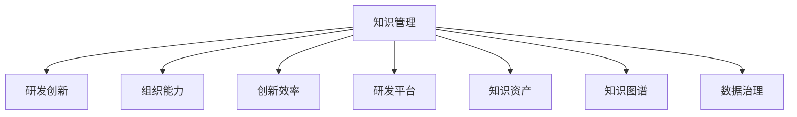

                 

# 知识管理在研发创新中的关键作用

> 关键词：知识管理,研发创新,组织能力,创新效率,研发平台,知识资产,知识图谱,数据治理

## 1. 背景介绍

### 1.1 问题由来
在当前的数字化转型背景下，知识管理与研发创新的关系日益密切。大型企业或研发机构在进行新产品开发、技术突破时，往往需要依赖丰富的知识积累和创新能力。如何有效地管理这些知识，使其在研发过程中发挥最大价值，成为摆在世界级AI专家、软件架构师、CTO面前的重要课题。

知识管理的核心是信息的获取、存储、共享和应用。它不仅包括数据、文档等有形资产，还涉及隐性知识，如经验、智慧和判断力。在大数据、人工智能和云计算等新兴技术的影响下，知识管理在推动研发创新中的作用愈发凸显。

### 1.2 问题核心关键点
知识管理的核心理念是通过信息化手段，对企业的知识资产进行系统化管理，以提高研发效率、降低成本、增强组织能力，并最终驱动企业的持续创新和竞争力的提升。

具体而言，知识管理在研发创新中发挥关键作用的核心关键点包括：

- **知识获取**：高效获取内外部的知识信息，包括技术文献、行业报告、市场趋势等。
- **知识存储**：采用分布式存储和云存储技术，确保知识数据的可靠性和安全性。
- **知识共享**：构建知识共享平台，促进团队间的知识流动和协作。
- **知识应用**：将知识嵌入研发工具和流程中，提高研发过程的智能化和自动化水平。
- **创新驱动**：利用知识资产激发创新灵感，加速技术突破和新产品的上市。

### 1.3 问题研究意义
研究知识管理在研发创新中的关键作用，对于提升企业研发效率、增强创新能力、推动数字化转型具有重要意义。

1. **提升研发效率**：通过系统化的知识管理，企业可以避免重复劳动，快速获取相关知识和经验，缩短产品上市周期。
2. **增强创新能力**：知识管理的实施，可以丰富研发团队的知识储备，激发创新思维，提升企业在复杂多变市场环境中的应变能力和竞争力。
3. **推动数字化转型**：知识管理是企业数字化转型的重要组成部分，它能够整合企业内外部的信息资源，为企业提供数据驱动的决策支持。
4. **促进跨团队协作**：知识共享平台能够打破团队壁垒，促进跨部门、跨团队的协作，提高研发的整体效率和创新能力。
5. **加速技术突破**：知识管理帮助企业在技术研发中充分利用外部资源，加速技术积累和突破，提升企业的技术领先优势。

## 2. 核心概念与联系

### 2.1 核心概念概述

为更好地理解知识管理在研发创新中的关键作用，本节将介绍几个密切相关的核心概念：

- **知识管理(Knowledge Management)**：通过对知识的获取、存储、共享和应用，提高组织能力和创新效率的系统化管理方法。
- **研发创新(Research and Development Innovation)**：指企业在新产品开发、技术突破等活动中所进行的各种创新活动，包括技术创新、产品创新、流程创新等。
- **组织能力(Organizational Capability)**：指企业内部员工、团队和系统在协作和执行任务时的能力，包括决策能力、沟通能力、执行能力等。
- **创新效率(Innovation Efficiency)**：指在研发创新过程中，通过有效的知识管理手段，提高创新活动的质量和速度。
- **研发平台(Research Development Platform)**：指用于支持研发活动的各种软件工具和系统，包括项目管理、代码版本控制、测试工具等。
- **知识资产(Knowledge Asset)**：指企业拥有的各类知识资源，包括文档、数据、技术、经验等。
- **知识图谱(Knowledge Graph)**：一种通过图形化的方式组织和表示知识的结构，能够更好地展现知识之间的关联和层次。
- **数据治理(Data Governance)**：指对数据资源的管理和治理，确保数据的质量、安全、一致性和可用性。

这些核心概念之间的逻辑关系可以通过以下Mermaid流程图来展示：



这个流程图展示了知识管理与研发创新之间的密切联系：

1. 知识管理通过系统化的手段，提升组织能力和创新效率，为研发创新提供坚实基础。
2. 组织能力是知识管理的核心目标，通过提升员工和团队的协作和执行能力，推动研发活动的顺利进行。
3. 创新效率是知识管理的直接成果，有效的知识管理可以显著提升研发活动的速度和质量。
4. 研发平台是知识管理的实施载体，通过各种软件工具和系统，支持知识的管理和应用。
5. 知识资产是知识管理的核心内容，通过系统化管理和应用，提高知识资源的利用率。
6. 知识图谱和数据治理是知识管理的高级手段，通过结构化和规范化的管理，提升知识管理的质量和效率。

## 3. 核心算法原理 & 具体操作步骤

### 3.1 算法原理概述

知识管理在研发创新中的作用，主要体现在通过有效的知识获取、存储、共享和应用，提升企业的组织能力和创新效率。其核心算法原理包括：

- **知识获取**：通过爬虫、API接口、数据采集等方式，从外部获取知识信息，整合到企业知识库中。
- **知识存储**：利用分布式存储技术，如Hadoop、HDFS、对象存储等，确保知识数据的可靠性和可扩展性。
- **知识共享**：通过构建知识共享平台，如Confluence、SharePoint等，促进团队间的知识流动和协作。
- **知识应用**：将知识嵌入研发工具和流程中，如JIRA、Confluence、GitLab等，提高研发过程的智能化和自动化水平。
- **知识治理**：通过数据治理和知识图谱技术，确保知识数据的完整性、一致性和安全性，提高知识管理的效率和质量。

### 3.2 算法步骤详解

知识管理在研发创新中的操作步骤可以分为以下几个主要步骤：

**Step 1: 知识获取与整合**
- 收集和整合来自外部和内部的各种知识资源，包括文献、报告、会议记录、代码库等。
- 使用爬虫、API接口、数据采集工具等手段，自动获取新的知识信息。
- 通过ETL（抽取、转换、加载）过程，将异构的知识数据整合到统一的知识库中。

**Step 2: 知识存储与分布**
- 使用分布式存储系统（如Hadoop、HDFS、对象存储等），存储和管理大规模的知识数据。
- 利用分布式数据库和数据仓库技术，确保知识数据的可靠性和可扩展性。
- 采用数据分片、冗余存储等方式，提高知识数据的可用性和容错能力。

**Step 3: 知识共享与协作**
- 构建知识共享平台（如Confluence、SharePoint等），提供团队协作和知识共享的环境。
- 设计知识分类和标签体系，方便用户进行知识搜索和浏览。
- 引入版本控制和权限管理机制，确保知识数据的共享和保护。

**Step 4: 知识应用与集成**
- 将知识嵌入研发工具和流程中，如JIRA、Confluence、GitLab等，提高研发过程的智能化和自动化水平。
- 利用API接口和插件技术，将知识管理系统与其他业务系统（如ERP、CRM等）集成。
- 开发知识搜索和推荐引擎，辅助研发团队快速获取所需知识。

**Step 5: 知识治理与优化**
- 实施数据治理策略，确保知识数据的完整性、一致性和安全性。
- 引入知识图谱技术，构建知识之间的关联和层次关系，提高知识管理的深度和广度。
- 定期进行知识质量评估和优化，提升知识管理的效率和质量。

### 3.3 算法优缺点

知识管理在研发创新中的优点包括：

- **提升组织能力**：通过系统化的知识管理，提高团队协作效率，增强决策能力和执行能力。
- **加速研发进程**：通过知识共享和复用，避免重复劳动，缩短产品上市周期。
- **增强创新能力**：丰富知识储备，激发创新思维，提升企业的技术领先优势。
- **推动数字化转型**：整合内外部的信息资源，为企业提供数据驱动的决策支持。

同时，知识管理也存在一些局限性：

- **数据质量问题**：知识数据的准确性和完整性直接影响知识管理的有效性。
- **技术复杂性**：需要先进的技术手段和架构，对企业技术能力要求较高。
- **实施成本高**：知识管理系统的开发和维护需要较大的资金和人力资源投入。
- **用户接受度**：知识管理的实施需要企业内部员工的积极参与和支持。

### 3.4 算法应用领域

知识管理在研发创新中的应用领域广泛，包括但不限于：

- **软件开发**：通过知识库和代码版本控制系统（如GitLab），提高软件开发效率和质量。
- **产品设计**：利用知识共享平台和数据治理技术，促进团队协作，提升产品设计水平。
- **项目管理**：通过知识管理系统（如JIRA），跟踪项目进度，优化资源配置。
- **技术支持**：通过知识图谱和搜索引擎，快速解决技术问题，提供高效的技术支持。
- **市场分析**：利用外部知识资源和数据治理技术，进行市场趋势分析和竞争对手分析。
- **知识培训**：通过在线学习平台（如Coursera、Udacity），利用知识库和培训资料，提升员工技能和知识水平。

## 4. 数学模型和公式 & 详细讲解 & 举例说明

### 4.1 数学模型构建

知识管理在研发创新中的应用，涉及多个数学模型和算法，包括数据治理、知识图谱和数据挖掘等。以下以知识图谱的构建为例，说明数学模型的构建过程。

假设知识图谱的节点表示实体，边表示实体之间的关系。设知识图谱中有 $n$ 个实体，$m$ 条边，每个实体的特征向量为 $\mathbf{v}_i$，边 $e_{ij}$ 的特征向量为 $\mathbf{e}_{ij}$，则知识图谱的数学模型可以表示为：

$$
\mathcal{G} = (\mathcal{V}, \mathcal{E})
$$

其中 $\mathcal{V} = \{v_1, v_2, \ldots, v_n\}$ 为实体集合，$\mathcal{E} = \{e_{ij}\}$ 为边集合。

### 4.2 公式推导过程

知识图谱的构建过程主要涉及以下几个步骤：

1. **节点嵌入**：将每个实体映射到一个低维向量空间，使得相似的实体在空间中距离较近。常用的节点嵌入算法包括TransE、DistMult、ComplEx等。

2. **边嵌入**：将每条边映射到一个低维向量空间，使得相似的边在空间中距离较近。常用的边嵌入算法包括TransR、MultiE等。

3. **知识融合**：将节点嵌入和边嵌入的结果进行融合，生成知识图谱。常用的知识融合算法包括Mean Pooling、Concat Pooling等。

4. **知识推理**：通过知识图谱进行逻辑推理，发现知识图谱中的潜在关系和规律。常用的知识推理算法包括基于逻辑的推理、基于图神经网络的推理等。

以TransE算法为例，推导节点嵌入的公式。假设知识图谱中有 $n$ 个实体，$m$ 条边，每个实体的特征向量为 $\mathbf{v}_i$，则节点嵌入的公式可以表示为：

$$
\mathbf{v}_i = \sum_{e_j \in \mathcal{E}_i} \mathbf{e}_{ij} \cdot \mathbf{u}_j
$$

其中 $\mathcal{E}_i$ 表示实体 $i$ 的邻居边集合，$\mathbf{u}_j$ 表示边 $j$ 的权重向量。

### 4.3 案例分析与讲解

以一家智能制造企业的知识管理实践为例，分析其如何通过知识图谱技术，提升研发创新能力。

该企业在进行产品开发时，面临以下问题：

1. **信息孤岛**：各部门之间的信息共享不畅，导致研发效率低下。
2. **知识流失**：老员工离职，带走大量宝贵的知识经验。
3. **创新困难**：缺乏跨部门协作，难以整合多种专业知识，推动技术突破。

通过构建知识图谱，该企业解决了以上问题：

1. **信息共享**：通过知识图谱，各部门之间的信息共享更加高效，避免了信息孤岛现象。
2. **知识传承**：通过节点嵌入技术，将老员工的经验和知识存储在知识图谱中，方便新员工快速学习和掌握。
3. **跨部门协作**：通过知识图谱，不同部门的专家可以跨部门协作，共享和整合知识，推动技术创新和产品开发。

通过知识图谱的应用，该企业的研发创新能力得到了显著提升，产品在市场上的竞争力也得到了增强。

## 5. 项目实践：代码实例和详细解释说明

### 5.1 开发环境搭建

在进行知识管理系统的开发前，需要准备好开发环境。以下是使用Python进行知识管理系统开发的环境配置流程：

1. 安装Anaconda：从官网下载并安装Anaconda，用于创建独立的Python环境。

2. 创建并激活虚拟环境：
```bash
conda create -n km-env python=3.8 
conda activate km-env
```

3. 安装相关库：
```bash
pip install pandas numpy scikit-learn torch transformers pytorch-lightning
```

4. 安装数据治理和知识图谱工具：
```bash
pip install elasticsearch-spark[py3]
pip install elasticsearch[py3]
pip install apache-spark[py3]
```

5. 安装知识管理平台工具：
```bash
pip install confluence-api pyconfluence[py3]
pip install jira-api pyjira[py3]
pip install gitlab[py3]
```

完成上述步骤后，即可在`km-env`环境中开始知识管理系统开发。

### 5.2 源代码详细实现

这里我们以构建基于Elasticsearch和Spark的知识图谱系统为例，给出知识管理系统的Python代码实现。

首先，定义数据治理模块，用于清洗和整合知识数据：

```python
from pyspark.sql import SparkSession

# 初始化SparkSession
spark = SparkSession.builder.appName("KnowledgeGovernance").getOrCreate()

# 加载原始数据
df = spark.read.json("knowledge.json")

# 清洗和整合数据
df_cleaned = df.select([df['id'].cast('int'), df['name'].cast('str')]).dropDuplicates()

# 将清洗后的数据保存为Elasticsearch索引
df_cleaned.write.format("org.elasticsearch.spark.sql").saveAsTable("knowledge")
```

然后，定义知识图谱模块，用于构建和查询知识图谱：

```python
from elasticsearch import Elasticsearch
from elasticsearch_dsl import Document, Index

# 初始化Elasticsearch客户端
es = Elasticsearch([{'host': 'localhost', 'port': 9200}])

# 定义知识图谱的映射
index = Index("knowledge")
schema = Document().properties(
    "id": "keyword",
    "name": "keyword"
)
index.put_mapping(schema)

# 构建知识图谱
def build_graph():
    graph = []
    for doc in es.search(index="knowledge", body={'query': {'match_all': {}}}).iterrows():
        graph.append((doc[0], doc[1]))
    return graph

# 查询知识图谱
def query_graph(query):
    results = []
    for doc in es.search(index="knowledge", body={'query': {'match': {'name': query}}}).iterrows():
        results.append((doc[0], doc[1]))
    return results
```

最后，启动知识管理系统的示例代码：

```python
# 数据治理
governance = knowledge_governance()

# 构建知识图谱
graph = build_graph()

# 查询知识图谱
results = query_graph("engineering")
```

以上就是基于Elasticsearch和Spark构建知识图谱系统的完整代码实现。可以看到，知识管理系统的开发涉及数据治理、Elasticsearch和Spark等多种技术手段，实现过程相对复杂。

### 5.3 代码解读与分析

让我们再详细解读一下关键代码的实现细节：

**数据治理模块**：
- 使用PySpark加载原始数据，并对其进行清洗和整合，去除重复和不必要的数据。
- 将清洗后的数据保存为Elasticsearch索引，方便后续查询和分析。

**知识图谱模块**：
- 定义知识图谱的映射，将Elasticsearch索引中的数据映射为知识图谱的节点和边。
- 使用Elasticsearch构建知识图谱，将文档作为节点，文档之间的相似度作为边。
- 查询知识图谱时，使用Elasticsearch的搜索功能，根据关键词返回相关的节点和边。

**启动示例代码**：
- 调用数据治理模块，对原始数据进行清洗和整合。
- 调用知识图谱模块，构建知识图谱并进行查询。

知识管理系统的开发涉及到多种技术手段，需要开发者具备较强的技术实力和系统集成能力。以上代码仅为示例，实际开发中还需要根据具体需求进行调整和优化。

## 6. 实际应用场景

### 6.1 智能制造

在智能制造领域，知识管理能够显著提升生产效率和产品质量。通过构建知识图谱，企业可以将各种生产流程、设备参数、材料属性等知识资源整合到统一的知识库中，提高生产过程的透明性和可控性。

例如，某智能制造企业通过知识管理系统的应用，实现了以下效果：

1. **生产流程优化**：通过知识图谱，分析生产过程中的瓶颈和优化点，实时调整生产参数，提升生产效率。
2. **设备维护管理**：利用设备维护知识库，快速定位设备故障，减少停机时间，提高设备利用率。
3. **材料选型优化**：根据产品要求和材料属性，选择合适的材料，提升产品质量和成本控制能力。

### 6.2 金融服务

在金融服务领域，知识管理能够提升风险控制和客户服务能力。通过构建知识图谱，金融机构可以整合各种金融数据、市场信息、客户行为等知识资源，提高风险评估和客户服务的精准度。

例如，某金融公司通过知识管理系统的应用，实现了以下效果：

1. **风险评估优化**：通过知识图谱，分析客户的信用记录、交易历史等信息，实时调整风险评估模型，提高风险识别和控制能力。
2. **客户服务提升**：利用知识图谱和客户行为数据，提供个性化的金融服务，提升客户满意度和忠诚度。
3. **市场趋势分析**：整合金融数据和市场信息，进行市场趋势分析和预测，辅助投资决策。

### 6.3 医疗健康

在医疗健康领域，知识管理能够提升医疗服务质量和创新能力。通过构建知识图谱，医疗机构可以整合各种医疗数据、研究文献、临床经验等知识资源，提高诊疗水平和研发创新能力。

例如，某医疗集团通过知识管理系统的应用，实现了以下效果：

1. **诊疗水平提升**：通过知识图谱，整合各种医疗数据和临床经验，提高诊疗的准确性和效率。
2. **药物研发加速**：利用知识图谱和研究文献，加速新药物的研发进程，缩短上市时间。
3. **医疗服务优化**：通过知识图谱和患者数据，提供个性化的医疗服务，提升医疗服务的质量和体验。

### 6.4 未来应用展望

随着知识图谱和数据治理技术的不断进步，知识管理在更多领域的应用前景广阔。

- **智慧城市**：通过整合城市数据和公共信息，提升城市管理的智能化水平，构建智慧城市。
- **智慧农业**：利用农业知识库和物联网数据，提高农业生产效率和质量，推动农业现代化。
- **智慧教育**：整合教育资源和教学数据，提供个性化的教育服务，提升教育质量。
- **智慧交通**：整合交通数据和智能设备信息，提升交通管理和调度效率，减少交通拥堵。

未来，知识管理将与更多新兴技术融合，如物联网、区块链、人工智能等，推动数字化转型和智能应用的发展。知识管理系统的不断优化和创新，将为企业带来更高效、更智能、更安全的运营模式。

## 7. 工具和资源推荐

### 7.1 学习资源推荐

为了帮助开发者系统掌握知识管理系统的理论和实践，这里推荐一些优质的学习资源：

1. **《Knowledge Management: An Integrated Approach》**：一本详细介绍知识管理的书籍，涵盖了知识管理的基本概念、模型和实践。
2. **Coursera《Knowledge Management and Organizational Memory》**：由加州大学尔湾分校开设的在线课程，介绍了知识管理的理论和应用。
3. **IBM Data Science Professional Certificate**：涵盖数据科学和知识管理的综合课程，提供实战项目和案例分析。
4. **Knowledge Management Institute (KMI)**：提供知识管理培训和认证，帮助企业提升知识管理水平。
5. **Knowledge Management and E-Learning Forum**：一个知识管理的在线社区，提供知识管理的最佳实践和案例分享。

### 7.2 开发工具推荐

高效的知识管理系统开发离不开优秀的工具支持。以下是几款用于知识管理系统开发的工具：

1. **Apache Spark**：用于大数据处理和分析的分布式计算框架，适合大规模数据治理和知识图谱构建。
2. **Elasticsearch**：分布式搜索和分析引擎，适合构建知识图谱和进行高效的文本搜索。
3. **Apache Solr**：另一个流行的搜索和分析引擎，支持大规模数据处理和查询优化。
4. **Confluence**：知识管理平台，提供文档管理和知识共享功能。
5. **JIRA**：项目管理工具，适合集成到知识管理系统中进行任务管理和协作。
6. **GitLab**：代码版本控制和项目管理工具，适合与知识管理系统集成进行代码管理。

### 7.3 相关论文推荐

知识管理在研发创新中的应用是一个跨学科的研究领域，涉及信息科学、管理学、计算机科学等多个学科。以下是几篇奠基性的相关论文，推荐阅读：

1. **Knowledge Management in Organizations**：研究组织中知识管理的过程、方法和效果。
2. **Semantic Web and Knowledge Graphs**：介绍知识图谱的基本概念和构建方法。
3. **Data Governance in Knowledge Management**：探讨数据治理在知识管理中的应用和重要性。
4. **Knowledge Sharing and Collaboration**：研究知识共享和协作在组织中的作用和效果。
5. **Innovation and Knowledge Management**：探讨知识管理对创新过程的影响和提升方法。

这些论文代表了知识管理在研发创新中的应用研究方向，为深入理解知识管理的理论和实践提供了丰富的理论基础和实践经验。

## 8. 总结：未来发展趋势与挑战

### 8.1 总结

本文对知识管理在研发创新中的关键作用进行了全面系统的介绍。首先阐述了知识管理与研发创新之间的关系，明确了知识管理在提升组织能力、加速研发进程、增强创新能力等方面的重要价值。其次，从原理到实践，详细讲解了知识管理的数学模型和操作步骤，给出了知识管理系统的代码实例和详细解释。同时，本文还广泛探讨了知识管理在智能制造、金融服务、医疗健康等众多领域的应用前景，展示了知识管理的巨大潜力。

通过本文的系统梳理，可以看到，知识管理在研发创新中发挥着关键作用。知识管理系统的成功实施，不仅能够提升企业的研发效率和创新能力，还能推动数字化转型和智能应用的深入发展。未来，随着知识图谱和数据治理技术的不断进步，知识管理将为更多领域带来变革性影响，为人类社会的数字化发展注入新的动力。

### 8.2 未来发展趋势

展望未来，知识管理在研发创新中的应用将呈现以下几个发展趋势：

1. **智能化**：结合人工智能和机器学习技术，实现知识图谱的自动化构建和优化，提升知识管理的智能化水平。
2. **可视化**：利用数据可视化技术，呈现知识图谱和知识管理系统的运行状态，帮助用户更好地理解和管理知识。
3. **实时化**：通过实时数据处理和分析技术，实现知识管理的实时更新和优化，提高知识管理的效率和准确性。
4. **自动化**：结合自动化技术，如自动化清洗、自动化标注等，减少知识管理的人力投入，提升知识管理的自动化水平。
5. **跨领域融合**：将知识管理与其他领域的技术进行融合，如物联网、区块链、大数据等，推动知识管理的广泛应用。
6. **用户体验优化**：通过用户界面和交互设计，提升知识管理系统的用户体验，使用户能够更便捷地获取和使用知识。

### 8.3 面临的挑战

尽管知识管理在研发创新中的应用前景广阔，但在实施过程中仍面临诸多挑战：

1. **数据质量问题**：知识数据的准确性和完整性直接影响知识管理的有效性。
2. **技术复杂性**：知识管理系统需要先进的技术手段和架构，对企业技术能力要求较高。
3. **实施成本高**：知识管理系统的开发和维护需要较大的资金和人力资源投入。
4. **用户接受度**：知识管理的实施需要企业内部员工的积极参与和支持。
5. **跨部门协作**：知识管理系统的成功实施需要跨部门协作，解决信息孤岛和协作难题。
6. **安全性和隐私保护**：知识管理系统的应用需要严格的数据安全措施和隐私保护策略。

### 8.4 研究展望

未来，知识管理的研究方向将在以下几个方面继续深入：

1. **知识图谱的自动化构建**：开发更智能的知识图谱构建工具，自动发现和构建知识图谱，提高知识管理的效率和质量。
2. **知识图谱的可视化**：研究知识图谱的可视化技术，提供更好的用户界面和交互体验，提升知识管理系统的用户体验。
3. **知识管理的实时化**：结合实时数据处理和分析技术，实现知识管理的实时更新和优化，提高知识管理的效率和准确性。
4. **知识管理系统的自动化**：开发自动化的知识管理工具，减少人工干预，提升知识管理的自动化水平。
5. **跨领域知识管理**：研究跨领域的知识管理方法，将知识管理与其他领域的技术进行融合，推动知识管理的广泛应用。
6. **知识管理的伦理和隐私保护**：研究知识管理的伦理和隐私保护策略，确保知识管理的合规性和安全性。

## 9. 附录：常见问题与解答

**Q1: 知识管理系统的实施需要哪些关键资源？**

A: 知识管理系统的实施需要以下关键资源：

1. **技术团队**：具备数据治理、知识图谱构建和系统集成等技术能力的团队。
2. **数据资源**：丰富的知识数据资源，包括文档、数据、研究文献等。
3. **工具和平台**：先进的知识管理工具和平台，如Elasticsearch、Apache Spark、Confluence等。
4. **培训和推广**：对企业员工进行知识管理培训，提升其知识管理意识和技能。
5. **制度和流程**：建立知识管理的制度和流程，确保知识管理的规范化和标准化。

**Q2: 知识管理系统的构建和优化需要遵循哪些原则？**

A: 知识管理系统的构建和优化需要遵循以下原则：

1. **标准化**：建立统一的知识分类和标签体系，确保知识管理的标准化和一致性。
2. **自动化**：利用自动化技术，减少人工干预，提升知识管理的效率和准确性。
3. **可视化和实时化**：通过数据可视化和实时分析技术，呈现知识图谱和知识管理系统的运行状态，帮助用户更好地理解和管理知识。
4. **跨部门协作**：推动跨部门协作，解决信息孤岛和协作难题，提升知识管理的协同效应。
5. **用户体验优化**：优化用户界面和交互设计，提升知识管理系统的用户体验，使用户能够更便捷地获取和使用知识。
6. **安全性和隐私保护**：确保数据安全措施和隐私保护策略，保障知识管理系统的合规性和安全性。

**Q3: 如何评估知识管理系统的实施效果？**

A: 知识管理系统的实施效果可以通过以下几个方面进行评估：

1. **知识获取和共享**：评估知识管理系统的知识获取和共享能力，确保知识资源的完整性和可用性。
2. **知识应用和优化**：评估知识管理系统在研发、生产、服务等领域的应用效果，提升知识管理的实际价值。
3. **创新和绩效提升**：评估知识管理对企业创新能力和绩效的影响，衡量知识管理系统的实际贡献。
4. **用户满意度**：通过用户反馈和调查，评估知识管理系统的用户满意度，了解用户的使用体验和需求。
5. **成本效益分析**：进行成本效益分析，评估知识管理系统的投入和产出，确保其经济效益。

**Q4: 如何在知识管理系统中实现有效的知识治理？**

A: 在知识管理系统中实现有效的知识治理，需要遵循以下步骤：

1. **数据清洗和整合**：对原始数据进行清洗和整合，确保数据的准确性和完整性。
2. **数据分类和标签**：对知识数据进行分类和标签，建立统一的知识分类体系。
3. **知识图谱构建**：利用知识图谱技术，构建知识之间的关联和层次关系。
4. **数据治理策略**：制定数据治理策略，确保知识数据的完整性、一致性和安全性。
5. **知识质量评估**：定期进行知识质量评估，发现和修正知识数据的问题。
6. **知识优化和更新**：根据知识管理的反馈和需求，不断优化和更新知识管理系统。

这些步骤和方法，可以帮助企业在知识管理系统中实现有效的知识治理，提升知识管理的质量和效率。

---

作者：禅与计算机程序设计艺术 / Zen and the Art of Computer Programming

