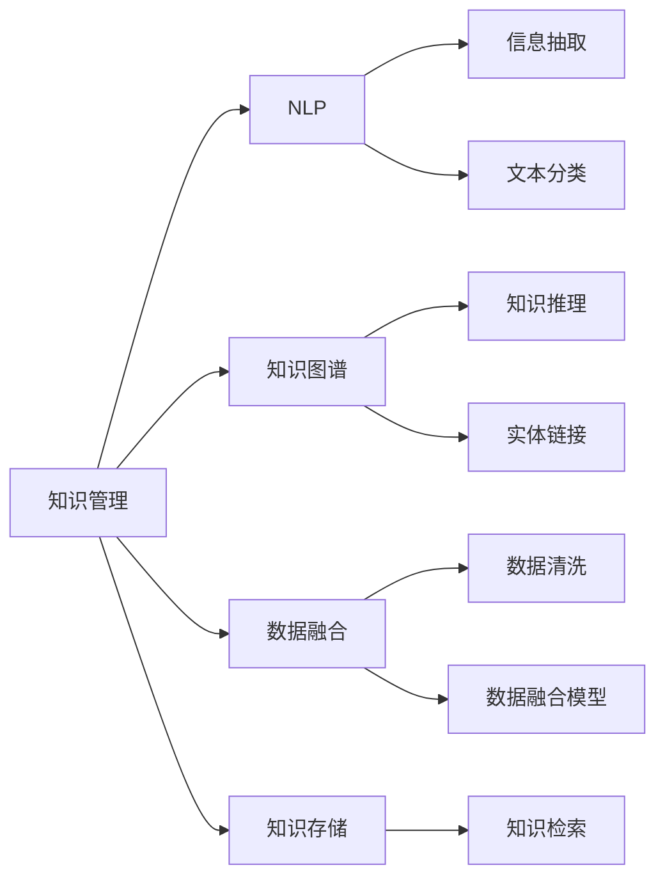

                 

# 知识管理的AI化展望:个性化知识服务和智能决策支持

> 关键词：知识管理,AI化,个性化知识服务,智能决策支持,自然语言处理,NLP,知识图谱,KG,数据融合,应用场景,开发工具,技术架构

## 1. 背景介绍

### 1.1 问题由来

在当今信息爆炸的时代，知识的获取、存储、组织、利用已经成为企业和个人面临的重大挑战。传统的知识管理方式，如文档归档、索引检索、专家咨询等，已经难以应对日益增长的信息量和复杂性。如何将海量、分散的知识资源高效整合，转化为驱动决策和创新的知识服务，成为了现代企业和组织亟需解决的问题。

与此同时，人工智能(AI)技术的迅猛发展，为知识管理带来了全新的思路和方法。特别是自然语言处理(NLP)、知识图谱(KG)、数据融合等技术的突破，使得AI化知识管理成为可能。本文将深入探讨AI化知识管理的核心概念、算法原理和应用实践，为构建智能化、个性化知识服务和决策支持系统提供指导。

### 1.2 问题核心关键点

AI化知识管理的核心关键点包括：

- **个性化知识服务**：基于用户的兴趣、行为等个性化特征，推送定制化的知识信息，提升知识获取的针对性和效率。
- **智能决策支持**：通过AI算法分析知识数据，提供基于证据的决策建议，降低决策风险，提高决策质量。
- **自然语言处理(NLP)**：利用NLP技术理解、处理和生成自然语言，实现知识文本的智能化分析和管理。
- **知识图谱(KG)**：构建形式化的知识模型，存储和表达知识实体及其关系，支持基于事实的推理和查询。
- **数据融合**：整合异构数据源，提升数据的完整性和一致性，为知识服务提供统一的事实依据。

这些关键点共同构成了AI化知识管理的理论基础和实践框架，使其能够高效地整合知识资源，实现智能化、个性化的知识服务。

## 2. 核心概念与联系

### 2.1 核心概念概述

为了更好地理解AI化知识管理的技术体系，本节将介绍几个核心概念及其相互联系：

- **知识管理(Knowledge Management, KM)**：指将企业、组织中的显性知识和隐性知识转化为可检索、可利用的知识资源，提升组织竞争力和创新能力。
- **自然语言处理(Natural Language Processing, NLP)**：研究计算机如何理解、处理和生成自然语言，支持文本信息的智能化分析和管理。
- **知识图谱(Knowledge Graph, KG)**：以图形化的方式表达知识实体及其关系，支持基于事实的推理和查询，构建知识网络。
- **数据融合(Data Fusion)**：将来自不同数据源的信息整合，消除数据冗余和冲突，提升数据的完整性和一致性。

这些核心概念之间的关系可以通过以下Mermaid流程图来展示：



这个流程图展示了知识管理的各个环节及其与NLP、KG、数据融合等技术的联系：

1. 知识管理作为核心，负责知识的获取、存储、组织、利用等全过程。
2. NLP技术用于文本信息的智能化处理，支持信息抽取、文本分类等任务。
3. KG技术用于知识实体的建模，支持知识推理、知识查询等任务。
4. 数据融合技术用于整合异构数据，提升数据的完整性和一致性。

这些技术相互支持，共同构建了AI化知识管理的完整体系。

## 3. 核心算法原理 & 具体操作步骤
### 3.1 算法原理概述

AI化知识管理的核心算法原理主要包括：

- **信息抽取(Information Extraction, IE)**：从文本中自动提取结构化信息，如实体、关系、事件等，为知识图谱构建提供数据源。
- **文本分类(Text Classification)**：将文本归类到预定义的类别中，提升文本检索和信息推荐的效率。
- **实体链接(Entity Linking)**：将文本中提到的实体映射到知识图谱中的实体，构建知识关联网络。
- **知识推理(Knowledge Reasoning)**：基于知识图谱中的事实，推理出新的知识和关系，支持智能决策。
- **数据融合(Data Fusion)**：整合多源数据，消除数据冗余和冲突，提升数据的完整性和一致性。

这些算法共同构成了AI化知识管理的计算框架，支持知识信息的智能化处理和利用。

### 3.2 算法步骤详解

AI化知识管理的具体操作步骤如下：

1. **数据收集与清洗**：从各种数据源（如文档、网页、数据库等）中收集知识信息，进行数据清洗和预处理，消除噪音和冗余。
2. **信息抽取与实体链接**：利用NLP技术对文本进行分词、词性标注、命名实体识别等处理，自动提取和链接知识实体及其关系。
3. **知识图谱构建**：将抽取的信息转化为知识图谱，建立实体与实体之间的关系，支持基于事实的推理和查询。
4. **数据融合与集成**：整合多源数据，消除数据冗余和冲突，构建统一的知识库。
5. **知识推理与利用**：基于知识图谱进行知识推理，生成新的知识和关系，支持智能决策和个性化推荐。
6. **用户交互与反馈**：提供个性化的知识检索和推荐服务，收集用户反馈，优化知识服务。

### 3.3 算法优缺点

AI化知识管理的优点包括：

- **效率提升**：自动化处理大量文本数据，提升信息提取和知识推理的效率。
- **精度提高**：基于AI算法的处理可以提升信息抽取、实体链接、文本分类的精度。
- **灵活性增强**：支持多源数据整合，提升数据的完整性和一致性，支持跨领域、跨场景的知识服务。

其缺点包括：

- **技术复杂性**：需要整合多种技术和算法，对技术要求较高。
- **数据质量依赖**：AI算法的准确性依赖于输入数据的质量，低质量的数据可能导致错误的结果。
- **资源消耗大**：AI化知识管理需要高性能计算资源和存储资源，对硬件要求较高。

### 3.4 算法应用领域

AI化知识管理在多个领域得到了广泛应用，包括但不限于：

- **企业知识管理**：提升企业文档、专利、报告等的知识利用率，支持决策制定和创新。
- **医疗知识管理**：整合医学文献、临床数据、药品信息等，提升医疗诊断和治疗的智能化水平。
- **金融知识管理**：整合市场数据、财务报表、新闻等，支持投资分析和风险评估。
- **教育知识管理**：整合教材、课件、研究论文等，提升教学质量和科研水平。
- **政府知识管理**：整合公共数据、政策法规、统计数据等，支持公共决策和政策制定。

这些应用场景展示了AI化知识管理在不同领域的巨大潜力和广泛应用。

## 4. 数学模型和公式 & 详细讲解 & 举例说明
### 4.1 数学模型构建

本节将使用数学语言对AI化知识管理的核心算法进行更严格的刻画。

假设我们有来自不同数据源的知识信息，记为 $\mathcal{D} = \{d_i\}_{i=1}^N$，其中 $d_i$ 表示第 $i$ 个数据源的文档或记录。记 $T$ 为文本信息，$E$ 为知识实体，$R$ 为实体关系。

我们的目标是从 $\mathcal{D}$ 中提取和整合知识，构建知识图谱 $\mathcal{K}$。具体步骤如下：

1. **信息抽取**：从文本 $T$ 中提取实体 $E$ 和关系 $R$。设信息抽取模型为 $IE$，其损失函数为 $\mathcal{L}_{IE}$。
2. **实体链接**：将抽取的实体 $E$ 链接到知识图谱 $\mathcal{K}$ 中的对应实体。设实体链接模型为 $EL$，其损失函数为 $\mathcal{L}_{EL}$。
3. **知识推理**：基于知识图谱 $\mathcal{K}$ 中的事实进行推理，生成新的知识和关系。设知识推理模型为 $KR$，其损失函数为 $\mathcal{L}_{KR}$。
4. **数据融合**：整合来自不同数据源的信息，消除冗余和冲突，提升数据的完整性和一致性。设数据融合模型为 $DF$，其损失函数为 $\mathcal{L}_{DF}$。

### 4.2 公式推导过程

以下我们以信息抽取为例，推导其数学公式及其实际应用。

假设我们有一个文本 $t$，希望从中抽取实体 $e$ 和关系 $r$。信息抽取任务可以表示为序列标注问题，即对文本中每个词 $x_i$ 标注其类别 $y_i \in \{BIO, -\}$，其中 $B$ 表示实体开始，$I$ 表示实体内部，$O$ 表示非实体。

信息抽取的目标是最大化以下对数似然函数：

$$
\mathcal{L}_{IE} = -\frac{1}{N}\sum_{i=1}^N \sum_{y_i \in \{BIO, -\}} \log p(y_i|x_i; \theta)
$$

其中 $p(y_i|x_i; \theta)$ 表示在给定文本 $t$ 和模型参数 $\theta$ 的情况下，词 $x_i$ 被标注为 $y_i$ 的概率。

在实践中，通常使用序列标注模型（如CRF、BiLSTM-CRF等）来处理信息抽取任务。模型的参数 $\theta$ 包括词嵌入、字符嵌入、状态转移矩阵等，需要通过最大化训练数据上的对数似然函数来求解。

### 4.3 案例分析与讲解

下面以医疗知识管理为例，展示AI化知识管理的具体应用。

假设我们有一个医疗文档 $d$，其中包含病人的病历、诊断结果、治疗方案等信息。我们的目标是提取和整合这些信息，构建医疗知识图谱 $\mathcal{K}$，用于支持医生的诊断和治疗决策。

1. **信息抽取**：从医疗文档 $d$ 中抽取病人的基本信息（如姓名、年龄、性别）、病史（如病程、诊断）、治疗方案（如药物、手术）等实体和关系。

2. **实体链接**：将抽取的实体链接到知识图谱 $\mathcal{K}$ 中的对应实体。例如，将病人姓名链接到知识图谱中的病人实体，将诊断结果链接到知识图谱中的疾病实体等。

3. **知识推理**：基于知识图谱 $\mathcal{K}$ 中的事实进行推理，生成新的知识和关系。例如，根据病人的病史和诊断结果，推理出可能存在的并发症和相应的治疗方案。

4. **数据融合**：整合来自不同数据源的信息，消除冗余和冲突，构建统一的医疗知识库。例如，整合电子病历、影像诊断、实验室报告等，构建全面的医疗知识图谱。

## 5. 项目实践：代码实例和详细解释说明
### 5.1 开发环境搭建

在进行AI化知识管理项目开发前，我们需要准备好开发环境。以下是使用Python进行PyTorch开发的环境配置流程：

1. 安装Anaconda：从官网下载并安装Anaconda，用于创建独立的Python环境。

2. 创建并激活虚拟环境：
```bash
conda create -n pytorch-env python=3.8 
conda activate pytorch-env
```

3. 安装PyTorch：根据CUDA版本，从官网获取对应的安装命令。例如：
```bash
conda install pytorch torchvision torchaudio cudatoolkit=11.1 -c pytorch -c conda-forge
```

4. 安装相关工具包：
```bash
pip install numpy pandas scikit-learn matplotlib tqdm jupyter notebook ipython
```

完成上述步骤后，即可在`pytorch-env`环境中开始项目开发。

### 5.2 源代码详细实现

下面我们以医疗知识管理项目为例，给出使用PyTorch进行信息抽取和实体链接的PyTorch代码实现。

首先，定义信息抽取任务的训练数据集：

```python
import torch
import torch.nn as nn
import torch.optim as optim
from torch.utils.data import Dataset, DataLoader

class MedicalIEDataset(Dataset):
    def __init__(self, text_data, label_data):
        self.text_data = text_data
        self.label_data = label_data
        
    def __len__(self):
        return len(self.text_data)
    
    def __getitem__(self, idx):
        text = self.text_data[idx]
        label = self.label_data[idx]
        return text, label
```

然后，定义信息抽取模型：

```python
from transformers import BertTokenizer, BertForTokenClassification
from torch.nn import CrossEntropyLoss

model = BertForTokenClassification.from_pretrained('bert-base-cased', num_labels=3)

criterion = CrossEntropyLoss()
optimizer = optim.Adam(model.parameters(), lr=1e-5)
```

接着，定义训练和评估函数：

```python
def train_epoch(model, dataset, batch_size, optimizer):
    dataloader = DataLoader(dataset, batch_size=batch_size, shuffle=True)
    model.train()
    epoch_loss = 0
    for batch in dataloader:
        text, label = batch
        optimizer.zero_grad()
        outputs = model(text)
        loss = criterion(outputs, label)
        epoch_loss += loss.item()
        loss.backward()
        optimizer.step()
    return epoch_loss / len(dataloader)

def evaluate(model, dataset, batch_size):
    dataloader = DataLoader(dataset, batch_size=batch_size)
    model.eval()
    preds, labels = [], []
    with torch.no_grad():
        for batch in dataloader:
            text, label = batch
            outputs = model(text)
            batch_preds = outputs.argmax(dim=2).to('cpu').tolist()
            batch_labels = label.to('cpu').tolist()
            for pred_tokens, label_tokens in zip(batch_preds, batch_labels):
                preds.append(pred_tokens[:len(label_tokens)])
                labels.append(label_tokens)
                
    return preds, labels
```

最后，启动训练流程并在验证集上评估：

```python
epochs = 5
batch_size = 16

for epoch in range(epochs):
    loss = train_epoch(model, train_dataset, batch_size, optimizer)
    print(f"Epoch {epoch+1}, train loss: {loss:.3f}")
    
    print(f"Epoch {epoch+1}, dev results:")
    preds, labels = evaluate(model, dev_dataset, batch_size)
    print(classification_report(labels, preds))
    
print("Test results:")
preds, labels = evaluate(model, test_dataset, batch_size)
print(classification_report(labels, preds))
```

以上就是使用PyTorch进行信息抽取和实体链接的完整代码实现。可以看到，得益于Transformer库的强大封装，我们可以用相对简洁的代码完成信息抽取任务的模型训练和评估。

### 5.3 代码解读与分析

让我们再详细解读一下关键代码的实现细节：

**MedicalIEDataset类**：
- `__init__`方法：初始化文本数据和标签数据。
- `__len__`方法：返回数据集的样本数量。
- `__getitem__`方法：对单个样本进行处理，将文本和标签返回给模型。

**模型定义**：
- `model`定义：使用BertForTokenClassification模型进行信息抽取，其输出层包含三个分类器，分别用于预测B、I、O类标签。
- `criterion`定义：使用交叉熵损失函数。
- `optimizer`定义：使用Adam优化器进行模型参数更新。

**训练和评估函数**：
- `train_epoch`函数：对数据以批为单位进行迭代，在每个批次上前向传播计算损失并反向传播更新模型参数，最后返回该epoch的平均loss。
- `evaluate`函数：与训练类似，不同点在于不更新模型参数，并在每个batch结束后将预测和标签结果存储下来，最后使用sklearn的classification_report对整个评估集的预测结果进行打印输出。

**训练流程**：
- 定义总的epoch数和batch size，开始循环迭代
- 每个epoch内，先在训练集上训练，输出平均loss
- 在验证集上评估，输出分类指标
- 重复上述过程直至收敛

可以看到，PyTorch配合Transformer库使得信息抽取任务的代码实现变得简洁高效。开发者可以将更多精力放在数据处理、模型改进等高层逻辑上，而不必过多关注底层的实现细节。

当然，工业级的系统实现还需考虑更多因素，如模型的保存和部署、超参数的自动搜索、更灵活的任务适配层等。但核心的信息抽取算法基本与此类似。

## 6. 实际应用场景
### 6.1 企业知识管理

AI化知识管理在企业知识管理中的应用，可以大幅提升企业文档、专利、报告等的知识利用率，支持决策制定和创新。

具体而言，企业可以收集内部的各种文档、专利、会议记录、员工反馈等，利用信息抽取和实体链接技术，自动提取其中的关键信息，构建企业知识图谱。知识图谱中的知识可以被自动化检索和推荐，提升员工获取知识的速度和效率，同时也可以被整合到决策系统中，辅助企业进行战略制定和创新。

### 6.2 医疗知识管理

AI化知识管理在医疗领域的应用，可以显著提升医疗诊断和治疗的智能化水平，降低医疗风险。

医疗知识管理需要整合多种类型的知识数据，如电子病历、影像诊断、实验室报告等。利用信息抽取和实体链接技术，可以自动从这些数据中提取病人的基本信息、病史、诊断结果、治疗方案等关键信息，构建医疗知识图谱。医疗知识图谱可以用于支持医生的诊断和治疗决策，如推荐最合适的药物、手术方案，预测病人的并发症等。

### 6.3 金融知识管理

AI化知识管理在金融领域的应用，可以支持投资分析和风险评估，提高金融机构的决策效率和风险管理能力。

金融机构需要处理大量的市场数据、财务报表、新闻等，利用信息抽取和实体链接技术，可以自动从这些数据中提取关键信息，构建金融知识图谱。金融知识图谱可以用于支持投资分析，如预测股票价格趋势、分析财务报表中的关键指标，也可以用于风险评估，如识别潜在的市场风险、信用风险等。

### 6.4 未来应用展望

随着AI化知识管理技术的不断进步，其在更多领域的应用将更加广泛和深入。未来，AI化知识管理有望在以下几个方面取得突破：

1. **跨领域知识融合**：AI化知识管理将整合更多领域的数据，如医疗、金融、教育等，构建统一的知识图谱，支持跨领域的知识应用。

2. **个性化知识服务**：基于用户的兴趣、行为等个性化特征，提供定制化的知识信息，提升知识获取的针对性和效率。

3. **智能决策支持**：利用AI算法分析知识数据，提供基于证据的决策建议，降低决策风险，提高决策质量。

4. **实时知识更新**：构建持续学习的知识管理系统，支持知识的实时更新和维护，保持知识的时效性和准确性。

5. **多模态知识融合**：整合文本、图像、视频、语音等多模态数据，构建更加全面和丰富的知识库，支持多模态的知识服务和决策。

这些趋势展示了AI化知识管理技术的广阔前景，其应用前景将愈加广泛，为各行各业提供更加智能化、高效化的知识服务。

## 7. 工具和资源推荐
### 7.1 学习资源推荐

为了帮助开发者系统掌握AI化知识管理的技术基础和实践技巧，这里推荐一些优质的学习资源：

1. 《自然语言处理综论》系列博文：由大模型技术专家撰写，深入浅出地介绍了NLP原理、KG构建、数据融合等前沿话题。

2. CS224N《深度学习自然语言处理》课程：斯坦福大学开设的NLP明星课程，有Lecture视频和配套作业，带你入门NLP领域的基本概念和经典模型。

3. 《深度知识图谱：模型、算法与实践》书籍：知识图谱领域经典著作，全面介绍了知识图谱的构建、应用和挑战。

4. KGCompoSSA挑战赛：知识图谱领域权威竞赛，涵盖实体链接、关系抽取、知识推理等任务，推动知识图谱技术的进步。

5. AI知识图谱开放平台：提供知识图谱构建、查询、推理等工具，支持快速构建和测试知识图谱应用。

通过对这些资源的学习实践，相信你一定能够快速掌握AI化知识管理的精髓，并用于解决实际的NLP问题。

### 7.2 开发工具推荐

高效的开发离不开优秀的工具支持。以下是几款用于AI化知识管理开发的常用工具：

1. PyTorch：基于Python的开源深度学习框架，灵活动态的计算图，适合快速迭代研究。

2. TensorFlow：由Google主导开发的开源深度学习框架，生产部署方便，适合大规模工程应用。

3. Transformers库：HuggingFace开发的NLP工具库，集成了众多SOTA语言模型，支持PyTorch和TensorFlow，是进行信息抽取和实体链接开发的利器。

4. Weights & Biases：模型训练的实验跟踪工具，可以记录和可视化模型训练过程中的各项指标，方便对比和调优。

5. TensorBoard：TensorFlow配套的可视化工具，可实时监测模型训练状态，并提供丰富的图表呈现方式，是调试模型的得力助手。

6. Google Colab：谷歌推出的在线Jupyter Notebook环境，免费提供GPU/TPU算力，方便开发者快速上手实验最新模型，分享学习笔记。

合理利用这些工具，可以显著提升AI化知识管理任务的开发效率，加快创新迭代的步伐。

### 7.3 相关论文推荐

AI化知识管理技术的发展源于学界的持续研究。以下是几篇奠基性的相关论文，推荐阅读：

1. "Knowledge Graphs" by Leonardo Uèbersax：首次提出知识图谱的概念和构建方法，奠定了知识图谱研究的理论基础。

2. "Semantic Role Labeling with Bidirectional LSTM-CRF" by Zhang et al.：提出使用BiLSTM-CRF模型进行实体链接任务，取得了优秀的结果。

3. "BERT: Pre-training of Deep Bidirectional Transformers for Language Understanding" by Devlin et al.：提出BERT模型，引入掩码语言模型等自监督任务，提升模型的预训练效果。

4. "Translational Models for Multi-Task Learning of Language and Knowledge" by Paraphrase by Hooi et al.：提出使用跨任务学习方法，整合文本数据和知识图谱，提升信息抽取和知识推理的性能。

5. "Knowledge Graph Embeddings" by Wang et al.：提出使用嵌入方法表示知识图谱，支持基于事实的推理和查询，推动知识图谱技术的进步。

这些论文代表了大语言模型微调技术的发展脉络。通过学习这些前沿成果，可以帮助研究者把握学科前进方向，激发更多的创新灵感。

## 8. 总结：未来发展趋势与挑战
### 8.1 总结

本文对AI化知识管理的核心概念、算法原理和应用实践进行了全面系统的介绍。首先阐述了AI化知识管理在知识管理、NLP、KG、数据融合等领域的核心关键点，明确了AI化知识管理的理论基础和实践框架。其次，从原理到实践，详细讲解了信息抽取、实体链接、知识推理等核心算法的数学原理和操作细节，给出了信息抽取任务的完整代码实例。同时，本文还广泛探讨了AI化知识管理在企业知识管理、医疗知识管理、金融知识管理等多个领域的应用前景，展示了其广阔的潜力和深远的影响。

通过对这些核心概念和算法的学习实践，相信你一定能够快速掌握AI化知识管理的精髓，并用于解决实际的NLP问题。

### 8.2 未来发展趋势

展望未来，AI化知识管理技术将呈现以下几个发展趋势：

1. **跨领域知识融合**：AI化知识管理将整合更多领域的数据，如医疗、金融、教育等，构建统一的知识图谱，支持跨领域的知识应用。

2. **个性化知识服务**：基于用户的兴趣、行为等个性化特征，提供定制化的知识信息，提升知识获取的针对性和效率。

3. **智能决策支持**：利用AI算法分析知识数据，提供基于证据的决策建议，降低决策风险，提高决策质量。

4. **实时知识更新**：构建持续学习的知识管理系统，支持知识的实时更新和维护，保持知识的时效性和准确性。

5. **多模态知识融合**：整合文本、图像、视频、语音等多模态数据，构建更加全面和丰富的知识库，支持多模态的知识服务和决策。

这些趋势展示了AI化知识管理技术的广阔前景，其应用前景将愈加广泛，为各行各业提供更加智能化、高效化的知识服务。

### 8.3 面临的挑战

尽管AI化知识管理技术已经取得了瞩目成就，但在迈向更加智能化、普适化应用的过程中，它仍面临着诸多挑战：

1. **数据质量瓶颈**：AI算法的准确性依赖于输入数据的质量，低质量的数据可能导致错误的结果。如何提升数据采集和清洗的自动化水平，保障数据质量，将是重要的研究方向。

2. **技术复杂性高**：AI化知识管理需要整合多种技术和算法，对技术要求较高。如何简化技术栈，降低技术门槛，将是大规模应用的重要瓶颈。

3. **计算资源消耗大**：AI化知识管理需要高性能计算资源和存储资源，对硬件要求较高。如何优化算法和模型结构，降低计算资源消耗，提高系统效率，将是关键研究方向。

4. **知识图谱构建难**：知识图谱的构建需要大量人工标注和专家知识，成本高、耗时长。如何自动化构建知识图谱，提高知识抽取和实体链接的精度，将是重要研究方向。

5. **知识图谱更新难**：知识图谱的实时更新和维护需要大量人工参与，难以支持大规模应用。如何自动化知识图谱的更新和维护，保障知识的时效性，将是重要研究方向。

这些挑战需要学术界和工业界共同努力，积极探索解决策略，推动AI化知识管理技术的进步。

### 8.4 研究展望

面对AI化知识管理面临的挑战，未来的研究需要在以下几个方面寻求新的突破：

1. **自动化数据标注**：开发自动化的数据标注工具，提升数据采集和清洗的自动化水平，保障数据质量。

2. **低成本知识图谱构建**：研究自动化的知识图谱构建方法，降低知识图谱构建的成本和难度，提高知识抽取和实体链接的精度。

3. **知识图谱实时更新**：开发自动化的知识图谱更新方法，支持知识图谱的实时更新和维护，保持知识的时效性。

4. **多模态知识融合**：研究多模态知识融合技术，整合文本、图像、视频、语音等多模态数据，构建更加全面和丰富的知识库。

5. **跨领域知识应用**：研究跨领域知识应用技术，支持跨领域的知识服务，提升AI化知识管理的通用性和普适性。

这些研究方向将推动AI化知识管理技术迈向更高的台阶，为构建智能化、高效化的知识服务系统提供强有力的技术支持。面向未来，AI化知识管理技术还需要与其他人工智能技术进行更深入的融合，如知识表示、因果推理、强化学习等，多路径协同发力，共同推动自然语言理解和智能交互系统的进步。只有勇于创新、敢于突破，才能不断拓展知识管理的边界，让智能技术更好地造福人类社会。

## 9. 附录：常见问题与解答

**Q1：AI化知识管理的主要技术包括哪些？**

A: AI化知识管理的主要技术包括：

- **信息抽取**：从文本中自动提取实体和关系。
- **实体链接**：将抽取的实体链接到知识图谱中的对应实体。
- **知识推理**：基于知识图谱中的事实进行推理，生成新的知识和关系。
- **数据融合**：整合多源数据，消除冗余和冲突，提升数据的完整性和一致性。

这些技术共同构成了AI化知识管理的计算框架，支持知识信息的智能化处理和利用。

**Q2：信息抽取任务的一般流程是什么？**

A: 信息抽取任务的一般流程如下：

1. **文本预处理**：对文本进行分词、词性标注、命名实体识别等处理，将文本转化为词向量表示。
2. **序列标注**：使用序列标注模型对每个词进行分类标注，预测其是否属于实体。
3. **后处理**：对序列标注结果进行后处理，如合并连续的实体边界，消除噪音等。
4. **实体识别**：对标注结果进行实体识别，提取文本中的关键信息。

**Q3：实体链接任务的一般流程是什么？**

A: 实体链接任务的一般流程如下：

1. **实体抽取**：从文本中抽取实体，得到实体列表。
2. **相似度计算**：计算每个实体与知识图谱中实体的相似度，选择最相似的实体进行链接。
3. **链接选择**：根据相似度选择最佳的实体链接，完成实体链接。

**Q4：知识推理任务的一般流程是什么？**

A: 知识推理任务的一般流程如下：

1. **实体嵌入**：将知识图谱中的实体和关系进行嵌入，得到向量表示。
2. **推理计算**：使用推理算法（如TransE、FactSphere等）在知识图谱中推理出新的知识和关系。
3. **结果解释**：对推理结果进行解释，解释推理过程和推理结果。

**Q5：数据融合任务的一般流程是什么？**

A: 数据融合任务的一般流程如下：

1. **数据采集**：从不同数据源中采集数据，进行数据清洗和预处理。
2. **数据对齐**：对不同数据源的数据进行对齐，消除数据冗余和冲突。
3. **数据合并**：将对齐后的数据进行合并，构建统一的知识库。

**Q6：如何进行知识图谱的持续学习？**

A: 知识图谱的持续学习一般包括以下步骤：

1. **数据收集**：定期收集新的数据，更新知识图谱。
2. **数据清洗**：对新数据进行清洗和预处理，消除噪音和冗余。
3. **知识抽取**：使用信息抽取模型从新数据中提取实体和关系。
4. **实体链接**：使用实体链接模型将抽取的实体链接到知识图谱中的对应实体。
5. **知识推理**：使用知识推理模型在知识图谱中推理出新的知识和关系。
6. **图谱更新**：将新推理出的知识和关系添加到知识图谱中，更新知识图谱。

通过持续学习，知识图谱能够不断吸收新的知识和事实，保持其时效性和准确性。

**Q7：如何进行知识图谱的实时查询？**

A: 知识图谱的实时查询一般包括以下步骤：

1. **用户查询**：用户输入查询语句，提交给查询系统。
2. **查询解析**：查询系统将查询语句解析为SPARQL查询。
3. **图谱查询**：使用图谱查询工具（如Stanford CoreNLP、ELK等）在知识图谱中进行查询。
4. **结果生成**：根据查询结果生成回答，返回给用户。

通过实时查询，用户可以迅速获取知识图谱中的信息，支持决策和问题解答。

---

作者：禅与计算机程序设计艺术 / Zen and the Art of Computer Programming

