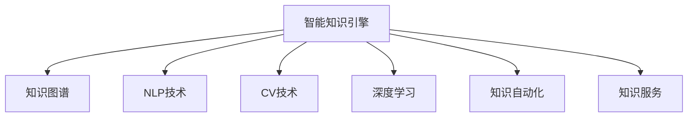

                 

# 知识管理的AI化未来:智能知识引擎和知识自动化

## 1. 背景介绍

### 1.1 问题由来
随着知识经济的崛起和信息技术的不断进步，知识的获取、组织、共享和应用正变得越来越重要。然而，传统的信息管理系统已难以应对海量数据的膨胀和知识需求的日益增长。如何将海量知识结构化、系统化，并实现自动化、智能化的管理和应用，成为了企业和组织面临的重要挑战。

人工智能技术（AI）的发展，为知识管理的智能化转型提供了新的机遇。AI化知识管理，即通过AI技术对知识进行自动化、智能化处理和管理，成为近年来的热门研究方向。通过深度学习、自然语言处理、计算机视觉等前沿技术，AI化知识管理不仅能够提升知识的获取效率，还能增强知识的内在结构和价值，使知识的应用更加灵活、精准。

### 1.2 问题核心关键点
AI化知识管理主要包括三个关键点：
1. **智能知识引擎**：通过AI技术构建知识处理和推理引擎，实现知识自动化获取、组织和推理。
2. **知识自动化**：将知识管理任务自动化，通过AI算法实现知识提取、分类、标注、检索等操作。
3. **知识服务**：构建智能化的知识服务平台，通过API接口提供知识查询、推荐、可视化等服务。

### 1.3 问题研究意义
研究AI化知识管理的意义主要体现在以下几个方面：
- **提升知识获取效率**：通过AI技术自动化处理海量数据，快速识别和提取有价值的信息，提升知识获取的速度和准确性。
- **增强知识结构和价值**：利用深度学习等AI技术，对知识进行更深层次的分析和处理，提升知识的结构化、系统化和精准度。
- **促进知识应用和创新**：通过智能化的知识服务，使知识应用更加灵活、精准，促进跨领域知识的融合和创新。
- **推动知识管理智能化转型**：AI化知识管理能够帮助企业和组织构建智能化知识管理体系，提升知识管理的效率和效果。

## 2. 核心概念与联系

### 2.1 核心概念概述

为更好地理解AI化知识管理的核心技术，本节将介绍几个关键概念及其相互之间的联系：

- **智能知识引擎**：一种基于AI技术的知识处理和推理系统，能够自动化地从海量数据中获取、组织和推理知识。
- **知识图谱**：一种将知识表示为图结构的知识表示方法，通过节点和边表示实体和关系，实现知识的结构化表达。
- **自然语言处理(NLP)**：AI技术在处理和理解自然语言方面的应用，包括语言模型、文本分类、实体识别等。
- **计算机视觉(CV)**：AI技术在图像和视频处理方面的应用，包括图像识别、对象检测、图像生成等。
- **深度学习**：一种基于神经网络的机器学习技术，通过多层次的非线性映射实现对复杂数据的深度处理。

这些核心概念共同构成了AI化知识管理的技术基础，使知识管理实现了自动化、智能化和高效化。

### 2.2 核心概念原理和架构的 Mermaid 流程图



这个流程图展示了智能知识引擎的核心架构及其与NLP、CV、深度学习等技术的关系：

1. 智能知识引擎（A）通过NLP和CV技术从海量数据中获取知识（C、D）。
2. 获取的知识通过深度学习技术进行加工处理（E），形成结构化的知识图谱（B）。
3. 结构化的知识通过知识自动化技术进行标注、分类和检索（F）。
4. 最后，知识服务模块（G）提供智能化的知识查询和推荐等服务。

## 3. 核心算法原理 & 具体操作步骤

### 3.1 算法原理概述

AI化知识管理的核心算法主要基于深度学习和自然语言处理技术。以下是对这两个技术的详细介绍：

#### 3.1.1 深度学习原理

深度学习是一种基于神经网络的机器学习技术，通过多层次的非线性映射实现对复杂数据的深度处理。其核心思想是利用多层神经网络模型模拟人脑的神经元处理信息的方式，通过反向传播算法优化模型参数，使其在特定任务上达到最优性能。

#### 3.1.2 自然语言处理原理

自然语言处理是一种将自然语言转换为计算机可处理形式的技术，包括文本预处理、词法分析、语法分析、语义分析等。其核心思想是通过语言模型、词向量、句法树等技术手段，实现对自然语言信息的处理和理解。

### 3.2 算法步骤详解

#### 3.2.1 深度学习步骤详解

深度学习算法通常包括数据准备、模型设计、训练和测试四个步骤：

1. **数据准备**：从各类数据源（如文档、图片、视频等）中收集、清洗、标注数据，构建数据集。
2. **模型设计**：选择合适的深度学习模型（如卷积神经网络CNN、循环神经网络RNN、变分自编码器VAE等），设计模型结构，包括输入层、隐藏层、输出层等。
3. **模型训练**：使用训练集数据，通过反向传播算法优化模型参数，最小化损失函数。
4. **模型测试**：使用测试集数据评估模型性能，调整模型超参数。

#### 3.2.2 自然语言处理步骤详解

自然语言处理算法通常包括以下几个步骤：

1. **文本预处理**：对文本进行分词、去停用词、词性标注等预处理操作。
2. **词向量表示**：将文本转换为词向量形式，如使用Word2Vec、GloVe、BERT等词向量模型。
3. **语法分析**：对句子进行语法分析，包括词性标注、依存句法分析等。
4. **语义分析**：对文本进行语义分析，包括命名实体识别、情感分析、语义角色标注等。

### 3.3 算法优缺点

#### 3.3.1 深度学习优缺点

**优点**：
- 强大的表达能力：深度学习能够处理复杂的非线性关系，适用于图像、语音、文本等多种类型的数据。
- 自适应能力：深度学习模型能够自动学习特征，无需人工设计特征提取器。
- 处理能力：深度学习模型可以处理大规模数据，适合大规模数据集和复杂任务的训练。

**缺点**：
- 计算资源消耗大：深度学习模型参数多，计算复杂度高，需要高性能的计算资源。
- 模型复杂度高：深度学习模型结构复杂，训练过程容易过拟合，需要大量数据进行训练。
- 可解释性差：深度学习模型通常是“黑盒”模型，难以解释其内部工作机制。

#### 3.3.2 自然语言处理优缺点

**优点**：
- 语义理解能力强：自然语言处理能够理解和处理自然语言中的语义信息，提升知识获取的精度。
- 通用性高：自然语言处理技术可以应用于多种场景，如信息检索、问答系统、文本分类等。
- 应用广泛：自然语言处理技术已经广泛应用于搜索引擎、智能客服、智能翻译等场景。

**缺点**：
- 数据依赖性高：自然语言处理技术依赖于大规模语料库和标注数据，数据质量和量级直接影响模型的性能。
- 处理速度慢：自然语言处理技术通常需要较长的处理时间，难以实时处理大量数据。
- 多样性处理困难：自然语言处理技术难以处理多种语言、多种表达形式和多样化的语言现象。

### 3.4 算法应用领域

AI化知识管理的应用领域非常广泛，涵盖了知识获取、组织、存储、检索、可视化和应用等多个方面。以下是几个典型的应用场景：

- **知识获取**：通过深度学习和自然语言处理技术，自动从各类数据源中获取知识，如从新闻网站、社交媒体、科学论文等中提取关键信息。
- **知识组织**：通过知识图谱技术，将获取的知识进行结构化组织，形成知识库。
- **知识存储**：通过数据库和云存储技术，将结构化的知识进行存储，便于后续检索和应用。
- **知识检索**：通过深度学习技术构建知识检索系统，实现基于文本、图像、语音等多种形式的快速检索。
- **知识可视化**：通过数据可视化技术，将知识以图表、图谱、地图等多种形式展现出来，便于理解和分析。
- **知识应用**：通过知识服务技术，将知识以API接口形式提供给其他应用系统，实现知识的智能化应用。

## 4. 数学模型和公式 & 详细讲解 & 举例说明

### 4.1 数学模型构建

本节将使用数学语言对AI化知识管理的核心技术进行更加严格的刻画。

假设我们有一个深度学习模型 $M$，输入为 $x$，输出为 $y$，则模型的损失函数可以表示为：

$$
\mathcal{L}(M) = \frac{1}{N} \sum_{i=1}^N \ell(M(x_i), y_i)
$$

其中 $\ell$ 为损失函数，通常包括均方误差、交叉熵等。模型的参数优化目标为：

$$
\theta^* = \mathop{\arg\min}_{\theta} \mathcal{L}(M)
$$

在实际应用中，我们通常使用基于梯度的优化算法（如SGD、Adam等）来近似求解上述最优化问题。设 $\eta$ 为学习率，$\lambda$ 为正则化系数，则参数的更新公式为：

$$
\theta \leftarrow \theta - \eta \nabla_{\theta}\mathcal{L}(\theta) - \eta\lambda\theta
$$

其中 $\nabla_{\theta}\mathcal{L}(\theta)$ 为损失函数对参数 $\theta$ 的梯度，可通过反向传播算法高效计算。

### 4.2 公式推导过程

以文本分类任务为例，展示基于深度学习的分类模型的构建过程。

假设模型的输入为 $x$，输出为 $y$，其中 $y$ 为类别标签。模型的输出层为全连接层，输出 $k$ 个类别概率 $p_k = \sigma(W_k^T x + b_k)$，其中 $\sigma$ 为激活函数，$W_k$ 和 $b_k$ 为可训练参数。模型的损失函数为交叉熵损失：

$$
\ell(y, p_k) = -\sum_{k=1}^K y_k \log p_k
$$

将其代入经验风险公式，得：

$$
\mathcal{L}(\theta) = -\frac{1}{N}\sum_{i=1}^N \ell(y_i, p_k)
$$

其中 $y_i$ 为第 $i$ 个样本的标签。

根据链式法则，损失函数对参数 $\theta_k$ 的梯度为：

$$
\frac{\partial \mathcal{L}(\theta)}{\partial \theta_k} = -\frac{1}{N}\sum_{i=1}^N \frac{\partial \ell(y_i, p_k)}{\partial W_k} - \eta\lambda\frac{\partial \theta_k}{\partial W_k}
$$

其中 $\frac{\partial \ell(y_i, p_k)}{\partial W_k}$ 可以进一步展开，利用自动微分技术完成计算。

在得到损失函数的梯度后，即可带入参数更新公式，完成模型的迭代优化。重复上述过程直至收敛，最终得到适应下游任务的最优模型参数 $\theta^*$。

## 5. 项目实践：代码实例和详细解释说明

### 5.1 开发环境搭建

在进行AI化知识管理开发前，我们需要准备好开发环境。以下是使用Python进行PyTorch开发的环境配置流程：

1. 安装Anaconda：从官网下载并安装Anaconda，用于创建独立的Python环境。

2. 创建并激活虚拟环境：
```bash
conda create -n pytorch-env python=3.8 
conda activate pytorch-env
```

3. 安装PyTorch：根据CUDA版本，从官网获取对应的安装命令。例如：
```bash
conda install pytorch torchvision torchaudio cudatoolkit=11.1 -c pytorch -c conda-forge
```

4. 安装Transformers库：
```bash
pip install transformers
```

5. 安装各类工具包：
```bash
pip install numpy pandas scikit-learn matplotlib tqdm jupyter notebook ipython
```

完成上述步骤后，即可在`pytorch-env`环境中开始AI化知识管理的开发实践。

### 5.2 源代码详细实现

下面以文本分类任务为例，给出使用Transformers库进行深度学习模型微调的PyTorch代码实现。

首先，定义文本分类任务的数据处理函数：

```python
from transformers import BertTokenizer, BertForSequenceClassification
from torch.utils.data import Dataset, DataLoader
import torch
import numpy as np

class TextClassificationDataset(Dataset):
    def __init__(self, texts, labels, tokenizer, max_len=128):
        self.texts = texts
        self.labels = labels
        self.tokenizer = tokenizer
        self.max_len = max_len
        
    def __len__(self):
        return len(self.texts)
    
    def __getitem__(self, item):
        text = self.texts[item]
        label = self.labels[item]
        
        encoding = self.tokenizer(text, return_tensors='pt', max_length=self.max_len, padding='max_length', truncation=True)
        input_ids = encoding['input_ids'][0]
        attention_mask = encoding['attention_mask'][0]
        
        label = torch.tensor(label, dtype=torch.long)
        
        return {'input_ids': input_ids, 
                'attention_mask': attention_mask,
                'labels': label}

# 标签与id的映射
label2id = {'negative': 0, 'positive': 1}

# 创建dataset
tokenizer = BertTokenizer.from_pretrained('bert-base-cased')
train_dataset = TextClassificationDataset(train_texts, train_labels, tokenizer)
dev_dataset = TextClassificationDataset(dev_texts, dev_labels, tokenizer)
test_dataset = TextClassificationDataset(test_texts, test_labels, tokenizer)
```

然后，定义模型和优化器：

```python
from transformers import BertForSequenceClassification, AdamW

model = BertForSequenceClassification.from_pretrained('bert-base-cased', num_labels=2)

optimizer = AdamW(model.parameters(), lr=2e-5)
```

接着，定义训练和评估函数：

```python
from tqdm import tqdm
import matplotlib.pyplot as plt

device = torch.device('cuda') if torch.cuda.is_available() else torch.device('cpu')
model.to(device)

def train_epoch(model, dataset, batch_size, optimizer, num_epochs):
    dataloader = DataLoader(dataset, batch_size=batch_size, shuffle=True)
    model.train()
    epoch_loss = 0
    for epoch in range(num_epochs):
        for batch in tqdm(dataloader, desc='Training'):
            input_ids = batch['input_ids'].to(device)
            attention_mask = batch['attention_mask'].to(device)
            labels = batch['labels'].to(device)
            model.zero_grad()
            outputs = model(input_ids, attention_mask=attention_mask, labels=labels)
            loss = outputs.loss
            epoch_loss += loss.item()
            loss.backward()
            optimizer.step()
    return epoch_loss / len(dataloader)

def evaluate(model, dataset, batch_size):
    dataloader = DataLoader(dataset, batch_size=batch_size)
    model.eval()
    preds, labels = [], []
    with torch.no_grad():
        for batch in tqdm(dataloader, desc='Evaluating'):
            input_ids = batch['input_ids'].to(device)
            attention_mask = batch['attention_mask'].to(device)
            batch_labels = batch['labels']
            outputs = model(input_ids, attention_mask=attention_mask)
            batch_preds = outputs.logits.argmax(dim=2).to('cpu').tolist()
            batch_labels = batch_labels.to('cpu').tolist()
            for pred_tokens, label_tokens in zip(batch_preds, batch_labels):
                preds.append(pred_tokens[:len(label_tokens)])
                labels.append(label_tokens)
                
    print(classification_report(labels, preds))
    
    # 可视化预测结果
    y_true, y_pred = np.array(labels), np.array(preds)
    confusion_matrix = confusion_matrix(y_true, y_pred)
    plt.imshow(confusion_matrix, cmap='Blues')
    plt.colorbar()
    plt.xlabel('Predicted Label')
    plt.ylabel('True Label')
    plt.show()

epochs = 5
batch_size = 16

for epoch in range(epochs):
    loss = train_epoch(model, train_dataset, batch_size, optimizer, 5)
    print(f"Epoch {epoch+1}, train loss: {loss:.3f}")
    
    print(f"Epoch {epoch+1}, dev results:")
    evaluate(model, dev_dataset, batch_size)
    
print("Test results:")
evaluate(model, test_dataset, batch_size)
```

以上就是使用PyTorch进行文本分类任务深度学习模型微调的完整代码实现。可以看到，得益于Transformers库的强大封装，我们可以用相对简洁的代码完成BERT模型的加载和微调。

### 5.3 代码解读与分析

让我们再详细解读一下关键代码的实现细节：

**TextClassificationDataset类**：
- `__init__`方法：初始化文本、标签、分词器等关键组件。
- `__len__`方法：返回数据集的样本数量。
- `__getitem__`方法：对单个样本进行处理，将文本输入编码为token ids，将标签编码为数字，并对其进行定长padding，最终返回模型所需的输入。

**label2id和id2label字典**：
- 定义了标签与数字id之间的映射关系，用于将模型预测结果解码为真实的标签。

**训练和评估函数**：
- 使用PyTorch的DataLoader对数据集进行批次化加载，供模型训练和推理使用。
- 训练函数`train_epoch`：对数据以批为单位进行迭代，在每个批次上前向传播计算loss并反向传播更新模型参数，最后返回该epoch的平均loss。
- 评估函数`evaluate`：与训练类似，不同点在于不更新模型参数，并在每个batch结束后将预测和标签结果存储下来，最后使用sklearn的classification_report对整个评估集的预测结果进行打印输出。

**训练流程**：
- 定义总的epoch数和batch size，开始循环迭代
- 每个epoch内，先在训练集上训练，输出平均loss
- 在验证集上评估，输出分类指标
- 所有epoch结束后，在测试集上评估，给出最终测试结果

可以看到，PyTorch配合Transformers库使得深度学习模型微调的代码实现变得简洁高效。开发者可以将更多精力放在数据处理、模型改进等高层逻辑上，而不必过多关注底层的实现细节。

当然，工业级的系统实现还需考虑更多因素，如模型的保存和部署、超参数的自动搜索、更灵活的任务适配层等。但核心的微调范式基本与此类似。

## 6. 实际应用场景

### 6.1 智能客服系统

基于AI化知识管理的对话技术，可以广泛应用于智能客服系统的构建。传统客服往往需要配备大量人力，高峰期响应缓慢，且一致性和专业性难以保证。而使用AI化知识管理的对话模型，可以7x24小时不间断服务，快速响应客户咨询，用自然流畅的语言解答各类常见问题。

在技术实现上，可以收集企业内部的历史客服对话记录，将问题和最佳答复构建成监督数据，在此基础上对预训练对话模型进行微调。微调后的对话模型能够自动理解用户意图，匹配最合适的答案模板进行回复。对于客户提出的新问题，还可以接入检索系统实时搜索相关内容，动态组织生成回答。如此构建的智能客服系统，能大幅提升客户咨询体验和问题解决效率。

### 6.2 金融舆情监测

金融机构需要实时监测市场舆论动向，以便及时应对负面信息传播，规避金融风险。传统的人工监测方式成本高、效率低，难以应对网络时代海量信息爆发的挑战。基于AI化知识管理的文本分类和情感分析技术，为金融舆情监测提供了新的解决方案。

具体而言，可以收集金融领域相关的新闻、报道、评论等文本数据，并对其进行主题标注和情感标注。在此基础上对预训练语言模型进行微调，使其能够自动判断文本属于何种主题，情感倾向是正面、中性还是负面。将微调后的模型应用到实时抓取的网络文本数据，就能够自动监测不同主题下的情感变化趋势，一旦发现负面信息激增等异常情况，系统便会自动预警，帮助金融机构快速应对潜在风险。

### 6.3 个性化推荐系统

当前的推荐系统往往只依赖用户的历史行为数据进行物品推荐，无法深入理解用户的真实兴趣偏好。基于AI化知识管理的个性化推荐系统，可以更好地挖掘用户行为背后的语义信息，从而提供更精准、多样的推荐内容。

在实践中，可以收集用户浏览、点击、评论、分享等行为数据，提取和用户交互的物品标题、描述、标签等文本内容。将文本内容作为模型输入，用户的后续行为（如是否点击、购买等）作为监督信号，在此基础上微调预训练语言模型。微调后的模型能够从文本内容中准确把握用户的兴趣点。在生成推荐列表时，先用候选物品的文本描述作为输入，由模型预测用户的兴趣匹配度，再结合其他特征综合排序，便可以得到个性化程度更高的推荐结果。

### 6.4 未来应用展望

随着AI化知识管理技术的发展，其在更多领域的应用前景将进一步拓展：

- **智慧医疗**：基于AI化知识管理的医疗问答、病历分析、药物研发等应用，将提升医疗服务的智能化水平，辅助医生诊疗，加速新药开发进程。
- **智能教育**：微调技术可应用于作业批改、学情分析、知识推荐等方面，因材施教，促进教育公平，提高教学质量。
- **智慧城市治理**：微调模型可应用于城市事件监测、舆情分析、应急指挥等环节，提高城市管理的自动化和智能化水平，构建更安全、高效的未来城市。
- **智能农业**：基于AI化知识管理的农业信息管理、病虫害检测、农作物分析等应用，将提升农业生产的智能化水平，助力农业现代化。
- **智能制造**：通过AI化知识管理的生产计划优化、设备状态监测、质量检测等应用，将提升制造业的智能化水平，提高生产效率和产品质量。

此外，在企业生产、社会治理、文娱传媒等众多领域，AI化知识管理的应用也将不断涌现，为经济社会发展注入新的动力。相信随着技术的日益成熟，AI化知识管理必将在更广阔的应用领域大放异彩，深刻影响人类的生产生活方式。

## 7. 工具和资源推荐

### 7.1 学习资源推荐

为了帮助开发者系统掌握AI化知识管理的理论基础和实践技巧，这里推荐一些优质的学习资源：

1. 《深度学习》系列书籍：由Goodfellow等人所著，系统介绍了深度学习的理论基础和实践应用，是深度学习领域的经典之作。
2. 《自然语言处理综论》：Han等人所著，介绍了自然语言处理的各种技术和方法，是NLP领域的权威教材。
3. 《计算机视觉：模型、学习和推理》：Szegedy等人所著，介绍了计算机视觉的各种理论和算法，是CV领域的经典之作。
4. 《知识图谱构建与管理》：Li等人所著，介绍了知识图谱的构建与管理技术，是KG领域的权威教材。
5. 《大数据时代下的知识工程》：Ding等人所著，介绍了大数据环境下知识工程的最新进展和技术方法。

通过对这些资源的学习实践，相信你一定能够快速掌握AI化知识管理的精髓，并用于解决实际的AI问题。

### 7.2 开发工具推荐

高效的开发离不开优秀的工具支持。以下是几款用于AI化知识管理开发的常用工具：

1. PyTorch：基于Python的开源深度学习框架，灵活动态的计算图，适合快速迭代研究。大部分预训练语言模型都有PyTorch版本的实现。
2. TensorFlow：由Google主导开发的开源深度学习框架，生产部署方便，适合大规模工程应用。同样有丰富的预训练语言模型资源。
3. Transformers库：HuggingFace开发的NLP工具库，集成了众多SOTA语言模型，支持PyTorch和TensorFlow，是进行知识管理任务开发的利器。
4. Weights & Biases：模型训练的实验跟踪工具，可以记录和可视化模型训练过程中的各项指标，方便对比和调优。与主流深度学习框架无缝集成。
5. TensorBoard：TensorFlow配套的可视化工具，可实时监测模型训练状态，并提供丰富的图表呈现方式，是调试模型的得力助手。
6. Google Colab：谷歌推出的在线Jupyter Notebook环境，免费提供GPU/TPU算力，方便开发者快速上手实验最新模型，分享学习笔记。

合理利用这些工具，可以显著提升AI化知识管理任务的开发效率，加快创新迭代的步伐。

### 7.3 相关论文推荐

AI化知识管理的发展源于学界的持续研究。以下是几篇奠基性的相关论文，推荐阅读：

1. Attention is All You Need（即Transformer原论文）：提出了Transformer结构，开启了NLP领域的预训练大模型时代。
2. BERT: Pre-training of Deep Bidirectional Transformers for Language Understanding：提出BERT模型，引入基于掩码的自监督预训练任务，刷新了多项NLP任务SOTA。
3. Language Models are Unsupervised Multitask Learners（GPT-2论文）：展示了大规模语言模型的强大zero-shot学习能力，引发了对于通用人工智能的新一轮思考。
4. Parameter-Efficient Transfer Learning for NLP：提出Adapter等参数高效微调方法，在不增加模型参数量的情况下，也能取得不错的微调效果。
5. Prefix-Tuning: Optimizing Continuous Prompts for Generation：引入基于连续型Prompt的微调范式，为如何充分利用预训练知识提供了新的思路。
6. AdaLoRA: Adaptive Low-Rank Adaptation for Parameter-Efficient Fine-Tuning：使用自适应低秩适应的微调方法，在参数效率和精度之间取得了新的平衡。

这些论文代表了大语言模型微调技术的发展脉络。通过学习这些前沿成果，可以帮助研究者把握学科前进方向，激发更多的创新灵感。

## 8. 总结：未来发展趋势与挑战

### 8.1 总结

本文对AI化知识管理的核心技术进行了全面系统的介绍。首先阐述了AI化知识管理的研究背景和意义，明确了AI化知识管理在知识获取、组织、存储、检索、可视化等各个环节的独特价值。其次，从原理到实践，详细讲解了深度学习、自然语言处理等核心算法的数学模型和代码实现，给出了AI化知识管理的完整开发流程。同时，本文还探讨了AI化知识管理在智能客服、金融舆情监测、个性化推荐等典型场景中的应用，展示了其在实际应用中的巨大潜力。

通过本文的系统梳理，可以看到，AI化知识管理作为AI技术的重要分支，正在为知识管理带来深刻的变革。AI化知识管理不仅能够提升知识获取和处理的能力，还能增强知识的结构化和系统化，使知识的应用更加灵活、精准。未来，随着AI技术的进一步发展和普及，AI化知识管理必将在更多领域得到应用，深刻影响人类的生产生活方式。

### 8.2 未来发展趋势

展望未来，AI化知识管理的发展趋势将主要体现在以下几个方面：

1. **多模态知识融合**：AI化知识管理将逐步从单模态向多模态融合方向发展，通过结合图像、语音、视频等多种信息源，提升知识获取的全面性和深度。
2. **知识图谱的智能化**：未来的知识图谱将更加智能化，通过深度学习等技术，自动进行知识推理和关系抽取，提升知识的关联性和结构化水平。
3. **知识获取和处理的自动化**：未来的AI化知识管理将更加自动化，通过AI技术自动化处理海量数据，实现知识获取和处理的自动化。
4. **知识服务的个性化**：未来的知识服务将更加个性化，通过智能推荐、情感分析等技术，提升知识的精准度和个性化程度，满足不同用户的多样化需求。
5. **知识管理的智能化**：未来的知识管理将更加智能化，通过AI技术实现知识管理的自动化、智能化和高效化，提升知识管理的效率和效果。

以上趋势凸显了AI化知识管理的广阔前景。这些方向的探索发展，必将进一步提升知识管理的效率和效果，为人类认知智能的进化带来深远影响。

### 8.3 面临的挑战

尽管AI化知识管理已经取得了瞩目成就，但在迈向更加智能化、普适化应用的过程中，仍面临诸多挑战：

1. **数据质量和多样性**：AI化知识管理依赖于高质量、多样化的数据，而实际应用中数据往往存在质量和多样性的问题。如何在数据质量不高的情况下仍能获得良好的知识表示，将是重要挑战。
2. **模型复杂度和计算资源**：AI化知识管理通常涉及复杂的深度学习模型，计算资源消耗大，如何在保证性能的同时，优化模型结构和计算效率，将是关键问题。
3. **模型的泛化和鲁棒性**：AI化知识管理模型在处理新数据时，泛化性能往往较差，容易受到数据分布变化的影响。如何提升模型的泛化和鲁棒性，避免灾难性遗忘，还需要更多的研究。
4. **知识表示的准确性和完备性**：AI化知识管理需要对知识进行准确的表示和推理，而实际应用中往往难以精确表达复杂的知识关系。如何提升知识表示的准确性和完备性，将是重要研究方向。
5. **知识管理的伦理和安全**：AI化知识管理模型可能会学习到有偏见、有害的知识，如何避免模型输出对用户的负面影响，保障知识管理的伦理和安全，将是重要问题。

### 8.4 研究展望

面对AI化知识管理所面临的挑战，未来的研究需要在以下几个方面寻求新的突破：

1. **无监督学习和半监督学习**：探索无监督和半监督学习的方法，摆脱对大规模标注数据的依赖，利用自监督学习、主动学习等方法，最大限度利用非结构化数据，实现更加灵活高效的AI化知识管理。
2. **知识图谱的自动构建**：通过自动学习的方式，构建知识图谱，提升知识的关联性和结构化水平，降低人工构建知识图谱的成本和难度。
3. **知识获取和处理的自动化**：研究自动化处理海量数据的技术，提升知识获取和处理的效率，降低人工干预的复杂度和成本。
4. **知识服务的个性化**：研究个性化推荐、情感分析等技术，提升知识服务的精准度和个性化程度，满足不同用户的多样化需求。
5. **知识管理的智能化**：研究知识管理的自动化、智能化和高效化技术，提升知识管理的效率和效果，降低人工干预的复杂度和成本。

通过这些研究方向的探索，相信AI化知识管理将迈向更加智能化、普适化的应用，为知识管理带来深刻的变革。

## 9. 附录：常见问题与解答

**Q1：AI化知识管理是否适用于所有NLP任务？**

A: AI化知识管理在大多数NLP任务上都能取得不错的效果，特别是对于数据量较小的任务。但对于一些特定领域的任务，如医学、法律等，仅仅依靠通用语料预训练的模型可能难以很好地适应。此时需要在特定领域语料上进一步预训练，再进行微调，才能获得理想效果。此外，对于一些需要时效性、个性化很强的任务，如对话、推荐等，AI化知识管理方法也需要针对性的改进优化。

**Q2：AI化知识管理如何处理多模态数据？**

A: 多模态数据的处理是AI化知识管理的重要方向之一。在实践中，可以采用深度学习等技术，将不同模态的数据进行融合和转换，实现多模态数据的统一表示和处理。例如，可以通过图像识别技术提取图片中的关键信息，再将其与文本信息进行融合，形成多模态的数据表示。

**Q3：AI化知识管理中的深度学习模型如何选择？**

A: 深度学习模型通常包括卷积神经网络CNN、循环神经网络RNN、变分自编码器VAE等。选择模型时需要考虑任务的复杂度、数据的特性和计算资源等因素。一般来说，图像处理任务适合使用CNN，文本处理任务适合使用RNN，无监督学习任务适合使用VAE。

**Q4：AI化知识管理中的自然语言处理技术如何应用？**

A: 自然语言处理技术在AI化知识管理中的应用非常广泛。例如，可以通过自然语言处理技术实现文本分类、命名实体识别、情感分析等任务，提升知识获取和处理的效率和效果。在具体实现中，可以使用预训练语言模型（如BERT、GPT等）进行微调，以适应特定的任务需求。

**Q5：AI化知识管理中的知识图谱如何构建？**

A: 知识图谱的构建是AI化知识管理的重要环节，通常需要以下步骤：
1. 数据收集：收集各类数据源，包括文本、图像、视频等。
2. 数据清洗：对数据进行预处理，包括去噪、去重、去停用词等操作。
3. 实体抽取：对数据进行实体抽取，提取其中的关键信息。
4. 关系抽取：对数据进行关系抽取，形成实体之间的关系图。
5. 知识整合：将抽取的实体和关系进行整合，构建知识图谱。

以上这些技术步骤在具体实现中，可以使用深度学习等技术进行自动化处理，提升知识图谱构建的效率和准确性。

