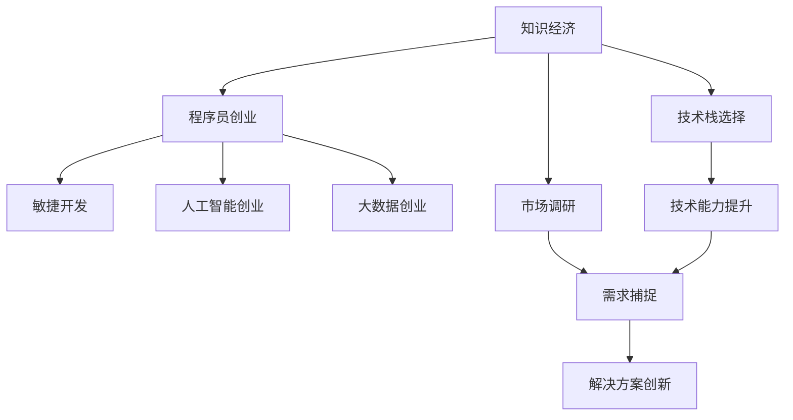

                 

# 知识经济下程序员的创业之道

## 1. 背景介绍

在知识经济时代的浪潮中，程序员群体正从传统的软件工程师身份，逐步转变为创业者、技术领导者，甚至是企业决策者。这一变化不仅体现在技术栈的选择和编程能力的提升上，更在于对市场需求的敏锐捕捉和创新创业能力的塑造。本文旨在为立志于创业的程序员提供一套系统的指南，帮助他们在知识经济的大潮中扬帆起航。

### 1.1 知识经济时代背景
21世纪以来，全球范围内的信息化、数字化进程加快，知识驱动的经济发展模式逐步成型。大数据、人工智能、物联网、云计算等新兴技术的广泛应用，使得知识要素在经济结构中的比重日益增大。对于程序员而言，这意味着技术能力的深度和广度，以及技术解决方案的创新性和实用性，将直接决定创业项目的成功率和市场竞争力。

### 1.2 程序员创业的趋势与优势
在知识经济时代，程序员创业具有显著的优势：
- **技术积淀**：程序员具备深厚的技术背景，能够快速理解并解决复杂的算法和系统问题。
- **创新思维**：程序员在工作中积累了大量的创新实践经验，思维活跃，易于产生新的技术灵感。
- **行业洞察**：程序员在日常开发中与各行业紧密接触，对行业痛点和需求有深刻理解。
- **快速迭代**：程序员熟悉敏捷开发方法，可以快速响应市场变化，迭代改进产品。

## 2. 核心概念与联系

### 2.1 核心概念概述

为了更好地理解和应对知识经济下程序员的创业需求，本文将介绍几个关键概念：

- **知识经济**：以知识为核心生产要素，依靠知识创新驱动经济增长的新型经济模式。
- **程序员创业**：利用编程和软件开发技能，创立创新型公司或组织，通过解决社会问题或提供新服务来实现商业价值的过程。
- **敏捷开发**：一种迭代、增量式的软件开发方法，强调快速响应市场变化，快速迭代产品。
- **人工智能创业**：利用人工智能技术解决行业问题，开创新商业模式的创业方向。
- **大数据创业**：利用大数据分析技术，为决策支持、市场分析、用户画像等领域提供解决方案的创业方向。

这些概念之间存在着紧密的联系，共同构成了程序员在知识经济中创业的实践框架。通过理解这些概念，程序员可以更好地把握创业的机遇与挑战。

### 2.2 核心概念原理和架构的 Mermaid 流程图


## 3. 核心算法原理 & 具体操作步骤

### 3.1 算法原理概述

在程序员创业的过程中，如何运用编程技能解决实际问题，将技术创新转化为商业价值，是创业成功的关键。这涉及到对市场需求的洞察、技术解决方案的构建以及团队协作等多个环节。本文将从技术、市场和团队三个维度，阐述如何构建成功的创业项目。

### 3.2 算法步骤详解

#### 3.2.1 技术方案构建

构建技术方案是程序员创业的核心步骤。通常包括以下几个关键步骤：
1. **需求分析**：深入了解目标用户的需求，明确产品定位和功能模块。
2. **技术选型**：基于需求和市场趋势，选择合适的技术栈和开发工具。
3. **原型设计**：绘制产品原型，快速验证技术方案的可行性。
4. **迭代优化**：通过用户反馈和市场反馈，不断迭代改进产品功能和技术架构。

#### 3.2.2 市场分析与策略制定

市场分析是创业成功的关键环节。具体步骤包括：
1. **市场调研**：分析目标市场规模、竞争格局、用户需求等关键因素。
2. **商业模式设计**：根据市场需求和技术优势，设计创新的商业模式，如SaaS、订阅制、自由职业等。
3. **市场推广**：制定有效的市场推广策略，利用社交媒体、行业展会、技术论坛等渠道进行产品宣传。

#### 3.2.3 团队建设与管理

团队的协作与管理是创业项目成功的保障。具体步骤包括：
1. **人才招聘**：根据项目需求，招聘具有相关技术和市场经验的人才。
2. **角色分配**：明确团队成员的角色和职责，确保沟通顺畅、任务清晰。
3. **文化建设**：构建积极向上的企业文化，增强团队凝聚力和创新动力。

### 3.3 算法优缺点

#### 3.3.1 优点

- **灵活性和创新性**：程序员具备高度的技术自主权，可以灵活选择技术方案和工具，创新解决复杂问题。
- **快速响应市场**：敏捷开发方法使得程序员能够快速迭代产品，及时响应市场变化。
- **用户体验优化**：程序员对用户需求有深刻理解，能够设计出更加贴合用户需求的产品。

#### 3.3.2 缺点

- **技术风险**：技术选型不当或技术迭代失败可能导致项目失败。
- **市场风险**：市场调研不足或市场需求变化可能导致产品不受欢迎。
- **管理风险**：团队协作不畅或文化建设不到位可能导致团队士气低落，创新能力受限。

### 3.4 算法应用领域

程序员创业的领域非常广泛，几乎涵盖所有与技术相关的行业，包括但不限于：

- **软件开发**：提供定制化软件开发解决方案，如SaaS平台、企业级应用等。
- **人工智能**：利用机器学习、深度学习等技术，开发智能客服、推荐系统、智能投顾等产品。
- **大数据分析**：利用大数据技术，提供数据分析、数据挖掘、数据可视化等服务。
- **区块链**：开发区块链应用，如智能合约、去中心化应用等。
- **物联网**：开发物联网解决方案，如智能家居、智慧城市、工业互联网等。

## 4. 数学模型和公式 & 详细讲解 & 举例说明

### 4.1 数学模型构建

在程序员创业的项目中，很多问题可以通过数学模型进行量化分析和优化。以人工智能创业为例，常见的数学模型包括：

- **监督学习模型**：如线性回归、逻辑回归、决策树等，用于构建预测模型，如用户行为预测、风险评估等。
- **非监督学习模型**：如K-means、PCA等，用于数据降维和聚类分析，如用户分群、市场细分等。
- **强化学习模型**：如Q-learning、DQN等，用于优化推荐系统、智能客服等交互式应用。

### 4.2 公式推导过程

以线性回归模型为例，假设有一个包含$n$个数据点的数据集$D=\{(x_i,y_i)\}_{i=1}^n$，其中$x$为特征向量，$y$为标签，目标是最小化损失函数：
$$
\min_{\theta} \sum_{i=1}^n (y_i - \theta^T x_i)^2
$$
其中$\theta$为模型参数，即线性回归方程的系数向量。

使用梯度下降法优化目标函数，可得到参数更新公式：
$$
\theta \leftarrow \theta - \eta \nabla_{\theta} L(\theta)
$$
其中$\eta$为学习率，$\nabla_{\theta} L(\theta)$为损失函数对$\theta$的梯度。

### 4.3 案例分析与讲解

以一个智能推荐系统的案例来说明模型的应用：

假设有一款电商平台，希望利用人工智能推荐系统提升用户体验和转化率。首先，收集用户的浏览记录、购买历史、评分数据等，作为模型输入。然后，建立用户行为预测模型，预测用户可能感兴趣的商品。接着，利用协同过滤、内容推荐等技术，为用户推荐个性化商品。最后，通过A/B测试等方法，验证推荐系统的效果，不断优化模型参数和推荐策略。

## 5. 项目实践：代码实例和详细解释说明

### 5.1 开发环境搭建

在进行项目实践前，需要搭建合适的开发环境。以下是使用Python和TensorFlow搭建项目环境的步骤：

1. 安装Anaconda：从官网下载并安装Anaconda，用于创建独立的Python环境。
2. 创建并激活虚拟环境：
```bash
conda create -n tf-env python=3.8 
conda activate tf-env
```
3. 安装TensorFlow：根据GPU支持情况，从官网获取对应的安装命令。例如：
```bash
pip install tensorflow==2.4
```
4. 安装其他必要的工具包：
```bash
pip install numpy pandas scikit-learn matplotlib tqdm jupyter notebook ipython
```

完成上述步骤后，即可在`tf-env`环境中开始项目开发。

### 5.2 源代码详细实现

下面以推荐系统的案例，展示如何使用TensorFlow构建推荐模型。

首先，定义数据集和特征：

```python
import tensorflow as tf
import numpy as np

# 创建数据集
X_train = np.random.rand(100, 10)
y_train = np.random.rand(100, 1)

# 定义特征和标签
features = tf.keras.layers.Input(shape=(10,))
labels = tf.keras.layers.Input(shape=(1,))

# 构建模型
model = tf.keras.Sequential([
    tf.keras.layers.Dense(64, activation='relu', input_shape=(10,)),
    tf.keras.layers.Dense(1)
])
```

接着，构建损失函数和优化器，进行模型训练：

```python
# 定义损失函数
loss = tf.keras.losses.MSE()

# 定义优化器
optimizer = tf.keras.optimizers.Adam()

# 训练模型
model.compile(optimizer=optimizer, loss=loss)
model.fit(X_train, y_train, epochs=10, batch_size=32)
```

最后，评估模型性能：

```python
# 评估模型
test_X = np.random.rand(100, 10)
test_y = np.random.rand(100, 1)
loss = model.evaluate(test_X, test_y)
print('测试集损失:', loss)
```

以上就是使用TensorFlow构建推荐系统的完整代码实现。可以看到，TensorFlow的高级API使得构建和训练模型变得简洁高效。

### 5.3 代码解读与分析

让我们再详细解读一下关键代码的实现细节：

**构建模型**：
- `tf.keras.layers.Input`：定义模型的输入层，指定输入的维度。
- `tf.keras.layers.Dense`：定义全连接层，通过`activation`参数设置激活函数。
- `model = tf.keras.Sequential`：将各层按照顺序堆叠起来，形成完整的模型。

**模型训练**：
- `model.compile`：配置模型的损失函数和优化器。
- `model.fit`：开始训练模型，设置训练轮数和批次大小。

**模型评估**：
- `model.evaluate`：评估模型在测试集上的性能，返回损失值。

可以看出，TensorFlow提供了简单易用的API，使得构建和训练深度学习模型变得非常方便。同时，TensorFlow还支持分布式训练、模型保存、可视化等高级功能，进一步提升了开发效率。

## 6. 实际应用场景

### 6.1 智能推荐系统

智能推荐系统是程序员创业的重要方向之一。通过机器学习和大数据技术，可以根据用户的历史行为和偏好，实时推荐用户可能感兴趣的商品、内容或服务，提升用户体验和转化率。

在技术实现上，可以采用协同过滤、内容推荐、混合推荐等技术，结合用户画像、商品属性、社交网络等多样化信息，构建高效的推荐模型。推荐系统的成功应用，已经在电商平台、视频网站、社交媒体等多个领域取得了显著效果。

### 6.2 智能客服系统

智能客服系统能够帮助企业快速响应客户咨询，提高客户满意度和服务效率。通过自然语言处理、机器学习和人机交互技术，智能客服系统可以实现自动解答客户问题、引导用户操作、提供个性化服务等。

在实践中，可以构建基于语义理解的问答系统、基于上下文的对话生成系统等，为用户提供自然流畅的交互体验。智能客服系统已经在金融、电商、医疗等多个领域得到了广泛应用。

### 6.3 数据可视化

数据可视化是程序员创业的另一个重要方向。通过数据可视化技术，可以将复杂的数据信息转化为直观的图表和图形，帮助用户更轻松地理解数据，做出决策。

在技术实现上，可以采用D3.js、Plotly、Matplotlib等工具库，构建交互式的数据可视化应用。数据可视化的成功应用，已经在商业智能、公共健康、环境保护等多个领域取得了显著效果。

### 6.4 未来应用展望

随着技术的发展，程序员创业的方向将更加多样化。未来，以下是一些值得关注的趋势：

- **人工智能创业**：利用人工智能技术解决行业问题，开创新商业模式。如智能客服、推荐系统、智能投顾等。
- **区块链创业**：开发区块链应用，如智能合约、去中心化应用等。
- **大数据创业**：利用大数据技术，提供数据分析、数据挖掘、数据可视化等服务。
- **物联网创业**：开发物联网解决方案，如智能家居、智慧城市、工业互联网等。
- **知识图谱创业**：构建知识图谱，实现知识推理和智能问答，如智能医疗、智能法律、智能教育等。

程序员创业需要紧跟技术前沿，不断学习新的技术，同时敏锐捕捉市场需求，创新解决方案。只有不断迭代和优化，才能在知识经济中保持竞争力和创新性。

## 7. 工具和资源推荐

### 7.1 学习资源推荐

为了帮助程序员系统掌握创业技能，这里推荐一些优质的学习资源：

1. **《程序员的创业之路》系列博文**：由知名创业家撰写，分享创业心得和实践经验，帮助程序员更好地把握创业机遇。
2. **Coursera《创业课程》**：由知名大学和创业导师开设的在线课程，涵盖创业基础、市场分析、团队管理等多个方面。
3. **Udacity《创业实战课程》**：由创业者实战经验分享的在线课程，强调项目实践和市场验证。
4. **《创业融资指南》书籍**：详细讲解创业融资的流程、技巧和案例，帮助程序员筹集启动资金。
5. **GitHub开源项目**：GitHub上有大量的开源创业项目，可以帮助程序员学习实践经验和代码实现。

通过对这些资源的学习实践，相信程序员能够更好地理解创业的各个环节，提升创业的成功率。

### 7.2 开发工具推荐

高效的开发离不开优秀的工具支持。以下是几款用于程序员创业开发的常用工具：

1. **Jupyter Notebook**：开源的交互式编程环境，支持Python、R、JavaScript等多种语言，适合快速迭代和实验。
2. **PyCharm**：开源的Python IDE，提供丰富的代码提示、调试工具和插件，适合Python开发。
3. **Visual Studio Code**：开源的轻量级代码编辑器，支持多种编程语言和扩展，适合多语言开发。
4. **Git**：版本控制系统，帮助程序员管理和协作代码，支持分支、合并、拉取等操作。
5. **Docker**：容器化技术，帮助程序员打包应用，支持跨平台部署和运行。

合理利用这些工具，可以显著提升程序员创业的开发效率，加速产品迭代和市场验证。

### 7.3 相关论文推荐

程序员创业涉及的技术和市场分析问题非常广泛，以下是几篇奠基性的相关论文，推荐阅读：

1. **《创业成功的影响因素》**：分析了创业成功的影响因素，如创业者特质、市场环境、团队结构等。
2. **《创业融资的策略与实践》**：详细讲解了创业融资的策略、渠道和技巧，帮助创业者筹集资金。
3. **《人工智能创业的挑战与机遇》**：探讨了人工智能技术在创业中的应用，分析了面临的挑战和机遇。
4. **《大数据创业的案例分析》**：分析了多个大数据创业项目的成功案例，总结了经验教训。
5. **《区块链技术在创业中的应用》**：探讨了区块链技术在创业中的应用场景，如智能合约、去中心化应用等。

这些论文代表了大规模知识经济下程序员创业的研究脉络，帮助程序员更好地把握创业方向和技术细节。

## 8. 总结：未来发展趋势与挑战

### 8.1 研究成果总结

本文系统介绍了程序员在知识经济下的创业之道，从技术、市场和团队三个维度，阐述了程序员创业的核心策略和实践方法。同时，分析了程序员创业的优势、劣势和关键成功要素，为立志于创业的程序员提供了全面的指南。

### 8.2 未来发展趋势

展望未来，程序员创业的发展趋势包括：

- **技术栈多样化**：随着新技术的不断涌现，程序员创业的技术栈将更加多样，涵盖人工智能、区块链、大数据等多个领域。
- **市场细分**：创业项目将更加聚焦细分市场，通过精准定位和创新解决方案，提升竞争力。
- **数据驱动**：数据将成为创业决策的重要依据，利用大数据分析和机器学习技术，提升决策的科学性和精准性。
- **用户中心**：用户需求和体验将成为创业成功的关键，通过用户反馈和迭代改进，提升产品价值和用户满意度。
- **全球化**：随着国际市场的开放，程序员创业将更具全球视野，寻找国际机会，拓展市场空间。

### 8.3 面临的挑战

程序员创业在知识经济中也面临诸多挑战：

- **技术风险**：技术选型不当或技术迭代失败可能导致项目失败。
- **市场风险**：市场需求变化快，创业者需要快速响应和调整策略。
- **资金压力**：创业初期资金紧张，创业者需要筹集和合理使用资金。
- **团队管理**：团队协作不畅或管理不当可能导致团队士气低落，影响项目进度。
- **法律和伦理**：创业过程中可能面临法律和伦理问题，需要谨慎处理。

### 8.4 研究展望

未来的研究需要在以下几个方面寻求新的突破：

- **技术创新**：不断探索新技术和新方法，提升创业项目的创新性。
- **市场洞察**：深入理解市场需求和用户行为，构建有效的商业模型。
- **团队协作**：建立高效的团队管理和激励机制，增强团队凝聚力和创新能力。
- **社会责任**：关注社会和环境问题，构建可持续发展的商业模式。

总之，程序员创业需要在技术、市场和团队等多个维度进行全面创新和优化，才能在知识经济中获得成功。相信通过不懈努力和不断探索，程序员创业者必将在未来大放异彩，为知识经济的发展做出重要贡献。

---

作者：禅与计算机程序设计艺术 / Zen and the Art of Computer Programming

