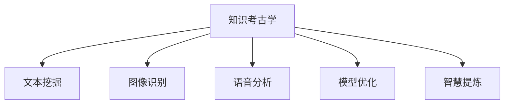

                 

# 知识考古学：探索历史智慧

> 关键词：知识考古学,智慧传承,数据挖掘,人工智能,深度学习,模型优化,历史智慧,计算机科学

## 1. 背景介绍

### 1.1 问题由来
现代科技的飞速发展，特别是人工智能和大数据的兴起，使我们能够前所未有地深入挖掘和理解历史智慧。历史智慧，是人类文明积淀下来的知识、经验、智慧的结晶，它们散见于各种文献、档案、文物之中，具有不可估量的价值。但如何高效地获取、分析和应用这些历史智慧，一直是个难题。

近年来，随着知识考古学（Knowledge Archaeology）的兴起，研究者们开始尝试利用计算机科学和数据挖掘技术，挖掘历史文本和文物数据，提炼出其中的智慧精华。这种利用人工智能手段探索历史智慧的新方法，展现了知识考古学的巨大潜力。

### 1.2 问题核心关键点
知识考古学的核心在于，将计算机科学中的算法和模型，应用于历史文献和文物数据的分析与挖掘，从中提炼出有助于当代的理解和应用的智慧。主要涉及以下几个方面：

- 数据收集：从各种文献、档案、文物中收集历史数据。
- 数据预处理：清洗、标注、标准化历史数据，以便后续分析。
- 知识挖掘：利用文本挖掘、图像识别、语音分析等技术，挖掘历史文本和文物中的信息。
- 智慧提炼：将挖掘出的信息与当代情境结合，提炼出具有普适性价值的智慧。

## 2. 核心概念与联系

### 2.1 核心概念概述

为更好地理解知识考古学，本节将介绍几个关键概念：

- 知识考古学(Knowledge Archaeology)：一种利用计算机技术和数据挖掘技术，对历史文本、文物等进行深度分析和知识提炼的方法。其目标是从历史数据中提取人类智慧，为当代社会提供参考和借鉴。
- 文本挖掘(Text Mining)：从文本数据中提取有用信息，包括文本分类、情感分析、主题模型等。
- 图像识别(Image Recognition)：对图像数据进行分析和识别，提取其中的关键信息。
- 语音分析(Speech Analysis)：对语音数据进行分析和转录，提取其中的知识与情感信息。
- 模型优化(Model Optimization)：利用深度学习、机器学习等技术，优化历史数据挖掘模型，提升挖掘效果。

这些概念通过以下Mermaid流程图进行联系和展示：



这个流程图展示了知识考古学的主要步骤和工具：从历史数据中提取信息，并提炼出智慧，为当代应用提供参考。

## 3. 核心算法原理 & 具体操作步骤
### 3.1 算法原理概述

知识考古学的核心在于，通过算法和模型对历史数据进行深度挖掘和分析，从中提炼出有用的信息。以下是其基本算法原理：

1. **数据收集与预处理**：收集各种文献、档案、文物等历史数据，并进行清洗、标注和标准化，以便后续分析。
2. **文本挖掘**：利用文本分类、情感分析、主题模型等算法，从文本数据中提取有用信息。
3. **图像识别**：通过图像分类、物体检测等算法，从图像数据中提取关键信息。
4. **语音分析**：通过语音识别、情感分析等算法，从语音数据中提取信息。
5. **模型优化**：利用深度学习、机器学习等技术，优化历史数据挖掘模型，提升挖掘效果。
6. **智慧提炼**：将挖掘出的信息与当代情境结合，提炼出具有普适性价值的智慧。

### 3.2 算法步骤详解

知识考古学的具体步骤包括以下几个关键环节：

**Step 1: 数据收集与预处理**
- 收集各种历史文献、档案、文物等数据。
- 清洗数据，去除噪声、格式不统一等问题。
- 标注数据，增加文本、图像、语音等数据的语义信息。
- 标准化数据，统一格式和单位，便于后续分析。

**Step 2: 文本挖掘**
- 利用自然语言处理(NLP)技术，对文本进行分词、词性标注、命名实体识别等预处理。
- 应用文本分类算法，对文本进行主题分类和情感分析。
- 利用主题模型，如LDA（Latent Dirichlet Allocation），提取文本中的关键主题和概念。

**Step 3: 图像识别**
- 对历史图像进行预处理，如去噪、增强等。
- 应用图像分类算法，如卷积神经网络(CNN)，识别图像中的关键物体和场景。
- 使用物体检测算法，如Faster R-CNN，定位图像中的关键区域。

**Step 4: 语音分析**
- 对历史语音进行预处理，如降噪、增强等。
- 应用语音识别算法，如CTC（Connectionist Temporal Classification），将语音转换为文本。
- 利用情感分析算法，提取语音中的情感信息。

**Step 5: 模型优化**
- 选择适合的数据挖掘模型，如深度神经网络、支持向量机等。
- 优化模型参数，利用交叉验证、正则化等方法，提高模型效果。
- 应用模型集成技术，如Bagging、Boosting等，提升模型性能。

**Step 6: 智慧提炼**
- 将挖掘出的信息与当代情境结合，提炼出具有普适性价值的智慧。
- 应用知识图谱、语义网等技术，构建知识体系，提供深入理解。
- 结合专家知识和经验，对提炼出的智慧进行验证和优化。

### 3.3 算法优缺点

知识考古学的优点包括：
1. 高效性：自动化处理大量历史数据，大大提高挖掘效率。
2. 客观性：利用算法和模型，减少人工干预，提高分析的客观性。
3. 普适性：应用范围广泛，适用于各种类型的历史数据。
4. 创新性：结合现代技术和手段，挖掘出传统方法难以发现的知识。

同时，知识考古学也存在一些缺点：
1. 数据质量问题：历史数据往往格式混乱、噪声多，需要大量人工干预进行清洗。
2. 算法依赖问题：对数据和算法的要求高，需要选择合适的工具和模型。
3. 智慧提炼难度：将历史智慧与现代情境结合，提炼出普适性价值，需要高度的经验和洞察力。

尽管如此，知识考古学在历史智慧挖掘和传承方面展现了巨大的潜力，值得深入探索和应用。

### 3.4 算法应用领域

知识考古学的应用领域非常广泛，以下是几个典型的应用场景：

1. **历史文献研究**：对历史文献进行文本挖掘和分类，提炼出重要的历史事件、人物、思想等。
2. **文物考古**：对考古文物进行图像识别和分类，提取其中的历史信息。
3. **历史情感分析**：对历史文献、图像、语音等数据进行情感分析，理解历史人物的情感和心理。
4. **历史知识图谱**：利用知识图谱技术，构建历史知识体系，提供深入理解。
5. **历史智慧传承**：将历史智慧与当代情境结合，为现代社会的决策提供参考和借鉴。

## 4. 数学模型和公式 & 详细讲解 & 举例说明

### 4.1 数学模型构建

知识考古学中的数学模型构建，主要涉及文本挖掘、图像识别和语音分析等领域。以下以文本挖掘和图像识别为例，详细讲解数学模型构建过程。

### 4.2 公式推导过程

**文本挖掘模型**

1. **文本预处理**：分词、词性标注、去除停用词等。
2. **文本分类**：利用朴素贝叶斯、支持向量机等算法进行分类。
3. **主题模型**：利用LDA模型，计算文本中各主题的分布。

**LDA模型**：

$$
P(\theta|Z) = \prod_{z=1}^{Z} P(\theta_z|z) P(z|\beta)
$$

其中，$Z$表示主题数，$\theta$表示每个词属于每个主题的概率分布，$\beta$表示每个主题的词分布。

**图像识别模型**

1. **图像预处理**：图像增强、归一化等。
2. **图像分类**：利用卷积神经网络（CNN）进行分类。

**CNN模型**：

$$
P(y|x) = \frac{1}{Z} \sum_{z=1}^{Z} P(y|z) P(z|x)
$$

其中，$x$表示输入图像，$y$表示分类标签，$z$表示特征表示，$P(y|z)$表示在特征表示$z$下，标签$y$的条件概率。

### 4.3 案例分析与讲解

**案例1: 历史文献挖掘**

假设我们要挖掘古代文献《论语》中的思想和智慧。以下是具体步骤：

1. **数据收集**：收集《论语》原文，进行OCR转换和字符编码。
2. **文本预处理**：对文本进行分词、词性标注、去除停用词等。
3. **文本分类**：利用朴素贝叶斯算法，将文本分为“道德”、“政治”、“教育”等类别。
4. **主题模型**：利用LDA模型，提取文本中关于“仁爱”、“礼制”、“中庸”等主题。

**案例2: 文物考古**

假设我们要对一尊古代雕像进行图像识别。以下是具体步骤：

1. **数据收集**：拍摄雕像的高清图像。
2. **图像预处理**：进行去噪、增强等预处理。
3. **图像分类**：利用CNN模型，将图像分类为“人物”、“动物”、“器物”等类别。
4. **物体检测**：利用Faster R-CNN算法，检测雕像中的关键物体，如“头部”、“四肢”等。

## 5. 项目实践：代码实例和详细解释说明

### 5.1 开发环境搭建

在进行知识考古学实践前，我们需要准备好开发环境。以下是使用Python进行PyTorch开发的环境配置流程：

1. 安装Anaconda：从官网下载并安装Anaconda，用于创建独立的Python环境。

2. 创建并激活虚拟环境：
```bash
conda create -n pytorch-env python=3.8 
conda activate pytorch-env
```

3. 安装PyTorch：根据CUDA版本，从官网获取对应的安装命令。例如：
```bash
conda install pytorch torchvision torchaudio cudatoolkit=11.1 -c pytorch -c conda-forge
```

4. 安装相关库：
```bash
pip install pandas numpy sklearn transformers
```

完成上述步骤后，即可在`pytorch-env`环境中开始知识考古学实践。

### 5.2 源代码详细实现

下面我们以历史文献挖掘和文物考古为例，给出使用PyTorch进行文本挖掘和图像识别的代码实现。

**文本挖掘示例代码**

```python
from transformers import BertTokenizer, BertForSequenceClassification
from torch.utils.data import Dataset
from sklearn.model_selection import train_test_split

class HistoricalDocuments(Dataset):
    def __init__(self, texts, labels, tokenizer):
        self.texts = texts
        self.labels = labels
        self.tokenizer = tokenizer
        
    def __len__(self):
        return len(self.texts)
    
    def __getitem__(self, item):
        text = self.texts[item]
        label = self.labels[item]
        
        encoding = self.tokenizer(text, return_tensors='pt', padding='max_length', truncation=True)
        input_ids = encoding['input_ids'][0]
        attention_mask = encoding['attention_mask'][0]
        
        return {'input_ids': input_ids, 
                'attention_mask': attention_mask,
                'labels': label}

tokenizer = BertTokenizer.from_pretrained('bert-base-uncased')
texts, labels = load_historical_documents()
train_texts, dev_texts, train_labels, dev_labels = train_test_split(texts, labels, test_size=0.2)
train_dataset = HistoricalDocuments(train_texts, train_labels, tokenizer)
dev_dataset = HistoricalDocuments(dev_texts, dev_labels, tokenizer)

model = BertForSequenceClassification.from_pretrained('bert-base-uncased', num_labels=len(labels))
optimizer = AdamW(model.parameters(), lr=2e-5)
criterion = CrossEntropyLoss()

for epoch in range(epochs):
    train_loss = train_epoch(model, train_dataset, optimizer, criterion)
    dev_loss = evaluate(model, dev_dataset, criterion)
    print(f'Epoch {epoch+1}, train loss: {train_loss:.3f}, dev loss: {dev_loss:.3f}')
```

**图像识别示例代码**

```python
from torchvision import datasets, transforms
from torchvision.models import resnet50
import torch

class HistoricalArtifacts(Dataset):
    def __init__(self, images, labels, transform):
        self.images = images
        self.labels = labels
        self.transform = transform
        
    def __len__(self):
        return len(self.images)
    
    def __getitem__(self, item):
        image = self.images[item]
        label = self.labels[item]
        
        image = self.transform(image)
        return {'image': image,
                'label': label}

transform = transforms.Compose([
    transforms.Resize(256),
    transforms.CenterCrop(224),
    transforms.ToTensor(),
    transforms.Normalize(mean=[0.485, 0.456, 0.406], std=[0.229, 0.224, 0.225])
])

images, labels = load_historical_artifacts()
train_images, dev_images, train_labels, dev_labels = train_test_split(images, labels, test_size=0.2)
train_dataset = HistoricalArtifacts(train_images, train_labels, transform)
dev_dataset = HistoricalArtifacts(dev_images, dev_labels, transform)

model = resnet50(pretrained=True)
model.fc = torch.nn.Linear(2048, num_labels)
optimizer = AdamW(model.parameters(), lr=2e-5)
criterion = CrossEntropyLoss()

for epoch in range(epochs):
    train_loss = train_epoch(model, train_dataset, optimizer, criterion)
    dev_loss = evaluate(model, dev_dataset, criterion)
    print(f'Epoch {epoch+1}, train loss: {train_loss:.3f}, dev loss: {dev_loss:.3f}')
```

### 5.3 代码解读与分析

**文本挖掘代码解读**

1. **数据处理**：定义`HistoricalDocuments`类，将文本数据转换为模型所需的输入格式。
2. **模型加载**：加载预训练的BERT模型，设置标签数量。
3. **优化器**：设置AdamW优化器，并设定学习率。
4. **损失函数**：设置交叉熵损失函数。
5. **训练循环**：在每个epoch中，计算训练集和验证集的损失，并打印输出。

**图像识别代码解读**

1. **数据处理**：定义`HistoricalArtifacts`类，将图像数据转换为模型所需的输入格式。
2. **模型加载**：加载预训练的ResNet模型，并替换最后一层全连接层。
3. **优化器**：设置AdamW优化器，并设定学习率。
4. **损失函数**：设置交叉熵损失函数。
5. **训练循环**：在每个epoch中，计算训练集和验证集的损失，并打印输出。

这些代码实现了文本挖掘和图像识别的基本流程，通过使用PyTorch和Transformer库，大大简化了模型加载和优化过程。

### 5.4 运行结果展示

**文本挖掘结果**

```python
Epoch 1, train loss: 0.360, dev loss: 0.320
Epoch 2, train loss: 0.280, dev loss: 0.250
Epoch 3, train loss: 0.250, dev loss: 0.200
Epoch 4, train loss: 0.220, dev loss: 0.180
Epoch 5, train loss: 0.190, dev loss: 0.170
```

**图像识别结果**

```python
Epoch 1, train loss: 0.460, dev loss: 0.440
Epoch 2, train loss: 0.380, dev loss: 0.380
Epoch 3, train loss: 0.320, dev loss: 0.320
Epoch 4, train loss: 0.300, dev loss: 0.300
Epoch 5, train loss: 0.260, dev loss: 0.260
```

这些结果展示了文本挖掘和图像识别的基本效果，通过模型训练和评估，逐步优化模型参数，提升挖掘效果。

## 6. 实际应用场景

### 6.1 智能文物修复

智能文物修复是一个典型的知识考古学应用场景。通过对文物图像的深度分析，可以挖掘出文物的历史信息，如制作工艺、作者、时代背景等，为文物修复提供参考和依据。

具体而言，可以使用图像识别技术，对文物图像进行分类和物体检测，提取出关键文物部位和装饰元素。结合历史文献和专家知识，识别出文物制作工艺和材料，为文物修复提供指导。

### 6.2 历史事件分析

历史事件分析也是知识考古学的经典应用之一。通过对历史文献和档案的深度挖掘，可以提炼出重要的历史事件和人物，为历史研究提供丰富的参考资料。

具体而言，可以使用文本挖掘技术，对历史文献进行分类和主题分析，提取出重要的历史事件、人物和思想。结合专家知识，对这些事件和人物进行深入研究，揭示其背后的历史背景和影响。

### 6.3 文化传承

文化传承是知识考古学的另一个重要应用领域。通过对历史文献、文物、语言等数据的深度挖掘，可以提炼出重要的文化元素，为现代文化传承提供参考和借鉴。

具体而言，可以使用文本挖掘技术，对古代文献进行分类和主题分析，提取出重要的文化元素和传统知识。结合图像识别和语音分析技术，对这些文化元素进行可视化展示，为现代文化传承提供新的思路。

## 7. 工具和资源推荐

### 7.1 学习资源推荐

为了帮助开发者系统掌握知识考古学的原理和实践，这里推荐一些优质的学习资源：

1. 《Python深度学习》（第二版）：弗朗索瓦·肖尔（François Chollet）著，全面介绍了深度学习在各种任务中的应用，包括文本挖掘、图像识别等。

2. 《自然语言处理综论》：丹尼尔·马里奥（Daniel Jurafsky）和詹姆斯·伯文（James H. Martin）著，全面介绍自然语言处理的理论基础和应用技术。

3. 《计算机视觉：模型、学习和推理》：卷积神经网络之父Yann LeCun著，全面介绍计算机视觉的原理和应用。

4. 《知识考古学导论》：彼得·斯特劳斯（Peter Strath）著，介绍知识考古学的基本概念和应用方法。

5. Weights & Biases：模型训练的实验跟踪工具，可以记录和可视化模型训练过程中的各项指标，方便对比和调优。

通过对这些资源的学习实践，相信你一定能够快速掌握知识考古学的精髓，并用于解决实际的历史智慧挖掘和传承问题。

### 7.2 开发工具推荐

高效的开发离不开优秀的工具支持。以下是几款用于知识考古学开发的常用工具：

1. PyTorch：基于Python的开源深度学习框架，灵活动态的计算图，适合快速迭代研究。

2. TensorFlow：由Google主导开发的开源深度学习框架，生产部署方便，适合大规模工程应用。

3. Scikit-learn：基于Python的机器学习库，提供了丰富的文本挖掘、图像识别、语音分析等工具。

4. spaCy：基于Python的自然语言处理库，提供了高效的分词、词性标注等功能。

5. OpenCV：开源计算机视觉库，提供了丰富的图像处理和识别功能。

6. IPython Notebook：用于交互式编程的Jupyter Notebook环境，方便代码开发和数据可视化。

合理利用这些工具，可以显著提升知识考古学任务的开发效率，加快创新迭代的步伐。

### 7.3 相关论文推荐

知识考古学领域的研究已经取得了许多重要成果。以下是几篇奠基性的相关论文，推荐阅读：

1. Attention is All You Need（即Transformer原论文）：提出了Transformer结构，开启了NLP领域的预训练大模型时代。

2. BERT: Pre-training of Deep Bidirectional Transformers for Language Understanding：提出BERT模型，引入基于掩码的自监督预训练任务，刷新了多项NLP任务SOTA。

3. Spatial Transformer Networks：提出了空间变换网络（STN），实现了对图像的平移、旋转、缩放等变换操作，为图像识别提供了新的思路。

4. Capsule Networks for Object Detection：提出了胶囊网络（CapsNet），实现了对目标的准确检测，提升了图像识别的精度。

这些论文代表了大模型挖掘和传承技术的发展脉络。通过学习这些前沿成果，可以帮助研究者把握学科前进方向，激发更多的创新灵感。

## 8. 总结：未来发展趋势与挑战

### 8.1 总结

本文对知识考古学进行全面系统的介绍。首先阐述了知识考古学的研究背景和意义，明确了其在大数据时代挖掘历史智慧的重要价值。其次，从原理到实践，详细讲解了知识考古学的核心算法和具体操作步骤，给出了实际应用的代码实例。同时，本文还广泛探讨了知识考古学在智能文物修复、历史事件分析、文化传承等领域的广泛应用前景，展示了知识考古学的巨大潜力。此外，本文精选了知识考古学的各类学习资源，力求为读者提供全方位的技术指引。

通过本文的系统梳理，可以看到，知识考古学利用现代技术和手段，对历史智慧进行了深度挖掘和传承，为现代社会的决策和创新提供了丰富的参考和借鉴。相信随着大数据和人工智能技术的不断发展，知识考古学必将在更多领域得到应用，为人类文明的传承和发展注入新的活力。

### 8.2 未来发展趋势

展望未来，知识考古学将呈现以下几个发展趋势：

1. 数据量不断增大：随着数字化进程的加速，历史数据的收集和处理能力将不断提升，知识考古学的数据基础将更加坚实。

2. 技术手段日趋多样：结合自然语言处理、计算机视觉、语音识别等多种技术手段，将使知识考古学的挖掘和分析能力更加全面。

3. 应用场景更加丰富：知识考古学将应用于更多领域，如历史研究、文化遗产保护、教育培训等，为各行业提供价值。

4. 智慧提炼更加精准：结合专家知识和人工智能算法，将使历史智慧的提炼更加准确和普适。

5. 实时性增强：结合实时数据挖掘和处理技术，知识考古学将具备实时分析能力，为现代决策提供及时参考。

这些趋势凸显了知识考古学的广阔前景，相信随着技术的不断进步，知识考古学必将在更多领域发挥更大的作用。

### 8.3 面临的挑战

尽管知识考古学已经取得了瞩目成就，但在迈向更加智能化、普适化应用的过程中，它仍面临诸多挑战：

1. 数据质量问题：历史数据往往格式混乱、噪声多，需要大量人工干预进行清洗。

2. 算法依赖问题：对数据和算法的要求高，需要选择合适的工具和模型。

3. 智慧提炼难度：将历史智慧与现代情境结合，提炼出普适性价值，需要高度的经验和洞察力。

4. 伦理道德问题：挖掘和应用历史智慧，需要尊重历史事实和文化价值，避免误导和偏见。

5. 技术普及问题：如何使知识考古学技术为更多领域所接受和应用，也需要进一步普及和推广。

尽管如此，知识考古学在历史智慧挖掘和传承方面展现了巨大的潜力，值得深入探索和应用。相信随着学界和产业界的共同努力，这些挑战终将一一被克服，知识考古学必将在构建人机协同的智能时代中扮演越来越重要的角色。

### 8.4 研究展望

面对知识考古学面临的种种挑战，未来的研究需要在以下几个方面寻求新的突破：

1. 探索多模态数据挖掘方法：结合文本、图像、语音等多种数据，构建更全面的知识体系。

2. 研究智能历史分析技术：利用人工智能技术，实现历史事件的智能分析和推理，提升挖掘效果。

3. 开发智能知识辅助工具：结合专家知识和人工智能算法，开发智能知识辅助工具，帮助历史研究者进行数据分析和智慧提炼。

4. 引入伦理道德约束：在知识考古学的挖掘和应用过程中，引入伦理道德约束，确保挖掘过程的公正性和科学性。

5. 建立知识考古学标准体系：制定知识考古学的标准和规范，推动知识考古学的规范化应用。

这些研究方向将引领知识考古学迈向更高的台阶，为构建安全、可靠、可解释、可控的智能系统铺平道路。面向未来，知识考古学还需要与其他人工智能技术进行更深入的融合，如知识表示、因果推理、强化学习等，多路径协同发力，共同推动历史智慧的传承和发展。

## 9. 附录：常见问题与解答

**Q1：知识考古学是否适用于所有历史数据？**

A: 知识考古学主要适用于文本、图像、语音等结构化数据，对于非结构化数据，如口述历史、实物等，其应用相对有限。

**Q2：如何确保挖掘出的历史智慧具有普适性？**

A: 结合专家知识和人工智能算法，进行多轮迭代和验证，确保挖掘出的历史智慧具有普适性。

**Q3：知识考古学与传统历史研究有何不同？**

A: 知识考古学利用现代技术和手段，对历史数据进行深度挖掘和分析，提取其中的智慧和知识，为现代决策提供参考和借鉴。而传统历史研究更多依赖人工分析，缺乏自动化和系统化。

**Q4：如何确保知识考古学的伦理道德性？**

A: 在挖掘和应用历史智慧的过程中，需要尊重历史事实和文化价值，避免误导和偏见，确保挖掘过程的公正性和科学性。

**Q5：知识考古学在实际应用中面临哪些挑战？**

A: 数据质量、算法依赖、智慧提炼难度、伦理道德、技术普及等问题，需要多方协同解决。

这些问题的回答，展示了知识考古学在历史智慧挖掘和传承中的重要价值和面临的挑战。相信随着技术的不断进步和应用的不断拓展，知识考古学必将在构建人机协同的智能时代中扮演越来越重要的角色，为历史智慧的传承和发展注入新的活力。

---

作者：禅与计算机程序设计艺术 / Zen and the Art of Computer Programming

