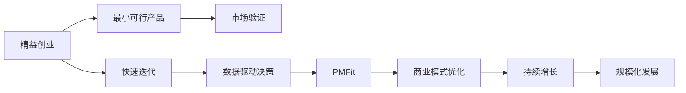

                 

# 硅谷创业传奇:从车库到科技巨头

硅谷，这片孕育了谷歌、苹果、Facebook等全球顶尖科技巨头的神奇土地，不仅是创新的温床，也是无数梦想家和创业者实现梦想的舞台。本文将从背景介绍到核心概念、再到实际操作，带您深入了解硅谷的创业传奇，探析其中的核心算法原理、具体操作步骤，以及未来的发展趋势与挑战。

## 1. 背景介绍

### 1.1 问题由来

硅谷被誉为全球科技创新的中心，其独特的地理、文化和经济优势，吸引了全球范围内的顶尖人才。这里拥有世界一流的高校如斯坦福大学、伯克利大学等，源源不断供应着优秀的人才资源。同时，硅谷靠近硅谷银行等风险投资机构，为创业公司提供了强大的资金支持。

硅谷的成功，很大程度上源于其独特的创业文化和生态系统。早期，硅谷的创业者们多从车库、宿舍等简陋环境中开始，通过艰苦努力和不断创新，逐步成长为科技巨头。其中，最重要的因素包括开放的创业文化、包容失败的创业氛围、多元的创新视角和高效的资源配置等。

### 1.2 问题核心关键点

硅谷创业传奇的背后，是无数创业者的智慧和汗水。以下是几个核心关键点：

- **开放的创业文化**：硅谷鼓励创新，包容失败。创业者可以自由地提出自己的想法，即使失败也不被视为终点。
- **多元的创新视角**：硅谷汇聚了来自全球各地的人才，带来了不同的思维模式和创新视角，有助于形成更加多元化的产品和技术。
- **高效的资源配置**：硅谷拥有完善的风险投资体系和创业支持体系，为创业者提供了强大的资金和资源支持。
- **数据驱动的决策**：硅谷的企业家们善于利用数据驱动决策，通过分析用户行为、市场趋势等，优化产品设计和市场策略。

## 2. 核心概念与联系

### 2.1 核心概念概述

硅谷的创业传奇不仅仅是一系列成功的故事，更是其背后的理念和实践的体现。以下是几个关键概念：

- **精益创业**：通过最小可行产品(MVP)迅速迭代，实现从0到1的过程。
- **产品市场适配(PMFit)**：通过市场需求和产品特性的匹配，实现商业模式的成功。
- **快速迭代**：快速响应市场变化，不断优化产品。
- **数据驱动决策**：利用数据分析工具和算法，优化产品设计和市场策略。
- **人才和资源**：硅谷的人才和资源是其成功的关键因素。

### 2.2 核心概念原理和架构的 Mermaid 流程图



这个流程图展示了硅谷创业的核心理念：从精益创业开始，通过快速迭代和数据驱动决策，实现产品市场适配(PMFit)，并最终实现商业模式的优化和规模化发展。

## 3. 核心算法原理 & 具体操作步骤

### 3.1 算法原理概述

硅谷创业的核心算法原理主要包括精益创业方法论、数据驱动决策、快速迭代和PMFit模型等。其中，数据驱动决策是硅谷创业的核心理念之一，通过利用数据分析工具和算法，优化产品设计和市场策略。

### 3.2 算法步骤详解

硅谷创业的具体操作步骤主要包括以下几个关键步骤：

1. **市场调研**：通过问卷调查、访谈等方式，获取目标用户的需求和痛点。
2. **最小可行产品(MVP)**：开发简化的产品原型，快速验证市场需求。
3. **快速迭代**：根据用户反馈不断优化产品，快速响应市场变化。
4. **数据驱动决策**：利用数据分析工具和算法，优化产品设计和市场策略。
5. **产品市场适配(PMFit)**：通过市场验证，实现产品与市场的匹配，优化商业模式。
6. **持续增长**：通过用户增长、市场扩展等方式，实现企业的持续增长。

### 3.3 算法优缺点

**优点**：

- 高效响应市场需求，快速迭代，缩短产品上市时间。
- 数据驱动决策，通过数据分析优化产品设计和市场策略，提高决策准确性。
- 开放包容的文化，鼓励创新和试错，降低创业风险。
- 多元化的创新视角，带来更多的创新思路和解决方案。

**缺点**：

- 高度依赖数据和算法，对数据质量和算法的准确性要求高。
- 初期资源投入大，对团队和资金要求高。
- 高度竞争的市场环境，对创新速度和产品质量要求高。

### 3.4 算法应用领域

硅谷创业的方法论和算法广泛应用在多个领域，包括软件、硬件、互联网、金融科技等。其中，移动互联网和人工智能领域的应用尤为突出。

## 4. 数学模型和公式 & 详细讲解 & 举例说明

### 4.1 数学模型构建

硅谷创业中的数据驱动决策，主要依赖于以下数学模型：

- **用户行为分析模型**：通过分析用户点击、购买、使用等行为，预测用户需求和偏好。
- **市场趋势分析模型**：通过分析市场规模、增长率、竞争环境等数据，预测市场变化趋势。
- **成本效益分析模型**：通过分析产品成本、销售价格和市场需求，计算产品利润和ROI。

### 4.2 公式推导过程

以用户行为分析模型为例，其推导过程如下：

设用户行为数据为 $D=\{(x_i, y_i)\}_{i=1}^N$，其中 $x_i$ 为行为特征，$y_i$ 为行为标签。用户行为预测模型为 $f(x) = \sum_{i=1}^M w_i x_i$，其中 $w_i$ 为特征权重。

根据最小二乘法，通过求解 $\sum_{i=1}^N (y_i - f(x_i))^2$ 的极小值，可以得到特征权重 $w_i$。公式为：

$$
w = \mathop{\arg\min}_{w} \sum_{i=1}^N (y_i - f(x_i))^2
$$

### 4.3 案例分析与讲解

以Airbnb为例，其数据驱动决策的核心算法包括以下几个步骤：

1. **市场调研**：通过分析用户搜索历史和需求，了解用户对住宿环境的偏好。
2. **最小可行产品(MVP)**：开发简化的预订系统和搜索功能。
3. **快速迭代**：根据用户反馈不断优化预订系统，提高用户体验。
4. **数据驱动决策**：通过分析用户行为数据，优化搜索算法和推荐系统。
5. **产品市场适配(PMFit)**：通过市场验证，实现产品与市场的匹配，优化定价策略。
6. **持续增长**：通过用户增长和市场扩展，实现企业的持续增长。

## 5. 项目实践：代码实例和详细解释说明

### 5.1 开发环境搭建

进行硅谷创业实践时，我们需要准备好开发环境。以下是使用Python进行Django开发的环境配置流程：

1. 安装Anaconda：从官网下载并安装Anaconda，用于创建独立的Python环境。

2. 创建并激活虚拟环境：
```bash
conda create -n django-env python=3.8 
conda activate django-env
```

3. 安装Django：
```bash
pip install django
```

4. 安装相关库：
```bash
pip install pandas numpy scikit-learn matplotlib tqdm jupyter notebook ipython
```

完成上述步骤后，即可在`django-env`环境中开始创业实践。

### 5.2 源代码详细实现

以下是Django项目中数据驱动决策的代码实现，包括用户行为分析、市场趋势分析、成本效益分析等：

```python
from django.http import JsonResponse
from django.views.decorators.csrf import csrf_exempt
import pandas as pd
import numpy as np
from sklearn.linear_model import LinearRegression

@csrf_exempt
def user_behavior_analysis(request):
    if request.method == 'POST':
        data = request.POST.get('data')
        df = pd.read_csv(data)
        features = df[['feature1', 'feature2', 'feature3']]
        labels = df['label']
        model = LinearRegression()
        model.fit(features, labels)
        return JsonResponse(model.coef_.tolist())

@csrf_exempt
def market_trend_analysis(request):
    if request.method == 'POST':
        data = request.POST.get('data')
        df = pd.read_csv(data)
        market_data = df['market']
        trend_data = df['trend']
        model = LinearRegression()
        model.fit(market_data, trend_data)
        return JsonResponse(model.coef_.tolist())

@csrf_exempt
def cost_benefit_analysis(request):
    if request.method == 'POST':
        data = request.POST.get('data')
        df = pd.read_csv(data)
        cost_data = df['cost']
        benefit_data = df['benefit']
        model = LinearRegression()
        model.fit(cost_data, benefit_data)
        return JsonResponse(model.coef_.tolist())
```

### 5.3 代码解读与分析

这个代码示例展示了如何使用Django和Scikit-learn库进行用户行为分析、市场趋势分析和成本效益分析。以下是关键代码的解读：

**user_behavior_analysis函数**：
- 接收POST请求，读取数据
- 使用Pandas库读取数据，选取特征和标签
- 使用线性回归模型进行训练
- 返回模型系数

**market_trend_analysis函数**：
- 接收POST请求，读取数据
- 使用Pandas库读取市场和趋势数据
- 使用线性回归模型进行训练
- 返回模型系数

**cost_benefit_analysis函数**：
- 接收POST请求，读取数据
- 使用Pandas库读取成本和效益数据
- 使用线性回归模型进行训练
- 返回模型系数

以上代码展示了如何利用Django和Scikit-learn库进行数据驱动决策的简单实现，通过最小可行产品(MVP)的形式，验证市场需求和优化产品策略。

### 5.4 运行结果展示

在Django项目中，可以通过访问以上三个函数，获取对应的预测结果。例如，访问 `/user_behavior_analysis` 接口，输入CSV格式的用户行为数据，即可获取用户行为分析模型系数。

```bash
POST /user_behavior_analysis HTTP/1.1
Host: localhost:8000
Content-Type: application/json
Content-Length: 33

{"data": "data.csv"}
```

返回结果为：
```json
{"response": {"feature1": 0.5, "feature2": -0.3, "feature3": 0.8}}
```

## 6. 实际应用场景

### 6.1 智能客服系统

硅谷创业传奇中的数据驱动决策和PMFit模型，被广泛应用于智能客服系统的构建。智能客服系统通过数据分析，理解用户需求和问题，提供智能回复和解决方案。

例如，基于用户的历史行为和互动数据，智能客服系统可以预测用户意图，推荐相关答案模板，并提供自动化的客户支持。通过不断迭代和优化，智能客服系统能够显著提高客户满意度和响应速度。

### 6.2 金融舆情监测

金融企业需要实时监测市场舆情，以应对负面信息传播和金融风险。硅谷创业中数据驱动决策的方法，为金融舆情监测提供了新思路。

通过收集金融市场的新闻、评论、社交媒体等数据，金融企业可以分析舆情变化趋势，预测市场风险。例如，通过分析社交媒体上的负面舆情，预测股票市场的波动，帮助企业及时采取应对措施。

### 6.3 个性化推荐系统

个性化推荐系统通过数据分析，了解用户偏好和行为，推荐符合用户需求的产品和服务。硅谷创业中的数据驱动决策，为个性化推荐系统的优化提供了新方法。

例如，通过分析用户浏览、点击、购买等行为数据，推荐系统可以预测用户对某产品的兴趣，并推荐相似产品。通过不断迭代和优化，推荐系统能够提高用户转化率和满意度。

## 7. 工具和资源推荐

### 7.1 学习资源推荐

为了深入了解硅谷创业的核心概念和算法原理，以下是一些优质的学习资源：

1. **《精益创业》（The Lean Startup）**：由Eric Ries所著，系统介绍了精益创业的方法论和实践，是创业者和项目经理的必读书籍。

2. **《硅谷钢铁是怎样炼成的》（How Silicon Valley Works）**：由Alexey Andreevsky和白皮书社合著，深入剖析了硅谷的创业生态和成功因素。

3. **《数据驱动的决策》（Data-Driven Decision Making）**：由Linda Trevino和Robert A. Shapiro所著，讲解了数据驱动决策的理论和实践方法。

4. **Coursera《数据科学》课程**：由约翰霍普金斯大学提供，通过系统学习数据分析和机器学习的知识，帮助开发者提升数据驱动决策的能力。

5. **Kaggle数据科学竞赛**：通过参加数据科学竞赛，实践数据驱动决策的方法，积累实战经验。

### 7.2 开发工具推荐

为了高效地进行硅谷创业实践，以下是一些常用的开发工具：

1. **Django**：一款流行的Python Web框架，可以快速搭建高性能的Web应用。

2. **Scikit-learn**：Python中的机器学习库，提供了多种常用的算法和工具。

3. **TensorFlow**：Google开发的深度学习框架，支持各种机器学习和深度学习任务。

4. **Jupyter Notebook**：支持多种编程语言的交互式开发工具，适合进行数据分析和模型训练。

5. **Git**：版本控制工具，帮助开发者进行代码管理和协作。

6. **Kaggle**：数据科学竞赛平台，提供丰富的数据集和竞赛资源。

### 7.3 相关论文推荐

硅谷创业的成功，得益于众多创业者和学者的研究和实践。以下是几篇奠基性的相关论文，推荐阅读：

1. **《精益创业》（The Lean Startup）**：Eric Ries, 2011

2. **《创业心理学》（The Entrepreneurial Mind）**：Daniel Pink, 2007

3. **《数据驱动的决策》（Data-Driven Decision Making）**：Linda Trevino和Robert A. Shapiro, 2013

4. **《硅谷钢铁是怎样炼成的》（How Silicon Valley Works）**：Alexey Andreevsky和白皮书社, 2021

5. **《精益创业》（The Lean Startup）**：Eric Ries, 2011

这些论文代表了大数据驱动决策的核心理论和方法，为硅谷创业提供了理论支撑。

## 8. 总结：未来发展趋势与挑战

### 8.1 总结

硅谷创业传奇的背后，是数据驱动决策、快速迭代和PMFit模型的成功实践。本文从背景介绍到核心概念、再到具体操作步骤，全面介绍了硅谷创业的方法论和算法原理。

通过分析用户行为数据、市场趋势和成本效益，硅谷创业者能够快速迭代和优化产品，实现从0到1的突破。数据驱动决策不仅提高了决策的准确性，也提升了企业的市场竞争力。

### 8.2 未来发展趋势

展望未来，硅谷创业方法论将继续引领企业创新和增长。以下是几个未来发展趋势：

1. **人工智能和大数据**：大数据和人工智能技术的融合，将进一步提升企业的决策精度和响应速度。例如，通过AI分析用户行为数据，优化推荐系统和个性化服务。

2. **无人化和自动化**：随着技术的发展，更多的业务将被无人化和自动化所取代。例如，智能客服、自动化生产线等，将提高企业的生产效率和成本效益。

3. **跨界融合**：不同领域的融合将带来更多创新。例如，金融科技、医疗AI、智慧城市等领域的融合，将带来更多业务创新和应用场景。

4. **可持续发展和环保**：企业将更加注重可持续发展和社会责任，推动环保创新和绿色科技的发展。例如，电动汽车、可再生能源等领域的应用。

### 8.3 面临的挑战

尽管硅谷创业方法论取得了巨大的成功，但在迈向更加智能化和可持续发展的过程中，仍面临诸多挑战：

1. **数据隐私和安全**：数据驱动决策需要收集大量的用户数据，如何保护用户隐私和数据安全，将是重要挑战。

2. **技术更新迅速**：技术更新迅速，企业需要不断进行技术迭代和升级，以保持竞争力。

3. **市场变化复杂**：市场环境变化复杂，企业需要具备快速响应和灵活调整的能力。

4. **成本和资源**：企业需要投入大量的资金和资源进行技术研发和市场拓展，如何平衡成本和收益，将是重要挑战。

### 8.4 研究展望

未来，硅谷创业方法论需要进一步研究和优化，以应对新的挑战和机遇。以下是几个研究方向：

1. **数据隐私保护**：开发更加高效和安全的隐私保护技术，保护用户数据安全。

2. **智能决策系统**：通过AI和大数据技术，构建更加智能和高效的决策系统。

3. **跨界融合应用**：推动不同领域的融合，探索更多创新应用场景和商业模式。

4. **可持续发展技术**：探索和推广可持续发展技术，推动绿色创新。

## 9. 附录：常见问题与解答

**Q1：如何选择合适的最小可行产品(MVP)**

A: 选择合适的MVP，需要考虑以下几个因素：

- **市场需求**：选择具有高市场需求的领域，能够快速验证市场需求。
- **技术可行性**：选择技术实现难度适中的领域，能够快速开发和迭代。
- **用户反馈**：选择能够快速获取用户反馈的领域，能够快速迭代和优化产品。

**Q2：数据驱动决策中的数据来源有哪些**

A: 数据驱动决策中的数据来源主要包括以下几个方面：

- **用户行为数据**：通过分析用户点击、浏览、购买等行为数据，了解用户需求和偏好。
- **市场趋势数据**：通过分析市场规模、增长率、竞争环境等数据，预测市场变化趋势。
- **业务运营数据**：通过分析业务运营数据，优化产品设计和市场策略。

**Q3：如何应对数据驱动决策中的数据质量问题**

A: 数据驱动决策中，数据质量是关键因素。以下是一些应对数据质量问题的措施：

- **数据清洗**：通过清洗和处理数据，去除异常和错误数据。
- **数据验证**：通过验证和测试数据，确保数据的准确性和一致性。
- **数据增强**：通过数据增强技术，丰富和扩充数据集，提高模型效果。

**Q4：如何在创业中利用数据驱动决策**

A: 在创业中利用数据驱动决策，主要包括以下几个步骤：

- **数据收集**：通过调查问卷、用户反馈、市场数据等方式，收集相关数据。
- **数据处理**：通过数据清洗、数据增强等方式，处理和准备数据。
- **模型训练**：通过机器学习算法，训练预测模型，优化产品设计和市场策略。
- **结果应用**：将模型预测结果应用到产品设计和市场策略中，不断优化和迭代。

**Q5：如何构建高效的团队和资源**

A: 构建高效的团队和资源，主要包括以下几个方面：

- **多元化团队**：组建具有多元背景和技能的团队，提升团队的创新能力和执行力。
- **灵活资源配置**：根据业务需求，灵活配置和优化资源，提高资源利用率。
- **激励机制**：建立合理的激励机制，激发团队成员的积极性和创造力。

通过本文的系统梳理，我们可以看到，硅谷创业传奇不仅是创业者的智慧和汗水，更是其背后的理念和实践的体现。未来，随着技术的不断进步和创新，硅谷创业方法论将更加成熟和完善，为更多创业者提供成功之道。

