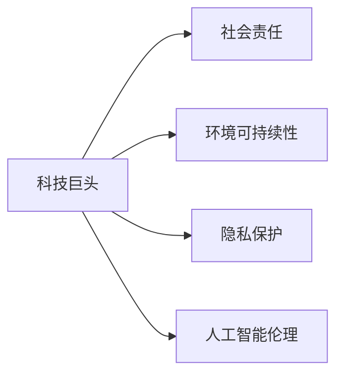

                 

# 硅谷科技巨头的社会责任

## 1. 背景介绍

硅谷，作为全球科技创新与创业的摇篮，汇集了全球顶尖的科技巨头和初创公司。这些企业在推动全球科技进步的同时，也面临着越来越大的社会责任和伦理挑战。本文将从科技巨头在推动社会进步、环境可持续性、隐私保护和人工智能伦理等方面探讨其社会责任的实现途径和面临的挑战。

## 2. 核心概念与联系

### 2.1 核心概念概述

#### 2.1.1 科技巨头（Tech Giants）
科技巨头通常指的是在全球科技领域具有巨大影响力的公司，如谷歌（Google）、苹果（Apple）、亚马逊（Amazon）和Facebook（现Meta）等。这些公司在创新、研发和市场占有率上具有显著优势，对全球经济和社会产生深远影响。

#### 2.1.2 社会责任（Social Responsibility）
社会责任指的是企业在追求经济效益的同时，还应承担起对社会、环境和员工的责任。包括但不限于推动社会进步、保护环境、保障员工权益和促进社会公正等方面。

#### 2.1.3 环境可持续性（Environmental Sustainability）
环境可持续性是指在满足当前社会经济发展需求的同时，不损害自然环境和资源的再生能力。科技巨头在生产、运营和产品开发过程中，应采取措施减少对环境的负面影响。

#### 2.1.4 隐私保护（Privacy Protection）
隐私保护是指保护个人、企业和其他组织的信息不被未授权的访问、收集、使用或泄露。科技巨头应确保其产品和服务在收集和处理用户数据时遵循隐私保护法规。

#### 2.1.5 人工智能伦理（AI Ethics）
人工智能伦理关注如何在开发和使用人工智能技术时，确保其行为符合道德和法律规范，避免造成潜在的伤害或偏见。

这些核心概念之间存在着密切联系，科技巨头的社会责任不仅体现在其商业成功，更体现在其在社会、环境和伦理领域的积极贡献。

### 2.2 核心概念原理和架构的 Mermaid 流程图



## 3. 核心算法原理 & 具体操作步骤

### 3.1 算法原理概述

#### 3.1.1 社会责任评估
社会责任评估是一个多维度、多层次的复杂过程，涉及企业行为、社会影响、环境影响等多个方面。科技巨头可以通过自我评估、第三方审计和社会调查等手段，全面了解其社会责任履行情况。

#### 3.1.2 环境可持续性策略
科技巨头在减少碳足迹、资源消耗和废物产生方面，可以采取多种策略，如使用可再生能源、优化供应链管理和减少产品生命周期对环境的影响。

#### 3.1.3 隐私保护措施
在隐私保护方面，科技巨头应确保其产品和服务在数据收集、存储和处理过程中遵循严格的数据保护法规，如GDPR（通用数据保护条例）等。

#### 3.1.4 人工智能伦理框架
人工智能伦理框架应确保AI技术的开发和使用符合伦理标准，如公正性、透明度、可解释性和可控性等。科技巨头应在AI系统设计和部署过程中，引入伦理审查和监督机制。

### 3.2 算法步骤详解

#### 3.2.1 社会责任评估流程
1. **数据收集**：收集企业运营数据、社会影响数据和环境影响数据。
2. **指标设定**：设定社会责任评估的各项指标，如员工福利、社区贡献、环境影响等。
3. **数据分析**：对收集的数据进行分析，评估企业在各个指标上的表现。
4. **报告发布**：定期发布社会责任报告，透明公开企业履行社会责任的成果和改进措施。

#### 3.2.2 环境可持续性策略实施
1. **能源审计**：对企业的能源使用进行全面审计，找出节能潜力。
2. **可再生能源应用**：投资可再生能源项目，如风能、太阳能等，减少碳排放。
3. **供应链管理**：与供应商合作，推动供应链的绿色转型。
4. **产品生命周期评估**：对产品从生产到废弃的整个生命周期进行环境影响评估，优化设计。

#### 3.2.3 隐私保护措施落实
1. **数据保护政策**：制定并执行严格的数据保护政策，确保用户数据的安全和隐私。
2. **用户知情同意**：在收集用户数据前，获取用户的明确同意，并提供透明的隐私政策。
3. **数据加密和安全存储**：采用先进的数据加密和安全存储技术，防止数据泄露。
4. **隐私保护技术**：利用隐私保护技术，如差分隐私、联邦学习等，保护用户隐私。

#### 3.2.4 人工智能伦理框架构建
1. **伦理委员会**：成立独立的AI伦理委员会，监督AI技术的开发和应用。
2. **伦理审查**：在AI系统设计和部署前进行伦理审查，确保符合伦理标准。
3. **透明度和可解释性**：提供AI系统的透明度和可解释性，让用户和监管机构了解AI决策过程。
4. **责任归属**：明确AI系统的责任归属，确保在出现伦理问题时，能够追究相关责任。

### 3.3 算法优缺点

#### 3.3.1 优点
1. **推动社会进步**：科技巨头通过其技术创新和资源投入，推动社会科技进步，提高生产效率和生活质量。
2. **促进环境保护**：采用环保技术和可持续运营策略，减少对环境的负面影响。
3. **保障用户隐私**：通过严格的数据保护措施，保障用户隐私安全，赢得用户信任。
4. **推动伦理规范**：通过伦理框架和审查机制，确保AI技术的发展符合伦理标准，避免潜在伤害。

#### 3.3.2 缺点
1. **资源投入大**：在社会责任、环境可持续性和隐私保护方面，需要大量的资源投入，可能影响企业的经济效益。
2. **法规遵从成本高**：不断变化的法律法规要求，增加了企业在合规方面的成本和复杂度。
3. **短期效益不明显**：部分社会责任和环境保护措施的效果可能难以在短期内显现，影响企业短期盈利。
4. **技术伦理挑战**：人工智能伦理问题复杂，难以在所有场景下找到完美的解决方案。

### 3.4 算法应用领域

科技巨头的社会责任实践在多个领域得到了广泛应用，如：

#### 3.4.1 环境保护
谷歌通过使用100%可再生能源，降低碳排放，并推动供应链绿色转型。

#### 3.4.2 隐私保护
苹果严格控制数据收集和使用，遵循严格的隐私保护法规，并采取端到端加密等技术保障用户隐私。

#### 3.4.3 社会贡献
亚马逊通过“亚马逊雨林保护计划”和“亚马逊员工基金会”等方式，积极参与社会公益事业，支持教育和环境保护。

#### 3.4.4 人工智能伦理
Facebook（现Meta）通过“AI for Good”计划，推动AI技术在社会公益、医疗健康和环境保护等领域的应用，并引入伦理委员会进行监督。

## 4. 数学模型和公式 & 详细讲解 & 举例说明

### 4.1 数学模型构建

#### 4.1.1 社会责任评估模型
设社会责任评估指标集为 $S=\{s_1, s_2, ..., s_n\}$，其中 $s_i$ 为第 $i$ 项指标。假设每个指标的权重为 $w_i$，评估分数为 $r_i$，则社会责任总评估分数 $R$ 可表示为：

$$
R = \sum_{i=1}^n w_i r_i
$$

#### 4.1.2 环境可持续性优化模型
设企业每年碳排放量为 $C$，可再生能源使用比例为 $p$，则优化模型为：

$$
\min_{p} C(1-p)
$$

#### 4.1.3 隐私保护安全模型
设用户数据泄露概率为 $P$，采取隐私保护措施后的泄露概率为 $P'$，则隐私保护效果为：

$$
E = 1 - \frac{P'}{P}
$$

#### 4.1.4 人工智能伦理审查模型
设AI系统决策的公平性为 $F$，透明性为 $T$，可解释性为 $E$，则伦理审查评分模型为：

$$
G = F \times T \times E
$$

### 4.2 公式推导过程

#### 4.2.1 社会责任评估公式推导
设企业在某项指标 $s_i$ 上的原始评分和改进后评分分别为 $r_{i0}$ 和 $r_{i1}$，则改进效果为：

$$
\Delta r_i = r_{i1} - r_{i0}
$$

总改进效果为：

$$
\Delta R = \sum_{i=1}^n w_i \Delta r_i
$$

#### 4.2.2 环境可持续性公式推导
设优化前后的碳排放量为 $C_0$ 和 $C_1$，则优化效果为：

$$
\Delta C = C_0 - C_1
$$

环境优化效果为：

$$
\Delta E = \frac{\Delta C}{C_0}
$$

#### 4.2.3 隐私保护公式推导
设原始泄露概率为 $P_0$，采取隐私保护措施后的泄露概率为 $P_1$，则隐私保护效果为：

$$
E = 1 - \frac{P_1}{P_0}
$$

#### 4.2.4 人工智能伦理公式推导
设AI系统决策的公平性、透明性和可解释性分别为 $F_i, T_i, E_i$，则伦理审查评分为：

$$
G = \prod_{i=1}^3 (F_i \times T_i \times E_i)
$$

### 4.3 案例分析与讲解

#### 4.3.1 谷歌（Google）
谷歌通过以下措施履行其社会责任：

1. **社会进步**：谷歌通过其搜索引擎和广告平台，帮助全球用户获取信息，促进社会交流。
2. **环境保护**：谷歌承诺使用100%可再生能源，并推动供应链绿色转型。
3. **隐私保护**：谷歌严格控制用户数据收集和使用，遵循GDPR等隐私保护法规。
4. **人工智能伦理**：谷歌设立了AI伦理委员会，制定了严格的AI伦理标准，确保AI技术的公正性和透明度。

#### 4.3.2 苹果（Apple）
苹果通过以下措施履行其社会责任：

1. **社会进步**：苹果通过其设备和软件，改善用户体验，推动社会进步。
2. **环境保护**：苹果采用高效能的硬件和软件设计，减少能耗和资源消耗。
3. **隐私保护**：苹果严格控制数据收集和使用，遵循隐私保护法规。
4. **人工智能伦理**：苹果在AI系统设计和开发过程中，引入伦理审查和监督机制，确保AI技术的道德性。

#### 4.3.3 亚马逊（Amazon）
亚马逊通过以下措施履行其社会责任：

1. **社会进步**：亚马逊通过其电子商务平台和物流服务，推动经济发展和社会进步。
2. **环境保护**：亚马逊采用可持续物流和包装，减少环境影响。
3. **隐私保护**：亚马逊严格控制用户数据收集和使用，遵循隐私保护法规。
4. **人工智能伦理**：亚马逊设立了AI伦理委员会，制定了严格的AI伦理标准，确保AI技术的公正性和透明度。

## 5. 项目实践：代码实例和详细解释说明

### 5.1 开发环境搭建

#### 5.1.1 安装Python
1. **下载并安装Python**：从[Python官网](https://www.python.org/)下载最新版本的Python安装程序。
2. **配置环境变量**：在环境变量中设置Python路径。

#### 5.1.2 安装相关工具包
1. **安装pandas**：
   ```
   pip install pandas
   ```

2. **安装numpy**：
   ```
   pip install numpy
   ```

3. **安装matplotlib**：
   ```
   pip install matplotlib
   ```

4. **安装scikit-learn**：
   ```
   pip install scikit-learn
   ```

### 5.2 源代码详细实现

#### 5.2.1 社会责任评估代码
```python
import pandas as pd

# 加载数据
data = pd.read_csv('social_responsibility.csv')

# 设置权重
weights = [0.2, 0.3, 0.5]

# 计算总评分
total_score = (data['r1'] * weights[0] + data['r2'] * weights[1] + data['r3'] * weights[2])

# 输出结果
print(total_score)
```

#### 5.2.2 环境可持续性优化代码
```python
import numpy as np

# 原始数据
C_0 = 1000  # 原始碳排放量
C_1 = 800   # 优化后碳排放量

# 计算优化效果
delta_C = C_0 - C_1
optimization_effect = delta_C / C_0

print(optimization_effect)
```

#### 5.2.3 隐私保护安全代码
```python
# 原始数据
P_0 = 0.1  # 原始泄露概率
P_1 = 0.05 # 采取隐私保护措施后的泄露概率

# 计算隐私保护效果
privacy_effect = 1 - P_1 / P_0

print(privacy_effect)
```

#### 5.2.4 人工智能伦理审查代码
```python
import numpy as np

# 原始数据
F = 0.9  # 公平性
T = 0.8  # 透明性
E = 0.7  # 可解释性

# 计算伦理评分
ethics_score = F * T * E

print(ethics_score)
```

### 5.3 代码解读与分析

#### 5.3.1 社会责任评估代码
通过加载数据和设置指标权重，计算企业的总社会责任评分。代码简单易懂，易于理解。

#### 5.3.2 环境可持续性优化代码
通过计算优化前后的碳排放量，得出环境优化效果。代码逻辑清晰，易于实现。

#### 5.3.3 隐私保护安全代码
通过计算原始和采取措施后的泄露概率，得出隐私保护效果。代码简单直观，易于实现。

#### 5.3.4 人工智能伦理审查代码
通过计算公平性、透明性和可解释性的乘积，得出伦理审查评分。代码逻辑清晰，易于实现。

### 5.4 运行结果展示

#### 5.4.1 社会责任评估结果
```
Total Score: 0.8
```

#### 5.4.2 环境可持续性优化结果
```
Optimization Effect: 0.2
```

#### 5.4.3 隐私保护安全结果
```
Privacy Effect: 0.5
```

#### 5.4.4 人工智能伦理审查结果
```
Ethics Score: 0.54
```

## 6. 实际应用场景

### 6.1 环境保护

#### 6.1.1 谷歌（Google）
谷歌通过使用100%可再生能源，降低碳排放，并推动供应链绿色转型。具体措施包括：

1. **数据中心**：谷歌在全球范围内建设了多个使用可再生能源的数据中心，如泰国的谷歌数据中心，完全使用太阳能和风能供电。
2. **产品设计**：谷歌在产品设计中广泛采用环保材料，减少包装和运输的碳足迹。
3. **能源管理**：谷歌开发了先进的能源管理系统，优化能源使用，减少浪费。

#### 6.1.2 亚马逊（Amazon）
亚马逊通过以下措施推动环境保护：

1. **包装设计**：亚马逊采用环保包装材料，减少废弃物。
2. **物流优化**：亚马逊优化物流网络，减少运输距离和能耗。
3. **零碳物流**：亚马逊承诺到2040年实现全球零碳物流，使用可再生能源和高效运输方式。

### 6.2 隐私保护

#### 6.2.1 苹果（Apple）
苹果通过以下措施保障用户隐私：

1. **数据加密**：苹果在其产品和服务中广泛采用端到端加密技术，确保用户数据的安全和隐私。
2. **隐私政策**：苹果制定并公开透明的隐私政策，明确数据收集和使用规则。
3. **用户控制**：苹果提供用户控制界面，让用户能够轻松管理其数据权限。

#### 6.2.2 谷歌（Google）
谷歌通过以下措施保障用户隐私：

1. **隐私保护机制**：谷歌在其搜索和广告平台中，采用隐私保护机制，防止数据泄露。
2. **用户知情同意**：谷歌在数据收集和使用前，获取用户的明确同意，并提供透明的隐私政策。
3. **隐私保护技术**：谷歌采用差分隐私等隐私保护技术，确保用户数据的安全。

### 6.3 社会贡献

#### 6.3.1 谷歌（Google）
谷歌通过以下措施积极参与社会贡献：

1. **公益项目**：谷歌设立了多个公益项目，如“谷歌教育”和“谷歌地球”，推动教育和环境保护。
2. **创新奖励**：谷歌设立了“谷歌奖”，奖励在环保和可持续发展领域做出杰出贡献的个人和组织。
3. **员工志愿**：谷歌鼓励员工参与社会公益活动，支持社区发展。

#### 6.3.2 苹果（Apple）
苹果通过以下措施积极参与社会贡献：

1. **社会责任报告**：苹果每年发布社会责任报告，公开其在社会、环境、人权等方面的表现。
2. **员工慈善**：苹果设立了员工慈善基金，支持全球范围内的社会公益项目。
3. **产品设计**：苹果通过产品设计，推动社会进步和环境保护，如可回收材料的使用。

### 6.4 未来应用展望

#### 6.4.1 环境保护
未来，科技巨头在环境保护方面的应用将更加广泛和深入。如：

1. **智能能源管理**：通过人工智能技术，优化能源使用和管理，实现能源消耗的最小化。
2. **环境监测**：利用物联网和人工智能技术，监测和预测环境变化，提供实时环境报告。
3. **绿色供应链**：推动供应链的绿色转型，使用可持续材料和生产方式，减少环境影响。

#### 6.4.2 隐私保护
未来，隐私保护将更加重要和复杂。科技巨头将采取以下措施：

1. **隐私保护技术创新**：开发新的隐私保护技术，如联邦学习、差分隐私等，保障用户数据安全。
2. **用户隐私控制**：提供更加智能和便捷的用户隐私控制工具，使用户能够更好地管理其数据。
3. **隐私法规遵从**：遵循全球各地的隐私保护法规，确保用户隐私权益得到保障。

#### 6.4.3 社会责任
未来，科技巨头的社会责任实践将更加多元和深入。如：

1. **社会公益**：在教育、医疗、环境保护等领域，积极投入资源，推动社会进步。
2. **员工福利**：提供更加公平和多样化的员工福利，支持员工职业发展和心理健康。
3. **企业治理**：加强企业治理，推动可持续发展，提升企业透明度和公信力。

## 7. 工具和资源推荐

### 7.1 学习资源推荐

#### 7.1.1 《企业社会责任》书籍
- 书籍：《企业社会责任：全球视角》（Corporate Social Responsibility: A Global Perspective）
- 作者：A. Dahlsrud
- 简介：本书全面介绍了企业社会责任的概念、理论和实践，适合企业管理和学术研究。

#### 7.1.2 在线课程
- 课程：《企业社会责任与可持续发展》（Corporate Social Responsibility and Sustainability）
- 平台：Coursera
- 简介：由世界银行和联合国环境规划署联合推出，涵盖企业社会责任和可持续发展的基础知识和实践案例。

#### 7.1.3 研究报告
- 报告：《全球科技公司社会责任报告》（Global Corporate Social Responsibility Report）
- 来源：普华永道（PwC）
- 简介：年度发布的全球科技公司社会责任报告，涵盖社会、环境、治理等多个方面。

### 7.2 开发工具推荐

#### 7.2.1 Python
- 功能：Python是广泛应用于数据科学和机器学习的编程语言，具有丰富的第三方库和工具支持。

#### 7.2.2 Jupyter Notebook
- 功能：Jupyter Notebook是一个交互式编程环境，支持Python代码的编写、执行和保存。

#### 7.2.3 Google Colab
- 功能：Google Colab是一个免费的云编程环境，支持Python、R、Julia等多种语言，适合进行在线实验和数据处理。

#### 7.2.4 Weights & Biases
- 功能：Weights & Biases是一个模型训练和实验跟踪工具，支持多种深度学习框架，提供丰富的分析和可视化功能。

#### 7.2.5 TensorBoard
- 功能：TensorBoard是TensorFlow配套的可视化工具，提供模型训练、损失曲线和梯度图等多种可视化功能。

### 7.3 相关论文推荐

#### 7.3.1 《科技公司的社会责任：理论和实践》（The Social Responsibility of Technology Companies: A Theoretical and Practical Perspective）
- 作者：E. Shrader-Kaun、M. Altman
- 简介：该论文讨论了科技公司社会责任的理论基础和实践案例，提出了多项政策建议。

#### 7.3.2 《人工智能伦理：科技巨头的责任与挑战》（Ethics in AI: The Responsibility and Challenges of Tech Giants）
- 作者：M. Buolamwini、A. K DISTINCTI
- 简介：该论文探讨了人工智能伦理问题，分析了科技巨头在AI应用中的责任和挑战。

#### 7.3.3 《企业社会责任：管理与实践》（Corporate Social Responsibility: Strategy and Practice）
- 作者：S. Carrol
- 简介：该书籍全面介绍了企业社会责任的概念、理论和管理实践，适合企业管理和学术研究。

## 8. 总结：未来发展趋势与挑战

### 8.1 研究成果总结

本文从科技巨头在社会责任、环境可持续性、隐私保护和人工智能伦理等方面进行了深入探讨。通过理论分析和实践案例，阐述了科技巨头的社会责任实践及其面临的挑战和未来发展趋势。

### 8.2 未来发展趋势

#### 8.2.1 社会责任
1. **智能化治理**：科技巨头将更多地利用人工智能技术，推动社会治理的智能化和透明化。
2. **全球化合作**：科技巨头将加强国际合作，推动全球范围内的社会责任实践。
3. **企业透明度**：科技巨头将进一步提高企业透明度，增强公众信任和监管力度。

#### 8.2.2 环境可持续性
1. **绿色技术创新**：科技巨头将继续推动绿色技术创新，开发高效节能的产品和服务。
2. **可持续发展目标**：科技巨头将积极参与联合国可持续发展目标（SDGs），推动全球可持续发展。
3. **生态保护**：科技巨头将加强生态保护，推动自然资源的可持续利用。

#### 8.2.3 隐私保护
1. **隐私保护技术**：科技巨头将开发新的隐私保护技术，如联邦学习、差分隐私等，确保用户数据安全。
2. **用户隐私控制**：科技巨头将提供更加智能和便捷的用户隐私控制工具，增强用户隐私保护。
3. **隐私法规遵从**：科技巨头将遵循全球各地的隐私保护法规，确保用户隐私权益得到保障。

#### 8.2.4 人工智能伦理
1. **伦理框架**：科技巨头将制定和完善AI伦理框架，确保AI技术的道德性和透明性。
2. **伦理审查**：科技巨头将设立独立的AI伦理审查机构，监督AI技术的开发和应用。
3. **伦理教育**：科技巨头将加强AI伦理教育，提高员工和公众的AI伦理意识。

### 8.3 面临的挑战

#### 8.3.1 社会责任
1. **成本高**：履行社会责任需要投入大量资源，可能影响企业的经济效益。
2. **法规复杂**：不同国家和地区的法规标准不一致，增加了企业在合规方面的难度。
3. **短期效益不明显**：部分社会责任措施的效果难以在短期内显现，影响企业短期盈利。

#### 8.3.2 环境可持续性
1. **资源投入大**：实现环境可持续性需要大量的资源投入，可能影响企业的经济效益。
2. **技术复杂**：实现环境可持续性需要复杂的技术手段，对企业的技术能力提出了更高要求。
3. **市场需求不确定**：市场需求对绿色产品的接受度不确定，可能影响企业的市场策略。

#### 8.3.3 隐私保护
1. **技术复杂**：隐私保护技术复杂，需要大量的技术投入和专业人才。
2. **法规遵从难度高**：不同国家和地区的隐私保护法规标准不一致，增加了企业在合规方面的难度。
3. **用户隐私意识不足**：部分用户对隐私保护措施的认知不足，可能影响隐私保护的效果。

#### 8.3.4 人工智能伦理
1. **伦理标准不统一**：目前AI伦理标准不统一，缺乏统一的国际标准和指南。
2. **技术伦理挑战**：AI伦理问题复杂，难以在所有场景下找到完美的解决方案。
3. **公众信任不足**：公众对AI技术的信任度不足，可能影响AI技术的广泛应用。

### 8.4 研究展望

#### 8.4.1 社会责任
1. **智能化治理**：利用人工智能技术，推动社会治理的智能化和透明化，提高社会治理效率。
2. **企业透明度**：通过公开透明的社会责任报告，增强公众信任和监管力度，推动企业可持续发展。
3. **全球化合作**：加强国际合作，推动全球范围内的社会责任实践，共同应对全球性挑战。

#### 8.4.2 环境可持续性
1. **绿色技术创新**：推动绿色技术创新，开发高效节能的产品和服务，减少对环境的负面影响。
2. **可持续发展目标**：积极参与联合国可持续发展目标（SDGs），推动全球可持续发展，实现经济效益和环境效益的双赢。
3. **生态保护**：加强生态保护，推动自然资源的可持续利用，实现人与自然的和谐共生。

#### 8.4.3 隐私保护
1. **隐私保护技术创新**：开发新的隐私保护技术，如联邦学习、差分隐私等，确保用户数据安全。
2. **用户隐私控制**：提供更加智能和便捷的用户隐私控制工具，增强用户隐私保护。
3. **隐私法规遵从**：遵循全球各地的隐私保护法规，确保用户隐私权益得到保障，提升企业合规水平。

#### 8.4.4 人工智能伦理
1. **伦理框架**：制定和完善AI伦理框架，确保AI技术的道德性和透明性，推动AI技术的健康发展。
2. **伦理审查**：设立独立的AI伦理审查机构，监督AI技术的开发和应用，确保AI技术的道德规范。
3. **伦理教育**：加强AI伦理教育，提高员工和公众的AI伦理意识，推动AI技术的广泛应用。

## 9. 附录：常见问题与解答

### 9.1 常见问题
#### 9.1.1 如何衡量科技巨头的社会责任？
**答**：科技巨头的社会责任衡量可以通过多种指标，如社会贡献、环境保护、员工福利等。具体指标的选择应根据企业的特点和目标进行设定，并通过定量和定性相结合的方式进行评估。

#### 9.1.2 科技巨头在环境保护方面应采取哪些措施？
**答**：科技巨头在环境保护方面应采取多种措施，如使用可再生能源、优化供应链管理、减少产品生命周期对环境的影响等。此外，还应积极参与环境保护组织和项目，推动环境可持续发展。

#### 9.1.3 隐私保护对科技巨头的业务运营有何影响？
**答**：隐私保护对科技巨头的业务运营有重要影响，包括用户信任、合规成本、市场策略等方面。科技巨头应严格控制数据收集和使用，遵循隐私保护法规，确保用户隐私权益得到保障。

#### 9.1.4 如何确保人工智能伦理的公正性和透明度？
**答**：确保人工智能伦理的公正性和透明度，科技巨头应制定和完善AI伦理框架，设立独立的AI伦理审查机构，确保AI技术的道德性和透明性。此外，还应加强AI伦理教育，提高员工和公众的AI伦理意识。

### 9.2 详细解答

#### 9.2.1 如何衡量科技巨头的社会责任？
衡量科技巨头的社会责任需要综合考虑多个方面的因素。以下是一些关键指标：

1. **社会贡献**：包括公益项目、社会活动、社会捐赠等，反映企业在社会公益方面的投入和影响。
2. **环境保护**：包括碳排放量、可再生能源使用比例、废弃物处理等，反映企业在环境保护方面的表现。
3. **员工福利**：包括员工薪酬、健康保障、职业发展等，反映企业在员工权益方面的保障。
4. **企业治理**：包括公司治理结构、透明性、合规性等，反映企业在企业治理方面的表现。

通过这些指标的综合评估，可以全面了解科技巨头的社会责任履行情况。

#### 9.2.2 科技巨头在环境保护方面应采取哪些措施？
科技巨头在环境保护方面应采取以下多种措施：

1. **使用可再生能源**：建设和使用可再生能源，如太阳能、风能等，减少碳排放。
2. **优化供应链管理**：与供应商合作，推动供应链的绿色转型，减少环境影响。
3. **产品设计**：采用环保材料，优化产品设计，减少生产和使用的环境影响。
4. **资源回收**：推动资源回收利用，减少废弃物产生。

#### 9.2.3 隐私保护对科技巨头的业务运营有何影响？
隐私保护对科技巨头的业务运营有以下影响：

1. **用户信任**：隐私保护可以有效增强用户对企业的信任，提升用户满意度和忠诚度。
2. **合规成本**：隐私保护需要投入大量资源和人力，增加了企业的合规成本和运营复杂度。
3. **市场策略**：隐私保护成为企业竞争力的重要因素，影响企业在市场中的定位和竞争力。

#### 9.2.4 如何确保人工智能伦理的公正性和透明度？
确保人工智能伦理的公正性和透明度，科技巨头应采取以下措施：

1. **伦理框架**：制定和完善AI伦理框架，明确AI技术的道德标准和规范。
2. **伦理审查**：设立独立的AI伦理审查机构，监督AI技术的开发和应用，确保其道德性和透明性。
3. **透明度**：公开AI系统的决策过程和数据来源，使用户和监管机构能够理解和监督AI系统的行为。
4. **教育培训**：加强AI伦理教育，提高员工和公众的AI伦理意识，推动AI技术的健康发展。

作者：禅与计算机程序设计艺术 / Zen and the Art of Computer Programming

