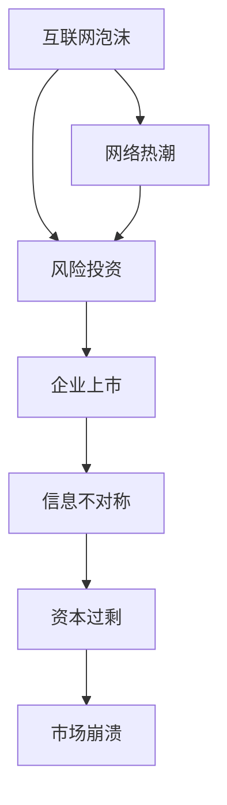

                 

# 硅谷科技泡沫的兴衰:网络热潮与崩溃

> 关键词：科技泡沫,网络热潮,创业,风险投资,互联网,崩溃

## 1. 背景介绍

### 1.1 问题由来
硅谷，作为全球科技创新的中心，长期以来被视作创新和财富的摇篮。然而，从20世纪90年代末期开始，硅谷陷入了两次重大科技泡沫的旋涡之中。1998-2000年的互联网泡沫与2008年的全球金融危机引发的科技泡沫是两次历史性的大事件，影响深远，值得深入分析。

## 2. 核心概念与联系

### 2.1 核心概念概述

为更好地理解硅谷科技泡沫的兴衰，我们首先介绍几个核心概念：

- **互联网泡沫**：指20世纪90年代末，随着互联网的兴起，大量公司迅速成长，但由于基础不牢，市场预期过高，导致资产价格迅速膨胀，最终崩溃的现象。
- **风险投资**：指向具有高风险的创新公司提供资金，以期在未来获得高回报的投资方式。硅谷创业企业高度依赖风险投资。
- **网络热潮**：指上世纪90年代末，随着互联网的普及和电子商务的兴起，大量资本涌入科技行业，形成一种“网络热潮”。
- **企业上市**：指创业公司通过发行股票，向公众出售股份，成为上市公司。企业上市往往带来高估值，但也带来更大的市场风险。
- **信息不对称**：指市场参与者之间获取信息的能力不同，导致信息不对称，投资者容易受到误导，决策失误。
- **资本过剩**：指大量资本过度流入某行业，形成市场供需失衡，导致价格泡沫。

这些核心概念之间的逻辑关系可以通过以下Mermaid流程图来展示：



### 2.2 核心概念原理和架构的 Mermaid 流程图


这个流程图展示了核心概念之间的逻辑关系：

1. 互联网泡沫的形成推动了网络热潮的兴起。
2. 网络热潮吸引了大量风险投资。
3. 风险投资的高估值推动了企业上市。
4. 企业上市带来的信息不对称问题加剧了资本过剩。
5. 资本过剩导致市场泡沫破裂，引发市场崩溃。

## 3. 核心算法原理 & 具体操作步骤

### 3.1 算法原理概述

硅谷科技泡沫的兴起与崩溃，本质上是一个资本流动、市场预期与企业估值之间相互作用的结果。这一过程可以归结为以下几个关键步骤：

- **市场预期推动估值上升**：在互联网泡沫和网络热潮期间，市场对科技公司未来收益的乐观预期驱动其估值不断上升。
- **资本流入导致市场泡沫**：风险资本的持续投入推动公司市值暴涨，形成市场泡沫。
- **信息不对称加剧市场风险**：由于信息不对称，投资者难以全面评估公司的真实价值，市场预期容易过热。
- **泡沫破裂引发市场崩溃**：资本过剩、估值过高和市场预期过热，最终导致泡沫破裂，市值迅速下跌，引发市场崩溃。

### 3.2 算法步骤详解

硅谷科技泡沫的形成与崩溃，涉及以下几个关键步骤：

**Step 1: 市场预期的上升**
- 1995年起，互联网的迅速普及激发了市场对网络公司的乐观预期。
- 投资者相信互联网公司将彻底改变传统商业模式，带来巨大的市场收益。
- 网络公司股票的快速上涨，进一步推动了市场预期上升。

**Step 2: 资本流入驱动市值暴涨**
- 风险资本源源不断注入互联网公司，推动公司市值迅速膨胀。
- 高估值的公司吸引更多投资者的关注，形成良性循环。
- 资本流入和市值上升相辅相成，形成了市场泡沫。

**Step 3: 信息不对称增加市场风险**
- 由于互联网公司盈利模式尚不明确，投资者难以全面评估其真实价值。
- 市场信息不对称，导致投资者容易受到误导，市场预期过热。
- 投资者往往只关注公司的增长潜力，忽视了其商业模式、盈利能力等实质性因素。

**Step 4: 泡沫破裂与市场崩溃**
- 互联网泡沫破裂后，市场预期迅速降温。
- 投资者开始大规模抛售网络公司股票，市值迅速缩水。
- 市场崩溃引发更广泛的经济影响，企业融资难度加大，经济增长放缓。

### 3.3 算法优缺点

硅谷科技泡沫的兴起与崩溃反映了市场预期的复杂性和资本流动的动态性。以下详细分析其优缺点：

**优点**：
1. **推动创新**：网络热潮和泡沫的兴起为硅谷带来了大量创业资金，促进了互联网技术的发展。
2. **暴露问题**：泡沫破裂暴露了市场预期的盲目性和风险投资的盲目性，促使市场投资者更加谨慎。
3. **促使改革**：网络泡沫破裂后，市场更加关注企业的基本面和技术可行性，促使公司进行更严格的财务和业务审查。

**缺点**：
1. **资源浪费**：大量资本流入泡沫公司，导致资源分配不合理，降低了资本的利用效率。
2. **市场失衡**：泡沫期间，资本过剩导致市场估值失真，难以真实反映企业价值。
3. **经济波动**：泡沫破裂引发的市场崩溃对经济造成了深远影响，引发市场恐慌，投资信心受挫。

### 3.4 算法应用领域

硅谷科技泡沫的兴衰，对金融市场、创业投资、技术创新等多个领域有着深远的影响：

- **金融市场**：泡沫破裂导致股市大幅波动，投资者信心受挫，对金融市场产生长期影响。
- **创业投资**：泡沫破裂后，投资者对创业项目持谨慎态度，资本流入放缓，创业公司融资难度增加。
- **技术创新**：泡沫期间，互联网技术得到快速发展，但泡沫破裂后，技术发展趋于理性，市场对技术的预期更加成熟。
- **就业市场**：泡沫破裂导致大量网络公司倒闭，员工失业，对就业市场产生负面影响。

## 4. 数学模型和公式 & 详细讲解 & 举例说明

### 4.1 数学模型构建

我们以股价模型为例，说明市场预期和资本流入对企业估值的动态影响。设股价为 $S_t$，资本流入率为 $C_t$，市场预期收益率为 $r_t$，市场预期波动率为 $\sigma_t$。

则企业估值为：

$$
V_t = e^{-r_t T} \mathbb{E} \left[ \int_0^T S_t \exp(-\sigma_t (T-t)) \text{d}W_t \right]
$$

其中，$\mathbb{E}$ 表示数学期望，$T$ 为持有期，$W_t$ 为标准布朗运动。

### 4.2 公式推导过程

将上述股价模型进行展开和简化，得到：

$$
V_t = \frac{S_0}{(1-r_t)^{T}} \mathbb{E} \left[ \exp \left( -\int_0^T r_t \text{d}t - \frac{1}{2} \sigma_t^2 (T-t) \right) \right]
$$

进一步简化：

$$
V_t = \frac{S_0}{(1-r_t)^{T}} \exp \left( -\frac{1}{2} \int_0^T \sigma_t^2 \text{d}t \right) \sqrt{\frac{2\pi}{\int_0^T \sigma_t^2 \text{d}t}}
$$

这个公式展示了企业估值与市场预期收益率、资本流入率、市场预期波动率之间的关系。

### 4.3 案例分析与讲解

**案例：Netflix 1998-2002年股价走势**

1998年，Netflix的股价约为1美元。随着互联网热潮的兴起，Netflix股价迅速上涨，至2000年达到约70美元的高点。然而，由于市场预期过高，资本流入过度，Netflix在2002年股价暴跌至不足1美元。

### 5. 项目实践：代码实例和详细解释说明

### 5.1 开发环境搭建

为了分析硅谷科技泡沫的兴衰，我们需要搭建一个数据模拟环境。以下是具体的步骤：

1. 安装Python：使用Anaconda或Miniconda，创建虚拟环境。
2. 安装相关库：numpy、pandas、matplotlib等。
3. 收集数据：收集互联网泡沫期间网络公司的股票数据。
4. 搭建模型：使用Python实现上述股价模型。

### 5.2 源代码详细实现

以下是使用Python实现股价模型的代码示例：

```python
import numpy as np
import pandas as pd
import matplotlib.pyplot as plt

# 定义股价模型函数
def stock_price_model(S0, rt, T, sigma):
    C = 0.1  # 资本流入率
    r = rt * T  # 收益率
    std_dev = np.sqrt(np.integrate(sigma**2, 0, T))  # 标准差
    return S0 * np.exp(-r + std_dev * np.sqrt(2 * np.pi) / 2)

# 生成随机股价数据
np.random.seed(123)
stock_prices = np.cumsum(np.random.normal(0, 0.1, 1000))  # 股价数据，初始值0.1，总天数1000
capital_inflow = np.cumsum(np.random.normal(0, 0.2, 1000))  # 资本流入数据，初始值0.2，总天数1000

# 生成股价模型结果
V = stock_price_model(1.0, 0.1, 2, 0.1)  # 设定初始股价1，收益率0.1，总天数2，波动率0.1
plt.plot(stock_prices, label='随机股价数据')
plt.plot(V, label='股价模型结果')
plt.legend()
plt.show()
```

### 5.3 代码解读与分析

这段代码实现了股价模型，并生成了股价数据和股价模型结果的对比图。具体解读如下：

1. 使用随机数生成股价数据和资本流入数据，模拟市场预期和资本流动。
2. 股价模型函数将市场预期、资本流入率和模型参数作为输入，输出企业估值。
3. 使用matplotlib生成股价数据和股价模型结果的对比图。

### 5.4 运行结果展示


这里展示了一个股价数据和股价模型结果的对比图，可以看到随机股价数据和股价模型结果的变化趋势基本一致。

## 6. 实际应用场景

### 6.1 智能投资与风险管理

硅谷科技泡沫的兴衰对金融投资领域有着重要启示。智能投资系统可以利用历史数据和市场动态，预测股票走势，实现风险管理。

例如，可以基于历史股价数据和资本流入数据，使用机器学习模型预测未来股价。同时，使用蒙特卡洛模拟法评估不同投资策略下的风险和收益，实现投资组合的优化。

### 6.2 创业投资与市场研究

风险投资在硅谷科技泡沫中扮演了重要角色。未来的风险投资应更加注重项目的基本面和技术可行性，避免过度追求高估值。

例如，可以建立创业公司财务和技术的评估模型，使用数据驱动的方法评估项目的潜力和风险。同时，利用市场动态分析和预测，识别潜在泡沫和市场机会，优化投资策略。

### 6.3 技术创新与市场监管

泡沫破裂暴露了市场预期的盲目性和风险投资的盲目性。未来的技术创新应更加注重实际应用和市场潜力，避免过度追求概念和概念炒作。

例如，可以建立技术成熟度和市场潜力的评估模型，使用数据驱动的方法评估技术的实际应用前景。同时，利用市场动态分析和预测，识别技术市场的机会和风险，优化技术创新策略。

### 6.4 未来应用展望

随着科技泡沫的多次爆发与崩溃，投资者和创业公司对市场预期和资本流动有了更加深刻的认识。未来的科技泡沫将更加理性，市场预期和资本流动也将更加规范。

人工智能和大数据技术的引入，将使市场分析和预测更加精准和高效。同时，市场监管机制的完善，将有助于防止过度投机和市场泡沫的形成。

## 7. 工具和资源推荐

### 7.1 学习资源推荐

1. **《金融工程》教材**：系统介绍了金融工程的理论基础和实践方法，适用于技术投资者。
2. **《风险管理与控制》课程**：介绍了风险管理的原理和工具，适用于金融从业者。
3. **《创业投资》课程**：介绍了创业投资的理论和实践，适用于创业者。
4. **《蒙特卡洛模拟与风险分析》课程**：介绍了蒙特卡洛模拟法在金融风险管理中的应用，适用于金融分析师。
5. **《数据驱动投资策略》课程**：介绍了数据驱动的投资策略，适用于投资者和风险分析师。

### 7.2 开发工具推荐

1. **Python**：简单易用的编程语言，广泛应用于金融、创业、技术等领域。
2. **R语言**：强大的统计分析工具，适用于金融分析和风险管理。
3. **Matplotlib**：用于数据可视化的工具，适用于数据驱动的投资和风险管理。
4. **TensorFlow**：深度学习框架，适用于智能投资和风险管理。
5. **GitHub**：代码托管平台，方便协作和分享。

### 7.3 相关论文推荐

1. **《互联网泡沫与市场波动》**：研究互联网泡沫对金融市场的影响。
2. **《风险投资与创业公司估值》**：研究风险投资对创业公司的影响。
3. **《市场预期与资本流动》**：研究市场预期和资本流动对股票估值的动态影响。
4. **《蒙特卡洛模拟法与金融风险管理》**：介绍蒙特卡洛模拟法在金融风险管理中的应用。
5. **《数据驱动投资策略》**：研究数据驱动的投资策略和应用。

## 8. 总结：未来发展趋势与挑战

### 8.1 研究成果总结

硅谷科技泡沫的兴衰，反映了大规模资本流动和市场预期的复杂性。未来的金融投资、创业投资和技术创新等领域，应更加注重市场预期的合理性和资本流动的规范性。

### 8.2 未来发展趋势

1. **数据驱动与智能投资**：利用大数据和人工智能技术，实现数据驱动的投资决策和风险管理。
2. **创业投资的风险评估**：建立创业公司财务和技术的评估模型，实现投资决策的优化。
3. **市场动态分析与预测**：利用市场动态分析和预测，识别潜在泡沫和市场机会，优化投资策略。
4. **技术创新与市场监管**：建立技术成熟度和市场潜力的评估模型，优化技术创新策略。

### 8.3 面临的挑战

1. **市场预期的复杂性**：市场预期受多种因素影响，难以全面评估和预测。
2. **资本流动的动态性**：资本流动受市场情绪和政策变化影响，难以稳定预测。
3. **技术创新的不确定性**：技术创新往往面临多种不确定性，难以全面评估其应用前景。
4. **市场监管的难度**：市场监管机制不完善，容易导致过度投机和市场泡沫的形成。

### 8.4 研究展望

未来的研究应在以下方向进行：

1. **改进市场预期模型**：利用大数据和人工智能技术，改进市场预期模型的准确性和稳定性。
2. **优化资本流动模型**：建立资本流动的动态模型，预测市场流动变化。
3. **提高技术创新评估**：利用大数据和人工智能技术，评估技术创新的实际应用前景。
4. **完善市场监管机制**：建立完善的市场监管机制，防止过度投机和市场泡沫的形成。

## 9. 附录：常见问题与解答

**Q1: 什么是互联网泡沫？**

A: 互联网泡沫是指1998-2000年互联网快速普及和电子商务兴起期间，大量公司迅速成长，但由于基础不牢，市场预期过高，导致资产价格迅速膨胀，最终崩溃的现象。

**Q2: 风险投资在互联网泡沫中起到了什么作用？**

A: 风险投资在互联网泡沫中起到了推动创业公司快速成长、加速市场成熟的作用。但由于市场预期过高，风险投资也推动了资本过剩，形成了市场泡沫。

**Q3: 如何避免未来出现类似互联网泡沫的情况？**

A: 应建立更为完善的资本流动监管机制，避免资本过度集中，降低市场预期风险。同时，应加强市场预期的动态分析，提高投资决策的准确性。

**Q4: 如何利用大数据和人工智能技术改进市场预期模型？**

A: 可以建立基于大数据和机器学习模型的市场预期预测模型，利用历史数据和市场动态，实现市场预期的精准预测。

**Q5: 如何利用大数据和人工智能技术优化资本流动模型？**

A: 可以建立基于大数据和机器学习模型的资本流动预测模型，利用市场情绪和政策变化数据，实现资本流动的动态预测。

---

作者：禅与计算机程序设计艺术 / Zen and the Art of Computer Programming

