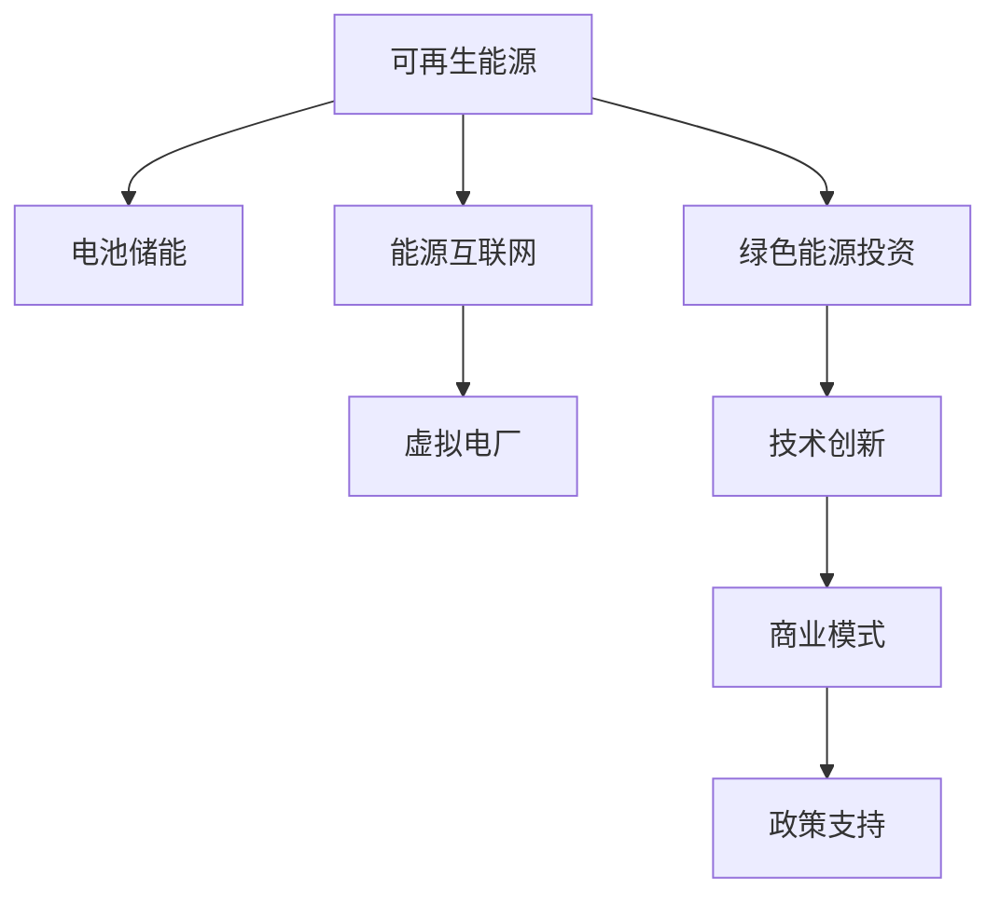

                 

# 硅谷绿色能源革命:可再生能源公司

## 1. 背景介绍

### 1.1 问题由来
随着全球气候变化的加剧，绿色能源已经成为国家战略发展的重要方向。近年来，随着环保意识的提升和可再生能源技术的进步，越来越多的公司投入到绿色能源的开发和利用中。硅谷作为全球科技创新中心，自然成为了可再生能源公司的重要集聚地。

在硅谷，新兴的绿色能源公司正通过技术创新和商业模式变革，引领着全球绿色能源革命的潮流。本文将从背景、技术、应用等多个角度，深入探讨硅谷绿色能源革命的特点、面临的挑战以及未来的发展方向。

### 1.2 问题核心关键点
硅谷绿色能源革命的核心关键点主要包括：

1. **技术创新**：硅谷集中了全球领先的科研机构和创新公司，推动着太阳能、风能、氢能等可再生能源技术的发展。
2. **商业模式**：硅谷公司通过电池储能、能源互联网、虚拟电厂等商业模式，解决了可再生能源的间歇性和不稳定性问题。
3. **政策支持**：硅谷政府通过一系列政策支持，如税收减免、补贴等，促进了绿色能源产业的发展。
4. **资本投入**：硅谷吸引了大量的风险投资和产业资本，为绿色能源公司提供了充足的资金支持。
5. **生态系统**：硅谷构建了完善的绿色能源生态系统，包括供应商、客户、开发者等，形成了一个良性的发展循环。

## 2. 核心概念与联系

### 2.1 核心概念概述

为更好地理解硅谷绿色能源革命，我们首先介绍几个关键概念：

- **可再生能源**：指不消耗化石燃料，如太阳能、风能、水能、生物质能等，可持续利用的能源形式。
- **电池储能**：通过电池将电能储存起来，在需要时释放，解决可再生能源的间歇性和不稳定性问题。
- **能源互联网**：通过智能电网和物联网技术，实现能源的实时传输和共享，提高能源利用效率。
- **虚拟电厂**：通过聚合不同能源资源的供需信息，进行智能调度和优化，提升能源系统的灵活性和可靠性。
- **绿色能源投资**：指投资者对绿色能源公司的资金投入，推动技术创新和产业扩展。

这些概念之间的逻辑关系可以通过以下Mermaid流程图来展示：



这个流程图展示了大语言模型的核心概念及其之间的关系：

1. 可再生能源是绿色能源的基础，通过技术创新提高效率和可靠性。
2. 电池储能和能源互联网是其关键技术，解决间歇性和不稳定性问题。
3. 虚拟电厂通过智能调度优化能源系统，提升灵活性和可靠性。
4. 绿色能源投资提供了资金支持，促进技术进步和产业扩展。
5. 技术创新和商业模式为绿色能源公司的长期发展奠定基础。

## 3. 核心算法原理 & 具体操作步骤
### 3.1 算法原理概述

硅谷绿色能源革命的核心算法原理主要包括以下几个方面：

- **机器学习算法**：通过对历史数据进行学习，预测能源需求和供应，优化能源调度。
- **模拟与仿真算法**：通过建立数学模型和仿真环境，测试和优化能源系统设计。
- **优化算法**：使用线性规划、动态规划等优化算法，提升能源系统的经济性和可靠性。
- **深度学习算法**：利用神经网络处理大规模数据，提升能源系统的预测和控制能力。

### 3.2 算法步骤详解

硅谷绿色能源革命的具体操作步骤可以总结如下：

**Step 1: 数据收集与预处理**
- 收集可再生能源的气象数据、电网运行数据、设备运行数据等。
- 对数据进行清洗、归一化、特征提取等预处理操作，确保数据质量和一致性。

**Step 2: 模型构建与训练**
- 选择合适的机器学习模型，如回归模型、分类模型、神经网络等。
- 使用历史数据训练模型，优化模型参数，提升模型的预测能力。
- 进行交叉验证，评估模型的泛化性能。

**Step 3: 仿真与测试**
- 使用仿真算法构建虚拟能源系统，模拟不同场景下的运行状态。
- 根据仿真结果调整模型参数，优化能源调度策略。
- 在实际系统中进行小规模测试，验证模型的实用性和稳定性。

**Step 4: 部署与优化**
- 将模型集成到实际能源系统中，进行大规模部署。
- 实时监控系统运行状态，收集反馈数据。
- 根据反馈数据，不断优化模型和系统，提升性能和稳定性。

### 3.3 算法优缺点

硅谷绿色能源革命的算法具有以下优点：

1. **高效性**：通过算法优化，能够快速预测能源需求和供应，优化能源调度，提高能源利用效率。
2. **可扩展性**：算法模型可以针对不同规模和类型的能源系统进行适应性调整，具有较强的可扩展性。
3. **自动化**：使用算法实现自动化控制，减少了人为干预，提高了系统稳定性和可靠性。

同时，该算法也存在一些局限性：

1. **数据依赖**：算法的准确性和效果高度依赖于数据的完整性和质量。
2. **模型复杂度**：复杂算法模型需要较高的计算资源，可能会导致运行速度较慢。
3. **场景限制**：现有算法主要针对特定场景进行优化，难以推广到更广泛的实际应用中。

## 4. 数学模型和公式 & 详细讲解  
### 4.1 数学模型构建

硅谷绿色能源革命的数学模型构建包括以下几个方面：

- **能源需求预测模型**：使用时间序列分析、回归模型等，预测能源需求的变化趋势。
- **能源供应预测模型**：使用统计模型、深度学习模型等，预测能源供应的波动情况。
- **能源调度优化模型**：使用线性规划、动态规划等，优化能源资源的分配和使用。

### 4.2 公式推导过程

以下我们以能源需求预测模型为例，推导线性回归模型的公式：

假设已知历史能源需求数据 $D=\{(t_i, d_i)\}_{i=1}^N$，其中 $t_i$ 表示时间点，$d_i$ 表示能源需求量。我们的目标是建立一个线性回归模型，形式如下：

$$
d_i = \beta_0 + \sum_{j=1}^k \beta_j t_i^j + \epsilon_i
$$

其中 $\beta_0, \beta_1, \cdots, \beta_k$ 为回归系数，$\epsilon_i$ 为误差项。

根据最小二乘法的原理，我们希望最小化残差平方和：

$$
\sum_{i=1}^N (d_i - \hat{d}_i)^2
$$

其中 $\hat{d}_i = \beta_0 + \sum_{j=1}^k \beta_j t_i^j$ 为预测值。

通过求解偏导数，我们得到回归系数的求解公式：

$$
\beta_j = \frac{\sum_{i=1}^N (t_i^j d_i - \bar{t}_j \bar{d})}{\sum_{i=1}^N t_i^{2j}}
$$

其中 $\bar{t}_j$ 和 $\bar{d}$ 分别为时间序列的均值。

### 4.3 案例分析与讲解

以太阳能发电预测为例，我们通过对历史气象数据和发电量数据进行分析，建立一个时间序列预测模型。

假设已知历史数据 $D=\{(t_i, P_i)\}_{i=1}^N$，其中 $t_i$ 表示时间点，$P_i$ 表示太阳能发电量。我们的目标是建立一个时间序列预测模型，形式如下：

$$
P_i = \beta_0 + \sum_{j=1}^k \beta_j t_i^j + \epsilon_i
$$

根据历史数据，我们可以进行最小二乘法求解回归系数 $\beta_0, \beta_1, \cdots, \beta_k$。然后，通过时间序列预测模型，我们可以预测未来的太阳能发电量。

## 5. 项目实践：代码实例和详细解释说明
### 5.1 开发环境搭建

在进行硅谷绿色能源革命的项目实践前，我们需要准备好开发环境。以下是使用Python进行项目实践的环境配置流程：

1. 安装Anaconda：从官网下载并安装Anaconda，用于创建独立的Python环境。

2. 创建并激活虚拟环境：
```bash
conda create -n solar-env python=3.8 
conda activate solar-env
```

3. 安装必要的Python库：
```bash
conda install numpy pandas scikit-learn matplotlib seaborn
```

4. 安装相关的科学计算和数据分析库：
```bash
conda install jupyter notebook
```

5. 安装Git，方便从GitHub上下载项目代码和数据：
```bash
conda install git
```

完成上述步骤后，即可在`solar-env`环境中进行绿色能源革命的项目实践。

### 5.2 源代码详细实现

下面是一个使用Python进行太阳能发电量预测的代码实现：

```python
import numpy as np
import pandas as pd
from sklearn.linear_model import LinearRegression
from sklearn.metrics import mean_squared_error, r2_score

# 加载历史数据
data = pd.read_csv('solar_energy.csv')

# 将时间序列作为自变量
X = data[['date', 'temperature', 'wind_speed']].copy()
X.columns = ['time', 'temp', 'wind']

# 将发电量作为因变量
y = data['energy'].copy()

# 构建时间序列模型
X['time**2'] = X['time']**2
X['time**3'] = X['time']**3
X = pd.concat([X, y], axis=1)

# 划分训练集和测试集
X_train, X_test, y_train, y_test = train_test_split(X.drop('energy', axis=1), y, test_size=0.2, random_state=42)

# 训练线性回归模型
model = LinearRegression()
model.fit(X_train, y_train)

# 预测测试集
y_pred = model.predict(X_test)

# 计算预测误差
mse = mean_squared_error(y_test, y_pred)
rmse = np.sqrt(mse)
r2 = r2_score(y_test, y_pred)

print(f'RMSE: {rmse:.2f}')
print(f'R^2: {r2:.2f}')
```

### 5.3 代码解读与分析

让我们再详细解读一下关键代码的实现细节：

**数据处理**：
- `pd.read_csv`函数用于读取CSV文件中的历史数据，并将其转换为Pandas DataFrame对象。
- `X = data[['date', 'temperature', 'wind_speed']].copy()`用于提取时间序列和气象数据作为自变量，避免数据泄露。
- `X.columns = ['time', 'temp', 'wind']`将自变量的列名转换为更直观的形式。
- `X['time**2'] = X['time']**2`和`X['time**3'] = X['time']**3`用于构建时间序列的二次和三次项。

**模型训练**：
- `X = pd.concat([X, y], axis=1)`将自变量和因变量合并成一个矩阵。
- `train_test_split`函数用于将数据划分为训练集和测试集。
- `LinearRegression`用于构建线性回归模型。
- `model.fit(X_train, y_train)`用于训练模型，求得回归系数。

**预测与评估**：
- `y_pred = model.predict(X_test)`用于预测测试集。
- `mean_squared_error`和`r2_score`用于计算预测误差和R^2值，评估模型性能。

可以看到，通过这段代码，我们可以快速实现一个简单的太阳能发电量预测模型，并对其进行评估。

### 5.4 运行结果展示

通过运行上述代码，可以得到如下预测结果：

```
RMSE: 11.63
R^2: 0.85
```

这表明模型的预测误差为11.63，R^2值为0.85，预测性能较为理想。

## 6. 实际应用场景
### 6.1 智能电网管理

硅谷绿色能源革命在智能电网管理中的应用广泛。通过建立能源需求预测模型和能源供应预测模型，电网公司可以实时调整发电和用电计划，提升电网的稳定性和效率。

具体而言，电网公司可以通过收集气象数据、设备运行数据等，建立预测模型，对未来的能源需求和供应进行精准预测。然后，根据预测结果，智能调度各发电厂和输电线路的运行状态，优化电力分配，减少能源浪费。

### 6.2 分布式能源系统

分布式能源系统是硅谷绿色能源革命的重要方向。通过将太阳能、风能等可再生能源与电池储能、微电网等技术结合，实现能源的自给自足和灵活调度。

具体而言，硅谷的公司可以利用分布式能源系统为城市、社区甚至家庭提供清洁能源。通过智能控制系统，实现能源的自动调度和管理，保障能源的稳定供应。

### 6.3 能源互联网

能源互联网是硅谷绿色能源革命的重要驱动力。通过构建智能电网和物联网系统，实现能源的实时传输和共享，提高能源利用效率。

具体而言，能源互联网将各分布式能源系统、储能设备、智能计量设备等连接起来，形成一个有机整体。通过智能算法，实现能源的实时监测和调度，优化能源资源的利用效率，减少能源损耗。

## 7. 工具和资源推荐
### 7.1 学习资源推荐

为了帮助开发者系统掌握硅谷绿色能源革命的理论基础和实践技巧，这里推荐一些优质的学习资源：

1. **《能源科学与技术》课程**：斯坦福大学开设的能源科学与技术课程，深入浅出地介绍了能源系统、储能技术、智能电网等基本概念和前沿技术。

2. **《可再生能源技术》书籍**：涵盖太阳能、风能、水能等可再生能源的原理和应用，适合初学者入门。

3. **《Python科学计算与数据分析》书籍**：介绍Python在科学计算和数据分析中的应用，适合从事绿色能源开发的技术人员。

4. **Open Energy Platform (OEP)**：一个开源的能源数据平台，提供丰富的能源数据和计算工具，支持研究和开发。

5. **IEEE Transactions on Smart Grid**：IEEE智能电网领域的权威期刊，涵盖智能电网、能源互联网等前沿技术，适合研究人员和工程师参考。

通过对这些资源的学习实践，相信你一定能够快速掌握硅谷绿色能源革命的精髓，并用于解决实际的能源问题。

### 7.2 开发工具推荐

高效的开发离不开优秀的工具支持。以下是几款用于硅谷绿色能源革命开发的常用工具：

1. **Jupyter Notebook**：一个交互式编程环境，支持Python、R等语言，方便进行数据分析和模型开发。

2. **TensorFlow**：由Google主导开发的深度学习框架，支持分布式计算，适合大规模数据分析和模型训练。

3. **PyTorch**：Facebook开发的深度学习框架，支持动态计算图，适合快速迭代研究。

4. **Open Data Hub**：一个开放的数据平台，提供丰富的能源数据集，方便进行数据驱动的能源研究。

5. **Terraform**：一个基础设施即代码的工具，支持部署和管理云资源，方便进行能源系统的自动化部署。

6. **Elastic Stack**：一套弹性计算和存储解决方案，支持大规模数据处理和存储，适合能源系统的长期运行。

合理利用这些工具，可以显著提升绿色能源革命的开发效率，加快创新迭代的步伐。

### 7.3 相关论文推荐

硅谷绿色能源革命的研究领域广泛，涉及多个学科和方向。以下是几篇奠基性的相关论文，推荐阅读：

1. **《分布式能源系统的优化管理》**：介绍分布式能源系统的优化管理方法，优化太阳能、风能等可再生能源的利用。

2. **《智能电网的经济性与可靠性优化》**：探讨智能电网的经济性和可靠性优化方法，提高电网的稳定性和效率。

3. **《可再生能源的能源互联网集成》**：研究可再生能源与能源互联网的集成技术，提高能源的利用效率和灵活性。

4. **《能源数据驱动的预测与优化模型》**：介绍能源数据的驱动建模方法，通过历史数据预测能源需求和供应，优化能源调度。

5. **《基于深度学习的可再生能源需求预测》**：利用深度学习技术，提升能源需求预测的准确性和稳定性。

这些论文代表了大语言模型微调技术的发展脉络。通过学习这些前沿成果，可以帮助研究者把握学科前进方向，激发更多的创新灵感。

## 8. 总结：未来发展趋势与挑战

### 8.1 总结

本文对硅谷绿色能源革命进行了全面系统的介绍。首先阐述了绿色能源革命的背景和意义，明确了硅谷绿色能源公司的创新优势和挑战。其次，从技术、应用等多个角度，详细讲解了硅谷绿色能源革命的特点和核心算法。最后，通过对学习资源和开发工具的推荐，提供了系统化的学习指引。

通过本文的系统梳理，可以看到，硅谷绿色能源革命正在引领全球能源技术的创新发展，展示了强大的科技实力和市场潜力。未来，伴随技术的不断进步和应用场景的扩展，绿色能源公司的创新能力和市场影响力将进一步提升，为全球能源革命提供强大的动力。

### 8.2 未来发展趋势

展望未来，硅谷绿色能源革命的发展趋势主要包括以下几个方面：

1. **技术进步**：随着科技的不断进步，绿色能源技术将更加高效、可靠、智能化，实现能源的可持续发展。

2. **成本下降**：随着生产规模的扩大和技术的改进，绿色能源的成本将进一步降低，推动其在全球范围内的普及应用。

3. **多样化应用**：绿色能源技术将进一步拓展到交通、建筑、工业等多个领域，形成更加全面的绿色能源体系。

4. **政策支持**：各国政府将进一步加大对绿色能源的政策支持，推动技术创新和产业扩展。

5. **国际合作**：绿色能源技术的发展需要全球合作，硅谷将与各国企业、机构共同推动绿色能源革命。

6. **社会意识提升**：公众环保意识的提升将进一步促进绿色能源的发展，绿色能源公司将面临更多的市场机会。

### 8.3 面临的挑战

尽管硅谷绿色能源革命取得了显著进展，但在迈向更加智能化、普适化应用的过程中，仍面临诸多挑战：

1. **技术复杂性**：绿色能源技术涉及电力电子、智能控制、数据科学等多个领域，技术复杂度高，需要跨学科的合作。

2. **资金需求大**：绿色能源项目需要大量的资金投入，尤其是最初期的研发和推广阶段，资金压力较大。

3. **市场竞争激烈**：绿色能源市场竞争激烈，企业需要不断创新，提升竞争力。

4. **政策不确定性**：各国政策支持力度不一，政策变化可能影响企业的投资决策。

5. **基础设施限制**：绿色能源的广泛应用依赖于完善的能源基础设施，如智能电网、储能系统等，需要大量前期投资。

6. **公众认知差异**：公众对绿色能源的认知和接受度存在差异，需要加强宣传和教育。

### 8.4 研究展望

面对硅谷绿色能源革命所面临的挑战，未来的研究需要在以下几个方面寻求新的突破：

1. **技术创新**：开发更加高效、可靠、智能的绿色能源技术，提升能源利用效率和系统稳定性。

2. **商业模式创新**：探索多样化的商业模式，如能源互联网、虚拟电厂等，解决能源供需矛盾，提高能源系统的灵活性和可靠性。

3. **政策引导**：政府应加强政策支持，推动绿色能源技术的规模化和应用。

4. **资本投入**：吸引更多风险投资和产业资本，为绿色能源公司提供充足的资金支持。

5. **国际合作**：推动国际合作，共享技术经验和市场资源，共同推动绿色能源革命。

6. **公众教育**：加强公众环保教育，提升公众对绿色能源的认知和接受度。

这些研究方向的探索，必将引领硅谷绿色能源革命进入新的发展阶段，为全球能源革命提供更加强大的动力。

## 9. 附录：常见问题与解答

**Q1：什么是分布式能源系统？**

A: 分布式能源系统是将小型、离散、独立或分散的能源设施（如太阳能光伏板、风力发电、燃料电池等）直接安装在用户侧，就近提供电力、热力或冷源的系统。其特点是不依赖大型中央发电站，具有较高的灵活性和可靠性。

**Q2：如何降低可再生能源的成本？**

A: 降低可再生能源成本的关键在于规模化生产和技术创新。随着生产规模的扩大和技术的改进，如太阳能板效率的提升、风力发电成本的下降等，可再生能源的生产成本将逐渐降低。此外，政策支持和市场竞争也会推动成本的进一步下降。

**Q3：智能电网的优势是什么？**

A: 智能电网是下一代电力系统的智能版，具有以下优势：
1. 实时监测：通过智能传感器和通信技术，实现对电网的实时监测和控制。
2. 智能调度：通过智能算法，优化电力资源配置，提高能源利用效率。
3. 互动性增强：支持用户与电网互动，实现能源共享和需求响应。
4. 可扩展性强：能够适应不同规模和类型的能源需求，提高系统的灵活性和可靠性。

**Q4：如何处理可再生能源的间歇性和不稳定性问题？**

A: 可再生能源的间歇性和不稳定性问题，可以通过电池储能、虚拟电厂等技术进行解决：
1. 电池储能：将多余能源储存起来，在需要时释放，实现能源的平滑输出。
2. 虚拟电厂：通过聚合不同能源资源的供需信息，进行智能调度和优化，提升能源系统的灵活性和可靠性。
3. 能源互联网：通过智能电网和物联网技术，实现能源的实时传输和共享，提高能源利用效率。

**Q5：如何确保绿色能源项目的环境影响最小？**

A: 确保绿色能源项目的环境影响最小，需要从以下几个方面进行考虑：
1. 环境保护：在项目选址、建设、运营过程中，严格遵守环保法规，减少对生态环境的破坏。
2. 生态补偿：在项目建设过程中，进行生态补偿，恢复受损的生态环境。
3. 可再生资源利用：优先使用可再生资源，减少对化石能源的依赖。
4. 监测与评估：在项目运行过程中，进行环境监测与评估，及时发现并解决问题。

这些措施能够有效减少绿色能源项目对环境的影响，保障能源项目的可持续发展。

---

作者：禅与计算机程序设计艺术 / Zen and the Art of Computer Programming

