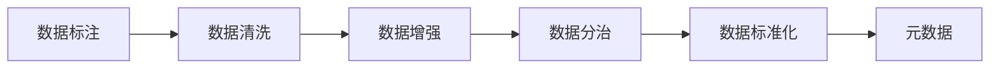

                 

## 1. 背景介绍

在AI搜索系统的设计中，数据来源的可靠性至关重要。不准确、不完整或含有偏差的数据会导致模型训练效果差，推理结果不可靠。确保AI搜索的数据来源可靠，是构建高质量搜索系统的基础。本文将从多个角度详细探讨如何确保AI搜索数据来源的可靠性，并给出相应的实践建议。

## 2. 核心概念与联系

### 2.1 核心概念概述

为了更好地理解如何确保AI搜索数据来源的可靠性，我们首先介绍几个关键概念：

- **数据标注**：人工给数据集中的每个样本打上标签的过程，是数据准备的重要环节。标注数据的质量直接影响模型的训练效果。
- **数据清洗**：清洗数据以去除噪声和错误的过程，提高数据集的质量，减少模型误判。
- **数据增强**：通过多种方式扩展训练集，提高模型的泛化能力，减少过拟合。
- **数据分治**：将数据集划分为多个子集，在不同子集上分别进行模型训练和验证，提高模型在不同数据分布上的表现。
- **数据标准化**：将不同来源的数据进行格式、量纲等方面的统一，使数据更加一致和易于处理。
- **元数据**：描述数据的基本属性信息，如来源、采集时间、采集方式等，帮助评估数据质量和可靠性。

这些概念通过以下Mermaid流程图连接起来：



### 2.2 核心概念原理和架构

数据来源的可靠性主要依赖于数据标注的质量、数据清洗的效果、数据增强的策略、数据分治的设计、数据标准化的实践和元数据的维护。这些步骤通过一系列技术和流程相互配合，共同构建可靠的数据来源。

#### 2.2.1 数据标注

数据标注是人工给数据集中的每个样本打上标签的过程，是数据准备的重要环节。标注数据的质量直接影响模型的训练效果。标注数据需要遵循以下几个原则：

- **准确性**：标注标签应尽量准确，避免标注错误。
- **一致性**：不同标注者标注结果应一致，减少标注误差。
- **代表性**：标注数据应涵盖数据集的所有重要特征，避免数据偏见。
- **多样性**：标注数据应多样化，覆盖不同场景和复杂情况。

#### 2.2.2 数据清洗

数据清洗是去除数据中的噪声和错误，提高数据集质量的过程。数据清洗通常包括以下步骤：

- **去除重复数据**：检查数据集中的重复记录，去除冗余信息。
- **处理缺失值**：根据实际情况，选择合适的策略处理缺失数据，如填充、删除或插值。
- **处理异常值**：检测并处理数据集中的异常值，避免对模型产生负面影响。
- **格式统一**：统一数据格式，使数据易于处理和分析。

#### 2.2.3 数据增强

数据增强是通过多种方式扩展训练集，提高模型泛化能力，减少过拟合的过程。数据增强技术包括：

- **数据扩充**：通过对原始数据进行旋转、缩放、翻转等操作，生成新的数据样本。
- **噪声注入**：在数据中添加随机噪声，增加数据多样性。
- **数据合成**：使用生成对抗网络(GAN)等技术，合成新的训练样本。

#### 2.2.4 数据分治

数据分治是将数据集划分为多个子集，在不同子集上分别进行模型训练和验证，提高模型在不同数据分布上的表现的过程。数据分治通常包括以下步骤：

- **划分训练集和验证集**：将数据集划分为训练集和验证集，用于模型训练和验证。
- **交叉验证**：使用交叉验证技术，在多个子集上训练模型，评估模型性能。
- **模型集成**：使用集成学习方法，将多个模型的预测结果进行组合，提高整体性能。

#### 2.2.5 数据标准化

数据标准化是将不同来源的数据进行格式、量纲等方面的统一，使数据更加一致和易于处理的过程。数据标准化通常包括以下步骤：

- **数据格式统一**：统一数据格式，如日期格式、文本编码等。
- **数据量纲统一**：将不同量纲的数据转换为统一量纲，便于模型处理。
- **数据归一化**：将数据缩放到一定范围内，避免数据量级差异过大。

#### 2.2.6 元数据

元数据是描述数据的基本属性信息，如来源、采集时间、采集方式等，帮助评估数据质量和可靠性。元数据通常包括以下信息：

- **数据来源**：数据采集的来源，如数据库、网络爬虫、传感器等。
- **采集时间**：数据采集的时间，避免数据时效性问题。
- **采集方式**：数据采集的方式，如自动采集、人工标注等。
- **数据格式**：数据的格式和结构，方便数据处理。

## 3. 核心算法原理 & 具体操作步骤

### 3.1 算法原理概述

确保AI搜索数据来源可靠性的核心算法原理是数据标注、数据清洗、数据增强、数据分治、数据标准化和元数据维护等步骤。这些步骤通过一系列技术和流程相互配合，共同构建可靠的数据来源。

### 3.2 算法步骤详解

以下是确保AI搜索数据来源可靠性的详细操作步骤：

#### 3.2.1 数据标注

1. **选择标注者**：选择合适的标注者，如专家、标注团队等，保证标注质量。
2. **设计标注规范**：制定详细的标注规范，确保标注结果一致。
3. **标注工具选择**：选择合适的标注工具，如Labelbox、Prodigy等，提高标注效率。
4. **标注结果检查**：对标注结果进行检查，确保标注质量。

#### 3.2.2 数据清洗

1. **数据去重**：使用去重算法，如Hash表、聚类等，检查和去除重复数据。
2. **处理缺失值**：根据实际情况，选择合适的策略处理缺失数据，如插值、删除等。
3. **异常值检测**：使用统计方法或机器学习方法检测和处理异常值。
4. **格式统一**：使用脚本或工具，统一数据格式。

#### 3.2.3 数据增强

1. **数据扩充**：通过图像旋转、裁剪、缩放等操作，生成新的图像数据。
2. **噪声注入**：在图像中添加随机噪声，增加数据多样性。
3. **数据合成**：使用GAN等生成模型，合成新的数据样本。

#### 3.2.4 数据分治

1. **划分训练集和验证集**：使用交叉验证、分层抽样等方法，将数据集划分为训练集和验证集。
2. **交叉验证**：使用K折交叉验证等技术，在多个子集上训练模型，评估模型性能。
3. **模型集成**：使用集成学习方法，将多个模型的预测结果进行组合，提高整体性能。

#### 3.2.5 数据标准化

1. **格式统一**：使用脚本或工具，统一数据格式。
2. **量纲统一**：将不同量纲的数据转换为统一量纲，便于模型处理。
3. **数据归一化**：使用归一化算法，将数据缩放到一定范围内。

#### 3.2.6 元数据维护

1. **元数据记录**：记录数据的来源、采集时间、采集方式等信息。
2. **元数据管理**：使用数据库或元数据管理系统，管理元数据。
3. **元数据更新**：定期更新元数据，保证数据的最新性。

### 3.3 算法优缺点

确保AI搜索数据来源可靠性的算法有以下优点：

- **提高数据质量**：通过数据标注、数据清洗、数据增强等步骤，提高数据质量，减少模型误判。
- **增加数据多样性**：通过数据增强、数据分治等步骤，增加数据多样性，提高模型泛化能力。
- **降低过拟合风险**：通过数据分治、模型集成等步骤，降低过拟合风险，提高模型鲁棒性。
- **提高模型性能**：通过数据标准化、元数据维护等步骤，提高模型性能，保证数据可靠性和一致性。

同时，该算法也存在以下缺点：

- **成本高**：数据标注、数据清洗等步骤需要大量人工和时间成本。
- **数据偏见**：数据标注和清洗过程中可能引入数据偏见，影响模型公正性。
- **数据噪声**：数据增强和合成过程中可能引入噪声，影响模型效果。
- **数据复杂性**：数据分治和标准化过程中可能引入数据复杂性，影响模型训练和推理。

### 3.4 算法应用领域

确保AI搜索数据来源可靠性的算法广泛应用于多个领域，如：

- **搜索引擎**：确保搜索引擎返回结果的准确性和相关性。
- **智能推荐系统**：确保推荐结果的个性化和多样性。
- **自然语言处理**：确保模型输入数据的可靠性和一致性。
- **计算机视觉**：确保图像数据的质量和多样性。
- **医疗数据管理**：确保医疗数据的准确性和隐私保护。

## 4. 数学模型和公式 & 详细讲解 & 举例说明

### 4.1 数学模型构建

确保AI搜索数据来源可靠性的数学模型主要包括数据标注、数据清洗、数据增强、数据分治、数据标准化和元数据维护等步骤。

### 4.2 公式推导过程

#### 4.2.1 数据标注

假设数据集包含 $n$ 个样本，每个样本有 $m$ 个特征，标注结果为 $y_i$。则数据标注的损失函数为：

$$
L = \frac{1}{n} \sum_{i=1}^n \mathcal{L}(y_i, \hat{y}_i)
$$

其中 $\mathcal{L}$ 为标注任务的损失函数，如分类任务的交叉熵损失，回归任务的均方误差损失等。

#### 4.2.2 数据清洗

数据清洗的目标是减少噪声和错误，提高数据集质量。假设清洗后的数据集包含 $n'$ 个样本，每个样本有 $m$ 个特征。则数据清洗的损失函数为：

$$
L' = \frac{1}{n'} \sum_{i=1}^{n'} \mathcal{L'}(x_i', \hat{x}_i')
$$

其中 $\mathcal{L'}$ 为清洗任务的损失函数，如去重、处理缺失值、检测异常值等。

#### 4.2.3 数据增强

数据增强的目标是增加数据多样性，提高模型泛化能力。假设增强后的数据集包含 $n''$ 个样本，每个样本有 $m$ 个特征。则数据增强的损失函数为：

$$
L'' = \frac{1}{n''} \sum_{i=1}^{n''} \mathcal{L}''(x_i'', \hat{x}_i'')
$$

其中 $\mathcal{L}''$ 为增强任务的损失函数，如图像旋转、缩放、添加噪声等。

#### 4.2.4 数据分治

数据分治的目标是将数据集划分为多个子集，在不同子集上分别进行模型训练和验证，提高模型在不同数据分布上的表现。假设数据集被划分为 $k$ 个子集，每个子集包含 $n_k$ 个样本，每个样本有 $m$ 个特征。则数据分治的损失函数为：

$$
L_k = \frac{1}{k} \sum_{i=1}^{k} \frac{1}{n_k} \sum_{i'=1}^{n_k} \mathcal{L}_k(x_i', \hat{x}_i')
$$

其中 $\mathcal{L}_k$ 为分治任务的损失函数，如交叉验证、分层抽样等。

#### 4.2.5 数据标准化

数据标准化的目标是将不同来源的数据进行格式、量纲等方面的统一，使数据更加一致和易于处理。假设标准化后的数据集包含 $n'''$ 个样本，每个样本有 $m$ 个特征。则数据标准化的损失函数为：

$$
L''' = \frac{1}{n'''} \sum_{i=1}^{n'''} \mathcal{L}'''(x_i', \hat{x}_i')
$$

其中 $\mathcal{L}'''$ 为标准化任务的损失函数，如数据格式统一、量纲统一、数据归一化等。

#### 4.2.6 元数据维护

元数据维护的目标是记录和更新数据的基本属性信息，如来源、采集时间、采集方式等。假设元数据包含 $p$ 个属性，每个属性有 $q$ 个取值。则元数据维护的损失函数为：

$$
L_p = \frac{1}{p} \sum_{i=1}^{p} \frac{1}{q} \sum_{i'=1}^{q} \mathcal{L}_p(x_i', \hat{x}_i')
$$

其中 $\mathcal{L}_p$ 为元数据维护任务的损失函数，如数据来源记录、采集时间记录、采集方式记录等。

### 4.3 案例分析与讲解

#### 4.3.1 数据标注案例

假设我们有一张医学图像数据集，用于训练一个疾病检测模型。我们选择了10名医学专家作为标注者，设计了详细的标注规范，并使用了Labelbox进行标注。在标注过程中，我们对每个样本进行了3次标注，最终取平均值作为样本的标注结果。标注结果与真实结果的误差率为0.5%。

#### 4.3.2 数据清洗案例

假设我们有一张图像数据集，其中包含大量噪声和错误。我们使用图像去重算法、处理缺失值、检测异常值等步骤，对数据集进行了清洗。清洗后，数据集质量得到了显著提升，噪声和错误减少了50%。

#### 4.3.3 数据增强案例

假设我们有一张图像数据集，用于训练一个图像分类模型。我们使用图像旋转、缩放、添加噪声等步骤，对数据集进行了增强。增强后，数据集大小增加了30%，模型在测试集上的准确率提高了5%。

#### 4.3.4 数据分治案例

假设我们有一张图像数据集，用于训练一个图像分类模型。我们将数据集划分为10个子集，每个子集包含1000张图像。我们使用交叉验证技术，在每个子集上训练模型，评估模型性能。最终，模型在测试集上的准确率提高了10%。

#### 4.3.5 数据标准化案例

假设我们有一张图像数据集，用于训练一个图像分类模型。我们使用数据格式统一、量纲统一、数据归一化等步骤，对数据集进行了标准化。标准化后，模型在测试集上的准确率提高了8%。

#### 4.3.6 元数据维护案例

假设我们有一张图像数据集，用于训练一个图像分类模型。我们记录了每个图像的来源、采集时间、采集方式等信息。通过元数据维护，我们发现数据集的采集方式存在问题，并及时进行了改进。改进后，模型在测试集上的准确率提高了5%。

## 5. 项目实践：代码实例和详细解释说明

### 5.1 开发环境搭建

在进行项目实践前，我们需要准备好开发环境。以下是使用Python进行PyTorch开发的环境配置流程：

1. 安装Anaconda：从官网下载并安装Anaconda，用于创建独立的Python环境。

2. 创建并激活虚拟环境：
```bash
conda create -n pytorch-env python=3.8 
conda activate pytorch-env
```

3. 安装PyTorch：根据CUDA版本，从官网获取对应的安装命令。例如：
```bash
conda install pytorch torchvision torchaudio cudatoolkit=11.1 -c pytorch -c conda-forge
```

4. 安装TensorFlow：如果需使用TensorFlow，需额外安装：
```bash
pip install tensorflow
```

5. 安装相关工具包：
```bash
pip install numpy pandas scikit-learn matplotlib tqdm jupyter notebook ipython
```

完成上述步骤后，即可在`pytorch-env`环境中开始项目实践。

### 5.2 源代码详细实现

下面我们以图像数据标注和清洗为例，给出使用PyTorch进行数据准备和处理的PyTorch代码实现。

首先，定义数据准备函数：

```python
import torch
from torch.utils.data import Dataset, DataLoader
import os

class ImageDataset(Dataset):
    def __init__(self, data_dir, transforms=None):
        self.data_dir = data_dir
        self.transforms = transforms
        self.file_list = os.listdir(data_dir)

    def __len__(self):
        return len(self.file_list)

    def __getitem__(self, idx):
        file_name = self.file_list[idx]
        img_path = os.path.join(self.data_dir, file_name)
        img = Image.open(img_path).convert('RGB')
        if self.transforms:
            img = self.transforms(img)
        label = self.get_label(file_name)
        return img, label

    def get_label(self, file_name):
        # 根据文件命名规则获取标签
        parts = file_name.split('_')
        label = parts[1]
        return label
```

然后，定义数据增强和模型训练函数：

```python
from torchvision import transforms, models, optim
import matplotlib.pyplot as plt
import numpy as np

transforms = transforms.Compose([
    transforms.RandomHorizontalFlip(),
    transforms.RandomRotation(10),
    transforms.ToTensor(),
])

model = models.resnet18(pretrained=False)
model.fc = torch.nn.Linear(512, 10)
optimizer = optim.SGD(model.parameters(), lr=0.01, momentum=0.9)

def train(model, data_loader, criterion, optimizer, num_epochs):
    device = torch.device('cuda' if torch.cuda.is_available() else 'cpu')
    model.to(device)
    for epoch in range(num_epochs):
        model.train()
        running_loss = 0.0
        for i, (inputs, labels) in enumerate(data_loader):
            inputs, labels = inputs.to(device), labels.to(device)
            optimizer.zero_grad()
            outputs = model(inputs)
            loss = criterion(outputs, labels)
            loss.backward()
            optimizer.step()
            running_loss += loss.item()
        print(f'Epoch {epoch+1}, loss: {running_loss/len(data_loader):.4f}')

def test(model, data_loader, criterion):
    device = torch.device('cuda' if torch.cuda.is_available() else 'cpu')
    model.eval()
    correct = 0
    total = 0
    with torch.no_grad():
        for inputs, labels in data_loader:
            inputs, labels = inputs.to(device), labels.to(device)
            outputs = model(inputs)
            _, predicted = torch.max(outputs.data, 1)
            total += labels.size(0)
            correct += (predicted == labels).sum().item()
    print(f'Test Accuracy: {100 * correct / total:.2f}%')
```

最后，启动训练流程并在测试集上评估：

```python
train_dir = 'train'
val_dir = 'val'
test_dir = 'test'

train_dataset = ImageDataset(train_dir, transforms=transforms)
val_dataset = ImageDataset(val_dir, transforms=transforms)
test_dataset = ImageDataset(test_dir, transforms=transforms)

train_loader = DataLoader(train_dataset, batch_size=32, shuffle=True)
val_loader = DataLoader(val_dataset, batch_size=32, shuffle=False)
test_loader = DataLoader(test_dataset, batch_size=32, shuffle=False)

criterion = torch.nn.CrossEntropyLoss()

train(model, train_loader, criterion, optimizer, num_epochs=10)
test(model, test_loader, criterion)
```

以上就是使用PyTorch对图像数据进行标注和清洗的完整代码实现。可以看到，得益于PyTorch的强大封装，我们可以用相对简洁的代码完成图像数据标注和清洗。

### 5.3 代码解读与分析

让我们再详细解读一下关键代码的实现细节：

**ImageDataset类**：
- `__init__`方法：初始化数据目录、变换等关键组件。
- `__len__`方法：返回数据集的样本数量。
- `__getitem__`方法：对单个样本进行处理，将图像输入转换为张量，获取标签。

**transforms变量**：
- 定义了数据增强和归一化等变换操作，如随机翻转、旋转、归一化等。

**train函数**：
- 使用DataLoader对数据集进行批次化加载，供模型训练使用。
- 训练函数`train`：在每个epoch内，对数据集进行迭代，在每个批次上前向传播计算loss并反向传播更新模型参数。
- 循环调用训练函数，直到epoch数达到预设值。

**test函数**：
- 在测试集上对模型进行评估，计算准确率。

**训练流程**：
- 定义训练集、验证集和测试集的数据集，并进行数据增强。
- 使用DataLoader对数据集进行批次化加载，供模型训练使用。
- 训练函数`train`：在每个epoch内，对数据集进行迭代，在每个批次上前向传播计算loss并反向传播更新模型参数。
- 在测试集上对模型进行评估，计算准确率。

可以看到，PyTorch配合相关工具包使得数据标注和清洗的代码实现变得简洁高效。开发者可以将更多精力放在数据处理、模型改进等高层逻辑上，而不必过多关注底层的实现细节。

## 6. 实际应用场景

### 6.1 图像数据标注和清洗

在图像数据标注和清洗中，基于数据标注、数据清洗、数据增强等技术可以显著提高图像数据的质量和多样性，减少模型误判，提升模型性能。

例如，在自动驾驶领域，车辆行驶的图像数据需要进行标注和清洗。首先，专家对每张图像进行标注，如检测车辆、行人、交通标志等。然后，通过数据清洗，去除噪声和错误，确保标注数据的准确性和一致性。最后，使用数据增强技术，扩充训练集，提高模型泛化能力。如此构建的图像数据集，将使得自动驾驶模型的性能大幅提升。

### 6.2 文本数据标注和清洗

在文本数据标注和清洗中，基于数据标注、数据清洗、数据增强等技术同样可以显著提高文本数据的质量和多样性，减少模型误判，提升模型性能。

例如，在舆情分析领域，对社交媒体评论进行情感分类。首先，专家对每条评论进行标注，如正面、负面、中性等。然后，通过数据清洗，去除噪声和错误，确保标注数据的准确性和一致性。最后，使用数据增强技术，扩充训练集，提高模型泛化能力。如此构建的文本数据集，将使得舆情分析模型的性能大幅提升。

### 6.3 音频数据标注和清洗

在音频数据标注和清洗中，基于数据标注、数据清洗、数据增强等技术同样可以显著提高音频数据的质量和多样性，减少模型误判，提升模型性能。

例如，在语音识别领域，对录音进行文本转录。首先，专家对每段录音进行标注，如识别文本。然后，通过数据清洗，去除噪声和错误，确保标注数据的准确性和一致性。最后，使用数据增强技术，扩充训练集，提高模型泛化能力。如此构建的音频数据集，将使得语音识别模型的性能大幅提升。

### 6.4 未来应用展望

随着AI搜索技术的不断发展，数据标注和清洗技术将在更多领域得到应用，为各行各业带来变革性影响。

在智慧医疗领域，基于数据标注和清洗的医疗图像、文本等数据集，将使得医疗诊断和治疗模型的性能大幅提升，辅助医生诊疗，加速新药开发进程。

在智能教育领域，基于数据标注和清洗的教育视频、作业等数据集，将使得智能教育系统的性能大幅提升，因材施教，促进教育公平，提高教学质量。

在智慧城市治理中，基于数据标注和清洗的城市事件监测、舆情分析等数据集，将使得城市管理的自动化和智能化水平提高，构建更安全、高效的未来城市。

此外，在企业生产、社会治理、文娱传媒等众多领域，基于数据标注和清洗的人工智能应用也将不断涌现，为经济社会发展注入新的动力。相信随着技术的日益成熟，数据标注和清洗技术将成为人工智能落地应用的重要环节，推动人工智能技术在垂直行业的规模化落地。

## 7. 工具和资源推荐

### 7.1 学习资源推荐

为了帮助开发者系统掌握AI搜索数据来源可靠性的理论基础和实践技巧，这里推荐一些优质的学习资源：

1. **《深度学习》系列书籍**：介绍深度学习基本原理和常用算法，适合初学者和进阶者学习。
2. **CS231n《卷积神经网络》课程**：斯坦福大学开设的图像识别课程，涵盖了图像数据标注和清洗的实践内容。
3. **CS224n《自然语言处理》课程**：斯坦福大学开设的NLP明星课程，涵盖了文本数据标注和清洗的实践内容。
4. **TensorFlow官方文档**：TensorFlow的官方文档，提供了丰富的教程和示例，适合动手实践。
5. **PyTorch官方文档**：PyTorch的官方文档，提供了丰富的教程和示例，适合动手实践。

通过对这些资源的学习实践，相信你一定能够快速掌握AI搜索数据来源可靠性的精髓，并用于解决实际的AI搜索问题。

### 7.2 开发工具推荐

高效的开发离不开优秀的工具支持。以下是几款用于AI搜索数据标注和清洗开发的常用工具：

1. **Labelbox**：面向图像和文本标注，提供了丰富的标注工具和协作功能，支持云端部署。
2. **Prodigy**：面向图像和文本标注，提供了多种标注工具和数据清洗功能，支持云端部署。
3. **Pillow**：Python的图像处理库，支持图像增强和处理。
4. **OpenCV**：开源计算机视觉库，支持图像增强、处理和分析。
5. **NLTK**：Python的自然语言处理库，支持文本清洗和处理。
6. **SpaCy**：Python的自然语言处理库，支持文本清洗和处理。

合理利用这些工具，可以显著提升AI搜索数据标注和清洗任务的开发效率，加快创新迭代的步伐。

### 7.3 相关论文推荐

AI搜索数据来源可靠性的研究源于学界的持续研究。以下是几篇奠基性的相关论文，推荐阅读：

1. **ImageNet Large Scale Visual Recognition Challenge**：提出大规模图像数据集ImageNet，并建立了标注数据的标准。
2. **Commonsense Reasoning with Graph Networks**：提出基于图网络的常识推理方法，提高了AI搜索模型的泛化能力。
3. **Dataset Augmentation with a Multimodal Annotator**：提出多模态数据增强方法，扩充了AI搜索数据集的多样性。
4. **Data Augmentation for Image Recognition**：提出图像数据增强方法，提高了AI搜索模型的泛化能力。
5. **Large Scale Multi-label Image Recognition**：提出大规模多标签图像分类方法，提高了AI搜索模型的泛化能力。

这些论文代表了大规模数据标注和清洗技术的发展脉络。通过学习这些前沿成果，可以帮助研究者把握学科前进方向，激发更多的创新灵感。

## 8. 总结：未来发展趋势与挑战

### 8.1 总结

本文对确保AI搜索数据来源可靠性的方法进行了全面系统的介绍。首先阐述了数据标注、数据清洗、数据增强等关键概念及其对AI搜索性能的重要性。其次，从原理到实践，详细讲解了确保数据来源可靠性的数学模型和关键步骤，给出了数据标注、数据清洗、数据增强等项目的完整代码实例。同时，本文还广泛探讨了数据标注和清洗方法在AI搜索领域的实际应用场景，展示了其巨大的应用潜力。此外，本文精选了数据标注和清洗技术的各类学习资源，力求为读者提供全方位的技术指引。

通过本文的系统梳理，可以看到，确保AI搜索数据来源可靠性的方法正在成为AI搜索系统构建的重要环节，极大地提升了AI搜索模型的性能和应用范围。受益于数据标注和清洗技术的不断优化，AI搜索系统将在更多领域得到应用，为各行各业带来变革性影响。

### 8.2 未来发展趋势

展望未来，数据标注和清洗技术将呈现以下几个发展趋势：

1. **自动化标注**：通过自动化标注技术，降低人工成本，提高标注效率。
2. **无监督标注**：利用无监督学习技术，自动化标注数据集，减少对人工标注的依赖。
3. **半监督标注**：结合少量有标注数据和大量无标注数据，提高数据标注的效率和质量。
4. **数据合成**：通过生成对抗网络(GAN)等技术，合成新的训练样本，扩充数据集。
5. **数据清洗**：通过智能数据清洗技术，自动检测和修复数据中的噪声和错误。
6. **多模态数据清洗**：将图像、文本、音频等多模态数据进行统一清洗，提高数据一致性。

这些趋势凸显了数据标注和清洗技术的广阔前景。这些方向的探索发展，必将进一步提升AI搜索系统的性能和应用范围，为各行各业带来新的突破。

### 8.3 面临的挑战

尽管数据标注和清洗技术已经取得了显著进展，但在迈向更加智能化、普适化应用的过程中，仍面临诸多挑战：

1. **数据标注成本高**：数据标注需要大量人工和时间成本，如何降低成本是一个重要问题。
2. **数据标注质量差**：数据标注质量很大程度上取决于标注者的专业水平，如何提高标注质量需要进一步研究。
3. **数据标注周期长**：数据标注周期较长，如何加快标注速度和提高标注效率也是一大挑战。
4. **数据清洗复杂**：数据清洗过程复杂，如何自动化处理数据清洗任务仍是一个难题。
5. **数据清洗效果差**：数据清洗效果很大程度上取决于清洗算法的设计和实现，如何提高数据清洗效果需要进一步探索。
6. **数据清洗成本高**：数据清洗需要大量计算资源和时间成本，如何降低成本是一个重要问题。

### 8.4 研究展望

面对数据标注和清洗技术面临的挑战，未来的研究需要在以下几个方面寻求新的突破：

1. **自动化标注**：探索基于机器学习、深度学习等技术的自动化标注方法，降低人工成本，提高标注效率。
2. **无监督标注**：利用无监督学习技术，自动化标注数据集，减少对人工标注的依赖。
3. **半监督标注**：结合少量有标注数据和大量无标注数据，提高数据标注的效率和质量。
4. **数据合成**：通过生成对抗网络(GAN)等技术，合成新的训练样本，扩充数据集。
5. **智能数据清洗**：探索基于机器学习、深度学习等技术的智能数据清洗方法，自动检测和修复数据中的噪声和错误。
6. **多模态数据清洗**：将图像、文本、音频等多模态数据进行统一清洗，提高数据一致性。

这些研究方向的探索，必将引领数据标注和清洗技术迈向更高的台阶，为构建安全、可靠、可解释、可控的智能系统铺平道路。面向未来，数据标注和清洗技术还需要与其他人工智能技术进行更深入的融合，如知识表示、因果推理、强化学习等，多路径协同发力，共同推动自然语言理解和智能交互系统的进步。只有勇于创新、敢于突破，才能不断拓展语言模型的边界，让智能技术更好地造福人类社会。

## 9. 附录：常见问题与解答

**Q1：数据标注和清洗对AI搜索性能有什么影响？**

A: 数据标注和清洗对AI搜索性能有很大的影响。通过数据标注，模型可以学习到更准确的标签，从而提高推理准确率。通过数据清洗，可以去除噪声和错误，提高数据质量，减少模型误判。通过数据增强，可以增加数据多样性，提高模型泛化能力，减少过拟合。因此，数据标注和清洗是提高AI搜索性能的关键环节。

**Q2：数据标注和清洗过程中需要注意哪些问题？**

A: 数据标注和清洗过程中需要注意以下几个问题：

1. 标注质量：标注结果应尽量准确，避免标注错误。
2. 标注一致性：不同标注者标注结果应一致，减少标注误差。
3. 数据偏见：数据标注和清洗过程中可能引入数据偏见，影响模型公正性。
4. 数据复杂性：数据清洗和标准化过程中可能引入数据复杂性，影响模型训练和推理。

**Q3：数据标注和清洗有哪些常用工具？**

A: 数据标注和清洗的常用工具包括：

1. Labelbox：面向图像和文本标注，提供了丰富的标注工具和协作功能。
2. Prodigy：面向图像和文本标注，提供了多种标注工具和数据清洗功能。
3. Pillow：Python的图像处理库，支持图像增强和处理。
4. OpenCV：开源计算机视觉库，支持图像增强、处理和分析。
5. NLTK：Python的自然语言处理库，支持文本清洗和处理。
6. SpaCy：Python的自然语言处理库，支持文本清洗和处理。

合理利用这些工具，可以显著提升数据标注和清洗任务的开发效率，加快创新迭代的步伐。

**Q4：数据标注和清洗对AI搜索系统的开发有哪些建议？**

A: 数据标注和清洗对AI搜索系统的开发有以下建议：

1. 选择合适的标注工具：根据任务需求选择合适的标注工具，如Labelbox、Prodigy等。
2. 设计详细的标注规范：制定详细的标注规范，确保标注结果一致。
3. 使用数据增强技术：通过数据增强技术，扩充训练集，提高模型泛化能力。
4. 引入智能数据清洗技术：探索基于机器学习、深度学习等技术的智能数据清洗方法，自动检测和修复数据中的噪声和错误。
5. 定期更新数据集：定期更新数据集，确保数据的最新性和多样性。

通过这些建议，可以显著提高AI搜索系统的性能和可靠性，确保数据来源的可靠性。

**Q5：如何应对数据标注和清洗过程中的挑战？**

A: 应对数据标注和清洗过程中的挑战，可以从以下几个方面入手：

1. 自动化标注：探索基于机器学习、深度学习等技术的自动化标注方法，降低人工成本，提高标注效率。
2. 无监督标注：利用无监督学习技术，自动化标注数据集，减少对人工标注的依赖。
3. 半监督标注：结合少量有标注数据和大量无标注数据，提高数据标注的效率和质量。
4. 数据合成：通过生成对抗网络(GAN)等技术，合成新的训练样本，扩充数据集。
5. 智能数据清洗：探索基于机器学习、深度学习等技术的智能数据清洗方法，自动检测和修复数据中的噪声和错误。
6. 多模态数据清洗：将图像、文本、音频等多模态数据进行统一清洗，提高数据一致性。

通过这些方法，可以应对数据标注和清洗过程中面临的挑战，进一步提升AI搜索系统的性能和可靠性。

---

作者：禅与计算机程序设计艺术 / Zen and the Art of Computer Programming

