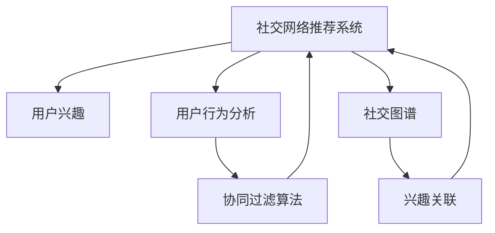

                 

# 社交网络推荐：连接用户兴趣

> 关键词：社交网络推荐, 用户兴趣, 用户行为分析, 社交图谱, 协同过滤算法, 兴趣关联, 推荐系统, 算法优化

## 1. 背景介绍

### 1.1 问题由来
随着社交网络的蓬勃发展，用户生成内容（UGC）的爆炸式增长，个性化推荐系统在社交媒体平台中的应用越来越广泛。推荐系统不仅能帮助用户发现可能感兴趣的内容，还能优化用户体验，提升平台留存率。然而，由于用户兴趣的高度个性化和动态变化，传统推荐方法难以应对社交网络中的复杂交互关系，导致推荐效果不尽如人意。如何构建一个能更好地理解用户兴趣和社交关系，从而提供精准推荐内容的社交网络推荐系统，成为了当前研究的热点问题。

### 1.2 问题核心关键点
社交网络推荐系统面临的关键问题包括：
- 如何刻画用户和社交网络中的复杂关系。
- 如何高效准确地分析用户兴趣。
- 如何优化推荐算法，提高推荐效果。
- 如何平衡推荐效果和计算效率。

这些问题不仅涉及计算模型和算法设计，还涉及到数据挖掘、机器学习、数据结构等诸多学科知识。因此，本文将全面介绍社交网络推荐的理论基础和实践技巧，希望为相关研究和应用提供一些参考。

## 2. 核心概念与联系

### 2.1 核心概念概述

为更好地理解社交网络推荐系统的构建，本节将介绍几个密切相关的核心概念：

- **社交网络推荐系统(Social Network Recommendation System)**：通过分析用户行为和社交关系，为用户推荐可能感兴趣的内容或用户的推荐系统。
- **用户兴趣(User Interest)**：用户对某些内容或用户的偏好和兴趣倾向。
- **用户行为分析(User Behavior Analysis)**：通过分析用户在平台上的行为数据，如浏览、点赞、评论等，挖掘用户兴趣。
- **社交图谱(Social Graph)**：由用户和用户之间的关系构成的图，用于描述用户之间的互动关系。
- **协同过滤算法(Collaborative Filtering)**：一种基于用户和项目相似性进行推荐的算法，包括基于用户的协同过滤和基于项目的协同过滤。
- **兴趣关联(Interest Association)**：通过分析用户行为和社交图谱，建立用户兴趣间的关联，用于提升推荐效果。

这些核心概念之间的逻辑关系可以通过以下Mermaid流程图来展示：



这个流程图展示了这个系统的主要组件及其之间的关系：

1. 社交网络推荐系统通过分析用户行为和社交图谱，计算用户兴趣。
2. 协同过滤算法根据用户和项目的相似性进行推荐。
3. 兴趣关联通过挖掘用户兴趣之间的关系，提升推荐效果。

## 3. 核心算法原理 & 具体操作步骤
### 3.1 算法原理概述

社交网络推荐系统的核心在于通过分析用户行为和社交图谱，挖掘用户兴趣，进而构建推荐模型。其基本流程可以概括为以下四个步骤：

1. **用户兴趣建模**：通过用户行为分析，构建用户兴趣模型。
2. **社交图谱建模**：建立用户和用户之间的关系图，表示用户之间的互动关系。
3. **推荐算法设计**：设计高效的推荐算法，结合用户兴趣和社交图谱，生成推荐结果。
4. **系统部署与优化**：将推荐算法集成到实际应用中，并进行持续优化和迭代。

### 3.2 算法步骤详解

#### 3.2.1 用户兴趣建模

用户兴趣建模的目的是通过用户行为数据，构建用户兴趣表示。一种常见的用户兴趣建模方法是通过隐语义分析，将用户的行为序列表示为低维向量，从而捕捉用户兴趣的多维特征。以基于隐语义的用户兴趣建模为例，基本步骤如下：

1. **构建用户行为矩阵**：将用户的行为数据表示为矩阵形式，每行代表一个用户，每列代表一个项目（如文章、视频、用户等），用户对项目的行为（如点击、点赞、评论等）以数值形式存储在矩阵中。

2. **构建用户-项目共现矩阵**：将用户行为矩阵中非零元素的行与列分别合并为用户的兴趣向量和项目的特征向量。

3. **隐语义分解**：使用隐语义分析算法（如奇异值分解、交替最小二乘法等），将用户-项目共现矩阵分解为用户兴趣向量和项目特征向量的低维表示。

4. **兴趣表示**：将用户兴趣向量的低维表示作为用户兴趣的最终表示，用于后续的推荐算法。

#### 3.2.2 社交图谱建模

社交图谱建模的目的是建立用户和用户之间的关系图，表示用户之间的互动关系。一种常见的社交图谱建模方法是通过用户行为数据，构建用户-用户关系图，并在此基础上进行社交网络分析。以基于图嵌入的社交图谱建模为例，基本步骤如下：

1. **构建用户-用户关系图**：根据用户之间的互动关系（如好友、关注、点赞等）构建用户-用户关系图，每条边表示两个用户之间的互动关系。

2. **图嵌入表示**：使用图嵌入算法（如节点嵌入算法、图卷积网络等），将用户-用户关系图转化为用户的低维嵌入表示。

3. **社交图谱表示**：将用户嵌入表示存储为矩阵形式，用于后续的推荐算法。

#### 3.2.3 推荐算法设计

推荐算法设计的目的是结合用户兴趣和社交图谱，生成推荐结果。一种常见的推荐算法是基于协同过滤的推荐算法，包括基于用户的协同过滤和基于项目的协同过滤。以基于用户的协同过滤算法为例，基本步骤如下：

1. **构建用户-用户相似度矩阵**：根据用户兴趣向量和用户嵌入表示，计算用户之间的相似度矩阵。

2. **预测用户兴趣**：将相似度矩阵乘以用户兴趣向量，得到预测用户兴趣向量。

3. **推荐结果生成**：根据预测用户兴趣向量，推荐最相关的项目给用户。

#### 3.2.4 系统部署与优化

系统部署与优化的目的是将推荐算法集成到实际应用中，并进行持续优化和迭代。一种常见的系统部署方式是将推荐算法嵌入到推荐系统中，并通过A/B测试等方式，不断优化算法参数和模型结构。以基于机器学习的推荐系统为例，基本步骤如下：

1. **集成推荐算法**：将基于机器学习的推荐算法嵌入到推荐系统中，并进行系统架构设计。

2. **实时推荐**：根据用户行为和社交图谱，实时生成推荐结果，并推送给用户。

3. **系统优化**：通过A/B测试等方式，不断优化推荐算法和系统架构，提高推荐效果和系统性能。

### 3.3 算法优缺点

社交网络推荐算法具有以下优点：
- 能够充分利用用户行为数据，挖掘用户兴趣和社交关系。
- 结合用户行为和社交图谱，能够提高推荐效果。
- 能够实时生成推荐结果，提高用户体验。

同时，社交网络推荐算法也存在一定的局限性：
- 用户行为数据往往具有稀疏性，导致模型难以捕捉用户兴趣的多样性。
- 社交图谱建模复杂，需要大量计算资源。
- 推荐算法复杂度高，计算效率低。

尽管存在这些局限性，但就目前而言，基于协同过滤的推荐算法仍是目前应用最为广泛的社交网络推荐算法，具有显著的推荐效果。未来相关研究的重点在于如何进一步提高推荐算法的计算效率和模型泛化能力，同时兼顾推荐效果和计算效率的平衡。

### 3.4 算法应用领域

社交网络推荐算法已经广泛应用于各种社交媒体平台，例如：

- 微博：通过分析用户的行为数据和社交关系，为用户推荐可能感兴趣的新闻、图片、视频等内容。
- 微信朋友圈：根据用户好友关系和点赞、评论等互动行为，为用户推荐可能感兴趣的朋友动态和内容。
- 抖音：通过分析用户的视频观看行为和点赞互动，为用户推荐可能感兴趣的视频内容。
- 豆瓣：根据用户评分和评论，为用户推荐可能感兴趣的电影、书籍和音乐等。

除了这些经典应用外，社交网络推荐算法还被创新性地应用到更多场景中，如知识图谱推荐、社交关系推荐、兴趣相似度推荐等，为社交媒体平台的推荐系统带来了新的突破。随着推荐算法的不断进步，相信社交媒体平台将能够更好地满足用户需求，提高用户体验和平台留存率。

## 4. 数学模型和公式 & 详细讲解 & 举例说明

### 4.1 数学模型构建

社交网络推荐系统的数学模型主要包括用户兴趣模型和社交图谱模型。以下分别对这两种模型进行数学建模。

#### 4.1.1 用户兴趣模型

以基于隐语义的用户兴趣模型为例，设用户行为矩阵为 $U$，用户-项目共现矩阵为 $X$，用户兴趣向量为 $\mathbf{u}$，用户嵌入表示为 $\mathbf{u}_e$。其数学模型为：

$$
\begin{aligned}
\min_{\mathbf{u},\mathbf{u}_e} &\|U-X\mathbf{u}_e\|_F^2 \\
\text{subject to} & \mathbf{u}=\mathbf{u}_eW
\end{aligned}
$$

其中 $W$ 为投影矩阵，$\|.\|_F$ 为矩阵的 Frobenius 范数。

#### 4.1.2 社交图谱模型

以基于图嵌入的社交图谱模型为例，设用户嵌入表示矩阵为 $A$，用户-用户相似度矩阵为 $S$，用户嵌入表示为 $\mathbf{u}_g$，用户嵌入表示矩阵为 $B$。其数学模型为：

$$
\min_{\mathbf{u}_g,B} \|A-SB\|_F^2
$$

其中 $S$ 为用户-用户相似度矩阵，$B$ 为投影矩阵。

### 4.2 公式推导过程

#### 4.2.1 用户兴趣模型推导

根据用户兴趣模型的数学模型，通过奇异值分解算法（SVD）进行求解。设用户兴趣矩阵为 $U$，用户-项目共现矩阵为 $X$，用户兴趣向量为 $\mathbf{u}$，用户嵌入表示为 $\mathbf{u}_e$。其求解过程如下：

1. 将用户-项目共现矩阵 $X$ 进行奇异值分解，得到用户兴趣矩阵 $U$ 和用户嵌入表示矩阵 $V$。

2. 计算用户嵌入表示 $\mathbf{u}_e$，即 $\mathbf{u}_e=V^TX$。

3. 计算用户兴趣向量 $\mathbf{u}$，即 $\mathbf{u}=\mathbf{u}_eW$。

其中 $W$ 为投影矩阵，可以通过奇异值分解得到的奇异值向量来构建。

#### 4.2.2 社交图谱模型推导

根据社交图谱模型的数学模型，通过图嵌入算法（如节点嵌入算法）进行求解。设用户嵌入表示矩阵为 $A$，用户-用户相似度矩阵为 $S$，用户嵌入表示为 $\mathbf{u}_g$，用户嵌入表示矩阵为 $B$。其求解过程如下：

1. 将用户-用户相似度矩阵 $S$ 进行图嵌入，得到用户嵌入表示矩阵 $A$。

2. 计算用户嵌入表示 $\mathbf{u}_g$，即 $\mathbf{u}_g=A_{\text{top}}$，其中 $A_{\text{top}}$ 为 $A$ 的前几行。

3. 计算用户嵌入表示矩阵 $B$，即 $B=A^T$。

其中 $A$ 可以通过节点嵌入算法得到的嵌入表示来构建，$A_{\text{top}}$ 可以通过取 $A$ 的前几行来计算。

### 4.3 案例分析与讲解

#### 4.3.1 用户兴趣建模案例

假设我们有一份用户行为数据集，记录了每个用户对每个项目的点击次数。我们希望构建用户兴趣向量 $\mathbf{u}$，用于后续的推荐算法。

1. 首先，将用户行为数据表示为矩阵 $U$。

2. 然后，将用户-项目共现矩阵 $X$ 进行奇异值分解，得到用户兴趣矩阵 $U$ 和用户嵌入表示矩阵 $V$。

3. 计算用户嵌入表示 $\mathbf{u}_e$，即 $\mathbf{u}_e=V^TX$。

4. 计算用户兴趣向量 $\mathbf{u}$，即 $\mathbf{u}=\mathbf{u}_eW$。

#### 4.3.2 社交图谱建模案例

假设我们有一份用户-用户关系数据集，记录了每个用户关注的其他用户列表。我们希望构建用户嵌入表示矩阵 $A$，用于后续的推荐算法。

1. 首先，将用户-用户关系数据表示为相似度矩阵 $S$。

2. 然后，将相似度矩阵 $S$ 进行图嵌入，得到用户嵌入表示矩阵 $A$。

3. 计算用户嵌入表示 $\mathbf{u}_g$，即 $\mathbf{u}_g=A_{\text{top}}$。

4. 计算用户嵌入表示矩阵 $B$，即 $B=A^T$。

## 5. 项目实践：代码实例和详细解释说明

### 5.1 开发环境搭建

在进行社交网络推荐系统的开发之前，我们需要准备好开发环境。以下是使用Python进行Scikit-learn和PyTorch开发的环境配置流程：

1. 安装Anaconda：从官网下载并安装Anaconda，用于创建独立的Python环境。

2. 创建并激活虚拟环境：
```bash
conda create -n recommendation-env python=3.8 
conda activate recommendation-env
```

3. 安装PyTorch和Scikit-learn：
```bash
conda install pytorch torchvision torchaudio scikit-learn
```

4. 安装相关的第三方库：
```bash
pip install numpy pandas matplotlib networkx
```

完成上述步骤后，即可在`recommendation-env`环境中开始开发社交网络推荐系统。

### 5.2 源代码详细实现

下面我们以基于协同过滤的用户兴趣建模为例，给出使用Scikit-learn进行用户兴趣建模的Python代码实现。

首先，定义用户行为矩阵和用户-项目共现矩阵：

```python
import numpy as np
from sklearn.decomposition import TruncatedSVD

# 假设用户行为矩阵为 1000x1000
U = np.random.rand(1000, 1000)

# 假设用户-项目共现矩阵为 1000x100
X = np.random.rand(1000, 100)

# 构建用户-项目共现矩阵
X_coo = X.tocoo()

# 计算用户-项目共现矩阵的稀疏矩阵表示
X_csr = X_coo.tocsr()
```

然后，定义用户兴趣模型：

```python
# 使用TruncatedSVD进行奇异值分解
svd = TruncatedSVD(n_components=50)

# 计算用户兴趣向量
u = svd.fit_transform(X_csr)
```

接下来，定义社交图谱模型：

```python
# 假设用户-用户相似度矩阵为 1000x1000
S = np.random.rand(1000, 1000)

# 将用户-用户相似度矩阵进行图嵌入，得到用户嵌入表示矩阵
A = TruncatedSVD(n_components=50).fit_transform(S)
```

最后，生成推荐结果：

```python
# 计算用户嵌入表示矩阵的顶部行，即用户嵌入表示
u_g = A[:, :50]

# 计算用户嵌入表示矩阵的转置，即用户嵌入表示
B = A.T

# 输出用户兴趣向量
print(u)

# 输出用户嵌入表示矩阵
print(A)

# 输出用户嵌入表示矩阵的顶部行
print(u_g)

# 输出用户嵌入表示矩阵的转置
print(B)
```

以上就是使用Scikit-learn进行社交网络推荐系统的用户兴趣建模和社交图谱建模的完整代码实现。可以看到，Scikit-learn提供了丰富的机器学习算法，使得社交网络推荐系统的开发变得简洁高效。

### 5.3 代码解读与分析

让我们再详细解读一下关键代码的实现细节：

**用户行为矩阵和用户-项目共现矩阵**：
- 使用NumPy生成随机矩阵，模拟用户行为数据和用户-项目共现数据。
- 使用Scikit-learn的`to_coo`和`tocsr`方法，将稀疏矩阵转换为Coo和Csr格式，方便后续计算。

**用户兴趣模型**：
- 使用Scikit-learn的`TruncatedSVD`类，进行奇异值分解。
- 使用`fit_transform`方法，将用户-项目共现矩阵转换为用户兴趣向量。

**社交图谱模型**：
- 使用Scikit-learn的`TruncatedSVD`类，进行图嵌入。
- 使用`fit_transform`方法，将用户-用户相似度矩阵转换为用户嵌入表示矩阵。

**推荐结果生成**：
- 使用`A[:, :50]`获取用户嵌入表示矩阵的顶部行，即用户嵌入表示。
- 使用`A.T`获取用户嵌入表示矩阵的转置，即用户嵌入表示矩阵。

可以看到，Scikit-learn使得社交网络推荐系统的代码实现变得简洁高效。开发者可以将更多精力放在数据处理、模型改进等高层逻辑上，而不必过多关注底层的实现细节。

当然，工业级的系统实现还需考虑更多因素，如模型的保存和部署、超参数的自动搜索、更灵活的任务适配层等。但核心的社交网络推荐范式基本与此类似。

## 6. 实际应用场景
### 6.1 智能推荐系统

基于社交网络推荐系统的推荐算法已经广泛应用于各种智能推荐系统中，例如：

- 电商平台：根据用户浏览、点击、购买等行为数据，为用户推荐可能感兴趣的商品。
- 新闻平台：根据用户阅读、点赞、评论等行为数据，为用户推荐可能感兴趣的新闻。
- 视频平台：根据用户观看、点赞、评论等行为数据，为用户推荐可能感兴趣的视频内容。
- 音乐平台：根据用户听歌、收藏、分享等行为数据，为用户推荐可能感兴趣的音乐。

除了这些经典应用外，社交网络推荐算法还被创新性地应用到更多场景中，如个性化广告推荐、社交关系推荐、兴趣相似度推荐等，为智能推荐系统带来了新的突破。随着推荐算法的不断进步，相信智能推荐系统将能够更好地满足用户需求，提高用户体验和系统留存率。

### 6.2 社交网络分析

社交网络推荐系统不仅用于推荐系统，还能用于社交网络分析，例如：

- 社交关系预测：根据用户之间的关系数据，预测用户之间的互动关系。
- 用户行为分析：分析用户的行为数据，挖掘用户的兴趣和行为模式。
- 社区发现：发现社交网络中的社区结构，挖掘潜在的用户群体。

这些应用为社交网络分析带来了新的思路和方法，有助于更好地理解社交网络的行为模式和结构特征。

### 6.3 未来应用展望

随着社交网络推荐系统的不断发展，未来的应用场景将更加丰富和多样。以下列举几个未来可能的应用方向：

1. **多模态推荐系统**：结合文本、图像、视频等多模态数据，提升推荐效果和用户体验。

2. **动态推荐系统**：根据用户行为和社交图谱的实时变化，动态调整推荐结果，提高推荐的时效性。

3. **联邦学习**：在保护用户隐私的前提下，通过联邦学习技术，实现跨平台数据协同，提升推荐效果。

4. **个性化推荐引擎**：结合用户行为数据、社交图谱和推荐算法，构建高度个性化的推荐引擎，满足不同用户的需求。

5. **跨领域推荐系统**：结合不同领域的推荐算法和数据，构建跨领域推荐系统，为用户提供更广泛的推荐内容。

这些方向的应用将进一步拓展社交网络推荐系统的边界，提升推荐系统的性能和应用范围，为用户提供更好的个性化推荐服务。

## 7. 工具和资源推荐
### 7.1 学习资源推荐

为了帮助开发者系统掌握社交网络推荐系统的理论基础和实践技巧，这里推荐一些优质的学习资源：

1. 《推荐系统实战》系列博文：由社交网络推荐专家撰写，深入浅出地介绍了推荐系统的原理和算法，适用于初学者和进阶者。

2. 《推荐系统》书籍：清华大学出版社的推荐系统经典教材，涵盖了推荐系统的基础知识和经典算法，适合深入学习。

3. 《Python社交网络分析》书籍：介绍了社交网络分析的原理和Python实现，结合实际案例，帮助开发者掌握社交网络分析技术。

4. 《Graph Embedding: Methods and Applications》书籍：介绍了图嵌入算法的原理和应用，适用于对社交图谱建模有深入需求的开发者。

5. 社交网络推荐系统的在线课程和视频教程，如Coursera、Udacity等平台上的推荐系统课程。

通过对这些资源的学习实践，相信你一定能够快速掌握社交网络推荐系统的精髓，并用于解决实际的推荐问题。

### 7.2 开发工具推荐

高效的开发离不开优秀的工具支持。以下是几款用于社交网络推荐系统开发的常用工具：

1. PyTorch：基于Python的开源深度学习框架，灵活动态的计算图，适合快速迭代研究。

2. Scikit-learn：基于Python的机器学习库，提供了丰富的算法实现，适用于快速开发和模型评估。

3. TensorFlow：由Google主导开发的开源深度学习框架，生产部署方便，适合大规模工程应用。

4. NetworkX：Python网络分析库，提供了丰富的图分析算法，适用于社交图谱建模和分析。

5. Jupyter Notebook：交互式的开发环境，支持Python和R语言，适用于快速原型开发和数据探索。

6. MATLAB：MathWorks开发的数学计算平台，适用于复杂数学模型的设计和计算。

合理利用这些工具，可以显著提升社交网络推荐系统的开发效率，加快创新迭代的步伐。

### 7.3 相关论文推荐

社交网络推荐技术的发展源于学界的持续研究。以下是几篇奠基性的相关论文，推荐阅读：

1. "Collaborative Filtering for Implicit Feedback Datasets"（J. Koren, 2008）：提出了基于矩阵分解的协同过滤算法，奠定了协同过滤算法的基础。

2. "Random Walks for Sentence Ordering with Continuous Semantic Space Models"（E. Brückner, 2015）：提出了基于图嵌入的社交图谱建模方法，提高了社交图谱的表示能力。

3. "Fastfood: Approximate Matrix Multiplication for Big Data"（M. Gu, 2015）：提出了快速矩阵乘法算法，提高了协同过滤算法的计算效率。

4. "Deep Correlation: Machine Learning Meets Tensor Factorization"（X. Bian, 2017）：提出了基于深度学习的推荐算法，结合了协同过滤和深度学习技术的优点。

5. "Deep Personalized Ranking"（Y. Sun, 2017）：提出了基于深度学习的推荐算法，提高了推荐系统的预测能力和泛化能力。

这些论文代表了大语言模型微调技术的发展脉络。通过学习这些前沿成果，可以帮助研究者把握学科前进方向，激发更多的创新灵感。

## 8. 总结：未来发展趋势与挑战

### 8.1 总结

本文对社交网络推荐系统的理论基础和实践技巧进行了全面系统的介绍。首先阐述了社交网络推荐系统的研究背景和意义，明确了推荐系统在个性化推荐、社交网络分析等领域的应用价值。其次，从原理到实践，详细讲解了用户兴趣建模、社交图谱建模、推荐算法设计和系统部署等关键环节，给出了社交网络推荐系统的完整代码实现。同时，本文还广泛探讨了社交网络推荐系统在电商、新闻、视频、音乐等多个领域的应用前景，展示了其广阔的应用前景。

通过本文的系统梳理，可以看到，社交网络推荐系统已经广泛应用于推荐系统、社交网络分析等多个领域，并取得了显著的推荐效果。未来，伴随推荐算法的不断进步，社交网络推荐系统必将带来更多突破性应用，为推荐系统领域带来新的发展机遇。

### 8.2 未来发展趋势

展望未来，社交网络推荐系统的研发将呈现以下几个发展趋势：

1. **多模态推荐系统**：结合文本、图像、视频等多模态数据，提升推荐效果和用户体验。

2. **动态推荐系统**：根据用户行为和社交图谱的实时变化，动态调整推荐结果，提高推荐的时效性。

3. **联邦学习**：在保护用户隐私的前提下，通过联邦学习技术，实现跨平台数据协同，提升推荐效果。

4. **个性化推荐引擎**：结合用户行为数据、社交图谱和推荐算法，构建高度个性化的推荐引擎，满足不同用户的需求。

5. **跨领域推荐系统**：结合不同领域的推荐算法和数据，构建跨领域推荐系统，为用户提供更广泛的推荐内容。

这些趋势凸显了社交网络推荐系统的巨大潜力，未来的研究将更加注重推荐系统的泛化能力和个性化推荐精度。

### 8.3 面临的挑战

尽管社交网络推荐系统已经取得了显著的进展，但在迈向更加智能化、普适化应用的过程中，仍面临诸多挑战：

1. **推荐效果和计算效率的平衡**：如何在大规模数据下，高效准确地推荐用户感兴趣的内容，是推荐系统面临的重要挑战。

2. **用户隐私保护**：推荐系统需要处理大量的用户行为数据和社交图谱数据，如何在保护用户隐私的前提下，进行数据协同和模型优化，是推荐系统的重要研究课题。

3. **系统鲁棒性**：推荐系统需要在不同的数据分布和用户场景下，保持稳定和可靠，如何设计鲁棒的系统架构，是推荐系统的重要研究方向。

4. **多模态数据融合**：多模态数据的融合和表示是推荐系统的重要研究方向，如何更好地融合不同模态的数据，提升推荐效果，是推荐系统的重要挑战。

5. **跨平台协同**：推荐系统需要在不同平台之间进行数据协同和模型优化，如何设计跨平台协同机制，是推荐系统的重要研究方向。

这些挑战需要研究者在推荐算法、系统架构、数据隐私、多模态数据融合等多个方面进行深入研究，推动社交网络推荐系统迈向更高的台阶。

### 8.4 研究展望

面向未来，社交网络推荐系统需要在以下几个方面进行深入研究：

1. **融合因果和对比学习范式**：引入因果推断和对比学习思想，增强推荐系统建立稳定因果关系的能力，学习更加普适、鲁棒的语言表征。

2. **引入更多先验知识**：将符号化的先验知识，如知识图谱、逻辑规则等，与神经网络模型进行融合，引导推荐过程学习更准确、合理的语言模型。

3. **结合因果分析和博弈论工具**：将因果分析方法引入推荐系统，识别出系统决策的关键特征，增强输出解释的因果性和逻辑性。

4. **纳入伦理道德约束**：在模型训练目标中引入伦理导向的评估指标，过滤和惩罚有偏见、有害的输出倾向。

这些研究方向将推动社交网络推荐系统迈向更高的台阶，为构建安全、可靠、可解释、可控的推荐系统铺平道路。面向未来，社交网络推荐系统还需要与其他人工智能技术进行更深入的融合，如知识表示、因果推理、强化学习等，多路径协同发力，共同推动推荐系统的发展。只有勇于创新、敢于突破，才能不断拓展社交网络推荐系统的边界，让智能技术更好地造福人类社会。

## 9. 附录：常见问题与解答

**Q1：社交网络推荐系统是否适用于所有推荐场景？**

A: 社交网络推荐系统在大多数推荐场景上都能取得不错的效果，特别是对于社交媒体平台，用户之间具有较强的互动关系，非常适合应用社交网络推荐系统。但对于一些独立性较强的推荐场景，如电商网站，推荐系统更倾向于基于项目的协同过滤，社交网络推荐系统可能不如基于项目的协同过滤算法效果好。

**Q2：推荐系统如何处理稀疏数据？**

A: 稀疏数据是推荐系统面临的常见问题。常用的处理稀疏数据的方法包括：

1. 使用矩阵分解算法，如奇异值分解、矩阵乘法等，将稀疏矩阵转化为稠密矩阵，便于后续计算。

2. 使用正则化方法，如L1正则、L2正则等，减少模型过拟合的风险。

3. 使用近似算法，如采样方法、随机梯度下降等，加速模型的训练过程。

4. 使用填充方法，如均值填充、零填充等，处理稀疏矩阵中的缺失值。

这些方法可以有效地处理稀疏数据，提高推荐系统的效果。

**Q3：推荐系统如何处理冷启动问题？**

A: 冷启动问题是推荐系统面临的常见问题，即新用户或新项目没有足够的历史行为数据，无法进行推荐。常用的处理冷启动问题的方法包括：

1. 使用协同过滤算法，通过相似用户或相似项目进行推荐。

2. 使用基于内容的推荐算法，通过项目特征进行推荐。

3. 使用基于深度学习的推荐算法，利用用户行为数据和项目特征进行推荐。

4. 使用基于社交图谱的推荐算法，通过社交关系进行推荐。

这些方法可以有效地处理冷启动问题，提高推荐系统的覆盖率。

**Q4：推荐系统如何避免过拟合？**

A: 推荐系统容易在稀疏数据下发生过拟合，常用的避免过拟合的方法包括：

1. 使用正则化方法，如L1正则、L2正则等，减少模型复杂度。

2. 使用采样方法，如随机梯度下降等，加速模型的训练过程。

3. 使用交叉验证方法，如k折交叉验证等，评估模型的泛化能力。

4. 使用模型集成方法，如Bagging、Boosting等，提高模型的鲁棒性。

这些方法可以有效地避免过拟合，提高推荐系统的泛化能力。

**Q5：推荐系统如何平衡推荐效果和计算效率？**

A: 推荐系统需要在推荐效果和计算效率之间进行平衡。常用的方法包括：

1. 使用模型压缩方法，如稀疏化、量化等，减少模型的参数量和计算量。

2. 使用近似算法，如梯度近似、采样方法等，加速模型的训练过程。

3. 使用模型并行化方法，如模型并行、数据并行等，提高模型的训练效率。

4. 使用特征选择方法，如LASSO、PCA等，减少模型的特征维度和计算量。

这些方法可以有效地平衡推荐效果和计算效率，提高推荐系统的性能。

---

作者：禅与计算机程序设计艺术 / Zen and the Art of Computer Programming

