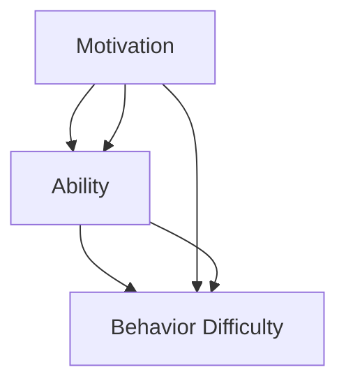

                 

# 福格行为模型：行为改变的三要素

行为科学是一个研究人类行为及其背后心理动机的学科。它不仅仅关注个体的心理活动，还关心如何在集体中实现有效的行为管理和改变。特别是在技术产品设计、营销推广、个人成长等众多领域，行为科学提供了许多实用的模型和工具。其中一个广为人知的理论就是福格行为模型（Fogg's Behavior Model），简称福格模型。

本文将详细介绍福格行为模型，探讨其在技术产品设计和行为管理中的应用，并结合实际案例进行深入分析。

## 1. 背景介绍

### 1.1 问题由来
行为科学最早可以追溯到20世纪初的心理学研究。然而，直到20世纪末，在个人计算机普及和互联网迅猛发展的背景下，行为科学才真正进入大众视野，并得到广泛应用。福格行为模型正是在这种背景下诞生并迅速流行的。

福格模型由斯坦福大学的B.J.福格教授提出，其核心思想是通过分析行为发生的基本要素，实现对行为的预测和改变。该模型提出，一切行为的发生都需要动机和能力两大要素，同时行为难度会影响行为发生的概率。这一观点开创了行为改变研究的新的视角，为行为科学研究和实际应用提供了新的理论基础。

### 1.2 问题核心关键点
福格模型的核心在于：
- 动机（Motivation）：是什么驱使个体进行某项行为？
- 能力（Ability）：个体完成某项行为所需的技能和资源。
- 行为难度（Behavior Difficulty）：行为所需的努力程度。
这三个要素之间存在复杂的相互作用，影响行为发生的概率。

## 2. 核心概念与联系

### 2.1 核心概念概述

福格模型主要包含三个核心概念：

- **动机（Motivation）**：行为动机指的是推动个体进行某项行为的内在或外在驱动因素。动机可以是自我效能（Self-efficacy）、外部奖励、社交压力等。

- **能力（Ability）**：行为能力是指个体完成某项行为所需的技能和资源。能力的高低直接影响行为完成的质量和效率。

- **行为难度（Behavior Difficulty）**：行为难度是指完成某项行为所需付出的努力程度。包括时间、金钱、物理环境等各方面的资源投入。

这三个概念相互独立又相互作用，共同决定行为发生的概率。动机和能力二者缺一不可，且行为难度越低，行为发生的可能性越高。

### 2.2 核心概念原理和架构的 Mermaid 流程图



这个流程图展示了动机、能力和行为难度之间的关系。动机和能力共同影响行为的发生概率，且行为难度越低，行为越容易发生。

## 3. 核心算法原理 & 具体操作步骤
### 3.1 算法原理概述

福格模型的核心在于动机和能力，行为难度是影响两者相互作用的关键因素。通过调整动机、能力和行为难度，可以有效预测和改变行为。该模型的应用场景广泛，包括但不限于技术产品设计、市场营销、个人习惯养成等。

### 3.2 算法步骤详解

福格模型的应用步骤包括以下几个关键步骤：

**Step 1: 分析动机**

首先，需要分析驱动个体进行某项行为的内在和外在动机。内在动机通常与自我效能、兴趣、价值观等有关；外在动机可能包括外部奖励、社会认同、避免惩罚等。

**Step 2: 评估能力**

其次，评估个体完成某项行为所需的技能和资源。能力可能包括知识、技能、物理环境、心理状态等方面。

**Step 3: 调整行为难度**

最后，调整行为难度，使个体更容易完成行为。可以通过简化流程、降低门槛、优化环境等手段实现。

**Step 4: 实施和反馈**

在实际操作中，需要持续监控行为的发生情况，并根据反馈不断优化模型。

### 3.3 算法优缺点

福格模型的优点在于：

- 简单易懂：该模型通过直观的三要素分析，为行为改变提供了简洁易行的框架。
- 实用性强：模型适用于各种行为改变场景，具有广泛的应用价值。

然而，模型也存在以下不足：

- 缺乏量化：模型没有具体的量化指标，可能导致实际操作中的不确定性。
- 忽视个体差异：模型没有考虑到个体之间的差异，可能在某些情况下不够适用。

### 3.4 算法应用领域

福格模型广泛应用于技术产品设计、市场营销、个人习惯养成等诸多领域。以下是几个典型应用案例：

1. **技术产品设计**

在技术产品设计中，福格模型帮助开发者预测用户行为，优化产品功能，提升用户体验。例如，优化手机应用程序的界面，使其操作更加流畅便捷。

2. **市场营销**

市场营销中，福格模型帮助企业预测消费者行为，制定更有效的营销策略。例如，设计更加符合用户心理需求的广告内容，提高广告效果。

3. **个人习惯养成**

个人习惯养成是福格模型的典型应用场景之一。通过分析内在动机、评估能力、调整行为难度，个人可以更有效地养成健康的生活习惯，如坚持锻炼、定时阅读等。

## 4. 数学模型和公式 & 详细讲解 & 举例说明

### 4.1 数学模型构建

福格模型的数学模型可以简单表示为：

$$
\text{Behavior} = \text{Motivation} \times \text{Ability} \times \text{Behavior Difficulty}
$$

其中，Behavior表示行为发生的概率，Motivation表示动机强度，Ability表示能力水平，Behavior Difficulty表示行为难度。

### 4.2 公式推导过程

福格模型的推导过程较为简单。以一个简单的例子来说明：

假设某人在阅读书籍时，有内在动机（如学习新知识）、外在动机（如获得学术奖励）、能力和行为难度。为了分析行为发生的概率，我们可以将其代入上述公式：

$$
\text{Behavior Probability} = \text{Motivation} \times \text{Ability} \times \text{Behavior Difficulty}
$$

如果动机、能力和行为难度都适中，那么行为发生的概率也会较高。

### 4.3 案例分析与讲解

以下是一个具体的案例分析：

**案例: 在线购物平台的用户购买行为**

在线购物平台的用户购买行为可以通过福格模型进行分析。动机可能包括对商品的兴趣、社会比较（与他人比较）、避免失去优惠等。能力可能包括支付手段、商品信息理解能力等。行为难度可能包括支付流程复杂、运费成本高等。

通过分析用户动机和能力，电商平台可以采取以下措施来提高购买行为发生概率：

- 优化支付流程，降低支付难度。
- 简化商品页面设计，提高信息理解能力。
- 提供优惠活动，刺激用户购买动机。

## 5. 项目实践：代码实例和详细解释说明
### 5.1 开发环境搭建

在使用福格模型进行项目实践时，需要搭建相应的开发环境。以下是一些常用的开发工具和环境：

- **Python**：Python是一种广泛使用的编程语言，拥有丰富的数据分析和机器学习库。
- **R**：R是一种专门用于统计分析和数据可视化的语言，适合处理复杂的数据分析任务。
- **Excel**：Excel是一款常用的电子表格软件，适合处理小规模数据和简单的数据分析。

### 5.2 源代码详细实现

下面是一个简单的Python代码示例，用于分析用户的购买行为：

```python
import pandas as pd
import numpy as np

# 读取用户数据
data = pd.read_csv('user_data.csv')

# 分析用户动机
motivation = np.mean(data['motivation'])
ability = np.mean(data['ability'])
behavior_difficulty = np.mean(data['behavior_difficulty'])

# 计算行为发生概率
behavior_probability = motivation * ability * behavior_difficulty
print(f'行为发生概率为: {behavior_probability}')
```

这个示例代码读取用户数据，计算动机、能力和行为难度，并计算行为发生的概率。需要注意的是，实际应用中需要根据具体场景调整动机、能力和行为难度，并进行模型验证。

### 5.3 代码解读与分析

在实际应用中，福格模型的代码实现需要根据具体情况进行调整。以下是一些关键的解读和分析：

- **动机和能力的数据收集**：动机和能力的数据收集是一个关键步骤。通常需要设计问卷或使用已有的数据集。
- **行为难度的量化**：行为难度的量化需要根据具体场景进行调整。例如，在电商平台中，行为难度可能包括支付流程、商品信息理解、运费成本等。
- **模型验证**：模型验证是模型应用的重要环节。可以通过交叉验证、A/B测试等方法验证模型的效果。

### 5.4 运行结果展示

运行上述代码，可以得到用户购买行为的概率。实际应用中，可以进一步分析数据，找出影响用户行为的关键因素，从而优化电商平台的设计。

## 6. 实际应用场景

### 6.1 智能家居产品设计

智能家居产品设计可以通过福格模型进行行为分析，从而优化产品功能，提升用户体验。例如，智能音箱的设计可以结合用户的内在动机（如娱乐、便利）、外在动机（如价格优惠）、能力（如语音识别能力）和行为难度（如语音控制的复杂度）进行优化。

### 6.2 健康管理平台

健康管理平台可以应用福格模型来分析用户的健康行为，如锻炼、饮食、睡眠等。通过分析用户动机（如健康目标）、能力（如知识储备、时间管理）和行为难度（如锻炼时间、饮食方便性），平台可以提供个性化的健康建议，帮助用户养成良好的生活习惯。

### 6.3 教育培训系统

教育培训系统可以通过福格模型分析学生的学习行为，优化教学内容和方法。例如，分析学生的内在动机（如知识渴望）、能力（如认知能力、时间管理）和行为难度（如课程难度、学习环境），设计更具吸引力和高效的教学方式。

## 7. 工具和资源推荐

### 7.1 学习资源推荐

以下是一些推荐的福格模型的学习资源：

- **《行为科学与公共政策》（Behavioral Economics and Public Policy）**：本书是行为经济学领域的经典之作，介绍了行为经济学在公共政策中的应用，包括福格模型等。
- **Coursera上的《行为科学导论》（Introduction to Behavioral Science）**：Coursera上由斯坦福大学开设的行为科学课程，介绍行为科学的基本概念和前沿研究。
- **B.J.福格教授的公开课和讲座**：福格教授经常在大学和学术会议上发表演讲，分享他的最新研究成果和应用案例。

### 7.2 开发工具推荐

以下是一些常用的福格模型开发工具：

- **Python**：Python是一种广泛使用的编程语言，拥有丰富的数据分析和机器学习库，适合进行行为科学的研究和应用。
- **R**：R是一种专门用于统计分析和数据可视化的语言，适合处理复杂的数据分析任务。
- **Excel**：Excel是一款常用的电子表格软件，适合处理小规模数据和简单的数据分析。

### 7.3 相关论文推荐

以下是一些经典的福格模型的相关论文：

- **《行为科学导论》（Introduction to Behavioral Science）**：行为科学家理查德·泰勒和菲利普·E·约翰逊·李共同撰写的经典教材，介绍了行为科学的基本概念和方法。
- **《行为经济学和公共政策》（Behavioral Economics and Public Policy）**：行为经济学家理查德·泰勒的著作，介绍了行为经济学在公共政策中的应用。
- **《行为设计学》（The Behavioral Design of High-Performance Organizations）**：行为设计师丹尼尔·平克的研究成果，介绍了如何通过行为设计提升组织绩效。

## 8. 总结：未来发展趋势与挑战

### 8.1 研究成果总结

福格模型在行为科学领域具有重要的应用价值，其简单直观的三个要素分析，为行为改变提供了科学的基础。该模型在技术产品设计、市场营销、个人习惯养成等领域得到了广泛应用，推动了这些领域的创新发展。

### 8.2 未来发展趋势

未来，福格模型将在以下几个方面继续发展：

- **多要素分析**：福格模型可以通过引入更多要素（如情绪、时间管理），进一步提升行为预测和改变的效果。
- **动态调整**：福格模型可以动态调整动机、能力和行为难度，实现对行为的实时优化。
- **跨领域应用**：福格模型可以拓展到更多领域，如教育、医疗、环境保护等，为社会带来更多价值。

### 8.3 面临的挑战

尽管福格模型在行为科学领域具有重要的应用价值，但也面临一些挑战：

- **数据获取困难**：动机、能力和行为难度的量化需要大量数据支持，数据获取可能面临困难。
- **模型复杂性**：福格模型的多要素分析可能带来复杂的模型结构和计算，需要进一步简化和优化。
- **个体差异**：福格模型可能忽视个体之间的差异，导致模型在某些情况下不够适用。

### 8.4 研究展望

未来的研究可以从以下几个方向进行：

- **多要素融合**：将福格模型的多要素分析与其他行为科学模型（如自我决定理论）融合，提升行为预测和改变的效果。
- **人工智能应用**：利用人工智能技术，实现对动机、能力和行为难度的自动分析和优化，提升模型应用效果。
- **跨领域应用**：将福格模型应用到更多领域，如教育、医疗、环境保护等，为社会带来更多价值。

## 9. 附录：常见问题与解答

**Q1: 福格模型如何应用在教育培训系统？**

A: 福格模型可以在教育培训系统中通过分析学生的内在动机（如知识渴望）、能力（如认知能力、时间管理）和行为难度（如课程难度、学习环境），设计更具吸引力和高效的教学方式。例如，可以设计互动式学习平台，降低学生的学习难度，同时提供个性化的学习建议，帮助学生更好地掌握知识。

**Q2: 福格模型是否适用于企业内部管理？**

A: 福格模型可以应用于企业内部管理，通过分析员工的内在动机（如职业发展）、能力（如工作技能、时间管理）和行为难度（如任务复杂度、工作环境），优化企业内部的管理方式。例如，可以设计灵活的工作制度，降低员工的工作难度，同时提供个性化的职业发展建议，提升员工的工作满意度和工作效率。

**Q3: 福格模型是否适用于个人习惯养成？**

A: 福格模型可以应用于个人习惯养成，通过分析个人的内在动机（如健康目标）、能力（如知识储备、时间管理）和行为难度（如锻炼时间、饮食方便性），帮助个人养成良好的生活习惯。例如，可以设计个性化的锻炼计划，降低个人的锻炼难度，同时提供健康饮食建议，帮助个人更好地管理健康。

---

作者：禅与计算机程序设计艺术 / Zen and the Art of Computer Programming

