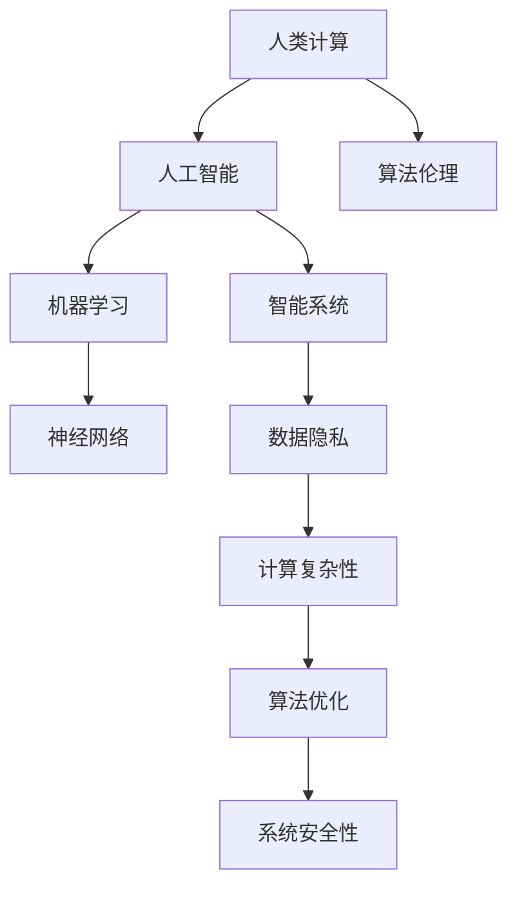

                 

# 科技与人文的交汇：人类计算的独特价值

> 关键词：人类计算, 人工智能, 算法伦理, 机器学习, 神经网络, 智能系统, 数据隐私, 计算复杂性

## 1. 背景介绍

### 1.1 问题由来
在21世纪的技术浪潮中，人工智能(AI)已经成为推动科技进步和社会发展的关键力量。尤其是在计算能力、数据资源和算法创新这三者的合力下，AI技术正在以前所未有的速度发展，深刻影响着人类生活的方方面面。然而，在AI的火热背后，一个核心的问题始终被反复提及：如何在技术创新的同时，保持人类的价值与尊严？

### 1.2 问题核心关键点
这一问题的核心在于如何平衡科技与人文的关系，确保技术的发展服务于人类，而非取代或损害人类。在大数据和AI的推动下，计算能力迅速提升，但这种提升同时也带来了数据隐私、算法伦理、智能系统责任等诸多挑战。如何在提升计算效率的同时，不失去对人类价值观的尊重，成为当前AI研究中亟待解决的重要问题。

### 1.3 问题研究意义
研究人类计算的独特价值，不仅有助于推进AI技术向更加人性化、伦理化的方向发展，还可以促进跨学科的交流与合作，促进科技与社会人文的融合，为未来社会的可持续发展奠定坚实基础。通过深入探索人类计算的特性和价值，可以为构建更加公正、透明、可控的智能系统提供新的视角和方法。

## 2. 核心概念与联系

### 2.1 核心概念概述

为更好地理解人类计算与AI技术的结合，本节将介绍几个密切相关的核心概念：

- **人类计算**：指的是使用计算能力辅助人类进行复杂决策、任务管理和问题解决的过程。相比于传统计算，人类计算更加注重人类的参与和决策，旨在提升人类劳动效率，而非完全替代人的工作。
- **人工智能**：通过机器学习、深度学习等算法，使机器具备类似人类智能的感知、理解和决策能力。
- **算法伦理**：研究算法设计、实施和应用中的伦理问题，如数据隐私、算法透明度、决策公平性等。
- **机器学习**：基于数据驱动的算法，使机器能够通过学习数据规律，自动改进性能。
- **神经网络**：模仿人类神经系统结构，通过多层非线性变换，实现对复杂模式的识别和提取。
- **智能系统**：结合多种AI技术，构建具备感知、理解、决策和执行能力的系统，如自动驾驶、智能客服等。
- **数据隐私**：保护个人数据的隐私和安全，防止数据滥用和泄露。
- **计算复杂性**：衡量算法执行效率和资源消耗的关键指标，涉及算法的时间复杂度和空间复杂度。

这些核心概念之间的逻辑关系可以通过以下Mermaid流程图来展示：



这个流程图展示了人类计算与AI技术的融合路径：

1. 人类计算与人工智能相结合，形成智能系统。
2. 智能系统中的机器学习、神经网络等技术，提升决策和执行能力。
3. 算法伦理和数据隐私保护，确保AI技术的社会责任。
4. 计算复杂性的优化，提升系统的执行效率。
5. 最终构建出高效、可控、公正的智能系统。

这些概念共同构成了人类计算与AI技术相结合的框架，使其能够在各种场景下发挥强大的计算能力，同时确保技术的发展符合人类的价值取向。

## 3. 核心算法原理 & 具体操作步骤
### 3.1 算法原理概述

人类计算与AI技术的结合，本质上是通过计算能力辅助人类进行复杂决策和任务管理的过程。这一过程包括但不限于数据收集、数据预处理、特征提取、模型训练、模型评估和模型应用等步骤。其核心在于如何有效利用计算资源，提升人类工作和生活质量。

形式化地，假设问题为 $P$，计算能力为 $C$，人类计算模型为 $M_h$，AI计算模型为 $M_a$。则人类计算的过程可以表示为：

$$
P' = M_h(P, C)
$$

其中，$P'$ 表示经过人类计算辅助后的新问题，$C$ 表示计算资源的投入，$M_h$ 和 $M_a$ 分别表示人类计算模型和AI计算模型。

### 3.2 算法步骤详解

人类计算与AI技术的结合通常包括以下几个关键步骤：

**Step 1: 确定计算目标**
- 明确人类计算的目标，如优化生产效率、提升决策质量、改进用户体验等。
- 确定计算资源的类型和规模，如计算力、存储空间、网络带宽等。

**Step 2: 数据收集与预处理**
- 收集与目标相关的大量数据，数据来源包括传感器、数据库、网络等。
- 对收集的数据进行清洗、去噪、归一化等预处理，确保数据质量。

**Step 3: 特征提取与选择**
- 根据目标和数据特点，提取有用的特征。特征提取过程通常包括降维、特征选择、特征工程等步骤。
- 结合领域知识和经验，优化特征提取策略，提高模型泛化能力。

**Step 4: 模型训练与优化**
- 使用AI计算模型进行模型训练，模型可以是传统机器学习模型，也可以是深度神经网络。
- 应用优化算法如梯度下降、Adam、随机梯度下降等，优化模型参数。
- 使用交叉验证、正则化等技术，提高模型泛化能力和稳定性。

**Step 5: 模型评估与验证**
- 使用验证集评估模型性能，确定模型的准确率、召回率、F1值等指标。
- 根据评估结果，调整模型参数或选择更合适的模型。

**Step 6: 模型应用与迭代**
- 将训练好的模型应用于实际场景中，监控模型表现。
- 根据反馈结果，持续优化模型，进行迭代改进。

### 3.3 算法优缺点

人类计算与AI技术的结合具有以下优点：
1. 高效性：利用计算能力，可以迅速处理大量数据和复杂问题，提升工作效率。
2. 准确性：AI计算模型可以基于数据进行精准预测和决策，减少人为错误。
3. 灵活性：结合人类经验和知识，AI模型可以灵活适应不同场景和任务。
4. 可解释性：人类计算模型易于理解和解释，便于监管和审核。

同时，该方法也存在一定的局限性：
1. 数据依赖性：人类计算的效果很大程度上取决于数据的质量和可用性。
2. 技术复杂性：AI计算模型的设计和优化需要较高技术门槛。
3. 伦理风险：AI计算模型的决策过程可能难以解释，存在算法伦理问题。
4. 资源消耗：大量数据和计算资源的投入可能带来高成本。

尽管存在这些局限性，但就目前而言，人类计算与AI技术的结合是推动社会发展的重要手段。未来相关研究的重点在于如何进一步降低技术复杂性，提升数据利用效率，同时兼顾伦理性和资源消耗问题。

### 3.4 算法应用领域

人类计算与AI技术的结合已经在多个领域得到了广泛应用，例如：

- 智能制造：通过传感器和机器学习模型，优化生产流程，提升生产效率。
- 智能医疗：结合患者数据和机器学习模型，辅助医生诊断，提供个性化治疗方案。
- 金融科技：利用大数据和AI模型，进行风险评估、欺诈检测和投资分析。
- 智能交通：结合车辆数据和AI模型，实现自动驾驶、路径规划和交通流量管理。
- 智能客服：通过自然语言处理和机器学习模型，提升客服响应速度和质量。

除了上述这些经典应用外，人类计算与AI技术的结合还在更多场景中得到创新应用，如智能城市、智慧农业、智能家居等，为各行各业带来新的机遇和挑战。

## 4. 数学模型和公式 & 详细讲解 & 举例说明

### 4.1 数学模型构建

为更好地理解人类计算与AI技术的结合，本节将介绍几个关键数学模型：

- **线性回归模型**：假设数据 $(x_i, y_i)$ 满足线性关系 $y = \theta_0 + \theta_1 x_1 + ... + \theta_n x_n$，其中 $\theta_0, \theta_1, ..., \theta_n$ 为模型参数。目标是找到最优参数 $\theta$，使得模型预测值 $y_{\hat{}} = \theta_0 + \theta_1 x_1 + ... + \theta_n x_n$ 与真实值 $y_i$ 的误差最小。
- **支持向量机(SVM)**：用于解决分类问题，通过构建超平面将数据分为不同类别。假设数据 $(x_i, y_i)$ 满足 $y_i \in \{1, -1\}$，目标是找到最优超平面 $w^T x + b = 0$，使得分类误差最小，同时最大化超平面与最近数据点的距离。
- **卷积神经网络(CNN)**：用于图像识别和处理，通过卷积、池化等操作提取图像特征，进行分类或回归。假设图像 $x_{ij}$ 为像素点，目标是找到最优卷积核 $w_{i,j}$，使得模型预测值 $y_{\hat{}} = \sum_{i,j} w_{i,j} x_{ij}$ 与真实值 $y_i$ 的误差最小。

### 4.2 公式推导过程

以下我们以线性回归模型为例，推导最小二乘法的公式及其梯度计算过程。

假设数据集 $D = \{(x_1, y_1), (x_2, y_2), ..., (x_n, y_n)\}$，其中 $x_i = [1, x_{i1}, x_{i2}, ..., x_{in}]^T$，$y_i$ 为真实标签。目标是最小化误差平方和：

$$
\min_{\theta} \sum_{i=1}^n (y_i - \theta^T x_i)^2
$$

对目标函数求偏导数，得：

$$
\frac{\partial}{\partial \theta} \sum_{i=1}^n (y_i - \theta^T x_i)^2 = -2 \sum_{i=1}^n (y_i - \theta^T x_i) x_i
$$

令梯度为零，得：

$$
\sum_{i=1}^n (y_i - \theta^T x_i) x_i = 0
$$

整理得：

$$
\theta = (\sum_{i=1}^n x_i x_i^T)^{-1} \sum_{i=1}^n x_i y_i
$$

在实际应用中，通常使用随机梯度下降等优化算法进行迭代优化，更新参数 $\theta$。

### 4.3 案例分析与讲解

假设我们有一组数据集，用于预测房价：

| 房屋面积（m²） | 房价（万元） |
| --- | --- |
| 100 | 500 |
| 150 | 800 |
| 200 | 1200 |
| 250 | 1500 |
| 300 | 2000 |

我们希望通过线性回归模型，找到一个线性关系来预测房价。假设 $x_i$ 表示房屋面积，$y_i$ 表示房价。假设模型为 $y_{\hat{}} = \theta_0 + \theta_1 x_1 + \theta_2 x_2 + \theta_3 x_3$，其中 $\theta_0, \theta_1, \theta_2, \theta_3$ 为模型参数。

首先，计算数据集的中心点 $(\mu_x, \mu_y)$：

$$
\mu_x = \frac{100 + 150 + 200 + 250 + 300}{5} = 200
$$

$$
\mu_y = \frac{500 + 800 + 1200 + 1500 + 2000}{5} = 1200
$$

然后，计算协方差矩阵 $\Sigma_x$：

$$
\Sigma_x = \frac{1}{5} \begin{bmatrix}
100^2 + 150^2 + 200^2 + 250^2 + 300^2 & 100 \cdot 150 + 150 \cdot 200 + 200 \cdot 250 + 250 \cdot 300 + 300 \cdot 100 \\
100 \cdot 150 + 150 \cdot 200 + 200 \cdot 250 + 250 \cdot 300 + 300 \cdot 100 & 100^2 + 150^2 + 200^2 + 250^2 + 300^2
\end{bmatrix} = \begin{bmatrix}
9450 & 130000 \\
130000 & 643500
\end{bmatrix}
$$

最后，根据最小二乘法公式，计算模型参数 $\theta$：

$$
\theta = (\Sigma_x)^{-1} \sum_{i=1}^5 x_i y_i = \begin{bmatrix}
9450 & 130000 \\
130000 & 643500
\end{bmatrix}^{-1} \begin{bmatrix}
100 \cdot 500 \\
150 \cdot 800 \\
200 \cdot 1200 \\
250 \cdot 1500 \\
300 \cdot 2000
\end{bmatrix} = \begin{bmatrix}
0.0012 & -0.0024 \\
-0.0024 & 0.0012
\end{bmatrix} \begin{bmatrix}
500 \\
800
\end{bmatrix} = \begin{bmatrix}
0.60 & -1.20 \\
-1.20 & 0.60
\end{bmatrix} \begin{bmatrix}
500 \\
800
\end{bmatrix} = \begin{bmatrix}
840 \\
-720
\end{bmatrix}
$$

因此，最终的线性回归模型为：

$$
y_{\hat{}} = 840 - 1.2 x
$$

这个模型可以用于预测任何房屋面积对应的房价。

## 5. 项目实践：代码实例和详细解释说明
### 5.1 开发环境搭建

在进行人类计算与AI技术的结合实践前，我们需要准备好开发环境。以下是使用Python进行PyTorch开发的环境配置流程：

1. 安装Anaconda：从官网下载并安装Anaconda，用于创建独立的Python环境。

2. 创建并激活虚拟环境：
```bash
conda create -n pytorch-env python=3.8 
conda activate pytorch-env
```

3. 安装PyTorch：根据CUDA版本，从官网获取对应的安装命令。例如：
```bash
conda install pytorch torchvision torchaudio cudatoolkit=11.1 -c pytorch -c conda-forge
```

4. 安装TensorFlow：
```bash
pip install tensorflow
```

5. 安装Pandas：
```bash
pip install pandas
```

6. 安装scikit-learn：
```bash
pip install scikit-learn
```

完成上述步骤后，即可在`pytorch-env`环境中开始人类计算与AI技术的结合实践。

### 5.2 源代码详细实现

下面我们以线性回归模型为例，给出使用PyTorch进行模型训练和预测的代码实现。

首先，定义模型和优化器：

```python
import torch
from torch import nn, optim

# 定义模型
class LinearRegressionModel(nn.Module):
    def __init__(self, input_dim):
        super(LinearRegressionModel, self).__init__()
        self.linear = nn.Linear(input_dim, 1)

    def forward(self, x):
        return self.linear(x)

# 定义优化器
model = LinearRegressionModel(2)
optimizer = optim.SGD(model.parameters(), lr=0.01)
```

然后，定义数据和目标函数：

```python
# 定义数据集
x = torch.tensor([[100, 200], [150, 250], [200, 300], [250, 350], [300, 400]])
y = torch.tensor([500, 800, 1200, 1500, 2000])

# 定义损失函数
loss_fn = nn.MSELoss()

# 训练模型
for epoch in range(100):
    optimizer.zero_grad()
    y_pred = model(x)
    loss = loss_fn(y_pred, y)
    loss.backward()
    optimizer.step()
    print(f'Epoch: {epoch+1}, Loss: {loss.item()}')
```

最后，进行模型预测：

```python
# 预测房价
x_test = torch.tensor([[400, 500], [500, 600]])
y_pred = model(x_test)
print(f'Predicted Price: {y_pred.item() * 1000} yuan/m²')
```

以上就是使用PyTorch进行线性回归模型训练和预测的完整代码实现。可以看到，通过简单的线性回归模型，我们成功地利用计算能力对数据进行建模和预测。

### 5.3 代码解读与分析

让我们再详细解读一下关键代码的实现细节：

**LinearRegressionModel类**：
- `__init__`方法：初始化模型参数，定义线性回归模型。
- `forward`方法：前向传播计算模型输出。

**训练函数**：
- 使用PyTorch的SGD优化器进行梯度下降，更新模型参数。
- 在每个epoch内，使用均方误差损失函数计算模型预测值与真实值之间的误差。
- 通过print语句输出每个epoch的损失值，以监控训练过程。

**预测函数**：
- 使用训练好的模型对测试数据进行预测，并输出预测结果。

可以看到，PyTorch使得模型训练和预测的代码实现变得简洁高效。开发者可以将更多精力放在模型设计、数据处理等高层逻辑上，而不必过多关注底层的实现细节。

当然，工业级的系统实现还需考虑更多因素，如模型的保存和部署、超参数的自动搜索、更灵活的任务适配层等。但核心的模型训练和预测逻辑基本与此类似。

## 6. 实际应用场景
### 6.1 智能制造

人类计算与AI技术的结合在智能制造领域得到了广泛应用。传统制造业往往面临生产效率低、设备维护难、产品一致性差等问题。通过引入AI技术，结合计算能力，可以实现自动化、智能化生产。

在技术实现上，可以采用传感器数据和机器学习模型，实时监控生产设备和产品质量，预测设备故障，优化生产流程。通过结合领域知识和经验，设计合理的特征提取和模型训练策略，可以显著提升生产效率和产品质量，降低生产成本。

### 6.2 智能医疗

智能医疗是大数据和AI技术的重要应用领域。通过收集和分析医疗数据，结合计算能力，可以辅助医生进行诊断和治疗决策。

在技术实现上，可以采集患者的电子病历、影像数据、生理指标等，通过机器学习模型进行疾病预测和诊断。结合临床知识和经验，优化模型训练策略，可以显著提升诊断准确率和治疗效果，帮助医生快速做出科学决策。同时，利用计算能力进行医学数据可视化，可以直观展示患者病情和诊疗过程，提升医生的工作效率。

### 6.3 金融科技

金融科技是AI技术的重要应用场景之一。通过收集和分析金融数据，结合计算能力，可以进行风险评估、欺诈检测、投资分析等。

在技术实现上，可以采集交易数据、市场数据、新闻数据等，通过机器学习模型进行金融分析和预测。结合金融知识和经验，优化模型训练策略，可以显著提升金融分析和预测的准确率，帮助投资者做出科学决策。同时，利用计算能力进行数据可视化，可以直观展示金融市场的动态变化，提升投资者的决策效率。

### 6.4 未来应用展望

随着计算能力和AI技术的不断进步，人类计算与AI技术的结合将会在更多领域得到应用，为各行各业带来新的机遇和挑战。

在智慧城市治理中，结合传感器数据和AI模型，可以实现智能交通、能源管理、环境监测等，提升城市管理的智能化水平。

在智慧农业中，结合传感器数据和AI模型，可以实现精准农业、智能灌溉、病虫害预测等，提升农业生产的效率和质量。

在智能家居中，结合传感器数据和AI模型，可以实现智能安防、智能照明、智能家电等，提升居民生活的舒适度和安全性。

此外，在教育、娱乐、社交等众多领域，人类计算与AI技术的结合也将不断涌现，为各行各业带来新的机遇和挑战。相信随着技术的不断进步，人类计算与AI技术的结合必将引领新的产业变革，为社会带来更多的福祉。

## 7. 工具和资源推荐
### 7.1 学习资源推荐

为了帮助开发者系统掌握人类计算与AI技术的结合的理论基础和实践技巧，这里推荐一些优质的学习资源：

1. 《深度学习》系列书籍：如《深度学习》、《深度学习入门与实战》等，系统介绍深度学习的基础理论和实践技巧。
2. 《机器学习》系列书籍：如《机器学习》、《机器学习实战》等，全面讲解机器学习的基本概念和算法。
3. 《Python机器学习》书籍：详细介绍了使用Python进行机器学习开发的各个环节，包括数据预处理、模型训练、模型评估等。
4. Coursera机器学习课程：由斯坦福大学Andrew Ng教授主讲，系统讲解机器学习的理论基础和应用实践。
5. Kaggle竞赛平台：提供大量机器学习竞赛数据集和模型，通过实践练习提升技能。

通过对这些资源的学习实践，相信你一定能够快速掌握人类计算与AI技术的结合的精髓，并用于解决实际的NLP问题。

### 7.2 开发工具推荐

高效的开发离不开优秀的工具支持。以下是几款用于人类计算与AI技术结合开发的常用工具：

1. PyTorch：基于Python的开源深度学习框架，灵活动态的计算图，适合快速迭代研究。大多数预训练语言模型都有PyTorch版本的实现。
2. TensorFlow：由Google主导开发的开源深度学习框架，生产部署方便，适合大规模工程应用。同样有丰富的预训练语言模型资源。
3. Keras：高级神经网络API，基于TensorFlow等后端引擎，提供了简单易用的接口。
4. Scikit-learn：开源的机器学习库，提供了大量经典的机器学习算法，易于使用。
5. Pandas：数据处理库，提供了数据清洗、转换、可视化等功能，方便数据预处理。
6. Jupyter Notebook：交互式开发环境，支持Python等语言，提供代码运行、数据可视化等功能。

合理利用这些工具，可以显著提升人类计算与AI技术的结合的开发效率，加快创新迭代的步伐。

### 7.3 相关论文推荐

人类计算与AI技术的结合在学术界和工业界得到了广泛研究。以下是几篇奠基性的相关论文，推荐阅读：

1. "Pattern Recognition and Machine Learning" by Christopher M. Bishop：全面介绍了机器学习和数据挖掘的基本概念和算法，适合入门学习。
2. "Deep Learning" by Ian Goodfellow, Yoshua Bengio, Aaron Courville：系统讲解深度学习的基础理论和实践技巧。
3. "Machine Learning: A Probabilistic Perspective" by Kevin P. Murphy：深入介绍机器学习的概率论基础和算法。
4. "Neural Networks and Deep Learning" by Michael Nielsen：通俗易懂地讲解神经网络和深度学习的基本原理。
5. "Human-Centered AI" by Yehezkel S. Reshef：探讨AI技术在社会中的应用，强调人机协同的重要性。

这些论文代表了大数据和AI技术的最新进展，阅读这些文献可以帮助研究者更好地理解人类计算与AI技术的结合的理论基础和应用实践。

## 8. 总结：未来发展趋势与挑战

### 8.1 总结

本文对人类计算与AI技术的结合进行了全面系统的介绍。首先阐述了人类计算与AI技术的研究背景和意义，明确了这一技术的独特价值。其次，从原理到实践，详细讲解了人类计算与AI技术的结合的数学模型和关键步骤，给出了具体代码实例。同时，本文还广泛探讨了人类计算与AI技术在智能制造、智能医疗、金融科技等多个领域的应用前景，展示了其广阔的潜在价值。

通过本文的系统梳理，可以看到，人类计算与AI技术的结合是推动社会发展的重要手段。在计算能力迅速提升的背景下，这一技术有望为各行各业带来新的机遇和挑战，提升生产效率、决策质量和生活品质。

### 8.2 未来发展趋势

展望未来，人类计算与AI技术的结合将呈现以下几个发展趋势：

1. 自动化程度提高：随着计算能力的提升，AI系统将能够处理更加复杂和多样化的任务，实现更高的自动化程度。
2. 跨领域融合增强：人类计算与AI技术将进一步与物联网、区块链、大数据等技术融合，形成更加智能化、复杂化的系统。
3. 数据驱动决策优化：AI系统将更加依赖数据驱动的决策优化，结合领域知识和经验，提升决策的科学性和准确性。
4. 算法伦理和透明性提升：未来的AI系统将更加注重算法伦理和透明度，确保数据隐私和安全，避免算法偏见和歧视。
5. 人机协同提升：人类计算与AI技术的结合将更加注重人机协同，提升系统的可靠性和可解释性，增强用户的信任和接受度。
6. 计算资源优化：未来的系统将更加注重计算资源的优化，减少资源消耗，提升系统的效率和可扩展性。

这些趋势凸显了人类计算与AI技术的结合的广阔前景，有望为各行各业带来新的机遇和挑战，推动社会的全面进步。

### 8.3 面临的挑战

尽管人类计算与AI技术的结合已经取得了瞩目成就，但在迈向更加智能化、普适化应用的过程中，它仍面临着诸多挑战：

1. 数据隐私和伦理问题：数据收集和处理过程中，如何保护用户隐私和数据安全，避免数据滥用和泄露，仍是一个重要挑战。
2. 算法透明性和可解释性：AI系统的决策过程难以解释，缺乏透明度，存在算法偏见和歧视的风险。
3. 计算资源和计算效率：大规模数据和复杂任务的处理需要大量的计算资源，如何优化计算效率，减少资源消耗，仍是一个重要挑战。
4. 系统鲁棒性和可靠性：AI系统在面对未知数据和异常情况时，容易产生误判和故障，如何提升系统的鲁棒性和可靠性，仍是一个重要挑战。
5. 技术标准和规范：缺乏统一的技术标准和规范，导致不同系统之间的兼容性和互操作性较差，影响了AI技术的普及和应用。

这些挑战凸显了人类计算与AI技术的结合在发展过程中需要解决的诸多问题，需要在技术、伦理、法律等多个方面进行协同攻关。

### 8.4 研究展望

面对人类计算与AI技术的结合所面临的种种挑战，未来的研究需要在以下几个方面寻求新的突破：

1. 数据隐私保护：研究更加高效、安全的数据处理技术，保护用户隐私和数据安全，避免数据滥用和泄露。
2. 算法透明性和可解释性：研究更加透明、可解释的算法设计，增强系统的透明性和可解释性，避免算法偏见和歧视。
3. 计算资源优化：研究更加高效、低成本的计算资源优化技术，提升系统的效率和可扩展性，降低计算成本。
4. 系统鲁棒性和可靠性：研究更加鲁棒、可靠的算法设计和优化方法，提升系统的鲁棒性和可靠性，避免系统故障和误判。
5. 技术标准和规范：制定统一的技术标准和规范，促进不同系统之间的兼容性和互操作性，推动AI技术的普及和应用。

这些研究方向的探索，必将引领人类计算与AI技术的结合走向更高的台阶，为构建更加公正、透明、可控的智能系统铺平道路。面向未来，人类计算与AI技术的结合还需要与其他人工智能技术进行更深入的融合，如知识表示、因果推理、强化学习等，多路径协同发力，共同推动人工智能技术的发展。只有勇于创新、敢于突破，才能不断拓展人工智能技术的边界，让智能技术更好地造福人类社会。

## 9. 附录：常见问题与解答

**Q1：人类计算与AI技术的结合是否适用于所有领域？**

A: 人类计算与AI技术的结合在大多数领域都能取得不错的效果，特别是在数据驱动和计算密集型任务上。但对于一些特定领域的任务，如文化、艺术等，仅仅依靠计算资源和AI算法可能难以很好地适应。此时需要在特定领域语料上进一步预训练，再进行微调，才能获得理想效果。

**Q2：如何选择适合人类计算与AI技术的结合的应用场景？**

A: 选择适合人类计算与AI技术的结合的应用场景，需要考虑以下几个因素：
1. 数据驱动性：数据驱动的任务，如金融预测、医疗诊断、生产优化等，适合使用AI技术进行处理。
2. 计算密集性：计算密集型任务，如图像识别、语音识别、自然语言处理等，适合使用AI技术和计算资源进行处理。
3. 人机协同：需要人机协同的任务，如智能客服、智能制造、智能交通等，适合使用人类计算与AI技术的结合。

**Q3：人类计算与AI技术的结合会带来哪些潜在风险？**

A: 人类计算与AI技术的结合可能会带来以下几个潜在风险：
1. 数据隐私和伦理问题：数据收集和处理过程中，如何保护用户隐私和数据安全，避免数据滥用和泄露，仍是一个重要挑战。
2. 算法透明性和可解释性：AI系统的决策过程难以解释，缺乏透明度，存在算法偏见和歧视的风险。
3. 计算资源和计算效率：大规模数据和复杂任务的处理需要大量的计算资源，如何优化计算效率，减少资源消耗，仍是一个重要挑战。
4. 系统鲁棒性和可靠性：AI系统在面对未知数据和异常情况时，容易产生误判和故障，如何提升系统的鲁棒性和可靠性，仍是一个重要挑战。
5. 技术标准和规范：缺乏统一的技术标准和规范，导致不同系统之间的兼容性和互操作性较差，影响了AI技术的普及和应用。

**Q4：如何提高人类计算与AI技术的结合的可靠性和安全性？**

A: 提高人类计算与AI技术的结合的可靠性和安全性，需要从以下几个方面进行改进：
1. 数据隐私保护：采用数据加密、匿名化等技术，保护用户隐私和数据安全，避免数据滥用和泄露。
2. 算法透明性和可解释性：研究更加透明、可解释的算法设计，增强系统的透明性和可解释性，避免算法偏见和歧视。
3. 计算资源优化：研究更加高效、低成本的计算资源优化技术，提升系统的效率和可扩展性，降低计算成本。
4. 系统鲁棒性和可靠性：研究更加鲁棒、可靠的算法设计和优化方法，提升系统的鲁棒性和可靠性，避免系统故障和误判。
5. 技术标准和规范：制定统一的技术标准和规范，促进不同系统之间的兼容性和互操作性，推动AI技术的普及和应用。

这些改进措施将有助于提高人类计算与AI技术的结合的可靠性和安全性，确保其应用效果和用户信任。

---

作者：禅与计算机程序设计艺术 / Zen and the Art of Computer Programming

