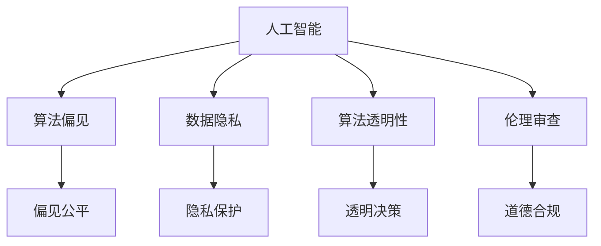

                 

# 科技与伦理的平衡点：人类计算的伦理思考

## 1. 背景介绍

### 1.1 问题由来
随着人工智能（AI）技术的迅猛发展，特别是深度学习、自然语言处理和大数据技术的普及，计算机算法在人类生活的各个方面都发挥着越来越重要的作用。从医疗、教育、金融到交通、娱乐、安全等领域，计算机算法无处不在，极大地提升了生产效率，改善了人类生活质量。然而，与此同时，算法决策的透明性、公正性、安全性等问题也引起了广泛关注，尤其是算法对社会伦理道德的影响。

### 1.2 问题核心关键点
当前，计算机算法的应用已经渗透到个人隐私、公平正义、社会治理等深层次的伦理道德问题中。算法决策的透明度、可解释性、可控性、安全性等伦理问题，成为技术发展过程中必须认真对待的课题。特别是在涉及生命、财产等关键领域的应用中，算法的不公平、偏见、歧视等问题可能引发严重的社会后果。

### 1.3 问题研究意义
深入探讨科技与伦理的平衡点，对人类计算进行伦理思考，具有重要意义：

1. **促进技术健康发展**：通过伦理审视，引导AI技术向公平、公正、透明的方向发展，避免技术滥用。
2. **保障公民权益**：确保算法决策的公正性和可解释性，维护公民的知情权和选择权。
3. **维护社会稳定**：避免算法偏见和歧视带来的社会分裂和不公，构建和谐社会。
4. **推动制度完善**：为相关法律法规的制定提供理论支撑，规范算法应用，促进技术良性循环。

## 2. 核心概念与联系

### 2.1 核心概念概述

为更好地理解人类计算的伦理思考，本节将介绍几个核心概念：

- **人工智能（AI）**：利用计算机算法模拟人类智能的领域，包括机器学习、深度学习、自然语言处理等。
- **算法偏见（Algorithmic Bias）**：指算法在训练和应用过程中因数据或设计缺陷导致的对特定群体的不公平对待。
- **数据隐私（Data Privacy）**：指个人数据在收集、存储、使用过程中的保护问题，防止数据泄露和滥用。
- **算法透明性（Algorithmic Transparency）**：指算法决策过程的可理解性和可解释性，便于用户和监管者监督。
- **伦理审查（Ethical Review）**：指在算法开发和应用过程中，对可能存在的伦理道德问题进行评估和规避。

这些核心概念之间的逻辑关系可以通过以下Mermaid流程图来展示：



这个流程图展示了几组核心概念及其之间的关系：

1. 人工智能通过算法偏见、数据隐私、算法透明性和伦理审查等伦理问题，影响公平性、隐私保护、透明性和道德合规等关键指标。
2. 算法偏见和数据隐私直接影响算法的公正性和用户的知情权。
3. 算法透明性和伦理审查则是为了确保算法的公正性和道德合规性，提高用户信任。

## 3. 核心算法原理 & 具体操作步骤

### 3.1 算法原理概述

人类计算的伦理思考，本质上是要求在算法设计和应用过程中，充分考虑其对社会伦理道德的影响。这一过程通常包括以下几个关键步骤：

1. **识别伦理问题**：在算法开发和应用过程中，识别潜在的伦理道德风险。
2. **伦理影响评估**：评估算法决策可能对特定群体或社会产生的影响。
3. **制定伦理规范**：制定明确的伦理规范，指导算法的开发和应用。
4. **实施伦理审查**：对算法进行伦理审查，确保其符合伦理规范。
5. **伦理优化调整**：根据伦理审查结果，优化调整算法，确保其公平、公正、透明。

### 3.2 算法步骤详解

**Step 1: 识别伦理问题**
- 对算法进行全面的伦理审查，识别可能存在的偏见、歧视、隐私泄露等问题。
- 使用数据集进行偏置分析，评估不同群体在算法中的表现差异。
- 与利益相关方进行沟通，了解其对算法公平性和透明性的期望。

**Step 2: 伦理影响评估**
- 分析算法决策对不同群体的影响，包括性别、种族、年龄、经济状况等。
- 评估算法的决策对社会正义、平等、民主等方面的潜在影响。
- 通过模拟和实验，测试算法在边缘情况下的表现，识别可能的漏洞。

**Step 3: 制定伦理规范**
- 制定明确的伦理规范，包括数据采集、处理、使用等方面的准则。
- 设立伦理委员会，负责监督算法的开发和应用。
- 引入伦理培训，提升开发团队和用户的伦理意识。

**Step 4: 实施伦理审查**
- 对算法进行定期的伦理审查，检查其是否符合伦理规范。
- 使用独立的第三方机构进行审查，增加审查的公正性和可信度。
- 根据审查结果，提出改进建议，进行算法优化。

**Step 5: 伦理优化调整**
- 根据审查结果，优化算法，确保其决策公平、透明、可解释。
- 引入多样性数据，减少算法偏见。
- 改进算法透明度，提供用户可理解的决策依据。

### 3.3 算法优缺点

人类计算的伦理思考具有以下优点：

1. **提升社会信任**：通过伦理审视，增强算法决策的公正性和透明性，提升社会信任。
2. **促进公平正义**：识别和消除算法偏见，确保不同群体在算法中的公平对待。
3. **保障用户隐私**：严格保护用户数据，防止隐私泄露和滥用。
4. **推动法规完善**：为相关法律法规的制定提供理论支撑，促进技术健康发展。

同时，这一过程也存在一定的局限性：

1. **成本高**：伦理审查和优化调整需要大量时间和资源投入。
2. **技术复杂**：需要对算法进行全面分析和评估，技术难度较高。
3. **主观性强**：伦理判断具有主观性，不同利益相关方可能存在意见分歧。

尽管存在这些局限性，但通过伦理审视，可以有效地规避算法应用中的伦理风险，确保其对社会的正面影响。

### 3.4 算法应用领域

人类计算的伦理思考在多个领域具有重要应用，包括但不限于：

- **医疗诊断**：确保算法在诊断和治疗中不产生偏见，保证医疗公平。
- **金融贷款**：避免算法在贷款审批中的歧视，确保金融服务的公平性。
- **司法判决**：确保算法在判决中的透明性和公正性，避免算法偏见。
- **招聘招聘**：减少算法在招聘过程中的歧视，确保机会平等。
- **广告推荐**：避免算法在广告推荐中的偏差，促进市场公平。

这些领域的应用表明，人类计算的伦理思考对于确保算法的公平性、公正性和透明性具有重要意义。

## 4. 数学模型和公式 & 详细讲解 & 举例说明

### 4.1 数学模型构建

假设有一个二分类算法模型 $M$，其训练集为 $D=\{(x_i, y_i)\}_{i=1}^N$，其中 $x_i$ 为输入特征，$y_i$ 为标签（0或1）。设算法的预测函数为 $f(x)$，则模型的损失函数可以定义为：

$$
\mathcal{L}(M) = \frac{1}{N} \sum_{i=1}^N \ell(f(x_i), y_i)
$$

其中 $\ell$ 为损失函数，常用的有交叉熵损失、平方损失等。

### 4.2 公式推导过程

以交叉熵损失为例，进行公式推导：

假设模型在输入 $x$ 上的预测为 $\hat{y}=M(x) \in [0,1]$，真实标签为 $y \in \{0,1\}$。则二分类交叉熵损失函数为：

$$
\ell(M(x),y) = -[y\log \hat{y} + (1-y)\log (1-\hat{y})]
$$

将其代入经验风险公式，得：

$$
\mathcal{L}(M) = -\frac{1}{N}\sum_{i=1}^N [y_i\log M(x_i)+(1-y_i)\log(1-M(x_i))]
$$

### 4.3 案例分析与讲解

假设一个用于招聘的算法模型，训练数据集包含10000名应聘者的个人信息和是否通过面试的结果。通过交叉熵损失函数训练，可以得到模型的预测结果。然后，进行伦理审查，发现该模型在性别上的表现存在显著差异。在进一步的分析中，发现这是由于训练数据集中男性比例过高导致的。为了提升模型的公平性，可以将数据集进行性别平衡处理，重新训练模型，确保不同性别应聘者在模型中的表现差异最小化。

## 5. 项目实践：代码实例和详细解释说明

### 5.1 开发环境搭建

在进行伦理审视实践前，我们需要准备好开发环境。以下是使用Python进行TensorFlow开发的环境配置流程：

1. 安装Anaconda：从官网下载并安装Anaconda，用于创建独立的Python环境。

2. 创建并激活虚拟环境：
```bash
conda create -n tf-env python=3.8 
conda activate tf-env
```

3. 安装TensorFlow：根据CUDA版本，从官网获取对应的安装命令。例如：
```bash
conda install tensorflow==2.7.0
```

4. 安装各类工具包：
```bash
pip install numpy pandas scikit-learn matplotlib tqdm jupyter notebook ipython
```

完成上述步骤后，即可在`tf-env`环境中开始伦理审视实践。

### 5.2 源代码详细实现

这里我们以医疗诊断为例，给出使用TensorFlow进行伦理审视的PyTorch代码实现。

首先，定义一个简单的神经网络模型：

```python
import tensorflow as tf

class Model(tf.keras.Model):
    def __init__(self):
        super(Model, self).__init__()
        self.dense1 = tf.keras.layers.Dense(64, activation='relu')
        self.dense2 = tf.keras.layers.Dense(2, activation='softmax')

    def call(self, x):
        x = self.dense1(x)
        x = self.dense2(x)
        return x
```

然后，使用交叉熵损失函数和Adam优化器进行训练：

```python
model = Model()
optimizer = tf.keras.optimizers.Adam(learning_rate=0.001)

@tf.function
def train_step(x, y):
    with tf.GradientTape() as tape:
        logits = model(x)
        loss = tf.keras.losses.sparse_categorical_crossentropy(y, logits)
    grads = tape.gradient(loss, model.trainable_variables)
    optimizer.apply_gradients(zip(grads, model.trainable_variables))

    return loss
```

最后，进行伦理审查：

```python
def review_bias(data, labels):
    genders = [0, 1]
    results = []
    for gender in genders:
        d = [d for d in data if labels[d] == gender]
        x_train = tf.constant(d[:, 0])
        x_test = tf.constant(d[:, 1])
        y_train = tf.constant([gender]*len(d))
        y_test = tf.constant([gender]*len(d))

        model.load_weights('model.h5')
        loss = train_step(x_train, y_train)
        results.append(loss)

    return results
```

### 5.3 代码解读与分析

让我们再详细解读一下关键代码的实现细节：

**Model类**：
- 定义了一个简单的神经网络模型，包括两个全连接层。

**train_step函数**：
- 定义了单步训练函数，使用交叉熵损失函数计算损失，并使用Adam优化器更新模型参数。

**review_bias函数**：
- 定义了伦理审查函数，对不同性别的数据集分别进行训练，并计算其损失值。

这些代码虽然简单，但体现了人类计算伦理审视的核心思想：通过训练和评估，确保算法在不同群体中的公平性和公正性。

## 6. 实际应用场景

### 6.1 智能医疗系统

智能医疗系统可以通过人工智能算法对患者的诊断和治疗进行辅助决策。然而，如果算法在训练和应用过程中存在偏见，可能对特定群体产生不利影响。

为了解决这一问题，可以进行伦理审视，确保算法在所有群体中表现一致。例如，在训练过程中，可以收集不同性别的病例数据，进行性别平衡处理，确保算法对男性和女性的诊断和治疗结果没有显著差异。

### 6.2 金融风险评估

金融风险评估算法可以通过对用户的历史数据进行分析，预测其未来风险水平。然而，如果算法在训练过程中存在性别、年龄、种族等偏见，可能对某些群体产生不利影响。

为了确保算法的公平性，可以进行伦理审视，确保算法在所有群体中的表现一致。例如，在训练过程中，可以收集不同群体的历史数据，进行性别、年龄、种族等平衡处理，确保算法对不同群体的风险评估结果没有显著差异。

### 6.3 招聘招聘系统

招聘招聘系统可以通过人工智能算法对求职者的简历进行筛选，提高招聘效率。然而，如果算法在训练过程中存在偏见，可能对某些群体产生不利影响。

为了确保算法的公平性，可以进行伦理审视，确保算法在所有群体中的表现一致。例如，在训练过程中，可以收集不同性别、年龄、种族的求职者数据，进行性别、年龄、种族等平衡处理，确保算法对不同群体的招聘结果没有显著差异。

### 6.4 未来应用展望

随着人类计算的伦理审视技术的不断进步，基于伦理审视的算法将在更多领域得到应用，为社会公正和人类福祉带来深远影响。

在智慧医疗领域，基于伦理审视的医疗诊断和治疗方法将确保医疗公平，提高医疗服务的质量。

在智能教育领域，基于伦理审视的学习算法将确保教育公平，提高教育质量。

在智慧城市治理中，基于伦理审视的决策算法将确保城市管理的公正性，提高城市治理效率。

此外，在企业生产、社会治理、文娱传媒等众多领域，基于伦理审视的人工智能应用也将不断涌现，为经济社会发展注入新的动力。相信随着技术的日益成熟，伦理审视技术将成为人工智能落地应用的重要范式，推动人工智能技术更好地造福人类社会。

## 7. 工具和资源推荐
### 7.1 学习资源推荐

为了帮助开发者系统掌握人工智能的伦理审视理论基础和实践技巧，这里推荐一些优质的学习资源：

1. 《人工智能伦理基础》系列博文：由人工智能专家撰写，深入浅出地介绍了人工智能伦理的基础知识和伦理审查方法。

2. 《人工智能伦理与社会》课程：斯坦福大学开设的伦理学与人工智能课程，提供伦理学在人工智能中的应用案例和讨论。

3. 《人工智能伦理手册》书籍：全面介绍了人工智能伦理的理论和实践，为人工智能技术的健康发展提供指导。

4. 《人工智能伦理研究》论文：涵盖人工智能伦理的最新研究成果，提供前沿视角和理论支撑。

通过对这些资源的学习实践，相信你一定能够快速掌握人工智能伦理审视的精髓，并用于解决实际的伦理问题。

### 7.2 开发工具推荐

高效的开发离不开优秀的工具支持。以下是几款用于人工智能伦理审视开发的常用工具：

1. TensorFlow：基于Python的开源深度学习框架，适合快速迭代研究。适合构建和训练复杂的伦理审视模型。

2. PyTorch：基于Python的开源深度学习框架，灵活动态的计算图，适合快速迭代研究。适合构建和训练复杂的伦理审视模型。

3. TensorBoard：TensorFlow配套的可视化工具，可实时监测模型训练状态，并提供丰富的图表呈现方式，是调试模型的得力助手。

4. Weights & Biases：模型训练的实验跟踪工具，可以记录和可视化模型训练过程中的各项指标，方便对比和调优。

5. Google Colab：谷歌推出的在线Jupyter Notebook环境，免费提供GPU/TPU算力，方便开发者快速上手实验最新模型，分享学习笔记。

合理利用这些工具，可以显著提升人工智能伦理审视任务的开发效率，加快创新迭代的步伐。

### 7.3 相关论文推荐

人工智能伦理审视的发展源于学界的持续研究。以下是几篇奠基性的相关论文，推荐阅读：

1. 《人工智能伦理：现状、挑战与未来》：总结了人工智能伦理的研究现状，指出了未来发展的方向和挑战。

2. 《人工智能伦理审查：原则、方法与实践》：探讨了人工智能伦理审查的原则、方法和实践，提供了具体的伦理审视步骤。

3. 《人工智能伦理与公平性》：分析了人工智能在伦理和公平性方面的挑战，提出了相应的解决方案。

4. 《人工智能伦理与隐私保护》：探讨了人工智能在隐私保护方面的伦理问题，提出了隐私保护的技术和政策建议。

这些论文代表了大语言模型微调技术的发展脉络。通过学习这些前沿成果，可以帮助研究者把握学科前进方向，激发更多的创新灵感。

## 8. 总结：未来发展趋势与挑战

### 8.1 总结

本文对人工智能伦理审视的理论与实践进行了全面系统的介绍。首先阐述了人工智能伦理审视的研究背景和意义，明确了伦理审视在确保算法公正性、透明性和可解释性等方面的关键作用。其次，从原理到实践，详细讲解了伦理审视的数学原理和关键步骤，给出了伦理审视任务开发的完整代码实例。同时，本文还广泛探讨了伦理审视方法在医疗、金融、招聘等多个领域的应用前景，展示了伦理审视范式的巨大潜力。此外，本文精选了伦理审视技术的各类学习资源，力求为读者提供全方位的技术指引。

通过本文的系统梳理，可以看到，人工智能伦理审视对于确保算法的公平性、公正性和透明性具有重要意义。未来，伴随人工智能技术的不断演进，伦理审视技术将成为推动人工智能技术健康发展的重要工具。

### 8.2 未来发展趋势

展望未来，人工智能伦理审视技术将呈现以下几个发展趋势：

1. **自动化伦理审查**：利用人工智能技术，自动化地进行伦理审视，提高审查效率和公正性。

2. **多维度伦理审视**：从数据、算法、应用等多个维度进行全面伦理审视，确保人工智能系统的全面合规。

3. **伦理嵌入技术**：将伦理规范嵌入算法设计，确保算法决策始终符合伦理规范。

4. **跨领域伦理审视**：在人工智能技术的不同应用领域进行伦理审视，确保技术在各个领域的公平性和透明性。

5. **伦理审查机制**：建立完善的伦理审查机制，确保伦理审视的连续性和公正性。

以上趋势凸显了人工智能伦理审视技术的广阔前景。这些方向的探索发展，必将进一步提升人工智能系统的伦理合规性，确保其对社会的正面影响。

### 8.3 面临的挑战

尽管人工智能伦理审视技术已经取得了一定进展，但在迈向更加智能化、普适化应用的过程中，它仍面临着诸多挑战：

1. **伦理判断的主观性**：伦理审视具有主观性，不同利益相关方可能存在意见分歧，如何平衡各方利益，需要更多实践经验和理论支撑。

2. **技术复杂性**：人工智能伦理审视需要跨学科的知识，涉及伦理学、社会学、计算机科学等多个领域，技术复杂性较高。

3. **资源投入高**：伦理审视需要大量时间和资源投入，包括数据收集、模型训练、伦理审查等环节，成本较高。

4. **法律政策滞后**：人工智能伦理审视涉及的法律和政策尚未完善，如何规范算法应用，需要更多的法律和政策支持。

5. **透明度和可解释性**：如何提高算法的透明度和可解释性，使用户和监管者能够理解算法决策过程，仍需更多研究和实践。

6. **算法偏见和歧视**：如何在算法设计中有效识别和消除偏见，确保算法的公平性和公正性，仍需更多方法和技术支持。

这些挑战凸显了人工智能伦理审视技术需要不断完善和发展，以应对日益复杂的社会需求和伦理挑战。

### 8.4 研究展望

面对人工智能伦理审视所面临的挑战，未来的研究需要在以下几个方面寻求新的突破：

1. **伦理审查自动化**：利用人工智能技术，实现伦理审查的自动化和智能化，提高审查效率和公正性。

2. **伦理规范嵌入**：将伦理规范嵌入算法设计，确保算法决策始终符合伦理规范。

3. **跨领域伦理审视**：在人工智能技术的不同应用领域进行伦理审视，确保技术在各个领域的公平性和透明性。

4. **透明度提升**：提高算法的透明度和可解释性，使用户和监管者能够理解算法决策过程。

5. **算法偏见消除**：开发更多方法和技术，有效识别和消除算法偏见，确保算法的公平性和公正性。

6. **法律政策完善**：完善相关法律法规和政策，规范人工智能技术的健康发展。

这些研究方向的探索，必将引领人工智能伦理审视技术迈向更高的台阶，为构建安全、可靠、可解释、可控的智能系统铺平道路。面向未来，人工智能伦理审视技术还需要与其他人工智能技术进行更深入的融合，如知识表示、因果推理、强化学习等，多路径协同发力，共同推动人工智能技术的发展。只有勇于创新、敢于突破，才能不断拓展人工智能的边界，让智能技术更好地造福人类社会。

## 9. 附录：常见问题与解答

**Q1：人工智能伦理审视是否适用于所有AI应用？**

A: 人工智能伦理审视在大多数AI应用中都能取得不错的效果，特别是对于数据量较小的任务。但对于一些特定领域的任务，如军事、国防等，伦理审视的适用性可能受到限制。此外，对于一些需要高实时性和低延迟的应用，伦理审视的复杂度也可能带来额外开销。

**Q2：伦理审视过程中如何确保公平性？**

A: 确保公平性是伦理审视的核心目标。主要手段包括：
1. 数据集平衡处理：确保不同群体在数据集中的表现一致，防止数据偏见。
2. 算法偏见检测：使用模型检测工具，识别和消除算法中的偏见。
3. 多样性数据使用：引入多样性数据，确保算法对不同群体的表现一致。

**Q3：伦理审视过程中如何处理隐私问题？**

A: 处理隐私问题需要综合考虑数据收集、存储、使用等多个环节。主要手段包括：
1. 数据匿名化：对数据进行去标识化处理，防止个人信息泄露。
2. 隐私保护技术：使用差分隐私、联邦学习等隐私保护技术，确保数据使用过程中的隐私安全。
3. 用户知情权保障：确保用户在数据收集和使用过程中知情权和选择权，透明化数据使用流程。

**Q4：伦理审视过程中如何确保算法透明性？**

A: 确保算法透明性需要从算法设计、训练、应用等多个环节进行全面评估。主要手段包括：
1. 算法可解释性：引入可解释性模型，提高算法的透明度和可理解性。
2. 模型可视化：使用模型可视化工具，直观展示算法决策过程。
3. 用户反馈机制：建立用户反馈机制，及时发现和解决算法问题。

这些措施可以有效提升算法的透明性和可解释性，增强用户和监管者对算法的信任。

**Q5：如何平衡伦理审视与技术创新？**

A: 平衡伦理审视与技术创新需要多方面的努力：
1. 伦理先行：在技术研发过程中，始终将伦理审视作为首要任务，确保技术创新符合伦理规范。
2. 多学科合作：结合伦理学、社会学、计算机科学等多个学科，形成跨学科的合作团队，共同推进技术创新。
3. 用户参与：在技术设计和应用过程中，充分听取用户和利益相关方的意见，确保技术创新符合用户需求和伦理规范。

只有通过伦理审视和技术创新的协同发展，才能实现人工智能技术的健康发展，造福人类社会。

---

作者：禅与计算机程序设计艺术 / Zen and the Art of Computer Programming

