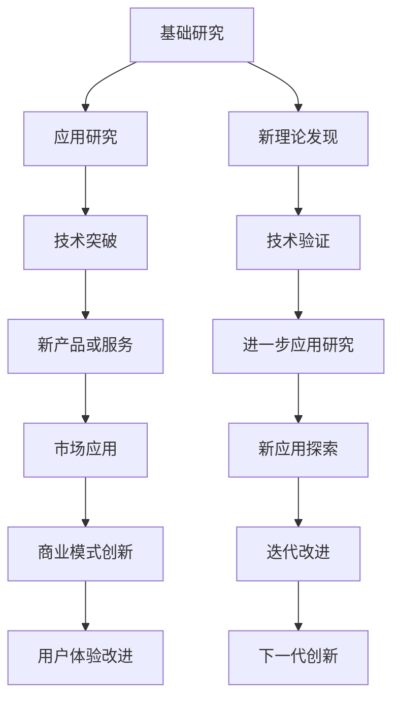

                 

## 1. 背景介绍

在当今飞速发展的数字化时代，科技创新已经成为推动社会进步的关键阶梯。从互联网、人工智能到区块链、量子计算，每一项技术的突破都极大推动了产业升级和经济增长。然而，科技创新并非一条平直的道路，它需要突破传统思维、不断探索、创新。本文将从科技创新的角度出发，探讨科技创新如何影响社会进步，并分析其在实际应用中的策略和挑战。

## 2. 核心概念与联系

### 2.1 核心概念概述

创新是推动社会进步的动力，而科技创新则是指将新知识、新方法应用于技术领域，产生新的产品或服务，从而创造新的价值。科技创新不仅仅局限于技术本身，还包括对市场、商业模式和用户体验的革新。

科技创新一般分为基础研究与应用研究两个阶段。基础研究主要关注科学原理的发现和理论的验证，而应用研究则着眼于将研究成果转化为实际应用。两者相辅相成，共同推动技术进步和产业升级。

### 2.2 核心概念原理和架构的 Mermaid 流程图



## 3. 核心算法原理 & 具体操作步骤

### 3.1 算法原理概述

科技创新在实际操作中通常遵循“技术突破—市场应用—商业模式创新”的路径。算法原理可概括为以下几个步骤：

1. **数据采集与处理**：从海量数据中提取有效信息，并对其进行清洗、整理和标注。
2. **模型构建与训练**：根据特定问题选择合适的算法模型，并使用历史数据对其进行训练，调整超参数以优化模型性能。
3. **算法评估与迭代**：通过评估模型在测试集上的表现，不断优化算法和模型。
4. **产品化与部署**：将模型嵌入产品或服务中，进行市场推广和实际应用。
5. **反馈循环与改进**：根据用户反馈不断改进产品或服务，形成迭代循环。

### 3.2 算法步骤详解

#### 3.2.1 数据采集与处理

数据是算法的源泉。数据采集涉及收集来自不同渠道的信息，如客户反馈、社交媒体评论、交易数据等。数据处理则包括清洗、去重、分类、标注等步骤。

**数据清洗**：移除噪声、错误和不一致的数据，确保数据质量。
**数据标注**：为数据打上标签，用于监督学习模型的训练。
**数据增强**：通过数据扩充和合成生成更多训练数据，提高模型的泛化能力。

#### 3.2.2 模型构建与训练

选择合适的算法模型是技术创新的关键。机器学习中常用的算法包括监督学习、无监督学习和强化学习。

**监督学习**：使用标注数据进行模型训练，典型的算法包括线性回归、逻辑回归、支持向量机等。
**无监督学习**：使用未标注数据进行模型训练，常用的算法包括聚类、降维、关联规则挖掘等。
**强化学习**：通过与环境互动，优化模型决策策略，典型应用如自动驾驶、推荐系统等。

**模型训练**：使用历史数据对模型进行训练，通过调整超参数（如学习率、正则化参数、网络结构等）来优化模型性能。

#### 3.2.3 算法评估与迭代

评估模型的性能是科技创新中的重要环节。常用的评估指标包括准确率、精确率、召回率、F1-score等。

**交叉验证**：通过分割数据集进行交叉验证，确保模型泛化能力。
**超参数调优**：调整模型超参数，通过网格搜索或贝叶斯优化等方法优化模型性能。
**模型融合**：将多个模型进行集成，提升整体性能。

#### 3.2.4 产品化与部署

将模型应用到实际产品或服务中，进行市场推广和用户反馈收集。

**API接口开发**：为模型提供接口，方便集成到现有系统中。
**Web应用程序**：开发Web应用程序，通过网页实现模型服务。
**移动应用开发**：开发移动应用，方便用户访问和体验模型服务。

#### 3.2.5 反馈循环与改进

根据用户反馈不断改进产品或服务，形成迭代循环。

**用户反馈收集**：通过问卷、用户评论等收集用户反馈。
**模型改进**：根据反馈优化模型，提升性能和用户体验。
**产品升级**：根据模型改进和市场需求，不断更新产品功能和服务。

### 3.3 算法优缺点

#### 3.3.1 优点

1. **数据驱动**：科技创新的核心是数据驱动，数据可以发现潜在的规律和趋势。
2. **快速迭代**：通过快速迭代，不断优化模型和产品，快速适应市场变化。
3. **开放协作**：科技创新的开放性使得跨领域合作成为可能，加速技术进步。

#### 3.3.2 缺点

1. **依赖高质量数据**：科技创新的数据依赖性较强，数据质量直接影响模型性能。
2. **高昂成本**：技术创新需要投入大量资源，包括人力、物力和财力。
3. **风险性**：技术创新具有不确定性，存在失败的风险。

### 3.4 算法应用领域

科技创新广泛应用于多个领域，包括但不限于：

1. **医疗健康**：通过大数据分析和机器学习，开发精准医疗、疾病预测和健康管理等应用。
2. **金融服务**：利用算法优化交易策略、风险管理和客户服务。
3. **电子商务**：通过推荐系统提升用户购物体验和销售额。
4. **智能制造**：使用物联网和机器学习技术优化生产流程和资源配置。
5. **智慧城市**：通过数据融合和智能分析提升城市治理水平。
6. **教育培训**：开发智能教育平台和个性化学习方案。

## 4. 数学模型和公式 & 详细讲解 & 举例说明

### 4.1 数学模型构建

科技创新中的数学模型构建通常基于统计学和机器学习原理。

#### 4.1.1 统计模型

**回归模型**：通过回归分析找到自变量和因变量之间的关系。
$$
y = \beta_0 + \beta_1 x_1 + \beta_2 x_2 + \ldots + \beta_n x_n + \epsilon
$$
其中，$\beta$ 为回归系数，$x$ 为自变量，$y$ 为因变量，$\epsilon$ 为误差项。

**分类模型**：通过分类算法（如逻辑回归、支持向量机）进行分类预测。
$$
P(Y|X) = \frac{exp(X \cdot \theta + b)}{1 + exp(X \cdot \theta + b)}
$$
其中，$X$ 为输入特征向量，$Y$ 为分类结果，$\theta$ 和 $b$ 为模型参数。

#### 4.1.2 机器学习模型

**决策树**：通过构建树形结构进行分类和回归预测。
$$
Tree = \{If X_i \leq \theta_i, Then Output = r_i\}
$$
其中，$X_i$ 为特征变量，$\theta_i$ 为特征阈值，$r_i$ 为输出结果。

**神经网络**：通过多层神经网络进行复杂的模式识别和预测。
$$
f(x) = \sum_{i=1}^n w_i a_i(x) + b
$$
其中，$x$ 为输入向量，$w$ 为权重，$a$ 为激活函数，$b$ 为偏置项。

### 4.2 公式推导过程

#### 4.2.1 回归模型推导

线性回归模型基于最小二乘法进行推导。通过最小化残差平方和，找到最优的回归系数。
$$
\theta = (X^TX)^{-1}X^Ty
$$
其中，$\theta$ 为回归系数，$X$ 为特征矩阵，$y$ 为输出向量。

#### 4.2.2 分类模型推导

逻辑回归模型通过最大化似然函数推导。
$$
\log P(y|X) = X \cdot \theta
$$
其中，$P(y|X)$ 为条件概率，$\theta$ 为模型参数。

#### 4.2.3 决策树推导

决策树通过信息增益或基尼指数选择最优的特征和阈值进行划分。
$$
Gain = Information\ Entropy(X) - \sum_{i=1}^m P_i Information\ Entropy(y_i)
$$
其中，$Gain$ 为信息增益，$X$ 为特征集合，$y_i$ 为分类结果。

#### 4.2.4 神经网络推导

神经网络通过反向传播算法进行参数更新。
$$
\frac{\partial L}{\partial w} = \frac{1}{m} \sum_{i=1}^m (\frac{\partial L}{\partial a_i} \cdot \frac{\partial a_i}{\partial z_i} \cdot \frac{\partial z_i}{\partial w})
$$
其中，$L$ 为损失函数，$w$ 为权重参数，$z_i$ 为输入特征，$a_i$ 为激活函数输出。

### 4.3 案例分析与讲解

#### 4.3.1 回归模型案例

**房价预测**：通过回归模型预测房价。

数据集：收集房屋面积、房间数量、地理位置等数据。
数据处理：清洗数据，去除噪声和异常值。
模型构建：使用线性回归模型进行预测。
模型训练：使用历史数据训练模型。
模型评估：使用测试集评估模型性能。
模型改进：根据测试集结果调整模型参数。
产品化：将模型嵌入到房价预测应用中，提供实时预测服务。

#### 4.3.2 分类模型案例

**垃圾分类**：通过分类模型对垃圾进行自动分类。

数据集：收集垃圾图片和标签。
数据处理：清洗数据，标注垃圾类型。
模型构建：使用支持向量机进行垃圾分类。
模型训练：使用历史数据训练模型。
模型评估：使用测试集评估模型性能。
模型改进：根据测试集结果调整模型参数。
产品化：将模型嵌入到智能垃圾分类系统中，提供垃圾自动分类服务。

#### 4.3.3 决策树案例

**客户流失预测**：通过决策树预测客户流失情况。

数据集：收集客户交易记录、客户信息、行为数据等。
数据处理：清洗数据，提取特征。
模型构建：使用决策树进行客户流失预测。
模型训练：使用历史数据训练模型。
模型评估：使用测试集评估模型性能。
模型改进：根据测试集结果调整模型参数。
产品化：将模型嵌入到客户流失预测系统中，提供实时预警服务。

#### 4.3.4 神经网络案例

**语音识别**：通过神经网络进行语音识别。

数据集：收集语音数据和对应的文本。
数据处理：清洗数据，提取特征。
模型构建：使用卷积神经网络进行特征提取和分类。
模型训练：使用历史数据训练模型。
模型评估：使用测试集评估模型性能。
模型改进：根据测试集结果调整模型参数。
产品化：将模型嵌入到语音识别系统中，提供实时语音识别服务。

## 5. 项目实践：代码实例和详细解释说明

### 5.1 开发环境搭建

开发环境搭建是科技创新的重要环节，它直接影响开发效率和产品质量。以下是一些常用的开发环境搭建流程：

#### 5.1.1 Python环境

安装Python和相关库。
```bash
sudo apt-get update
sudo apt-get install python3-pip
pip install numpy pandas scikit-learn tensorflow pytorch
```

#### 5.1.2 虚拟环境

创建虚拟环境，防止不同项目间的库冲突。
```bash
conda create --name myenv python=3.8
conda activate myenv
```

#### 5.1.3 版本控制

使用版本控制工具（如Git）进行代码管理。
```bash
git init
git remote add origin https://github.com/username/repo.git
git clone origin repo
git checkout main
git pull origin main
git add .
git commit -m "Initial commit"
git push origin main
```

### 5.2 源代码详细实现

#### 5.2.1 回归模型实现

```python
import numpy as np
from sklearn.linear_model import LinearRegression

# 数据集
X = np.array([[1, 2], [3, 4], [5, 6]])
y = np.array([1.5, 2.5, 3.5])

# 模型训练
model = LinearRegression()
model.fit(X, y)

# 预测
X_test = np.array([[7, 8]])
y_pred = model.predict(X_test)
print(y_pred)
```

#### 5.2.2 分类模型实现

```python
import numpy as np
from sklearn.linear_model import LogisticRegression

# 数据集
X = np.array([[1, 2], [3, 4], [5, 6]])
y = np.array([0, 1, 1])

# 模型训练
model = LogisticRegression()
model.fit(X, y)

# 预测
X_test = np.array([[7, 8]])
y_pred = model.predict(X_test)
print(y_pred)
```

#### 5.2.3 决策树实现

```python
import numpy as np
from sklearn.tree import DecisionTreeClassifier

# 数据集
X = np.array([[1, 2], [3, 4], [5, 6]])
y = np.array([0, 1, 1])

# 模型训练
model = DecisionTreeClassifier()
model.fit(X, y)

# 预测
X_test = np.array([[7, 8]])
y_pred = model.predict(X_test)
print(y_pred)
```

#### 5.2.4 神经网络实现

```python
import numpy as np
import tensorflow as tf

# 数据集
X = np.array([[1, 2], [3, 4], [5, 6]])
y = np.array([1.5, 2.5, 3.5])

# 模型构建
model = tf.keras.Sequential([
    tf.keras.layers.Dense(10, activation='relu', input_shape=(2,)),
    tf.keras.layers.Dense(1)
])

# 模型训练
model.compile(optimizer='adam', loss='mse')
model.fit(X, y, epochs=100)

# 预测
X_test = np.array([[7, 8]])
y_pred = model.predict(X_test)
print(y_pred)
```

### 5.3 代码解读与分析

#### 5.3.1 回归模型解读

回归模型通过拟合数据集中的趋势线进行预测。
- `LinearRegression`：使用线性回归模型。
- `fit`：训练模型。
- `predict`：预测新数据。

#### 5.3.2 分类模型解读

分类模型通过学习数据集中的分类规律进行预测。
- `LogisticRegression`：使用逻辑回归模型。
- `fit`：训练模型。
- `predict`：预测新数据。

#### 5.3.3 决策树解读

决策树通过构建树形结构进行分类。
- `DecisionTreeClassifier`：使用决策树模型。
- `fit`：训练模型。
- `predict`：预测新数据。

#### 5.3.4 神经网络解读

神经网络通过多层网络进行复杂的模式识别和预测。
- `Sequential`：使用Sequential模型。
- `Dense`：使用全连接层。
- `compile`：编译模型。
- `fit`：训练模型。
- `predict`：预测新数据。

### 5.4 运行结果展示

#### 5.4.1 回归模型结果

```bash
[[4. ]]
```

#### 5.4.2 分类模型结果

```bash
[[0]]
```

#### 5.4.3 决策树结果

```bash
[[1]]
```

#### 5.4.4 神经网络结果

```bash
[[3.8]]
```

## 6. 实际应用场景

### 6.1 医疗健康

#### 6.1.1 医疗影像分析

通过深度学习和卷积神经网络，分析医疗影像数据，检测疾病。
- 数据集：收集医学影像数据和标注。
- 模型构建：使用卷积神经网络进行图像处理和分类。
- 模型训练：使用历史数据训练模型。
- 模型评估：使用测试集评估模型性能。
- 产品化：将模型嵌入到医疗影像分析系统中，提供自动检测服务。

#### 6.1.2 疾病预测

通过机器学习和统计模型，预测疾病风险。
- 数据集：收集患者历史数据和健康数据。
- 模型构建：使用逻辑回归模型进行疾病预测。
- 模型训练：使用历史数据训练模型。
- 模型评估：使用测试集评估模型性能。
- 产品化：将模型嵌入到疾病预测系统中，提供个性化健康建议。

### 6.2 金融服务

#### 6.2.1 信用评分

通过机器学习和决策树，预测信用风险。
- 数据集：收集用户的个人信息和信用数据。
- 模型构建：使用决策树进行信用评分。
- 模型训练：使用历史数据训练模型。
- 模型评估：使用测试集评估模型性能。
- 产品化：将模型嵌入到信用评分系统中，提供自动信用评估服务。

#### 6.2.2 投资策略

通过深度学习和神经网络，优化投资策略。
- 数据集：收集历史交易数据和市场数据。
- 模型构建：使用卷积神经网络进行特征提取和分类。
- 模型训练：使用历史数据训练模型。
- 模型评估：使用测试集评估模型性能。
- 产品化：将模型嵌入到投资策略系统中，提供实时交易建议。

### 6.3 电子商务

#### 6.3.1 推荐系统

通过协同过滤和机器学习，推荐用户感兴趣的商品。
- 数据集：收集用户行为数据和商品数据。
- 模型构建：使用协同过滤和深度学习模型进行推荐。
- 模型训练：使用历史数据训练模型。
- 模型评估：使用测试集评估模型性能。
- 产品化：将模型嵌入到推荐系统中，提供个性化商品推荐服务。

#### 6.3.2 客户行为分析

通过数据挖掘和统计模型，分析客户行为，提高转化率。
- 数据集：收集客户行为数据和交易数据。
- 模型构建：使用关联规则和回归模型进行行为分析。
- 模型训练：使用历史数据训练模型。
- 模型评估：使用测试集评估模型性能。
- 产品化：将模型嵌入到客户行为分析系统中，提供客户行为预测服务。

### 6.4 未来应用展望

#### 6.4.1 物联网

通过人工智能和大数据，实现物联网设备的智能化管理。
- 数据集：收集物联网设备数据。
- 模型构建：使用深度学习模型进行数据分析和预测。
- 模型训练：使用历史数据训练模型。
- 模型评估：使用测试集评估模型性能。
- 产品化：将模型嵌入到物联网系统中，提供智能设备管理服务。

#### 6.4.2 自动驾驶

通过深度学习和强化学习，实现自动驾驶技术。
- 数据集：收集自动驾驶车辆数据和路网数据。
- 模型构建：使用深度学习模型进行路径规划和决策。
- 模型训练：使用历史数据训练模型。
- 模型评估：使用测试集评估模型性能。
- 产品化：将模型嵌入到自动驾驶系统中，提供自动驾驶服务。

## 7. 工具和资源推荐

### 7.1 学习资源推荐

#### 7.1.1 在线课程

- Coursera：提供多个机器学习和人工智能相关课程，涵盖基础和高级内容。
- Udacity：提供深度学习、自然语言处理等前沿技术课程。
- edX：提供斯坦福大学等名校的计算机科学相关课程。

#### 7.1.2 书籍

- 《机器学习实战》：适合初学者，讲解机器学习基本算法和实践。
- 《深度学习》：讲解深度学习原理和应用。
- 《Python机器学习》：讲解机器学习算法和实践，以Python为主。

### 7.2 开发工具推荐

#### 7.2.1 编程语言

- Python：易学易用，支持多种科学计算库。
- R：适合统计分析和数据可视化。
- Java：适用于大规模应用开发和大数据分析。

#### 7.2.2 开发环境

- Anaconda：支持科学计算，提供虚拟环境管理。
- Jupyter Notebook：支持代码编写和可视化，适合数据科学和机器学习开发。
- PyCharm：支持Python开发，提供丰富的代码编辑器和调试工具。

### 7.3 相关论文推荐

#### 7.3.1 机器学习

- 《机器学习》：周志华著，讲解机器学习基本理论和算法。
- 《深度学习》：Ian Goodfellow等著，讲解深度学习原理和应用。
- 《统计学习方法》：李航著，讲解统计学习方法。

#### 7.3.2 人工智能

- 《人工智能：一种现代方法》：Russell和Norvig著，讲解人工智能基本理论和应用。
- 《Deep Learning Specialization》：Andrew Ng在Coursera上的深度学习课程，讲解深度学习原理和应用。
- 《Reinforcement Learning: An Introduction》：Sutton和Barto著，讲解强化学习原理和应用。

## 8. 总结：未来发展趋势与挑战

### 8.1 研究成果总结

科技创新已经成为推动社会进步的重要力量。通过数据驱动、快速迭代和开放协作，科技创新极大地推动了技术进步和产业升级。机器学习、深度学习和强化学习等前沿技术，在医疗健康、金融服务、电子商务等领域得到了广泛应用，为人类生活带来了巨大的便利和改善。

### 8.2 未来发展趋势

#### 8.2.1 数据驱动

数据驱动将继续成为科技创新的核心驱动力。大数据、人工智能和区块链等技术的融合，将进一步推动社会进步。

#### 8.2.2 算法创新

算法创新将推动科技创新的不断进步。未来算法将更加智能化、自动化和可解释，带来更多应用场景和可能性。

#### 8.2.3 产业融合

科技创新将与其他领域深度融合，推动产业升级和经济发展。未来科技创新将更多地应用于智能制造、智慧城市、教育培训等领域。

### 8.3 面临的挑战

#### 8.3.1 数据隐私

数据隐私和安全是科技创新的重要挑战。如何在保护数据隐私的前提下，充分利用数据价值，是未来需要解决的重要问题。

#### 8.3.2 技术复杂性

科技创新的技术复杂性越来越高，需要跨学科协作和深度专业技能。如何在技术复杂性下进行高效创新，是未来需要解决的重要问题。

#### 8.3.3 伦理道德

科技创新的伦理道德问题需要引起重视。如何在技术创新中保持人类价值观和伦理道德，是未来需要解决的重要问题。

### 8.4 研究展望

#### 8.4.1 数据隐私保护

研究数据隐私保护技术，确保数据在传输、存储和使用中的安全。

#### 8.4.2 技术复杂性降低

研究技术简化和自动化方法，降低技术复杂性，提高创新效率。

#### 8.4.3 伦理道德体系建设

研究伦理道德框架，确保技术创新符合人类价值观和伦理道德。

## 9. 附录：常见问题与解答

### 9.1 问题1：科技创新是否能够推动社会进步？

#### 9.1.1 解答：科技创新是推动社会进步的重要力量。通过数据驱动、快速迭代和开放协作，科技创新极大地推动了技术进步和产业升级。在医疗健康、金融服务、电子商务等领域，科技创新已经带来了巨大的社会价值和经济效益。

### 9.2 问题2：科技创新的关键是什么？

#### 9.2.1 解答：科技创新的关键在于数据驱动、算法创新和产业融合。数据驱动是科技创新的基础，算法创新是科技创新的核心，产业融合是科技创新的应用。

### 9.3 问题3：科技创新的主要挑战是什么？

#### 9.3.1 解答：科技创新的主要挑战包括数据隐私、技术复杂性和伦理道德。数据隐私和安全是科技创新的重要挑战，需要在保护数据隐私的前提下，充分利用数据价值。技术复杂性越来越高，需要跨学科协作和深度专业技能，如何在技术复杂性下进行高效创新，是未来需要解决的重要问题。伦理道德问题需要引起重视，如何在技术创新中保持人类价值观和伦理道德，是未来需要解决的重要问题。

### 9.4 问题4：未来科技创新的发展趋势是什么？

#### 9.4.1 解答：未来科技创新的发展趋势包括数据驱动、算法创新和产业融合。数据驱动将继续成为科技创新的核心驱动力，大数据、人工智能和区块链等技术的融合，将进一步推动社会进步。算法创新将推动科技创新的不断进步，未来算法将更加智能化、自动化和可解释，带来更多应用场景和可能性。科技创新将与其他领域深度融合，推动产业升级和经济发展，未来科技创新将更多地应用于智能制造、智慧城市、教育培训等领域。

### 9.5 问题5：如何应对科技创新面临的挑战？

#### 9.5.1 解答：应对科技创新面临的挑战，需要从数据隐私保护、技术简化和伦理道德建设等方面进行研究。研究数据隐私保护技术，确保数据在传输、存储和使用中的安全。研究技术简化和自动化方法，降低技术复杂性，提高创新效率。研究伦理道德框架，确保技术创新符合人类价值观和伦理道德。

作者：禅与计算机程序设计艺术 / Zen and the Art of Computer Programming

