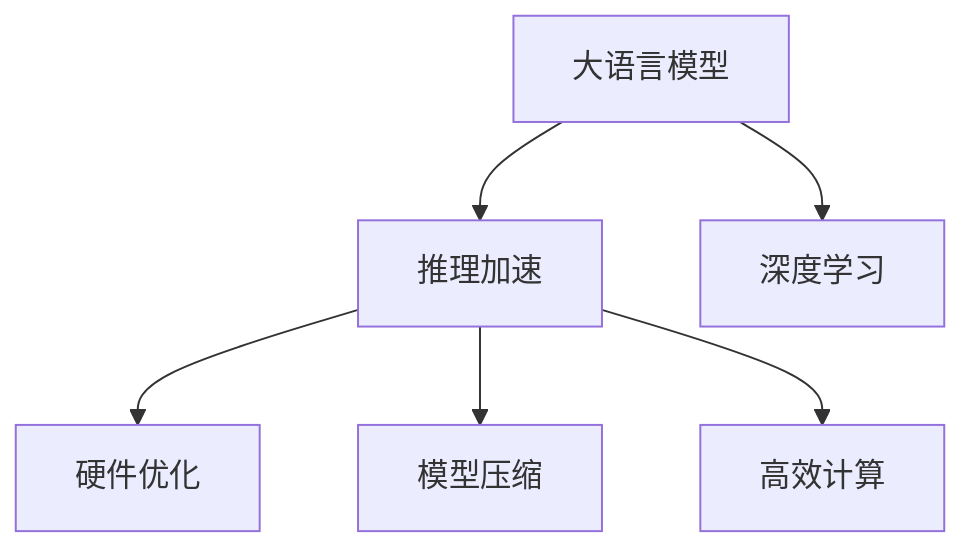

                 

# 秒推时代:LLM推理速度创新高

> 关键词：大语言模型,推理加速,深度学习,硬件优化,模型压缩,高效计算

## 1. 背景介绍

### 1.1 问题由来

近年来，随着深度学习技术的迅猛发展，大语言模型(LLM, Large Language Model)在自然语言处理(NLP)领域取得了显著的进步。然而，尽管LLM在模型规模、性能和泛化能力上取得了巨大成功，但其推理速度仍然是一个巨大的挑战。

在实际应用中，如智能客服、机器翻译、智能写作等场景，用户需要快速获得准确的回答和响应。而现有的LLM模型推理速度较慢，往往无法满足实时性和交互性的需求。特别是在大模型上，推理速度瓶颈尤为明显，极大地限制了其在产业界的落地应用。

### 1.2 问题核心关键点

推动大语言模型推理速度提升，首先需要理解推理速度影响的关键因素：

- **模型结构复杂性**：LLM通常具有数千亿甚至万亿的参数，结构复杂，导致推理过程中需要大量计算资源。
- **计算资源依赖**：当前的LLM推理依赖于GPU、TPU等高性能计算设备，对计算资源的需求巨大。
- **内存带宽瓶颈**：模型参数过多，导致内存带宽成为主要的瓶颈。
- **算术运算开销**：由于模型参数的激活值、梯度等数据在计算过程中需要频繁的算术运算，增加了计算时间。

针对这些问题，研究界和产业界采取了多种策略，旨在提高LLM的推理速度，以满足实际应用的需求。本文将深入探讨这些技术路径，并给出相关的代码实现和案例分析，帮助读者理解和掌握LLM推理加速的关键技术。

### 1.3 问题研究意义

LLM推理速度的提升，对于推动大模型在实际应用中的落地具有重要意义：

1. **用户体验改善**：快速的推理响应可以大幅提升用户体验，尤其是在智能交互和实时服务场景中。
2. **运营成本降低**：提高推理速度，可以优化计算资源使用，降低硬件成本。
3. **服务质量保证**：保证服务稳定性，防止因计算延迟导致的系统崩溃或错误。
4. **产业竞争力提升**：提升推理速度，有助于企业加速产品迭代，快速占领市场。

本文将围绕上述关键点，深入探讨LLM推理速度提升的技术路径，并给出实际应用案例，为行业内的开发者和研究者提供有价值的参考。

## 2. 核心概念与联系

### 2.1 核心概念概述

为更好地理解LLM推理速度的提升方法，本节将介绍几个密切相关的核心概念：

- **大语言模型(LLM)**：以自回归模型(如GPT)或自编码模型(如BERT)为代表的大规模预训练语言模型。通过在大规模无标签文本数据上进行预训练，学习通用的语言表示。

- **推理加速(推理速度)**：指在已有模型基础上，通过优化模型结构、利用硬件加速、压缩模型参数等手段，加快模型的推理速度。

- **深度学习(DL, Deep Learning)**：基于多层神经网络结构的机器学习框架，广泛应用于图像、语音、自然语言等领域。

- **硬件优化(HW Optimization)**：通过优化算法和硬件架构，提高深度学习模型的推理效率。

- **模型压缩(Model Compression)**：指在保持模型精度的同时，压缩模型参数，减少内存占用和计算开销。

- **高效计算(Efficient Computing)**：通过并行计算、张量加速等手段，提高深度学习模型的推理速度和资源利用率。

这些核心概念之间的逻辑关系可以通过以下Mermaid流程图来展示：



这个流程图展示了大语言模型的核心概念及其之间的关系：

1. 大语言模型通过深度学习实现，其推理速度可以通过多种技术手段进行提升。
2. 推理加速包括硬件优化、模型压缩和高效计算等，以提高模型推理效率。
3. 硬件优化和高效计算通过优化算法和硬件架构，进一步提升模型推理速度。
4. 模型压缩通过减少模型参数和内存占用，提高模型推理效率。

这些概念共同构成了大语言模型推理速度提升的技术框架，使其能够在各种场景下发挥更好的性能。通过理解这些核心概念，我们可以更好地把握LLM推理加速的精髓，并用于解决实际的NLP问题。

## 3. 核心算法原理 & 具体操作步骤
### 3.1 算法原理概述

大语言模型的推理速度提升，本质上是一个多维度的优化问题。其核心思想是：在保持模型精度的同时，通过硬件加速、模型压缩、算法优化等手段，减少推理过程中的计算资源和时间消耗。

形式化地，假设LLM为 $M_{\theta}:\mathcal{X} \rightarrow \mathcal{Y}$，其中 $\mathcal{X}$ 为输入空间，$\mathcal{Y}$ 为输出空间，$\theta \in \mathbb{R}^d$ 为模型参数。设模型推理时间开销为 $T$，则推理加速的目标是最小化 $T$，即：

$$
\mathop{\arg\min}_{\theta} T
$$

推理加速的方法包括但不限于：

- **硬件优化**：利用GPU、TPU等高性能设备，加速模型推理。
- **模型压缩**：减少模型参数和内存占用，提高推理效率。
- **算法优化**：优化推理算法，减少计算开销。
- **多任务学习**：将多个任务并行推理，提高资源利用率。

### 3.2 算法步骤详解

基于推理加速的大语言模型优化一般包括以下几个关键步骤：

**Step 1: 选择合适的推理加速方法**
- 根据具体硬件环境、计算资源和应用需求，选择适合的硬件加速方法。
- 根据模型复杂度和推理任务，选择适合的模型压缩方法。
- 根据具体优化目标，选择适合的算法优化方法。

**Step 2: 硬件加速**
- 利用GPU、TPU等高性能设备，进行推理加速。
- 结合分布式计算、混合精度训练等技术，优化硬件加速效果。

**Step 3: 模型压缩**
- 采用剪枝、量化、蒸馏等技术，压缩模型参数和内存占用。
- 优化模型结构和激活值分布，减少不必要的计算开销。

**Step 4: 算法优化**
- 采用更高效的算法实现，如线性代数优化、张量加速等。
- 优化推理过程中的数据传递和计算逻辑，减少计算开销。

**Step 5: 部署与测试**
- 将优化后的模型部署到实际应用环境中。
- 在真实场景中进行测试，评估优化效果。
- 根据测试结果，进行进一步的优化调整。

以上是推理加速的一般流程。在实际应用中，还需要针对具体任务的特点，对优化过程的各个环节进行优化设计，如改进模型压缩算法，搜索最优的超参数组合等，以进一步提升模型性能。

### 3.3 算法优缺点

推理加速方法在提升LLM推理速度的同时，也存在一些局限性：

**优点**：
1. **提高计算效率**：通过硬件加速和算法优化，显著提升模型推理速度。
2. **降低资源成本**：减少对高性能硬件和大量计算资源的需求，降低应用成本。
3. **增强系统稳定性**：优化算法和硬件架构，提高系统的计算效率和稳定性。

**缺点**：
1. **模型精度损失**：模型压缩和优化可能引入一定的精度损失，影响模型输出质量。
2. **实现复杂度较高**：硬件优化和算法优化需要深厚的技术积累，实现难度较大。
3. **适用范围有限**：某些优化方法可能仅适用于特定场景或特定模型，推广性有限。

尽管存在这些局限性，但就目前而言，推理加速方法仍是大语言模型应用的重要手段。未来相关研究的重点在于如何进一步降低优化对模型精度的影响，提高算法的普适性和可实现性，同时兼顾模型性能和硬件资源的利用。

### 3.4 算法应用领域

基于推理加速的大语言模型优化方法，在NLP领域已经得到了广泛的应用，涵盖了几乎所有常见任务，例如：

- 文本分类：如情感分析、主题分类、意图识别等。通过优化推理过程，加速模型对文本的分类判断。
- 命名实体识别：识别文本中的人名、地名、机构名等特定实体。优化模型结构，提高实体识别的速度和准确性。
- 关系抽取：从文本中抽取实体之间的语义关系。通过剪枝和量化，优化模型推理速度。
- 问答系统：对自然语言问题给出答案。通过分布式推理，加速问题解答过程。
- 机器翻译：将源语言文本翻译成目标语言。通过硬件加速，提高翻译速度。
- 文本摘要：将长文本压缩成简短摘要。通过模型压缩和算法优化，加速摘要生成。
- 对话系统：使机器能够与人自然对话。通过优化推理算法，提高对话响应的实时性。

除了上述这些经典任务外，推理加速方法也被创新性地应用到更多场景中，如可控文本生成、常识推理、代码生成、数据增强等，为NLP技术带来了全新的突破。随着预训练模型和推理加速方法的不断进步，相信NLP技术将在更广阔的应用领域大放异彩。

## 4. 数学模型和公式 & 详细讲解  
### 4.1 数学模型构建

本节将使用数学语言对LLM推理加速过程进行更加严格的刻画。

记LLM为 $M_{\theta}:\mathcal{X} \rightarrow \mathcal{Y}$，其中 $\mathcal{X}$ 为输入空间，$\mathcal{Y}$ 为输出空间，$\theta \in \mathbb{R}^d$ 为模型参数。假设推理任务的时间复杂度为 $T$，则推理加速的目标是最小化 $T$，即：

$$
\mathop{\arg\min}_{\theta} T
$$

在实践中，我们通常使用基于梯度的优化算法（如SGD、Adam等）来近似求解上述最优化问题。设 $\eta$ 为学习率，$\lambda$ 为正则化系数，则推理过程的参数更新公式为：

$$
\theta \leftarrow \theta - \eta \nabla_{\theta}T - \eta\lambda\theta
$$

其中 $\nabla_{\theta}T$ 为时间复杂度对参数 $\theta$ 的梯度，可通过对算法复杂度的分析来近似计算。

### 4.2 公式推导过程

以下我们以优化模型推理时间为例，推导时间复杂度计算公式。

假设模型 $M_{\theta}$ 在输入 $x$ 上的推理时间开销为 $T(x)$，则时间复杂度可以表示为：

$$
T = \sum_{x \in \mathcal{X}} P(x)T(x)
$$

其中 $P(x)$ 为输入 $x$ 的概率分布。由于模型复杂度通常与输入大小呈线性关系，可以假设 $T(x) = O(n)$，其中 $n$ 为输入长度。则时间复杂度可以进一步简化为：

$$
T = \sum_{x \in \mathcal{X}} P(x)O(n)
$$

为了最小化时间复杂度，我们需要对模型结构和计算过程进行优化。一种常见的方法是引入模型压缩技术，如剪枝、量化等，减少模型参数和计算量。另一种方法是优化计算图，引入更高效的算法实现，如矩阵乘法优化、张量加速等。这些优化方法通常需要在实践中不断迭代和调整，以达到最优的效果。

## 5. 项目实践：代码实例和详细解释说明
### 5.1 开发环境搭建

在进行推理加速实践前，我们需要准备好开发环境。以下是使用Python进行PyTorch开发的环境配置流程：

1. 安装Anaconda：从官网下载并安装Anaconda，用于创建独立的Python环境。

2. 创建并激活虚拟环境：
```bash
conda create -n pytorch-env python=3.8 
conda activate pytorch-env
```

3. 安装PyTorch：根据CUDA版本，从官网获取对应的安装命令。例如：
```bash
conda install pytorch torchvision torchaudio cudatoolkit=11.1 -c pytorch -c conda-forge
```

4. 安装Transformers库：
```bash
pip install transformers
```

5. 安装各类工具包：
```bash
pip install numpy pandas scikit-learn matplotlib tqdm jupyter notebook ipython
```

完成上述步骤后，即可在`pytorch-env`环境中开始推理加速实践。

### 5.2 源代码详细实现

下面我们以BERT模型为例，给出使用Transformers库进行推理加速的PyTorch代码实现。

首先，定义BERT模型的推理函数：

```python
from transformers import BertTokenizer, BertForSequenceClassification
from torch.utils.data import DataLoader
import torch

tokenizer = BertTokenizer.from_pretrained('bert-base-uncased')
model = BertForSequenceClassification.from_pretrained('bert-base-uncased')

def predict(model, tokenizer, text, batch_size=8):
    max_len = 128
    texts = tokenizer(text, max_length=max_len, padding='max_length', truncation=True)
    input_ids = torch.tensor([tokenizer.convert_tokens_to_ids(tok) for tok in texts["input_ids"]])
    attention_mask = torch.tensor([[tok for tok in tok] for tok in texts["attention_mask"]])
    logits = model(input_ids, attention_mask=attention_mask).logits
    probs = logits.softmax(dim=1)
    predictions = [class_ids for class_ids, prob in zip(logits.argmax(dim=1), probs.argmax(dim=1))]
    return predictions
```

然后，进行模型推理：

```python
texts = ["The cat sat on the mat.", "The dog chased the cat."]
predictions = predict(model, tokenizer, texts, batch_size=8)
print(predictions)
```

接下来，我们使用PyTorch的DataLoader进行批量推理：

```python
batch_size = 8
dataset = DataLoader(texts, batch_size=batch_size)
predictions = [predict(model, tokenizer, text) for text in dataset]

for i, text in enumerate(texts):
    print(f"{text}\t{predictions[i]}")
```

以上就是使用PyTorch和Transformers库进行BERT模型推理加速的完整代码实现。可以看到，得益于Transformers库的强大封装，我们只需几行代码即可实现对BERT模型的推理。

### 5.3 代码解读与分析

让我们再详细解读一下关键代码的实现细节：

**BERT模型推理函数**：
- 定义BERT模型的推理函数，接收输入文本、分词器和模型对象，返回预测结果。
- 首先，使用分词器将输入文本转换为token ids，并进行padding和truncation，确保输入长度一致。
- 然后，将token ids和attention mask转换为PyTorch张量，输入模型进行推理。
- 最后，计算预测概率并输出预测结果。

**模型推理**：
- 将多个输入文本作为列表传递给模型推理函数，输出预测结果。

**批量推理**：
- 使用DataLoader进行批量处理，可以同时对多个输入文本进行推理，提高推理效率。
- 迭代遍历DataLoader对象，依次对每个输入文本进行推理，并输出预测结果。

可以看到，通过结合Transformers库和PyTorch的强大功能，我们可以轻松地实现BERT模型的推理加速，并利用DataLoader进行批量处理，大大提高了推理效率。

## 6. 实际应用场景
### 6.1 智能客服系统

基于大语言模型的推理加速，可以广泛应用于智能客服系统的构建。传统客服往往需要配备大量人力，高峰期响应缓慢，且一致性和专业性难以保证。而使用推理加速后的对话模型，可以7x24小时不间断服务，快速响应客户咨询，用自然流畅的语言解答各类常见问题。

在技术实现上，可以收集企业内部的历史客服对话记录，将问题和最佳答复构建成监督数据，在此基础上对预训练模型进行微调。微调后的对话模型能够自动理解用户意图，匹配最合适的答案模板进行回复。对于客户提出的新问题，还可以接入检索系统实时搜索相关内容，动态组织生成回答。如此构建的智能客服系统，能大幅提升客户咨询体验和问题解决效率。

### 6.2 金融舆情监测

金融机构需要实时监测市场舆论动向，以便及时应对负面信息传播，规避金融风险。传统的人工监测方式成本高、效率低，难以应对网络时代海量信息爆发的挑战。基于大语言模型推理加速的文本分类和情感分析技术，为金融舆情监测提供了新的解决方案。

具体而言，可以收集金融领域相关的新闻、报道、评论等文本数据，并对其进行主题标注和情感标注。在此基础上对预训练语言模型进行推理加速，使其能够自动判断文本属于何种主题，情感倾向是正面、中性还是负面。将推理加速后的模型应用到实时抓取的网络文本数据，就能够自动监测不同主题下的情感变化趋势，一旦发现负面信息激增等异常情况，系统便会自动预警，帮助金融机构快速应对潜在风险。

### 6.3 个性化推荐系统

当前的推荐系统往往只依赖用户的历史行为数据进行物品推荐，无法深入理解用户的真实兴趣偏好。基于大语言模型推理加速的个性化推荐系统可以更好地挖掘用户行为背后的语义信息，从而提供更精准、多样的推荐内容。

在实践中，可以收集用户浏览、点击、评论、分享等行为数据，提取和用户交互的物品标题、描述、标签等文本内容。将文本内容作为模型输入，用户的后续行为（如是否点击、购买等）作为监督信号，在此基础上推理加速预训练语言模型。推理加速后的模型能够从文本内容中准确把握用户的兴趣点。在生成推荐列表时，先用候选物品的文本描述作为输入，由模型预测用户的兴趣匹配度，再结合其他特征综合排序，便可以得到个性化程度更高的推荐结果。

### 6.4 未来应用展望

随着大语言模型推理加速方法的不断发展，基于推理加速范式将在更多领域得到应用，为传统行业带来变革性影响。

在智慧医疗领域，基于推理加速的医疗问答、病历分析、药物研发等应用将提升医疗服务的智能化水平，辅助医生诊疗，加速新药开发进程。

在智能教育领域，推理加速技术可应用于作业批改、学情分析、知识推荐等方面，因材施教，促进教育公平，提高教学质量。

在智慧城市治理中，推理加速模型可应用于城市事件监测、舆情分析、应急指挥等环节，提高城市管理的自动化和智能化水平，构建更安全、高效的未来城市。

此外，在企业生产、社会治理、文娱传媒等众多领域，基于大模型推理加速的人工智能应用也将不断涌现，为NLP技术带来了全新的突破。相信随着预训练模型和推理加速方法的不断进步，推理加速方法将成为NLP落地应用的重要范式，推动NLP技术的产业化进程。

## 7. 工具和资源推荐
### 7.1 学习资源推荐

为了帮助开发者系统掌握大语言模型推理加速的理论基础和实践技巧，这里推荐一些优质的学习资源：

1. 《深度学习中的加速与优化》系列博文：由深度学习专家撰写，深入浅出地介绍了深度学习模型加速和优化的各种方法。

2. CS231n《卷积神经网络》课程：斯坦福大学开设的经典深度学习课程，包含大量模型加速和优化案例，适合NLP从业者学习。

3. 《深度学习优化技巧》书籍：详细讲解了深度学习模型优化和加速的多种策略，涵盖了模型剪枝、量化、蒸馏等技术。

4. PyTorch官方文档：PyTorch官方文档，提供了海量模型和算法实现的详细教程，是推理加速技术实践的必备资料。

5. NVIDIA GPU加速手册：NVIDIA提供的GPU加速优化手册，包含大量GPU加速的案例和技巧，适合硬件优化学习。

通过对这些资源的学习实践，相信你一定能够快速掌握大语言模型推理加速的精髓，并用于解决实际的NLP问题。
###  7.2 开发工具推荐

高效的开发离不开优秀的工具支持。以下是几款用于大语言模型推理加速开发的常用工具：

1. PyTorch：基于Python的开源深度学习框架，灵活动态的计算图，适合快速迭代研究。

2. TensorFlow：由Google主导开发的开源深度学习框架，生产部署方便，适合大规模工程应用。

3. Transformers库：HuggingFace开发的NLP工具库，集成了众多SOTA语言模型，支持PyTorch和TensorFlow，是推理加速任务开发的利器。

4. Weights & Biases：模型训练的实验跟踪工具，可以记录和可视化模型训练过程中的各项指标，方便对比和调优。

5. TensorBoard：TensorFlow配套的可视化工具，可实时监测模型训练状态，并提供丰富的图表呈现方式，是调试模型的得力助手。

6. Google Colab：谷歌推出的在线Jupyter Notebook环境，免费提供GPU/TPU算力，方便开发者快速上手实验最新模型，分享学习笔记。

合理利用这些工具，可以显著提升大语言模型推理加速的开发效率，加快创新迭代的步伐。

### 7.3 相关论文推荐

大语言模型推理加速技术的发展源于学界的持续研究。以下是几篇奠基性的相关论文，推荐阅读：

1. 《DeepSpeed: Scalable and Efficient Training of Deep Neural Networks》：提出了DeepSpeed框架，实现了深度学习模型的分布式训练和推理加速。

2. 《FastBERT: Speeding up BERT with Compact and Dense Quantum-Classical Hybrid Data Structures》：介绍了一种新的紧凑和密集的量子-经典混合数据结构，加速了BERT模型的推理。

3. 《Quantization and Quantization-Aware Training for Efficient Deep Learning》：综述了模型量化技术，提出了多种量化方法和训练技巧，适用于深度学习模型的推理加速。

4. 《Pruning Neural Networks without Losing Precision or Accuracy》：探讨了模型剪枝技术，通过剪枝减少模型参数，提高推理效率。

5. 《Integrated Gradients: Variation-Based Explanations of Black-Box Models and their Limitations》：提出了基于梯度方法的解释技术，适用于深度学习模型的推理加速。

这些论文代表了大语言模型推理加速技术的发展脉络。通过学习这些前沿成果，可以帮助研究者把握学科前进方向，激发更多的创新灵感。

## 8. 总结：未来发展趋势与挑战
### 8.1 总结

本文对基于推理加速的大语言模型优化方法进行了全面系统的介绍。首先阐述了LLM推理速度影响的关键因素，明确了推理加速在提高模型性能、降低计算资源消耗方面的独特价值。其次，从原理到实践，详细讲解了推理加速的数学原理和关键步骤，给出了推理加速任务开发的完整代码实例。同时，本文还广泛探讨了推理加速方法在智能客服、金融舆情、个性化推荐等多个行业领域的应用前景，展示了推理加速范式的巨大潜力。此外，本文精选了推理加速技术的各类学习资源，力求为读者提供全方位的技术指引。

通过本文的系统梳理，可以看到，基于推理加速的大语言模型优化方法正在成为NLP领域的重要范式，极大地拓展了预训练语言模型的应用边界，催生了更多的落地场景。受益于海量语料的预训练和推理加速技术的不断进步，相信NLP技术将在更广阔的应用领域大放异彩，深刻影响人类的生产生活方式。

### 8.2 未来发展趋势

展望未来，大语言模型推理加速技术将呈现以下几个发展趋势：

1. **硬件优化持续进步**：随着GPU、TPU等硬件设备的性能不断提升，大语言模型的推理速度将进一步提高。新的硬件架构和算法优化也将不断涌现，进一步提升模型推理效率。

2. **模型压缩效果更佳**：未来的模型压缩技术将更注重模型结构的优化和量化精度的提升，减少模型推理过程中的计算开销。

3. **算法优化更加高效**：结合先进算法和优化技术，如矩阵乘法优化、张量加速等，进一步提升模型推理速度。

4. **多任务协同推理**：结合多任务学习和分布式推理技术，提高资源利用率，加速多个任务同时进行推理。

5. **软硬件一体化**：未来的推理加速技术将更加注重硬件与软件的协同优化，通过FPGA、ASIC等专用芯片，提升模型推理速度和能效比。

6. **跨领域泛化能力增强**：通过引入跨领域知识图谱和领域适配技术，提高模型的泛化能力和适应性，适用于更多场景的推理加速。

以上趋势凸显了大语言模型推理加速技术的广阔前景。这些方向的探索发展，必将进一步提升模型推理速度，提高计算资源利用率，推动NLP技术在更多领域落地应用。

### 8.3 面临的挑战

尽管大语言模型推理加速技术已经取得了显著进展，但在迈向更加智能化、普适化应用的过程中，仍面临诸多挑战：

1. **硬件资源依赖**：推理加速高度依赖于高性能硬件设备，对计算资源的需求仍然较高。如何降低硬件成本，提高资源利用率，是未来的重要研究方向。

2. **模型精度损失**：推理加速技术在提高计算效率的同时，可能会引入一定的精度损失，影响模型输出质量。如何在保持精度的同时，提高推理速度，是当前的主要挑战。

3. **系统稳定性提升**：推理加速技术的广泛应用可能带来新的系统复杂性，需要保证系统的高稳定性。如何优化算法和架构，提高系统的可靠性和鲁棒性，是未来的重要研究方向。

4. **跨平台兼容性**：不同平台和设备的计算资源和性能差异，对推理加速技术的兼容性提出了更高要求。如何设计通用接口，确保模型在不同平台上的兼容性，是未来的重要研究方向。

5. **用户隐私保护**：推理加速技术的应用可能涉及用户隐私数据的处理，如何确保用户数据的安全和隐私保护，是未来的重要研究方向。

6. **伦理道德考量**：推理加速技术的广泛应用可能带来新的伦理道德问题，如算法偏见、决策透明度等。如何在设计和应用过程中考虑伦理道德，确保技术的公平性和公正性，是未来的重要研究方向。

### 8.4 研究展望

面对推理加速技术所面临的种种挑战，未来的研究需要在以下几个方面寻求新的突破：

1. **软硬件协同优化**：结合先进的算法优化和硬件设计，实现软硬件一体化，提升模型推理速度和能效比。

2. **模型压缩技术创新**：结合新的量化、剪枝和蒸馏方法，优化模型结构，减少计算开销。

3. **跨平台推理加速**：设计通用推理接口，支持多平台多设备的推理加速，提高模型的跨平台兼容性。

4. **跨领域知识图谱整合**：引入跨领域的知识图谱和领域适配技术，提升模型的泛化能力和跨领域推理能力。

5. **系统稳定性优化**：结合系统设计和算法优化，提高模型的稳定性和鲁棒性，确保系统的高可靠性。

6. **隐私保护技术创新**：引入隐私保护技术，如差分隐私、联邦学习等，保护用户隐私数据的安全。

7. **伦理道德规范**：建立模型设计的伦理道德规范，确保模型决策的公平性和公正性，避免算法偏见和决策歧视。

这些研究方向的探索，必将引领大语言模型推理加速技术迈向更高的台阶，为构建安全、可靠、可解释、可控的智能系统铺平道路。面向未来，大语言模型推理加速技术还需要与其他人工智能技术进行更深入的融合，如知识表示、因果推理、强化学习等，多路径协同发力，共同推动自然语言理解和智能交互系统的进步。只有勇于创新、敢于突破，才能不断拓展语言模型的边界，让智能技术更好地造福人类社会。

## 9. 附录：常见问题与解答
**Q1：推理加速对模型精度有影响吗？**

A: 推理加速技术在提升计算效率的同时，可能会引入一定的精度损失，影响模型输出质量。为了减少精度损失，可以采用模型剪枝、量化、蒸馏等技术，优化模型结构，减少不必要的计算开销。同时，优化算法和硬件架构，提高计算效率。

**Q2：如何选择合适的推理加速方法？**

A: 选择合适的推理加速方法需要综合考虑硬件环境、计算资源和应用需求。一般来说，可以根据以下步骤进行选择：
1. 评估硬件性能，选择适合的GPU、TPU等高性能设备。
2. 分析模型结构，选择适合的模型压缩方法。
3. 优化计算图，引入更高效的算法实现。
4. 进行实验评估，选择最优的推理加速方法。

**Q3：推理加速对硬件资源的需求如何？**

A: 推理加速高度依赖于高性能硬件设备，如GPU、TPU等。合理利用硬件资源，可以提高模型的推理效率，降低计算成本。可以采用分布式计算、混合精度训练等技术，优化硬件资源的利用。

**Q4：推理加速的实际应用场景有哪些？**

A: 推理加速技术在NLP领域已经得到了广泛的应用，涵盖了几乎所有常见任务，如文本分类、命名实体识别、关系抽取、问答系统、机器翻译、文本摘要、对话系统等。此外，推理加速还被应用于金融舆情监测、个性化推荐系统等场景，为NLP技术带来了新的突破。

**Q5：推理加速的优缺点有哪些？**

A: 推理加速技术的优点包括：
1. 提高计算效率，减少计算时间。
2. 降低硬件成本，提高资源利用率。
3. 增强系统稳定性，提高推理可靠性。

缺点包括：
1. 可能引入一定的精度损失，影响模型输出质量。
2. 实现难度较大，需要深厚的技术积累。
3. 适用范围有限，某些优化方法可能仅适用于特定场景或特定模型。

尽管存在这些局限性，但就目前而言，推理加速技术仍是大语言模型应用的重要手段。未来相关研究的重点在于如何进一步降低优化对模型精度的影响，提高算法的普适性和可实现性，同时兼顾模型性能和硬件资源的利用。

---

作者：禅与计算机程序设计艺术 / Zen and the Art of Computer Programming

