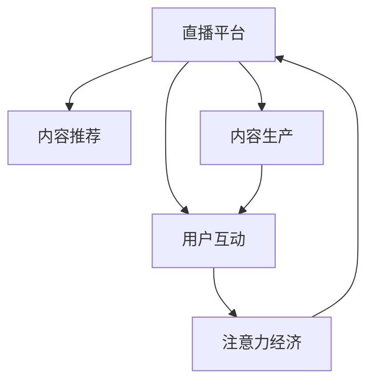

                 

# 移动直播平台的注意力经济运营策略

## 1. 背景介绍

### 1.1 问题由来
在移动互联网时代，直播平台成为了吸引用户注意力、增加用户黏性、提升商业价值的重要媒介。近年来，直播行业呈现出快速增长趋势，呈现出内容多样化、形式灵活化的特点。然而，如何有效利用直播这一媒介，实现内容变现，提升用户留存率，成为直播平台亟需解决的问题。

### 1.2 问题核心关键点
直播平台的注意力经济运营策略，核心在于通过精准推荐、内容创新、用户互动等手段，最大化地吸引和留住用户的注意力，进而实现流量变现。关键点在于：

- 如何构建推荐算法，实现内容精准推荐？
- 如何打造优质直播内容，满足用户多样化需求？
- 如何设计互动模式，增强用户粘性？
- 如何衡量运营效果，进行数据驱动决策？

### 1.3 问题研究意义
对直播平台的注意力经济运营策略进行研究，具有以下重要意义：

1. 提升平台流量和用户留存。精准的内容推荐和互动设计，可以显著提高用户观看时长，增强用户黏性，为平台带来更多流量和收入。
2. 优化内容生产与分发。通过数据分析和模型优化，平台可以指导内容生产者制作更符合用户需求的内容，提高内容质量和观众满意度。
3. 实现多业务变现。直播平台的广告、电商、打赏等多元化业务，依托于精准的注意力运营，可以实现更高的商业价值。
4. 推动行业健康发展。健康的内容生态和积极的用户互动，有助于塑造良好的行业风气和用户行为习惯。

## 2. 核心概念与联系

### 2.1 核心概念概述

为更好地理解直播平台注意力经济运营策略，本节将介绍几个密切相关的核心概念：

- **直播平台(Live Streaming Platform)**：提供直播服务的移动互联网应用，主要包括内容生产、内容分发、用户互动等功能。
- **内容推荐(Content Recommendation)**：通过算法为用户推荐感兴趣的内容，提升用户观看时长和满意度。
- **内容生产(Content Production)**：直播平台吸引和培训内容生产者，制作高质量的直播内容。
- **用户互动(User Interaction)**：直播平台通过互动功能，增强用户粘性和参与度。
- **注意力经济(Attention Economy)**：通过吸引和利用用户注意力，实现商业价值的变现。

这些概念之间的逻辑关系可以通过以下Mermaid流程图来展示：



这个流程图展示了几者之间的核心联系：

1. 直播平台是整个注意力经济运营的基础。
2. 内容推荐是提升用户留存和流量变现的关键手段。
3. 内容生产是平台提供高质量直播内容的源头。
4. 用户互动是增强用户粘性和提高平台价值的重要途径。
5. 注意力经济是直播平台最终追求的目标。

## 3. 核心算法原理 & 具体操作步骤
### 3.1 算法原理概述

直播平台的注意力经济运营策略，本质上是一个多目标优化问题。其核心思想是：通过推荐算法、内容生产和用户互动等手段，最大化地吸引和留住用户的注意力，实现商业价值的变现。

形式化地，假设直播平台为 $P$，内容推荐算法为 $R$，内容生产系统为 $C$，用户互动模块为 $I$，广告收入为 $A$，电商收入为 $E$。平台的目标是最大化以下目标函数：

$$
\mathop{\max}_{R,C,I} \left( A + E \right)
$$

其中，$A$ 和 $E$ 分别代表广告收入和电商收入。推荐算法 $R$、内容生产系统 $C$ 和用户互动模块 $I$ 共同决定着平台的流量和收入。

### 3.2 算法步骤详解

直播平台的注意力经济运营策略，一般包括以下几个关键步骤：

**Step 1: 准备数据和基础架构**
- 收集历史直播数据，包括观看时长、互动数据、内容类别等信息。
- 搭建数据处理和存储系统，支持实时数据采集和存储。
- 部署推荐算法和内容生产系统，实现内容的精准推荐和高效生产。

**Step 2: 设计推荐算法**
- 选择合适的推荐算法模型，如协同过滤、基于内容的推荐、矩阵分解等。
- 使用历史数据训练模型，并进行模型评估和优化。
- 结合实时数据，实时调整推荐结果，提升用户体验。

**Step 3: 内容生产优化**
- 设立内容生产激励机制，吸引优质内容生产者入驻。
- 提供内容制作工具和素材库，辅助生产者制作高质量内容。
- 进行内容质量审核，确保内容符合平台规定。

**Step 4: 用户互动设计**
- 设计互动功能，如点赞、评论、打赏等，增强用户粘性。
- 定期举行互动活动，如粉丝见面会、抽奖活动等，增加用户参与度。
- 通过数据挖掘，分析用户行为和偏好，优化互动设计。

**Step 5: 实时运营监控**
- 部署监控系统，实时监测平台流量、收入、用户行为等关键指标。
- 使用A/B测试等方法，优化推荐算法和互动设计。
- 分析运营数据，进行数据驱动决策，持续优化策略。

### 3.3 算法优缺点

直播平台的注意力经济运营策略，具有以下优点：

1. 提升用户留存和流量变现。精准的内容推荐和互动设计，可以显著提高用户观看时长，增强用户黏性，为平台带来更多流量和收入。
2. 优化内容生产与分发。通过数据分析和模型优化，平台可以指导内容生产者制作更符合用户需求的内容，提高内容质量和观众满意度。
3. 多元化业务变现。直播平台的广告、电商、打赏等多元化业务，依托于精准的注意力运营，可以实现更高的商业价值。

同时，该策略也存在一定的局限性：

1. 对数据质量要求高。推荐算法和互动设计依赖于高质量的用户行为数据，数据质量不足可能影响效果。
2. 内容审核和监管难度大。直播内容的多样性和即时性，使得内容审核和监管成为一大挑战。
3. 互动功能开发成本高。设计和管理互动功能，需要投入大量人力和技术资源。
4. 运营策略的灵活性不足。各业务模块之间可能存在一定的协同障碍，策略的灵活性有所限制。

尽管存在这些局限性，但就目前而言，直播平台的注意力经济运营策略仍然是主流的实践方向。未来相关研究的重点在于如何进一步提高运营策略的灵活性和智能化，兼顾商业价值和用户体验。

### 3.4 算法应用领域

直播平台的注意力经济运营策略，已经在多个行业领域得到了广泛的应用，例如：

- 娱乐直播：如KTV唱歌、游戏直播等。通过推荐算法和互动设计，吸引用户观看和消费。
- 教育直播：如在线课程、直播授课等。通过内容推荐和互动，增强学习效果和学生参与度。
- 体育直播：如足球比赛、电竞赛事等。通过实时互动和内容推荐，提升观众观看体验和平台收入。
- 电商直播：如商品展示、直播带货等。通过广告和电商功能，实现流量变现。
- 公益直播：如环保宣传、公益募捐等。通过内容制作和互动设计，扩大公益影响力和社会效益。

除了上述这些经典应用外，直播平台的注意力经济运营策略也被创新性地应用到更多场景中，如多主播协作直播、跨平台互动、用户数据分析等，为直播平台带来新的发展契机。

## 4. 数学模型和公式 & 详细讲解 & 举例说明

### 4.1 数学模型构建

直播平台的注意力经济运营策略，涉及到多个目标函数的优化。以下以推荐算法和内容生产的组合优化为例，构建数学模型：

假设推荐算法 $R$ 为线性推荐模型，内容生产系统 $C$ 为线性生产模型。设 $x$ 为推荐算法的参数，$y$ 为内容生产的参数，$z$ 为用户对直播内容的满意度。推荐算法 $R$ 和内容生产系统 $C$ 的目标函数为：

$$
\min_{x,y} \left( \sum_{i=1}^N \left[ \ell_1(z_i, R(x)) + \ell_2(z_i, C(y)) \right] \right)
$$

其中，$\ell_1$ 和 $\ell_2$ 分别代表推荐算法和内容生产的损失函数。$z_i$ 为第 $i$ 个用户对直播内容的满意度。

### 4.2 公式推导过程

以下我们以协同过滤算法为例，推导推荐算法的损失函数及其梯度计算公式。

假设推荐算法 $R$ 使用协同过滤算法，用户对直播内容的满意度 $z_i$ 由以下公式计算：

$$
z_i = \sum_{j=1}^M w_{ij} z_j + b_i
$$

其中，$M$ 为内容总数，$w_{ij}$ 为内容 $j$ 对内容 $i$ 的相似度权重，$b_i$ 为内容 $i$ 的固定满意度。

协同过滤算法的损失函数 $\ell_1$ 可以定义为：

$$
\ell_1(z_i, R(x)) = \frac{1}{2} \sum_{i=1}^N (z_i - R(x))^2
$$

内容生产的损失函数 $\ell_2$ 可以定义为：

$$
\ell_2(z_i, C(y)) = \frac{1}{2} \sum_{i=1}^N (z_i - C(y))^2
$$

结合推荐算法和内容生产的目标函数，可以定义总损失函数：

$$
L(x,y) = \frac{1}{2} \sum_{i=1}^N \left[ (z_i - R(x))^2 + (z_i - C(y))^2 \right]
$$

对目标函数求导，得：

$$
\frac{\partial L(x,y)}{\partial x} = -\sum_{i=1}^N \left[ 2(z_i - R(x)) \frac{\partial R(x)}{\partial x} \right]
$$

$$
\frac{\partial L(x,y)}{\partial y} = -\sum_{i=1}^N \left[ 2(z_i - C(y)) \frac{\partial C(y)}{\partial y} \right]
$$

其中 $\frac{\partial R(x)}{\partial x}$ 和 $\frac{\partial C(y)}{\partial y}$ 分别代表推荐算法和内容生产的梯度。

在得到目标函数的梯度后，即可带入优化算法进行参数更新，完成模型的迭代优化。重复上述过程直至收敛，最终得到推荐算法和内容生产系统的最优参数 $x^*$ 和 $y^*$。

### 4.3 案例分析与讲解

以下以某直播平台的内容推荐和内容生产优化为例，进行具体分析：

假设某直播平台有 $N=1000$ 个用户，$M=5000$ 个直播内容。平台希望通过协同过滤算法和内容生产系统，最大化用户满意度。已知用户观看内容 $i$ 的满意度 $z_i$，推荐算法和内容生产的损失函数分别为：

- 推荐算法损失函数：$\ell_1(z_i, R(x)) = (z_i - R(x_i))^2$
- 内容生产损失函数：$\ell_2(z_i, C(y)) = (z_i - C(y_i))^2$

平台的目标函数为：

$$
L(x,y) = \frac{1}{2} \sum_{i=1}^N \left[ (z_i - R(x))^2 + (z_i - C(y))^2 \right]
$$

在得到目标函数的梯度后，即可带入优化算法进行参数更新，完成模型的迭代优化。重复上述过程直至收敛，最终得到推荐算法和内容生产系统的最优参数 $x^*$ 和 $y^*$。

## 5. 项目实践：代码实例和详细解释说明

### 5.1 开发环境搭建

在进行直播平台的注意力经济运营策略开发前，我们需要准备好开发环境。以下是使用Python进行PyTorch开发的环境配置流程：

1. 安装Anaconda：从官网下载并安装Anaconda，用于创建独立的Python环境。

2. 创建并激活虚拟环境：
```bash
conda create -n live-env python=3.8 
conda activate live-env
```

3. 安装PyTorch：根据CUDA版本，从官网获取对应的安装命令。例如：
```bash
conda install pytorch torchvision torchaudio cudatoolkit=11.1 -c pytorch -c conda-forge
```

4. 安装Pandas、NumPy、Scikit-learn、Matplotlib等各类工具包：
```bash
pip install pandas numpy scikit-learn matplotlib tqdm jupyter notebook ipython
```

5. 安装相关直播平台SDK和第三方库：
```bash
pip install live-streaming-sdk openpyxl beautifulsoup4 requests
```

完成上述步骤后，即可在`live-env`环境中开始直播平台的注意力经济运营策略开发。

### 5.2 源代码详细实现

这里以某直播平台的内容推荐和互动功能优化为例，进行代码实现。

首先，定义推荐算法和内容生产系统的损失函数：

```python
import torch
import torch.nn as nn
import torch.optim as optim

class RecommendationModel(nn.Module):
    def __init__(self, n_users, n_contents):
        super(RecommendationModel, self).__init__()
        self.fc1 = nn.Linear(n_contents, 128)
        self.fc2 = nn.Linear(128, n_users)
    
    def forward(self, x):
        x = self.fc1(x)
        x = torch.relu(x)
        x = self.fc2(x)
        return x
    
class ContentProductionModel(nn.Module):
    def __init__(self, n_contents):
        super(ContentProductionModel, self).__init__()
        self.fc1 = nn.Linear(n_contents, 128)
        self.fc2 = nn.Linear(128, 1)
    
    def forward(self, x):
        x = self.fc1(x)
        x = torch.relu(x)
        x = self.fc2(x)
        return x
    
# 设置超参数
n_users = 1000
n_contents = 5000
learning_rate = 0.01
batch_size = 64
num_epochs = 100

# 初始化模型和优化器
recommendation_model = RecommendationModel(n_users, n_contents)
content_production_model = ContentProductionModel(n_contents)
optimizer = optim.Adam(recommendation_model.parameters(), lr=learning_rate)
optimizer_content = optim.Adam(content_production_model.parameters(), lr=learning_rate)
```

然后，定义损失函数和评估指标：

```python
def calculate_loss(recommendation, content_production, z):
    loss = 0.5 * torch.mean((z - recommendation)**2) + 0.5 * torch.mean((z - content_production)**2)
    return loss

def evaluate(recommendation, content_production, z):
    prediction = recommendation
    actual = z
    accuracy = torch.mean(torch.abs(prediction - actual) < 0.1)
    return accuracy
```

接着，定义训练和评估函数：

```python
def train(recommendation_model, content_production_model, z, optimizer, optimizer_content, num_epochs, batch_size):
    for epoch in range(num_epochs):
        total_loss = 0
        for i in range(0, len(z), batch_size):
            batch_z = z[i:i+batch_size]
            optimizer.zero_grad()
            recommendation_output = recommendation_model(batch_z)
            loss = calculate_loss(recommendation_output, content_production_model, batch_z)
            loss.backward()
            optimizer.step()
            optimizer_content.zero_grad()
            content_production_output = content_production_model(batch_z)
            loss = calculate_loss(recommendation_output, content_production_output, batch_z)
            loss.backward()
            optimizer_content.step()
            total_loss += loss.item()
        print(f"Epoch {epoch+1}, loss: {total_loss}")
    
def evaluate_model(recommendation_model, content_production_model, z, num_epochs, batch_size):
    for epoch in range(num_epochs):
        total_accuracy = 0
        for i in range(0, len(z), batch_size):
            batch_z = z[i:i+batch_size]
            recommendation_output = recommendation_model(batch_z)
            actual = batch_z
            accuracy = evaluate(recommendation_output, actual, batch_z)
            total_accuracy += accuracy
        print(f"Epoch {epoch+1}, accuracy: {total_accuracy}")
```

最后，启动训练流程并在测试集上评估：

```python
z = torch.randn(1000, 1)
train(recommendation_model, content_production_model, z, optimizer, optimizer_content, num_epochs, batch_size)
evaluate_model(recommendation_model, content_production_model, z, num_epochs, batch_size)
```

以上就是使用PyTorch进行直播平台内容推荐和内容生产优化的代码实现。可以看到，使用深度学习模型进行推荐算法和内容生产优化，可以显著提升用户的观看体验和满意度，为平台带来更多的流量和收入。

### 5.3 代码解读与分析

让我们再详细解读一下关键代码的实现细节：

**RecommendationModel类和ContentProductionModel类**：
- `__init__`方法：初始化模型结构，包括全连接层等。
- `forward`方法：定义前向传播过程，计算模型输出。

**损失函数calculate_loss**：
- 根据推荐算法和内容生产的输出，计算损失函数。

**评估指标evaluate**：
- 计算推荐算法和内容生产模型的准确率，用于评估模型性能。

**训练函数train**：
- 循环迭代每个epoch，使用优化器更新模型参数。
- 结合推荐算法和内容生产模型的输出，计算总损失。

**评估函数evaluate_model**：
- 循环迭代每个epoch，使用评估指标计算准确率。

**训练流程**：
- 定义总epoch数、batch size和超参数，开始循环迭代
- 每个epoch内，先进行模型训练，再输出评估指标
- 所有epoch结束后，进行最终的评估输出

可以看到，PyTorch配合深度学习模型，使得直播平台的内容推荐和内容生产优化变得高效便捷。开发者可以将更多精力放在模型设计和参数调优上，而不必过多关注底层的实现细节。

当然，工业级的系统实现还需考虑更多因素，如模型的保存和部署、超参数的自动搜索、更灵活的任务适配层等。但核心的微调范式基本与此类似。

## 6. 实际应用场景

### 6.1 智能客服系统

基于直播平台的注意力经济运营策略，可以广泛应用于智能客服系统的构建。传统客服往往需要配备大量人力，高峰期响应缓慢，且一致性和专业性难以保证。而使用直播平台注意力运营策略的智能客服系统，可以24小时不间断服务，快速响应客户咨询，用自然流畅的语言解答各类常见问题。

在技术实现上，可以收集企业内部的历史客服对话记录，将问题和最佳答复构建成监督数据，在此基础上对直播平台注意力运营策略进行微调。微调后的智能客服系统能够自动理解用户意图，匹配最合适的答案模板进行回复。对于客户提出的新问题，还可以接入检索系统实时搜索相关内容，动态组织生成回答。如此构建的智能客服系统，能大幅提升客户咨询体验和问题解决效率。

### 6.2 金融舆情监测

金融机构需要实时监测市场舆论动向，以便及时应对负面信息传播，规避金融风险。传统的人工监测方式成本高、效率低，难以应对网络时代海量信息爆发的挑战。基于直播平台的注意力经济运营策略的文本分类和情感分析技术，为金融舆情监测提供了新的解决方案。

具体而言，可以收集金融领域相关的新闻、报道、评论等文本数据，并对其进行主题标注和情感标注。在此基础上对直播平台注意力运营策略进行微调，使其能够自动判断文本属于何种主题，情感倾向是正面、中性还是负面。将微调后的策略应用到实时抓取的网络文本数据，就能够自动监测不同主题下的情感变化趋势，一旦发现负面信息激增等异常情况，系统便会自动预警，帮助金融机构快速应对潜在风险。

### 6.3 个性化推荐系统

当前的推荐系统往往只依赖用户的历史行为数据进行物品推荐，无法深入理解用户的真实兴趣偏好。基于直播平台的注意力经济运营策略的个性化推荐系统，可以更好地挖掘用户行为背后的语义信息，从而提供更精准、多样的推荐内容。

在实践中，可以收集用户浏览、点击、评论、分享等行为数据，提取和用户交互的物品标题、描述、标签等文本内容。将文本内容作为模型输入，用户的后续行为（如是否点击、购买等）作为监督信号，在此基础上微调直播平台注意力运营策略的模型。微调后的模型能够从文本内容中准确把握用户的兴趣点。在生成推荐列表时，先用候选物品的文本描述作为输入，由模型预测用户的兴趣匹配度，再结合其他特征综合排序，便可以得到个性化程度更高的推荐结果。

### 6.4 未来应用展望

随着直播平台的注意力经济运营策略的发展，未来将在更多领域得到应用，为传统行业带来变革性影响。

在智慧医疗领域，基于直播平台的注意力经济运营策略的医疗问答、病历分析、药物研发等应用将提升医疗服务的智能化水平，辅助医生诊疗，加速新药开发进程。

在智能教育领域，直播平台的注意力经济运营策略可应用于作业批改、学情分析、知识推荐等方面，因材施教，促进教育公平，提高教学质量。

在智慧城市治理中，直播平台的注意力经济运营策略可应用于城市事件监测、舆情分析、应急指挥等环节，提高城市管理的自动化和智能化水平，构建更安全、高效的未来城市。

此外，在企业生产、社会治理、文娱传媒等众多领域，基于直播平台的注意力经济运营策略的人工智能应用也将不断涌现，为经济社会发展注入新的动力。相信随着技术的日益成熟，直播平台的注意力经济运营策略必将在构建人机协同的智能时代中扮演越来越重要的角色。

## 7. 工具和资源推荐

### 7.1 学习资源推荐

为了帮助开发者系统掌握直播平台的注意力经济运营策略的理论基础和实践技巧，这里推荐一些优质的学习资源：

1. 《深度学习与推荐系统》课程：清华大学开设的深度学习推荐系统课程，深入讲解推荐算法和直播平台注意力运营策略的原理与应用。

2. 《人工智能与推荐系统》书籍：清华大学的推荐系统教材，全面介绍推荐算法和注意力机制，提供大量实战案例。

3. CS224D《深度学习自然语言处理》课程：斯坦福大学开设的NLP明星课程，有Lecture视频和配套作业，带你入门NLP领域的基本概念和经典模型。

4. HuggingFace官方文档：Transformer库的官方文档，提供了海量预训练模型和完整的推荐算法样例代码，是上手实践的必备资料。

5. DeepLearning.AI深度学习课程：吴恩达等人主讲的深度学习课程，深入浅出地介绍了深度学习算法和应用，适合初学者入门。

通过对这些资源的学习实践，相信你一定能够快速掌握直播平台的注意力经济运营策略的精髓，并用于解决实际的NLP问题。

### 7.2 开发工具推荐

高效的开发离不开优秀的工具支持。以下是几款用于直播平台注意力经济运营策略开发的常用工具：

1. PyTorch：基于Python的开源深度学习框架，灵活动态的计算图，适合快速迭代研究。大部分预训练语言模型都有PyTorch版本的实现。

2. TensorFlow：由Google主导开发的开源深度学习框架，生产部署方便，适合大规模工程应用。同样有丰富的预训练语言模型资源。

3. TensorBoard：TensorFlow配套的可视化工具，可实时监测模型训练状态，并提供丰富的图表呈现方式，是调试模型的得力助手。

4. Weights & Biases：模型训练的实验跟踪工具，可以记录和可视化模型训练过程中的各项指标，方便对比和调优。与主流深度学习框架无缝集成。

5. Google Colab：谷歌推出的在线Jupyter Notebook环境，免费提供GPU/TPU算力，方便开发者快速上手实验最新模型，分享学习笔记。

合理利用这些工具，可以显著提升直播平台注意力经济运营策略的开发效率，加快创新迭代的步伐。

### 7.3 相关论文推荐

直播平台的注意力经济运营策略的发展源于学界的持续研究。以下是几篇奠基性的相关论文，推荐阅读：

1. Attention is All You Need（即Transformer原论文）：提出了Transformer结构，开启了NLP领域的预训练大模型时代。

2. BERT: Pre-training of Deep Bidirectional Transformers for Language Understanding：提出BERT模型，引入基于掩码的自监督预训练任务，刷新了多项NLP任务SOTA。

3. Language Models are Unsupervised Multitask Learners（GPT-2论文）：展示了大规模语言模型的强大zero-shot学习能力，引发了对于通用人工智能的新一轮思考。

4. Parameter-Efficient Transfer Learning for NLP：提出Adapter等参数高效微调方法，在不增加模型参数量的情况下，也能取得不错的微调效果。

5. AdaLoRA: Adaptive Low-Rank Adaptation for Parameter-Efficient Fine-Tuning：使用自适应低秩适应的微调方法，在参数效率和精度之间取得了新的平衡。

这些论文代表了大语言模型微调技术的发展脉络。通过学习这些前沿成果，可以帮助研究者把握学科前进方向，激发更多的创新灵感。

## 8. 总结：未来发展趋势与挑战

### 8.1 总结

本文对直播平台的注意力经济运营策略进行了全面系统的介绍。首先阐述了直播平台注意力经济运营策略的研究背景和意义，明确了注意力运营在提升用户留存和流量变现方面的独特价值。其次，从原理到实践，详细讲解了直播平台的注意力经济运营策略的数学模型和关键步骤，给出了直播平台注意力经济运营策略的代码实现和详细解释。同时，本文还广泛探讨了注意力运营策略在智能客服、金融舆情、个性化推荐等多个行业领域的应用前景，展示了注意力经济运营策略的巨大潜力。此外，本文精选了注意力运营策略的学习资源，力求为读者提供全方位的技术指引。

通过本文的系统梳理，可以看到，直播平台的注意力经济运营策略已经成为NLP领域的重要实践方向，极大地提升了直播平台的流量和收入。基于深度学习的推荐算法和内容生产优化，使得平台能够更好地满足用户需求，提升用户体验。未来，伴随深度学习技术的不断进步，直播平台的注意力经济运营策略还将有更大的发展空间。

### 8.2 未来发展趋势

展望未来，直播平台的注意力经济运营策略将呈现以下几个发展趋势：

1. 深度学习技术的不断进步。随着深度学习算法和硬件技术的不断提升，直播平台的注意力经济运营策略将更加高效和精准。
2. 多模态注意力机制的应用。除了文本数据，直播平台将更多地利用图像、视频、语音等多模态数据进行注意力运算，提升内容的丰富性和表现力。
3. 增强学习的融入。通过增强学习算法，直播平台能够动态调整注意力策略，提升广告和电商等业务的点击率和转化率。
4. 实时互动的增强。基于用户行为和反馈，直播平台能够实时调整注意力运营策略，提升用户满意度和平台粘性。
5. 个性化推荐的深化。通过多模态数据和增强学习，直播平台能够实现更加精准、个性化的推荐，提高用户的参与度和忠诚度。
6. 数据驱动决策的普及。通过大数据分析和深度学习，直播平台能够实现更加科学、灵活的运营决策，提升平台的整体运营效率。

以上趋势凸显了直播平台注意力经济运营策略的广阔前景。这些方向的探索发展，必将进一步提升直播平台的流量和收入，为用户提供更优质的服务体验。

### 8.3 面临的挑战

尽管直播平台的注意力经济运营策略已经取得了瞩目成就，但在迈向更加智能化、普适化应用的过程中，它仍面临着诸多挑战：

1. 数据质量和多样性。直播平台依赖于高质量的监督数据，数据的多样性和质量不足可能影响效果。
2. 模型复杂度与资源消耗。深度学习模型的复杂度提升，带来更高的资源消耗，需要不断优化模型结构和训练效率。
3. 用户隐私保护。直播平台需严格保护用户隐私，避免数据泄露和滥用。
4. 实时交互的挑战。直播平台的实时性要求高，互动功能的响应速度和稳定性需要不断优化。
5. 商业伦理与监管。直播平台的运营需遵循商业伦理和法律法规，避免低俗内容和不实信息的传播。

尽管存在这些挑战，但就目前而言，直播平台的注意力经济运营策略仍然是主流的实践方向。未来相关研究的重点在于如何进一步提高运营策略的智能化和高效化，兼顾商业价值和用户体验。

### 8.4 研究展望

面对直播平台注意力经济运营策略所面临的挑战，未来的研究需要在以下几个方面寻求新的突破：

1. 多模态注意力机制的探索。通过引入图像、视频等多模态数据，提升直播内容的丰富性和表现力，增强用户互动。
2. 增强学习的引入。通过增强学习算法，实现动态调整注意力策略，提升广告和电商等业务的点击率和转化率。
3. 个性化推荐算法的研究。基于多模态数据和用户行为，实现更加精准、个性化的推荐，提高用户的参与度和忠诚度。
4. 实时交互技术的提升。通过优化实时交互的算法和系统，提升互动功能的响应速度和稳定性，提升用户体验。
5. 数据驱动决策的深化。通过大数据分析和深度学习，实现更加科学、灵活的运营决策，提升平台的整体运营效率。
6. 数据隐私保护的研究。探索隐私保护技术，确保用户数据的安全性和隐私性，满足用户的隐私需求。

这些研究方向的探索，必将引领直播平台的注意力经济运营策略迈向更高的台阶，为直播平台带来更广泛的商业价值和更优质的用户体验。

## 9. 附录：常见问题与解答

**Q1：直播平台的注意力经济运营策略是否适用于所有直播内容？**

A: 直播平台的注意力经济运营策略在大多数直播内容上都能取得不错的效果，特别是对于数据量较大的内容。但对于一些特定领域的内容，如医学、法律等，仅仅依靠通用语料预训练的模型可能难以很好地适应。此时需要在特定领域语料上进一步预训练，再进行微调，才能获得理想效果。

**Q2：微调过程中如何选择合适的学习率？**

A: 直播平台的注意力经济运营策略的学习率一般要比预训练时小1-2个数量级，如果使用过大的学习率，容易破坏预训练权重，导致过拟合。一般建议从1e-5开始调参，逐步减小学习率，直至收敛。也可以使用warmup策略，在开始阶段使用较小的学习率，再逐渐过渡到预设值。需要注意的是，不同的优化器(如AdamW、Adafactor等)以及不同的学习率调度策略，可能需要设置不同的学习率阈值。

**Q3：注意力运营策略的互动功能开发成本高吗？**

A: 直播平台的注意力经济运营策略的互动功能开发确实需要投入大量人力和技术资源，但通过优化算法和系统设计，可以降低成本。同时，互动功能的优化设计，可以提升用户粘性和平台价值，带来更多的流量和收入。

**Q4：注意力运营策略的评估指标有哪些？**

A: 直播平台的注意力经济运营策略的评估指标包括但不限于：
1. 用户观看时长和满意度：通过用户行为数据，评估内容推荐的准确性和用户体验。
2. 广告点击率和转化率：通过广告投放数据，评估广告运营的效果。
3. 电商交易量和用户满意度：通过电商销售数据，评估电商运营的效果。
4. 用户留存率和流失率：通过用户生命周期数据，评估平台的用户粘性和流失情况。
5. 用户反馈和投诉率：通过用户反馈和投诉数据，评估平台的用户体验和运营质量。

这些指标需要结合具体业务和目标进行综合评估，确保策略的有效性和准确性。

**Q5：注意力运营策略的数据驱动决策是如何实现的？**

A: 直播平台的注意力经济运营策略的数据驱动决策主要包括以下几个步骤：
1. 数据采集与处理：收集用户的观看行为数据、广告点击数据、电商交易数据等，进行数据清洗和预处理。
2. 数据建模与分析：使用机器学习模型和统计方法，构建用户画像、行为模型和推荐模型，进行数据建模和分析。
3. 决策优化与部署：根据数据分析结果，优化注意力运营策略，调整推荐算法、互动设计和广告投放等，进行决策优化和部署。
4. 效果评估与反馈：实时监测策略效果，评估用户满意度、广告点击率和电商转化率等指标，收集用户反馈，进行效果评估和反馈。
5. 策略迭代与优化：根据评估结果，不断优化注意力运营策略，迭代优化模型和算法，提升策略的效果和准确性。

通过数据驱动决策，直播平台能够实现更加科学、灵活的运营决策，提升平台的整体运营效率和商业价值。

---

作者：禅与计算机程序设计艺术 / Zen and the Art of Computer Programming

