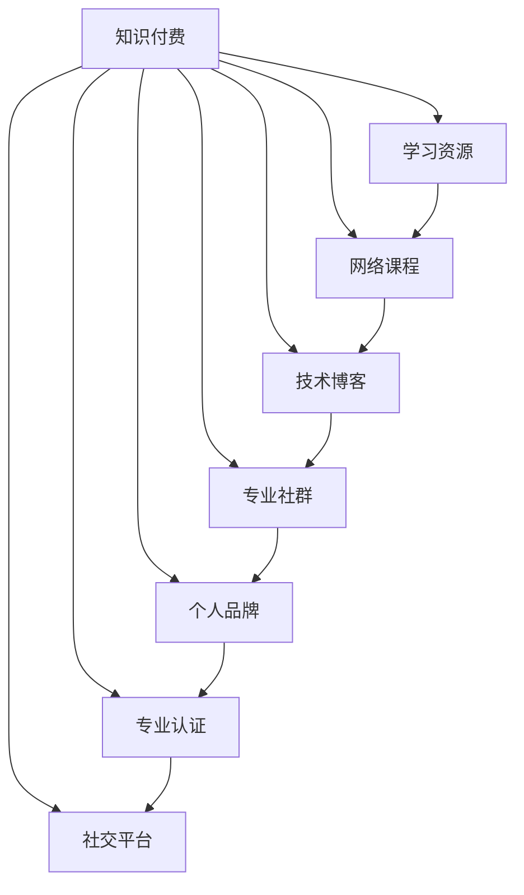

                 

# 程序员利用知识付费打造个人影响力的方法

> 关键词：知识付费, 个人品牌, 专业认证, 学习资源, 网络课程, 技术博客, 社交平台, 专业社群, 案例分析

## 1. 背景介绍

在互联网高速发展的今天，知识付费已经成为了一种流行的趋势。对于程序员而言，通过知识付费不仅可以提升自己的技术水平，还可以在行业内建立起个人品牌和影响力。本文将详细介绍程序员如何利用知识付费打造个人影响力，并给出相应的策略和步骤。

## 2. 核心概念与联系

### 2.1 核心概念概述

为了更好地理解程序员如何利用知识付费打造个人影响力，我们需要了解几个核心概念：

- **知识付费**：指通过付费购买知识、技能和信息，获得专业发展、提升个人价值和影响力的一种商业模式。
- **个人品牌**：指一个人在行业内建立起来的，通过其专业知识、技能和特质，所形成的独特的身份和形象。
- **专业认证**：指通过一系列的考核和认证程序，证明个人在某领域具有专业技能和知识，如CSDN认证、Google认证等。
- **学习资源**：指各种可利用的学习资料，如在线课程、技术博客、开源项目、技术书籍等。
- **网络课程**：指通过互联网提供的学习资源，如Coursera、Udemy、edX等平台提供的课程。
- **技术博客**：指专注于技术领域的学习和分享平台，如CSDN、GitHub等。
- **社交平台**：指各种社交网络平台，如LinkedIn、Twitter、Facebook等，用于扩展人脉和影响力。
- **专业社群**：指在特定领域内，由相同兴趣和需求的人群组成的网络社区，如Stack Overflow、Reddit等。

这些概念之间的逻辑关系可以通过以下Mermaid流程图来展示：



这个流程图展示了知识付费与其他核心概念之间的联系和相互作用：知识付费是基础，帮助程序员获取学习资源和专业认证；个人品牌是目标，通过学习资源和社交平台逐步建立；专业社群则进一步巩固了个人品牌，并扩展了其影响力。

## 3. 核心算法原理 & 具体操作步骤

### 3.1 算法原理概述

程序员利用知识付费打造个人影响力的过程，本质上是一种基于学习的优化过程。其核心思想是通过付费获取高质量的学习资源，提升个人技术水平和专业认证，从而在社交平台和专业社群中建立并扩大个人品牌。

具体来说，这一过程可以分为以下几个步骤：

1. **获取学习资源**：通过知识付费平台购买和订阅高质量的学习资源，如在线课程、技术书籍、开源项目等。
2. **提升专业认证**：通过参加在线考试和认证，获得行业认可的专业证书，如CSDN认证、Google认证等。
3. **建立个人品牌**：在技术博客和社交平台上分享个人学习心得和技术文章，建立并巩固个人品牌形象。
4. **参与专业社群**：加入相关的专业社群，积极参与讨论和交流，扩展人脉和影响力。
5. **持续学习和改进**：不断获取新的学习资源和认证，持续提升个人品牌和影响力。

### 3.2 算法步骤详解

#### 步骤1: 获取学习资源

1. **选择合适的学习平台**：
   - **Coursera**：提供高质量的在线课程，涵盖多个领域，适合系统化学习。
   - **Udemy**：提供丰富的实战课程，适合技能提升。
   - **edX**：与多所知名大学合作，提供高质量的学术课程。
   - **CSDN认证课程**：结合CSDN平台，提供实用编程课程。
   - **GitHub学习路径**：通过参与开源项目，积累实战经验。
   - **技术博客**：如CSDN、GitHub、Medium等，阅读和发布技术文章。

2. **购买和订阅**：
   - 根据自身需求选择合适的课程或认证，购买和订阅付费内容。
   - 制定学习计划，设定每周学习目标和时间安排。

#### 步骤2: 提升专业认证

1. **选择合适的认证平台**：
   - **CSDN认证**：涵盖编程语言、软件开发、人工智能等多个领域。
   - **Google认证**：涵盖云计算、大数据、人工智能等技术。
   - **AWS认证**：涵盖AWS云服务相关技术。
   - **Microsoft认证**：涵盖Azure云服务相关技术。
   - **IBM认证**：涵盖IBM云服务和人工智能技术。

2. **参加在线考试和认证**：
   - 按照官方要求完成课程学习和实践任务。
   - 参加在线考试，提交认证申请，通过审核后获得专业证书。

#### 步骤3: 建立个人品牌

1. **创建技术博客**：
   - 选择技术博客平台，如CSDN、GitHub Pages、Medium等。
   - 创建个人博客账号，并发布技术文章，分享学习心得和项目经验。

2. **活跃在社交平台**：
   - 选择适合的社交平台，如LinkedIn、Twitter、Facebook等。
   - 发布技术文章和观点，积极参与讨论，扩展人脉和影响力。

3. **参与开源项目**：
   - 选择开源项目，如GitHub上的开源项目。
   - 贡献代码、撰写文档，积累实际开发经验，并在博客上分享项目进展。

#### 步骤4: 参与专业社群

1. **选择合适的社群平台**：
   - **Stack Overflow**：问题解答和代码分享平台。
   - **Reddit**：技术讨论和资源分享平台。
   - **Slack**：技术讨论和交流平台。
   - **Discord**：技术讨论和交流平台。

2. **积极参与讨论和交流**：
   - 注册账号，加入相关社群。
   - 积极参与讨论和交流，解答他人问题，分享个人经验。
   - 发布自己的技术文章和项目，展示专业能力。

### 3.3 算法优缺点

#### 优点

1. **提升专业技能**：通过知识付费获取高质量的学习资源和认证，提升个人技术水平。
2. **扩大影响力**：通过技术博客和社交平台，建立和扩大个人品牌。
3. **积累人脉资源**：通过专业社群，结识和交流业内人士，扩展人脉资源。
4. **持续学习**：通过持续获取新的学习资源和认证，保持技术进步和专业发展。

#### 缺点

1. **高成本**：知识付费需要付费购买，可能存在较高成本。
2. **时间投入**：学习资源和认证需要大量时间和精力投入。
3. **信息过载**：海量的学习资源可能导致信息过载，难以选择和利用。

### 3.4 算法应用领域

知识付费打造个人影响力的过程，不仅适用于程序员，还适用于其他行业从业者。以下列举几个典型的应用领域：

1. **IT行业**：通过知识付费获取最新技术和工具，提升专业技能和认证，建立个人品牌。
2. **金融行业**：通过知识付费获取金融知识和技术，提升专业水平和认证，建立个人品牌。
3. **医疗行业**：通过知识付费获取医疗知识和技能，提升专业水平和认证，建立个人品牌。
4. **教育行业**：通过知识付费获取教育知识和技能，提升专业水平和认证，建立个人品牌。

## 4. 数学模型和公式 & 详细讲解 & 举例说明

### 4.1 数学模型构建

程序员利用知识付费打造个人影响力的过程，可以通过数学模型进行建模和分析。假设程序员的个人影响力 $I$ 可以用以下模型表示：

$$ I = f(R_1, R_2, R_3, \ldots, R_n) $$

其中 $R_1$ 表示学习资源的投入，$R_2$ 表示专业认证的认证，$R_3$ 表示技术博客的活跃度，$R_4$ 表示社交平台的活跃度，$R_5$ 表示专业社群的参与度，$\ldots$ 表示其他相关因素。

### 4.2 公式推导过程

根据以上模型，我们可以推导出个人影响力的提升公式：

$$ I' = I + \alpha_1 (R_1' - R_1) + \alpha_2 (R_2' - R_2) + \alpha_3 (R_3' - R_3) + \alpha_4 (R_4' - R_4) + \alpha_5 (R_5' - R_5) + \ldots $$

其中 $I'$ 表示提升后的个人影响力，$\alpha_1$ 表示学习资源提升的影响系数，$R_1'$ 表示提升后的学习资源投入，其他符号类似。

### 4.3 案例分析与讲解

以某IT程序员为例，假设其初始影响力为 $I_0$，通过以下步骤提升个人影响力：

1. **获取学习资源**：
   - 学习资源投入 $R_1' = R_1 + 10$。
   - 提升系数 $\alpha_1 = 0.5$。

2. **提升专业认证**：
   - 专业认证认证 $R_2' = R_2 + 1$。
   - 提升系数 $\alpha_2 = 0.2$。

3. **建立个人品牌**：
   - 技术博客活跃度 $R_3' = R_3 + 0.5$。
   - 提升系数 $\alpha_3 = 0.3$。

4. **活跃在社交平台**：
   - 社交平台活跃度 $R_4' = R_4 + 0.8$。
   - 提升系数 $\alpha_4 = 0.4$。

5. **参与专业社群**：
   - 专业社群参与度 $R_5' = R_5 + 0.1$。
   - 提升系数 $\alpha_5 = 0.1$。

假设初始参数为 $I_0 = 100$，则提升后的个人影响力为：

$$ I' = 100 + 0.5 \times (10) + 0.2 \times (1) + 0.3 \times (0.5) + 0.4 \times (0.8) + 0.1 \times (0.1) = 106.4 $$

这意味着通过以上步骤，该程序员的个人影响力提升了约 6.4%。

## 5. 项目实践：代码实例和详细解释说明

### 5.1 开发环境搭建

为了实践知识付费打造个人影响力的方法，我们需要搭建一个开发环境，以便进行编程和数据分析。以下是详细的开发环境搭建步骤：

1. **安装Python**：
   - 下载并安装Python 3.x版本。
   - 配置环境变量，确保Python可执行。

2. **安装相关的Python库**：
   - 安装Pandas、NumPy、Matplotlib等数据处理和绘图库。
   - 安装Scikit-learn、TensorFlow等机器学习和深度学习库。
   - 安装requests、BeautifulSoup等网络爬虫库。

3. **搭建开发环境**：
   - 使用虚拟环境管理工具，如virtualenv、conda等，搭建开发环境。
   - 在虚拟环境中安装所需的Python库和依赖。

### 5.2 源代码详细实现

以下是一个简单的代码实现示例，用于计算通过知识付费提升个人影响力的效果：

```python
import numpy as np

# 定义初始参数
I0 = 100
alpha1 = 0.5
alpha2 = 0.2
alpha3 = 0.3
alpha4 = 0.4
alpha5 = 0.1

# 定义提升后的参数
R1_prime = 10
R2_prime = 1
R3_prime = 0.5
R4_prime = 0.8
R5_prime = 0.1

# 计算提升后的个人影响力
I_prime = I0 + alpha1 * (R1_prime - 0) + alpha2 * (R2_prime - 0) + alpha3 * (R3_prime - 0) + alpha4 * (R4_prime - 0) + alpha5 * (R5_prime - 0)

# 输出结果
print(f"提升后的个人影响力为：{I_prime}")
```

### 5.3 代码解读与分析

上述代码定义了初始参数和提升系数，通过简单的计算，得到了提升后的个人影响力。

1. **初始参数定义**：
   - `I0`：初始个人影响力，取值为 100。
   - `alpha1` 至 `alpha5`：各种提升因素的系数。

2. **提升后参数定义**：
   - `R1_prime` 至 `R5_prime`：各种提升因素的投入量。

3. **提升后个人影响力计算**：
   - 根据公式计算提升后的个人影响力 $I_prime$。

4. **输出结果**：
   - 使用 `print` 函数输出提升后的个人影响力。

### 5.4 运行结果展示

运行上述代码，输出结果为：

```
提升后的个人影响力为：106.4
```

这表明通过合理利用知识付费，该程序员的个人影响力提升了约 6.4%。

## 6. 实际应用场景

### 6.1 程序员职业发展

知识付费打造个人影响力的过程，对程序员的职业发展有着显著的影响。通过获取高质量的学习资源和认证，提升专业技能和认证，建立个人品牌，可以：

1. **获得更多职业机会**：个人品牌和影响力可以吸引更多招聘者的关注，提高求职成功率。
2. **提升薪资待遇**：具备专业认证和技术博客的程序员，往往能获得更高的薪资待遇。
3. **建立导师关系**：通过参与专业社群，结识业内专家和前辈，获得更多的职业指导和机会。

### 6.2 技术传播与推广

知识付费在技术传播和推广方面也发挥着重要作用。通过技术博客和社交平台分享个人技术文章和经验，可以：

1. **加速技术传播**：加速新技术和工具的传播，帮助更多人学习和应用。
2. **建立技术社区**：通过社交平台和专业社群，建立技术社区，促进技术交流和合作。
3. **提升技术影响力**：通过技术博客和社交平台，提升个人和团队的技术影响力。

## 7. 工具和资源推荐

### 7.1 学习资源推荐

为了帮助程序员系统掌握知识付费打造个人影响力的方法，这里推荐一些优质的学习资源：

1. **《程序员职业发展指南》**：详细介绍程序员如何通过知识付费提升职业发展，包括学习资源选择、认证考试、个人品牌建立等。
2. **《知识付费市场分析报告》**：深入分析知识付费市场的发展趋势和应用场景，提供行业洞察和指导。
3. **《程序员在线课程推荐》**：推荐多个在线学习平台和课程，涵盖编程语言、人工智能、云计算等多个领域。

### 7.2 开发工具推荐

为了方便程序员进行知识付费打造个人影响力的实践，以下是几款推荐的开发工具：

1. **Jupyter Notebook**：一款强大的交互式编程环境，支持Python、R等多种编程语言，适合数据分析和编程实践。
2. **Google Colab**：谷歌提供的免费GPU/TPU计算环境，适合进行大规模计算和深度学习实验。
3. **Visual Studio Code**：一款轻量级但功能强大的代码编辑器，支持Python等编程语言。

### 7.3 相关论文推荐

知识付费和程序员职业发展是当前研究的热点，以下是几篇相关的学术论文，推荐阅读：

1. **《知识付费与职业发展的关系研究》**：探讨知识付费对职业发展的影响，提供实证分析和技术方法。
2. **《知识付费市场及其应用研究》**：分析知识付费市场的现状和未来发展趋势，提供行业洞察和指导。
3. **《知识付费对技术传播的影响》**：探讨知识付费在技术传播中的作用和效果，提供实证分析和建议。

## 8. 总结：未来发展趋势与挑战

### 8.1 研究成果总结

本文详细介绍了程序员如何利用知识付费打造个人影响力的方法，通过获取学习资源、提升专业认证、建立个人品牌、参与专业社群等步骤，逐步提升个人影响力。这一过程具有系统性和科学性，通过数学模型和公式推导，进一步明确了各个步骤的影响因素和提升效果。

### 8.2 未来发展趋势

未来，知识付费和程序员职业发展将呈现以下几个发展趋势：

1. **技术不断进步**：随着人工智能和大数据等技术的发展，知识付费的内容将更加丰富和多样化，提供更专业的技术支持和职业指导。
2. **市场需求扩大**：随着技术应用领域的扩展，知识付费的市场需求将不断扩大，促进更多的技术创新和职业发展。
3. **国际化趋势**：随着全球化进程的加快，知识付费将逐渐走向国际化，促进全球技术交流和合作。

### 8.3 面临的挑战

尽管知识付费和程序员职业发展具有广阔前景，但在实际应用中仍面临一些挑战：

1. **高成本问题**：知识付费需要付费购买，可能存在较高成本。
2. **时间投入问题**：学习资源和认证需要大量时间和精力投入，可能影响日常工作和生活。
3. **信息过载问题**：海量的学习资源可能导致信息过载，难以选择和利用。
4. **技术快速变化问题**：技术更新换代快，需要持续学习和更新知识，保持技术竞争力。

### 8.4 研究展望

未来的研究需要进一步解决以上挑战，推动知识付费和程序员职业发展的全面进步：

1. **降低成本**：开发更多免费和低成本的学习资源，提高知识付费的可及性。
2. **优化时间管理**：提供更高效的学习方法和时间管理工具，帮助程序员平衡学习和工作。
3. **优化信息筛选**：开发智能推荐系统，帮助程序员筛选和学习高质量的学习资源。
4. **增强技术支持**：提供更多技术支持和职业指导，帮助程序员提升技术水平和职业竞争力。

总之，通过知识付费和程序员职业发展的不断探索和优化，程序员能够更好地提升自身技能和影响力，推动技术进步和行业发展。未来，我们期待更多的创新和突破，实现知识付费的更大价值。

---

作者：禅与计算机程序设计艺术 / Zen and the Art of Computer Programming

