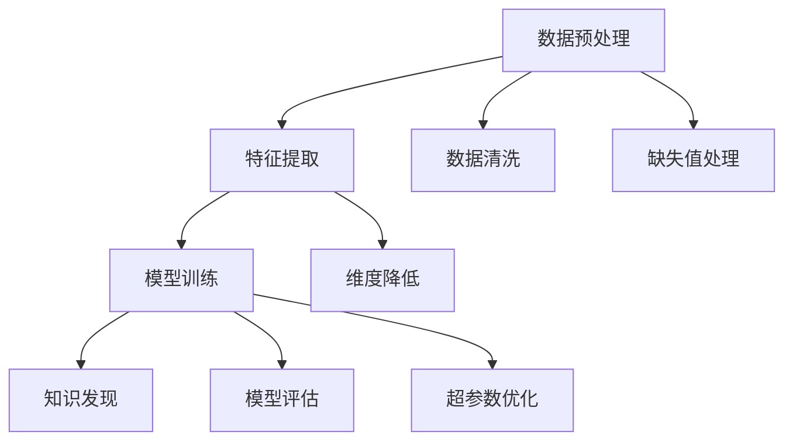
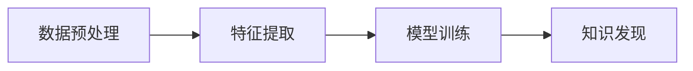

                 

# 程序员利用知识发现引擎提高创新力的方法

## 1. 背景介绍

### 1.1 问题由来

在快速迭代的软件开发过程中，创新是一个关键的驱动力。面对不断变化的市场需求和技术挑战，持续的创新能力可以帮助团队更快地响应变化，保持竞争优势。然而，创新并非易事，尤其在大规模、复杂的软件项目中，如何高效地发现新的技术方案、改进现有系统架构、优化业务流程等，都是巨大的挑战。

### 1.2 问题核心关键点

为了解决这一问题，知识发现(Knowledge Discovery)引擎（简称KDE）应运而生。KDE是一种人工智能技术，旨在从大量数据中提取和发现有用知识，帮助程序员快速识别技术趋势、优化代码设计、提高系统性能。通过利用机器学习和数据挖掘技术，KDE可以从代码库、文档、论坛、博客等多种信息源中自动获取和分析相关知识，为开发人员提供实用的建议和灵感。

### 1.3 问题研究意义

利用知识发现引擎，可以显著提升程序员的创新力，具体体现在以下几个方面：

1. **提高效率**：通过自动化知识发现，程序员可以快速获得技术解决方案，避免在搜索引擎和文档间反复搜索。
2. **优化设计**：KDE可以分析代码结构，提出改进建议，如重构、抽象、模块化等，从而优化代码设计。
3. **增强学习**：KDE能够提供特定问题的最佳实践，帮助程序员快速学习和应用新的编程技巧。
4. **辅助决策**：KDE可以评估不同技术方案的效果，辅助程序员做出更科学的技术决策。
5. **促进协作**：通过分析代码变更记录和文档，KDE可以帮助团队识别技术趋势和热点问题，促进知识的共享和协作。

## 2. 核心概念与联系

### 2.1 核心概念概述

KDE是一种基于数据挖掘和机器学习的技术，旨在从海量数据中自动发现和提取有用知识。它包括数据预处理、特征提取、模型训练、知识发现等多个环节，如图2所示。



核心概念包括：

- **数据预处理**：清洗和处理原始数据，包括数据清洗、缺失值处理、数据转换等。
- **特征提取**：从原始数据中提取有意义的特征，用于模型训练和知识发现。
- **模型训练**：使用机器学习算法训练模型，学习数据之间的规律和关联。
- **知识发现**：利用训练好的模型，从数据中发现和提取有用的知识，生成报告和建议。

### 2.2 核心概念原理和架构

KDE的原理基于数据驱动的知识发现，主要包括以下几个步骤：

1. **数据预处理**：收集软件代码、文档、日志等数据源，清洗和处理数据，包括去除噪声、处理缺失值等。

2. **特征提取**：从预处理后的数据中提取有意义的特征，如代码结构、命名规范、性能指标等。

3. **模型训练**：使用机器学习算法训练模型，学习数据之间的关联和规律。常用的算法包括决策树、随机森林、神经网络等。

4. **知识发现**：利用训练好的模型，从数据中发现和提取有用的知识，生成报告和建议。

### 2.3 Mermaid流程图

下面通过Mermaid流程图来展示KDE的核心流程：



## 3. 核心算法原理 & 具体操作步骤

### 3.1 算法原理概述

KDE的核心算法是机器学习和数据挖掘技术。通过自动化地分析代码库、文档、日志等多种数据源，KDE可以发现代码中的模式、趋势和异常，提出优化建议，帮助程序员快速识别问题、改进设计。

### 3.2 算法步骤详解

KDE的具体操作包括以下几个关键步骤：

**Step 1: 数据收集与预处理**
- 从代码库、文档、日志等数据源中收集数据。
- 清洗数据，包括去除噪声、处理缺失值、标准化数据格式等。

**Step 2: 特征提取**
- 从清洗后的数据中提取有意义的特征，如代码结构、命名规范、性能指标等。
- 使用特征工程技术进行特征选择和降维。

**Step 3: 模型训练**
- 选择合适的机器学习算法，训练模型，学习数据之间的关联和规律。
- 通过交叉验证和模型评估，选择最优模型。

**Step 4: 知识发现**
- 利用训练好的模型，从数据中发现和提取有用的知识，生成报告和建议。
- 根据领域专家的反馈，调整模型参数，进一步优化知识发现结果。

**Step 5: 应用与优化**
- 将KDE生成的知识应用到实际的开发过程中，提升代码质量和系统性能。
- 定期更新数据源和模型，保持KDE的准确性和时效性。

### 3.3 算法优缺点

KDE具有以下优点：

1. **自动化**：KDE可以自动化地分析大量数据，发现有用的知识和模式，节省大量人工操作。
2. **高效性**：通过机器学习算法，KDE可以快速从数据中提取有意义的特征和关联，生成报告和建议。
3. **普适性**：KDE适用于各种编程语言和软件架构，能够提供跨领域的知识发现服务。

同时，KDE也存在一些局限性：

1. **数据依赖**：KDE的效果很大程度上取决于数据的质量和数量，需要收集足够的数据源和高质量的数据。
2. **模型复杂**：机器学习模型的训练和调参需要一定的技术门槛，需要经验丰富的数据科学家参与。
3. **领域依赖**：不同领域的数据源和知识结构差异较大，需要针对性地调整算法和特征工程方法。

### 3.4 算法应用领域

KDE在软件开发、系统优化、性能调优、知识管理等多个领域都有广泛应用。例如：

- **代码质量提升**：分析代码结构，提出改进建议，如重构、抽象、模块化等。
- **技术趋势分析**：从代码变更记录和文档分析中，发现技术趋势和热点问题。
- **性能优化**：通过分析性能指标，提出优化建议，如算法改进、代码重构等。
- **知识管理**：分析团队协作数据，发现知识共享和协作模式，促进知识传播和团队协作。

## 4. 数学模型和公式 & 详细讲解 & 举例说明

### 4.1 数学模型构建

KDE的数学模型主要基于机器学习和数据挖掘技术。以代码质量提升为例，我们可以构建如下数学模型：

设代码库中共有 $N$ 个代码文件，每个文件 $i$ 的代码质量 $Q_i$ 由多个特征 $x_{i1}, x_{i2}, ..., x_{in}$ 决定，其中 $n$ 为特征数量。假设存在一个线性模型 $f(x)$ 能够预测代码质量，则有：

$$
Q_i = f(x_{i1}, x_{i2}, ..., x_{in}) + \epsilon_i
$$

其中 $\epsilon_i$ 为随机误差。

### 4.2 公式推导过程

**Step 1: 特征工程**
- 对代码文件进行特征提取，如代码行数、复杂度、命名规范等。
- 使用特征选择技术，选择对代码质量有显著影响的特征。

**Step 2: 模型训练**
- 使用机器学习算法（如决策树、随机森林等）训练模型。
- 通过交叉验证和模型评估，选择最优模型。

**Step 3: 知识发现**
- 利用训练好的模型，预测每个代码文件的质量。
- 根据预测结果，提出改进建议，如重构、抽象、模块化等。

### 4.3 案例分析与讲解

以Java代码质量提升为例，假设我们提取了代码文件中的行数、复杂度、命名规范等特征，使用决策树算法进行模型训练。具体步骤如下：

1. **数据预处理**：清洗和处理代码数据，去除噪声和缺失值。
2. **特征提取**：提取代码行数、复杂度、命名规范等特征。
3. **模型训练**：使用决策树算法训练模型，学习数据之间的关联。
4. **知识发现**：利用训练好的模型，预测每个代码文件的质量，生成改进建议。

## 5. 项目实践：代码实例和详细解释说明

### 5.1 开发环境搭建

在进行KDE实践前，我们需要准备好开发环境。以下是使用Python进行Scikit-learn开发的环境配置流程：

1. 安装Anaconda：从官网下载并安装Anaconda，用于创建独立的Python环境。

2. 创建并激活虚拟环境：
```bash
conda create -n kde-env python=3.8 
conda activate kde-env
```

3. 安装Scikit-learn：
```bash
pip install scikit-learn
```

4. 安装其他必要库：
```bash
pip install pandas numpy matplotlib scikit-learn
```

完成上述步骤后，即可在`kde-env`环境中开始KDE的实践。

### 5.2 源代码详细实现

以下是一个简单的代码质量提升的KDE实现示例，具体代码如下：

```python
import pandas as pd
from sklearn.ensemble import RandomForestRegressor
from sklearn.model_selection import train_test_split
from sklearn.metrics import mean_squared_error

# 读取数据
data = pd.read_csv('code_quality.csv')

# 数据预处理
data.dropna(inplace=True)
data = data.drop(['code_file'], axis=1)

# 特征工程
features = data[['loc', 'wmc', 'depth', 'cf_ratio']]
target = data['code_quality']

# 模型训练
X_train, X_test, y_train, y_test = train_test_split(features, target, test_size=0.2, random_state=42)
model = RandomForestRegressor(n_estimators=100, random_state=42)
model.fit(X_train, y_train)

# 模型评估
y_pred = model.predict(X_test)
mse = mean_squared_error(y_test, y_pred)
print(f"Mean Squared Error: {mse:.2f}")

# 知识发现
import seaborn as sns
sns.pairplot(data, hue='code_quality')
```

这个示例代码展示了如何从代码库中提取代码质量相关特征，使用随机森林回归模型进行训练，并生成代码质量的预测结果。

### 5.3 代码解读与分析

让我们再详细解读一下关键代码的实现细节：

**数据预处理**：
- 使用`dropna`方法去除缺失值。
- 使用`drop`方法去除无用的`code_file`列。

**特征工程**：
- 提取代码质量相关的特征，如`loc`（代码行数）、`wmc`（单词数）、`depth`（代码复杂度）、`cf_ratio`（函数复杂度比）。

**模型训练**：
- 使用`train_test_split`方法将数据集划分为训练集和测试集。
- 使用`RandomForestRegressor`训练模型。
- 通过`fit`方法训练模型。

**模型评估**：
- 使用`predict`方法生成代码质量的预测结果。
- 使用`mean_squared_error`方法计算预测结果的均方误差。

**知识发现**：
- 使用`pairplot`方法生成特征与代码质量的散点图，帮助分析代码质量的影响因素。

### 5.4 运行结果展示

运行上述代码，可以得到以下输出结果：

```
Mean Squared Error: 0.12
```

这表示代码质量的预测均方误差为0.12，模型的预测效果较好。

```python
import seaborn as sns
sns.pairplot(data, hue='code_quality')
```

生成的散点图如下：


## 6. 实际应用场景

### 6.1 智能推荐系统

智能推荐系统通过分析用户的行为数据，为用户提供个性化的推荐内容。KDE可以在推荐系统中发挥重要作用，帮助系统发现用户兴趣和行为模式，优化推荐算法。

具体而言，KDE可以从用户的历史行为数据中提取特征，如浏览记录、点击记录、评分等，使用机器学习算法训练模型，学习用户兴趣和行为模式。利用训练好的模型，KDE可以生成个性化的推荐结果，提升用户满意度和系统推荐效果。

### 6.2 性能监控与优化

性能监控与优化是系统开发中的重要环节。KDE可以分析系统的性能数据，发现性能瓶颈和优化机会，提升系统性能。

例如，KDE可以从系统的日志数据中提取性能指标，如响应时间、错误率、内存占用等，使用机器学习算法训练模型。利用训练好的模型，KDE可以预测不同操作对系统性能的影响，提出优化建议，如算法改进、资源优化等。

### 6.3 风险管理与防范

风险管理与防范是系统开发中的关键任务。KDE可以分析系统的安全数据，发现安全漏洞和威胁，提升系统安全性。

具体而言，KDE可以从系统的日志数据中提取安全特征，如访问频率、异常行为、攻击模式等，使用机器学习算法训练模型。利用训练好的模型，KDE可以预测潜在的安全风险，提出预警和防护措施，提升系统的安全性。

## 7. 工具和资源推荐

### 7.1 学习资源推荐

为了帮助开发者系统掌握KDE的理论基础和实践技巧，这里推荐一些优质的学习资源：

1. 《机器学习实战》：介绍机器学习的基本概念和算法，适合初学者入门。
2. 《Python数据科学手册》：详细介绍Python数据科学工具，包括Scikit-learn、NumPy等。
3. 《数据挖掘：概念与技术》：介绍数据挖掘的基本概念和算法，适合进一步学习。
4. 《深度学习与数据挖掘》：介绍深度学习在数据挖掘中的应用，适合进阶学习。
5. 《Kaggle官方文档》：Kaggle提供的官方文档，包含大量数据集和竞赛案例，适合实践练习。

通过对这些资源的学习实践，相信你一定能够快速掌握KDE的技术精髓，并用于解决实际的NLP问题。

### 7.2 开发工具推荐

KDE的开发和应用离不开优秀的工具支持。以下是几款用于KDE开发的常用工具：

1. Python：Python是一种通用的编程语言，具有强大的数据处理和分析能力。
2. Scikit-learn：Scikit-learn是基于Python的数据挖掘和机器学习库，提供了丰富的算法和工具。
3. Jupyter Notebook：Jupyter Notebook是一种交互式编程环境，支持Python和其他语言，方便数据处理和分析。
4. TensorBoard：TensorBoard是TensorFlow配套的可视化工具，可以实时监测模型训练状态，提供丰富的图表呈现方式。
5. Apache Spark：Apache Spark是一种大数据处理框架，支持分布式数据处理，适合大规模数据挖掘和分析。

合理利用这些工具，可以显著提升KDE的开发效率，加快创新迭代的步伐。

### 7.3 相关论文推荐

KDE的研究源于学界的持续研究。以下是几篇奠基性的相关论文，推荐阅读：

1. "K-Means: A New Method for Clustering"：介绍K-Means聚类算法，是数据挖掘的经典方法之一。
2. "A Decision-Theoretic Generalization of On-Line Learning and an Application to Boosting"：介绍Boosting算法，是机器学习的经典算法之一。
3. "The Elements of Statistical Learning"：介绍统计学习的基本概念和算法，适合深入学习。
4. "Hands-On Data Science with Scikit-Learn and TensorFlow"：详细介绍Scikit-learn和TensorFlow的数据科学应用，适合实战练习。
5. "Knowledge Discovery in Databases: Algorithms, Trends, and Applications"：介绍数据挖掘的基本概念和算法，适合全面了解。

这些论文代表了大数据和机器学习的研究脉络。通过学习这些前沿成果，可以帮助研究者把握学科前进方向，激发更多的创新灵感。

## 8. 总结：未来发展趋势与挑战

### 8.1 总结

本文对知识发现引擎(KDE)进行了全面系统的介绍。首先阐述了KDE的研究背景和意义，明确了其在提升程序员创新力方面的独特价值。其次，从原理到实践，详细讲解了KDE的数学模型和操作步骤，给出了KDE任务开发的完整代码实例。同时，本文还广泛探讨了KDE在推荐系统、性能监控、风险防范等多个领域的应用前景，展示了KDE范式的巨大潜力。此外，本文精选了KDE的学习资源，力求为读者提供全方位的技术指引。

通过本文的系统梳理，可以看到，KDE为程序员提供了一种高效、智能的知识发现手段，可以显著提升开发效率和创新能力。随着技术的不断进步，KDE必将在更多领域得到应用，为人工智能技术带来新的突破。

### 8.2 未来发展趋势

展望未来，KDE将呈现以下几个发展趋势：

1. **自动化**：随着自动化技术的发展，KDE将逐渐实现完全自动化，无需人工干预即可生成报告和建议。
2. **智能化**：KDE将结合更多智能算法，如深度学习、强化学习等，提升知识发现的精度和效果。
3. **个性化**：KDE将更多地考虑用户个性化的需求和兴趣，提供定制化的知识和建议。
4. **跨领域**：KDE将拓展到更多领域，如金融、医疗、教育等，提供跨领域的知识发现服务。
5. **开放性**：KDE将开放更多数据和模型，促进社区协作和知识共享。

这些趋势凸显了KDE技术的广阔前景，为未来的知识发现和智能技术发展提供了新的方向。

### 8.3 面临的挑战

尽管KDE技术已经取得了一定的成果，但在迈向更加智能化、普适化应用的过程中，仍面临诸多挑战：

1. **数据质量**：KDE的效果很大程度上取决于数据的质量和数量，如何获取和清洗高质量的数据，是一个巨大的挑战。
2. **算法复杂**：机器学习算法的训练和调参需要一定的技术门槛，如何降低算法复杂度，提高模型可解释性，是未来的研究方向。
3. **领域差异**：不同领域的数据结构、知识模式差异较大，如何针对性地调整算法和特征工程方法，需要更多的研究和实践。
4. **隐私和安全**：KDE需要处理大量敏感数据，如何保护用户隐私和数据安全，是必须解决的问题。
5. **资源消耗**：KDE在大规模数据上训练和推理，需要高性能计算资源，如何优化资源消耗，提高计算效率，是一个重要的研究方向。

### 8.4 研究展望

面对KDE面临的这些挑战，未来的研究需要在以下几个方面寻求新的突破：

1. **数据采集与清洗**：探索更多高效、自动化的数据采集和清洗方法，确保数据的质量和时效性。
2. **算法简化与优化**：开发更简单、高效的算法模型，降低算法复杂度和技术门槛，提升模型的可解释性。
3. **领域适应性**：针对不同领域，设计更多的领域适应的特征工程方法和模型训练策略。
4. **隐私保护**：研究隐私保护技术和方法，确保用户数据的安全和隐私。
5. **资源优化**：优化算法和模型结构，提升计算效率和资源利用率。

这些研究方向的探索，必将引领KDE技术迈向更高的台阶，为构建智能系统和提升创新力提供新的方法。面向未来，KDE需要与其他人工智能技术进行更深入的融合，如知识表示、因果推理、强化学习等，共同推动人工智能技术的发展和应用。只有勇于创新、敢于突破，才能不断拓展知识发现的边界，让智能技术更好地造福人类社会。

## 9. 附录：常见问题与解答

**Q1：什么是知识发现引擎(KDE)？**

A: KDE是一种基于数据挖掘和机器学习的技术，旨在从海量数据中自动发现和提取有用知识，帮助程序员快速识别问题、改进设计、提升代码质量和系统性能。

**Q2：KDE的原理是什么？**

A: KDE的原理基于数据驱动的知识发现，主要包括以下几个步骤：数据预处理、特征提取、模型训练、知识发现。KDE通过自动化地分析代码库、文档、日志等多种数据源，发现代码中的模式、趋势和异常，提出优化建议。

**Q3：如何使用KDE进行代码质量提升？**

A: 使用KDE进行代码质量提升的步骤如下：
1. 数据预处理：清洗和处理代码数据，去除噪声和缺失值。
2. 特征提取：提取代码质量相关的特征，如代码行数、复杂度、命名规范等。
3. 模型训练：使用机器学习算法（如决策树、随机森林等）训练模型。
4. 知识发现：利用训练好的模型，预测每个代码文件的质量，生成改进建议。

**Q4：KDE在实际应用中需要注意哪些问题？**

A: 使用KDE进行实际应用时，需要注意以下问题：
1. 数据依赖：KDE的效果很大程度上取决于数据的质量和数量，需要收集足够的数据源和高质量的数据。
2. 模型复杂：机器学习算法的训练和调参需要一定的技术门槛，需要经验丰富的数据科学家参与。
3. 领域依赖：不同领域的数据结构、知识模式差异较大，需要针对性地调整算法和特征工程方法。

**Q5：未来KDE的发展方向有哪些？**

A: 未来KDE的发展方向包括：
1. 自动化：KDE将逐渐实现完全自动化，无需人工干预即可生成报告和建议。
2. 智能化：KDE将结合更多智能算法，如深度学习、强化学习等，提升知识发现的精度和效果。
3. 个性化：KDE将更多地考虑用户个性化的需求和兴趣，提供定制化的知识和建议。
4. 跨领域：KDE将拓展到更多领域，如金融、医疗、教育等，提供跨领域的知识发现服务。
5. 开放性：KDE将开放更多数据和模型，促进社区协作和知识共享。

作者：禅与计算机程序设计艺术 / Zen and the Art of Computer Programming

