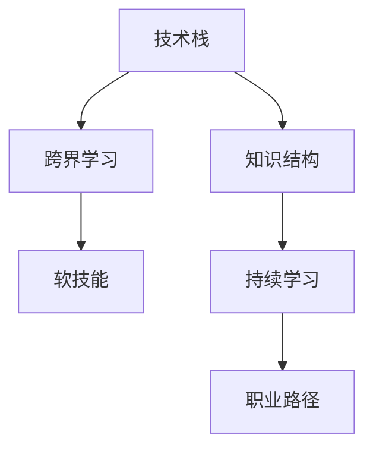

                 

# 程序员在知识经济时代的职业转型

## 1. 背景介绍

### 1.1 问题由来

在知识经济时代，技术的迅猛发展对程序员的技能和知识结构提出了新的要求。随着人工智能、大数据、云计算等技术的应用日益广泛，传统的编程语言、框架、开发方法已经难以应对新场景和新需求。为了适应技术变革，程序员需要不断学习新技术，提升自身的竞争力。但同时，工作时间、学习资源、职业发展路径等因素又限制了程序员的转型步伐。

### 1.2 问题核心关键点

为了帮助程序员顺利完成职业转型，本文将从技术、职业、心态等多个角度，深入探讨以下核心问题：

1. 如何评估自身技术栈和知识结构？
2. 如何快速学习新技能，提升职业竞争力？
3. 如何构建有效的工作和学习计划？
4. 如何拓展职业发展路径，实现技术升级？
5. 如何调整心态，应对职业转型的压力和挑战？

通过回答这些问题，本文旨在为程序员提供系统性的指导，帮助他们在知识经济时代实现职业转型。

## 2. 核心概念与联系

### 2.1 核心概念概述

为更好地理解程序员在知识经济时代的职业转型，本节将介绍几个密切相关的核心概念：

- 技术栈：程序员在工作中所使用的编程语言、框架、库、工具等的组合。
- 知识结构：程序员对所学技术的深度和广度的理解程度。
- 跨界学习：超越自己擅长的技术领域，学习并应用其他领域的知识和技能。
- 软技能：包括沟通能力、团队协作、问题解决、项目管理等非技术方面的能力。
- 持续学习：不断更新和学习新知识、新技能，以适应技术变化和行业发展。
- 职业路径：程序员基于自身兴趣、能力、市场需求等因素，选择的职业发展方向和步骤。

这些核心概念之间有着紧密的联系，共同构成了程序员职业转型的基础。通过理解这些概念，我们可以更清晰地规划和实施职业转型策略。

### 2.2 核心概念原理和架构的 Mermaid 流程图(Mermaid 流程节点中不要有括号、逗号等特殊字符)



这个流程图展示了核心概念之间的逻辑关系：

1. 技术栈和知识结构是基础，构成了程序员的职业身份和专业背景。
2. 跨界学习通过扩展技术栈和知识面，提升综合素质。
3. 软技能通过提升非技术能力，增强团队协作和项目管理。
4. 持续学习不断更新知识和技能，保持竞争力。
5. 职业路径基于以上因素，明确职业发展方向和步骤。

## 3. 核心算法原理 & 具体操作步骤
### 3.1 算法原理概述

程序员职业转型的核心算法原理基于个人技能和市场需求之间的匹配度评估，通过持续学习提升自身素质，最终找到合适的职业路径。以下是具体的算法原理概述：

1. **需求评估**：通过市场调研和职业分析，评估当前市场对程序员的技能需求。
2. **差距识别**：对比自身技能和市场需求的差距，明确需要学习和提升的内容。
3. **规划路径**：根据自身兴趣和能力，制定职业发展路径和阶段目标。
4. **执行学习**：通过系统的学习和实践，逐步提升技能和知识水平。
5. **验证转型**：通过项目实践和面试等方式，验证学习效果和市场适应性。

### 3.2 算法步骤详解

#### 3.2.1 需求评估

1. **市场调研**：利用招聘网站、技术博客、行业报告等资源，了解当前市场的技术需求和岗位要求。
2. **职位分析**：分析热门职位的技能要求，识别通用和特化的技能。
3. **自我评估**：通过技术测验、编程练习等方式，评估自身技能和知识水平。

#### 3.2.2 差距识别

1. **技能差距**：将自身技能和市场需求进行对比，识别技术栈的短板和不足之处。
2. **知识差距**：评估知识结构的广度和深度，确定需要学习和提升的领域。
3. **时间管理**：根据差距识别结果，制定合理的学习时间和进度安排。

#### 3.2.3 规划路径

1. **兴趣匹配**：结合自身兴趣和市场需求，选择有发展前景的技术方向。
2. **能力评估**：评估自身能力，设定合理的学习目标和阶段性成果。
3. **路径规划**：制定详细的职业发展路径，包括技术栈、项目经验、职业认证等。

#### 3.2.4 执行学习

1. **资源选择**：选择高质量的学习资源，如在线课程、书籍、技术社区等。
2. **学习实践**：通过项目实战、代码练习等方式，逐步提升技能和知识。
3. **定期评估**：定期回顾学习成果，调整学习计划和目标。

#### 3.2.5 验证转型

1. **项目实践**：通过实际项目验证学习效果，积累项目经验。
2. **面试准备**：准备面试问题，提升面试技巧和自信心。
3. **职业发展**：根据转型成果，选择职业发展路径，进入新领域。

### 3.3 算法优缺点

基于上述算法原理和操作步骤，程序员职业转型的核心算法具有以下优缺点：

#### 3.3.1 优点

1. **系统性**：通过科学评估和规划，确保转型过程有序进行。
2. **针对性**：结合自身兴趣和市场需求，选择有发展前景的技术方向。
3. **高效性**：通过系统的学习和实践，快速提升技能和知识水平。
4. **可验证性**：通过项目实践和面试等方式，验证学习效果和市场适应性。

#### 3.3.2 缺点

1. **复杂度**：需要全面评估自身技能和市场需求，识别差距，规划路径，过程复杂。
2. **时间和资源投入**：需要大量的时间和精力投入学习，可能影响日常工作。
3. **心理压力**：职业转型可能带来不确定性和压力，需要良好的心态调节。
4. **风险性**：市场需求和技术变化快速，转型过程中可能遇到意外情况。

## 4. 数学模型和公式 & 详细讲解 & 举例说明

### 4.1 数学模型构建

假设程序员技能与市场需求之间的匹配度可以用向量 $S$ 和 $D$ 表示，其中 $S$ 为程序员当前技能向量，$D$ 为市场需求向量。设 $G$ 为技能差距矩阵，$T$ 为时间管理参数，$E$ 为执行学习过程中的效率系数。则职业转型过程可以表示为以下优化问题：

$$
\min_{S} \sum_{i=1}^n (S_i - D_i)^2
$$

其中 $n$ 为技能维度，$S_i$ 和 $D_i$ 分别为第 $i$ 个技能的当前和市场需求值。

### 4.2 公式推导过程

1. **需求评估**：通过市场调研，确定 $D$ 向量。
2. **差距识别**：计算 $S$ 和 $D$ 的差距，确定 $G$ 矩阵。
3. **路径规划**：根据 $G$ 和 $T$，设定阶段性目标 $S^k$，其中 $k$ 为时间步长。
4. **执行学习**：根据 $S^k$ 和 $E$，设定学习计划 $S^{k+1}$。
5. **验证转型**：通过项目实践和面试，验证 $S^{k+1}$ 与 $D$ 的接近度，更新 $S$。

### 4.3 案例分析与讲解

假设一个后端开发工程师希望转型为前端开发工程师。通过市场调研，确定前端技能需求向量 $D$ 为 $(React, JavaScript, CSS, Node.js, TypeScript)$。当前技能向量 $S$ 为 $(Angular, Java, HTML, CSS, SQL)$。

1. **差距识别**：计算 $G$ 矩阵，发现 $React$ 和 $JavaScript$ 为需求的技能，$Angular$ 和 $Java$ 为当前的技能。差距矩阵 $G$ 为：

$$
\begin{bmatrix}
1 & 0 & 0 & 0 & 0 \\
0 & 1 & 0 & 0 & 0 \\
0 & 0 & 1 & 0 & 0 \\
0 & 0 & 0 & 0 & 1 \\
0 & 0 & 0 & 1 & 0
\end{bmatrix}
$$

2. **路径规划**：设定阶段性目标 $S^k$，其中 $k=1,2,3,...$。根据需求和差距，设计学习路径，如 $k=1$ 时，学习 $React$ 和 $JavaScript$。

3. **执行学习**：选择合适的学习资源，如在线课程和书籍。设定每天学习 2 小时，每周 5 天，共计 4 周。每周评估学习效果，调整学习计划。

4. **验证转型**：完成 $React$ 和 $JavaScript$ 学习后，通过项目实践和面试，验证学习效果。发现 $React$ 和 $JavaScript$ 掌握得较熟练，继续学习 $Node.js$ 和 $TypeScript$。

通过上述步骤，该后端开发工程师逐步转型为前端开发工程师，实现了职业转型。

## 5. 项目实践：代码实例和详细解释说明

### 5.1 开发环境搭建

在进行职业转型实践前，我们需要准备好开发环境。以下是使用Python进行机器学习开发的简单环境配置流程：

1. 安装Anaconda：从官网下载并安装Anaconda，用于创建独立的Python环境。

2. 创建并激活虚拟环境：
```bash
conda create -n ml-env python=3.8 
conda activate ml-env
```

3. 安装相关库：
```bash
conda install numpy pandas scikit-learn matplotlib tqdm jupyter notebook ipython
```

4. 安装可视化工具：
```bash
conda install matplotlib
```

5. 配置Jupyter Notebook：
```bash
jupyter notebook --allow-root
```

完成上述步骤后，即可在`ml-env`环境中开始职业转型实践。

### 5.2 源代码详细实现

下面我们以学习Python机器学习为例，给出系统的学习计划和项目实践代码。

首先，定义一个简单的学习计划：

```python
from datetime import datetime, timedelta

# 学习目标
goals = {
    '1': '掌握Python基础',
    '2': '学习机器学习算法',
    '3': '完成实战项目'
}

# 当前时间和学习时长
current_time = datetime.now()
study_duration = timedelta(days=30)
next_time = current_time + study_duration

# 学习进度
study_days = []
while current_time < next_time:
    study_days.append(current_time)
    current_time += timedelta(days=1)
    if current_time.day == 1 and current_time.month == 1:
        study_duration = timedelta(days=30)
        next_time = current_time + study_duration

# 输出学习进度
for day in study_days:
    print(f'学习进度：{day.strftime("%Y-%m-%d")}')
```

然后，定义一个简单的学习任务：

```python
from sklearn.datasets import load_iris
from sklearn.model_selection import train_test_split
from sklearn.tree import DecisionTreeClassifier
from sklearn.metrics import accuracy_score

# 加载数据集
data = load_iris()
X, y = data.data, data.target

# 分割数据集
X_train, X_test, y_train, y_test = train_test_split(X, y, test_size=0.2, random_state=42)

# 训练模型
model = DecisionTreeClassifier()
model.fit(X_train, y_train)

# 测试模型
y_pred = model.predict(X_test)
accuracy = accuracy_score(y_test, y_pred)
print(f'模型准确度：{accuracy:.2f}')
```

最后，在Jupyter Notebook中运行以上代码，记录学习进度和任务完成情况。通过这种方式，程序员可以系统地规划和执行学习任务，逐步提升技能和知识水平。

### 5.3 代码解读与分析

让我们再详细解读一下关键代码的实现细节：

**学习计划定义**：
- `goals`字典：定义了学习的阶段性目标。
- `current_time`：记录当前时间。
- `study_duration`：设定学习时长。
- `next_time`：计算下一个学习周期开始时间。
- `study_days`：生成学习进度时间列表。

**学习任务定义**：
- `load_iris`：加载经典数据集。
- `train_test_split`：分割数据集。
- `DecisionTreeClassifier`：选择决策树算法。
- `accuracy_score`：计算模型准确度。
- `model.fit`：训练模型。
- `model.predict`：测试模型。

通过上述代码，程序员可以系统地规划和执行学习任务，逐步提升技能和知识水平。同时，代码还通过记录学习进度和任务完成情况，帮助程序员及时调整学习计划，确保学习效果。

## 6. 实际应用场景

### 6.1 智能客服系统

在智能客服系统中，程序员可以通过学习机器学习和自然语言处理等技术，开发智能客服机器人，提高客户服务效率和满意度。具体而言，可以设计一个智能问答系统，通过对话式交互理解客户问题，并提供快速准确的答案。

### 6.2 金融舆情监测

在金融领域，程序员可以开发金融舆情监测系统，通过分析新闻、报道、评论等文本数据，实时监测市场舆情，辅助金融决策。具体实现可以包括情感分析、舆情分类等任务，帮助分析师及时掌握市场动态，规避金融风险。

### 6.3 个性化推荐系统

在电商和互联网领域，程序员可以开发个性化推荐系统，通过分析用户行为和偏好，推荐符合用户需求的商品和服务。具体实现可以包括用户画像构建、推荐算法设计等任务，提升用户体验和满意度。

### 6.4 未来应用展望

随着技术的不断进步，程序员在知识经济时代的职业转型将面临更多机遇和挑战。未来，程序员可以探索以下发展方向：

1. 数据科学：通过学习数据挖掘、数据分析等技术，构建数据驱动的业务决策系统。
2. 人工智能：通过学习深度学习、自然语言处理等技术，开发智能应用和服务。
3. 云计算：通过学习云平台搭建、微服务架构等技术，构建高效稳定的分布式系统。
4. 区块链：通过学习区块链技术，构建去中心化的应用和金融系统。
5. 自动化：通过学习自动化测试、机器人流程自动化等技术，提升企业运营效率。

## 7. 工具和资源推荐

### 7.1 学习资源推荐

为了帮助程序员系统掌握职业转型的理论和实践，这里推荐一些优质的学习资源：

1. Coursera：提供全球顶尖大学和企业的在线课程，涵盖数据科学、人工智能、机器学习等多个领域。
2. edX：由麻省理工学院、哈佛大学等顶尖学府创办的在线学习平台，提供高质量的课程资源。
3. Udacity：提供面向行业的技术课程和纳米学位，帮助程序员提升实战技能。
4. Kaggle：数据科学竞赛平台，提供丰富的数据集和竞赛机会，帮助程序员提升数据分析和机器学习能力。
5. GitHub：开源代码托管平台，提供丰富的项目资源和学习参考，帮助程序员学习新技术和实践经验。

通过以上资源，程序员可以系统地学习新知识和技能，提升自身竞争力。

### 7.2 开发工具推荐

为了提高程序员的学习效率和实践能力，这里推荐一些实用的开发工具：

1. Jupyter Notebook：基于浏览器的交互式开发环境，支持代码、数据、文档的混合展示。
2. Visual Studio Code：轻量级的代码编辑器，支持多种编程语言和扩展插件，提高开发效率。
3. PyCharm：Python开发集成环境，提供代码调试、自动化测试、版本控制等功能。
4. Git：分布式版本控制系统，支持多人协作和代码版本管理，提高团队协作效率。
5. Docker：容器化技术，支持应用程序的打包和部署，提高部署效率和可靠性。

通过以上工具，程序员可以高效地进行学习和实践，提升技能和知识水平。

### 7.3 相关论文推荐

程序员职业转型涉及多个领域，需要跨学科的知识和技术。以下是几篇经典论文，推荐阅读：

1. "Deep Learning" by Ian Goodfellow：全面介绍了深度学习的基本原理和算法，帮助程序员掌握深度学习技术。
2. "Pattern Recognition and Machine Learning" by Christopher M. Bishop：系统讲解了机器学习的基本理论和应用方法，帮助程序员提升机器学习能力。
3. "Reinforcement Learning: An Introduction" by Richard S. Sutton and Andrew G. Barto：介绍强化学习的理论基础和应用场景，帮助程序员掌握智能算法。
4. "Natural Language Processing with Python" by Steven Bird, Ewan Klein, and Edward Loper：提供自然语言处理的实践指导和代码示例，帮助程序员掌握NLP技术。
5. "Design Patterns: Elements of Reusable Object-Oriented Software" by Erich Gamma, Richard Helm, Ralph Johnson, and John Vlissides：介绍设计模式的基本概念和应用场景，帮助程序员提升代码设计能力。

通过以上论文，程序员可以深入理解各个领域的理论和实践，提升技术水平。

## 8. 总结：未来发展趋势与挑战

### 8.1 总结

本文对程序员在知识经济时代的职业转型进行了全面系统的介绍。首先阐述了技术变革对程序员技能和知识结构的新要求，明确了职业转型的关键问题。其次，从技术、职业、心态等多个角度，详细讲解了职业转型的核心算法和操作步骤。最后，通过项目实践和实际应用场景，展示了职业转型对程序员的实际价值和广阔前景。

通过本文的系统梳理，可以看到，职业转型对于程序员在知识经济时代保持竞争力至关重要。程序员需要系统规划和执行学习计划，不断更新和提升自身技能，才能适应技术变革和市场需求。

### 8.2 未来发展趋势

展望未来，程序员在知识经济时代的职业转型将呈现以下发展趋势：

1. **跨界融合**：跨学科技术和知识的融合将越来越深入，程序员需要具备多元化的技能和知识结构。
2. **技术迭代**：新技术和新工具层出不穷，程序员需要持续学习和实践，保持技术领先。
3. **人工智能**：AI技术的快速发展将对程序员职业带来深刻变革，智能自动化、数据科学等新兴领域将带来新的职业机会。
4. **自动化**：自动化技术将改变程序员的工作方式，提高效率和质量，同时也带来新的职业挑战。
5. **全球化**：全球化背景下的跨文化协作和市场竞争将更加激烈，程序员需要具备国际化的视野和能力。

### 8.3 面临的挑战

尽管职业转型具有广阔前景，但程序员在转型过程中仍面临诸多挑战：

1. **技术复杂性**：新技术和工具的学习曲线陡峭，需要投入大量时间和精力。
2. **市场需求变化**：市场需求和技术趋势不断变化，难以准确预测和适应。
3. **资源限制**：时间和精力有限，需要平衡日常工作和学习任务。
4. **心理压力**：职业转型带来的不确定性和压力，需要良好的心态调整。
5. **职业发展**：职业转型后的职业路径选择，需要全面的评估和规划。

### 8.4 研究展望

面对程序员职业转型所面临的挑战，未来的研究需要在以下几个方面寻求新的突破：

1. **智能化辅助**：开发智能化的学习工具和平台，帮助程序员系统规划和执行学习计划。
2. **自动化学习**：探索自动化学习算法和框架，提高学习效率和效果。
3. **社区支持**：构建开源社区和资源平台，促进知识共享和协作。
4. **个性化培训**：开发个性化培训方案，根据个人兴趣和能力，定制化培训计划。
5. **职业指导**：提供职业转型咨询和指导，帮助程序员制定合理的职业发展路径。

## 9. 附录：常见问题与解答

**Q1：如何评估自身技术栈和知识结构？**

A: 通过技术测验、项目实战、代码评审等方式，全面评估自身技术栈和知识结构的深度和广度。可以使用自动化工具如Code Climate、SonarQube等，辅助进行代码质量和安全评估。

**Q2：如何快速学习新技能，提升职业竞争力？**

A: 制定详细的学习计划，选择合适的学习资源，如在线课程、书籍、视频等。通过项目实战、代码练习等方式，逐步提升技能和知识水平。参与开源项目和社区讨论，积累实战经验。

**Q3：如何构建有效的工作和学习计划？**

A: 设定明确的学习目标和时间节点，合理分配学习时间和休息时间。利用时间管理工具如Trello、Todoist等，管理学习任务和进度。

**Q4：如何拓展职业发展路径，实现技术升级？**

A: 结合自身兴趣和市场需求，选择有发展前景的技术方向。积极参与行业会议和技术交流，拓展人脉和视野。通过不断学习和实践，逐步提升自身竞争力，实现技术升级。

**Q5：如何调整心态，应对职业转型的压力和挑战？**

A: 树立正确的职业观念，理解职业转型的意义和价值。通过自我激励、设定小目标等方式，逐步积累成功经验。寻求家人、朋友和导师的支持和帮助，保持积极的心态。

通过以上附录，程序员可以更全面地了解职业转型过程中可能遇到的问题，并找到有效的解决方案。

---

作者：禅与计算机程序设计艺术 / Zen and the Art of Computer Programming

