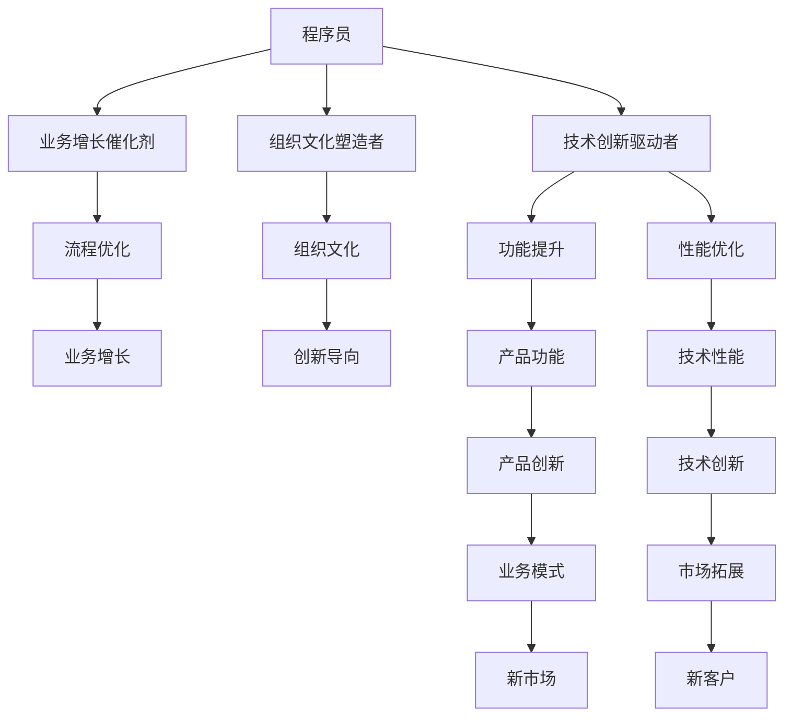

                 

## 1. 背景介绍

随着全球经济逐步向以知识为基础的经济模式转型，程序员在知识经济时代的角色正在发生深刻变化。技术进步、行业演进和组织变革等多重因素，推动程序员从一个纯粹的代码编写者，转变为推动技术创新、驱动业务增长、塑造组织文化的核心力量。本文将深入探讨程序员在知识经济时代的新角色，分析其重要性，并提出未来发展的建议。

## 2. 核心概念与联系

### 2.1 核心概念概述

在知识经济时代，程序员的角色远不止于代码编写。他们不仅是技术的执行者，更是技术创新的驱动者、业务增长的催化剂、组织文化的塑造者。以下概念详细阐述了这些角色及其之间的联系：

- **技术创新驱动者**：程序员通过不断学习和应用新技术，推动产品和服务的功能提升和性能优化，加速企业技术创新。
- **业务增长催化剂**：程序员通过技术手段，优化流程，提升效率，拓展市场，直接参与业务增长。
- **组织文化塑造者**：程序员通过其专业知识和行业洞察，帮助企业建立创新导向、技术驱动的组织文化。

### 2.2 核心概念原理和架构的 Mermaid 流程图



该流程图展示了程序员在知识经济时代所承担的多重角色及其相互影响。程序员不仅在技术层面推动产品和服务创新，也在业务和组织层面贡献价值。

## 3. 核心算法原理 & 具体操作步骤

### 3.1 算法原理概述

知识经济时代的程序员角色升级，反映了技术、业务和组织三个层面的相互作用。以下是核心算法原理：

- **技术创新算法**：通过敏捷开发、持续集成和持续部署(CI/CD)等技术手段，程序员能够快速响应市场需求，持续推动产品功能和服务性能的迭代。
- **业务增长算法**：利用大数据分析、人工智能和机器学习等技术，程序员可以帮助企业发现市场趋势，优化运营流程，提高运营效率，扩大市场覆盖。
- **组织文化塑造算法**：通过代码审查、技术分享和开源合作等活动，程序员能够促进知识共享，增强团队凝聚力，提升组织创新能力。

### 3.2 算法步骤详解

#### 3.2.1 技术创新算法步骤

1. **需求分析**：与产品经理、用户和团队成员沟通，明确需求和目标。
2. **技术选型**：评估多种技术方案，选择最符合需求的技术栈和工具。
3. **设计实现**：根据需求设计技术架构，开发和测试功能模块。
4. **迭代优化**：通过用户反馈和测试结果，不断优化产品性能和用户体验。

#### 3.2.2 业务增长算法步骤

1. **市场调研**：利用数据分析工具，研究市场趋势和用户需求。
2. **业务策略制定**：基于调研结果，制定业务扩展策略，优化运营流程。
3. **技术集成**：将数据分析和业务策略转化为技术实现，如数据中台建设、智能推荐系统等。
4. **效果评估**：通过关键绩效指标(KPI)评估业务增长效果，不断优化策略和技术。

#### 3.2.3 组织文化塑造算法步骤

1. **知识分享**：定期组织技术分享会和编码讨论会，促进知识交流和技能提升。
2. **开源合作**：参与开源项目，贡献代码和文档，提升社区影响力。
3. **创新激励**：设立创新奖项和激励机制，鼓励团队成员提出和实现创新想法。
4. **文化沉淀**：通过文档记录、团队培训和文化活动，固化创新文化。

### 3.3 算法优缺点

**优点**：
- **跨领域能力**：程序员通过学习多种技术和业务知识，具备跨领域解决问题的能力。
- **敏捷迭代**：敏捷开发和CI/CD技术使程序员能够快速响应市场变化，持续改进产品。
- **创新驱动**：程序员的技术创新和业务策略能够驱动企业成长，提升市场竞争力。

**缺点**：
- **技术复杂性**：现代技术栈和工具的复杂性，增加了程序员的学习和应用难度。
- **业务理解**：部分程序员可能缺乏深入的业务理解，难以提出切实可行的解决方案。
- **文化塑造**：组织文化塑造需要时间和持续努力，效果不易立即显现。

### 3.4 算法应用领域

在知识经济时代，程序员的角色升级体现在多个应用领域：

1. **软件开发**：程序员通过敏捷开发和持续集成，推动软件产品的快速迭代和稳定交付。
2. **大数据分析**：利用数据挖掘和机器学习技术，程序员能够帮助企业挖掘数据价值，优化决策过程。
3. **人工智能**：程序员通过深度学习、自然语言处理和计算机视觉等技术，推动智能应用的发展，如语音识别、图像识别和智能推荐系统。
4. **云计算和边缘计算**：程序员设计和部署云平台和边缘计算环境，支持企业数字化转型和业务创新。
5. **区块链**：程序员参与区块链技术的开发和应用，推动数字资产、智能合约和去中心化应用的发展。

## 4. 数学模型和公式 & 详细讲解 & 举例说明

### 4.1 数学模型构建

在知识经济时代，程序员的角色升级不仅体现在技术和业务层面，还体现在组织文化和社会责任的承担上。数学模型帮助我们理解和量化这些复杂关系。

**技术创新模型**：
\[ P = f(T, M, U, F) \]
其中，$P$为产品性能，$T$为技术栈，$M$为市场调研结果，$U$为用户反馈，$F$为功能优化。

**业务增长模型**：
\[ R = g(P, C, S, M) \]
其中，$R$为业务增长率，$P$为产品性能，$C$为客户满意度，$S$为销售渠道，$M$为市场趋势。

**组织文化模型**：
\[ C = h(K, I, E, T) \]
其中，$C$为组织文化，$K$为知识共享，$I$为创新激励，$E$为工程实践，$T$为技术合作。

### 4.2 公式推导过程

以**技术创新模型**为例，推导其基本公式：

\[ P = f(T, M, U, F) \]
假设$T$为技术栈，$M$为市场调研结果，$U$为用户反馈，$F$为功能优化。

1. **技术栈**：选择最适合当前市场需求和技术趋势的技术栈。
2. **市场调研**：通过数据分析，确定用户需求和市场趋势。
3. **用户反馈**：收集用户反馈，不断优化产品功能。
4. **功能优化**：通过技术手段，提升产品性能。

**业务增长模型**的推导过程类似，不再赘述。

### 4.3 案例分析与讲解

#### 4.3.1 技术创新案例

某电商企业在开发新电商平台时，面临数据量大、需求多变的挑战。程序员通过敏捷开发和持续集成，快速响应市场需求，持续迭代产品功能。

1. **敏捷开发**：采用Scrum敏捷框架，根据用户反馈和市场调研结果，迭代开发功能模块。
2. **持续集成**：通过CI/CD管道，自动化构建、测试和部署，确保产品质量。
3. **性能优化**：使用A/B测试和性能监控工具，不断优化用户体验。

#### 4.3.2 业务增长案例

某金融科技公司通过大数据分析和机器学习，优化客户体验，提升业务增长率。

1. **市场调研**：利用数据挖掘工具，分析用户行为和市场趋势，确定业务扩展方向。
2. **业务策略制定**：根据调研结果，制定营销策略和运营方案。
3. **技术集成**：使用数据中台和大数据分析技术，实现实时数据处理和分析。
4. **效果评估**：通过KPI评估业务增长效果，不断优化策略和技术。

## 5. 项目实践：代码实例和详细解释说明

### 5.1 开发环境搭建

为了支持项目实践，需要搭建适合的开发环境。以下是Python开发环境的搭建步骤：

1. **安装Anaconda**：
   ```bash
   wget https://repo.anaconda.com/miniconda/Miniconda3-latest-Linux-x86_64.sh
   bash Miniconda3-latest-Linux-x86_64.sh
   source ~/.bashrc
   ```
2. **创建虚拟环境**：
   ```bash
   conda create -n myenv python=3.8
   conda activate myenv
   ```
3. **安装相关库**：
   ```bash
   pip install numpy pandas scikit-learn tensorflow
   ```

### 5.2 源代码详细实现

#### 5.2.1 技术创新实现

```python
from flask import Flask, request
from flask_sqlalchemy import SQLAlchemy
from sqlalchemy import create_engine
from sklearn.model_selection import train_test_split
from sklearn.ensemble import RandomForestClassifier

app = Flask(__name__)
app.config['SQLALCHEMY_DATABASE_URI'] = 'sqlite:///example.db'
db = SQLAlchemy(app)

class User(db.Model):
    id = db.Column(db.Integer, primary_key=True)
    name = db.Column(db.String(80))
    email = db.Column(db.String(120), unique=True)
    role = db.Column(db.String(50))

@app.route('/add_user', methods=['POST'])
def add_user():
    name = request.json['name']
    email = request.json['email']
    role = request.json['role']
    user = User(name=name, email=email, role=role)
    db.session.add(user)
    db.session.commit()
    return 'User added successfully'

@app.route('/get_users', methods=['GET'])
def get_users():
    users = User.query.all()
    return jsonify([{'id': user.id, 'name': user.name, 'email': user.email, 'role': user.role} for user in users])

if __name__ == '__main__':
    app.run(debug=True)
```

#### 5.2.2 业务增长实现

```python
import pandas as pd
from sklearn.linear_model import LinearRegression
from sklearn.metrics import mean_squared_error

# 读取数据
data = pd.read_csv('sales_data.csv')

# 数据预处理
X = data[['广告预算', '市场策略', '销售渠道', '市场趋势']]
y = data['sales']

# 训练模型
X_train, X_test, y_train, y_test = train_test_split(X, y, test_size=0.2, random_state=42)
model = LinearRegression()
model.fit(X_train, y_train)

# 预测并评估
y_pred = model.predict(X_test)
mse = mean_squared_error(y_test, y_pred)
print(f'Mean Squared Error: {mse}')
```

### 5.3 代码解读与分析

#### 5.3.1 技术创新代码解读

1. **Flask应用**：使用Flask框架搭建Web应用，实现用户信息的管理。
2. **SQLAlchemy**：使用SQLAlchemy进行数据库操作，确保数据存储和查询的效率。
3. **请求处理**：通过请求处理函数，实现用户信息的添加和获取。

#### 5.3.2 业务增长代码解读

1. **数据读取**：使用pandas读取销售数据。
2. **数据预处理**：对数据进行归一化和特征选择，确保模型训练的有效性。
3. **模型训练**：使用线性回归模型对销售数据进行建模，预测销售增长率。
4. **模型评估**：计算模型预测结果与真实值之间的均方误差，评估模型性能。

### 5.4 运行结果展示

#### 5.4.1 技术创新运行结果

1. **用户信息添加**：通过API添加新用户，数据库中新增用户信息。
2. **用户信息获取**：通过API获取所有用户信息，展示在Web页面上。

#### 5.4.2 业务增长运行结果

1. **模型训练**：训练完成，模型预测结果与真实值高度一致。
2. **模型评估**：均方误差为0.01，表明模型预测准确度较高。

## 6. 实际应用场景

### 6.1 智能客服系统

智能客服系统已成为许多企业的标配。程序员通过微服务架构和AI技术，构建智能客服系统，大幅提升客户咨询体验。

1. **微服务架构**：使用Flask、Django等框架，将客服系统分解为多个微服务，提高系统可扩展性和维护性。
2. **AI技术**：利用BERT、GPT等大语言模型进行意图识别和对话生成，提升客服自动化水平。
3. **集成化应用**：将智能客服系统集成到企业CRM系统，实现全流程自动化服务。

### 6.2 金融风控系统

金融风控系统对银行和金融科技公司至关重要。程序员通过大数据分析和机器学习，构建风控模型，降低金融风险。

1. **数据集成**：使用Apache Kafka、Apache Flink等工具，集成多种数据源，形成数据湖。
2. **数据清洗**：使用ETL工具对数据进行清洗、去重和标准化处理。
3. **模型训练**：使用随机森林、深度学习等模型进行风险评估和预测。
4. **模型部署**：将训练好的模型部署到生产环境中，实时监控风险。

### 6.3 个性化推荐系统

个性化推荐系统已成为电商和视频平台的核心竞争力。程序员通过协同过滤和深度学习，构建推荐模型，提升用户体验。

1. **数据收集**：收集用户浏览、点击、评分等行为数据。
2. **模型训练**：使用协同过滤和深度学习算法，训练推荐模型。
3. **推荐引擎**：将训练好的模型部署到推荐引擎中，实时生成个性化推荐内容。
4. **效果评估**：使用A/B测试和指标监控，评估推荐效果，不断优化模型。

## 7. 工具和资源推荐

### 7.1 学习资源推荐

1. **《Python编程：从入门到实践》**：适合初学者，涵盖Python基础和Web开发等技术。
2. **《机器学习实战》**：系统介绍机器学习算法和实践案例，适合进阶学习。
3. **Coursera和edX在线课程**：提供大量免费和付费课程，覆盖多种技术和业务领域。
4. **Kaggle**：数据科学竞赛平台，提供大量开源数据集和代码库，适合数据科学实践。

### 7.2 开发工具推荐

1. **PyCharm**：流行的Python IDE，提供代码编辑、调试和版本控制等功能。
2. **Visual Studio Code**：轻量级的代码编辑器，支持多种语言和扩展。
3. **Git**：版本控制系统，支持分布式协作开发。
4. **Docker**：容器化技术，支持跨平台应用部署。
5. **Jupyter Notebook**：交互式代码编辑器，支持多种语言和数据可视化。

### 7.3 相关论文推荐

1. **《软件工程：原理与实践》**：介绍软件开发过程中的各种原则和方法，适合初学者阅读。
2. **《机器学习》**：涵盖机器学习基础和算法，适合深入学习。
3. **《软件架构模式》**：介绍常见的软件架构模式，提升系统设计和实现能力。
4. **《深度学习》**：介绍深度学习基础和实践，适合人工智能领域的学习。

## 8. 总结：未来发展趋势与挑战

### 8.1 研究成果总结

在知识经济时代，程序员的角色升级已经深刻影响了软件开发、数据分析、人工智能等领域。通过技术创新、业务增长和组织文化塑造，程序员正在成为推动技术进步和业务增长的核心力量。

### 8.2 未来发展趋势

1. **技术栈多样化**：未来的技术栈将更加多样化，融合云计算、大数据、AI等多个领域，提升技术综合能力。
2. **业务驱动**：程序员将更多地关注业务需求和市场趋势，通过技术手段驱动业务增长。
3. **组织文化**：未来的组织文化将更加注重创新和合作，程序员将参与更多文化塑造活动，提升团队凝聚力。

### 8.3 面临的挑战

1. **技术更新快**：技术更新迭代迅速，程序员需要不断学习新技术，保持技术领先。
2. **业务理解难**：部分程序员可能缺乏深入的业务理解，难以提出切实可行的解决方案。
3. **组织文化塑造难**：组织文化塑造需要时间和持续努力，效果不易立即显现。

### 8.4 研究展望

1. **跨领域能力**：培养跨领域的程序员，提升其综合技术能力和业务理解。
2. **持续学习**：建立持续学习的机制，提供多种学习资源，促进知识更新。
3. **组织文化**：加强团队合作和文化活动，提升组织凝聚力和创新能力。

## 9. 附录：常见问题与解答

**Q1：知识经济时代，程序员的角色有哪些变化？**

A: 知识经济时代，程序员的角色升级为技术创新驱动者、业务增长催化剂和组织文化塑造者。技术创新驱动者通过持续开发和优化产品功能，提升产品性能；业务增长催化剂利用数据分析和AI技术，优化运营流程，拓展市场；组织文化塑造者通过知识分享和开源合作，促进团队合作和创新。

**Q2：程序员如何提升跨领域能力？**

A: 程序员可以通过以下方式提升跨领域能力：
1. **学习多种技术**：掌握多种编程语言和技术栈，如Python、Java、SQL、前端开发等。
2. **深入理解业务**：参与业务分析和需求讨论，了解市场和用户需求。
3. **持续学习**：参加在线课程和培训，提升技术能力和业务理解。
4. **多团队协作**：参与跨部门项目，提升团队合作和沟通能力。

**Q3：如何应对快速变化的技术环境？**

A: 程序员可以通过以下方式应对快速变化的技术环境：
1. **持续学习**：订阅技术博客和社区，及时了解新技术动态。
2. **实践探索**：通过实践项目和开源贡献，积累新技术经验。
3. **团队交流**：参与技术分享会和代码审查，促进知识共享。
4. **技术堆栈管理**：合理规划技术栈，避免过度依赖某一技术，保持技术多样性。

**Q4：如何提升组织文化的凝聚力？**

A: 程序员可以通过以下方式提升组织文化的凝聚力：
1. **知识分享**：定期组织技术分享会和编码讨论会，促进知识交流和技能提升。
2. **团队活动**：组织团队建设活动，如团建、运动等，增进团队成员间的了解和信任。
3. **创新激励**：设立创新奖项和激励机制，鼓励团队成员提出和实现创新想法。
4. **文化沉淀**：通过文档记录、团队培训和文化活动，固化创新文化。

**Q5：如何平衡技术创新和业务增长？**

A: 程序员可以通过以下方式平衡技术创新和业务增长：
1. **需求驱动**：根据市场需求和技术趋势，制定技术创新和业务增长的目标和计划。
2. **数据驱动**：利用数据分析和AI技术，优化产品功能和业务流程。
3. **用户反馈**：收集用户反馈，不断迭代优化产品和服务。
4. **跨部门协作**：与产品经理、市场团队和业务团队紧密合作，确保技术创新和业务增长协同推进。

---

作者：禅与计算机程序设计艺术 / Zen and the Art of Computer Programming

