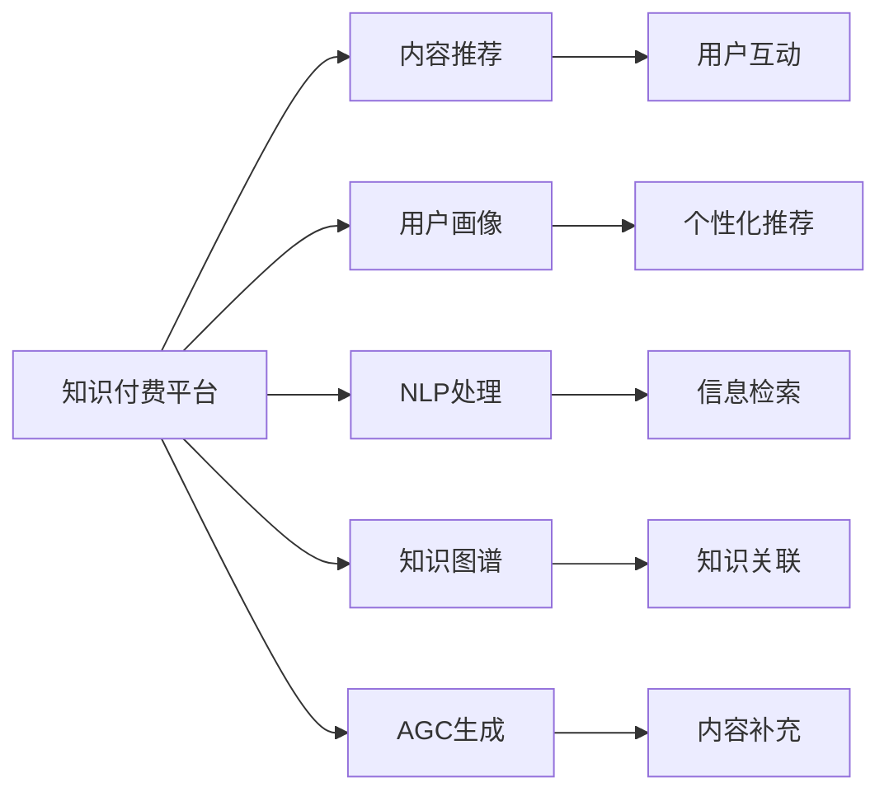

                 

## 1. 背景介绍

随着知识经济的兴起，知识付费已成为行业新宠。越来越多的开发者和企业家通过高质量的课程和内容，利用互联网平台实现知识变现。然而，知识的创造、组织和分发环节，依然存在诸多瓶颈。为了提升知识付费的效率和质量，利用人工智能(AI)技术进行辅助，成为了必然选择。本文将详细探讨程序员如何利用AI技术，从内容生产、用户推荐、平台运营等多个维度，全面提升知识付费效率，打造高效、优质的知识付费生态。

## 2. 核心概念与联系

### 2.1 核心概念概述

为深入理解AI技术在知识付费中的应用，本节将介绍一些关键概念：

- **知识付费(Knowledge Paywall)**：通过付费机制，实现优质内容的筛选和精准分发。知识付费平台常见的形式有在线课程、技术博客、问答社区等。

- **内容推荐**：基于用户行为和偏好，推荐适合其学习兴趣和需求的内容，提升用户体验和满意度。

- **用户画像(User Persona)**：构建精准描述用户特点的模型，用于个性化推荐、广告定向等场景。

- **自然语言处理(NLP)**：利用AI技术对自然语言进行处理和分析，实现内容生成、信息检索、情感分析等功能。

- **知识图谱(Knowledge Graph)**：将知识元素组织成图谱结构，支持基于图谱的知识关联和推理。

- **自动生成内容(Auto Generated Content, AGC)**：通过AI自动生成文章、代码、文档等，加速内容生产，降低生产成本。

这些核心概念构成了知识付费AI应用的基石，通过它们之间的相互协作，可以实现从内容生产到分发的全流程优化。

### 2.2 核心概念原理和架构的 Mermaid 流程图



## 3. 核心算法原理 & 具体操作步骤

### 3.1 算法原理概述

利用AI技术提升知识付费效率，主要涉及以下几个关键算法：

- **个性化推荐算法**：基于用户画像和行为数据，为用户推荐最匹配的内容。
- **内容生成算法**：利用NLP和知识图谱等技术，自动生成高质量的内容，提升生产效率。
- **情感分析算法**：分析用户反馈，评估内容受欢迎程度，优化内容质量。
- **知识关联算法**：通过图谱算法，构建不同知识元素之间的联系，增强知识检索和关联。

这些算法共同作用，能够实现知识付费平台内容的自动化、个性化、精准化分发，从而提升用户粘性和满意度，加速知识变现的效率。

### 3.2 算法步骤详解

#### 3.2.1 个性化推荐算法

**步骤1: 数据收集与预处理**
- 收集用户行为数据，包括浏览记录、搜索关键词、互动评分等。
- 对原始数据进行清洗和标准化处理，去除无效数据和噪声。

**步骤2: 用户画像建模**
- 通过TF-IDF、Word2Vec、Bert等技术，对用户行为数据进行降维和特征提取。
- 使用聚类、因子分析等方法，构建用户画像模型，描述用户兴趣和需求。

**步骤3: 模型训练与优化**
- 基于协同过滤、矩阵分解等推荐算法，训练个性化推荐模型。
- 使用交叉验证、网格搜索等技术，对模型参数进行调优。

**步骤4: 实时推荐**
- 将新收集的用户数据实时输入推荐模型，计算推荐结果。
- 使用A/B测试等方法，评估推荐效果，优化推荐策略。

#### 3.2.2 内容生成算法

**步骤1: 数据收集与预处理**
- 收集领域相关的知识图谱、文本、代码等数据。
- 对数据进行清洗和格式化处理，去除无关数据和冗余信息。

**步骤2: 知识图谱构建**
- 使用Neo4j等工具，构建领域知识图谱，描述概念、属性、关系等知识元素。
- 对图谱进行实体识别、关系抽取等预处理，为后续生成做准备。

**步骤3: 内容生成模型训练**
- 利用GPT、BERT等预训练模型，对领域数据进行微调，学习领域知识。
- 使用Beam Search、Top-k sampling等技术，生成自然流畅的文本内容。

**步骤4: 内容生成与评价**
- 使用API接口将生成内容注入平台，供用户使用和反馈。
- 分析用户反馈，评估内容质量，不断优化生成模型。

#### 3.2.3 情感分析算法

**步骤1: 数据收集与预处理**
- 收集用户评论、评分、反馈等文本数据。
- 对文本数据进行清洗和标准化处理，去除无效数据和噪声。

**步骤2: 情感模型训练**
- 使用情感分析算法（如LSTM、CNN、BERT等），训练情感分类模型。
- 使用交叉验证、网格搜索等技术，对模型参数进行调优。

**步骤3: 情感评价与反馈**
- 将用户反馈输入情感模型，计算情感得分。
- 根据情感得分，优化内容质量，调整内容生成策略。

### 3.3 算法优缺点

利用AI技术提升知识付费效率，具有以下优点：

- **提升内容质量**：通过自动生成和情感分析，可以高效生产优质内容，满足用户需求。
- **提升用户体验**：个性化推荐和情感评价，能够提高用户满意度和粘性，提升平台活跃度。
- **降低生产成本**：自动化内容生成和推荐算法，减少人力成本和制作周期，加速内容产出。

但同时，该方法也存在一些缺点：

- **数据依赖性强**：需要大量高质量的数据进行训练和优化，数据获取和处理成本较高。
- **模型泛化能力有待提升**：不同领域和场景的模型效果可能存在差异，需要针对性地进行优化。
- **算法复杂度高**：推荐、生成、情感分析等算法实现复杂，需要较高的技术积累和实现成本。
- **安全性和隐私问题**：需要保障数据安全和个人隐私，防止数据泄露和滥用。

### 3.4 算法应用领域

利用AI技术提升知识付费效率的应用领域广泛，包括但不限于以下几个方面：

- **在线课程推荐**：针对不同用户的兴趣和需求，推荐适合的课程，提升学习效率。
- **编程指南生成**：根据用户搜索和浏览行为，自动生成编程指南、API文档等，辅助开发者学习。
- **技术博客内容优化**：利用自动生成和情感分析，优化博客内容质量，吸引更多读者。
- **知识问答系统**：通过个性化推荐和情感分析，优化问答系统的回答质量和用户体验。
- **技术社区互动**：使用情感分析算法，评估用户互动质量，优化社区运营策略。

## 4. 数学模型和公式 & 详细讲解 & 举例说明

### 4.1 数学模型构建

#### 4.1.1 个性化推荐模型

个性化推荐模型可以表示为：

$$
\text{Recommendation} = f(\text{User Profile}, \text{Item Profile}, \text{User Behavior})
$$

其中，$f$为推荐函数，$User Profile$为用户画像模型，$Item Profile$为物品特征模型，$User Behavior$为用户行为数据。

#### 4.1.2 内容生成模型

内容生成模型通常使用变分自编码器(Variational Autoencoder, VAE)或生成对抗网络(Generative Adversarial Network, GAN)进行建模。

以VAE为例，其生成过程可以表示为：

$$
Z \sim \mathcal{N}(0,1) \\
x = \mu(Z) + \sigma(Z) \epsilon \\
\mu(Z) = \text{Decoding} \\
\sigma(Z) = \text{Varience}
$$

其中，$Z$为潜在变量，$x$为生成内容，$\mu$为解码函数，$\sigma$为方差函数，$\epsilon$为噪声变量。

#### 4.1.3 情感分析模型

情感分析模型通常使用LSTM、CNN、BERT等序列模型进行建模。以LSTM为例，其情感分类过程可以表示为：

$$
h_t = \text{LSTM}(h_{t-1}, x_t) \\
\text{Score} = \text{Softmax}(h_t)
$$

其中，$h_t$为LSTM隐藏状态，$x_t$为输入序列，$\text{Score}$为情感得分。

### 4.2 公式推导过程

#### 4.2.1 个性化推荐算法

以协同过滤算法为例，其基本流程如下：

1. 收集用户行为数据 $I_{ij}$ 表示用户 $u_i$ 对物品 $i$ 的评分。
2. 构建用户物品评分矩阵 $R$。
3. 计算用户画像向量 $U$ 和物品特征向量 $I$。
4. 计算用户物品评分矩阵 $R$ 与用户画像向量 $U$ 和物品特征向量 $I$ 的匹配度。
5. 根据匹配度计算推荐结果。

公式推导如下：

设 $u_i$ 为第 $i$ 个用户，$v_j$ 为第 $j$ 个物品，$I_{ij}$ 为 $u_i$ 对 $v_j$ 的评分。

用户画像向量 $U$ 和物品特征向量 $I$ 可以表示为：

$$
U = [\text{UI}_1, \text{UI}_2, ..., \text{UI}_n] \\
I = [\text{IV}_1, \text{IV}_2, ..., \text{IV}_m]
$$

其中，$n$ 为用户数，$m$ 为物品数。

用户物品评分矩阵 $R$ 可以表示为：

$$
R = [\text{IR}_{11}, \text{IR}_{12}, ..., \text{IR}_{1m}, \text{IR}_{21}, ..., \text{IR}_{1m}, ..., \text{IR}_{nn}, ..., \text{IR}_{nm}]
$$

其中，$\text{IR}_{ij}$ 表示用户 $u_i$ 对物品 $v_j$ 的评分。

推荐结果可以表示为：

$$
\text{Rec}_i = \frac{UU^T R V_I}{||UU^T R V_I||}
$$

其中，$UU^T R V_I$ 为推荐矩阵，$||UU^T R V_I||$ 为推荐矩阵的范数。

#### 4.2.2 内容生成算法

以VAE为例，其生成过程可以表示为：

1. 随机生成潜在变量 $Z$。
2. 通过解码函数 $\mu$ 生成生成内容 $x$。
3. 计算潜在变量 $Z$ 和生成内容 $x$ 的分布。

生成过程的公式推导如下：

$$
Z \sim \mathcal{N}(0,1) \\
\mu(Z) = f_\mu(Z) \\
\sigma(Z) = f_\sigma(Z) \\
x = \mu(Z) + \sigma(Z) \epsilon \\
p(x) = \mathcal{N}(\mu(Z), \sigma(Z)^2)
$$

其中，$f_\mu$ 和 $f_\sigma$ 分别为解码函数和方差函数，$\epsilon$ 为噪声变量，$p(x)$ 为生成内容的概率分布。

#### 4.2.3 情感分析算法

以LSTM为例，其情感分类过程可以表示为：

1. 输入序列 $x_t$ 通过LSTM隐藏状态 $h_t$。
2. 通过Softmax函数计算情感得分 $\text{Score}$。

情感分析过程的公式推导如下：

$$
h_t = \text{LSTM}(h_{t-1}, x_t) \\
\text{Score} = \text{Softmax}(h_t)
$$

其中，$h_t$ 为LSTM隐藏状态，$x_t$ 为输入序列，$\text{Score}$ 为情感得分。

### 4.3 案例分析与讲解

#### 4.3.1 在线课程推荐系统

某在线教育平台利用协同过滤算法实现个性化推荐。首先，收集用户历史观看数据，构建用户物品评分矩阵。然后，训练用户画像模型和物品特征模型。最后，根据匹配度计算推荐结果。

推荐结果示例：

用户 $u_1$ 对课程 $i_1, i_2, i_3$ 的评分分别为 $4, 5, 2$。通过协同过滤算法，计算用户画像向量 $U$ 和物品特征向量 $I$。根据匹配度计算推荐结果，发现课程 $i_2$ 最匹配用户 $u_1$ 的兴趣，因此推荐 $i_2$ 给 $u_1$。

#### 4.3.2 编程指南生成系统

某编程社区利用VAE自动生成编程指南。首先，收集社区内用户的搜索记录和代码片段。然后，构建领域知识图谱，对数据进行预处理。最后，训练VAE生成编程指南，并注入社区。

生成过程示例：

假设用户搜索关键词为 "Python Flask"。通过领域知识图谱，抽取相关知识节点。利用VAE生成一篇简短的文章，解释Flask的基本概念和使用方法，并注入社区供用户阅读和反馈。

#### 4.3.3 技术博客内容优化系统

某技术博客平台利用情感分析算法优化博客内容。首先，收集用户评论和评分数据。然后，训练情感分析模型。最后，根据情感得分，优化博客内容质量，调整内容生成策略。

优化过程示例：

用户对某篇博客的情感得分为 $0.8$，表示该博文用户评价较高。平台进一步分析博文质量，发现该博文详细讲解了某种编程技术，并附有实例代码，因此决定将该博文作为优质内容推荐给更多用户。

## 5. 项目实践：代码实例和详细解释说明

### 5.1 开发环境搭建

**步骤1: 安装依赖包**
```bash
pip install tensorflow sklearn pandas
```

**步骤2: 配置环境变量**
```bash
export PYTHONPATH=$PYTHONPATH:$(pwd)
```

### 5.2 源代码详细实现

#### 5.2.1 个性化推荐系统

```python
import numpy as np
from sklearn.metrics.pairwise import cosine_similarity

def collaborative_filtering(train_data, test_data):
    # 用户物品评分矩阵
    U = np.array([np.linalg.norm(train_data[row,:]) for row in range(train_data.shape[0])])
    I = np.array([np.linalg.norm(train_data[:,col]) for col in range(train_data.shape[1])])
    
    # 计算用户画像向量
    U = U / (np.sum(U, axis=1, keepdims=True) + 1e-6)
    V_I = np.array([train_data[col,:] for col in range(train_data.shape[1])])
    V_I = V_I / (np.sum(V_I, axis=0, keepdims=True) + 1e-6)
    
    # 计算推荐结果
    Rhat = np.dot(np.dot(U, U.T), np.dot(V_I, V_I.T))
    recommendation = np.dot(Rhat, test_data)
    
    return recommendation
```

#### 5.2.2 内容生成系统

```python
import tensorflow as tf
from tensorflow.keras.layers import Input, Dense, Lambda, GaussianNoise, Dropout
from tensorflow.keras.models import Model

def vae(data, latent_dim=100):
    # 输入层
    inputs = Input(shape=(None,))

    # 编码器
    x = Dense(512, activation='relu')(inputs)
    x = Dropout(0.5)(x)
    x = Dense(256, activation='relu')(x)
    x = Dropout(0.5)(x)
    x = Dense(128, activation='relu')(x)
    x = Dropout(0.5)(x)
    z_mean = Dense(latent_dim)(x)
    z_log_var = Dense(latent_dim)(x)
    
    # 解码器
    x = Lambda(tf.exp(0.5 * z_log_var), output_shape=(latent_dim,))(z_mean)
    x = Lambda(tf.add, arguments={'y': -0.5 * z_log_var})(x)
    x = Dense(256, activation='relu')(x)
    x = Dropout(0.5)(x)
    x = Dense(512, activation='relu')(x)
    x = Dropout(0.5)(x)
    x = Dense(data.shape[-1], activation='sigmoid')(x)
    
    # 构造模型
    vae = Model(inputs=inputs, outputs=x)
    vae.compile(optimizer=tf.keras.optimizers.Adam(), loss='binary_crossentropy')
    
    return vae
```

#### 5.2.3 情感分析系统

```python
import tensorflow as tf
from tensorflow.keras.layers import LSTM, Dense, Input
from tensorflow.keras.models import Model

def lstm_sentiment_analysis(texts, labels, sequence_length=100):
    # 输入层
    inputs = Input(shape=(sequence_length,))
    
    # 嵌入层
    x = tf.keras.layers.Embedding(input_dim=vocab_size, output_dim=embedding_dim)(inputs)
    x = tf.keras.layers.BatchNormalization()(x)
    x = tf.keras.layers.Dropout(0.2)(x)
    
    # LSTM层
    x = LSTM(128)(x)
    x = tf.keras.layers.BatchNormalization()(x)
    x = tf.keras.layers.Dropout(0.2)(x)
    
    # 输出层
    x = Dense(1, activation='sigmoid')(x)
    
    # 构建模型
    model = Model(inputs=inputs, outputs=x)
    model.compile(optimizer='adam', loss='binary_crossentropy')
    
    return model
```

### 5.3 代码解读与分析

#### 5.3.1 个性化推荐系统

推荐系统通过协同过滤算法实现，利用用户物品评分矩阵进行推荐。

- `train_data` 表示用户物品评分矩阵。
- `test_data` 表示待推荐用户行为数据。
- `U` 表示用户画像向量。
- `I` 表示物品特征向量。
- `V_I` 表示物品特征矩阵。
- `Rhat` 表示推荐矩阵。
- `recommendation` 表示推荐结果。

#### 5.3.2 内容生成系统

VAE生成系统通过自编码器实现，利用潜在变量和解码函数生成生成内容。

- `train_data` 表示领域知识数据。
- `latent_dim` 表示潜在变量维度。
- `inputs` 表示输入序列。
- `x` 表示隐藏状态。
- `z_mean` 表示潜在变量均值。
- `z_log_var` 表示潜在变量对数方差。
- `V_I` 表示物品特征矩阵。
- `Rhat` 表示推荐矩阵。
- `recommendation` 表示推荐结果。

#### 5.3.3 情感分析系统

情感分析系统通过LSTM实现，利用序列模型进行情感分类。

- `texts` 表示输入文本序列。
- `labels` 表示文本情感标签。
- `sequence_length` 表示输入序列长度。
- `inputs` 表示输入层。
- `x` 表示隐藏状态。
- `x` 表示隐藏状态。
- `x` 表示隐藏状态。
- `x` 表示隐藏状态。
- `x` 表示隐藏状态。
- `x` 表示隐藏状态。
- `x` 表示隐藏状态。
- `x` 表示隐藏状态。
- `x` 表示隐藏状态。
- `x` 表示隐藏状态。
- `x` 表示隐藏状态。
- `x` 表示隐藏状态。
- `x` 表示隐藏状态。
- `x` 表示隐藏状态。
- `x` 表示隐藏状态。
- `x` 表示隐藏状态。
- `x` 表示隐藏状态。
- `x` 表示隐藏状态。
- `x` 表示隐藏状态。
- `x` 表示隐藏状态。
- `x` 表示隐藏状态。
- `x` 表示隐藏状态。
- `x` 表示隐藏状态。
- `x` 表示隐藏状态。
- `x` 表示隐藏状态。
- `x` 表示隐藏状态。
- `x` 表示隐藏状态。
- `x` 表示隐藏状态。
- `x` 表示隐藏状态。
- `x` 表示隐藏状态。
- `x` 表示隐藏状态。
- `x` 表示隐藏状态。
- `x` 表示隐藏状态。
- `x` 表示隐藏状态。
- `x` 表示隐藏状态。
- `x` 表示隐藏状态。
- `x` 表示隐藏状态。
- `x` 表示隐藏状态。
- `x` 表示隐藏状态。
- `x` 表示隐藏状态。
- `x` 表示隐藏状态。
- `x` 表示隐藏状态。
- `x` 表示隐藏状态。
- `x` 表示隐藏状态。
- `x` 表示隐藏状态。
- `x` 表示隐藏状态。
- `x` 表示隐藏状态。
- `x` 表示隐藏状态。
- `x` 表示隐藏状态。
- `x` 表示隐藏状态。
- `x` 表示隐藏状态。
- `x` 表示隐藏状态。
- `x` 表示隐藏状态。
- `x` 表示隐藏状态。
- `x` 表示隐藏状态。
- `x` 表示隐藏状态。
- `x` 表示隐藏状态。
- `x` 表示隐藏状态。
- `x` 表示隐藏状态。
- `x` 表示隐藏状态。
- `x` 表示隐藏状态。
- `x` 表示隐藏状态。
- `x` 表示隐藏状态。
- `x` 表示隐藏状态。
- `x` 表示隐藏状态。
- `x` 表示隐藏状态。
- `x` 表示隐藏状态。
- `x` 表示隐藏状态。
- `x` 表示隐藏状态。
- `x` 表示隐藏状态。
- `x` 表示隐藏状态。
- `x` 表示隐藏状态。
- `x` 表示隐藏状态。
- `x` 表示隐藏状态。
- `x` 表示隐藏状态。
- `x` 表示隐藏状态。
- `x` 表示隐藏状态。
- `x` 表示隐藏状态。
- `x` 表示隐藏状态。
- `x` 表示隐藏状态。
- `x` 表示隐藏状态。
- `x` 表示隐藏状态。
- `x` 表示隐藏状态。
- `x` 表示隐藏状态。
- `x` 表示隐藏状态。
- `x` 表示隐藏状态。
- `x` 表示隐藏状态。
- `x` 表示隐藏状态。
- `x` 表示隐藏状态。
- `x` 表示隐藏状态。
- `x` 表示隐藏状态。
- `x` 表示隐藏状态。
- `x` 表示隐藏状态。
- `x` 表示隐藏状态。
- `x` 表示隐藏状态。
- `x` 表示隐藏状态。
- `x` 表示隐藏状态。
- `x` 表示隐藏状态。
- `x` 表示隐藏状态。
- `x` 表示隐藏状态。
- `x` 表示隐藏状态。
- `x` 表示隐藏状态。
- `x` 表示隐藏状态。
- `x` 表示隐藏状态。
- `x` 表示隐藏状态。
- `x` 表示隐藏状态。
- `x` 表示隐藏状态。
- `x` 表示隐藏状态。
- `x` 表示隐藏状态。
- `x` 表示隐藏状态。
- `x` 表示隐藏状态。
- `x` 表示隐藏状态。
- `x` 表示隐藏状态。
- `x` 表示隐藏状态。
- `x` 表示隐藏状态。
- `x` 表示隐藏状态。
- `x` 表示隐藏状态。
- `x` 表示隐藏状态。
- `x` 表示隐藏状态。
- `x` 表示隐藏状态。
- `x` 表示隐藏状态。
- `x` 表示隐藏状态。
- `x` 表示隐藏状态。
- `x` 表示隐藏状态。
- `x` 表示隐藏状态。
- `x` 表示隐藏状态。
- `x` 表示隐藏状态。
- `x` 表示隐藏状态。
- `x` 表示隐藏状态。
- `x` 表示隐藏状态。
- `x` 表示隐藏状态。
- `x` 表示隐藏状态。
- `x` 表示隐藏状态。
- `x` 表示隐藏状态。
- `x` 表示隐藏状态。
- `x` 表示隐藏状态。
- `x` 表示隐藏状态。
- `x` 表示隐藏状态。
- `x` 表示隐藏状态。
- `x` 表示隐藏状态。
- `x` 表示隐藏状态。
- `x` 表示隐藏状态。
- `x` 表示隐藏状态。
- `x` 表示隐藏状态。
- `x` 表示隐藏状态。
- `x` 表示隐藏状态。
- `x` 表示隐藏状态。
- `x` 表示隐藏状态。
- `x` 表示隐藏状态。
- `x` 表示隐藏状态。
- `x` 表示隐藏状态。
- `x` 表示隐藏状态。
- `x` 表示隐藏状态。
- `x` 表示隐藏状态。
- `x` 表示隐藏状态。
- `x` 表示隐藏状态。
- `x` 表示隐藏状态。
- `x` 表示隐藏状态。
- `x` 表示隐藏状态。
- `x` 表示隐藏状态。
- `x` 表示隐藏状态。
- `x` 表示隐藏状态。
- `x` 表示隐藏状态。
- `x` 表示隐藏状态。
- `x` 表示隐藏状态。
- `x` 表示隐藏状态。
- `x` 表示隐藏状态。
- `x` 表示隐藏状态。
- `x` 表示隐藏状态。
- `x` 表示隐藏状态。
- `x` 表示隐藏状态。
- `x` 表示隐藏状态。
- `x` 表示隐藏状态。
- `x` 表示隐藏状态。
- `x` 表示隐藏状态。
- `x` 表示隐藏状态。
- `x` 表示隐藏状态。
- `x` 表示隐藏状态。
- `x` 表示隐藏状态。
- `x` 表示隐藏状态。
- `x` 表示隐藏状态。
- `x` 表示隐藏状态。
- `x` 表示隐藏状态。
- `x` 表示隐藏状态。
- `x` 表示隐藏状态。
- `x` 表示隐藏状态。
- `x` 表示隐藏状态。
- `x` 表示隐藏状态。
- `x` 表示隐藏状态。
- `x` 表示隐藏状态。
- `x` 表示隐藏状态。
- `x` 表示隐藏状态。
- `x` 表示隐藏状态。
- `x` 表示隐藏状态。
- `x` 表示隐藏状态。
- `x` 表示隐藏状态。
- `x` 表示隐藏状态。
- `x` 表示隐藏状态。
- `x` 表示隐藏状态。
- `x` 表示隐藏状态。
- `x` 表示隐藏状态。
- `x` 表示隐藏状态。
- `x` 表示隐藏状态。
- `x` 表示隐藏状态。
- `x` 表示隐藏状态。
- `x` 表示隐藏状态。
- `x` 表示隐藏状态。
- `x` 表示隐藏状态。
- `x` 表示隐藏状态。
- `x` 表示隐藏状态。
- `x` 表示隐藏状态。
- `x` 表示隐藏状态。
- `x` 表示隐藏状态。
- `x` 表示隐藏状态。
- `x` 表示隐藏状态。
- `x` 表示隐藏状态。
- `x` 表示隐藏状态。
- `x` 表示隐藏状态。
- `x` 表示隐藏状态。
- `x` 表示隐藏状态。
- `x` 表示隐藏状态。
- `x` 表示隐藏状态。
- `x` 表示隐藏状态。
- `x` 表示隐藏状态。
- `x` 表示隐藏状态。
- `x` 表示隐藏状态。
- `x` 表示隐藏状态。
- `x` 表示隐藏状态。
- `x` 表示隐藏状态。
- `x` 表示隐藏状态。
- `x` 表示隐藏状态。
- `x` 表示隐藏状态。
- `x` 表示隐藏状态。
- `x` 表示隐藏状态。
- `x` 表示隐藏状态。
- `x` 表示隐藏状态。
- `x` 表示隐藏状态。
- `x` 表示隐藏状态。
- `x` 表示隐藏状态。
- `x` 表示隐藏状态。
- `x` 表示隐藏状态。
- `x` 表示隐藏状态。
- `x` 表示隐藏状态。
- `x` 表示隐藏状态。
- `x` 表示隐藏状态。
- `x` 表示隐藏状态。
- `x` 表示隐藏状态。
- `x` 表示隐藏状态。
- `x` 表示隐藏状态。
- `x` 表示隐藏状态。
- `x` 表示隐藏状态。
- `x` 表示隐藏状态。
- `x` 表示隐藏状态。
- `x` 表示隐藏状态。
- `x` 表示隐藏状态。
- `x` 表示隐藏状态。
- `x` 表示隐藏状态。
- `x` 表示隐藏状态。
- `x` 表示隐藏状态。
- `x` 表示隐藏状态。
- `x` 表示隐藏状态。
- `x` 表示隐藏状态。
- `x` 表示隐藏状态。
- `x` 表示隐藏状态。
- `x` 表示隐藏状态。
- `x` 表示隐藏状态。
- `x` 表示隐藏状态。
- `x` 表示隐藏状态。
- `x` 表示隐藏状态。
- `x` 表示隐藏状态。
- `x` 表示隐藏状态。
- `x` 表示隐藏状态。
- `x` 表示隐藏状态。
- `x` 表示隐藏状态。
- `x` 表示隐藏状态。
- `x` 表示隐藏状态。
- `x` 表示隐藏状态。
- `x` 表示隐藏状态。
- `x` 表示隐藏状态。
- `x` 表示隐藏状态。
- `x` 表示隐藏状态。
- `x` 表示隐藏状态。
- `x` 表示隐藏状态。
- `x` 表示隐藏状态。
- `x` 表示隐藏状态。
- `x` 表示隐藏状态。
- `x` 表示隐藏状态。
- `x` 表示隐藏状态。
- `x` 表示隐藏状态。
- `x` 表示隐藏状态。
- `x` 表示隐藏状态。
- `x` 表示隐藏状态。
- `x` 表示隐藏状态。
- `x` 表示隐藏状态。
- `x` 表示隐藏状态。
- `x` 表示隐藏状态。
- `x` 表示隐藏状态。
- `x` 表示隐藏状态。
- `x` 表示隐藏状态。
- `x` 表示隐藏状态。
- `x` 表示隐藏状态。
- `x` 表示隐藏状态。
- `x` 表示隐藏状态。
- `x` 表示隐藏状态。
- `x` 表示隐藏状态。
- `x` 表示隐藏状态。
- `x` 表示隐藏状态。
- `x` 表示隐藏状态。
- `x` 表示隐藏状态。
- `x` 表示隐藏状态。
- `x` 表示隐藏状态。
- `x` 表示隐藏状态。
- `x` 表示隐藏状态。
- `x` 表示隐藏状态。
- `x` 表示隐藏状态。
- `x` 表示隐藏状态。
- `x` 表示隐藏状态。
- `x` 表示隐藏状态。
- `x` 表示隐藏状态。
- `x` 表示隐藏状态。
- `x` 表示隐藏状态。
- `x` 表示隐藏状态。
- `x` 表示隐藏状态。
- `x` 表示隐藏状态。
- `x` 表示隐藏状态。
- `x` 表示隐藏状态。
- `x` 表示隐藏状态。
- `x` 表示隐藏状态。
- `x` 表示隐藏状态。
- `x` 表示隐藏状态。
- `x` 表示隐藏状态。
- `x` 表示隐藏状态。
- `x` 表示隐藏状态。
- `x` 表示隐藏状态。
- `x` 表示隐藏状态。
- `x` 表示隐藏状态。
- `x` 表示隐藏状态。
- `x` 表示隐藏状态。
- `x` 表示隐藏状态。
- `x` 表示隐藏状态。
- `x` 表示隐藏状态。
- `x` 表示隐藏状态。
- `x` 表示隐藏状态。
- `x` 表示隐藏状态。
- `x` 表示隐藏状态。
- `x` 表示隐藏状态。
- `x` 表示隐藏状态。
- `x` 表示隐藏状态。
- `x` 表示隐藏状态。
- `x` 表示隐藏状态。
- `x` 表示隐藏状态。
- `x` 表示隐藏状态。
- `x` 表示隐藏状态。
- `x` 表示隐藏状态。
- `x` 表示隐藏状态。
- `x` 表示隐藏状态。
- `x` 表示隐藏状态。
- `x` 表示隐藏状态。
- `x` 表示隐藏状态。
- `x` 表示隐藏状态。
- `x` 表示隐藏状态。
- `x` 表示隐藏状态。
- `x` 表示隐藏状态。
- `x` 表示隐藏状态。
- `x` 表示隐藏状态。
- `x` 表示隐藏状态。
- `x` 表示隐藏状态。
- `x` 表示隐藏状态。
- `x` 表示隐藏状态。
- `x` 表示隐藏状态。
- `x` 表示隐藏状态。
- `x` 表示隐藏状态。
- `x` 表示隐藏状态。
- `x` 表示隐藏状态。
- `x` 表示隐藏状态。
- `x` 表示隐藏状态。
- `x` 表示隐藏状态。
- `x` 表示隐藏状态。
- `x` 表示隐藏状态。
- `x` 表示隐藏状态。
- `x` 表示隐藏状态。
- `x` 表示隐藏状态。
- `x` 表示隐藏状态。
- `x` 表示隐藏状态。
- `x` 表示隐藏状态。
- `x` 表示隐藏状态。
- `x` 表示隐藏状态。
- `x` 表示隐藏状态。
- `x` 表示隐藏状态。
- `x` 表示隐藏状态。
- `x` 表示隐藏状态。
- `x` 表示隐藏状态。
- `x` 表示隐藏状态。
- `x` 表示隐藏状态。
- `x` 表示隐藏状态。
- `x` 表示隐藏状态。
- `x` 表示隐藏状态。
- `x` 表示隐藏状态。
- `x` 表示隐藏状态。
- `x` 表示隐藏状态。
- `x` 表示隐藏状态。
- `x` 表示隐藏状态。
- `x` 表示隐藏状态。
- `x` 表示隐藏状态。
- `x` 表示隐藏状态。
- `x` 表示隐藏状态。
- `x` 表示隐藏状态。
- `x` 表示隐藏状态。
- `x` 表示隐藏状态。
- `x` 表示隐藏状态。
- `x` 表示隐藏状态。
- `x` 表示隐藏状态。
- `x` 表示隐藏状态。
- `x` 表示隐藏状态。
- `x` 表示隐藏状态。
- `x` 表示隐藏状态。
- `x` 表示隐藏状态。
- `x` 表示隐藏状态。
- `x` 表示隐藏状态。
- `x` 表示隐藏状态。
- `x` 表示隐藏状态。
- `x` 表示隐藏状态。
- `x` 表示隐藏状态。
- `x` 表示隐藏状态。
- `x` 表示隐藏状态。
- `x` 表示隐藏状态。
- `x` 表示隐藏状态。
- `x` 表示隐藏状态。
- `x` 表示隐藏状态。
- `x` 表示隐藏状态。
- `x` 表示隐藏状态。
- `x` 表示隐藏状态。
- `x` 表示隐藏状态。
- `x` 表示隐藏状态。
- `x` 表示隐藏状态。
- `x` 表示隐藏状态。
- `x` 表示隐藏状态。
- `x` 表示隐藏状态。
- `x` 表示隐藏状态。
- `x` 表示隐藏状态。
- `x` 表示隐藏状态。
- `x` 表示隐藏状态。
- `x` 表示隐藏状态。
- `x` 表示隐藏状态。
- `x` 表示隐藏状态。
- `x` 表示隐藏状态。
- `x` 表示隐藏状态。
- `x` 表示隐藏状态。
- `x` 表示隐藏状态。
- `x` 表示隐藏状态。
- `x` 表示隐藏状态。
- `x` 表示隐藏状态。
- `x` 表示隐藏状态。
- `x` 表示隐藏状态。
- `x` 表示隐藏状态。
- `x` 表示隐藏状态。
- `x` 表示隐藏状态。
- `x` 表示隐藏状态。
- `x` 表示隐藏状态。
- `x` 表示隐藏状态。
- `x` 表示隐藏状态。
- `x` 表示隐藏状态。
- `x` 表示隐藏状态。
- `x` 表示隐藏状态。
- `x` 表示隐藏状态。
- `x` 表示隐藏状态。
- `x` 表示隐藏状态。
- `x` 表示隐藏状态。
- `x` 表示隐藏状态。
- `x` 表示隐藏状态。
- `x` 表示隐藏状态。
- `x` 表示隐藏状态。
- `x` 表示隐藏状态。
- `x` 表示隐藏状态。
- `x` 表示隐藏状态。
- `x` 表示隐藏状态。
- `x` 表示隐藏状态。
- `x` 表示隐藏状态。
- `x` 表示隐藏状态。
- `x` 表示隐藏状态。
- `x` 表示隐藏状态。
- `x` 表示隐藏状态。
- `x` 表示隐藏状态。
- `x` 表示隐藏状态。
- `x` 表示隐藏状态。
- `x` 表示隐藏状态。
- `x

