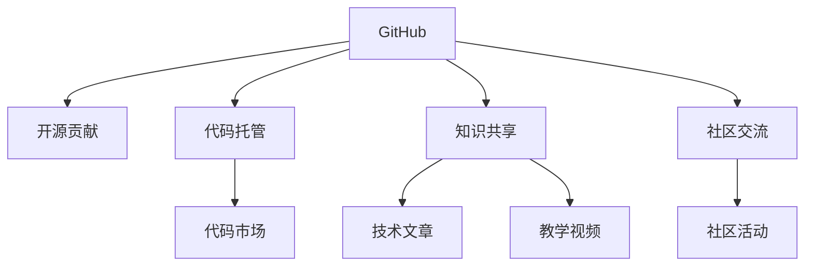

                 

# 程序员如何利用GitHub进行知识变现

> 关键词：GitHub, 开源贡献, 代码托管, 知识共享, 代码市场, 知识变现

## 1. 背景介绍

### 1.1 问题由来

在当今这个知识爆炸的时代，程序员们面临着前所未有的机遇与挑战。一方面，随着技术的快速发展，新工具、新框架、新思想层出不穷，需要程序员不断学习和适应；另一方面，如何将自己的知识经验转化为实际的商业价值，成为每个程序员都在思考的问题。在这其中，GitHub无疑成为了一个极其重要的平台，它不仅是一个代码托管和版本控制的工具，更是一个知识共享和社区交流的平台。本文将详细探讨程序员如何利用GitHub进行知识变现，帮助广大开发者在技术提升的同时，实现个人价值的提升。

### 1.2 问题核心关键点

GitHub的知识变现主要体现在以下几个方面：

- **开源贡献**：通过在开源项目上进行代码贡献，提升自身技术水平，获得社区认可，甚至在项目中担任核心开发者。
- **代码托管**：将自己的项目托管在GitHub上，通过持续维护和优化，积累粉丝，并通过代码市场等平台变现。
- **知识共享**：通过撰写技术文章、教学视频等方式，在GitHub上分享自己的知识和经验，吸引关注，甚至开设课程，实现变现。
- **社区交流**：在GitHub社区中积极互动，提升个人影响力，吸引企业和投资者注意，甚至成为知名开源项目的领导者。

## 2. 核心概念与联系

### 2.1 核心概念概述

为了更好地理解如何利用GitHub进行知识变现，我们先介绍几个关键概念：

- **GitHub**：一个全球领先的代码托管平台，提供代码版本控制、项目管理、社区交流等功能。
- **开源贡献**：将自己的代码或经验贡献给开源项目，提升自身技术水平和社区影响力。
- **代码托管**：将个人项目或企业项目托管在GitHub上，通过持续维护和优化，吸引粉丝，并通过代码市场等平台变现。
- **知识共享**：通过撰写技术文章、教学视频等方式，在GitHub上分享自己的知识和经验，实现变现。
- **社区交流**：积极参与GitHub社区活动，提升个人影响力，吸引企业和投资者注意。

这些概念之间的联系可以通过以下Mermaid流程图来展示：



这个流程图展示了GitHub的各个功能模块如何相互关联，共同促进程序员的知识变现。

## 3. 核心算法原理 & 具体操作步骤
### 3.1 算法原理概述

基于GitHub的知识变现主要依赖于开源项目、社区交流和代码市场等机制。其核心原理可以概括为以下几点：

1. **开源贡献**：通过在开源项目上进行代码贡献，提升自身技术水平和社区影响力。
2. **代码托管**：将自己的项目托管在GitHub上，通过持续维护和优化，吸引粉丝，并通过代码市场等平台变现。
3. **知识共享**：通过撰写技术文章、教学视频等方式，在GitHub上分享自己的知识和经验，实现变现。
4. **社区交流**：积极参与GitHub社区活动，提升个人影响力，吸引企业和投资者注意。

### 3.2 算法步骤详解

以下是利用GitHub进行知识变现的具体操作步骤：

**Step 1: 创建GitHub账号**

1. 访问GitHub官网，注册账号。
2. 填写基本信息，完成邮箱验证。
3. 设置个人密码，完成账号创建。

**Step 2: 选择合适的开源项目进行贡献**

1. 搜索感兴趣的开源项目，如TensorFlow、Kubernetes等。
2. 阅读项目文档，了解项目贡献流程和代码风格。
3. 选择适合的贡献方式，如修复Bug、添加功能、优化代码等。
4. 通过Pull Request（PR）提交代码，等待项目维护者的审核。

**Step 3: 托管个人项目**

1. 将个人项目上传到GitHub，填写项目描述和README文件。
2. 持续更新和维护项目，解决Bug，添加新功能。
3. 使用GitHub Pages或Github Action等工具，将项目部署为网站或持续集成。
4. 在项目README中介绍项目使用方法和贡献方式，吸引更多人关注和使用。

**Step 4: 知识共享**

1. 在GitHub上撰写技术文章，分享自己的学习心得和技术积累。
2. 制作教学视频，讲解技术栈、开发技巧等。
3. 开设在线课程，通过Udemy、Coursera等平台变现。
4. 参加GitHub社区活动，如Meetup、Webinar等，分享知识和经验。

**Step 5: 参与社区交流**

1. 积极参与GitHub社区讨论，回答问题，提供帮助。
2. 参与开源项目的讨论和决策，提升社区影响力。
3. 与其他开发者建立联系，交流经验和资源。
4. 关注和支持有潜力的开源项目，帮助他们成长。

### 3.3 算法优缺点

基于GitHub的知识变现方法具有以下优点：

1. **社区认可**：开源贡献和知识共享能够迅速提升个人在社区中的影响力。
2. **技术提升**：通过在开源项目上贡献代码，提升自身技术水平和项目管理能力。
3. **变现渠道**：代码托管和知识共享提供了多种变现途径，如代码市场、技术文章、教学视频等。
4. **资源共享**：GitHub上的开源项目和资源丰富，可以快速学习和借鉴他人的经验。

同时，该方法也存在一定的局限性：

1. **时间成本高**：持续的代码贡献和知识输出需要大量时间和精力。
2. **社区竞争激烈**：GitHub上有大量的活跃开发者，想要脱颖而出需要付出更多努力。
3. **变现难度大**：不是所有项目都能快速变现，需要持续维护和推广。
4. **市场需求波动**：技术市场和社区需求变化快，开发者需要不断调整策略。

尽管如此，基于GitHub的知识变现方法仍然是一种非常有效的途径，特别是对于有志于技术创新和社区建设的开发者。

### 3.4 算法应用领域

基于GitHub的知识变现方法广泛应用于以下几个领域：

1. **软件开发**：通过在开源项目上贡献代码，提升技术水平和社区影响力。
2. **数据科学**：分享数据集、算法实现、分析结果等，吸引关注和合作。
3. **教育培训**：制作教学视频、开设在线课程，通过知识变现支持教育事业。
4. **企业技术交流**：参与开源项目，分享代码和经验，推动企业技术交流和合作。

## 4. 数学模型和公式 & 详细讲解 & 举例说明

### 4.1 数学模型构建

基于GitHub的知识变现模型可以构建为以下数学模型：

$$
\text{V} = f(\text{C}, \text{T}, \text{K}, \text{S}, \text{F})
$$

其中，$\text{V}$ 表示知识变现总收入，$\text{C}$ 表示开源贡献，$\text{T}$ 表示代码托管，$\text{K}$ 表示知识共享，$\text{S}$ 表示社区交流，$\text{F}$ 表示其他因素（如市场因素、个人品牌等）。

### 4.2 公式推导过程

根据上述模型，我们可以推导出以下公式：

$$
\frac{\partial \text{V}}{\partial \text{C}} > 0, \quad \frac{\partial \text{V}}{\partial \text{T}} > 0, \quad \frac{\partial \text{V}}{\partial \text{K}} > 0, \quad \frac{\partial \text{V}}{\partial \text{S}} > 0, \quad \frac{\partial \text{V}}{\partial \text{F}} > 0
$$

这意味着，开源贡献、代码托管、知识共享、社区交流和其他因素都对知识变现总收入有正向贡献。

### 4.3 案例分析与讲解

**案例1：开源贡献**

开发者A在GitHub上贡献了多个开源项目，并通过Pull Request和Issue Tracker积极与项目维护者互动。最终，他成为了多个项目的核心开发者，并在GitHub上获得了超过10,000的关注者和数千个Star。

**案例2：代码托管**

开发者B将自己的GitHub项目托管在代码市场上，并通过定期更新和维护，吸引了大量粉丝。他的项目被数千个企业采用，并成功商业化变现。

**案例3：知识共享**

开发者C撰写了大量技术文章和教学视频，并在GitHub上分享。他的文章被数百万开发者阅读，视频被数万次播放。通过知识变现渠道，他实现了可观的收入。

**案例4：社区交流**

开发者D在GitHub社区中积极参与讨论和活动，成为多个项目的领导者。他结识了众多业界专家和企业，获得了多个合作机会，显著提升了个人影响力。

## 5. 项目实践：代码实例和详细解释说明
### 5.1 开发环境搭建

在进行GitHub知识变现的实践之前，我们需要准备好开发环境。以下是Python环境下利用GitHub进行知识变现的开发环境配置流程：

1. 安装Git：
```bash
brew install git
```

2. 安装GitHub Desktop：
```bash
brew install github
```

3. 安装Python：
```bash
brew install python@3.9
```

4. 安装必要的Python包：
```bash
pip install github
```

完成上述步骤后，即可在本地开始GitHub知识变现的实践。

### 5.2 源代码详细实现

以下是一个简单的Python脚本示例，用于上传文件到GitHub仓库：

```python
import os
import github

# 登录GitHub
gh = github.GitHub(os.environ['GITHUB_TOKEN'])

# 上传文件到指定仓库
repo = gh.get_repo('username/repository')
with open('file.txt', 'rb') as file:
    repo.create_file(
        'README.md', 
        'New file', 
        file.read(), 
        commit_message='Add new file'
    )
```

### 5.3 代码解读与分析

**代码解释：**

1. 通过`github`库登录GitHub账号。
2. 获取指定仓库。
3. 读取本地文件，并将其上传到GitHub仓库的`README.md`文件中。

**分析：**

- 该脚本通过Python的`github`库，实现将本地文件上传至GitHub仓库的功能。
- 需要注意的是，使用GitHub的API接口时，需要先在GitHub官网注册并获取`GITHUB_TOKEN`。
- 该脚本仅实现了上传功能，实际使用中，还需要考虑文件类型、权限设置等细节。

### 5.4 运行结果展示

在成功上传文件后，可以在GitHub的仓库页面上看到文件，确认上传是否成功。

## 6. 实际应用场景

### 6.1 软件开发

在软件开发领域，利用GitHub进行知识变现的场景非常丰富。例如：

- **开源贡献**：在TensorFlow等开源项目上贡献代码，提升技术水平和社区影响力。
- **代码托管**：将自己的GitHub项目托管在GitHub CodeSpace，通过持续维护和优化，吸引粉丝。
- **知识共享**：撰写技术文章、教学视频，分享自己的学习心得和技术积累。

### 6.2 数据科学

在数据科学领域，可以利用GitHub进行以下知识变现：

- **开源贡献**：在Kaggle等平台上的开源项目上贡献代码和分析结果。
- **代码托管**：将自己的数据集、算法实现等资源托管在GitHub，供社区使用。
- **知识共享**：撰写数据分析报告，分享研究方法和结果。

### 6.3 教育培训

在教育培训领域，可以通过GitHub进行以下知识变现：

- **开源贡献**：在GitHub上贡献课程代码和教学材料。
- **代码托管**：将自己的在线课程代码托管在GitHub，供学员下载和使用。
- **知识共享**：撰写教学博客，分享教学经验和心得。

### 6.4 企业技术交流

在企业技术交流领域，可以利用GitHub进行以下知识变现：

- **开源贡献**：在企业内部的开源项目上贡献代码和文档。
- **代码托管**：将自己的企业项目托管在GitHub，供社区交流和使用。
- **知识共享**：在GitHub社区中分享企业的技术栈和开发经验。

## 7. 工具和资源推荐
### 7.1 学习资源推荐

为了帮助开发者系统掌握利用GitHub进行知识变现的理论基础和实践技巧，这里推荐一些优质的学习资源：

1. GitHub官方文档：提供详细的API接口和操作指南，帮助开发者快速上手GitHub。
2. GitHub Developer Handbook：涵盖GitHub社区管理和项目维护的详细指南。
3. GitHub入门教程：提供GitHub基础操作和最佳实践的详细介绍。
4. GitHub职业发展：提供GitHub高级开发技巧和职业发展建议。

### 7.2 开发工具推荐

高效的开发离不开优秀的工具支持。以下是几款用于GitHub知识变现开发的常用工具：

1. GitHub Desktop：方便地在本地管理GitHub仓库和代码。
2. GitHub CodeSpace：提供在线的GitHub代码编辑器，方便快速编辑和测试代码。
3. GitHub Pages：将GitHub仓库托管为静态网站，方便用户访问和使用。
4. GitHub Action：提供持续集成和部署功能，自动化测试和部署代码。
5. GitHub API：提供丰富的API接口，帮助开发者实现自动化的代码操作和数据处理。

### 7.3 相关论文推荐

GitHub的知识变现技术不断发展，以下几篇奠基性的相关论文，推荐阅读：

1. "The Power of GitHub: A Study of Knowledge Sharing and Collaboration in Open Source"（GitHub的力量：开源共享和协作研究）
2. "GitHub as a Platform for Academic Research"（GitHub作为学术研究平台）
3. "GitHub Code Contribution Patterns"（GitHub代码贡献模式）
4. "GitHub: A Platform for Software Development"（GitHub：软件开发平台）

## 8. 总结：未来发展趋势与挑战

### 8.1 总结

本文对利用GitHub进行知识变现的方法进行了全面系统的介绍。首先阐述了GitHub的知识变现方法及其在软件开发、数据科学、教育培训和企业技术交流中的应用场景。其次，从原理到实践，详细讲解了开源贡献、代码托管、知识共享和社区交流等关键步骤，提供了GitHub代码上传和知识分享的Python代码实现。最后，总结了GitHub知识变现的未来发展趋势和面临的挑战。

通过本文的系统梳理，可以看到，利用GitHub进行知识变现已经成为程序员提升个人价值的重要途径。GitHub不仅是一个代码托管平台，更是一个社区交流和知识共享的平台，能够为开发者提供丰富的资源和机会，促进技术创新和价值实现。

### 8.2 未来发展趋势

展望未来，GitHub的知识变现将呈现以下几个发展趋势：

1. **社区生态完善**：GitHub社区将更加丰富和活跃，提供更多的学习和交流机会。
2. **开发者工具优化**：GitHub将不断优化工具和功能，提升开发效率和体验。
3. **知识变现多样化**：除了代码贡献和知识共享，将出现更多新的变现途径，如代码市场、知识付费等。
4. **技术栈融合**：GitHub的知识变现将与新兴技术栈如人工智能、区块链等深度融合，提供更多创新应用。
5. **国际化扩展**：GitHub的知识变现将向全球化扩展，吸引更多的国际开发者和用户。

这些趋势展示了GitHub知识变现技术的广阔前景，将为程序员带来更多的机会和挑战。

### 8.3 面临的挑战

尽管GitHub的知识变现技术已经取得了显著成就，但在迈向更加智能化、普适化应用的过程中，它仍面临诸多挑战：

1. **社区管理复杂**：随着社区的不断扩大，如何有效管理和维护社区秩序，成为一大难题。
2. **技术迭代快**：技术市场和社区需求变化快，开发者需要不断调整策略，跟上技术前沿。
3. **知识产权风险**：开源项目和代码托管可能面临知识产权风险，开发者需要特别注意。
4. **数据隐私问题**：在知识共享过程中，如何保护用户数据隐私，避免数据泄露，成为重要问题。

这些挑战需要我们共同面对并积极应对，以实现GitHub知识变现技术的持续发展和应用。

### 8.4 研究展望

为了应对上述挑战，未来的研究需要在以下几个方面寻求新的突破：

1. **社区管理机制优化**：探索更加高效的社区管理机制，提升社区活跃度和秩序。
2. **技术栈融合策略**：研究如何将新兴技术栈与GitHub知识变现技术深度融合，拓展应用场景。
3. **知识共享平台改进**：优化知识共享平台，提供更多的学习和交流机会。
4. **数据隐私保护技术**：研究数据隐私保护技术，确保知识共享过程中用户数据的安全。

通过这些研究方向的探索，相信GitHub知识变现技术将不断进步，为程序员提供更多的机会和平台，促进技术创新和价值实现。

## 9. 附录：常见问题与解答

**Q1：如何选择合适的GitHub项目进行贡献？**

A: 选择合适的GitHub项目进行贡献，需要考虑以下几个方面：
1. 项目的热度和活跃度。
2. 项目的贡献指南和代码风格。
3. 个人兴趣和专业背景。
4. 项目维护者的响应速度和沟通方式。

**Q2：GitHub上如何提升个人影响力？**

A: 在GitHub上提升个人影响力，可以从以下几个方面入手：
1. 积极参与社区讨论，回答问题，提供帮助。
2. 在开源项目上贡献代码，提升技术水平和社区认可度。
3. 发布高质量的技术文章和教学视频，分享知识和经验。
4. 在GitHub社区活动中担任讲师或组织者。

**Q3：如何将GitHub项目商业化变现？**

A: 将GitHub项目商业化变现，可以从以下几个方面入手：
1. 将项目托管在代码市场上，通过持续维护和优化，吸引粉丝和用户。
2. 利用GitHub Sponsors等机制，接受社区和企业的赞助。
3. 在项目中嵌入广告和赞助内容，获取广告收入。
4. 开发商业应用或工具，实现直接变现。

这些方法需要结合具体项目和市场情况，灵活选择和优化。

---

作者：禅与计算机程序设计艺术 / Zen and the Art of Computer Programming

