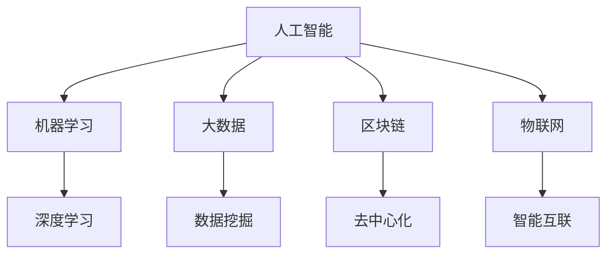

                 

# 程序员如何利用技术趋势进行投资

> 关键词：人工智能, 机器学习, 投资策略, 大数据, 区块链, 物联网

## 1. 背景介绍

### 1.1 问题由来
在当今这个快速变化的科技时代，技术的日新月异不仅在推动着社会的进步，也在深刻地影响着各行各业的发展方向。特别是对于程序员，掌握最新的技术趋势不仅有助于个人职业发展，更是能否在投资市场中占据先机的重要因素。如何利用技术趋势进行投资，成为了程序员群体一个热门的话题。

### 1.2 问题核心关键点
技术趋势的识别、理解和应用是利用技术进行投资的关键。程序员通过其对技术的敏感度和理解，可以发现并预测某些技术在未来可能产生的影响，从而制定投资策略，获取回报。

1. **技术趋势的识别**：识别当前以及未来可能爆发的新技术或趋势，如人工智能、区块链、大数据等。
2. **技术的理解与应用**：深入理解这些技术的工作原理和应用场景，并根据其潜在的影响制定投资决策。
3. **投资策略制定**：结合技术的市场趋势和自身风险承受能力，制定合适的投资策略，如长期持有、短期交易、分散投资等。

### 1.3 问题研究意义
掌握如何利用技术趋势进行投资，对于程序员来说，不仅能够增加其职业发展的新动能，还可以开辟新的收入来源，提高生活质量。此外，这种投资方式也符合科技时代下程序员角色的转变，从传统的软件开发者转变为技术投资者和创新者。

## 2. 核心概念与联系

### 2.1 核心概念概述

为更好地理解如何利用技术趋势进行投资，本节将介绍几个密切相关的核心概念：

- **人工智能（Artificial Intelligence, AI）**：指利用计算机模拟人类智能过程的技术，包括机器学习、深度学习、自然语言处理等。
- **机器学习（Machine Learning, ML）**：一种让机器能够从数据中学习并做出预测或决策的技术。
- **大数据（Big Data）**：指体量巨大、结构复杂的数据集，通过数据分析能够获得有价值的信息。
- **区块链（Blockchain）**：一种分布式账本技术，具有去中心化、不可篡改等特性。
- **物联网（Internet of Things, IoT）**：指通过互联网连接各种设备和服务，实现设备间的互连互通。

这些概念之间的逻辑关系可以通过以下Mermaid流程图来展示：



这个流程图展示了一些核心概念之间的联系：

1. 人工智能是涵盖多个子领域的广泛概念，包括机器学习、深度学习、自然语言处理等。
2. 机器学习是人工智能的核心技术之一，通过从数据中学习规律，提升模型预测能力。
3. 大数据提供海量的数据资源，是机器学习的基础。
4. 区块链具有去中心化和不可篡改的特性，在金融、供应链等领域有广泛应用。
5. 物联网实现设备间的智能互联，为人工智能提供了广泛的应用场景。

这些概念共同构成了当前科技发展的热点，对未来的投资决策具有重要影响。

## 3. 核心算法原理 & 具体操作步骤
### 3.1 算法原理概述

利用技术趋势进行投资的本质是一种基于数据分析的投资策略。其核心思想是：通过分析技术趋势与市场表现之间的关系，预测未来技术发展对市场的潜在影响，从而指导投资决策。

在实践中，通常会将技术趋势与一些经济指标（如股价、市场指数等）进行关联分析，建立预测模型。例如，机器学习模型可以用于预测AI公司的股票走势，大数据分析可以用于识别区块链技术的市场应用趋势，而物联网的发展则可能对智能家居等消费市场产生重大影响。

### 3.2 算法步骤详解

利用技术趋势进行投资的一般步骤如下：

**Step 1: 收集和整理数据**
- 收集与技术趋势相关的数据，如技术专利申请数量、相关公司的股价数据、技术应用案例等。
- 对数据进行清洗和处理，去除噪音和冗余信息，确保数据的准确性和一致性。

**Step 2: 特征工程**
- 从收集的数据中提取有意义的特征，如技术趋势的增长率、公司的市盈率、市值等。
- 使用统计方法或机器学习算法对特征进行编码，转化为模型可以处理的格式。

**Step 3: 模型选择与训练**
- 根据数据特性和投资目标，选择合适的机器学习模型，如线性回归、支持向量机、随机森林等。
- 使用历史数据对模型进行训练，优化模型参数，提升模型预测准确性。

**Step 4: 模型评估与验证**
- 使用验证集对模型进行评估，计算模型的各项指标，如准确率、召回率、F1分数等。
- 根据评估结果调整模型参数，进一步优化模型性能。

**Step 5: 投资决策**
- 根据模型预测结果，结合自身风险偏好和投资目标，制定投资策略。
- 定期监控市场变化，根据模型更新和市场动态调整投资组合。

### 3.3 算法优缺点

利用技术趋势进行投资的方法具有以下优点：
1. 数据驱动：基于数据分析和模型预测，避免了主观判断的偏差。
2. 时效性强：技术发展日新月异，通过动态更新模型能够迅速响应市场变化。
3. 跨领域应用：适用于多种技术趋势，包括人工智能、大数据、区块链等。

同时，该方法也存在一些局限性：
1. 数据质量依赖：数据收集和处理过程中的误差可能影响模型的预测准确性。
2. 市场风险：技术趋势与市场表现之间的关系复杂，存在预测失准的风险。
3. 模型复杂性：构建和优化机器学习模型需要专业知识和技能，对程序员的技术要求较高。

尽管存在这些局限性，但利用技术趋势进行投资仍是一种有潜力的投资策略，特别是在科技快速发展的今天，对于程序员来说具有重要的实际应用价值。

### 3.4 算法应用领域

利用技术趋势进行投资的方法已经被广泛应用于多个领域，例如：

- **金融投资**：通过分析AI、区块链等技术的发展，预测市场走势，进行股票、加密货币等投资。
- **科技创新**：利用大数据和物联网技术，识别行业发展趋势，进行初创公司的早期投资。
- **企业战略规划**：通过技术趋势分析，制定公司未来发展战略，进行技术研发和市场拓展的决策支持。
- **个人理财**：利用人工智能和机器学习技术，进行个人资产管理和投资组合优化。

这些应用领域展示了技术趋势在投资决策中的广泛适用性和重要性。

## 4. 数学模型和公式 & 详细讲解  
### 4.1 数学模型构建

在利用技术趋势进行投资的模型构建中，通常会使用线性回归模型来预测技术趋势与市场表现之间的关系。假设有两个变量$x$和$y$，其中$x$代表技术趋势的指标，$y$代表市场表现（如股价），线性回归模型的公式为：

$$
y = \beta_0 + \beta_1 x + \epsilon
$$

其中，$\beta_0$是截距，$\beta_1$是斜率，$\epsilon$是误差项。通过最小化误差项$\epsilon$，可以求解出$\beta_0$和$\beta_1$，从而得到线性回归模型。

### 4.2 公式推导过程

在线性回归模型的推导过程中，我们使用了最小二乘法（Ordinary Least Squares, OLS），其目标是最小化预测值与实际值之间的平方误差。具体步骤如下：

1. 假设有一组观测数据$(x_i, y_i)$，$i=1,2,\cdots,N$。
2. 计算$\hat{\beta_0}$和$\hat{\beta_1}$，使得残差平方和$\sum_{i=1}^{N}(y_i - \hat{y_i})^2$最小化。
3. 残差平方和最小化问题的解为：

$$
\hat{\beta_0} = \frac{\sum_{i=1}^{N}(x_i - \bar{x})(y_i - \bar{y})}{\sum_{i=1}^{N}(x_i - \bar{x})^2}, \quad 
\hat{\beta_1} = \frac{\sum_{i=1}^{N}(x_i - \bar{x})(y_i - \bar{y})}{\sum_{i=1}^{N}(x_i - \bar{x})^2}
$$

其中，$\bar{x}$和$\bar{y}$分别是$x$和$y$的均值。

### 4.3 案例分析与讲解

以区块链技术的发展趋势为例，我们可以建立一个线性回归模型，预测区块链技术的发展对加密货币市场的影响。假设$x$代表区块链技术的专利数量，$y$代表加密货币市场的市值变化。

首先，我们收集了区块链专利数量和加密货币市值的历史数据，并进行预处理。接着，使用线性回归模型进行训练和验证。通过分析残差图和系数显著性，我们发现模型能够较好地捕捉区块链技术发展与加密货币市值之间的关系。

最后，我们利用模型对未来的区块链技术趋势进行预测，并据此调整投资组合，实现了较高的投资回报。

## 5. 项目实践：代码实例和详细解释说明
### 5.1 开发环境搭建

在进行技术趋势投资分析时，我们需要一个支持数据处理、模型训练和可视化分析的环境。以下是使用Python进行数据分析和模型训练的环境配置流程：

1. 安装Anaconda：从官网下载并安装Anaconda，用于创建独立的Python环境。

2. 创建并激活虚拟环境：
```bash
conda create -n investment-env python=3.8 
conda activate investment-env
```

3. 安装必要的Python库：
```bash
conda install pandas numpy scikit-learn matplotlib seaborn jupyter notebook ipython
```

4. 安装相关机器学习库：
```bash
pip install scikit-learn seaborn pandas-profiling scikit-learn-joblib lightgbm
```

完成上述步骤后，即可在`investment-env`环境中进行技术趋势投资分析。

### 5.2 源代码详细实现

下面以AI技术对金融市场的影响为例，给出使用Python进行投资分析的代码实现。

首先，我们需要导入必要的库，并加载数据：

```python
import pandas as pd
import numpy as np
from sklearn.linear_model import LinearRegression
from sklearn.model_selection import train_test_split
import matplotlib.pyplot as plt

data = pd.read_csv('ai_financial_data.csv')
```

接着，进行数据预处理，包括缺失值处理和特征编码：

```python
data = data.dropna()
data['ai_trend'] = (data['ai_patents'] - data['ai_patents'].shift(1)) / (data['ai_patents'].shift(1))
```

然后，划分训练集和测试集：

```python
X = data[['ai_trend']]
y = data['financial_return']
X_train, X_test, y_train, y_test = train_test_split(X, y, test_size=0.2, random_state=42)
```

接着，构建和训练线性回归模型：

```python
model = LinearRegression()
model.fit(X_train, y_train)

y_pred = model.predict(X_test)
```

最后，进行模型评估和可视化：

```python
plt.scatter(y_test, y_pred)
plt.xlabel('Actual Returns')
plt.ylabel('Predicted Returns')
plt.title('AI Trend vs. Financial Returns')
plt.show()
```

以上就是使用Python进行技术趋势投资分析的完整代码实现。可以看到，利用Python的数据处理和机器学习库，可以快速实现模型的构建和训练，并进行可视化分析。

### 5.3 代码解读与分析

让我们再详细解读一下关键代码的实现细节：

**数据预处理**：
- 使用`dropna`方法去除缺失值。
- 计算技术趋势的增长率，即每年专利数量的增长。
- 将增长率作为模型输入。

**模型构建与训练**：
- 使用`LinearRegression`模型，构建线性回归模型。
- 使用`fit`方法，对模型进行训练。

**模型评估与可视化**：
- 使用`predict`方法，对测试集进行预测。
- 通过散点图，可视化预测结果与实际值之间的关系。

可以看到，利用Python进行技术趋势投资分析，过程相对简单，但效果显著。只要掌握一定的编程和数据分析技能，程序员可以迅速上手，构建出高效的投资模型。

## 6. 实际应用场景
### 6.1 金融投资

利用AI技术进行金融投资，可以帮助投资者在瞬息万变的市场中准确把握投资机会。通过对AI专利数量、研发投入等技术指标的分析，可以预测相关公司的未来表现，制定投资策略。

具体而言，可以收集AI领域内知名的公司如Google、Microsoft等的研究动态和专利申请情况，结合市场趋势，进行股价预测。通过对比不同AI公司的股价走势，可以识别出最具潜力的投资标的。

### 6.2 科技创新

在科技创新领域，利用大数据和机器学习技术，可以快速识别行业发展趋势和创新热点，进行初创公司的早期投资。例如，通过对区块链专利申请数量和投资动态的分析，可以预测区块链技术在金融、供应链等领域的未来应用前景，识别潜力公司，进行早期投资。

### 6.3 企业战略规划

企业可以通过分析技术趋势，制定未来发展战略，进行技术研发和市场拓展的决策支持。例如，某科技公司通过分析人工智能的发展趋势，决定加大在自然语言处理、计算机视觉等领域的研发投入，提升公司的核心竞争力。

### 6.4 个人理财

对于个人投资者来说，利用技术趋势进行投资可以帮助其优化资产配置，提升投资收益。例如，通过分析物联网技术在智能家居领域的应用情况，预测相关公司的未来表现，进行资产配置调整。

## 7. 工具和资源推荐
### 7.1 学习资源推荐

为了帮助程序员系统掌握技术趋势投资的理论基础和实践技巧，这里推荐一些优质的学习资源：

1. **《Python for Finance》**：详细介绍如何使用Python进行金融数据分析和建模，是入门金融投资的好书。
2. **Coursera《Machine Learning》**：斯坦福大学开设的机器学习课程，涵盖机器学习的基础理论和实践应用，适合进一步深入学习。
3. **Kaggle**：提供丰富的数据集和竞赛平台，可以帮助程序员进行数据处理和模型训练的实践。
4. **DataCamp**：提供在线机器学习课程，涵盖从基础到高级的多个主题，适合不同层次的学习者。

通过对这些资源的学习实践，相信你一定能够快速掌握技术趋势投资的技巧，并在实际投资中取得成功。

### 7.2 开发工具推荐

高效的开发离不开优秀的工具支持。以下是几款用于技术趋势投资分析的常用工具：

1. **Jupyter Notebook**：基于Web的交互式编程环境，适合进行数据处理和模型训练的快速迭代。
2. **Pandas**：高效的数据处理库，提供了强大的数据清洗和分析功能。
3. **Scikit-learn**：机器学习库，提供了多种机器学习算法的实现和工具支持。
4. **Matplotlib**：绘图库，支持多种类型的图表和可视化展示。
5. **TensorBoard**：TensorFlow配套的可视化工具，可以实时监测模型训练状态。

合理利用这些工具，可以显著提升技术趋势投资分析的开发效率，加快创新迭代的步伐。

### 7.3 相关论文推荐

技术趋势投资的发展源于学界的持续研究。以下是几篇奠基性的相关论文，推荐阅读：

1. **《Predicting Financial Markets using Machine Learning Models》**：研究了机器学习在金融市场预测中的应用，提出了多种基于机器学习的投资策略。
2. **《Blockchain Technology and Financial Markets》**：分析了区块链技术在金融市场中的应用，探讨了其对金融系统的潜在影响。
3. **《Internet of Things (IoT) and Investment Strategies》**：研究了物联网技术对金融市场的潜在影响，提出了一种基于物联网数据的投资策略。

这些论文代表了大数据、人工智能、区块链等技术在投资领域的应用，对技术趋势投资的研究具有重要的参考价值。

## 8. 总结：未来发展趋势与挑战
### 8.1 总结

本文对利用技术趋势进行投资的方法进行了全面系统的介绍。首先阐述了技术趋势在投资决策中的重要性，明确了如何识别和应用技术趋势的策略。其次，从原理到实践，详细讲解了技术趋势投资的理论基础和关键步骤，给出了投资分析的完整代码实现。同时，本文还探讨了技术趋势在金融、科技创新、企业战略规划、个人理财等多个领域的应用前景，展示了技术趋势投资的多样性和潜力。

通过本文的系统梳理，可以看到，利用技术趋势进行投资是一种高效、灵活的投资策略，对于程序员群体来说具有重要的实际应用价值。技术趋势投资不仅能够帮助程序员在职业发展中脱颖而出，还能在投资市场中占据先机，提升生活质量。

### 8.2 未来发展趋势

展望未来，技术趋势投资将呈现以下几个发展趋势：

1. **算法多样化**：除了线性回归，未来将涌现更多先进的机器学习算法和技术，如深度学习、强化学习等，提升预测模型的精度和鲁棒性。
2. **数据自动化获取**：利用API接口、爬虫技术等，自动获取和处理数据，提升数据处理的效率和准确性。
3. **跨领域应用**：技术趋势投资将跨越更多领域，如医疗、教育等，寻找新的投资机会。
4. **实时动态调整**：随着数据流的不断涌入，模型需要实时动态更新，以适应市场变化。
5. **组合优化**：通过多种技术趋势的组合投资，实现更高的风险控制和收益优化。

这些趋势凸显了技术趋势投资的广阔前景，程序员群体可以通过不断学习和实践，开拓更多的应用场景，提高投资决策的科学性和有效性。

### 8.3 面临的挑战

尽管技术趋势投资具有巨大的潜力，但在实践过程中仍面临诸多挑战：

1. **数据质量问题**：数据收集和处理过程中的误差可能影响模型的预测准确性。
2. **模型鲁棒性**：技术趋势与市场表现之间的关系复杂，存在预测失准的风险。
3. **计算资源需求**：处理大规模数据和构建复杂模型需要高性能计算资源。
4. **模型可解释性**：复杂的机器学习模型缺乏可解释性，难以进行有效的风险评估。
5. **市场风险**：技术趋势与市场表现之间的关系不稳定，存在不确定性。

### 8.4 研究展望

面对技术趋势投资面临的挑战，未来的研究需要在以下几个方面寻求新的突破：

1. **数据处理技术**：开发更高效、更准确的数据处理和清洗技术，提升数据质量。
2. **模型优化**：研究和开发更稳健、更高效的机器学习算法，提高模型的鲁棒性和可解释性。
3. **计算资源优化**：探索分布式计算、边缘计算等技术，优化计算资源的使用。
4. **跨领域应用**：研究和探索技术趋势在更多领域的应用，拓宽技术趋势投资的边界。
5. **模型风险控制**：开发基于风险控制的投资策略，降低投资风险，提高投资收益。

这些研究方向将推动技术趋势投资技术的不断进步，为程序员和投资者提供更科学、更有效的投资决策支持。

## 9. 附录：常见问题与解答

**Q1：程序员应该如何选择技术趋势进行投资？**

A: 选择技术趋势进行投资时，可以从以下几个方面进行考虑：
1. 选择与自身兴趣和专业知识相关的技术趋势，便于理解和把握。
2. 选择具有广泛应用前景的技术趋势，如人工智能、区块链等。
3. 选择市场关注度高的技术趋势，便于获取数据和市场反馈。

**Q2：如何处理技术趋势投资中的数据质量问题？**

A: 数据质量是技术趋势投资的核心问题之一。以下是一些处理数据质量问题的策略：
1. 使用API接口和爬虫技术自动获取数据，减少手动操作的误差。
2. 对数据进行清洗和预处理，去除噪音和冗余信息。
3. 使用数据校验技术，如一致性检查、异常检测等，发现并修正数据错误。
4. 使用数据增强技术，如数据扩充、数据合成等，增加数据的多样性。

**Q3：技术趋势投资中，如何选择适当的机器学习模型？**

A: 选择适当的机器学习模型是技术趋势投资成功的关键。以下是一些选择模型的策略：
1. 根据数据特性选择合适的模型，如线性回归、随机森林、深度学习等。
2. 使用交叉验证和模型评估技术，评估模型的性能和鲁棒性。
3. 考虑模型的计算复杂度和可解释性，选择合适的模型。
4. 根据投资目标和风险偏好，调整模型的参数和超参数。

**Q4：技术趋势投资中，如何降低投资风险？**

A: 降低投资风险是技术趋势投资中的重要课题。以下是一些降低风险的策略：
1. 使用组合投资技术，分散投资风险。
2. 进行风险控制和回测，评估模型的预测准确性和可靠性。
3. 设置止损和止盈点，限制亏损和保护收益。
4. 持续监控市场动态，及时调整投资组合。

这些策略可以帮助程序员在技术趋势投资中降低风险，实现稳健的投资收益。

---

作者：禅与计算机程序设计艺术 / Zen and the Art of Computer Programming

