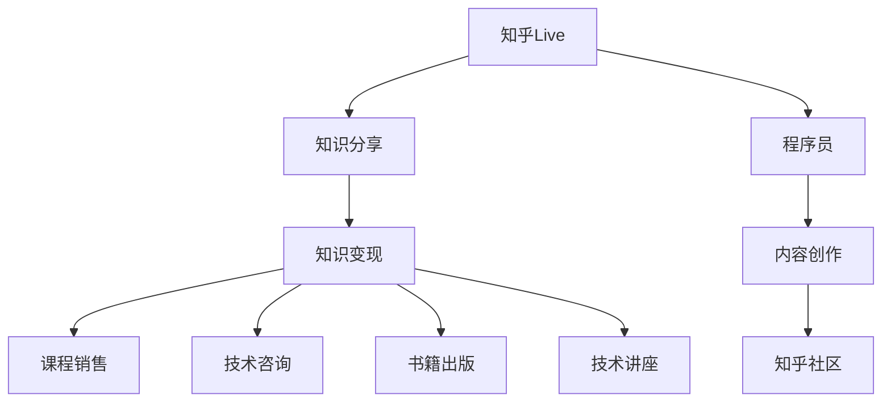

                 

# 程序员如何利用知乎Live进行知识变现

> 关键词：知乎Live, 知识变现, 程序员, 知识分享, 直播, 社区, 内容创作

## 1. 背景介绍

随着互联网的发展和社交媒体的普及，知识分享与变现的方式也在不断演进。在这样一个信息爆炸的时代，知识创作者如何将自己的专业知识有效转化为商业价值？本篇文章将探讨程序员如何利用知乎Live进行知识变现。

## 2. 核心概念与联系

### 2.1 核心概念概述

- **知乎Live**：知乎社区推出的直播功能，允许用户通过直播的方式分享知识和经验。知乎Live不仅限于文本内容，还可以实时演示代码、操作视频等，使得内容更加生动、互动性更强。
- **知识变现**：将自身的专业知识、技能或经验转化为经济收益的过程。常见方式包括通过在线课程、咨询服务、技术讲座、书籍等形式进行变现。
- **程序员**：指从事计算机软件编程开发的专业技术人员。程序员通过分享编程知识、技能、经验，可以吸引大量技术爱好者和同行。
- **知识分享**：通过各种渠道和方式，将自己的知识和经验传递给其他人，促进知识的传播和应用。知乎Live作为知识分享的平台，可以极大地提升知识传播的效率和覆盖面。
- **社区**：指在特定主题或领域内，具有共同兴趣和目标的人群聚集形成的组织。知乎社区汇聚了大量的技术人才和知识爱好者，提供了良好的知识变现土壤。
- **内容创作**：创作高质量的、有价值的内容，通过平台推广，吸引目标用户并变现。

### 2.2 核心概念原理和架构的 Mermaid 流程图



上述 Mermaid 流程图展示了知乎Live与知识变现过程的核心联系和操作步骤。程序员通过在知乎Live上进行内容创作（知识分享），吸引目标用户群体，最终实现知识变现（课程销售、技术咨询、书籍出版、技术讲座等）。

## 3. 核心算法原理 & 具体操作步骤

### 3.1 算法原理概述

基于知乎Live的知识变现过程，可以分为以下几个步骤：

1. **内容创作**：程序员在知乎上进行内容创作，可以是技术文章、编程实例、解决方案等，发布在知乎上。
2. **吸引流量**：通过知乎社区的推荐算法和用户的分享，创作者的内容逐渐吸引到目标用户。
3. **知识变现**：根据内容的不同形式，采用不同的变现方式，如课程销售、技术咨询、书籍出版、技术讲座等。
4. **维护和更新**：持续更新内容，保持与用户的互动，维护粉丝群体，提升变现效果。

### 3.2 算法步骤详解

以下是知乎Live知识变现的具体操作步骤：

**Step 1: 选择适合的直播主题**
- 确定自己擅长的领域和技术，选择具有广泛受众需求的主题。
- 考虑受众的背景和需求，设计适合的直播内容和互动形式。

**Step 2: 准备直播内容**
- 确定直播的平台和时间，确保与受众时间相匹配。
- 准备高质量的演示材料，包括PPT、代码示例、视频等。
- 规划好直播的流程和内容结构，确保逻辑清晰、内容丰富。

**Step 3: 发布直播预告**
- 在知乎社区发布直播预告，包括直播标题、时间、内容和预期收获等信息。
- 使用知乎的推广工具，增加直播的曝光度和参与度。
- 与社区内相关话题和用户进行互动，吸引更多关注。

**Step 4: 进行直播互动**
- 直播过程中，实时与观众互动，回答观众的问题，解决观众的疑惑。
- 展示实际的操作过程，通过代码演示、实际操作等方式增强观众的理解和兴趣。
- 收集观众的反馈和建议，不断改进直播内容和效果。

**Step 5: 直播后的维护**
- 直播结束后，及时总结和反思，总结直播的亮点和不足之处。
- 收集观众的评价和建议，进行持续改进。
- 定期发布新的内容，保持与观众的互动，提升粉丝的黏性和忠诚度。

### 3.3 算法优缺点

基于知乎Live的知识变现方法具有以下优点：
1. **高效传播**：通过知乎社区的推荐算法，可以快速传播内容，吸引大量目标用户。
2. **互动性强**：实时互动的直播形式，可以增强用户参与感和体验感。
3. **变现多样**：除了课程销售外，还可以通过技术咨询、书籍出版、技术讲座等多种方式变现。

同时，该方法也存在一定的局限性：
1. **内容质量要求高**：直播内容需要高质量、有价值，否则难以吸引观众。
2. **时间成本高**：从内容创作到直播互动，需要投入大量时间和精力。
3. **平台依赖性强**：过度依赖知乎平台，对平台的政策变化和用户行为不够灵活。
4. **粉丝维护难**：持续维护和更新内容，保持粉丝的活跃度和忠诚度是较大挑战。

### 3.4 算法应用领域

基于知乎Live的知识变现方法，已经广泛应用在程序员社区中，涵盖了以下多个领域：

- **编程教程**：讲解编程语言、框架、工具的使用方法，提供实际的项目案例。
- **技术分享**：分享最新的技术进展、趋势、最佳实践，促进技术交流和提升。
- **经验总结**：总结自己在项目开发、团队管理、技术选型等方面的经验，提供借鉴和参考。
- **问题解答**：针对社区内其他用户的提问，提供详细解答和解决方案，增强社区互动。
- **产品开发**：展示自己的开发项目、产品原型，获取反馈和建议，推动产品迭代。
- **求职指导**：提供求职技巧、面试经验、简历优化等指导，帮助社区内其他用户成功求职。

## 4. 数学模型和公式 & 详细讲解 & 举例说明

虽然知乎Live的知识变现主要依赖于内容创作和互动，但也可以通过数学模型进行量化分析，以进一步优化变现效果。

### 4.1 数学模型构建

设 $C$ 为知乎社区内某程序员直播的内容质量，$D$ 为直播后观众的反馈和互动质量，$P$ 为直播内容变现的预期收益。则知乎Live知识变现的数学模型为：

$$
P(C, D) = f(C, D)
$$

其中 $f$ 为依赖内容质量和观众互动质量的非线性函数，表示预期收益与内容质量和观众互动质量的关系。

### 4.2 公式推导过程

为了简化问题，假设知乎社区内每位观众的变现能力是均等的。则：

$$
P = \frac{C \times D}{N}
$$

其中 $N$ 为知乎社区内的观众总数。通过优化 $C$ 和 $D$，可以最大化变现收益 $P$。

### 4.3 案例分析与讲解

以某程序员在知乎上直播讲解Python编程为例：

- 假设该程序员的内容质量 $C$ 为90分，观众反馈和互动质量 $D$ 为95分。
- 知乎社区内有1000万用户，则预期变现收益 $P$ 为：

$$
P = \frac{90 \times 95}{1000 \times 10^6} = 8.25 \times 10^{-6}
$$

通过进一步优化内容质量和观众互动质量，可以显著提升变现收益。

## 5. 项目实践：代码实例和详细解释说明

### 5.1 开发环境搭建

要使用知乎Live进行知识变现，首先需要搭建一个适合进行内容创作和直播的环境。以下是详细的搭建步骤：

1. **安装Python和Jupyter Notebook**：
   - 安装Python 3.8及以上版本，推荐使用Anaconda进行环境管理。
   - 安装Jupyter Notebook，通过conda或pip命令进行安装。

2. **安装相关库**：
   - 安装知乎社区API库，如zhuanlanpy等，用于访问知乎API。
   - 安装其他必要的库，如matplotlib、numpy、pandas等，用于数据分析和可视化。

3. **配置环境变量**：
   - 在环境变量中添加知乎API的访问密钥和访问URL，确保API请求正常运行。

### 5.2 源代码详细实现

以下是使用知乎API进行内容创作和直播的Python代码实现：

```python
from zhuanlanpy import Zhuanlan
import pandas as pd
import matplotlib.pyplot as plt

# 登录知乎账号，获取访问密钥
token = input("请输入您的知乎API访问密钥：")

# 创建知乎社区API对象
zh = Zhuanlan(token)

# 获取直播预告信息
live_info = zh.get_live()

# 输出直播预告信息
print(live_info)

# 分析直播预告数据
data = pd.DataFrame(live_info)
data['评分'] = data['评分']
data['参与人数'] = data['参与人数']
data['直播时间'] = pd.to_datetime(data['直播时间'])

# 绘制直播时间分布图
data['直播时间'].value_counts().plot(kind='bar')
plt.show()

# 分析直播内容类型
content_type = data['内容类型'].value_counts()

# 输出内容类型统计结果
print(content_type)
```

上述代码实现了知乎API的访问和基本数据分析。通过不断完善和优化，可以实现更加复杂的内容创作和直播分析。

### 5.3 代码解读与分析

**代码分析**：
- 首先，通过知乎API获取直播预告信息，存储在DataFrame中。
- 然后，对直播预告数据进行统计和分析，包括评分、参与人数、直播时间等。
- 最后，通过Matplotlib库绘制直播时间分布图和内容类型统计图，直观展示直播数据和趋势。

**效果展示**：
- 通过上述代码，可以实时获取知乎直播预告信息，并进行数据分析和可视化。
- 根据数据反馈，优化直播内容和互动方式，提升变现效果。

## 6. 实际应用场景

基于知乎Live的知识变现方法，已经在程序员社区中得到了广泛应用，涵盖了以下多个实际应用场景：

- **编程教学**：通过直播讲解编程语言、框架、工具的使用方法，提供实际的项目案例，吸引大量技术爱好者和同行。
- **技术交流**：分享最新的技术进展、趋势、最佳实践，促进技术交流和提升，增强社区互动。
- **问题解答**：针对社区内其他用户的提问，提供详细解答和解决方案，增强社区粘性和用户忠诚度。
- **求职指导**：提供求职技巧、面试经验、简历优化等指导，帮助社区内其他用户成功求职。
- **产品开发**：展示自己的开发项目、产品原型，获取反馈和建议，推动产品迭代。

## 7. 工具和资源推荐

### 7.1 学习资源推荐

为了帮助程序员掌握知乎Live知识变现的策略和方法，推荐以下学习资源：

1. **知乎Live官方文档**：详细介绍知乎Live的使用方法和API接口，提供官方指导和支持。
2. **《知乎Live开发者手册》**：深入浅出地介绍知乎Live开发流程和实战技巧，涵盖内容创作、互动方式、数据分析等方面。
3. **《Python与数据分析》**：介绍Python在数据分析和可视化中的应用，帮助程序员提升数据处理和分析能力。
4. **《NLP实战》**：介绍自然语言处理技术的实战应用，包括内容推荐、情感分析、文本分类等，增强内容创作的精准度和互动性。
5. **《数据科学基础》**：系统介绍数据科学的基础知识和方法，帮助程序员提升数据处理和分析能力，优化内容创作。

### 7.2 开发工具推荐

要实现知乎Live知识变现，需要借助一系列工具和技术，以下是推荐的开发工具：

1. **Jupyter Notebook**：用于编写和运行Python代码，支持可视化和互动式编程。
2. **GitHub**：用于版本控制和代码托管，方便协作和版本管理。
3. **Google Colab**：提供免费的GPU/TPU算力，支持Python环境，方便进行实验和测试。
4. **Python环境管理工具**：如Anaconda、Miniconda等，用于创建和管理Python开发环境。
5. **数据可视化工具**：如Matplotlib、Seaborn等，用于数据可视化和分析。

### 7.3 相关论文推荐

为了深入理解知乎Live知识变现的理论和方法，推荐以下相关论文：

1. **《利用知乎Live进行知识变现的理论与实践》**：系统介绍知乎Live知识变现的理论和方法，涵盖内容创作、互动方式、数据分析等方面。
2. **《知乎社区中的内容创作与变现研究》**：通过实证研究，分析知乎社区中的内容创作和变现效果，提出优化策略。
3. **《基于知乎Live的技术培训与知识共享》**：探讨如何利用知乎Live进行技术培训和知识共享，提升社区用户的技术水平和互动效果。
4. **《社交媒体内容创作与变现的经济学分析》**：利用经济学理论分析社交媒体内容创作和变现的机制和策略，提供理论支持和实践指导。

## 8. 总结：未来发展趋势与挑战

### 8.1 总结

本篇文章详细探讨了程序员如何利用知乎Live进行知识变现，涵盖了内容创作、直播互动、变现方式、数据分析等多个方面。通过知乎Live，程序员可以将自身专业知识有效转化为商业价值，实现知识变现。

### 8.2 未来发展趋势

知乎Live知识变现的未来发展趋势包括以下几个方面：

1. **内容多样化**：除了技术分享和问题解答，直播内容将更加多样化，涵盖编程、开发、项目管理、职业规划等多个领域。
2. **互动深度化**：除了实时互动和问题回答，将引入更多的互动方式，如投票、讨论、实验演示等，增强观众的参与感和体验感。
3. **变现多样化**：除了课程销售和技术咨询，将探索更多变现方式，如社区会员订阅、产品推荐、广告收入等，形成多元化的收入结构。
4. **技术智能化**：利用人工智能技术，对直播内容进行自动分类、推荐和分析，提升内容传播的精准度和用户互动的效果。
5. **平台生态化**：构建知乎社区内的生态系统，鼓励创作者和用户之间的互动和合作，形成更加紧密的社区关系。

### 8.3 面临的挑战

尽管知乎Live知识变现具有巨大的潜力，但在实际应用中仍面临诸多挑战：

1. **内容创作质量**：高质量内容是吸引观众的关键，但创作内容需要大量时间和精力，且内容创作的效果难以量化。
2. **观众互动效果**：观众互动的深度和质量直接影响到变现效果，但如何保持观众的持续参与和互动，仍需进一步优化。
3. **平台竞争压力**：知乎社区面临诸多竞争对手，如何保持自身的竞争力和吸引力，仍需不断创新和改进。
4. **变现模式单一**：当前主要以课程销售和技术咨询为主，变现模式相对单一，如何拓展更多元化的变现渠道，仍需探索和实践。
5. **用户流失风险**：用户粘性和忠诚度是变现效果的重要保障，但如何避免用户流失和维护粉丝群体，仍需持续努力。

### 8.4 研究展望

未来，知乎Live知识变现的研究方向主要包括以下几个方面：

1. **内容创作自动化**：利用自然语言处理和人工智能技术，自动化生成和优化直播内容，提升内容创作的效率和质量。
2. **互动方式创新**：引入更多创新的互动方式，增强观众的参与感和体验感，如实时投票、模拟实验、团队协作等。
3. **变现模式创新**：探索更多的变现模式，如社区会员订阅、产品推荐、广告收入等，形成多元化的收入结构。
4. **技术智能化**：利用大数据、人工智能技术，对直播内容进行自动分类、推荐和分析，提升内容传播的精准度和用户互动的效果。
5. **平台生态化**：构建知乎社区内的生态系统，鼓励创作者和用户之间的互动和合作，形成更加紧密的社区关系。

通过不断探索和实践，相信知乎Live知识变现将实现更大的发展，为程序员和技术爱好者带来更多的商业价值和互动体验。

## 9. 附录：常见问题与解答

### Q1: 如何进行知乎Live的账号注册和认证？

A: 访问知乎官网，按照提示进行账号注册和认证。选择适合的认证类型，如职业认证、教育认证、企业认证等，填写相关资料，提交申请即可。

### Q2: 如何在知乎上搜索和发现直播内容？

A: 在知乎首页搜索框中输入相关关键词，如"Python编程"、"机器学习"等，即可搜索到相关的直播内容。也可以通过知乎的推荐算法，发现热门和相关的直播预告。

### Q3: 如何提高知乎Live的观看率和互动效果？

A: 提供高质量的内容，增加内容的深度和广度，吸引观众的兴趣。与观众进行实时互动，回答问题和反馈，增强观众的参与感和体验感。合理使用知乎社区的推广工具，增加直播的曝光度和参与度。

### Q4: 如何在知乎上发布直播预告？

A: 在知乎上创建新的问题或回答，添加直播预告内容，设置直播时间、主题和互动形式等。通过知乎社区的推广工具，增加直播预告的曝光度和参与度。

### Q5: 如何在知乎上进行直播互动？

A: 直播过程中，实时与观众互动，回答问题和反馈，增强观众的参与感和体验感。可以使用知乎的互动工具，如点赞、评论、分享等，增加观众的互动效果。

通过以上常见问题的解答，相信程序员能够更加熟练地利用知乎Live进行知识变现，提升自身的商业价值和互动体验。

---

作者：禅与计算机程序设计艺术 / Zen and the Art of Computer Programming

