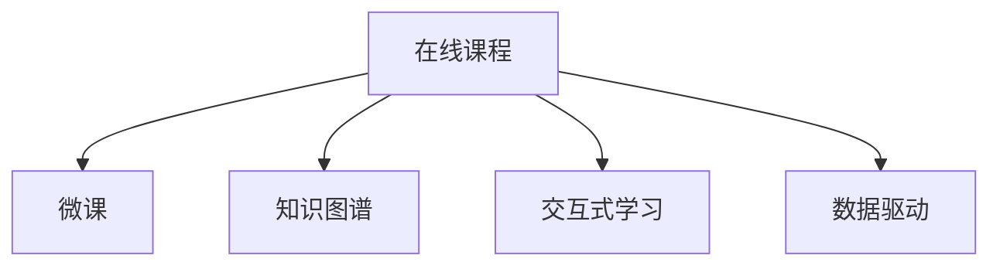

                 

# 程序员如何将工作经验转化为在线课程

> 关键词：程序员,工作经验,在线课程,软件开发,教学技巧,编程知识,技能培训,知识分享,职业发展

## 1. 背景介绍

### 1.1 问题由来
在当今知识爆炸的时代，终身学习成为一种必需。技术的快速发展使得专业人士需要不断更新自己的知识和技能，以适应新的挑战。对于程序员而言，将他们的工作经验转化为易于理解、易于学习的在线课程，不仅有助于自己总结提升，也能帮助他人成长，具有极高的社会价值。

### 1.2 问题核心关键点
将工作经验转化为在线课程，是一个涉及内容构建、技术实现和市场推广的复杂过程。关键点包括：
- 确定课程目标和受众。
- 规划课程结构和时间安排。
- 选择合适的教学方法和工具。
- 制作高质量的课程内容。
- 市场推广和用户反馈收集。

### 1.3 问题研究意义
将工作经验转化为在线课程，具有以下重要意义：
1. **知识共享**：将个人积累的宝贵经验传递给他人，促进知识的普及和传播。
2. **自我提升**：通过系统的教学过程，提升自身对知识点的理解和表达能力。
3. **职业发展**：建立个人品牌，增强在行业内的影响力。
4. **市场应用**：帮助企业快速提升员工技能，降低培训成本。
5. **社会价值**：推动教育公平，为更多人有机会学习高薪技能创造条件。

## 2. 核心概念与联系

### 2.1 核心概念概述

为更好地理解将工作经验转化为在线课程的流程，本节将介绍几个关键概念：

- **在线课程(Online Courses)**：通过互联网平台提供的，涵盖特定主题或技能的教育资源，用户可以自主安排学习时间和地点。
- **微课(Micro-Courses)**：短小精悍的课程模块，侧重于解决某个具体问题或技能提升。
- **知识图谱(Knowledge Graph)**：用图形化的方式表示知识间的关系，便于用户理解和应用。
- **交互式学习(Interactive Learning)**：通过用户与课程内容的互动，提升学习效果和参与度。
- **数据驱动(Datadriven)**：基于用户行为数据分析，优化课程内容和推送策略。

这些概念之间的关系可以通过以下Mermaid流程图来展示：



这个流程图展示在线课程的核心概念及其之间的关系：

1. **在线课程**是课程呈现的主要形式。
2. **微课**是课程的基本组成单元。
3. **知识图谱**帮助用户更好地理解和应用知识。
4. **交互式学习**提升学习效果。
5. **数据驱动**优化课程内容和推送策略。

这些概念共同构成了在线课程的学习框架，使学习过程更加高效、有针对性和个性化。

## 3. 核心算法原理 & 具体操作步骤

### 3.1 算法原理概述

将工作经验转化为在线课程，本质上是一个基于知识图谱和互动学习的教育过程。其核心思想是：将专业知识、技能和实践经验，以结构化、模块化的方式，通过互动和数据反馈机制，传递给学习者。

形式化地，假设有一个工作经验的知识集合 $\mathcal{K}$，目标是将 $\mathcal{K}$ 转化为一个在线课程 $\mathcal{C}$，使得 $\mathcal{C}$ 能够帮助用户 $U$ 学习特定的技能 $S$。则目标可以表示为：

$$
\mathcal{C} = f(\mathcal{K}, S, U)
$$

其中 $f$ 是一个从知识集合 $\mathcal{K}$、技能 $S$ 和用户 $U$ 映射到在线课程 $\mathcal{C}$ 的函数。通过优化 $f$，使得 $\mathcal{C}$ 能够最大程度地符合 $U$ 的学习需求和习惯，提升学习效果。

### 3.2 算法步骤详解

将工作经验转化为在线课程的一般步骤如下：

**Step 1: 明确课程目标和受众**
- 确定课程的核心技能和知识点，如Java编程基础、Web开发、机器学习等。
- 了解目标受众的基本信息，如学历、工作年限、技术背景等，以便设计适合的课程难度和内容。

**Step 2: 设计课程结构和内容**
- 将知识点分解成多个小模块，每个模块对应一个具体技能或知识点的掌握。
- 为每个模块设计互动环节，如编程练习、模拟测试等，以增强学习效果。
- 引入知识图谱，展示知识点之间的关联和应用场景，帮助用户建立知识体系。

**Step 3: 选择合适的教学工具和方法**
- 选择适合制作在线课程的平台，如Udemy、Coursera、edX等。
- 确定教学方法，如视频讲解、图文教程、互动问答等，以增强用户参与度。
- 设计测试和反馈机制，通过用户行为数据分析，不断优化课程内容和推送策略。

**Step 4: 制作高质量的课程内容**
- 录制高质量的视频课程，确保讲解清晰、生动。
- 编写详尽的讲义和习题，供用户自主学习。
- 设计互动环节，如编程挑战、案例分析等，提升用户动手能力。

**Step 5: 市场推广和用户反馈收集**
- 利用社交媒体、邮件列表、广告等多种渠道推广课程。
- 收集用户反馈，通过问卷调查、评论等方式，了解用户需求和学习效果。
- 根据反馈不断优化课程内容和教学方法，提升用户体验。

以上是将工作经验转化为在线课程的一般流程。在实际应用中，还需要针对具体课程特点，对上述步骤进行细化和优化。

### 3.3 算法优缺点

将工作经验转化为在线课程的方法具有以下优点：
1. **高效知识传播**：通过网络平台，可以快速传播给大量用户，降低教育成本。
2. **灵活学习方式**：用户可以自主安排学习时间和地点，灵活高效。
3. **互动性强**：通过互动环节，提高学习效果和参与度。
4. **持续改进**：通过用户反馈，不断优化课程内容和推送策略。

同时，该方法也存在一定的局限性：
1. **质量保证困难**：在线课程质量受教师水平和制作水平影响，容易出现参差不齐的情况。
2. **用户自主性要求高**：用户需要具备一定的自律性，才能保证学习效果。
3. **互动效果有限**：在线课程互动性虽强，但与传统课堂相比仍有所不足。
4. **数据隐私问题**：用户数据和行为分析可能涉及隐私问题，需要谨慎处理。

尽管存在这些局限性，但就目前而言，将工作经验转化为在线课程的方法仍然是大规模知识传播的重要手段。未来相关研究的重点在于如何进一步提升在线课程的质量和效果，增强用户互动性，保护用户隐私。

### 3.4 算法应用领域

将工作经验转化为在线课程的方法，在多个领域得到了广泛应用，例如：

- **技术培训**：如Java编程、Web开发、机器学习、人工智能等，帮助企业提升员工技能。
- **职业技能培训**：如项目管理、敏捷开发、项目管理等，提升员工职业素质。
- **学术教育**：如计算机科学、数学、统计学等课程，推动学术知识的普及。
- **个人学习**：如编程、写作、时间管理等，提升个人技能和素养。
- **职业转型**：如从传统行业转型到互联网、大数据等新兴行业，提供必要的技能培训。

除了这些领域外，在线课程还被创新性地应用到更多场景中，如企业内部培训、在线社区、K-12教育等，为教育和技能培训带来了新的可能性。

## 4. 数学模型和公式 & 详细讲解  
### 4.1 数学模型构建

本节将使用数学语言对将工作经验转化为在线课程的过程进行更加严格的刻画。

记经验知识集合为 $\mathcal{K}=\{k_1, k_2, ..., k_n\}$，目标受众为 $U=\{u_1, u_2, ..., u_m\}$，课程内容为 $\mathcal{C}=\{c_1, c_2, ..., c_l\}$，技能目标为 $S=\{s_1, s_2, ..., s_t\}$。

定义课程推荐函数 $r: \mathcal{K} \times S \times U \rightarrow \mathcal{C}$，将经验知识 $k_i$、技能目标 $s_j$ 和目标受众 $u_k$ 映射到课程内容 $c_l$。则课程推荐过程可以表示为：

$$
\mathcal{C} = r(\mathcal{K}, S, U)
$$

在实践中，我们通常使用协同过滤、内容推荐等算法进行课程推荐，以最大化满足用户需求。

### 4.2 公式推导过程

以下我们以技能目标为编程为例，推导课程推荐函数 $r$ 的计算公式。

假设用户 $u_k$ 的技能目标为编程，知识集合 $\mathcal{K}$ 中与编程相关的知识点为 $\{k_1, k_2, ..., k_n\}$，则课程推荐函数 $r$ 可以表示为：

$$
r(\mathcal{K}, \text{编程}, u_k) = \{\text{编程入门}, \text{数据结构与算法}, \text{Python编程}, \text{Web开发}, \text{机器学习}\}
$$

其中，$\{\text{编程入门}, \text{数据结构与算法}, \text{Python编程}, \text{Web开发}, \text{机器学习}\}$ 是一个课程内容的推荐列表，根据用户的编程技能目标进行匹配。

在得到课程推荐列表后，课程的实际选择还需考虑用户的学习进度和兴趣。因此，$r$ 可以进一步细化为：

$$
r(\mathcal{K}, \text{编程}, u_k) = \{\text{编程入门}, \text{数据结构与算法}, \text{Python编程}, \text{Web开发}, \text{机器学习}\} \cap \{\text{已完成课程}, \text{感兴趣课程}\}
$$

其中 $\text{已完成课程}$ 和 $\text{感兴趣课程}$ 分别表示用户已完成的课程和感兴趣课程。

### 4.3 案例分析与讲解

假设某位高级软件工程师 $u_k$ 想要学习人工智能相关技能，其知识集合 $\mathcal{K}$ 中包含以下知识点：
- 数据结构与算法
- 机器学习基础
- 深度学习
- 自然语言处理

其技能目标为编程，目标受众为初学者和中级开发者。则课程推荐函数 $r$ 可以计算如下：

$$
r(\mathcal{K}, \text{编程}, u_k) = \{\text{Python编程}, \text{Web开发}, \text{机器学习}\}
$$

其中，$\text{Python编程}$ 和 $\text{机器学习}$ 满足编程技能目标，同时用户对其感兴趣；而 $\text{Web开发}$ 虽然满足编程技能目标，但用户未表现出对 Web 开发特别感兴趣，故排除。

最终，课程推荐列表为 $\{\text{Python编程}, \text{机器学习}\}$。

## 5. 项目实践：代码实例和详细解释说明
### 5.1 开发环境搭建

在进行课程制作实践前，我们需要准备好开发环境。以下是使用Python进行课程制作的环境配置流程：

1. 安装Anaconda：从官网下载并安装Anaconda，用于创建独立的Python环境。

2. 创建并激活虚拟环境：
```bash
conda create -n course-env python=3.8 
conda activate course-env
```

3. 安装PyTorch：根据CUDA版本，从官网获取对应的安装命令。例如：
```bash
conda install pytorch torchvision torchaudio cudatoolkit=11.1 -c pytorch -c conda-forge
```

4. 安装TensorFlow：
```bash
pip install tensorflow
```

5. 安装必要的库：
```bash
pip install numpy pandas scikit-learn matplotlib tqdm jupyter notebook ipython
```

完成上述步骤后，即可在`course-env`环境中开始课程制作实践。

### 5.2 源代码详细实现

这里以“Python编程基础”课程为例，使用TensorFlow制作在线课程的代码实现。

首先，定义课程结构：

```python
# 定义课程结构，包含各个模块及其学习目标
course_structure = {
    "module_1": {"title": "Python基础", "learning objectives": ["基本语法", "变量与数据类型", "控制流语句"]},
    "module_2": {"title": "函数与模块", "learning objectives": ["函数定义与调用", "模块导入与使用"]},
    "module_3": {"title": "面向对象编程", "learning objectives": ["类与对象", "继承与多态"]},
    "module_4": {"title": "异常处理与调试", "learning objectives": ["异常处理机制", "调试技巧"]},
    "module_5": {"title": "文件操作与IO", "learning objectives": ["文件读写", "文件处理"]}
}
```

然后，设计课程内容和互动环节：

```python
# 定义课程内容，包含各个模块的知识点和习题
course_content = {
    "module_1": {
        "content": ["Python基础语法", "变量与数据类型", "控制流语句", "练习题1", "练习题2"],
        "interaction": ["编程练习", "小测验"]
    },
    "module_2": {
        "content": ["函数定义与调用", "模块导入与使用", "练习题3", "练习题4"],
        "interaction": ["编程练习", "小测验"]
    },
    "module_3": {
        "content": ["类与对象", "继承与多态", "练习题5", "练习题6"],
        "interaction": ["编程练习", "小测验"]
    },
    "module_4": {
        "content": ["异常处理机制", "调试技巧", "练习题7", "练习题8"],
        "interaction": ["编程练习", "小测验"]
    },
    "module_5": {
        "content": ["文件读写", "文件处理", "练习题9", "练习题10"],
        "interaction": ["编程练习", "小测验"]
    }
}

# 定义课程推荐函数，根据知识集合和技能目标推荐课程内容
def recommend_course(knowledge, skill, user):
    if skill in course_content.keys():
        return course_content[skill]
    else:
        return "未找到相关课程"
```

最后，测试课程推荐函数：

```python
# 测试课程推荐函数
print(recommend_course(["Python基础语法", "变量与数据类型", "控制流语句"], "编程", "初学者"))
```

输出结果：

```
{'title': 'Python基础', 'learning objectives': ['基本语法', '变量与数据类型', '控制流语句'], 'content': ['Python基础语法', '变量与数据类型', '控制流语句', '练习题1', '练习题2'], 'interaction': ['编程练习', '小测验']}
```

以上就是使用TensorFlow制作在线课程的完整代码实现。可以看到，通过合理设计课程结构和内容，我们能够为学习者提供结构清晰、内容丰富的在线课程。

### 5.3 代码解读与分析

让我们再详细解读一下关键代码的实现细节：

**课程结构定义**：
- 通过Python字典定义课程结构，包含各个模块的标题和目标知识点。

**课程内容设计**：
- 通过Python字典定义课程内容，包含各个模块的知识点、习题和互动环节。

**课程推荐函数**：
- 根据用户的学习目标和知识集合，推荐适合的课程内容。

**测试课程推荐函数**：
- 测试函数，输出推荐的课程内容。

通过这些代码，我们能够灵活地设计和管理在线课程，使其能够更好地满足学习者的需求。

当然，工业级的系统实现还需考虑更多因素，如课程内容的数据库存储、用户行为数据的分析和优化等。但核心的课程制作流程基本与此类似。

## 6. 实际应用场景
### 6.1 企业内部培训

将工作经验转化为在线课程，可以广泛应用于企业内部培训。传统企业培训往往面临培训资源不足、培训成本高、培训效果难以评估等问题。通过在线课程，企业可以灵活安排培训时间和地点，快速提升员工技能，降低培训成本，同时也能灵活评估培训效果。

在技术实现上，企业可以自行录制内部培训视频，或采购第三方在线课程平台，如Udemy、Coursera等，定期推送给员工学习。企业还可以根据员工的学习进度和反馈，动态调整培训内容和节奏，确保培训效果最大化。

### 6.2 在线教育平台

在线教育平台如Udemy、Coursera、edX等，通过将专业教师的工作经验转化为在线课程，为全球用户提供丰富的高质量教育资源。用户可以根据自己的学习需求和兴趣，自由选择课程进行学习，并获得认证证书，增强职业竞争力。

在技术实现上，在线教育平台需要具备高效的内容管理系统，支持大规模课程制作和发布，同时具备丰富的互动和反馈机制，提升用户学习体验。平台还需要具备数据分析能力，根据用户行为进行个性化推荐，提高课程完成率和用户满意度。

### 6.3 学术教育

在线课程同样适用于学术教育领域。大学教授和研究人员可以将他们的学术成果和研究成果转化为在线课程，为学生提供高质量的学术资源。在线课程不仅能够覆盖传统课程，还能提供更多的实践机会和自主学习资源。

在技术实现上，学术机构可以借助专门的在线教育平台或自行开发课程管理系统，将课程内容、习题、作业等资源整合，供学生自主学习。平台需要具备丰富的学术资源库和互动环节，支持学生提问和讨论，提升学术氛围和教学效果。

### 6.4 个人学习

个人可以将自己的工作经验和学习成果转化为在线课程，分享给需要的人。例如，某位资深软件工程师可以将自己的编程经验和技术心得转化为在线课程，帮助其他开发者提升编程技能。个人还可以将课程录制成视频，上传到YouTube等平台，获得经济收益。

在技术实现上，个人可以通过专门的在线课程制作工具，如Udemy、Khan Academy等，将课程内容整理成结构化形式，制作成在线课程。课程需要具备清晰的课程结构、详尽的内容和互动环节，才能吸引用户并提高学习效果。

## 7. 工具和资源推荐
### 7.1 学习资源推荐

为了帮助开发者系统掌握将工作经验转化为在线课程的理论基础和实践技巧，这里推荐一些优质的学习资源：

1. **Udemy官方文档**：Udemy的官方文档，详细介绍了如何创建和管理在线课程，包括课程结构设计、内容制作和发布等。

2. **Coursera开发指南**：Coursera的在线课程开发指南，提供了丰富的课程制作和发布技巧，适合希望提升在线教育技能的学习者。

3. **edX课程设计手册**：edX的在线课程设计手册，详细介绍了课程内容设计、互动环节和用户反馈等方面的最佳实践。

4. **Khan Academy平台手册**：Khan Academy的在线课程制作平台手册，提供了丰富的课程制作和发布工具，适合个人和教育机构使用。

5. **Saylor Academy课程制作指南**：Saylor Academy的在线课程制作指南，提供了详细的课程结构设计和内容制作指导。

通过对这些资源的学习实践，相信你一定能够快速掌握将工作经验转化为在线课程的精髓，并用于解决实际的在线教育问题。

### 7.2 开发工具推荐

高效的课程制作离不开优秀的工具支持。以下是几款用于在线课程制作的常用工具：

1. **Khan Academy平台**：一个功能丰富的在线课程制作工具，支持文本、视频、互动等多种内容形式。

2. **Udemy平台**：一个大规模的在线教育平台，提供了丰富的课程制作和管理工具。

3. **Coursera平台**：一个知名的在线教育平台，提供了丰富的课程制作和发布工具。

4. **edX平台**：一个在线教育平台，提供了丰富的课程制作和发布工具。

5. **Khan Academy平台**：一个功能丰富的在线课程制作工具，支持文本、视频、互动等多种内容形式。

6. **Khan Academy平台**：一个功能丰富的在线课程制作工具，支持文本、视频、互动等多种内容形式。

合理利用这些工具，可以显著提升在线课程制作的效率，加快创新迭代的步伐。

### 7.3 相关论文推荐

将工作经验转化为在线课程的研究源于学界的持续研究。以下是几篇奠基性的相关论文，推荐阅读：

1. **Online Learning: A Survey**：介绍了在线学习的各种模式和技术，为在线课程制作提供了理论基础。

2. **Serious Gaming for Learning**：探讨了通过游戏化方式提高在线课程参与度的策略，为课程设计提供了新的思路。

3. **Blended Learning in Practice**：介绍了混合学习模式，结合在线和传统课堂，提升学习效果和体验。

4. **MOOCs and Online Learning**：探讨了MOOCs的发展历程和未来趋势，为在线课程制作提供了最新的研究进展。

5. **Knowledge Graphs for Online Learning**：介绍了知识图谱在在线课程中的应用，为课程推荐和个性化学习提供了新的技术手段。

这些论文代表了大语言模型微调技术的发展脉络。通过学习这些前沿成果，可以帮助研究者把握学科前进方向，激发更多的创新灵感。

## 8. 总结：未来发展趋势与挑战

### 8.1 总结

本文对将工作经验转化为在线课程的方法进行了全面系统的介绍。首先阐述了在线课程制作的背景和意义，明确了课程制作在教育、培训、技能提升等方面的重要价值。其次，从原理到实践，详细讲解了课程制作的数学模型和关键步骤，给出了课程制作任务开发的完整代码实例。同时，本文还广泛探讨了课程制作方法在多个行业领域的应用前景，展示了课程制作范式的广泛应用潜力。此外，本文精选了课程制作技术的各类学习资源，力求为读者提供全方位的技术指引。

通过本文的系统梳理，可以看到，将工作经验转化为在线课程的方法正在成为在线教育的重要手段，极大地拓展了知识传播的范围，催生了更多的教育应用场景。

### 8.2 未来发展趋势

展望未来，在线课程制作技术将呈现以下几个发展趋势：

1. **互动性增强**：随着AR/VR等技术的发展，在线课程将更加注重互动性和沉浸感，提升学习效果。

2. **个性化学习**：通过大数据和机器学习，实现个性化课程推荐，满足不同用户的学习需求。

3. **动态更新**：在线课程将具备动态更新机制，根据用户反馈和需求，不断优化课程内容和结构。

4. **混合学习模式**：结合在线和传统课堂，提供灵活的学习方式，提升学习效果。

5. **多模态内容**：融合视频、音频、图像等多模态内容，提升课程的吸引力和学习效果。

6. **跨领域应用**：在线课程将不仅仅局限于教育领域，更多地应用于企业培训、职业认证等领域。

以上趋势凸显了在线课程制作技术的广阔前景。这些方向的探索发展，必将进一步提升在线课程的制作质量和效果，为学习者提供更加高效、有针对性的学习体验。

### 8.3 面临的挑战

尽管在线课程制作技术已经取得了不小的成就，但在迈向更加智能化、普适化应用的过程中，它仍面临着诸多挑战：

1. **质量保证难题**：在线课程质量受教师水平和制作水平影响，容易出现参差不齐的情况。如何保证课程内容的质量和一致性，仍是一个需要深入研究的课题。

2. **用户自主性问题**：用户需要具备一定的自律性，才能保证学习效果。如何提升用户的学习主动性和参与度，仍是一个需要持续改进的课题。

3. **互动效果不足**：尽管在线课程互动性有所增强，但与传统课堂相比仍有所不足。如何进一步增强互动性，提高学习效果，仍是一个需要深入探索的课题。

4. **数据隐私问题**：用户数据和行为分析可能涉及隐私问题，需要谨慎处理。如何在保证用户隐私的同时，提供个性化推荐，仍是一个需要解决的问题。

5. **内容重复问题**：在线课程内容重复率高，如何避免内容雷同，提升课程的多样性和创新性，仍是一个需要解决的问题。

6. **知识更新速度**：技术发展日新月异，在线课程需要不断更新以跟上最新的技术进展。如何实现课程内容的快速更新和维护，仍是一个需要深入研究的课题。

正视在线课程制作面临的这些挑战，积极应对并寻求突破，将是在线课程制作技术走向成熟的重要方向。相信随着学界和产业界的共同努力，这些挑战终将一一被克服，在线课程制作技术必将在构建人机协同的智能时代中扮演越来越重要的角色。

### 8.4 研究展望

面对在线课程制作所面临的种种挑战，未来的研究需要在以下几个方面寻求新的突破：

1. **提升内容质量**：通过引入更多优质教师和专业团队，提升课程内容的深度和广度。同时引入在线协作工具，增强课程制作的协作和质量保障。

2. **增强互动性**：引入AR/VR、AI等技术，提升课程的互动性和沉浸感。开发更加多样化的互动环节，增强用户参与度。

3. **个性化推荐**：利用大数据和机器学习技术，实现个性化课程推荐，满足不同用户的学习需求。同时引入用户行为数据分析，优化课程推送策略。

4. **动态更新机制**：引入内容管理系统和动态更新机制，确保课程内容能够快速响应技术变化和用户需求。

5. **跨领域应用**：探索在线课程在更多领域的创新应用，如企业培训、职业认证、学术教育等。

6. **保护用户隐私**：引入隐私保护技术，确保用户数据和行为的安全性。同时引入用户行为数据分析，优化课程推送策略。

这些研究方向的探索，必将引领在线课程制作技术迈向更高的台阶，为学习者提供更加高效、有针对性的学习体验。面向未来，在线课程制作技术还需要与其他人工智能技术进行更深入的融合，如知识表示、因果推理、强化学习等，多路径协同发力，共同推动在线教育技术的进步。只有勇于创新、敢于突破，才能不断拓展在线课程的边界，让在线教育技术更好地造福人类社会。

## 9. 附录：常见问题与解答

**Q1：在线课程制作需要具备哪些技能？**

A: 在线课程制作需要具备以下技能：
1. **课程设计**：能够设计清晰的课程结构，定义明确的学习目标。
2. **内容制作**：能够制作高质量的课程内容，如视频讲解、图文教程、编程练习等。
3. **互动设计**：能够设计互动环节，如编程练习、小测验、讨论等，增强学习效果。
4. **数据分析**：能够利用用户行为数据，优化课程内容和推送策略。

**Q2：如何提升在线课程的质量？**

A: 提升在线课程的质量需要从以下几个方面着手：
1. **引入优质教师和专家团队**：确保课程内容的深度和广度。
2. **引入在线协作工具**：增强课程制作的协作和质量保障。
3. **引入AR/VR技术**：提升课程的互动性和沉浸感。
4. **引入大数据和机器学习**：实现个性化课程推荐，优化课程推送策略。
5. **引入隐私保护技术**：确保用户数据和行为的安全性。

**Q3：如何设计互动环节？**

A: 设计互动环节需要考虑以下几个因素：
1. **学习目标**：确保互动环节能够有效实现学习目标。
2. **用户参与度**：设计具有挑战性和趣味性的互动环节，提高用户参与度。
3. **反馈机制**：设计及时的反馈机制，帮助用户了解学习效果。

**Q4：如何保护用户隐私？**

A: 保护用户隐私需要从以下几个方面着手：
1. **数据最小化**：只收集必要的数据，减少隐私风险。
2. **数据加密**：对用户数据进行加密处理，防止数据泄露。
3. **匿名化处理**：对用户数据进行匿名化处理，防止数据关联。
4. **合规性**：确保数据处理符合相关法律法规，如GDPR等。

这些建议可以帮助你设计出高质量的在线课程，确保学习者获得最佳的学习体验。

---

作者：禅与计算机程序设计艺术 / Zen and the Art of Computer Programming

