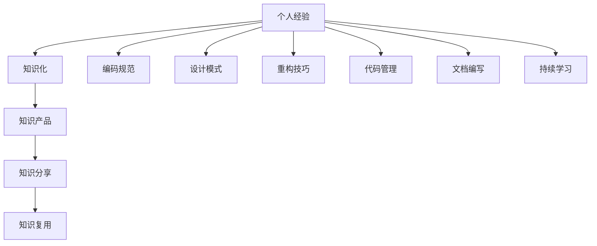

                 

# 程序员如何将工作经验转化为知识产品

> 关键词：工作经验,知识产品,技术积累,编码规范,设计模式,重构技巧,代码管理,文档编写,知识分享,持续学习

## 1. 背景介绍

### 1.1 问题由来
在快速发展的IT行业中，程序员面临的一个重要挑战是如何将个人在项目实践中所积累的技术经验有效地转化为可供共享和复用的知识产品。良好的知识产品不仅可以帮助新入职的开发人员快速上手，还能促进团队协作，提升整体开发效率。然而，如何将零散的个人经验整理为系统的知识资源，是一个复杂而艰巨的任务。

### 1.2 问题核心关键点
1. **个人经验与知识产品的桥梁**：如何将个人的编码习惯、技术决策、问题解决策略等个人经验转化为可以被他人理解和应用的知识。
2. **知识产品化的过程**：从收集素材到撰写文档、设计示例代码、构建文档结构、进行测试与验证、整合为可用的知识资源库。
3. **知识分享与复用**：如何通过平台或社区分享知识，并使其在不同项目和团队中被复用，从而最大化知识价值。

### 1.3 问题研究意义
将个人经验转化为知识产品，有助于实现技术的传承和创新，促进团队文化的形成，并推动企业技术标准的统一。这不仅是对个人能力的提升，也是对整个组织能力的增强。

## 2. 核心概念与联系

### 2.1 核心概念概述

为更好地理解如何将个人经验转化为知识产品，我们需理解几个关键概念：

- **个人经验**：程序员在实际项目中所积累的技术诀窍、编码习惯、问题解决策略、最佳实践等。
- **知识产品**：经过结构化整理、文档化、代码示例化后，能够被他人理解、应用和复用的技术资源。
- **知识化**：将个人经验进行系统化和结构化的处理，形成易于传播和复用的知识产品。
- **知识分享**：通过博客、社区、内部文档等渠道，将知识产品分享给团队或社区成员，促进知识的传播和复用。
- **知识管理**：建立和维护知识库、文档库，采用有效的组织和管理方式，确保知识的可靠性和易用性。

这些核心概念之间的逻辑关系可以通过以下Mermaid流程图来展示：



这个流程图展示了个经验转化为知识产品的核心流程：

1. 个人经验形成编码规范、设计模式、重构技巧、代码管理等知识单元。
2. 将这些知识单元系统化、结构化，转化为易于理解的知识产品。
3. 通过知识分享渠道将知识产品传播给更多开发人员。
4. 知识产品在实际开发中被反复使用，提高团队整体的开发效率和质量。

## 3. 核心算法原理 & 具体操作步骤
### 3.1 算法原理概述

将个人经验转化为知识产品的过程，本质上是一种基于结构化、系统化的知识整理和传播的方法。其核心思想是将个人经验中的关键技术点、代码示例、设计方案等进行归纳总结，形成一套完整的知识体系，并能够以易于理解的形式分享给其他开发人员。

### 3.2 算法步骤详解

1. **收集与整理个人经验**：
   - 定期记录工作中遇到的技术难题、解决问题的方法、最佳实践等。
   - 建立知识收集文档，记录具体细节，如问题描述、解决方法、效果评估等。

2. **系统化知识构建**：
   - 将记录的个人经验进行分类整理，建立逻辑清晰的知识体系，如编码规范、设计模式、重构技巧等。
   - 构建文档结构，将知识细化为可操作、可理解的部分，如代码示例、图表、流程图等。

3. **知识产品化**：
   - 将系统化的知识转化为具体的知识产品，如技术博客、开源项目、内部文档等。
   - 编写高质量的代码示例，确保代码易于理解、可维护。

4. **知识分享与复用**：
   - 通过技术博客、社区、内部知识库等渠道，分享知识产品，供其他开发人员学习。
   - 定期更新知识库，确保知识的时效性和准确性。

5. **知识维护与迭代**：
   - 定期回顾和更新知识库，保证知识的时效性和准确性。
   - 收集反馈，持续改进知识产品的质量。

### 3.3 算法优缺点

**优点**：
1. **经验传承**：将个人经验系统化，方便知识传承和复用，提升团队整体技术水平。
2. **标准化**：通过制定统一的编码规范、设计模式等，提升代码质量和技术标准。
3. **知识体系化**：有助于开发者系统化理解和应用技术知识，提高工作效率。

**缺点**：
1. **初始投入大**：需要投入大量时间和精力进行知识整理和文档编写。
2. **更新迭代困难**：知识库需要定期维护，否则可能过时。
3. **依赖文档质量**：知识产品的质量很大程度上取决于文档编写的专业性和可理解性。

### 3.4 算法应用领域

基于个人经验的知识产品化方法，广泛应用于软件开发、项目管理、技术培训等多个领域。例如：

- **软件开发**：将编码规范、设计模式、重构技巧等知识，以技术博客、代码示例、内部文档等形式分享，帮助新开发者快速上手。
- **项目管理**：制定统一的技术标准、流程规范，提升项目管理的效率和质量。
- **技术培训**：通过知识产品化的文档和代码示例，帮助新员工快速掌握技术要点，提升整体技术水平。
- **开源社区**：通过在GitHub等平台分享开源项目和代码示例，促进技术交流和社区发展。

## 4. 数学模型和公式 & 详细讲解 & 举例说明

### 4.1 数学模型构建

假设我们有一套编码规范，记为$\mathcal{R}$，其中包含一系列的编程准则、代码风格等。我们用数学公式表示编码规范$\mathcal{R}$：

$$\mathcal{R}=\{r_1, r_2, ..., r_n\}$$

其中，$r_i$表示第$i$个编码准则，如命名规范、注释规范、函数设计等。

### 4.2 公式推导过程

以命名规范为例，设有一组编程准则$r_i$，如函数命名规范、变量命名规范等，推导过程如下：

1. **函数命名规范**：
   - $r_i: \text{函数名应使用小写字母，多个单词之间用下划线分隔，如`my_function`}$
   - 表示函数名应符合以下格式：$\text{lowercase\_word\_underscore\_word}$

2. **变量命名规范**：
   - $r_i: \text{变量名应使用小写字母，多个单词之间用下划线分隔，如`my_variable`}$
   - 表示变量名应符合以下格式：$\text{lowercase\_word\_underscore\_word}$

3. **方法命名规范**：
   - $r_i: \text{方法名应使用驼峰命名法，首字母大写，如`myMethod`}$
   - 表示方法名应符合以下格式：$\text{camelCase}$

### 4.3 案例分析与讲解

假设我们有一份编码规范，包含以下规则：

- 函数命名规范：`my_function`
- 变量命名规范：`my_variable`
- 方法命名规范：`myMethod`

以`my_function`为例，根据命名规范$r_i$，我们可以推导出函数名的生成规则：

- 函数名应使用小写字母，多个单词之间用下划线分隔，如`my_function`。
- 如果函数名中有特殊字符，应使用小写字母代替，如`my_function`。

通过上述案例，我们可以看到，数学模型和公式推导过程，可以帮助我们系统化理解和应用编码规范，提高代码编写的规范性和可读性。

## 5. 项目实践：代码实例和详细解释说明

### 5.1 开发环境搭建

要进行知识产品化实践，首先需要搭建开发环境，建议使用以下工具和平台：

1. **IDE**：如Visual Studio Code、IntelliJ IDEA等，支持代码编写和文档编写。
2. **版本控制**：如Git，方便代码管理和文档的协同编写。
3. **文档管理工具**：如Confluence、Google Docs等，支持文档的编写、存储和共享。
4. **代码管理平台**：如GitHub、Gitee等，方便代码的托管和共享。

### 5.2 源代码详细实现

以下是一个简单的技术博客示例，记录了某项技术决策的过程和代码示例：

**博客标题**：使用React Hooks实现表单验证

**博客内容**：

1. **技术背景**：
   - 表单验证在Web开发中常见，但手动实现复杂且容易出错。
   - React Hooks提供了简洁的解决方案，通过自定义Hook，实现表单验证逻辑。

2. **代码示例**：
   - 定义自定义Hook `useForm`，实现表单验证功能。
   - 在组件中使用`useForm`，调用其提供的API进行表单验证。

3. **效果评估**：
   - 通过使用React Hooks，简化了表单验证逻辑，提高了代码的可读性和可维护性。
   - 在实际项目中，验证代码可以快速复用，减少开发时间。

4. **总结**：
   - React Hooks提供了强大的功能和简洁的API，是实现表单验证的好帮手。
   - 自定义Hook可以快速复用，提高开发效率。

### 5.3 代码解读与分析

代码示例中，我们使用React Hooks实现了表单验证逻辑，代码简洁明了，易于理解。具体代码如下：

```javascript
import React, { useState, useEffect } from 'react';

function useForm(initialValues) {
  const [values, setValues] = useState(initialValues);
  const [errors, setErrors] = useState({});

  useEffect(() => {
    const validate = (value, rules) => {
      let error;
      rules.forEach(rule => {
        if (typeof rule === 'function') {
          error = rule(value);
        } else if (value && value[rule]) {
          error = rule(value[rule]);
        }
      });
      setErrors(error);
    };

    const validateForm = () => {
      setErrors({});
      const fields = values;
      Object.keys(fields).forEach(field => {
        const rules = fields[field].rules;
        validate(fields[field].value, rules);
      });
    };

    validateForm();
  }, [values]);

  const handleChange = name => event => {
    setValues({ ...values, [name]: event.target.value });
  };

  const handleBlur = name => event => {
    const rules = values[name].rules;
    const error = rules.filter(rule => rule.test(event.target.value)).length ? 'Invalid' : null;
    setErrors({ ...errors, [name]: error });
  };

  return {
    values,
    errors,
    handleChange,
    handleBlur,
  };
}

function Form() {
  const initialValues = {
    username: { value: '', rules: [val => val.length >= 3] },
    password: { value: '', rules: [val => val.length >= 6] },
  };

  const { values, errors, handleChange, handleBlur } = useForm(initialValues);

  return (
    <form>
      <label>
        Username:
        <input type="text" value={values.username.value} onChange={handleChange('username')} onBlur={handleBlur('username')} />
        {errors.username && <span>{errors.username}</span>}
      </label>
      <br />
      <label>
        Password:
        <input type="password" value={values.password.value} onChange={handleChange('password')} onBlur={handleBlur('password')} />
        {errors.password && <span>{errors.password}</span>}
      </label>
      <br />
      <button type="submit">Submit</button>
    </form>
  );
}

export default Form;
```

### 5.4 运行结果展示

运行上述代码，将在页面上呈现一个包含用户名和密码的表单。当用户输入时，表单会自动验证输入内容，并显示错误信息。如果用户输入的值不符合规定，表单将显示相应的错误提示。

## 6. 实际应用场景

### 6.1 智能开发平台

智能开发平台通过集成的知识库、文档库和代码示例，帮助开发者快速上手新项目。例如，微软的GitHub Copilot就是基于知识产品化的思想，通过AI辅助编码，提升了开发效率和代码质量。

### 6.2 在线教育平台

在线教育平台通过视频教程、代码示例、知识文档等形式，向学生传授编程技能和最佳实践。例如，Codecademy和LeetCode等平台，提供了大量的编程练习和代码示例，帮助学生快速学习编程。

### 6.3 企业知识管理

企业知识管理平台通过整合技术文档、代码示例、技术博客等资源，帮助团队成员快速查找和使用技术知识。例如，Confluence和Microsoft SharePoint等平台，支持文档管理和协作，方便团队共享和复用知识。

### 6.4 未来应用展望

未来，随着人工智能和大数据技术的发展，知识产品化的过程将更加自动化和智能化。例如：

- **AI辅助文档编写**：利用自然语言生成技术，自动生成技术文档和代码示例。
- **智能知识推荐**：通过推荐系统，将相关知识产品推荐给开发者，提高知识获取效率。
- **实时协作**：利用协作平台，支持团队成员实时编辑和共享知识产品，提高协作效率。

## 7. 工具和资源推荐

### 7.1 学习资源推荐

1. **《代码大全》**：
   - 作者：Steve McConnell
   - 内容：详细介绍编程规范、代码风格、最佳实践等。

2. **《重构：改善既有代码的设计》**：
   - 作者：Martin Fowler
   - 内容：介绍代码重构的基本原则和具体技术。

3. **《设计模式：可复用面向对象软件的基础》**：
   - 作者：Erich Gamma等
   - 内容：介绍常用的设计模式及其应用场景。

4. **《JavaScript设计模式与开发实践》**：
   - 作者：Craig W. McCullough
   - 内容：介绍JavaScript中的设计模式及其应用。

5. **《Effective Java》**：
   - 作者：Joshua Bloch
   - 内容：介绍Java编程中的最佳实践和技术要点。

### 7.2 开发工具推荐

1. **Visual Studio Code**：
   - 特点：轻量级、高扩展性、代码高亮、实时语法检查等。

2. **IntelliJ IDEA**：
   - 特点：智能代码补全、代码导航、自动化重构、集成测试等。

3. **Confluence**：
   - 特点：支持文档的创建、编辑、共享和版本控制。

4. **GitHub**：
   - 特点：版本控制、代码托管、协作开发、代码审查等。

5. **Microsoft SharePoint**：
   - 特点：文档管理、协作平台、知识库、工作流管理等。

### 7.3 相关论文推荐

1. **《编写可维护代码的实践》**：
   - 作者：Robert C. Martin
   - 内容：介绍编写可维护代码的基本原则和方法。

2. **《软件测试：实践与模式》**：
   - 作者：Cem Kaner等
   - 内容：介绍软件测试的最佳实践和测试模式。

3. **《设计模式：对象导向设计的原则、模式与实践》**：
   - 作者：Erich Gamma等
   - 内容：介绍设计模式的基本原理和应用场景。

4. **《代码重构：改进既有代码的设计》**：
   - 作者：Martin Fowler
   - 内容：介绍代码重构的基本技术和实践。

5. **《JavaScript设计模式》**：
   - 作者：Jon Duckett
   - 内容：介绍JavaScript中的设计模式及其应用。

## 8. 总结：未来发展趋势与挑战

### 8.1 研究成果总结

本文详细介绍了如何将个人经验转化为知识产品的方法和步骤，并通过案例分析，展示了知识产品化的实际应用。通过系统化的知识整理和结构化文档编写，将个人经验转化为易于理解、应用和复用的知识产品，帮助团队成员快速上手新技术，提升开发效率和代码质量。

### 8.2 未来发展趋势

未来，知识产品化将进一步自动化和智能化，推动知识管理的标准化和协作化。具体趋势包括：

1. **知识生成自动化**：利用AI技术，自动生成技术文档和代码示例。
2. **知识推荐系统**：通过推荐系统，提高知识获取效率。
3. **实时协作平台**：支持团队实时编辑和共享知识产品，提升协作效率。

### 8.3 面临的挑战

尽管知识产品化在软件开发中已广泛应用，但仍面临以下挑战：

1. **知识获取效率低**：现有知识产品缺乏有效的搜索和推荐机制，开发者获取知识仍需花费大量时间。
2. **知识更新难度大**：现有知识库更新不及时，内容可能过时，影响知识的时效性和准确性。
3. **知识产品多样性不足**：现有知识产品种类单一，难以涵盖不同领域和不同类型的知识。

### 8.4 研究展望

为了应对这些挑战，未来的研究方向包括：

1. **知识图谱**：利用知识图谱技术，建立结构化的知识体系，提升知识获取效率。
2. **智能推荐系统**：开发智能推荐系统，根据开发者的技术背景和兴趣，推荐相关的知识产品。
3. **知识平台协同**：建立多平台协同的知识管理体系，实现知识资源的高效共享和复用。

总之，知识产品化是提升软件开发效率和质量的重要手段，未来需通过技术创新和平台协同，进一步提升知识管理的效率和效果。

## 9. 附录：常见问题与解答

**Q1：知识产品化的过程是否需要投入大量时间和精力？**

A: 知识产品化的过程确实需要投入大量时间和精力，包括文档编写、代码编写、知识整理等环节。但随着时间的积累，这些工作会逐渐成为习惯，成为提升技术能力的重要方式。

**Q2：如何保证知识产品的质量和时效性？**

A: 建立严格的知识审核和更新机制，定期进行知识产品审核和更新，确保知识的时效性和准确性。同时，利用知识推荐系统，根据用户反馈和需求，动态调整知识库内容。

**Q3：知识产品化的过程是否需要专业团队？**

A: 知识产品化的过程，最好由具备专业技能和经验的团队完成，如技术专家、项目经理、文档编写员等。初期投入较大的精力进行系统化知识整理和文档编写，后期通过持续迭代和优化，可以提升知识产品的质量和价值。

**Q4：如何评估知识产品的价值？**

A: 知识产品的价值评估可以从以下几个方面考虑：
1. 知识产品的使用频率和反馈。
2. 知识产品在实际项目中的应用效果。
3. 知识产品的维护和更新成本。
4. 知识产品对团队技术水平的提升效果。

通过定期评估和优化，确保知识产品始终保持高质量和高效用。

---

作者：禅与计算机程序设计艺术 / Zen and the Art of Computer Programming

