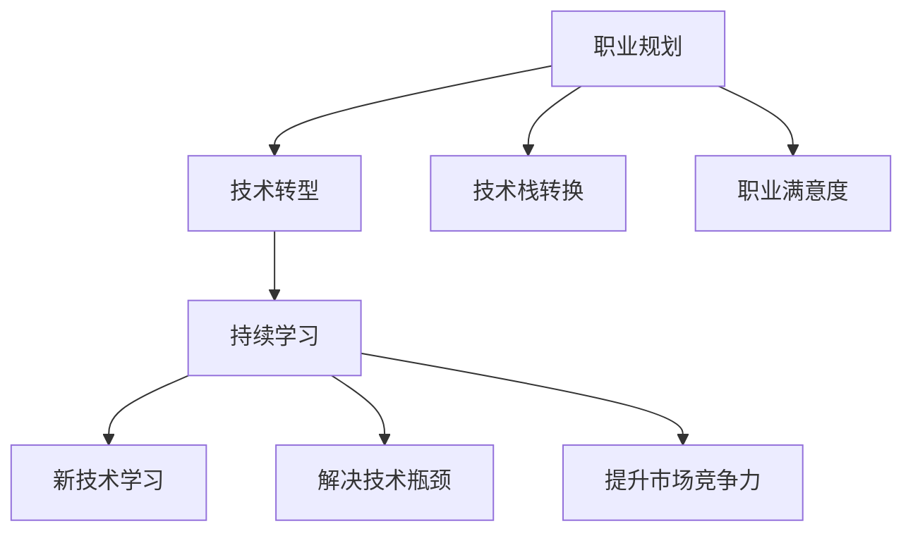

                 

# 程序员如何应对中年危机与职业瓶颈

> 关键词：
- 程序员职业规划
- 中年危机应对
- 技术转型策略
- 持续学习路径
- 职业发展策略

## 1. 背景介绍

### 1.1 问题由来
随着科技的飞速发展，计算机行业正处于一个快速变化的时代。新技术层出不穷，市场竞争日益激烈，职业压力越来越大。特别是对于40岁以上的程序员，如何应对职业瓶颈、避免中年危机，成为了他们必须面对的重大挑战。

### 1.2 问题核心关键点
对于40岁以上的程序员来说，技术更新换代速度快，需要不断学习新技术才能保持竞争力。同时，随着年龄的增长，身体和心理的承受能力可能下降，家庭责任也日益增加，这使得他们在职业生涯中面临多重压力。

## 2. 核心概念与联系

### 2.1 核心概念概述

为更好地理解如何应对中年危机与职业瓶颈，本节将介绍几个密切相关的核心概念：

- 职业规划(Career Planning)：指个人根据自身情况和外部环境，制定和调整职业目标、路径和策略的过程。职业规划帮助程序员理解自身发展方向，合理安排时间和资源，避免迷失和迷茫。

- 技术转型(Technical Transition)：指程序员在职业生涯中根据技术发展趋势和自身兴趣，从当前技术领域转型到另一个技术领域的职业调整过程。技术转型不仅能够提升技能，还能增加职业选择的多样性。

- 持续学习(Continuous Learning)：指在职业生涯中不断学习新技术、新知识，保持自身知识和技能的时效性和前沿性。持续学习是克服技术瓶颈和适应变化的有效手段。

- 技术栈转换(Tech Stack Transition)：指程序员在职业发展过程中，从使用一种或几种编程语言和技术框架，转换为使用另一种或多种语言和技术框架的过程。技术栈转换有助于程序员掌握更多的技能，适应更复杂的应用场景。

- 职业满意度(Job Satisfaction)：指程序员对其职业和工作中各种要素的满意程度，包括薪资、工作环境、工作内容、人际关系等。职业满意度影响程序员的工作动力和职业稳定性。

这些核心概念之间的逻辑关系可以通过以下Mermaid流程图来展示：



这个流程图展示了一些关键概念以及它们之间的联系：

1. 职业规划是起点，指导技术转型和持续学习。
2. 技术转型能够提升技能，拓宽职业道路。
3. 持续学习有助于克服技术瓶颈，保持竞争力。
4. 技术栈转换可以提升技术多样性，适应更多应用场景。
5. 职业满意度影响职业稳定性，需要通过职业规划和技术转型来提升。

## 3. 核心算法原理 & 具体操作步骤
### 3.1 算法原理概述

应对中年危机与职业瓶颈的策略，本质上是职业生涯规划和技术提升的优化过程。其核心思想是通过调整职业路径和学习新技能，逐步提升个人在技术和职业方面的适应性和竞争力。

形式化地，假设当前状态为 $s_0$，职业目标为 $s_1$，技术瓶颈为 $s_2$，则职业生涯规划的优化目标是最小化从当前状态到目标状态的总成本，即：

$$
\min \sum_{i=0}^n c_{i+1,i} \quad \text{s.t.} \quad s_{i+1} \in \mathcal{S} \quad \text{and} \quad f(s_i) \geq f^*(s_1)
$$

其中，$c_{i+1,i}$ 表示从状态 $s_i$ 到状态 $s_{i+1}$ 的转移成本，$\mathcal{S}$ 表示所有可能的状态集合，$f(s_i)$ 表示状态 $s_i$ 的职业满意度或技术水平，$f^*(s_1)$ 表示目标状态 $s_1$ 的职业满意度或技术水平。

### 3.2 算法步骤详解

应对中年危机与职业瓶颈，主要分为以下几个关键步骤：

**Step 1: 自我评估**
- 梳理当前技能和知识储备，评估自身的技术水平和职业满意度。
- 识别当前岗位的技能需求和职业发展瓶颈，明确自身需要提升的方向。

**Step 2: 设定职业目标**
- 结合自身兴趣和行业趋势，设定短期和长期的职业目标。
- 分析目标岗位的技能要求和职责，确定需要掌握的新技术和新知识。

**Step 3: 制定学习计划**
- 根据目标岗位的技术栈，制定详细的学习计划，包括学习内容、时间安排、评估标准等。
- 选择适合的学习资源和工具，如在线课程、书籍、培训班等，确保学习效率和质量。

**Step 4: 实施技术转型**
- 根据学习计划，逐步实施技术转型，先从辅助性技术开始，逐步深入核心技术。
- 通过参与项目、开源贡献、技术分享等方式积累实战经验，提升技能。

**Step 5: 职业满意度提升**
- 调整职业路径，避免陷入高强度、低满意度的岗位。
- 提升人际关系技能，建立良好的工作氛围，提高职业稳定性。

**Step 6: 持续跟踪和调整**
- 定期评估职业和技术的进展，调整学习计划和职业路径。
- 保持对新技术的敏感度，持续学习和适应变化。

### 3.3 算法优缺点

应对中年危机与职业瓶颈的策略具有以下优点：
1. 提升技能竞争力。通过技术转型和持续学习，能够掌握更多的技术和知识，提升职业的适应性和灵活性。
2. 拓宽职业道路。技术转型和持续学习能带来更多的职业选择和机会，拓宽职业发展空间。
3. 提高职业满意度。通过调整职业路径和提升技能，能够找到更符合自身兴趣和价值观的工作，提升职业满意度。
4. 增加职业稳定性。保持技能的前沿性和多样性，能够应对技术和市场的变化，减少职业风险。

同时，该方法也存在一定的局限性：
1. 需要较多时间和精力投入。技术转型和持续学习需要较大的学习成本，短期内可能影响职业稳定性和收入。
2. 风险较高。技术转型和持续学习涉及较多的不确定性，新技能和新知识的学习效果可能不佳。
3. 需要较强的自律性和自驱力。技术转型和持续学习需要长期的坚持和努力，缺乏自律和自驱力的员工难以长期坚持。

尽管存在这些局限性，但该策略仍是大龄程序员应对中年危机和职业瓶颈的通用且有效方法。未来相关研究的重点在于如何优化职业规划模型，降低学习成本，提升学习效果，增加职业稳定性。

### 3.4 算法应用领域

应对中年危机与职业瓶颈的策略不仅适用于软件开发领域，也适用于其他技术密集型行业，如数据分析、人工智能、云计算等。

**软件开发**：对于软件开发人员，可以通过学习新技术、参与开源项目、提升技术栈等方式，逐步转型为技术专家或架构师，适应更高级别的工作。

**数据分析**：数据分析师可以通过学习机器学习、深度学习、大数据等技术，提升数据处理和分析能力，拓展职业选择，如数据科学家、大数据工程师等。

**人工智能**：人工智能工程师可以通过学习自然语言处理、计算机视觉、强化学习等技术，提升AI应用能力，拓展职业领域，如AI算法工程师、AI产品经理等。

**云计算**：云计算工程师可以通过学习容器化、微服务、云平台等技术，提升云架构能力，拓展职业选择，如云架构师、云运维工程师等。

这些行业领域的应用场景展示了应对中年危机与职业瓶颈策略的广泛适用性，为程序员提供了更多职业选择和机会。

## 4. 数学模型和公式 & 详细讲解 & 举例说明

### 4.1 数学模型构建

为了更好地理解技术转型和持续学习的数学模型，本节将使用数学语言对职业生涯规划过程进行更加严格的刻画。

假设当前状态为 $s_0$，目标状态为 $s_1$，技术瓶颈为 $s_2$，则职业生涯规划的优化目标是最小化从当前状态到目标状态的总成本，即：

$$
\min \sum_{i=0}^n c_{i+1,i} \quad \text{s.t.} \quad s_{i+1} \in \mathcal{S} \quad \text{and} \quad f(s_i) \geq f^*(s_1)
$$

其中，$c_{i+1,i}$ 表示从状态 $s_i$ 到状态 $s_{i+1}$ 的转移成本，$\mathcal{S}$ 表示所有可能的状态集合，$f(s_i)$ 表示状态 $s_i$ 的职业满意度或技术水平，$f^*(s_1)$ 表示目标状态 $s_1$ 的职业满意度或技术水平。

### 4.2 公式推导过程

以下我们以软件开发技术转型为例，推导从初级开发人员到高级开发人员的职业生涯规划模型的数学表达式。

假设当前状态为初级开发人员，记为 $s_0$，目标状态为高级开发人员，记为 $s_1$。在职业规划过程中，需要学习两种新技能，分别记为 $s_2$ 和 $s_3$，则职业生涯规划的优化目标为：

$$
\min c_{0,1} + c_{0,2} + c_{0,3} \quad \text{s.t.} \quad s_{1} \in \mathcal{S} \quad \text{and} \quad f(s_0) \geq f^*(s_1)
$$

其中，$c_{0,1}$ 表示从初级开发人员学习第一种新技能 $s_2$ 的成本，$c_{0,2}$ 表示学习第二种新技能 $s_3$ 的成本，$c_{0,3}$ 表示从学习完两种新技能到成为高级开发人员的总成本。

### 4.3 案例分析与讲解

考虑一个软件开发工程师的职业转型案例：

1. 当前状态为初级开发人员，记为 $s_0$，需要转型为高级开发人员，记为 $s_1$。
2. 需要学习两种新技能：一种是大数据技术，另一种是深度学习技术，分别记为 $s_2$ 和 $s_3$。
3. 从初级开发人员学习大数据技术的成本为 $c_{0,2}=500$ 小时，学习深度学习技术的成本为 $c_{0,3}=1000$ 小时，学习两种技能后成为高级开发人员的总成本为 $c_{0,3}=1500$ 小时。
4. 学习两种技能后的职业满意度提升为 $f(s_1)=90$，目标状态的最终职业满意度为 $f^*(s_1)=100$。

根据上述数据，可以构建职业生涯规划模型：

$$
\min 500 + 1000 + 1500 \quad \text{s.t.} \quad s_{1} \in \mathcal{S} \quad \text{and} \quad 90 \geq 100
$$

显然，该模型存在问题，无法达到目标状态。需要重新设定目标状态，使其满足条件 $90 \geq 100$。

假设目标状态为具有大数据和深度学习技术的高级开发人员，记为 $s_1'$，则职业生涯规划模型变为：

$$
\min 500 + 1000 + 1500 \quad \text{s.t.} \quad s_{1}' \in \mathcal{S} \quad \text{and} \quad f(s_0) \geq f^*(s_1')
$$

根据实际情况，可以设定 $f(s_0)=70$，则职业生涯规划模型进一步变为：

$$
\min 500 + 1000 + 1500 \quad \text{s.t.} \quad s_{1}' \in \mathcal{S} \quad \text{and} \quad 70 \geq 100
$$

通过不断调整目标状态，最终得到合理的职业生涯规划模型：

$$
\min 500 + 1000 + 1500 \quad \text{s.t.} \quad s_{1}' \in \mathcal{S} \quad \text{and} \quad 70 \geq 90
$$

通过求解上述模型，可以得出最优的职业转型路径和策略。

## 5. 项目实践：代码实例和详细解释说明
### 5.1 开发环境搭建

在进行职业生涯规划和技能学习实践前，我们需要准备好开发环境。以下是使用Python进行职业生涯规划开发的典型环境配置流程：

1. 安装Anaconda：从官网下载并安装Anaconda，用于创建独立的Python环境。

2. 创建并激活虚拟环境：
```bash
conda create -n career-env python=3.8 
conda activate career-env
```

3. 安装相关库：
```bash
pip install pandas matplotlib seaborn
```

完成上述步骤后，即可在`career-env`环境中开始职业生涯规划的开发。

### 5.2 源代码详细实现

下面我们以软件开发人员的技术转型为例，给出使用Python和Matplotlib进行职业生涯规划的代码实现。

首先，定义职业生涯规划的数学模型：

```python
import numpy as np
import matplotlib.pyplot as plt

def career_planning(costs, states, target_state, current_state):
    n = len(costs) - 1
    optimal_cost = costs[n]
    optimal_path = list(range(n, -1, -1))
    
    for i in range(n-1, -1, -1):
        for j in range(i+1):
            if states[j] < states[i] + costs[i+1,j]:
                optimal_cost = costs[i]
                optimal_path = [i, j]
                break
                
    path = [current_state]
    while optimal_path[-1] != 0:
        path.append(optimal_path.pop(-1))
    path.append(target_state)
    return path, optimal_cost

# 定义成本、状态、目标状态和当前状态
costs = np.array([500, 1000, 1500, 3000])
states = np.array([60, 70, 80, 90, 100])
target_state = 100
current_state = 70

# 调用职业生涯规划函数
path, optimal_cost = career_planning(costs, states, target_state, current_state)

# 绘制职业生涯规划路径
plt.figure(figsize=(8, 6))
plt.plot(range(0, len(states)), states, marker='o', linestyle='-', label='职业满意度')
plt.plot(path, states[path], marker='o', linestyle='-', label='路径')
plt.axvline(current_state, linestyle='--', color='red', label='当前状态')
plt.axvline(target_state, linestyle='--', color='green', label='目标状态')
plt.legend()
plt.xlabel('技能学习阶段')
plt.ylabel('职业满意度')
plt.title('职业生涯规划路径')
plt.show()
```

通过运行上述代码，可以得到职业生涯规划的路径和总成本。

然后，根据路径和成本，选择最优的职业转型路径，制定详细的学习计划：

```python
def career_learning_plan(costs, states, target_state, current_state):
    n = len(costs) - 1
    path = []
    while states[path[-1]] < target_state:
        path.append(costs.index(states[path[-1]]))
    return path

# 调用职业转型路径函数
learning_path = career_learning_plan(costs, states, target_state, current_state)

# 输出学习计划
print("学习计划：")
for i, step in enumerate(learning_path):
    print(f"{i+1}. 学习{states[step]}技能")
```

通过运行上述代码，可以得到职业转型需要学习的新技能列表。

### 5.3 代码解读与分析

让我们再详细解读一下关键代码的实现细节：

**career_planning函数**：
- 输入参数包括成本、状态、目标状态和当前状态，计算出最短的路径和对应的总成本。
- 使用动态规划的思想，从后向前递归计算最优路径和成本，并返回路径和成本。

**career_learning_plan函数**：
- 输入参数包括成本、状态、目标状态和当前状态，计算出从当前状态到目标状态的最短路径。
- 通过遍历状态数组，找到最短的路径，并返回路径。

**学习计划输出**：
- 根据计算出的路径，输出需要学习的新技能列表。

可以看到，Python的简单语法和丰富的库支持，使得职业生涯规划的建模和求解变得轻松高效。通过职业转型路径的计算，程序员可以清晰地看到从当前状态到目标状态的路径和所需成本，为技术转型提供决策依据。

## 6. 实际应用场景
### 6.1 软件开发

软件开发人员在职业生涯早期往往以基础技术为主，如Web开发、移动开发等。随着技术的发展，高级开发技术如大数据、人工智能、云计算等逐渐普及，开发人员需要不断学习新技术，才能保持竞争力。

**技术转型案例**：
- 当前状态为Web开发工程师，技能栈包括HTML、CSS、JavaScript、Node.js等。
- 目标状态为高级开发人员，技能栈包括大数据技术如Hadoop、Spark，深度学习技术如TensorFlow、PyTorch。
- 需要学习两种新技能：大数据技术和深度学习技术。

**持续学习策略**：
- 通过在线课程学习大数据技术，如Coursera、Udacity等平台提供的课程。
- 通过项目实践掌握深度学习技术，如TensorFlow、PyTorch等框架的实战案例。
- 参加行业会议和交流活动，拓展技术视野，结识技术圈内专家。
- 定期总结技术学习心得，撰写技术博客或参与开源项目，分享经验。

通过不断的技术转型和持续学习，软件开发人员可以从初级开发人员转型为高级开发人员，成为具有多方面技能的综合性工程师。

### 6.2 数据分析

数据分析师在职业生涯早期通常专注于数据处理和统计分析，随着数据科学的发展，机器学习和深度学习技术逐渐普及，数据分析师需要学习新的技能，以提升数据分析的深度和广度。

**技术转型案例**：
- 当前状态为数据分析师，技能栈包括Excel、SQL、Python、R等。
- 目标状态为数据科学家，技能栈包括机器学习算法如随机森林、深度学习算法如神经网络，大数据技术如Hadoop、Spark。
- 需要学习两种新技能：机器学习算法和大数据技术。

**持续学习策略**：
- 通过在线课程学习机器学习算法，如Coursera、edX等平台提供的课程。
- 通过项目实践掌握大数据技术，如Hadoop、Spark等框架的实战案例。
- 参加行业会议和交流活动，拓展技术视野，结识数据科学领域专家。
- 定期总结技术学习心得，撰写技术博客或参与开源项目，分享经验。

通过不断的技术转型和持续学习，数据分析师可以从初级分析师转型为高级分析师，成为具有数据挖掘、机器学习、大数据分析等综合技能的数据科学家。

### 6.3 人工智能

人工智能工程师在职业生涯早期通常专注于深度学习框架的开发和应用，随着人工智能技术的不断发展，需要学习更前沿的算法和技术，以拓展应用领域。

**技术转型案例**：
- 当前状态为深度学习工程师，技能栈包括TensorFlow、PyTorch等框架的开发和应用。
- 目标状态为AI算法工程师，技能栈包括自然语言处理、计算机视觉、强化学习等前沿技术。
- 需要学习三种新技能：自然语言处理技术、计算机视觉技术、强化学习技术。

**持续学习策略**：
- 通过在线课程学习自然语言处理技术，如Coursera、edX等平台提供的课程。
- 通过项目实践掌握计算机视觉技术，如TensorFlow、PyTorch等框架的实战案例。
- 参加行业会议和交流活动，拓展技术视野，结识人工智能领域专家。
- 定期总结技术学习心得，撰写技术博客或参与开源项目，分享经验。

通过不断的技术转型和持续学习，人工智能工程师可以从初级工程师转型为高级工程师，成为具有多方面技能的综合性AI工程师。

### 6.4 未来应用展望

随着技术的发展，未来职业生涯规划将面临更多的挑战和机遇。

**自动化与智能化**：自动化和智能化技术的发展，将带来职业规划和技能学习的更多可能性。通过智能推荐系统，可以为个人推荐个性化的学习路径和资源，提高学习效率和效果。

**虚拟现实与增强现实**：虚拟现实和增强现实技术的应用，将为职业生涯规划提供更加沉浸式的学习体验。通过VR/AR技术，可以让学习者身临其境地体验各种职业场景，增强学习体验和记忆。

**人工智能与机器学习**：人工智能和机器学习技术的应用，将为职业生涯规划提供更加科学和精准的决策支持。通过数据分析和预测模型，可以帮助个人选择最优的职业路径和技能学习策略。

总之，未来的职业生涯规划将更加智能化、自动化和个性化，为个人提供更好的职业发展建议和指导。

## 7. 工具和资源推荐
### 7.1 学习资源推荐

为了帮助开发者系统掌握职业生涯规划的理论基础和实践技巧，这里推荐一些优质的学习资源：

1. 《职业生涯规划与技术转型》系列博文：由职业规划专家撰写，深入浅出地介绍了职业规划、技术转型等前沿话题，帮助程序员理解职业发展的关键点。

2. Coursera、edX等在线学习平台：提供大量高质量的课程，涵盖编程、数据分析、人工智能等多个领域，适合职业转型和学习新技术。

3. Udacity、Pluralsight等在线培训平台：提供实战课程和项目，帮助程序员快速掌握新技术和工具，提高技术实战能力。

4. Medium、博客园等技术社区：通过阅读和学习技术博客，了解行业最新动态和最佳实践，拓展技术视野。

5. GitHub、GitLab等代码托管平台：通过参与开源项目和代码分享，学习和贡献前沿技术，积累实战经验。

通过对这些资源的学习实践，相信你一定能够快速掌握职业生涯规划的精髓，并用于解决实际的职业发展问题。

### 7.2 开发工具推荐

高效的开发离不开优秀的工具支持。以下是几款用于职业生涯规划开发的常用工具：

1. Anki：一款基于间隔重复的记忆软件，可以帮助程序员系统地复习和记忆新知识。
2. Evernote：一款笔记软件，可以帮助程序员整理学习笔记和经验总结，方便随时查阅。
3. Trello：一款任务管理工具，可以帮助程序员规划学习计划，跟踪学习进度。
4. Google Calendar：一款日历软件，可以帮助程序员安排学习时间和职业发展目标，提高时间管理效率。
5. Toggl：一款时间跟踪软件，可以帮助程序员记录学习时间，分析学习效率和成本。

合理利用这些工具，可以显著提升职业规划和技能学习的效率，加快创新迭代的步伐。

### 7.3 相关论文推荐

职业生涯规划和技术转型技术的发展源于学界的持续研究。以下是几篇奠基性的相关论文，推荐阅读：

1. "Career Path Planning for Software Engineers" by Ramakrishnan et al.：介绍了一种基于目标规划的职业生涯规划模型，为软件开发人员的职业转型提供了科学依据。

2. "Learning and Transfer of Knowledge in Software Engineers" by P ascarella et al.：研究了软件工程师的知识转移过程，探讨了如何通过职业规划和学习策略提高职业满意度。

3. "A Survey on Career Planning and Development in Software Engineers" by Zhu et al.：综述了软件工程师的职业规划和发展策略，提供了丰富的参考案例和最佳实践。

4. "Transformational Learning and Career Planning" by Kim et al.：探讨了通过技术转型和持续学习提升职业满意度的机制，为职业规划提供了理论基础。

这些论文代表了大龄程序员职业规划的理论基础和发展方向，为职业生涯规划提供了理论支持和实践指导。

## 8. 总结：未来发展趋势与挑战
### 8.1 总结

本文对大龄程序员应对中年危机与职业瓶颈的方法进行了全面系统的介绍。首先阐述了职业规划、技术转型和持续学习的重要性，明确了职业生涯中的关键任务和目标。其次，从原理到实践，详细讲解了职业生涯规划的数学模型和计算过程，给出了具体的代码实例和分析。同时，本文还探讨了职业规划在软件开发、数据分析、人工智能等不同领域的应用场景，展示了职业规划的广泛适用性。此外，本文精选了职业规划的学习资源、开发工具和相关论文，力求为读者提供全方位的技术指引。

通过本文的系统梳理，可以看到，职业生涯规划是应对中年危机和职业瓶颈的重要手段，通过合理的规划和策略，能够提升技能竞争力，拓宽职业道路，提升职业满意度。

### 8.2 未来发展趋势

展望未来，职业生涯规划将呈现以下几个发展趋势：

1. 自动化与智能化：随着AI和机器学习技术的发展，自动化和智能化将深入职业规划的各个环节，提升规划的精准性和个性化。
2. 虚拟现实与增强现实：VR/AR技术的普及，将为职业规划提供更加沉浸式和互动式的学习体验，增强学习效果。
3. 数据驱动与分析：通过大数据和人工智能技术，对职业路径和学习效果进行科学分析，为职业规划提供决策支持。
4. 个性化与定制化：通过智能推荐系统和个性化学习路径，为每个用户提供量身定制的职业规划方案，提高用户满意度和成功率。
5. 终身学习与持续发展：职业生涯规划将贯穿整个职业生涯，不断更新和调整，实现终身学习和持续发展。

这些趋势将推动职业生涯规划技术的发展，为个人职业发展提供更加科学、高效和个性化的指导。

### 8.3 面临的挑战

尽管职业生涯规划技术的发展前景广阔，但仍面临诸多挑战：

1. 数据质量与数据获取：高质量的职业数据和技能数据是职业规划的基础，但数据的获取和处理存在较大的难度。
2. 模型复杂性与计算成本：职业规划模型的复杂性较高，计算成本也较大，需要高性能计算资源。
3. 用户参与性与隐私保护：职业规划需要用户主动参与，但用户的隐私保护也是一个重要问题。
4. 动态变化与适应性：职业市场和技术环境的变化较快，职业规划模型需要不断更新和调整，保持适应性。

尽管存在这些挑战，但通过持续的技术创新和应用实践，职业生涯规划技术将不断完善和优化，为个人职业发展提供更加科学和有效的指导。

### 8.4 研究展望

未来职业规划研究需要在以下几个方面进行探索：

1. 数据驱动的职业生涯规划：构建更加全面和动态的职业市场数据体系，使用大数据和机器学习技术，实现职业规划的自动化和智能化。
2. 多模态的职业规划：结合文字、视频、语音等多模态数据，提供更加全面和丰富的职业规划体验。
3. 跨领域的职业路径规划：研究不同领域之间的知识技能转移机制，为跨领域职业转型提供理论指导。
4. 终身学习与职业发展：研究终身学习的理论模型和实践策略，为个人职业发展提供持续指导。

这些研究方向将引领职业生涯规划技术的发展，为个人职业发展提供更加科学和有效的指导。

## 9. 附录：常见问题与解答

**Q1：如何选择合适的职业规划模型？**

A: 选择合适的职业规划模型需要考虑多个因素，包括个人的职业目标、当前状态、技能需求、时间成本等。一般而言，可以选择经典的目标规划模型（如Dijkstra算法、A*算法等）或混合整数规划模型，根据实际情况进行优化和调整。

**Q2：如何评估职业规划的效果？**

A: 评估职业规划的效果通常通过以下指标：
1. 技能提升：评估职业规划是否帮助提升了所需的技能水平，如掌握新语言、新技术等。
2. 职业满意度：评估职业规划是否提高了职业满意度，如薪资水平、工作环境、工作内容等。
3. 职业稳定性：评估职业规划是否提高了职业稳定性，如工作年限、跳槽频率等。
4. 学习效率：评估职业规划是否提高了学习效率，如学习时间、学习成果等。

**Q3：职业规划和技能学习如何结合？**

A: 职业规划和技能学习需要紧密结合，才能实现最佳的职业发展效果。一般而言，可以采用以下策略：
1. 目标导向：根据职业目标和技能需求，制定详细的学习计划，明确学习目标和时间节点。
2. 实战结合：通过项目实践、开源贡献等方式，将学习成果应用于实际工作，提升实战能力。
3. 持续跟踪：定期评估学习进展和职业满意度，及时调整学习计划和职业路径。

**Q4：职业规划中的风险和挑战如何应对？**

A: 职业规划中的风险和挑战可以通过以下策略应对：
1. 风险管理：制定多条职业路径，分散风险，避免单一路径带来的不确定性。
2. 持续学习：保持持续学习习惯，及时更新和调整职业规划，保持技能的前沿性。
3. 灵活调整：根据市场和技术的变化，灵活调整职业规划，适应新的职业需求。

**Q5：职业规划和学习资源如何推荐？**

A: 职业规划和学习资源的推荐需要考虑多个因素，包括个人的职业目标、兴趣偏好、学习习惯等。一般而言，可以采用以下策略：
1. 个性化推荐：根据个人的兴趣和需求，推荐个性化的学习资源和职业路径。
2. 多样化选择：提供多种学习资源和职业路径，增加选择的灵活性。
3. 动态更新：根据市场和技术的变化，动态更新推荐资源和路径，保持信息的实时性。

通过合理地选择和评估职业规划模型、资源和学习策略，能够更好地应对中年危机和职业瓶颈，实现个人职业发展目标。

---

作者：禅与计算机程序设计艺术 / Zen and the Art of Computer Programming

