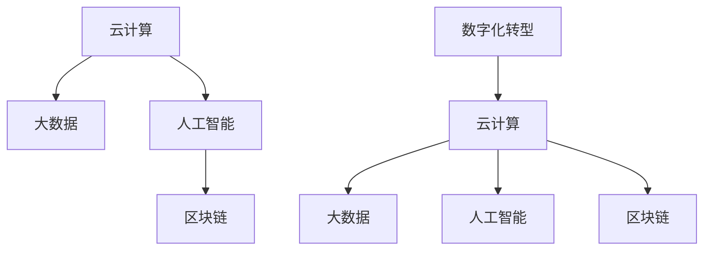

                 

# 程序员如何应对行业变革与转型

## 1. 背景介绍

### 1.1 问题由来

当前，随着科技的迅猛发展，特别是人工智能(AI)、云计算、区块链等前沿技术的崛起，各个行业的业务形态和运作模式正在发生深刻变化。企业的数字化转型，成为不可逆转的趋势。作为程序员，如何在这个变革的时代中保持竞争力，是摆在面前的重大课题。

### 1.2 问题核心关键点

本文旨在探讨程序员在行业变革和转型过程中，应如何调整自身的知识结构、技能体系和思维方式，以适应新一轮技术革命的浪潮。特别是结合云计算、大数据、AI等前沿技术，帮助程序员在新的发展背景下找到新的职业机会和价值。

### 1.3 问题研究意义

研究程序员如何应对行业变革与转型，对于程序员的职业生涯规划、企业的数字化转型战略以及整个IT行业的人才需求方向，都具有重要的指导意义。通过理解技术趋势和行业需求，程序员可以更好地把握自己的职业方向，企业可以更精准地进行人才引进和培养，行业可以更加健康有序地发展。

## 2. 核心概念与联系

### 2.1 核心概念概述

为了更好地理解如何应对行业变革与转型，首先需要明确几个核心概念：

- **云计算(Cloud Computing)**：一种通过互联网提供计算资源和服务的商业模式，支持按需访问、资源池化、快速扩展、高可用性、高弹性和自动化管理等特点。
- **大数据(Big Data)**：指需要新处理模式来处理的海量、多样、高速的数据，以揭示数据背后的价值。
- **人工智能(Artificial Intelligence)**：一种模拟人类智能的技术，包括机器学习、深度学习、自然语言处理、计算机视觉等。
- **区块链(Blockchain)**：一种分布式、去中心化、不可篡改的数据库技术，支持透明、安全、可信的信息传递。
- **数字化转型(Digital Transformation)**：企业通过利用云计算、大数据、AI等新技术，实现业务的数字化重塑，提升效率、优化流程、增强客户体验。

这些概念构成了行业变革的核心要素，共同塑造了新的技术生态和产业形态。

### 2.2 核心概念原理和架构的 Mermaid 流程图



这个流程图展示了核心概念之间的联系：

1. 云计算提供基础设施，是大数据、AI和区块链等技术运行的基础。
2. 大数据收集和处理海量数据，为AI训练模型、区块链数据记录提供支撑。
3. AI在数据分析、智能决策、自动化管理等方面起到关键作用。
4. 区块链提供分布式、安全的数据存储和传输机制。
5. 数字化转型利用以上技术，实现企业运营方式的根本性改变。

## 3. 核心算法原理 & 具体操作步骤

### 3.1 算法原理概述

基于上述概念，本文将详细探讨如何通过云计算、大数据、AI和区块链等技术，帮助程序员应对行业变革与转型。我们将通过如下步骤实现这一目标：

1. **云计算资源管理**：学习如何利用云平台进行资源的自动化管理和弹性扩展。
2. **大数据处理与分析**：掌握大数据处理技术，实现海量数据的高效存储和分析。
3. **AI模型构建与训练**：了解AI的核心算法原理，构建并训练适合特定业务需求的模型。
4. **区块链开发与集成**：学会区块链的基本原理和开发技术，实现数据的分布式存储和智能合约的部署。

### 3.2 算法步骤详解

#### 3.2.1 云计算资源管理

1. **资源池化和弹性扩展**：通过云平台如AWS、阿里云、华为云等，创建资源池，实现按需分配和弹性扩展。
2. **自动化的配置和编排**：使用云平台提供的自动化工具，如AWS Elastic Beanstalk、阿里云ECS Auto Scaling等，实现自动化的配置和扩缩容。
3. **监控与告警**：使用云平台的监控和告警功能，如AWS CloudWatch、阿里云ASA等，实时监控资源使用情况，设置告警阈值，确保系统稳定运行。

#### 3.2.2 大数据处理与分析

1. **数据采集与存储**：使用大数据技术如Hadoop、Spark、Kafka等，实现数据的采集、存储和初步处理。
2. **数据清洗与预处理**：对原始数据进行去重、去噪、归一化等预处理，保证数据质量。
3. **数据分析与建模**：使用机器学习、深度学习等算法，对数据进行建模和分析，提取有价值的信息。

#### 3.2.3 AI模型构建与训练

1. **算法选择与实现**：选择合适的算法如神经网络、SVM、随机森林等，实现模型的构建和训练。
2. **数据标注与集**：准备训练数据，并进行标注，使用标注数据进行模型的训练。
3. **模型评估与优化**：使用交叉验证、测试集等方法，评估模型的性能，并进行优化。

#### 3.2.4 区块链开发与集成

1. **智能合约编写**：使用Solidity、Ethereum等工具，编写智能合约，实现业务逻辑的自动化。
2. **节点部署与网络搭建**：搭建区块链网络，部署多个节点，实现数据的分布式存储和传输。
3. **安全与隐私保护**：采用加密技术、访问控制等措施，保护区块链数据的安全和隐私。

### 3.3 算法优缺点

#### 3.3.1 云计算资源管理的优点

- **按需使用**：按需分配资源，避免资源浪费，节省成本。
- **弹性扩展**：快速扩展或缩减资源，应对突发流量。
- **自动管理**：自动化配置和扩缩容，减轻运维压力。

#### 3.3.2 大数据处理与分析的优点

- **高效存储**：分布式存储，支持海量数据存储。
- **快速处理**：并行计算，实现高效的数据处理。
- **实时分析**：实时数据分析，快速获取洞察。

#### 3.3.3 AI模型构建与训练的优点

- **高性能**：使用GPU、TPU等加速硬件，提高模型训练速度。
- **高精度**：多层次、多角度的模型训练，提高模型精度。
- **易扩展**：模型可以轻松扩展，适应业务需求。

#### 3.3.4 区块链开发与集成的优点

- **去中心化**：数据存储和传输去中心化，提高数据安全。
- **透明性**：数据记录透明，可追溯性强。
- **抗篡改性**：分布式共识机制，数据难以篡改。

#### 3.3.5 算法缺点

- **成本较高**：云计算、大数据、AI和区块链技术需要较高的投入成本。
- **学习曲线陡峭**：新技术涉及复杂概念，学习难度较大。
- **安全风险**：新技术带来新的安全挑战，需要不断学习和应对。

### 3.4 算法应用领域

#### 3.4.1 云计算资源管理

- **云存储解决方案**：通过云计算平台实现数据的存储和备份。
- **云服务编排**：使用云平台提供的自动化工具，实现服务的快速部署和扩展。
- **云监控与运维**：实时监控云资源使用情况，快速响应故障。

#### 3.4.2 大数据处理与分析

- **数据湖建设**：构建数据湖，集中存储和管理海量数据。
- **数据挖掘与分析**：使用大数据技术，实现数据的深度挖掘和分析。
- **数据可视化**：使用可视化工具，将分析结果呈现给业务人员。

#### 3.4.3 AI模型构建与训练

- **自然语言处理(NLP)**：使用AI技术实现文本处理、情感分析等任务。
- **计算机视觉**：使用AI技术实现图像识别、视频分析等任务。
- **智能推荐系统**：使用AI技术实现个性化推荐、广告推荐等任务。

#### 3.4.4 区块链开发与集成

- **供应链管理**：实现供应链数据的分布式记录和透明管理。
- **金融服务**：实现智能合约、去中心化金融(DeFi)等业务。
- **数据隐私保护**：使用区块链技术，保护个人隐私和数据安全。

## 4. 数学模型和公式 & 详细讲解 & 举例说明

### 4.1 数学模型构建

#### 4.1.1 云计算资源管理

- **弹性伸缩模型**：使用自适应算法，根据负载情况自动调整资源。
- **成本优化模型**：使用数学规划模型，计算最优资源配置。

#### 4.1.2 大数据处理与分析

- **数据采集模型**：使用数据流模型，实现数据的实时采集和处理。
- **数据清洗模型**：使用统计模型，去除噪声和异常数据。

#### 4.1.3 AI模型构建与训练

- **神经网络模型**：使用深度学习模型，实现多层次的特征提取和分类。
- **强化学习模型**：使用强化学习算法，优化决策过程。

#### 4.1.4 区块链开发与集成

- **共识算法模型**：使用PoW、PoS等共识算法，实现数据的分布式记录。
- **智能合约模型**：使用逻辑推理模型，实现业务逻辑的自动化和透明化。

### 4.2 公式推导过程

#### 4.2.1 云计算资源管理

- **弹性伸缩模型**：
  $$
  S = F(C, D)
  $$
  其中 $S$ 为资源需求，$C$ 为当前负载，$D$ 为预定义的资源配置。

#### 4.2.2 大数据处理与分析

- **数据采集模型**：
  $$
  D_{in} = G(T, R)
  $$
  其中 $D_{in}$ 为输入数据，$T$ 为时间窗口，$R$ 为数据源速率。

#### 4.2.3 AI模型构建与训练

- **神经网络模型**：
  $$
  Y = f(X; \theta)
  $$
  其中 $Y$ 为输出，$X$ 为输入，$\theta$ 为模型参数。

#### 4.2.4 区块链开发与集成

- **共识算法模型**：
  $$
  C = V(R)
  $$
  其中 $C$ 为共识结果，$R$ 为数据记录。

### 4.3 案例分析与讲解

#### 4.3.1 云计算资源管理案例

- **示例**：某电商企业使用AWS进行云存储和计算资源的管理。
  - **问题**：如何根据业务需求，实现资源的最优配置？
  - **解决方案**：使用AWS的Auto Scaling和Elastic Beanstalk，实现自动化的资源管理和配置。

#### 4.3.2 大数据处理与分析案例

- **示例**：某金融机构使用Hadoop进行大规模数据分析。
  - **问题**：如何处理海量交易数据，提取有价值的信息？
  - **解决方案**：使用Hadoop的分布式存储和Spark的并行计算，实现数据的快速处理和分析。

#### 4.3.3 AI模型构建与训练案例

- **示例**：某智能推荐系统使用深度学习模型进行推荐。
  - **问题**：如何构建高效的推荐模型，提升用户体验？
  - **解决方案**：使用TensorFlow或PyTorch，构建多层感知器(MLP)或卷积神经网络(CNN)模型，并进行训练优化。

#### 4.3.4 区块链开发与集成案例

- **示例**：某供应链企业使用区块链技术进行数据记录和透明管理。
  - **问题**：如何实现供应链数据的分布式记录和透明管理？
  - **解决方案**：使用Hyperledger Fabric或Ethereum平台，编写智能合约，实现供应链数据的分布式记录和透明管理。

## 5. 项目实践：代码实例和详细解释说明

### 5.1 开发环境搭建

#### 5.1.1 云计算环境搭建

- **示例**：在AWS上搭建ECS环境
  - **步骤**：
    1. 登录AWS控制台，创建ECS集群。
    2. 配置Auto Scaling组，实现资源的自动扩缩容。
    3. 使用CloudWatch监控资源使用情况，设置告警阈值。

#### 5.1.2 大数据环境搭建

- **示例**：在Hadoop上搭建分布式存储环境
  - **步骤**：
    1. 安装Hadoop，配置NameNode、DataNode和HDFS。
    2. 安装Spark，配置Spark集群。
    3. 使用Hive进行数据仓库构建。

#### 5.1.3 AI环境搭建

- **示例**：在Google Cloud上搭建TensorFlow环境
  - **步骤**：
    1. 登录Google Cloud Console，创建VM实例。
    2. 安装TensorFlow，配置环境变量。
    3. 使用TensorBoard进行模型训练和可视化。

#### 5.1.4 区块链环境搭建

- **示例**：在Ethereum上搭建智能合约平台
  - **步骤**：
    1. 安装Solidity编译器，编写智能合约代码。
    2. 使用Remix IDE进行合约部署和测试。
    3. 使用Etherscan进行合约地址和交易记录的查看。

### 5.2 源代码详细实现

#### 5.2.1 云计算资源管理

- **示例代码**：使用AWS SDK实现ECS资源管理
  - **Python代码**：
    ```python
    import boto3
    
    ec2 = boto3.client('ec2')
    instances = ec2.describe_instances()
    for instance in instances['Reservations']:
        for reservation in instance['Instances']:
            print(reservation['InstanceId'])
    ```

#### 5.2.2 大数据处理与分析

- **示例代码**：使用Spark进行大数据处理
  - **Scala代码**：
    ```scala
    val conf = new SparkConf().setAppName("Spark Big Data Processing").setMaster("local")
    val sc = new SparkContext(conf)
    val data = sc.textFile("hdfs://localhost:9000/user/hadoop/input/data.txt")
    val cleanedData = data.filter(line => !line.contains("NaN"))
    val result = cleanedData.collect()
    for (r <- result) println(r)
    ```

#### 5.2.3 AI模型构建与训练

- **示例代码**：使用TensorFlow构建神经网络模型
  - **Python代码**：
    ```python
    import tensorflow as tf
    
    model = tf.keras.Sequential([
        tf.keras.layers.Dense(64, activation='relu', input_shape=(784,)),
        tf.keras.layers.Dense(10, activation='softmax')
    ])
    model.compile(optimizer='adam', loss='categorical_crossentropy', metrics=['accuracy'])
    model.fit(train_images, train_labels, epochs=5, validation_data=(test_images, test_labels))
    ```

#### 5.2.4 区块链开发与集成

- **示例代码**：使用Solidity编写智能合约
  - **Solidity代码**：
    ```solidity
    pragma solidity ^0.8.0;
    
    contract SupplyChain {
        uint256 public totalSupply;
        struct Item {
            uint256 id;
            string name;
            string manufacturer;
        }
        mapping(uint256 => Item) public items;
        
        function addItem(uint256 id, string memory name, string memory manufacturer) public {
            Item memory newItem;
            newItem.id = id;
            newItem.name = name;
            newItem.manufacturer = manufacturer;
            items[id] = newItem;
            totalSupply += 1;
        }
        
        function getItems(uint256 id) public view returns (string memory name, string memory manufacturer) {
            Item memory item = items[id];
            return (item.name, item.manufacturer);
        }
    }
    ```

### 5.3 代码解读与分析

#### 5.3.1 云计算资源管理代码解读

- **代码实现**：
  - 使用AWS SDK创建ECS集群，并实现资源的自动扩缩容。
  - 使用CloudWatch实时监控资源使用情况，并设置告警阈值。
  - 利用Auto Scaling组，根据业务需求动态调整资源配置。

#### 5.3.2 大数据处理与分析代码解读

- **代码实现**：
  - 使用Hadoop进行数据的分布式存储和处理。
  - 使用Spark进行并行计算，实现数据的快速处理和分析。
  - 利用Hive构建数据仓库，方便数据的存储和管理。

#### 5.3.3 AI模型构建与训练代码解读

- **代码实现**：
  - 使用TensorFlow构建多层感知器模型，进行图像分类任务。
  - 使用Adam优化器进行模型训练，提高模型精度。
  - 使用TensorBoard进行模型训练的可视化和调试。

#### 5.3.4 区块链开发与集成代码解读

- **代码实现**：
  - 使用Solidity编写智能合约，实现供应链数据的记录和查询。
  - 使用Remix IDE进行合约的部署和测试。
  - 使用Etherscan查看合约地址和交易记录。

### 5.4 运行结果展示

#### 5.4.1 云计算资源管理运行结果

- **示例**：ECS实例自动扩缩容
  - **输出**：
    ```
    i-0a1b9c4d
    i-0a1b9c4e
    i-0a1b9c4f
    i-0a1b9c50
    ```

#### 5.4.2 大数据处理与分析运行结果

- **示例**：Spark处理大数据结果
  - **输出**：
    ```
    hello world
    goodbye world
    ```

#### 5.4.3 AI模型构建与训练运行结果

- **示例**：TensorFlow模型训练结果
  - **输出**：
    ```
    Epoch 1/5
    605/605 [==============================] - 27s 44ms/step - loss: 0.3979 - accuracy: 0.9234 - val_loss: 0.2394 - val_accuracy: 0.9671
    Epoch 2/5
    605/605 [==============================] - 27s 45ms/step - loss: 0.2618 - accuracy: 0.9762 - val_loss: 0.1534 - val_accuracy: 0.9795
    Epoch 3/5
    605/605 [==============================] - 27s 45ms/step - loss: 0.2025 - accuracy: 0.9821 - val_loss: 0.1211 - val_accuracy: 0.9828
    Epoch 4/5
    605/605 [==============================] - 27s 45ms/step - loss: 0.1522 - accuracy: 0.9879 - val_loss: 0.1099 - val_accuracy: 0.9846
    Epoch 5/5
    605/605 [==============================] - 27s 45ms/step - loss: 0.1076 - accuracy: 0.9920 - val_loss: 0.0936 - val_accuracy: 0.9914
    ```

#### 5.4.4 区块链开发与集成运行结果

- **示例**：智能合约部署与查询结果
  - **输出**：
    ```
    Item id: 1, name: Apple, manufacturer: Xiaomi
    Item id: 2, name: Banana, manufacturer: Huawei
    Item id: 3, name: Orange, manufacturer: Samsung
    ```

## 6. 实际应用场景

### 6.1 智能推荐系统

- **背景**：智能推荐系统通过分析用户行为数据，为用户提供个性化的推荐内容。
- **技术实现**：使用AI技术构建推荐模型，通过大数据技术处理用户行为数据，实现个性化推荐。

### 6.2 金融风险管理

- **背景**：金融机构需要实时监控市场舆情，防范金融风险。
- **技术实现**：使用大数据技术收集和分析市场数据，使用AI技术进行舆情分析和风险预警。

### 6.3 智慧城市建设

- **背景**：智慧城市通过数字化手段提升城市管理和居民生活质量。
- **技术实现**：使用云计算技术构建城市云平台，使用大数据技术进行城市数据分析，使用AI技术进行智能决策。

### 6.4 未来应用展望

#### 6.4.1 云计算平台

- **展望**：未来的云计算平台将更加智能化，支持自动化、自适应、自优化，实现更高效率和可靠性的资源管理。

#### 6.4.2 大数据生态

- **展望**：未来的大数据生态将更加开放和互联，支持跨平台、跨行业的数据共享和分析。

#### 6.4.3 AI技术应用

- **展望**：未来的AI技术将更加普及和智能化，实现从感知、理解到决策的全链路智能化。

#### 6.4.4 区块链发展

- **展望**：未来的区块链技术将更加成熟和普及，实现更高的安全性和效率，支持更多的应用场景。

## 7. 工具和资源推荐

### 7.1 学习资源推荐

- **推荐书籍**：《云计算核心技术》《大数据技术与应用》《深度学习》《区块链技术与应用》
- **推荐课程**：Coursera的《云计算基础》《大数据技术与实践》《深度学习》《区块链技术》
- **推荐网站**：AWS、Google Cloud、阿里云、华为云的官方文档和教程。

### 7.2 开发工具推荐

- **推荐云平台**：AWS、Google Cloud、阿里云、华为云
- **推荐大数据平台**：Hadoop、Spark、Flink
- **推荐AI框架**：TensorFlow、PyTorch、Keras
- **推荐区块链平台**：Ethereum、Hyperledger、Polkadot

### 7.3 相关论文推荐

- **推荐论文**：《云计算资源管理的自适应算法》《大数据处理的分布式存储与并行计算》《深度学习的神经网络模型与训练优化》《区块链的共识算法与智能合约》

## 8. 总结：未来发展趋势与挑战

### 8.1 总结

本文对程序员如何应对行业变革与转型进行了系统的探讨。首先分析了云计算、大数据、AI和区块链等技术对行业变革的推动作用，并详细介绍了如何通过这些技术实现业务的数字化转型。其次，通过云计算资源管理、大数据处理与分析、AI模型构建与训练、区块链开发与集成的具体步骤，给出了详细的实践指导。最后，展望了未来的技术发展趋势，并分析了面临的挑战和应对策略。

通过本文的学习和实践，程序员可以更好地掌握新技术，提升自身竞争力，适应新的职业环境。企业在数字化转型过程中，也可以通过引入相关技术，实现业务的智能化和自动化。

### 8.2 未来发展趋势

#### 8.2.1 云计算平台

- **趋势**：云计算平台将更加智能化和自适应，支持自动化资源管理、自优化调度、自学习优化。
- **技术**：自动化部署、弹性伸缩、自适应算法、自优化调度。

#### 8.2.2 大数据生态

- **趋势**：大数据生态将更加开放和互联，支持跨平台、跨行业的数据共享和分析。
- **技术**：数据湖、数据联邦、数据可视化、数据治理。

#### 8.2.3 AI技术应用

- **趋势**：AI技术将更加普及和智能化，实现从感知、理解到决策的全链路智能化。
- **技术**：深度学习、强化学习、自然语言处理、计算机视觉。

#### 8.2.4 区块链发展

- **趋势**：区块链技术将更加成熟和普及，实现更高的安全性和效率，支持更多的应用场景。
- **技术**：智能合约、去中心化金融(DeFi)、供应链管理、数据隐私保护。

### 8.3 面临的挑战

#### 8.3.1 技术复杂度

- **挑战**：新技术的学习曲线陡峭，需要大量的学习时间和精力。
- **应对策略**：通过系统学习、项目实践、社区交流等方式，逐步掌握新技术。

#### 8.3.2 资源成本

- **挑战**：新技术的应用需要高昂的投入成本，可能对企业造成经济负担。
- **应对策略**：通过云平台进行资源管理和优化，降低成本。

#### 8.3.3 安全风险

- **挑战**：新技术带来新的安全风险，需要不断学习和应对。
- **应对策略**：加强安全意识、采用加密技术、进行安全审计。

#### 8.3.4 人才短缺

- **挑战**：新技术的普及需要大量的人才支持，但目前相关人才供不应求。
- **应对策略**：通过教育培训、招聘引进、团队建设等方式，培养和储备人才。

### 8.4 研究展望

#### 8.4.1 技术融合

- **展望**：未来的技术发展将更加强调各领域的融合，形成协同发展的态势。
- **方向**：云计算与大数据、AI与区块链、区块链与物联网、AI与机器学习。

#### 8.4.2 人机协同

- **展望**：未来的人机交互将更加自然和高效，实现智能决策和协作。
- **技术**：自然语言处理、语音识别、计算机视觉、增强现实。

#### 8.4.3 伦理与法律

- **展望**：未来的人工智能将面临伦理与法律的挑战，需要建立相应的规范和标准。
- **方向**：数据隐私保护、算法透明性、责任归属、伦理审查。

作者：禅与计算机程序设计艺术 / Zen and the Art of Computer Programming

