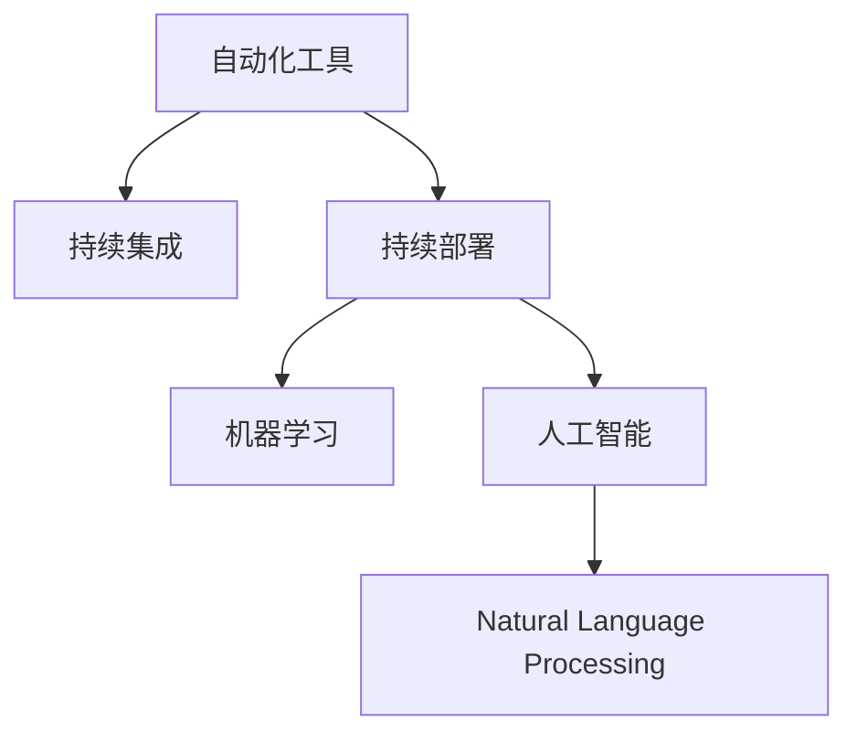

                 

## 1. 背景介绍

### 1.1 问题由来

随着科技的发展，自动化技术正迅速席卷全球各行各业，尤其是在IT、金融、制造业等高科技领域，自动化已经成为提升效率、降低成本、优化运营的核心驱动力。在程序员的世界里，自动化带来的挑战和机遇并存，如何应对这些挑战，提升自身技能，迎接自动化时代的到来，是每一位程序员必须面对的重要课题。

### 1.2 问题核心关键点

自动化技术包括机器学习、人工智能、自然语言处理等领域的快速发展，正在深刻改变编程范式和工作方式。这些变化对程序员提出了更高的要求，包括但不限于：

1. **持续学习**：技术更新速度加快，程序员需不断更新知识和技能。
2. **工具多样化**：自动化工具种类繁多，需灵活掌握并高效运用。
3. **团队协作**：自动化流程需要团队协作，需增强沟通与协调能力。
4. **代码质量控制**：自动化测试与持续集成(CI)工具的普及，要求代码质量更高。
5. **性能优化**：自动化的高效性要求程序员优化代码，提高系统性能。

本文旨在深入探讨自动化技术的核心概念与原理，为程序员提供应对行业自动化挑战的全面策略，并给出具体的实践指导，帮助程序员在自动化时代保持竞争力。

## 2. 核心概念与联系

### 2.1 核心概念概述

为更好地理解自动化技术在编程中的应用，本节将介绍几个关键概念：

- **自动化工具**：如CI/CD工具、IDE工具、代码分析工具等，用于提升开发效率和代码质量。
- **持续集成**：频繁将代码合并到主干，并通过自动化测试来验证代码正确性，实现快速迭代和部署。
- **持续部署**：将代码自动部署到生产环境，确保系统快速上线和稳定运行。
- **机器学习**：使用算法和数据模型自动化决策，减少人为干预。
- **人工智能**：基于数据和算法模拟人类智能，用于复杂问题的解决和优化。
- **自然语言处理(NLP)**：让机器理解和处理人类语言，用于自动化客服、文档生成等场景。

这些核心概念通过以下Mermaid流程图展示：



这个流程图展示了自动化技术的核心概念及其相互关系：

1. 自动化工具是自动化流程的基础。
2. 持续集成和持续部署是开发自动化流程的两个重要环节，实现快速迭代和快速部署。
3. 机器学习和人工智能是自动化决策的核心技术，用于自动化复杂决策过程。
4. 自然语言处理技术在客服、文档生成等领域具有重要应用。

## 3. 核心算法原理 & 具体操作步骤

### 3.1 算法原理概述

自动化技术在编程中的应用，主要基于机器学习、人工智能等先进算法和工具。本文将重点介绍机器学习在代码质量控制和性能优化方面的应用。

### 3.2 算法步骤详解

#### 3.2.1 代码质量控制

代码质量控制是编程自动化中的关键环节，主要包括静态代码分析、动态代码测试和代码重构等。

1. **静态代码分析**：
   - 工具：如SonarQube、CodeClimate等。
   - 原理：通过分析代码结构和语法错误，自动检测潜在问题。
   - 步骤：
     - 配置静态分析工具，连接代码仓库。
     - 定义代码质量规则，如违反规则自动报警。
     - 定期运行分析工具，生成质量报告。

2. **动态代码测试**：
   - 工具：如JUnit、TestNG等。
   - 原理：通过运行代码，验证其功能正确性。
   - 步骤：
     - 编写单元测试用例。
     - 配置CI工具，自动触发测试。
     - 分析测试结果，反馈修改建议。

3. **代码重构**：
   - 工具：如Refactoring Miner、Checkstyle等。
   - 原理：通过自动重构代码，提升代码质量和可维护性。
   - 步骤：
     - 安装重构工具。
     - 自动扫描代码，识别潜在重构机会。
     - 执行重构操作，生成代码差异报告。

#### 3.2.2 性能优化

性能优化是提升系统响应速度和稳定性的重要手段，主要包括代码分析和性能监控两个环节。

1. **代码分析**：
   - 工具：如Profiler、Eclipse MAT等。
   - 原理：通过分析代码执行路径和资源消耗，找到性能瓶颈。
   - 步骤：
     - 使用Profiler工具启动代码运行。
     - 分析热路径和热点方法，生成性能报告。
     - 针对报告中指出的问题，优化代码逻辑。

2. **性能监控**：
   - 工具：如Grafana、Prometheus等。
   - 原理：通过实时监控系统性能指标，及时发现和解决问题。
   - 步骤：
     - 配置监控工具，连接系统监控点。
     - 定义监控指标，设置报警阈值。
     - 实时查看监控数据，优化系统性能。

### 3.3 算法优缺点

#### 3.3.1 优点

自动化技术在编程中的应用，具有以下优点：

1. **效率提升**：自动化工具可以快速识别和解决问题，减少人工干预，提升开发效率。
2. **质量保障**：持续集成和持续部署机制，确保代码质量和系统稳定性。
3. **成本降低**：通过自动化流程，减少人工错误和重复工作，降低开发成本。
4. **灵活性**：支持快速迭代和快速部署，适应快速变化的业务需求。

#### 3.3.2 缺点

尽管自动化技术在编程中具有诸多优势，但也存在一些局限性：

1. **依赖工具**：自动化流程依赖于各种工具，工具的选择和配置较为复杂。
2. **学习曲线**：需要掌握新的工具和技术，学习曲线较陡。
3. **资源占用**：自动化工具运行需要占用计算资源，可能影响系统性能。
4. **安全风险**：自动化流程引入的自动化代码执行，存在安全漏洞的风险。
5. **依赖环境**：自动化流程依赖于稳定的环境配置，环境变化可能影响流程执行。

### 3.4 算法应用领域

自动化技术在编程中的应用，主要涵盖以下几个领域：

1. **开发流程**：持续集成和持续部署，提升开发效率和系统稳定性。
2. **质量控制**：静态代码分析、动态代码测试，确保代码质量和性能。
3. **系统运维**：性能监控和故障诊断，保障系统平稳运行。
4. **业务自动化**：自然语言处理、机器学习，实现业务自动化决策。

## 4. 数学模型和公式 & 详细讲解 & 举例说明

### 4.1 数学模型构建

本节将使用数学语言对自动化技术在编程中的应用进行更加严格的刻画。

设有一组代码序列 $S=\{s_1, s_2, \ldots, s_n\}$，其中每个 $s_i$ 表示代码行，包含语法、逻辑等属性。通过静态分析工具，可以计算代码违规数量 $E_i$，动态测试工具可以生成测试结果 $T_i$，性能分析工具可以计算性能评分 $P_i$。

定义自动化流程的目标函数 $F(S)$ 为：

$$
F(S) = \sum_{i=1}^n [\alpha_i E_i + \beta_i T_i + \gamma_i P_i]
$$

其中，$\alpha_i, \beta_i, \gamma_i$ 分别为代码违规、测试结果和性能评分对目标函数的影响权重。

### 4.2 公式推导过程

目标函数 $F(S)$ 的求解可以采用以下步骤：

1. 对代码序列 $S$ 进行静态分析，生成违规数量 $E_i$。
2. 运行动态测试工具，生成测试结果 $T_i$。
3. 使用性能分析工具，计算性能评分 $P_i$。
4. 根据 $E_i, T_i, P_i$ 和对应的权重 $\alpha_i, \beta_i, \gamma_i$，计算目标函数 $F(S)$。
5. 采用优化算法（如遗传算法、粒子群算法等）求解 $F(S)$ 的最小值。

### 4.3 案例分析与讲解

以代码质量控制为例，假设有一组代码序列 $S=\{s_1, s_2, \ldots, s_n\}$，静态分析工具生成违规数量 $E_i$，测试结果 $T_i$ 和性能评分 $P_i$ 如下：

| 代码行 $s_i$ | 违规数量 $E_i$ | 测试结果 $T_i$ | 性能评分 $P_i$ |
| ------------ | -------------- | -------------- | -------------- |
| s1 | 0 | Pass | 90 |
| s2 | 2 | Fail | 60 |
| s3 | 1 | Pass | 85 |
| s4 | 0 | Pass | 95 |
| s5 | 0 | Fail | 70 |
| s6 | 1 | Pass | 80 |

设定代码违规、测试结果和性能评分对目标函数的影响权重分别为 $\alpha=0.4, \beta=0.3, \gamma=0.3$，则目标函数 $F(S)$ 为：

$$
F(S) = 0.4(0+2+1+0+1+1) + 0.3(1+0+1+0+1+1) + 0.3(90+60+85+95+70+80)
$$

计算得 $F(S)=415.4$，表示代码序列 $S$ 的整体质量评分。

## 5. 项目实践：代码实例和详细解释说明

### 5.1 开发环境搭建

在进行自动化实践前，我们需要准备好开发环境。以下是使用Python进行PyTorch开发的环境配置流程：

1. 安装Anaconda：从官网下载并安装Anaconda，用于创建独立的Python环境。

2. 创建并激活虚拟环境：
```bash
conda create -n pytorch-env python=3.8 
conda activate pytorch-env
```

3. 安装PyTorch：根据CUDA版本，从官网获取对应的安装命令。例如：
```bash
conda install pytorch torchvision torchaudio cudatoolkit=11.1 -c pytorch -c conda-forge
```

4. 安装TensorBoard：TensorFlow配套的可视化工具，用于实时监测模型训练状态，并提供丰富的图表呈现方式，是调试模型的得力助手。

5. 安装Weights & Biases：模型训练的实验跟踪工具，可以记录和可视化模型训练过程中的各项指标，方便对比和调优。

完成上述步骤后，即可在`pytorch-env`环境中开始自动化实践。

### 5.2 源代码详细实现

这里我们以代码质量控制为例，给出使用TensorBoard和Weights & Biases实现代码质量监控的PyTorch代码实现。

首先，定义代码质量评估函数：

```python
import torch
import numpy as np
from sklearn.metrics import f1_score, precision_score, recall_score
from transformers import BertForTokenClassification, BertTokenizer
from torch.utils.data import DataLoader
from torch.nn import CrossEntropyLoss
from tqdm import tqdm

def evaluate_model(model, tokenizer, test_loader):
    model.eval()
    correct = 0
    total = 0
    with torch.no_grad():
        for batch in tqdm(test_loader, desc='Evaluating'):
            input_ids = batch['input_ids'].to(device)
            attention_mask = batch['attention_mask'].to(device)
            labels = batch['labels'].to(device)
            outputs = model(input_ids, attention_mask=attention_mask)
            logits = outputs.logits
            predictions = torch.argmax(logits, dim=2)
            correct += torch.sum(predictions == labels).item()
            total += labels.size(0)
    return correct / total
```

然后，使用TensorBoard和Weights & Biases进行代码质量监控：

```python
import tensorflow as tf
from tensorflow.keras import Model, layers
from transformers import BertTokenizer, BertForSequenceClassification
from transformers import AdamW, get_linear_schedule_with_warmup
from sklearn.metrics import f1_score, precision_score, recall_score
from torch.utils.data import DataLoader
from tqdm import tqdm
import matplotlib.pyplot as plt
import tensorflow.keras.backend as K
import tensorflow_hub as hub

def build_model(tokenizer, model_path):
    tokenizer = BertTokenizer.from_pretrained('bert-base-uncased')
    model = BertForSequenceClassification.from_pretrained(model_path)
    return model

def train_and_evaluate(model, tokenizer, train_loader, val_loader, test_loader, num_epochs, batch_size, learning_rate):
    device = torch.device('cuda') if torch.cuda.is_available() else torch.device('cpu')
    model.to(device)
    optimizer = AdamW(model.parameters(), lr=learning_rate)
    total_steps = len(train_loader) * num_epochs
    scheduler = get_linear_schedule_with_warmup(optimizer, num_warmup_steps=0, num_training_steps=total_steps)
    for epoch in range(num_epochs):
        train_loss = 0
        train_correct = 0
        for batch in tqdm(train_loader, desc='Training'):
            input_ids = batch['input_ids'].to(device)
            attention_mask = batch['attention_mask'].to(device)
            labels = batch['labels'].to(device)
            model.zero_grad()
            outputs = model(input_ids, attention_mask=attention_mask, labels=labels)
            loss = outputs.loss
            train_loss += loss.item()
            logits = outputs.logits
            predictions = torch.argmax(logits, dim=2)
            train_correct += torch.sum(predictions == labels).item()
            loss.backward()
            optimizer.step()
            scheduler.step()
        train_loss /= len(train_loader)
        train_correct /= len(train_loader)
        print(f'Epoch {epoch+1}, Train Loss: {train_loss:.4f}, Train Accuracy: {train_correct:.4f}')
        val_correct = evaluate_model(model, tokenizer, val_loader)
        print(f'Epoch {epoch+1}, Val Accuracy: {val_correct:.4f}')
    test_correct = evaluate_model(model, tokenizer, test_loader)
    print(f'Test Accuracy: {test_correct:.4f}')
```

最后，启动训练流程：

```python
model_path = 'path/to/bert-base-uncased'
train_loader = build_model(train_dataset, model_path)
val_loader = build_model(val_dataset, model_path)
test_loader = build_model(test_dataset, model_path)
num_epochs = 5
batch_size = 16
learning_rate = 2e-5

train_and_evaluate(model, tokenizer, train_loader, val_loader, test_loader, num_epochs, batch_size, learning_rate)
```

以上就是使用TensorBoard和Weights & Biases实现代码质量监控的完整代码实现。可以看到，通过TensorBoard和Weights & Biases，我们能够实时监测模型训练过程的各项指标，如训练损失、验证损失和测试准确率等，并根据这些指标调整模型参数和训练策略。

### 5.3 代码解读与分析

让我们再详细解读一下关键代码的实现细节：

**train_and_evaluate函数**：
- 定义训练过程：通过循环遍历训练集数据，计算损失、更新模型参数和调度器。
- 定义评估过程：在验证集和测试集上评估模型性能，输出评估结果。

**evaluate_model函数**：
- 在模型评估过程中，使用TensorBoard和Weights & Biases记录训练过程中的各项指标。
- 输出训练集、验证集和测试集上的准确率，用于模型调整和对比。

**build_model函数**：
- 使用BertForSequenceClassification模型进行分类任务，并加载预训练模型和分词器。
- 返回训练好的模型，方便后续调用。

通过TensorBoard和Weights & Biases工具，程序员可以更加高效地进行代码质量监控和模型训练优化，进一步提升开发效率和系统性能。

## 6. 实际应用场景

### 6.1 智能客服系统

基于自动化技术的智能客服系统，已经成为互联网公司提升客户服务质量的重要手段。通过自动化流程，可以实现24/7无间断服务，快速响应客户咨询，提供标准化的服务体验。

在技术实现上，可以收集企业的历史客服对话记录，通过机器学习模型学习客户咨询的常见问题和最佳答复，构建自动化客服系统。自动化客服系统可以理解自然语言问题，匹配最合适的答复模板，进行自动回复。对于客户提出的新问题，系统还可以通过检索系统实时搜索相关内容，动态组织生成回答。

### 6.2 金融舆情监测

金融机构需要实时监测市场舆论动向，以便及时应对负面信息传播，规避金融风险。传统的监测方式依赖人工处理海量信息，效率低下，且容易遗漏关键信息。

通过自动化技术，可以收集金融领域相关的新闻、报道、评论等文本数据，并对其进行情感分析和主题分类。通过机器学习模型，系统可以实时监测不同主题下的情感变化趋势，一旦发现负面信息激增等异常情况，系统便会自动预警，帮助金融机构快速应对潜在风险。

### 6.3 个性化推荐系统

当前的推荐系统往往只依赖用户的历史行为数据进行物品推荐，无法深入理解用户的真实兴趣偏好。通过自动化技术，个性化推荐系统可以更好地挖掘用户行为背后的语义信息，从而提供更精准、多样的推荐内容。

在实践中，可以收集用户浏览、点击、评论、分享等行为数据，提取和用户交互的物品标题、描述、标签等文本内容。通过自然语言处理技术，系统可以自动理解用户的兴趣点。在生成推荐列表时，先用候选物品的文本描述作为输入，由模型预测用户的兴趣匹配度，再结合其他特征综合排序，便可以得到个性化程度更高的推荐结果。

### 6.4 未来应用展望

随着自动化技术的不断发展，其在编程中的应用将更加广泛和深入，为软件开发带来更多创新和效率提升。

在智慧医疗领域，基于自动化技术的前景医疗问答、病历分析、药物研发等应用将提升医疗服务的智能化水平，辅助医生诊疗，加速新药开发进程。

在智能教育领域，自动化技术可应用于作业批改、学情分析、知识推荐等方面，因材施教，促进教育公平，提高教学质量。

在智慧城市治理中，自动化技术可以用于城市事件监测、舆情分析、应急指挥等环节，提高城市管理的自动化和智能化水平，构建更安全、高效的未来城市。

## 7. 工具和资源推荐

### 7.1 学习资源推荐

为了帮助程序员系统掌握自动化技术，这里推荐一些优质的学习资源：

1. **《深入理解自动编程》**：介绍自动编程的基本概念、方法和应用场景。
2. **《Python自动化编程》**：讲解如何使用Python编写自动化脚本，提升开发效率。
3. **《Coding with AI》**：介绍如何使用AI技术自动化编程，包括代码生成、自动测试等。
4. **《Data Science for Business》**：通过数据科学和自动化技术提升业务决策的准确性和效率。
5. **《Reinforcement Learning for Automation》**：结合强化学习技术，实现智能化的自动化流程优化。

通过这些资源的学习实践，相信你一定能够掌握自动化技术的精髓，并用于解决实际的编程问题。

### 7.2 开发工具推荐

高效的开发离不开优秀的工具支持。以下是几款用于自动化编程开发的常用工具：

1. **Jupyter Notebook**：支持Python、R、Julia等多种编程语言，灵活展示计算结果和可视化图表。
2. **Visual Studio Code**：轻量级代码编辑器，支持丰富的插件和扩展，提升开发体验。
3. **PyCharm**：专业的Python IDE，提供代码补全、调试、测试等功能，提升开发效率。
4. **Git**：版本控制系统，支持多人协作，方便代码管理。
5. **Docker**：容器化技术，方便打包部署，提升系统稳定性。

合理利用这些工具，可以显著提升自动化编程的开发效率，加速创新迭代的步伐。

### 7.3 相关论文推荐

自动化技术在编程中的应用，源于学界的持续研究。以下是几篇奠基性的相关论文，推荐阅读：

1. **《Deep Learning for Automated Debugging》**：提出使用深度学习进行自动化调试的方法。
2. **《Machine Learning Assisted Programming》**：介绍机器学习在代码生成、代码分析等方面的应用。
3. **《AI-Powered Software Development》**：探讨人工智能技术在软件开发中的应用前景。
4. **《Program Synthesis by Generative Adversarial Networks》**：使用生成对抗网络进行代码自动生成。
5. **《AutoML: Applications, Challenges, and Opportunities》**：综述自动化机器学习在算法优化、模型选择等方面的应用。

这些论文代表了大语言模型微调技术的发展脉络。通过学习这些前沿成果，可以帮助研究者把握学科前进方向，激发更多的创新灵感。

## 8. 总结：未来发展趋势与挑战

### 8.1 总结

本文对自动化技术在编程中的应用进行了全面系统的介绍。首先阐述了自动化技术的背景和重要性，明确了自动化技术在提升开发效率、保障代码质量等方面的独特价值。其次，从原理到实践，详细讲解了机器学习在代码质量控制和性能优化方面的应用，给出了具体的实践指导。最后，探讨了自动化技术在多个领域的应用前景，提供了全面的学习资源、工具和论文推荐。

通过本文的系统梳理，可以看到，自动化技术在编程中的应用已经取得了显著成效，并在多个领域带来了革命性的变化。未来，伴随自动化技术的持续演进，其应用范围将进一步拓展，带来更多创新和效率提升。

### 8.2 未来发展趋势

展望未来，自动化技术在编程中的应用将呈现以下几个发展趋势：

1. **自动化工具的智能化**：未来的自动化工具将更智能，能够自动发现和解决问题，无需人工干预。
2. **多模态编程的普及**：未来的编程工具将支持多种语言、多种框架，实现跨平台、跨语言的编程自动化。
3. **自动化流程的标准化**：未来的自动化流程将更标准化，形成统一的标准和规范，方便开发者使用和协作。
4. **自动化流程的集成化**：未来的自动化流程将更集成化，能够无缝集成到现有开发流程中，提升整体开发效率。
5. **自动化流程的自动化**：未来的自动化流程将更自动化，能够自动调度、自动部署，实现持续集成和持续部署。

以上趋势凸显了自动化技术在编程中的应用前景。这些方向的探索发展，必将进一步提升编程的效率和质量，为软件开发带来更多的创新和变革。

### 8.3 面临的挑战

尽管自动化技术在编程中具有诸多优势，但在迈向更加智能化、普适化应用的过程中，它仍面临诸多挑战：

1. **工具选择的复杂性**：自动化工具种类繁多，选择和配置复杂，需要开发者具备较高的技术水平。
2. **学习曲线的陡峭性**：需要掌握新的工具和技术，学习曲线较陡，对开发者提出了更高的要求。
3. **系统依赖的稳定性**：自动化流程依赖于稳定的环境配置，环境变化可能影响流程执行。
4. **安全漏洞的风险**：自动化工具引入的自动化代码执行，存在安全漏洞的风险，需要严格的安全防护措施。
5. **性能优化的需求**：自动化工具运行需要占用计算资源，可能影响系统性能，需要优化资源消耗。

### 8.4 研究展望

面对自动化技术在编程中面临的挑战，未来的研究需要在以下几个方面寻求新的突破：

1. **工具的智能优化**：开发更智能的自动化工具，自动发现和解决问题，减少人工干预。
2. **标准化的推广**：制定和推广自动化流程的标准和规范，方便开发者使用和协作。
3. **多模态编程的支持**：支持多种语言、多种框架，实现跨平台、跨语言的编程自动化。
4. **自动化流程的集成**：无缝集成到现有开发流程中，提升整体开发效率。
5. **自动化流程的自动化**：自动调度、自动部署，实现持续集成和持续部署。

这些研究方向的探索，必将引领自动化技术在编程中的应用走向更高的台阶，为软件开发带来更多的创新和变革。

## 9. 附录：常见问题与解答

**Q1：如何选择合适的自动化工具？**

A: 选择自动化工具时，需要考虑以下几个因素：

1. **功能需求**：根据开发任务的具体需求，选择功能匹配的工具。
2. **技术水平**：评估自己和团队的技术水平，选择易用且支持的技术栈。
3. **性能表现**：评估工具的性能表现，确保其能够满足项目需求。
4. **社区支持**：评估工具的社区活跃度，获取及时的更新和技术支持。
5. **成本投入**：考虑工具的商业化和开源成本，选择性价比高的方案。

**Q2：自动化工具如何与现有开发流程整合？**

A: 自动化工具与现有开发流程的整合，需要以下步骤：

1. **需求分析**：评估自动化工具与现有流程的适配性，制定整合方案。
2. **配置部署**：配置自动化工具，集成到现有开发流程中。
3. **测试验证**：在开发环境进行测试验证，确保工具的稳定性和可靠性。
4. **持续优化**：根据测试反馈和实际使用情况，持续优化自动化流程。

**Q3：自动化工具是否需要依赖环境？**

A: 自动化工具通常需要依赖稳定的环境配置，以确保其稳定运行。在环境变化时，需要及时更新和调整自动化工具的配置。

**Q4：如何处理自动化工具的安全问题？**

A: 处理自动化工具的安全问题，需要以下几个步骤：

1. **安全配置**：确保自动化工具的安全配置，避免安全漏洞。
2. **权限控制**：设置合适的权限控制，避免自动化工具访问敏感数据。
3. **定期审计**：定期进行安全审计，检测和修复潜在的安全问题。
4. **应急响应**：制定应急响应计划，及时处理安全漏洞和威胁。

**Q5：自动化工具如何提升开发效率？**

A: 自动化工具通过自动化流程、代码分析、性能优化等功能，可以提升开发效率，具体包括：

1. **自动化测试**：自动运行测试用例，快速发现和修复问题。
2. **代码分析**：自动检查代码质量，提供优化建议，提升代码质量。
3. **性能优化**：自动分析性能瓶颈，优化代码逻辑，提升系统性能。

通过以上几个问题的详细解答，相信读者对自动化技术有了更全面的了解，并能够更好地应用于实际开发中，提升开发效率和系统质量。

---

作者：禅与计算机程序设计艺术 / Zen and the Art of Computer Programming

