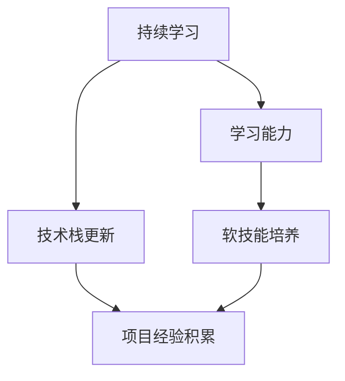

                 

# 程序员如何建立长期的职业竞争力

> 关键词：职业规划, 技术栈更新, 学习能力, 软技能培养, 项目经验积累

## 1. 背景介绍

### 1.1 问题由来
随着信息技术的高速发展，程序员的职业环境发生了翻天覆地的变化。技术更新迭代迅速，市场竞争日益激烈，这对每一位程序员的职业成长提出了更高要求。如何在激烈的竞争中脱颖而出，建立长期的职业竞争力，成为了每一个有抱负的程序员必须面对的问题。

### 1.2 问题核心关键点
建立长期职业竞争力的关键在于持续学习、技术更新、软技能培养和项目经验积累。以下是这些关键点的核心思路：

- **持续学习**：技术日新月异，程序员必须保持对新技术、新工具、新方法的持续关注和学习，才能保持竞争力。
- **技术栈更新**：现代应用场景往往涉及多种技术和工具的结合，程序员需要掌握多种技术栈，具备跨栈应用的能力。
- **学习能力**：良好的学习能力和方法论是高效掌握新知识的关键，需培养高效的学习习惯和思维模式。
- **软技能培养**：技术能力只是基础，有效的沟通、团队协作、项目管理等软技能对职业生涯同样至关重要。
- **项目经验积累**：通过参与实际项目，将理论知识转化为实践经验，不断提高解决实际问题的能力。

### 1.3 问题研究意义
建立长期的职业竞争力，不仅有助于个人职业发展，还能提升整体团队的创新能力和市场竞争力。这对于企业长期发展和个人职业成长都具有重要意义：

1. **提升个人价值**：不断学习与成长使程序员在职场中更具价值，可以胜任更高层次的职位。
2. **增强团队创新能力**：具备跨技术和多工具的程序员能更好地解决复杂问题，推动项目进展。
3. **增强市场竞争力**：技术领域的快速变化要求企业不断创新，程序员的竞争力直接影响企业的市场竞争力。

## 2. 核心概念与联系

### 2.1 核心概念概述

为更好地理解如何建立长期的职业竞争力，本节将介绍几个密切相关的核心概念：

- **持续学习**：通过不断的学习和自我提升，跟上技术发展的步伐，保持技能的领先性。
- **技术栈更新**：不断学习和掌握新的技术栈，适应多样化的项目需求。
- **学习能力**：高效获取、理解和应用新知识的能力。
- **软技能**：沟通能力、团队协作、项目管理等非技术技能，对职业生涯同样重要。
- **项目经验积累**：通过实际项目，提升解决实际问题的能力，积累宝贵的经验。

这些核心概念之间的逻辑关系可以通过以下Mermaid流程图来展示：



这个流程图展示了这个过程的基本逻辑：

1. 持续学习是技术栈更新和项目经验积累的前提。
2. 技术栈更新和项目经验积累共同构成学习与实践的闭环，不断提升学习能力。
3. 学习能力与软技能培养相辅相成，两者共同提升个人整体竞争力。

## 3. 核心算法原理 & 具体操作步骤
### 3.1 算法原理概述

建立长期职业竞争力的核心算法原理基于迭代学习与实践反馈的循环。即通过持续学习和实际项目经验的不断积累，逐渐提升技能和知识水平，形成技能和知识的正向增长。

形式化地，假设当前技能和知识水平为 $S_0$，目标水平为 $S^*$，则迭代学习过程可表示为：

$$
S_{t+1} = S_t + \eta \cdot (S^* - S_t)
$$

其中 $t$ 为迭代次数，$\eta$ 为学习速率，决定了每次迭代中知识更新的幅度。

### 3.2 算法步骤详解

建立长期职业竞争力涉及多个具体步骤，每个步骤都需要精心设计和持续实践：

**Step 1: 明确目标与方向**
- 分析当前的技能和知识水平，明确未来需要达到的目标和方向。
- 制定详细的发展计划，包括技术栈、软技能、项目经验等具体目标。

**Step 2: 持续学习**
- 定期参加技术讲座、研讨会、在线课程等，获取最新的技术知识和行业动态。
- 订阅科技博客、技术社区、技术论文等，保持对新技术的持续关注。
- 每日或每周安排固定时间进行技术学习和实验，不断扩展知识面。

**Step 3: 技术栈更新**
- 学习并掌握至少两种主流的编程语言和技术栈。
- 参与开源项目，使用多种技术栈进行项目开发，积累跨栈经验。
- 学习并实践常见的架构模式和设计原则，提升设计能力。

**Step 4: 学习能力培养**
- 掌握高效学习方法和工具，如费曼学习法、Khan Academy等在线学习平台。
- 培养批判性思维和问题解决能力，提升对新知识的理解和应用能力。
- 经常进行自我评估和反思，找出知识盲点和提升空间。

**Step 5: 软技能培养**
- 参与团队合作项目，提高沟通、协作、项目管理等软技能。
- 阅读和实践相关的软技能书籍和文章，学习先进的团队协作方法和项目管理工具。
- 积极参与社区活动，扩展人脉资源，提升个人影响力。

**Step 6: 项目经验积累**
- 积极参与公司或开源项目，积累实际项目经验。
- 选择有挑战性的项目，不断突破自身技术能力上限。
- 记录和总结项目中的问题和解决方案，形成可复用的知识库。

### 3.3 算法优缺点

建立长期职业竞争力的算法具有以下优点：
1. 不断学习和实践，能够快速适应技术变化，保持竞争力。
2. 通过跨栈和实战经验积累，提升解决问题的全面能力。
3. 强调软技能培养，提升团队协作和项目管理能力，有利于职业发展。

同时，该算法也存在一些局限性：
1. 需要投入大量时间和精力，对自我管理能力要求较高。
2. 需要平衡工作与学习，避免过度学习导致的职业倦怠。
3. 部分新技能的学习曲线较陡，初期可能面临较大挑战。

尽管有这些局限，但就目前而言，这种持续学习与实践相结合的方法是建立长期职业竞争力的最有效手段。

### 3.4 算法应用领域

建立长期职业竞争力的算法在各行各业中都有广泛的应用。以下是几个典型的应用场景：

- **IT技术开发**：程序员通过持续学习新技术，更新技术栈，不断提升编码和系统设计能力。
- **项目管理**：项目经理通过持续学习项目管理工具和方法，提升团队管理和项目交付能力。
- **数据科学与人工智能**：数据科学家通过不断学习和实践新算法、新工具，提升数据处理和模型构建能力。
- **产品设计与用户体验**：产品经理通过学习用户研究和设计思维方法，提升产品设计和用户体验能力。

除了这些典型场景，许多其他职业领域也受益于持续学习与实践相结合的竞争策略。

## 4. 数学模型和公式 & 详细讲解 & 举例说明

### 4.1 数学模型构建

建立长期职业竞争力的数学模型可以表示为一个时间序列过程。设当前技能水平为 $S_t$，目标水平为 $S^*$，迭代次数为 $t$，每次迭代的学习速率为 $\eta$。则建立长期职业竞争力的数学模型为：

$$
S_t = S_0 + \sum_{i=1}^t \eta \cdot (S^* - S_{i-1})
$$

模型中，$S_0$ 为当前技能水平，$S^*$ 为目标水平，$\eta$ 为学习速率。

### 4.2 公式推导过程

在上述模型中，每次迭代的技能水平提升量为 $(S^* - S_{i-1})$，表示当前水平与目标水平的差距。通过将差距乘以学习速率 $\eta$，得到每次迭代的提升量，最终累加得到当前技能水平 $S_t$。

设初始技能水平 $S_0$ 为 100，目标水平 $S^*$ 为 150，学习速率 $\eta$ 为 0.1，迭代次数 $t=10$。则有：

$$
S_{10} = 100 + 10 \times 0.1 \times (150 - 100) = 120
$$

这表示经过10次迭代后，技能水平从100提升至120，基本达到了目标水平。

### 4.3 案例分析与讲解

假设某程序员的技能水平为100，希望在一年内达到150的专家水平，学习速率为0.1。根据上述数学模型，每次迭代技能提升量为：

$$
(S^* - S_{i-1}) = (150 - 100) \times 0.1 = 10
$$

则一年内技能提升的总量为：

$$
10 \times 12 = 120
$$

因此，经过12个月的持续学习和实践，该程序员的技能水平可以达到目标水平。

## 5. 项目实践：代码实例和详细解释说明
### 5.1 开发环境搭建

在开始项目实践之前，我们需要准备好开发环境。以下是使用Python进行PyTorch开发的环境配置流程：

1. 安装Anaconda：从官网下载并安装Anaconda，用于创建独立的Python环境。

2. 创建并激活虚拟环境：
```bash
conda create -n pytorch-env python=3.8 
conda activate pytorch-env
```

3. 安装PyTorch：根据CUDA版本，从官网获取对应的安装命令。例如：
```bash
conda install pytorch torchvision torchaudio cudatoolkit=11.1 -c pytorch -c conda-forge
```

4. 安装Transformers库：
```bash
pip install transformers
```

5. 安装各类工具包：
```bash
pip install numpy pandas scikit-learn matplotlib tqdm jupyter notebook ipython
```

完成上述步骤后，即可在`pytorch-env`环境中开始项目实践。

### 5.2 源代码详细实现

下面我以一个简单的NLP项目为例，展示如何通过微调BERT模型进行情感分析。

首先，准备训练集和测试集，使用`BertTokenizer`进行文本预处理：

```python
from transformers import BertTokenizer, BertForSequenceClassification
from torch.utils.data import Dataset, DataLoader
import torch

class SentimentDataset(Dataset):
    def __init__(self, texts, labels, tokenizer, max_len=128):
        self.texts = texts
        self.labels = labels
        self.tokenizer = tokenizer
        self.max_len = max_len
        
    def __len__(self):
        return len(self.texts)
    
    def __getitem__(self, item):
        text = self.texts[item]
        label = self.labels[item]
        
        encoding = self.tokenizer(text, return_tensors='pt', max_length=self.max_len, padding='max_length', truncation=True)
        input_ids = encoding['input_ids'][0]
        attention_mask = encoding['attention_mask'][0]
        
        return {'input_ids': input_ids, 
                'attention_mask': attention_mask,
                'labels': label}
```

接着，定义模型和优化器：

```python
from transformers import AdamW

model = BertForSequenceClassification.from_pretrained('bert-base-uncased', num_labels=2)

optimizer = AdamW(model.parameters(), lr=2e-5)
```

然后，定义训练和评估函数：

```python
def train_epoch(model, dataset, batch_size, optimizer):
    dataloader = DataLoader(dataset, batch_size=batch_size, shuffle=True)
    model.train()
    epoch_loss = 0
    for batch in dataloader:
        input_ids = batch['input_ids'].to(device)
        attention_mask = batch['attention_mask'].to(device)
        labels = batch['labels'].to(device)
        model.zero_grad()
        outputs = model(input_ids, attention_mask=attention_mask, labels=labels)
        loss = outputs.loss
        epoch_loss += loss.item()
        loss.backward()
        optimizer.step()
    return epoch_loss / len(dataloader)

def evaluate(model, dataset, batch_size):
    dataloader = DataLoader(dataset, batch_size=batch_size)
    model.eval()
    preds, labels = [], []
    with torch.no_grad():
        for batch in dataloader:
            input_ids = batch['input_ids'].to(device)
            attention_mask = batch['attention_mask'].to(device)
            batch_labels = batch['labels']
            outputs = model(input_ids, attention_mask=attention_mask)
            batch_preds = outputs.logits.argmax(dim=1).to('cpu').tolist()
            batch_labels = batch_labels.to('cpu').tolist()
            for pred, label in zip(batch_preds, batch_labels):
                preds.append(pred)
                labels.append(label)
                
    print(f'Accuracy: {accuracy_score(labels, preds)}')
```

最后，启动训练流程并在测试集上评估：

```python
epochs = 5
batch_size = 16

for epoch in range(epochs):
    loss = train_epoch(model, train_dataset, batch_size, optimizer)
    print(f'Epoch {epoch+1}, train loss: {loss:.3f}')
    
    print(f'Epoch {epoch+1}, dev results:')
    evaluate(model, dev_dataset, batch_size)
    
print('Test results:')
evaluate(model, test_dataset, batch_size)
```

以上就是使用PyTorch对BERT进行情感分析任务微调的完整代码实现。可以看到，得益于Transformers库的强大封装，我们可以用相对简洁的代码完成BERT模型的加载和微调。

### 5.3 代码解读与分析

让我们再详细解读一下关键代码的实现细节：

**SentimentDataset类**：
- `__init__`方法：初始化文本、标签、分词器等关键组件。
- `__len__`方法：返回数据集的样本数量。
- `__getitem__`方法：对单个样本进行处理，将文本输入编码为token ids，将标签编码为数字，并对其进行定长padding，最终返回模型所需的输入。

**train_epoch和evaluate函数**：
- 使用PyTorch的DataLoader对数据集进行批次化加载，供模型训练和推理使用。
- 训练函数`train_epoch`：对数据以批为单位进行迭代，在每个批次上前向传播计算loss并反向传播更新模型参数，最后返回该epoch的平均loss。
- 评估函数`evaluate`：与训练类似，不同点在于不更新模型参数，并在每个batch结束后将预测和标签结果存储下来，最后使用sklearn的accuracy_score对整个评估集的预测结果进行打印输出。

**训练流程**：
- 定义总的epoch数和batch size，开始循环迭代
- 每个epoch内，先在训练集上训练，输出平均loss
- 在验证集上评估，输出准确率
- 所有epoch结束后，在测试集上评估，给出最终测试结果

可以看到，PyTorch配合Transformers库使得BERT微调的代码实现变得简洁高效。开发者可以将更多精力放在数据处理、模型改进等高层逻辑上，而不必过多关注底层的实现细节。

当然，工业级的系统实现还需考虑更多因素，如模型的保存和部署、超参数的自动搜索、更灵活的任务适配层等。但核心的微调范式基本与此类似。

## 6. 实际应用场景
### 6.1 智能客服系统

基于大语言模型微调的对话技术，可以广泛应用于智能客服系统的构建。传统客服往往需要配备大量人力，高峰期响应缓慢，且一致性和专业性难以保证。而使用微调后的对话模型，可以7x24小时不间断服务，快速响应客户咨询，用自然流畅的语言解答各类常见问题。

在技术实现上，可以收集企业内部的历史客服对话记录，将问题和最佳答复构建成监督数据，在此基础上对预训练对话模型进行微调。微调后的对话模型能够自动理解用户意图，匹配最合适的答案模板进行回复。对于客户提出的新问题，还可以接入检索系统实时搜索相关内容，动态组织生成回答。如此构建的智能客服系统，能大幅提升客户咨询体验和问题解决效率。

### 6.2 金融舆情监测

金融机构需要实时监测市场舆论动向，以便及时应对负面信息传播，规避金融风险。传统的人工监测方式成本高、效率低，难以应对网络时代海量信息爆发的挑战。基于大语言模型微调的文本分类和情感分析技术，为金融舆情监测提供了新的解决方案。

具体而言，可以收集金融领域相关的新闻、报道、评论等文本数据，并对其进行主题标注和情感标注。在此基础上对预训练语言模型进行微调，使其能够自动判断文本属于何种主题，情感倾向是正面、中性还是负面。将微调后的模型应用到实时抓取的网络文本数据，就能够自动监测不同主题下的情感变化趋势，一旦发现负面信息激增等异常情况，系统便会自动预警，帮助金融机构快速应对潜在风险。

### 6.3 个性化推荐系统

当前的推荐系统往往只依赖用户的历史行为数据进行物品推荐，无法深入理解用户的真实兴趣偏好。基于大语言模型微调技术，个性化推荐系统可以更好地挖掘用户行为背后的语义信息，从而提供更精准、多样的推荐内容。

在实践中，可以收集用户浏览、点击、评论、分享等行为数据，提取和用户交互的物品标题、描述、标签等文本内容。将文本内容作为模型输入，用户的后续行为（如是否点击、购买等）作为监督信号，在此基础上微调预训练语言模型。微调后的模型能够从文本内容中准确把握用户的兴趣点。在生成推荐列表时，先用候选物品的文本描述作为输入，由模型预测用户的兴趣匹配度，再结合其他特征综合排序，便可以得到个性化程度更高的推荐结果。

### 6.4 未来应用展望

随着大语言模型微调技术的发展，基于微调范式将在更多领域得到应用，为传统行业带来变革性影响。

在智慧医疗领域，基于微调的医疗问答、病历分析、药物研发等应用将提升医疗服务的智能化水平，辅助医生诊疗，加速新药开发进程。

在智能教育领域，微调技术可应用于作业批改、学情分析、知识推荐等方面，因材施教，促进教育公平，提高教学质量。

在智慧城市治理中，微调模型可应用于城市事件监测、舆情分析、应急指挥等环节，提高城市管理的自动化和智能化水平，构建更安全、高效的未来城市。

此外，在企业生产、社会治理、文娱传媒等众多领域，基于大模型微调的人工智能应用也将不断涌现，为经济社会发展注入新的动力。相信随着技术的日益成熟，微调方法将成为人工智能落地应用的重要范式，推动人工智能技术在垂直行业的规模化落地。总之，微调需要开发者根据具体任务，不断迭代和优化模型、数据和算法，方能得到理想的效果。

## 7. 工具和资源推荐
### 7.1 学习资源推荐

为了帮助开发者系统掌握大语言模型微调的理论基础和实践技巧，这里推荐一些优质的学习资源：

1. 《Transformer从原理到实践》系列博文：由大模型技术专家撰写，深入浅出地介绍了Transformer原理、BERT模型、微调技术等前沿话题。

2. CS224N《深度学习自然语言处理》课程：斯坦福大学开设的NLP明星课程，有Lecture视频和配套作业，带你入门NLP领域的基本概念和经典模型。

3. 《Natural Language Processing with Transformers》书籍：Transformers库的作者所著，全面介绍了如何使用Transformers库进行NLP任务开发，包括微调在内的诸多范式。

4. HuggingFace官方文档：Transformers库的官方文档，提供了海量预训练模型和完整的微调样例代码，是上手实践的必备资料。

5. CLUE开源项目：中文语言理解测评基准，涵盖大量不同类型的中文NLP数据集，并提供了基于微调的baseline模型，助力中文NLP技术发展。

通过对这些资源的学习实践，相信你一定能够快速掌握大语言模型微调的精髓，并用于解决实际的NLP问题。
###  7.2 开发工具推荐

高效的开发离不开优秀的工具支持。以下是几款用于大语言模型微调开发的常用工具：

1. PyTorch：基于Python的开源深度学习框架，灵活动态的计算图，适合快速迭代研究。大部分预训练语言模型都有PyTorch版本的实现。

2. TensorFlow：由Google主导开发的开源深度学习框架，生产部署方便，适合大规模工程应用。同样有丰富的预训练语言模型资源。

3. Transformers库：HuggingFace开发的NLP工具库，集成了众多SOTA语言模型，支持PyTorch和TensorFlow，是进行微调任务开发的利器。

4. Weights & Biases：模型训练的实验跟踪工具，可以记录和可视化模型训练过程中的各项指标，方便对比和调优。与主流深度学习框架无缝集成。

5. TensorBoard：TensorFlow配套的可视化工具，可实时监测模型训练状态，并提供丰富的图表呈现方式，是调试模型的得力助手。

6. Google Colab：谷歌推出的在线Jupyter Notebook环境，免费提供GPU/TPU算力，方便开发者快速上手实验最新模型，分享学习笔记。

合理利用这些工具，可以显著提升大语言模型微调任务的开发效率，加快创新迭代的步伐。

### 7.3 相关论文推荐

大语言模型和微调技术的发展源于学界的持续研究。以下是几篇奠基性的相关论文，推荐阅读：

1. Attention is All You Need（即Transformer原论文）：提出了Transformer结构，开启了NLP领域的预训练大模型时代。

2. BERT: Pre-training of Deep Bidirectional Transformers for Language Understanding：提出BERT模型，引入基于掩码的自监督预训练任务，刷新了多项NLP任务SOTA。

3. Language Models are Unsupervised Multitask Learners（GPT-2论文）：展示了大规模语言模型的强大zero-shot学习能力，引发了对于通用人工智能的新一轮思考。

4. Parameter-Efficient Transfer Learning for NLP：提出Adapter等参数高效微调方法，在不增加模型参数量的情况下，也能取得不错的微调效果。

5. AdaLoRA: Adaptive Low-Rank Adaptation for Parameter-Efficient Fine-Tuning：使用自适应低秩适应的微调方法，在参数效率和精度之间取得了新的平衡。

这些论文代表了大语言模型微调技术的发展脉络。通过学习这些前沿成果，可以帮助研究者把握学科前进方向，激发更多的创新灵感。

## 8. 总结：未来发展趋势与挑战

### 8.1 总结

本文对如何建立长期职业竞争力的核心算法原理进行了详细阐述。首先，通过持续学习和实践，不断提升技能和知识水平，形成技能和知识的正向增长。其次，通过技术栈更新和项目经验积累，提升跨技术领域和解决实际问题的能力。同时，通过学习能力培养和软技能提升，增强个人整体竞争力。

通过本文的系统梳理，可以看到，建立长期职业竞争力的关键在于持续学习和实践，保持技能和知识的动态增长。这不仅有助于个人职业发展，还能提升团队和组织的创新能力，推动技术进步。

### 8.2 未来发展趋势

展望未来，建立长期职业竞争力的技术将继续发展，呈现出以下趋势：

1. **技术栈多样化**：随着新技术和工具的不断涌现，程序员需要掌握更多样的技术栈，适应多变的项目需求。

2. **自动化工具普及**：更多的自动化工具将助力程序员提高开发效率，如IDE、代码生成器、持续集成等。

3. **云计算与云原生**：云计算和云原生技术将成为开发和部署的主流方式，提升系统弹性和可扩展性。

4. **跨学科融合**：人工智能、大数据、物联网等新兴技术的融合将带来更多创新机会，提升跨学科应用能力。

5. **全球化协作**：开源社区和远程协作工具的普及，将使得全球开发者可以更便捷地合作，共同推进技术进步。

以上趋势将进一步拓展程序员的职业发展空间，带来更多的职业机会和挑战。

### 8.3 面临的挑战

尽管建立长期职业竞争力的方法不断进步，但在实际应用中也面临一些挑战：

1. **技术更新速度**：技术更新速度极快，程序员需要不断学习新技术，保持技能更新。

2. **知识深度和广度**：随着技术栈的增多，程序员需要平衡知识深度和广度，提升综合能力。

3. **时间管理**：工作和学习需要合理安排时间，避免时间冲突导致效率低下。

4. **软技能提升**：软技能提升相对较为缓慢，需投入更多时间和精力。

5. **团队协作**：多技术栈的团队协作需要更高的沟通和协调能力，需培养良好的团队协作精神。

面对这些挑战，需要不断优化学习方法，提升自我管理能力，并注重软技能和团队协作的培养。只有不断适应变化，才能在激烈的竞争中保持领先。

### 8.4 研究展望

未来的研究需要在以下几个方面继续深化：

1. **跨领域技能**：研究如何将多种技术和工具结合起来，形成跨领域的复合技能。

2. **高效学习**：研究高效的学习方法和工具，帮助程序员更快速地掌握新知识。

3. **软技能培养**：研究如何培养良好的沟通、协作和项目管理能力。

4. **自动化工具**：研究更多自动化工具和系统，提升开发效率和质量。

5. **持续学习**：研究如何建立持续学习机制，保持技能的长期更新。

这些研究方向将进一步提升程序员的竞争力，推动技术进步和应用创新。总之，建立长期职业竞争力的关键在于持续学习和实践，只有不断适应变化，才能在激烈的竞争中保持领先。

## 9. 附录：常见问题与解答

**Q1：如何平衡学习和工作？**

A: 建议每天安排固定时间进行学习和实践，如上下班通勤、午休时间等，尽量减少时间冲突。同时，利用碎片时间学习，如刷技术博客、看技术视频等，高效利用时间。

**Q2：如何选择学习方向？**

A: 根据工作需求和个人兴趣选择学习方向，关注行业发展趋势和技术热点。可以通过阅读技术博客、参加技术会议、加入技术社区等方式，了解最新动态和前沿技术。

**Q3：如何提升软技能？**

A: 通过参与团队项目、参加团队建设活动、阅读相关书籍等方式提升软技能。定期进行自我反思和改进，总结成功和失败的案例，不断提升沟通和协作能力。

**Q4：如何应对技术更新速度过快的问题？**

A: 建立持续学习机制，定期更新知识库，参加技术培训和在线课程，跟上技术发展的步伐。关注技术社区和开源项目，获取最新的技术动态和解决方案。

**Q5：如何提升项目经验？**

A: 主动承担具有挑战性的项目，不断突破技术能力上限。通过总结项目经验，形成可复用的知识库，提升解决实际问题的能力。积极参与开源项目和社区活动，拓展项目经验和人际关系。

通过本文的系统梳理，相信你一定能够快速掌握建立长期职业竞争力的核心思路，并用于提升自身职业能力。无论是在职业规划、技术栈更新、学习能力培养，还是在软技能提升和项目经验积累等方面，通过不断学习和实践，你都将能够更好地适应技术发展的变化，持续提升职业竞争力，走向成功的职业生涯。

---

作者：禅与计算机程序设计艺术 / Zen and the Art of Computer Programming

