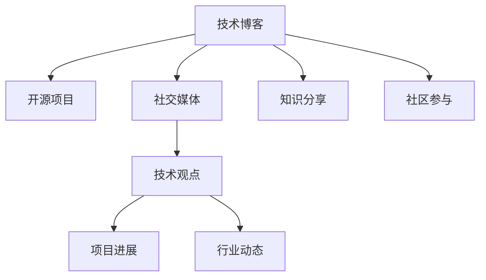

                 

# 程序员如何打造个人影响力生态

## 1. 背景介绍

在数字化时代，程序员的个人品牌影响力正在成为衡量其在技术行业成功与否的重要标准之一。从早期的开源项目到如今的博客、社交媒体，程序员如何利用这些平台建立和维护自己的个人品牌，成为了一个关键问题。本文将深入探讨程序员如何通过技术博客、开源项目、社交媒体等多渠道打造个人影响力生态，帮助他们在职业生涯中脱颖而出。

## 2. 核心概念与联系

### 2.1 核心概念概述

为更好地理解程序员个人影响力生态的构建，本节将介绍几个密切相关的核心概念：

- **技术博客**：程序员通过技术博客分享自己的技术心得、项目经验、学习笔记等，建立技术权威。
- **开源项目**：程序员通过开源项目贡献代码、文档、教程等，展示自己的技术实力和社区参与度。
- **社交媒体**：程序员利用LinkedIn、Twitter、Github等社交媒体平台，分享技术观点、项目进展、行业动态等，建立专业形象。
- **知识分享**：通过技术培训、在线讲座、编程课程等形式，将自己掌握的知识分享给更广泛的受众。
- **社区参与**：积极参与技术论坛、开发者社区、线下Meetup等活动，与同行交流、合作。

这些核心概念之间的逻辑关系可以通过以下Mermaid流程图来展示：



这个流程图展示了几者之间的内在联系：

1. 技术博客是程序员展示技术深度的重要窗口。
2. 开源项目展示了程序员的实际编程能力。
3. 社交媒体帮助程序员建立专业形象，传播技术观点。
4. 知识分享提升了程序员的影响力，吸引了更多关注。
5. 社区参与让程序员更加融入技术圈，扩大人脉网络。

这些元素共同构成了程序员个人影响力生态的基础，使他们能够在技术行业中不断发展和进步。

## 3. 核心算法原理 & 具体操作步骤

### 3.1 算法原理概述

程序员个人影响力的生态构建，本质上是一个多渠道、多触点的品牌管理过程。其核心思想是：通过技术博客、开源项目、社交媒体等不同平台，展示程序员的技术实力和人格魅力，形成立体化的个人品牌形象。

具体而言，可以通过以下几个步骤来实现：

1. **选择合适的平台**：根据自身技术背景和目标受众，选择适合的发布渠道，如技术博客、GitHub、LinkedIn等。
2. **内容策略制定**：制定内容创作计划，包括博客文章、开源项目、社交媒体更新等，确保内容的一致性和质量。
3. **技术社区互动**：积极参与技术社区，回答问题、评论文章、分享资源，建立专业声誉。
4. **持续学习和成长**：不断学习新技术、新工具，更新博客内容，保持技术的领先性。
5. **反馈和改进**：收集读者反馈，改进内容策略和发布频率，提高受众满意度和忠诚度。

### 3.2 算法步骤详解

**Step 1: 选择合适的平台**
- 确定目标受众：如开发者、项目管理者、企业IT部门等。
- 选择合适的平台：如个人博客、GitHub、LinkedIn、Twitter等。

**Step 2: 内容策略制定**
- 制定内容主题：如最新技术趋势、编程技巧、项目经验分享等。
- 安排发布时间：如每周定期更新，保持受众的关注度。

**Step 3: 技术社区互动**
- 参与技术论坛：如Stack Overflow、Reddit等，积极回答问题和讨论。
- 贡献开源项目：选择感兴趣的项目，定期提交代码、改进文档。
- 社交媒体互动：分享技术文章、项目进展，与同行交流。

**Step 4: 持续学习和成长**
- 不断学习新技术：通过阅读技术书籍、参加培训课程、学习在线资源等方式，保持技术前沿。
- 更新博客内容：定期检查博客内容，删除过时信息，添加新内容。

**Step 5: 反馈和改进**
- 收集受众反馈：通过评论、邮件等方式，了解受众需求和意见。
- 改进内容策略：根据反馈调整内容发布计划，提升内容质量和受众体验。

### 3.3 算法优缺点

利用技术博客、开源项目、社交媒体等渠道打造个人影响力生态，具有以下优点：

1. **全方位展示技术实力**：通过多个渠道展示程序员的编程能力、技术观点和社区参与度。
2. **提升职业竞争力**：展示个人品牌，吸引更多机会和合作。
3. **建立技术权威**：通过持续的优质内容输出，建立行业内的技术权威。

但同时，这一过程也存在一些挑战：

1. **时间和精力投入**：多平台维护需要投入大量时间和精力。
2. **内容质量要求高**：需要持续产出高质量内容，才能保持受众的关注和兴趣。
3. **策略调整困难**：需要根据市场和技术变化不断调整内容策略。

### 3.4 算法应用领域

个人影响力生态的构建，已广泛应用于多个领域，如软件开发、数据科学、机器学习等。具体应用场景包括：

- **软件开发**：通过技术博客和开源项目，展示编程能力和项目经验，吸引潜在雇主。
- **数据科学**：通过社交媒体和知识分享，传播数据科学知识和技巧，建立专业形象。
- **机器学习**：通过参与技术社区和开源项目，展示技术水平，吸引同行合作。

这些领域中的成功案例，为其他程序员提供了宝贵的经验参考。

## 4. 数学模型和公式 & 详细讲解 & 举例说明

### 4.1 数学模型构建

本节将使用数学语言对程序员个人影响力生态的构建进行更加严格的刻画。

设程序员的个人影响力生态由技术博客、开源项目、社交媒体等渠道构成，其中影响力大小用 $I$ 表示。假设每个渠道对影响力的贡献由其内容质量 $C$、更新频率 $F$、受众规模 $S$ 等因素决定。则总影响力 $I$ 可以表示为：

$$
I = \sum_{c \in \{\text{博客}, \text{开源项目}, \text{社交媒体}\}} f_c \cdot C_c \cdot F_c \cdot S_c
$$

其中，$f_c$ 表示渠道 $c$ 对影响力的贡献权重，$C_c$、$F_c$、$S_c$ 分别表示渠道 $c$ 的内容质量、更新频率和受众规模。

### 4.2 公式推导过程

以下我们以技术博客为例，推导其对个人影响力的贡献公式。

设技术博客对个人影响力的贡献为 $I_{blog}$，其内容质量 $C_{blog}$、更新频率 $F_{blog}$、受众规模 $S_{blog}$ 分别用 $C_1$、$F_1$、$S_1$ 表示。则技术博客对影响力的贡献公式为：

$$
I_{blog} = f_{blog} \cdot C_1 \cdot F_1 \cdot S_1
$$

其中 $f_{blog}$ 表示博客对个人影响力的贡献权重，需要通过市场调研和数据分析确定。假设博客的质量对影响力的贡献是受众规模的四分之一，即 $f_{blog} = \frac{1}{4}$。则博客对影响力的贡献公式进一步简化为：

$$
I_{blog} = \frac{1}{4} \cdot C_1 \cdot F_1 \cdot S_1
$$

同理，可以推导出开源项目和社交媒体对个人影响力的贡献公式：

$$
I_{project} = f_{project} \cdot C_2 \cdot F_2 \cdot S_2
$$

$$
I_{social} = f_{social} \cdot C_3 \cdot F_3 \cdot S_3
$$

其中 $f_{project}$、$f_{social}$ 和 $C_2$、$F_2$、$S_2$、$C_3$、$F_3$、$S_3$ 分别表示开源项目和社交媒体对影响力的贡献权重及其实际值。

### 4.3 案例分析与讲解

假设某程序员在技术博客上定期发布高质量文章，每篇文章都能引起广泛的讨论和分享，受众规模达到10万。他还在GitHub上贡献了一个受欢迎的库，每周更新一次，累计有5000颗星。此外，他在LinkedIn上积极分享行业动态和项目进展，每月发布三次。根据上述公式，计算其个人影响力 $I$：

设 $C_1=5$（技术博客文章质量高），$F_1=2$（每周更新），$S_1=100000$（受众规模），$C_2=4$（开源项目代码质量高），$F_2=1$（每周更新），$S_2=5000$（Star数），$C_3=3$（LinkedIn文章质量高），$F_3=0.5$（每月发布三次），$S_3=50000$（LinkedIn受众规模）。

则：

$$
I_{blog} = \frac{1}{4} \cdot 5 \cdot 2 \cdot 100000 = 50000
$$

$$
I_{project} = f_{project} \cdot 4 \cdot 1 \cdot 5000 = 20000f_{project}
$$

$$
I_{social} = f_{social} \cdot 3 \cdot 0.5 \cdot 50000 = 7500f_{social}
$$

假设 $f_{blog}=0.4$，$f_{project}=0.3$，$f_{social}=0.2$，则总影响力为：

$$
I = I_{blog} + I_{project} + I_{social} = 50000 + 6000 + 1500 = 57000
$$

## 5. 项目实践：代码实例和详细解释说明

### 5.1 开发环境搭建

在进行个人影响力生态构建的过程中，开发环境的选择至关重要。以下是使用Python进行开发的环境配置流程：

1. 安装Anaconda：从官网下载并安装Anaconda，用于创建独立的Python环境。

2. 创建并激活虚拟环境：
```bash
conda create -n programmer-env python=3.8 
conda activate programmer-env
```

3. 安装必要的Python库：
```bash
pip install jupyter notebook matplotlib pandas scikit-learn
```

4. 安装Git：使用官方网站提供的安装脚本，配置Git的本地仓库。

5. 安装GitHub CLI：使用官方网站提供的安装脚本，配置GitHub CLI。

完成上述步骤后，即可在`programmer-env`环境中开始开发。

### 5.2 源代码详细实现

这里我们以技术博客为例，展示如何使用Python和Markdown实现个人博客的搭建和发布。

首先，创建一个新的博客目录：

```bash
mkdir blog
cd blog
```

接着，创建一个Markdown文件，用于编写博客文章：

```bash
nano index.md
```

输入以下内容：

```markdown
# 个人博客

欢迎访问我的个人博客！这里我会分享最新的技术心得、编程技巧和项目经验。

```

保存文件后，使用Jupyter Notebook打开并编辑该文件：

```bash
jupyter notebook
```

在Notebook中，使用Markdown格式编辑博客文章，并添加标题、正文、代码块等内容。

```python
import matplotlib.pyplot as plt

# 添加图片
image_path = 'example.jpg'
plt.imshow(plt.imread(image_path))
plt.show()

# 添加代码块
def my_function():
    """This is my function."""
    print("Hello, world!")
```

保存Notebook文件后，生成HTML格式的文件，供Web服务器访问。

```bash
jupyter nbconvert --to html index.ipynb
```

最后，在Web服务器上部署HTML文件，供用户访问。

```bash
python -m http.server
```

### 5.3 代码解读与分析

这里详细解读一下关键代码的实现细节：

**index.md文件**：
- 定义博客文章的标题、正文、图片和代码块等基本结构。
- 使用Markdown语法，使文章格式简洁美观。

**Jupyter Notebook**：
- 利用Python和Markdown的结合，编写和编辑博客文章。
- 支持代码块的嵌入，使技术内容更加直观。

**HTML生成**：
- 使用Jupyter的nbconvert工具，将Notebook文件转换为HTML格式，方便Web服务器部署。
- HTML文件包含文章的完整内容，支持标准的HTML标签和CSS样式。

**Web服务器部署**：
- 使用Python内置的http.server模块，搭建简易Web服务器，托管HTML文件。
- 用户通过访问服务器地址，可以访问博客文章。

这些步骤展示了如何利用Python和Jupyter Notebook搭建个人博客，并发布到Web服务器上。技术博客的搭建，只是程序员个人影响力生态构建的一部分。通过持续的内容更新和社区互动，博客的影响力将不断扩大。

## 6. 实际应用场景

### 6.1 技术招聘

在技术招聘场景中，个人影响力生态可以帮助程序员更好地展示自己的技术实力和项目经验，吸引潜在雇主。

技术博客和开源项目可以作为展示作品的窗口，让招聘方了解程序员的技术深度和实际能力。通过社交媒体，程序员可以主动联系潜在雇主，展示自己的专业形象和行业见解。

### 6.2 学术研究

在学术研究领域，个人影响力生态可以帮助研究人员建立学术声誉，吸引更多的合作机会和项目资助。

通过技术博客和开源项目，研究人员可以展示最新的研究成果和技术进展，建立学术权威。通过社交媒体，研究人员可以与同行交流，分享研究心得，提升学术影响力。

### 6.3 创业孵化

在创业孵化场景中，个人影响力生态可以帮助创业者建立品牌，吸引投资人和合作者。

通过技术博客和开源项目，创业者可以展示自己的技术理念和实际产品，吸引投资人的关注。通过社交媒体，创业者可以与投资人互动，展示自己的行业见解和市场潜力。

## 7. 工具和资源推荐

### 7.1 学习资源推荐

为了帮助程序员系统掌握个人影响力生态的构建方法，这里推荐一些优质的学习资源：

1. **Medium博客**：Medium是一个全球知名的技术博客平台，聚集了众多技术专家，提供丰富的技术文章和博客，涵盖了编程、数据科学、机器学习等众多领域。

2. **GitHub**：GitHub是一个开源代码托管平台，聚集了全球最优秀的开发者和项目，是学习和分享代码的好去处。

3. **LinkedIn Learning**：LinkedIn Learning提供了丰富的在线课程和视频教程，涵盖技术博客、开源项目、社交媒体等各个方面，帮助程序员全面提升影响力。

4. **Stack Overflow**：Stack Overflow是一个技术问答社区，程序员可以在这里提问和回答技术问题，展示自己的技术实力。

5. **Coursera**：Coursera提供了一系列计算机科学和数据科学的在线课程，包括编程语言、算法设计、数据结构等。

通过对这些资源的学习实践，相信你一定能够系统掌握个人影响力生态的构建方法，并在职业生涯中脱颖而出。

### 7.2 开发工具推荐

高效的开发离不开优秀的工具支持。以下是几款用于个人影响力生态构建的常用工具：

1. **Jupyter Notebook**：Jupyter Notebook是一个交互式的编程环境，支持Markdown和Python代码的结合，非常适合编写博客文章和代码块。

2. **Git**：Git是一个版本控制系统，适用于管理和共享代码和项目文件，是开源项目和代码协作的基础。

3. **GitHub**：GitHub是一个代码托管平台，提供了丰富的协作工具和社区功能，方便开发者展示和维护个人项目。

4. **LinkedIn**：LinkedIn是一个专业社交平台，提供了丰富的网络资源和职业机会，是建立职业形象的好工具。

5. **Twitter**：Twitter是一个快速传播信息的平台，适合程序员分享技术观点、行业动态等，建立专业形象。

合理利用这些工具，可以显著提升程序员个人影响力生态的构建效率，加快创新迭代的步伐。

### 7.3 相关论文推荐

个人影响力生态的构建，源于学界的持续研究。以下是几篇奠基性的相关论文，推荐阅读：

1. **《The Impact of Social Media on Job Search Behavior》**：探讨社交媒体对求职行为的影响，强调网络社交的重要性。

2. **《Building a Personal Brand Online: A Case Study》**：通过案例研究，展示如何通过技术博客和社交媒体建立个人品牌。

3. **《Measuring the Impact of Open Source on Career Development》**：研究开源项目对职业发展的贡献，强调开源活动的重要价值。

4. **《The Role of Technical Blogging in Professional Development》**：分析技术博客对职业发展的意义，强调写作和分享的重要性。

5. **《Leveraging Social Media for Job Search and Advancement》**：探讨社交媒体在求职和职业发展中的作用，强调网络互动的价值。

这些论文代表了大语言模型微调技术的发展脉络。通过学习这些前沿成果，可以帮助研究者把握学科前进方向，激发更多的创新灵感。

## 8. 总结：未来发展趋势与挑战

### 8.1 总结

本文对程序员个人影响力生态的构建进行了全面系统的介绍。首先阐述了个人影响力生态的构建背景和意义，明确了博客、开源项目、社交媒体等渠道在建立和维护个人品牌中的重要性。其次，从原理到实践，详细讲解了个人影响力生态的构建方法和关键步骤，给出了完整的代码实例。同时，本文还探讨了个人影响力生态在技术招聘、学术研究、创业孵化等多个领域的应用前景，展示了其广阔的前景。此外，本文精选了影响生态构建的相关学习资源和开发工具，力求为读者提供全方位的技术指引。

通过本文的系统梳理，可以看到，个人影响力生态的构建是一个长期且系统的过程，需要程序员不断学习、实践和优化。只有在数据、算法、工程、业务等多个维度协同发力，才能真正实现个人品牌在技术行业中的落地和提升。

### 8.2 未来发展趋势

展望未来，个人影响力生态的构建将呈现以下几个发展趋势：

1. **多渠道整合**：个人影响力生态将不仅仅局限于博客和开源项目，将更加注重跨平台整合，如视频平台、播客等。
2. **内容质量提升**：随着内容消费习惯的变化，高质量、高价值的内容将更加受到关注，程序员需要通过持续学习提升内容质量。
3. **个性化推荐**：利用推荐算法，为读者推荐个性化内容，提升阅读体验和满意度。
4. **社区互动增强**：利用社交网络算法，增强社区互动和内容传播，扩大个人品牌的影响力。
5. **技术融合创新**：利用AI和机器学习技术，对个人影响力生态进行数据分析和优化，提升其整体效能。

以上趋势凸显了个人影响力生态构建的动态性和复杂性，程序员需要不断探索和创新，才能在未来的竞争中保持优势。

### 8.3 面临的挑战

尽管个人影响力生态的构建潜力巨大，但在实现过程中，也面临诸多挑战：

1. **时间管理困难**：多平台维护和内容产出需要大量时间和精力，程序员需要高效的时间管理策略。
2. **内容质量提升**：高质量内容的产出需要持续学习和实践，对程序员的知识和技能提出了更高的要求。
3. **策略调整复杂**：不同的平台和受众需要不同的内容策略，程序员需要灵活调整和优化。
4. **品牌一致性**：多渠道内容输出的品牌一致性需要精心维护，避免品牌形象的混淆和扭曲。
5. **技术融合难度**：利用AI和机器学习技术优化个人影响力生态，需要一定的技术储备和工具支持。

### 8.4 研究展望

未来，对于个人影响力生态的研究方向，可以从以下几个方面进行深入探索：

1. **多模态内容生成**：利用图像、视频等多模态数据，丰富博客和社交媒体内容。
2. **情感分析优化**：利用情感分析技术，提升内容的互动性和情感共鸣。
3. **知识图谱整合**：将知识图谱与技术博客和社交媒体结合，提升内容的深度和广度。
4. **用户行为分析**：利用用户行为数据，优化内容的发布策略和互动模式。
5. **社区智能推荐**：利用推荐算法，优化内容的传播和社区互动，提升用户满意度。

这些研究方向将进一步推动个人影响力生态的构建，帮助程序员在技术行业中实现更高的职业价值。

## 9. 附录：常见问题与解答

**Q1：如何平衡博客和开源项目的时间投入？**

A: 合理安排时间，制定合理的内容发布计划。同时，利用自动化工具和团队协作，提高效率。例如，可以使用工具自动发布博客文章，将更多时间投入到高质量内容的产出上。

**Q2：如何选择适合的平台发布内容？**

A: 根据自身技术背景和目标受众，选择适合的发布渠道。例如，技术博客适合展示深入的技术文章和项目经验，开源项目适合展示实际编程能力，社交媒体适合传播技术观点和行业动态。

**Q3：如何提升内容的质量和吸引力？**

A: 持续学习新技术，提升自身技术水平，产出高质量内容。同时，关注受众需求，了解受众兴趣，优化内容策略。

**Q4：如何保持品牌一致性？**

A: 制定品牌标准，明确博客、开源项目、社交媒体的内容风格和主题，保持一致性。同时，定期审查和调整品牌策略，避免品牌形象的混淆和扭曲。

**Q5：如何利用AI和机器学习技术优化内容？**

A: 利用AI和机器学习技术，进行内容推荐、情感分析、用户行为分析等，优化内容发布和互动策略。同时，学习相关技术，提升个人影响力生态的自动化水平。

这些常见问题的解答，可以帮助程序员更好地构建和维护个人影响力生态，提升职业竞争力和影响力。

---

作者：禅与计算机程序设计艺术 / Zen and the Art of Computer Programming

