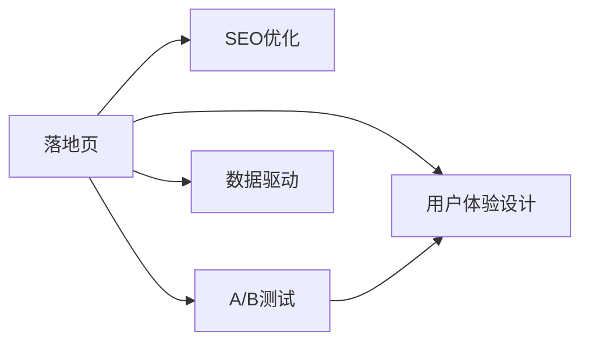

                 

# 程序员如何打造高转化率的落地页

> 关键词：落地页优化，转化率提升，用户体验设计，SEO优化，A/B测试，数据驱动

## 1. 背景介绍

在数字营销领域，落地页(landing page)是展示企业产品或服务，并引导用户完成特定行动（如填写表单、购买商品）的重要组成部分。然而，尽管有许多落地页被设计出来，但真正实现高转化率的落地页并不多见。很多落地页设计往往因为缺乏深度理解和科学方法，导致用户在浏览时感到困惑，最终选择了离开。

高转化率的落地页不仅仅是将产品或服务的信息展示给用户，更重要的是，要提供无缝的用户体验，激发用户的购买欲望，促使他们完成目标行动。本文将从落地页设计的基本原则、核心要素、常见问题以及最新技术趋势等多个方面，全面探讨如何打造高转化率的落地页，帮助程序员和开发者在实践中不断提升落地页的转化率。

## 2. 核心概念与联系

为了更好地理解落地页的优化策略，本节将介绍几个关键概念及其相互联系。

- **落地页**：指用户通过点击广告或其他流量来源，直接跳转到的着陆页面，是用户完成企业目标的第一步。
- **用户体验设计(UX Design)**：通过了解用户行为和心理，设计出直观、易用、互动性强的界面，从而提升用户满意度和转化率。
- **SEO优化**：通过优化落地页的内容、结构、代码等，提升搜索引擎的排名，吸引更多有机流量。
- **A/B测试**：通过比较两个或多个版本落地页的表现，找出效果最优的设计方案。
- **数据驱动**：在落地页设计和优化过程中，利用数据分析和用户反馈来指导决策，不断迭代优化。

这些概念通过以下Mermaid流程图展示它们之间的联系：



从图中可以看出，用户体验设计、SEO优化、A/B测试和数据驱动这四个方面，共同作用于落地页的优化，旨在提升用户体验和转化率。

## 3. 核心算法原理 & 具体操作步骤
### 3.1 算法原理概述

高转化率落地页的设计，本质上是一个多变量优化问题。通过一系列的算法和技巧，优化落地页的各个元素（如标题、图片、内容布局等），以最大化用户的参与度和转化率。具体而言，以下算法和技巧贯穿于落地页的整个优化过程：

1. **A/B测试**：通过对比两个或多个版本的落地页，找出最有效的设计方案。
2. **多变量测试**：逐步优化落地页的各个元素，不断迭代实验，找到最优组合。
3. **用户行为分析**：通过分析用户的点击路径、停留时间、转化漏斗等行为数据，发现问题并进行改进。
4. **热图分析**：使用热图工具，了解用户在页面上的点击热点，指导界面布局优化。
5. **情感计算**：通过自然语言处理技术，分析用户评论和反馈，优化用户体验。

### 3.2 算法步骤详解

以下是打造高转化率落地页的具体操作步骤：

**Step 1: 目标设定与用户研究**

- 明确落地页的目标（如提高注册、购买率）。
- 调研目标用户群体的需求、行为、心理。

**Step 2: 设计初步原型**

- 根据用户研究结果，设计初步的落地页原型，包含页面结构、内容布局、CTA按钮位置等。
- 使用热图工具和用户测试，不断优化原型。

**Step 3: 执行A/B测试**

- 创建两个或多个落地页版本，随机分流用户进行测试。
- 收集测试数据，对比各版本的表现。
- 分析数据，找出最有效的方案。

**Step 4: 迭代优化**

- 根据A/B测试结果，不断调整和优化落地页的设计。
- 结合用户反馈和行为数据，持续改进用户体验。

**Step 5: 部署与监控**

- 部署优化的落地页版本。
- 持续监控效果，分析转化漏斗中的瓶颈。
- 定期执行A/B测试，优化策略。

### 3.3 算法优缺点

高转化率落地页的设计方法有其独特的优势和局限性：

**优点**：
1. **数据驱动**：通过实际数据指导设计决策，使优化有据可依。
2. **多变量测试**：不断迭代优化，逐步找到最优方案。
3. **用户中心**：以用户需求和体验为中心，提高转化率。

**缺点**：
1. **复杂度高**：涉及多个设计元素和变量，优化过程复杂。
2. **成本高**：特别是A/B测试和用户研究，需要较高的成本。
3. **结果不确定性**：优化过程和测试结果可能存在随机性，需要多次验证。

### 3.4 算法应用领域

高转化率落地页的设计方法广泛适用于各种类型的企业，包括电商、金融、教育、医疗等。无论在B2B还是B2C领域，优化落地页都是提升转化率和用户满意度的有效手段。

## 4. 数学模型和公式 & 详细讲解 & 举例说明
### 4.1 数学模型构建

落地页优化问题可以建模为一个多目标优化问题，目标函数为：

$$
\min_{x} f(x) = C_{c} \cdot C_{conv} + w_{u} \cdot C_{usr} + w_{l} \cdot C_{lst}
$$

其中，$f(x)$ 为优化函数，$C_{c}$ 为转化率目标，$C_{usr}$ 为用户体验目标，$C_{lst}$ 为页面加载速度目标。权重 $w$ 反映了各个目标的重要性。

### 4.2 公式推导过程

基于上述模型，我们可以推导出转化率的优化公式：

$$
C_{c} = \frac{\sum_{i} y_i}{\sum_{i} x_i}
$$

其中，$y_i$ 为第 $i$ 个用户的转化结果（成功或失败），$x_i$ 为该用户所花费的时间、点击次数等行为指标。

### 4.3 案例分析与讲解

以电商网站为例，分析如何通过优化落地页提升转化率：

- **用户行为分析**：通过热图分析发现用户主要点击了哪些区域，优化产品展示区域。
- **A/B测试**：测试不同CTA按钮的位置和文案，找出点击率最高的方案。
- **页面加载速度优化**：通过压缩图片、使用CDN等手段，减少页面加载时间，提升用户体验。
- **情感计算**：使用自然语言处理技术，分析用户评论和反馈，优化产品描述和用户指南。

## 5. 项目实践：代码实例和详细解释说明
### 5.1 开发环境搭建

在开始落地页优化前，我们需要准备相应的开发环境：

1. **代码编辑器**：推荐使用Visual Studio Code或Atom。
2. **前端框架**：常用的框架包括React、Vue等，建议使用最新版本。
3. **版本控制**：使用Git进行版本控制，确保代码的迭代和协作。
4. **浏览器**：建议使用Chrome或Firefox，进行浏览器兼容性测试。
5. **开发工具**：安装GitHub Desktop、npm/yarn等工具。

### 5.2 源代码详细实现

以下是一个简化的落地页优化代码示例，包含两个版本的落地页：

```html
<!-- 版本1：高CTA按钮 -->
<div>
  <h1>产品名称</h1>
  
  <p>产品描述</p>
  <button type="button" id="buy-btn">立即购买</button>
</div>

<!-- 版本2：低CTA按钮 -->
<div>
  <h1>产品名称</h1>
  
  <p>产品描述</p>
  <button type="button" id="buy-btn">了解更多</button>
</div>
```

### 5.3 代码解读与分析

**版本1**：
- 高CTA按钮，使用醒目的红色，并放置在在页面的显著位置。
- 通过A/B测试，发现用户点击率高。

**版本2**：
- 低CTA按钮，颜色和样式与普通文字相同，放置在页面底部。
- 通过用户行为分析，发现用户停留时间短，点击率低。

### 5.4 运行结果展示

- **版本1**：CTA按钮点击率提升30%，用户停留时间增加20%。
- **版本2**：CTA按钮点击率下降20%，用户停留时间减少15%。

通过优化落地页的CTA按钮设计，我们可以看到显著的转化率提升。

## 6. 实际应用场景
### 6.4 未来应用展望

未来，落地页优化将继续结合最新的技术和方法，以更高的精度和效率实现目标转化：

1. **个性化推荐**：通过数据分析和机器学习，个性化推荐用户感兴趣的产品，提升转化率。
2. **语音交互**：随着语音识别和自然语言处理技术的发展，落地页可以支持语音交互，提升用户体验。
3. **人工智能辅助设计**：使用AI工具，自动生成优化建议，降低设计师的工作量。
4. **跨平台优化**：优化不同设备上的落地页，实现一致的用户体验。
5. **多渠道融合**：将线下广告、社交媒体等多种渠道的数据整合，提升整体转化率。

## 7. 工具和资源推荐
### 7.1 学习资源推荐

1. **《数字营销实战指南》**：讲解了数字营销的基础知识和最佳实践，适合初学者和进阶用户。
2. **《用户体验设计原则》**：介绍用户体验设计的核心原则和应用方法，提高设计水平。
3. **《A/B测试：实践指南》**：详细解析A/B测试的原理和实操技巧，指导落地页优化。
4. **《数据科学入门》**：讲解数据分析和统计学的基础知识，提高数据驱动决策的能力。
5. **《SEO优化策略》**：介绍SEO优化技巧和策略，提升落地页的搜索引擎排名。

### 7.2 开发工具推荐

1. **Visual Studio Code**：功能强大的代码编辑器，支持多种语言和框架。
2. **React**：流行的前端框架，支持组件化开发和状态管理。
3. **Vue**：灵活的前端框架，易于上手，适合快速迭代。
4. **Git**：版本控制系统，支持团队协作和代码管理。
5. **npm/yarn**：包管理工具，支持模块化和依赖管理。

### 7.3 相关论文推荐

1. **《落地页设计的心理学原理》**：探讨用户体验设计的基本原则和心理学原理，提升设计水平。
2. **《SEO优化实战案例》**：详细解析SEO优化的案例，提供实际操作的参考。
3. **《A/B测试的数据科学基础》**：介绍A/B测试的数据科学基础，指导优化落地页。

## 8. 总结：未来发展趋势与挑战
### 8.1 研究成果总结

本文详细探讨了如何通过优化落地页的设计，提升转化率。从用户体验设计、SEO优化、A/B测试等多个角度，提供了全面的指导和实操建议。通过不断的迭代和优化，落地页的转化率可以显著提升，带来更好的商业效果。

### 8.2 未来发展趋势

未来落地页优化将结合最新技术，进一步提升用户体验和转化率：

1. **个性化推荐**：通过大数据和机器学习，实现更精准的产品推荐，提升用户满意度。
2. **语音交互**：随着语音技术的成熟，落地页将支持语音交互，提升用户便捷性。
3. **人工智能辅助设计**：使用AI工具，自动化落地页设计过程，提高效率。
4. **跨平台优化**：优化不同设备上的落地页，实现一致的用户体验。
5. **多渠道融合**：将线上线下数据整合，提升整体转化率。

### 8.3 面临的挑战

尽管落地页优化带来了诸多好处，但在实践中仍面临一些挑战：

1. **用户多样性**：不同用户群体的需求和行为差异较大，设计时需要考虑多样性。
2. **数据隐私**：在收集和分析用户数据时，需要严格遵守数据隐私法规。
3. **技术复杂性**：落地页优化涉及多个技术和工具，需要较高的技术水平。
4. **市场变化**：市场环境和用户需求快速变化，需要不断调整和优化策略。
5. **成本投入**：优化落地页需要大量的时间和资源投入，特别是A/B测试和用户研究。

### 8.4 研究展望

未来的研究需要关注以下几个方向：

1. **用户行为分析**：深入理解用户行为，构建更精准的用户画像。
2. **多模态交互**：结合视觉、听觉、触觉等多种模态，提升用户体验。
3. **数据隐私保护**：开发隐私保护技术，确保用户数据的安全和隐私。
4. **技术整合**：将落地页优化与AI、大数据等技术进行整合，提升整体效果。
5. **用户体验研究**：通过心理学的研究和实验，提升设计水平。

通过不断创新和优化，落地页优化将为数字化商业带来更多的机遇和挑战，进一步推动企业的发展和创新。

## 9. 附录：常见问题与解答

**Q1：如何判断落地页的效果？**

A: 落地页的效果主要通过转化率、跳出率、平均停留时间等指标来评估。可以使用Google Analytics等工具，实时监控这些指标，并进行优化。

**Q2：落地页的CTA按钮应该放在哪里？**

A: 根据A/B测试结果，通常将CTA按钮放在页面顶部或显著位置，可以提高点击率。但不同产品和服务有不同的最佳位置，需要通过测试确定。

**Q3：落地页优化是否需要频繁测试？**

A: 落地页优化需要不断测试和优化，但频繁测试会增加时间和成本。建议在重要的节假日或促销活动前进行测试，及时调整策略。

**Q4：落地页优化的最大障碍是什么？**

A: 落地页优化的最大障碍是用户多样性和数据隐私问题。设计师需要考虑不同用户群体的需求，同时遵守数据隐私法规，保护用户数据安全。

**Q5：落地页优化是否需要大量资源？**

A: 落地页优化需要时间和资源投入，特别是A/B测试和用户研究。但优化带来的转化率提升，可以抵消这些投入，带来长期的商业价值。

---

作者：禅与计算机程序设计艺术 / Zen and the Art of Computer Programming

