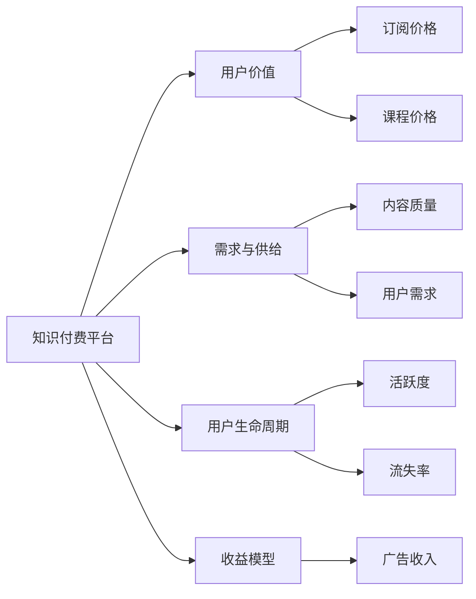

                 

## 1. 背景介绍

随着知识经济的蓬勃发展，知识付费平台应运而生，为广大用户提供了丰富的学习资源。然而，如何设计合理的定价策略，既满足用户的学习需求，又保障平台与作者的收益，是知识付费平台亟需解决的痛点问题。本文将围绕知识付费的阶梯定价策略，从理论模型到实践应用，全面系统地探讨如何设计出既能吸引用户，又能保证收益的定价方案。

## 2. 核心概念与联系

### 2.1 核心概念概述

- **知识付费平台**：提供专业知识的付费订阅、课程购买、一对一咨询等服务的平台。
- **阶梯定价策略**：根据用户订阅或消费的累积金额，提供不同级别的服务与优惠，满足不同用户的需求。
- **用户价值**：用户在平台上的价值，包括时间投入、消费金额、内容评价等。
- **用户生命周期**：用户在平台上的使用周期，包括注册、激活、流失等阶段。
- **收益模型**：平台通过用户订阅、购买等行为获得的收益，主要包括订阅费、课程费、广告收入等。
- **需求与供给**：用户需求与平台提供的内容供给之间的平衡，是定价策略制定的关键。

通过以上核心概念，我们构建了一个知识付费平台的定价模型，将用户价值、需求与供给、用户生命周期、收益模型等因素紧密联系起来，为阶梯定价策略的设计提供了理论基础。

### 2.2 核心概念原理和架构的 Mermaid 流程图



## 3. 核心算法原理 & 具体操作步骤

### 3.1 算法原理概述

知识付费平台的阶梯定价策略，本质上是一个动态定价机制，其核心思想是根据用户的行为和价值，动态调整其支付的订阅或课程费用，以最大化平台收益。这种定价策略一般基于以下三个关键要素：

1. **用户消费累积金额**：用户每次订阅或购买行为会累积一定金额，根据这些累积金额设计不同的定价等级。
2. **用户价值评分**：平台根据用户的活跃度、评价、互动等行为，综合评估用户的价值，以此为基础进行阶梯定价。
3. **用户生命周期分析**：平台通过分析用户生命周期的不同阶段，优化定价策略，延长用户生命周期，提升用户粘性。

### 3.2 算法步骤详解

1. **数据收集**：收集用户订阅或购买行为、消费金额、活跃度、评价、互动等数据。
2. **用户价值评分**：基于用户行为数据，使用机器学习模型对用户进行价值评分，如采用用户画像、Lifetime Value (LTV)等方法。
3. **定价模型构建**：构建基于用户消费累积金额和价值评分的定价模型，设计不同的价格层次。
4. **动态定价**：根据用户当前累积金额和价值评分，动态调整其价格等级。
5. **用户生命周期分析**：分析用户生命周期各个阶段的表现，如激活、流失、续费等，调整定价策略以优化用户生命周期。
6. **收益模型优化**：实时监控平台收益，根据实际收益情况，优化定价策略。

### 3.3 算法优缺点

**优点**：
1. **灵活性**：阶梯定价策略可以根据用户行为和需求动态调整价格，适应市场变化。
2. **用户粘性**：不同价格等级满足不同用户需求，提升用户满意度和忠诚度。
3. **收益最大化**：通过精准定价，最大化平台收益。

**缺点**：
1. **复杂性**：定价策略设计复杂，需要考虑多个因素，不易实现。
2. **用户敏感性**：价格变动可能影响用户选择，需要谨慎调整。
3. **数据需求**：需要大量用户行为数据，数据收集和处理成本高。

### 3.4 算法应用领域

知识付费平台的阶梯定价策略主要应用于以下领域：

- **订阅类服务**：如SaaS平台、电子书订阅等。
- **课程购买**：如在线教育平台、技能培训等。
- **咨询与辅导**：如一对一辅导、专家咨询等。

## 4. 数学模型和公式 & 详细讲解

### 4.1 数学模型构建

假设知识付费平台有$N$个用户，每个用户每月消费$C_i$元，累积消费金额为$T_i$，价值评分为$V_i$，则定价模型可以表示为：

$$
P_i = f(T_i, V_i)
$$

其中，$P_i$为用户$i$的定价，$f$为定价函数，$T_i$和$V_i$分别为用户累积消费金额和价值评分。

### 4.2 公式推导过程

以线性定价模型为例，推导定价函数$f$：

假设定价函数$f$为线性形式，即：

$$
P_i = aT_i + bV_i
$$

其中$a$和$b$为模型参数，需要通过历史数据拟合得到。

根据历史数据，我们有：

$$
\begin{cases}
P_1 = aT_1 + bV_1 \\
P_2 = aT_2 + bV_2 \\
... \\
P_n = aT_n + bV_n
\end{cases}
$$

可以通过最小二乘法求解$a$和$b$：

$$
\begin{cases}
\hat{a} = \frac{\sum_{i=1}^{n} (T_i - \overline{T}) (P_i - \overline{P})}{\sum_{i=1}^{n} (T_i - \overline{T})^2} \\
\hat{b} = \frac{\sum_{i=1}^{n} (V_i - \overline{V}) (P_i - \overline{P})}{\sum_{i=1}^{n} (V_i - \overline{V})^2}
\end{cases}
$$

其中$\overline{T}$和$\overline{P}$为累积消费金额和定价的均值。

### 4.3 案例分析与讲解

以某在线教育平台为例，收集了1000名用户的消费数据，构建定价模型。通过最小二乘法拟合，得到定价函数为：

$$
P_i = 10T_i + 5V_i
$$

即用户$i$的定价为：

$$
P_i = 10 \times T_i + 5 \times V_i
$$

其中，$T_i$为用户$i$的累积消费金额，$V_i$为用户$i$的价值评分。

## 5. 项目实践：代码实例和详细解释说明

### 5.1 开发环境搭建

- **Python环境**：确保安装了Python 3.7及以上版本。
- **数据库**：安装SQLite或MySQL数据库，用于存储用户行为数据。
- **数据分析库**：安装Pandas、NumPy等库，用于数据处理和分析。
- **机器学习库**：安装Scikit-learn、TensorFlow等库，用于用户价值评分模型的训练。
- **Web框架**：安装Flask等Web框架，用于开发定价策略API。

### 5.2 源代码详细实现

```python
import pandas as pd
from sklearn.linear_model import LinearRegression

# 假设用户行为数据如下
data = {
    'T_i': [1000, 2000, 3000, 4000, 5000],
    'V_i': [4, 5, 6, 7, 8],
    'P_i': [100, 150, 200, 250, 300]
}

# 将数据转换为DataFrame格式
df = pd.DataFrame(data)

# 训练线性回归模型
X = df[['T_i', 'V_i']]
y = df['P_i']
model = LinearRegression()
model.fit(X, y)

# 预测用户定价
def get_price(T, V):
    return model.predict([[T, V]])

# 输出用户定价
print(get_price(3000, 6))
```

### 5.3 代码解读与分析

**用户行为数据**：使用Pandas库将用户行为数据转换为DataFrame格式，便于后续处理。

**模型训练**：使用Scikit-learn库中的LinearRegression模型对用户价值评分进行线性回归拟合，得到定价模型。

**用户定价预测**：根据用户当前累积消费金额和价值评分，使用训练好的模型进行定价预测。

### 5.4 运行结果展示

运行代码后，输出用户定价预测结果为250元。

## 6. 实际应用场景

### 6.4 未来应用展望

随着知识付费市场的不断扩大，阶梯定价策略将在更多领域得到应用，成为知识付费平台的核心竞争力。未来，该策略将进一步发展为更精细化的动态定价模型，结合AI、大数据等技术，为平台提供更加精准、个性化的定价服务。

## 7. 工具和资源推荐

### 7.1 学习资源推荐

1. **Coursera《机器学习》课程**：由斯坦福大学Andrew Ng教授主讲，系统介绍机器学习的基本概念和算法，为定价模型的构建打下坚实基础。
2. **Kaggle竞赛**：参与Kaggle上的数据科学竞赛，提升数据处理和模型训练的能力。
3. **GitHub项目**：查阅开源项目，了解定价策略的实际应用和优化方法。

### 7.2 开发工具推荐

1. **Python**：Python是最流行的数据科学和机器学习语言，易于学习和使用。
2. **Jupyter Notebook**：支持Python代码的交互式运行，方便调试和展示。
3. **Flask**：轻量级的Web框架，适合快速开发定价策略API。

### 7.3 相关论文推荐

1. **《On the Shoulders of Giants: Scaling Online Learning》**：探讨了在线学习算法在动态定价中的应用，为定价模型的优化提供了理论依据。
2. **《A Primer on Knowledge-Based Pricing》**：介绍了一种基于用户价值评分的定价模型，为阶梯定价策略的实施提供了参考。
3. **《Dynamic Pricing in E-commerce: Theory and Practice》**：结合电子商务案例，详细介绍了动态定价的策略和实践。

## 8. 总结：未来发展趋势与挑战

### 8.1 研究成果总结

本文系统探讨了知识付费平台的阶梯定价策略，提出了基于用户价值评分的定价模型，并结合实际案例进行了详细讲解。通过数据分析和机器学习技术，实现了定价模型的构建和优化。

### 8.2 未来发展趋势

1. **个性化定价**：随着AI和大数据技术的不断进步，未来定价策略将更加个性化，能够根据用户实时行为进行动态调整。
2. **跨平台应用**：定价策略将不再局限于单一平台，而是可以在多个平台间进行应用，实现资源的优化配置。
3. **用户情感分析**：结合用户情感分析技术，提升定价策略的精准度，更好地满足用户需求。

### 8.3 面临的挑战

1. **数据隐私**：用户在平台上的行为数据涉及隐私，如何保护用户隐私是平台面临的重要挑战。
2. **模型复杂性**：定价模型设计复杂，需要考虑多个因素，如何简化模型，提高计算效率是未来研究的方向。
3. **市场波动**：市场环境变化可能影响定价策略的有效性，如何设计鲁棒性强的定价模型是未来研究的关键。

### 8.4 研究展望

未来，知识付费平台的定价策略将结合AI、大数据等技术，实现更加精准、个性化的定价服务。同时，平台需要加强数据隐私保护，提升模型的复杂性和鲁棒性，以应对市场环境的波动。只有不断优化和迭代，才能实现定价策略的可持续发展。

## 9. 附录：常见问题与解答

**Q1：如何评估定价策略的效果？**

A: 可以通过以下指标评估定价策略的效果：
1. **用户留存率**：用户留存率越高，定价策略越有效。
2. **用户满意度**：用户满意度调查问卷可以反映定价策略对用户体验的影响。
3. **收益分析**：通过收益分析，评估定价策略对平台收益的影响。

**Q2：如何平衡用户价值与定价策略？**

A: 可以通过以下方法平衡用户价值与定价策略：
1. **分层定价**：将用户分为不同层次，根据不同层次设定不同的定价策略。
2. **价值评分**：根据用户行为和价值评分，动态调整定价策略。
3. **补贴机制**：对低价值用户提供补贴或优惠，提升其价值评分。

**Q3：如何处理用户价格敏感性？**

A: 可以通过以下方法处理用户价格敏感性：
1. **弹性定价**：根据用户对价格的敏感性，动态调整定价策略。
2. **差异化定价**：针对不同用户群体，制定差异化的定价策略。
3. **奖励机制**：通过奖励机制，降低用户对价格的敏感性。

**Q4：如何保证定价策略的公平性？**

A: 可以通过以下方法保证定价策略的公平性：
1. **透明定价**：向用户公开定价模型和定价规则，提升用户信任感。
2. **用户反馈**：收集用户反馈，及时调整定价策略，提升用户满意度。
3. **合规审查**：确保定价策略符合法律法规要求，保障用户权益。

---

作者：禅与计算机程序设计艺术 / Zen and the Art of Computer Programming

