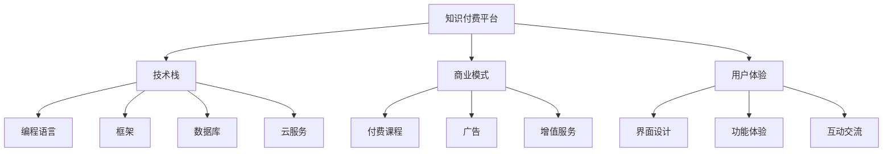

                 

# 程序员如何进行知识付费的竞品分析

> 关键词：知识付费,竞品分析,市场研究,技术栈,用户需求,商业模式,收入模式,收费策略,订阅模型,按需支付,增值服务,用户体验,平台搭建,技术挑战,可持续发展

## 1. 背景介绍

随着互联网的快速发展，知识付费模式正在成为新型的教育和信息传播方式，尤其受到年轻一代程序员的青睐。各大互联网平台如腾讯课堂、Coursera、Udemy等纷纷推出各自的付费课程，市场竞争日趋激烈。本分析将从程序员角度出发，全面评估知识付费平台，剖析其在技术栈、商业模式、用户体验等方面的差异与特点，以期帮助广大程序员做出明智的决策。

## 2. 核心概念与联系

### 2.1 核心概念概述

要深入了解知识付费平台的竞品分析，首先需要明确几个关键概念：

- **知识付费**：指通过互联网平台将专业知识或技能以付费形式进行传播与分享，以获取利润的一种新型商业模式。
- **竞品分析**：指对竞争对手的产品、市场策略、技术栈、用户需求等方面进行深入研究和比较，以评估自身的优势和劣势，制定相应的市场策略。
- **技术栈**：指平台使用的技术集，包括编程语言、框架、数据库、云服务等。
- **商业模式**：指平台通过知识付费、广告、增值服务等方式实现的收入模式。
- **用户体验**：指用户在使用平台时的感受和满意度，包括界面设计、功能体验、互动交流等。

这些概念之间相互联系，构成了一个完整的知识付费平台生态系统。

### 2.2 核心概念原理和架构的 Mermaid 流程图



这个流程图展示了知识付费平台的主要构成部分及其相互关系。接下来，我们将详细探讨这些关键概念的原理和架构。

## 3. 核心算法原理 & 具体操作步骤

### 3.1 算法原理概述

知识付费平台的核心算法主要围绕内容推荐、用户行为分析、数据安全与隐私保护等方面展开。

- **内容推荐算法**：基于用户历史行为数据，推荐用户可能感兴趣的课程。常用的算法有协同过滤、基于内容的推荐、矩阵分解等。
- **用户行为分析**：分析用户的行为数据，如观看时长、学习进度、评价反馈等，以优化课程内容和推荐算法。
- **数据安全与隐私保护**：确保用户数据的安全性，防止数据泄露和滥用，实现合规的隐私保护。

### 3.2 算法步骤详解

#### 3.2.1 内容推荐算法

**步骤一：数据采集**  
收集用户行为数据，如浏览记录、观看时长、评分反馈等。

**步骤二：数据预处理**  
对采集到的数据进行清洗和归一化处理，去除异常数据，填补缺失值。

**步骤三：模型训练**  
选择合适的推荐算法模型，如协同过滤、矩阵分解等，进行模型训练。

**步骤四：预测与推荐**  
使用训练好的模型对新用户进行预测，推荐合适的课程。

#### 3.2.2 用户行为分析

**步骤一：数据采集**  
收集用户的学习行为数据，如观看时长、学习进度、评价反馈等。

**步骤二：数据清洗与预处理**  
去除异常数据，填补缺失值，对数据进行归一化处理。

**步骤三：特征工程**  
提取有意义的特征，如用户评分、课程难度、课程长度等。

**步骤四：模型训练与优化**  
选择合适的分析模型，如线性回归、决策树、随机森林等，进行模型训练与优化。

**步骤五：行为预测**  
使用训练好的模型预测用户的行为，如学习进度、完成率等。

#### 3.2.3 数据安全与隐私保护

**步骤一：数据加密**  
使用AES、RSA等加密算法对用户数据进行加密，防止数据泄露。

**步骤二：数据匿名化**  
对用户数据进行去标识化处理，防止数据被滥用。

**步骤三：访问控制**  
实现严格的访问控制机制，确保只有授权用户才能访问数据。

**步骤四：合规与审计**  
确保数据处理符合GDPR等法律法规要求，定期进行数据审计。

### 3.3 算法优缺点

#### 优点：

- 能够根据用户历史行为精准推荐课程，提高用户满意度和粘性。
- 通过用户行为分析，不断优化课程内容和推荐算法，提升平台竞争力。
- 通过数据安全与隐私保护措施，增强用户信任感，保障平台长期稳定发展。

#### 缺点：

- 数据采集与处理量大，对平台技术栈要求高。
- 推荐算法复杂，需要持续优化与迭代。
- 隐私保护措施成本高，需投入大量资源。

### 3.4 算法应用领域

知识付费平台的核心算法广泛应用于以下领域：

- 内容推荐：优化课程推荐，提高用户满意度。
- 用户行为分析：提升用户粘性，增加用户留存率。
- 数据安全与隐私保护：增强用户信任感，保障平台安全。

## 4. 数学模型和公式 & 详细讲解 & 举例说明

### 4.1 数学模型构建

知识付费平台的推荐算法通常基于矩阵分解模型，以协同过滤为例，其数学模型如下：

假设用户与课程评分矩阵为 $R$，用户与课程的评分向量分别为 $u$ 和 $i$，则协同过滤的模型为：

$$R = uv^T$$

其中 $v$ 是课程的评分向量。

### 4.2 公式推导过程

推导如下：

**步骤一：矩阵分解**  
将用户与课程评分矩阵 $R$ 分解为两个低维矩阵 $u$ 和 $v$，即 $R = uv^T$。

**步骤二：用户评分预测**  
通过 $u$ 和 $v$ 的向量乘积，得到用户对课程的评分预测值。

### 4.3 案例分析与讲解

以Coursera为例，其推荐算法基于协同过滤，通过分析用户历史评分数据，预测用户可能感兴趣的课程，并进行推荐。Coursera使用TensorFlow实现推荐模型，其优化过程采用梯度下降法，对模型进行迭代优化。

## 5. 项目实践：代码实例和详细解释说明

### 5.1 开发环境搭建

为进行知识付费平台的竞品分析，首先需要搭建一个开发环境。以下是一个Python环境的搭建步骤：

```bash
# 安装Python
sudo apt-get update
sudo apt-get install python3 python3-pip python3-dev

# 安装虚拟环境工具
sudo apt-get install python3-venv

# 创建虚拟环境
python3 -m venv env
source env/bin/activate

# 安装相关依赖
pip install numpy pandas scikit-learn matplotlib tqdm jupyter notebook ipython

# 安装TensorFlow
pip install tensorflow
```

### 5.2 源代码详细实现

以下是一个简单的TensorFlow协同过滤推荐模型的代码实现：

```python
import numpy as np
import tensorflow as tf

# 数据生成
user_num = 100
item_num = 100
R = np.random.randn(user_num, item_num)
np.fill_diagonal(R, 0)

# 分解矩阵
U = np.random.randn(user_num, 10)
V = np.random.randn(item_num, 10)

# 计算预测评分
predicted = np.dot(U, V.T)

# 损失函数
loss = tf.losses.mean_squared_error(R, predicted)

# 优化器
optimizer = tf.train.AdamOptimizer()

# 训练模型
with tf.Session() as sess:
    sess.run(tf.global_variables_initializer())
    for i in range(100):
        loss_value = sess.run(loss)
        sess.run(optimizer.minimize(loss))
        print(f'Epoch {i+1}, loss: {loss_value:.4f}')
```

### 5.3 代码解读与分析

上述代码实现了协同过滤推荐模型的基本流程，包括数据生成、矩阵分解、损失函数定义、优化器选择、模型训练等。通过不断迭代训练，模型的预测评分能够逐渐逼近真实评分，从而实现精准推荐。

## 6. 实际应用场景

### 6.1 智能课程推荐

智能课程推荐是知识付费平台的核心功能之一。通过推荐算法，平台能够为每位用户提供个性化的课程推荐，提高用户满意度和平台粘性。

### 6.2 用户行为分析

用户行为分析能够帮助平台了解用户的学习习惯和需求，优化课程内容和推荐算法，提升用户体验和留存率。

### 6.3 数据安全与隐私保护

数据安全与隐私保护是知识付费平台必须重视的关键点。平台应采取数据加密、访问控制等措施，确保用户数据的安全性和隐私性。

### 6.4 未来应用展望

未来，知识付费平台将更加智能化和个性化，推荐算法将更加精准，用户行为分析将更加深入。同时，随着区块链等新兴技术的兴起，数据安全和隐私保护将得到新的技术保障。

## 7. 工具和资源推荐

### 7.1 学习资源推荐

为帮助程序员深入了解知识付费平台的推荐算法和用户体验，推荐以下学习资源：

1. 《Python推荐系统实战》：讲解了基于协同过滤、矩阵分解等算法的推荐系统实现。
2. 《深度学习：理论与实现》：讲解了深度学习在推荐系统中的应用，包括用户行为分析等。
3. 《Kaggle竞赛指南》：提供了大量推荐系统的实际案例和数据集，适合实战练习。

### 7.2 开发工具推荐

知识付费平台的开发需要依赖以下工具：

1. Python：编程语言，灵活且易于扩展。
2. TensorFlow：深度学习框架，适合实现复杂的推荐算法。
3. Kaggle：数据集获取和模型竞赛平台，提供丰富的数据和社区支持。

### 7.3 相关论文推荐

以下几篇论文对知识付费平台的推荐算法和用户体验进行了深入研究：

1. He X., Koren Y. (2008). Rating prediction beyond the user-item bipartite graph: a matrix factorization approach. In Proceedings of the 14th ACM SIGKDD international conference on Knowledge discovery and data mining (KDD '08). ACM, New York, NY, USA, 426-434.
2. Koren Y., Bell K., Volinsky C. (2009). Matrix factorization techniques for recommender systems. Computer, 42(8), 30-37.
3. Adomavicius G., Carlson S. (2005). Toward the next generation of recommender systems: a data mining perspective. In Proceedings of the 2005 ACM sigkdd international conference on Knowledge discovery and data mining (KDD '05). ACM, New York, NY, USA, 427-430.

## 8. 总结：未来发展趋势与挑战

### 8.1 研究成果总结

知识付费平台的竞品分析显示，各平台在技术栈、商业模式、用户体验等方面存在显著差异。推荐算法、用户行为分析、数据安全与隐私保护是平台的核心竞争力。

### 8.2 未来发展趋势

未来，知识付费平台将更加智能化和个性化，推荐算法将更加精准，用户行为分析将更加深入。同时，随着区块链等新兴技术的兴起，数据安全和隐私保护将得到新的技术保障。

### 8.3 面临的挑战

知识付费平台在发展过程中仍面临以下挑战：

- 推荐算法复杂，需要持续优化与迭代。
- 用户数据量大，对平台技术栈要求高。
- 隐私保护措施成本高，需投入大量资源。

### 8.4 研究展望

未来，知识付费平台需要在算法优化、数据安全、用户体验等方面进行更深入的研究，以保持竞争优势。

## 9. 附录：常见问题与解答

### Q1：知识付费平台的推荐算法有哪些？

A: 知识付费平台的推荐算法主要包括协同过滤、基于内容的推荐、矩阵分解等。

### Q2：如何优化知识付费平台的推荐算法？

A: 可以通过数据采集、特征工程、模型训练、优化迭代等步骤，不断优化推荐算法，提高推荐精度和效果。

### Q3：如何保障知识付费平台的数据安全和隐私保护？

A: 可以通过数据加密、去标识化、访问控制等措施，确保数据的安全性和隐私性，符合法律法规要求。

### Q4：知识付费平台的发展前景如何？

A: 知识付费平台的市场前景广阔，随着互联网的普及和技术的发展，知识付费市场将持续增长。

---

作者：禅与计算机程序设计艺术 / Zen and the Art of Computer Programming

