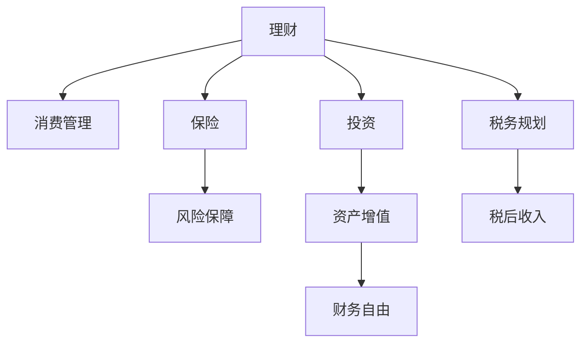

                 

## 1. 背景介绍

### 1.1 问题由来
在当今高速发展的数字经济时代，程序员群体作为一个典型的技术工作者，面临着特殊的职业特性和生活方式。他们的收入水平普遍较高，但与此同时，也面临着一些特殊的理财误区。如何正确管理个人财富，确保长期的财务健康，是每个程序员都需要关注的问题。

### 1.2 问题核心关键点
程序员理财误区主要集中在以下几个方面：
- 过度消费：程序员收入高，但缺乏理财知识，容易陷入“收入高消费也高”的误区。
- 投资风险：程序员对金融市场的理解有限，容易盲目跟风，导致投资损失。
- 财务规划：缺乏长期的财务规划，导致收入分配不均，资金管理混乱。
- 税务问题：对税收政策了解不足，导致税务负担过重，影响财富积累。
- 保险意识：忽视保险的保障作用，风险意识薄弱，容易在意外情况下面临重大财务困境。

### 1.3 问题研究意义
研究程序员理财误区，对提升程序员的财务素养、优化理财策略、避免潜在风险具有重要意义：
- 提高理财意识：帮助程序员理解财务规划的重要性，培养良好的理财习惯。
- 优化理财策略：通过理性分析理财误区，提出实用的理财建议，提升理财效率。
- 降低投资风险：避免因对金融市场的误解导致的投资损失，确保资产安全。
- 合理避税：了解税务政策，合理规划收入和支出，降低税务负担。
- 增强风险意识：强调保险的重要性，构建全面的风险保障体系。

## 2. 核心概念与联系

### 2.1 核心概念概述

为更好地理解程序员如何避免理财误区，本节将介绍几个密切相关的核心概念：

- **理财**：管理个人财务，合理分配收入，控制支出，实现财务自由的过程。
- **消费管理**：通过科学的方法控制消费行为，避免非必要开支。
- **投资**：将闲置资金投资于金融产品，以期获得高于通货膨胀率的回报。
- **税务规划**：合理规划税务策略，减轻税务负担，优化税后收入。
- **保险**：通过购买保险产品，分散财务风险，保障个人及家庭财务安全。
- **财务自由**：实现被动收入大于总支出的状态，无需工作即可维持生活。

这些核心概念之间的逻辑关系可以通过以下Mermaid流程图来展示：



这个流程图展示了理财过程的各个关键步骤及其内在联系：
1. 理财的起点是消费管理，合理控制消费是基础。
2. 理财的重要组成部分包括投资、税务规划和保险，通过这些手段实现资产增值和风险分散。
3. 最终的理财目标是通过资产增值和合理避税，达到财务自由。

## 3. 核心算法原理 & 具体操作步骤
### 3.1 算法原理概述

理财误区是指在理财过程中出现的常见错误观念和行为，如过度消费、盲目投资、忽略税务和保险等。避免这些误区需要理财者具备一定的知识储备和理性思考。

理财的核心算法原理可以归纳为以下几点：
- **收入与支出的平衡**：确保收入大于支出，是实现财务健康的基础。
- **风险分散**：通过投资组合和保险产品，分散财务风险，避免集中投资带来的高风险。
- **税务优化**：合理规划税务策略，通过合法的节税手段，最大化税后收入。
- **财务目标明确**：设定明确的理财目标，如购房、教育、养老等，并制定相应的财务计划。

### 3.2 算法步骤详解

避免理财误区需要遵循以下步骤：

**Step 1: 评估当前财务状况**
- 分析收入来源和支出情况，编制详细的财务报表。
- 评估现有资产和负债情况，计算净资产。

**Step 2: 设定财务目标**
- 根据个人需求和生活规划，设定短期和长期财务目标。
- 制定清晰的理财计划，包括收入分配、支出控制、资产增值等。

**Step 3: 优化消费行为**
- 制定消费预算，限制非必要开支。
- 优先投资于教育、健康、紧急储蓄等高优先级领域。

**Step 4: 分散投资风险**
- 配置多样化的投资组合，包括股票、债券、基金、房地产等。
- 定期调整投资组合，保持风险和收益的平衡。

**Step 5: 合理避税**
- 了解相关税收政策，合理规划收入和支出，利用节税策略。
- 通过合法手段减少税务负担，优化税后收入。

**Step 6: 强化风险保障**
- 购买合适的保险产品，如意外险、健康险、寿险等。
- 建立紧急储蓄，以应对突发情况。

**Step 7: 定期评估和调整**
- 定期检查财务状况，确保理财计划的有效性。
- 根据市场变化和个人需求，灵活调整理财策略。

### 3.3 算法优缺点

避免理财误区的算法具有以下优点：
- 系统性：通过全面的财务规划，避免单一理财策略的局限性。
- 灵活性：可以根据个人需求和市场变化，灵活调整理财策略。
- 前瞻性：考虑到长期财务目标，确保理财行为的持续性和稳定性。

同时，该算法也存在一定的局限性：
- 知识要求：需要具备一定的财务知识和理财经验，对于缺乏相关背景的程序员来说，可能存在一定的门槛。
- 信息不对称：市场和政策变化快，信息获取难度大，需要持续学习和跟进。
- 执行难度：理财计划需要长期坚持，执行力不足容易半途而废。

尽管存在这些局限性，但通过合理规划和持续学习，大部分理财误区是可以通过有效手段避免的。

### 3.4 算法应用领域

避免理财误区的算法不仅适用于程序员，对所有财务状况有所改善的人群都有指导意义。

- **个人理财**：适用于所有有财务需求和目标的个人，通过科学理财实现财务自由。
- **企业财务管理**：帮助企业制定合理的财务策略，优化资源配置，提升企业竞争力。
- **投资管理**：适用于各类投资者，通过分散风险和优化税务策略，实现资产增值。

## 4. 数学模型和公式 & 详细讲解 & 举例说明

### 4.1 数学模型构建

理财模型的核心是确保收入大于支出，实现资产增值。假设个人每月收入为 $I$，每月支出为 $C$，资产增值为 $R$，税务负担为 $T$，则理财模型可以表示为：

$$
C < I - R - T
$$

其中，$R$ 和 $T$ 的值取决于具体的投资和税务规划策略。

### 4.2 公式推导过程

以简化模型为例，假设每月收入 $I=10000$，每月支出 $C=5000$，年利率为 $r=5\%$，投资总额为 $P=200000$，年税收率为 $t=20\%$。则年资产增值 $R$ 和税务负担 $T$ 可以推导如下：

1. **资产增值 $R$**：
$$
R = P \times (1 + r)^1 = 200000 \times (1 + 0.05)^1 = 21000
$$

2. **税务负担 $T$**：
$$
T = P \times r \times t = 200000 \times 0.05 \times 0.20 = 20000
$$

3. **净增值 $N$**：
$$
N = R - T = 21000 - 20000 = 1000
$$

因此，净增值为 $1000$ 元。

### 4.3 案例分析与讲解

假设某程序员每月收入 $I=20000$，每月支出 $C=12000$，年初投资 $P=500000$，年利率为 $r=5\%$，年税收率为 $t=20\%$。通过合理规划，每月结余 $B=20000-12000=8000$，预计资产增值 $R=P \times (1 + r)^1 = 500000 \times (1 + 0.05)^1 = 525000$，税务负担 $T=P \times r \times t = 500000 \times 0.05 \times 0.20 = 50000$，净增值 $N=R - T = 525000 - 50000 = 475000$。

在5年后，该程序员将实现资产增值 $475000$ 元，实现财务目标。

## 5. 项目实践：代码实例和详细解释说明
### 5.1 开发环境搭建

在进行理财实践前，我们需要准备好开发环境。以下是使用Python进行财务管理的开发环境配置流程：

1. 安装Python：从官网下载并安装Python，推荐使用最新版本。
2. 安装必要的财务库：如`pandas`、`numpy`、`scipy`等，用于数据处理和计算。
3. 安装财务管理工具：如`openpyxl`、`pymysql`等，用于财务报表和数据库操作。
4. 安装可视化工具：如`matplotlib`、`seaborn`等，用于绘制图表。
5. 安装数据处理库：如`pandas`、`numpy`、`scipy`等，用于数据分析。

完成上述步骤后，即可在Python环境中开始财务管理实践。

### 5.2 源代码详细实现

下面以构建一个简单的理财管理平台为例，展示如何使用Python进行财务规划和分析。

首先，定义一个简单的类来表示财务规划：

```python
import pandas as pd
import numpy as np

class FinancePlanner:
    def __init__(self, income, expenses, investment, rate, tax_rate):
        self.income = income
        self.expenses = expenses
        self.investment = investment
        self.rate = rate
        self.tax_rate = tax_rate
        self.savings = np.zeros(12)
        self.budget = self.income - self.expenses
        
    def update_savings(self, month):
        self.savings[month] = (self.investment * (1 + self.rate)**month) - self.investment * self.tax_rate
        
    def get_annual_increase(self):
        annual_increase = 0
        for month in range(12):
            annual_increase += self.savings[month]
        return annual_increase
```

然后，创建一个`FinancePlanner`对象，并设定初始参数：

```python
planner = FinancePlanner(20000, 12000, 500000, 0.05, 0.20)
```

接下来，可以进行财务规划和分析：

```python
for month in range(1, 13):
    planner.update_savings(month)
    annual_increase = planner.get_annual_increase()
    print(f"Month {month}: Savings = {planner.savings[month]}, Annual Increase = {annual_increase}")
```

### 5.3 代码解读与分析

让我们再详细解读一下关键代码的实现细节：

**FinancePlanner类**：
- `__init__`方法：初始化财务规划对象的各项参数。
- `update_savings`方法：根据设定的利率和税务率，计算每个月的储蓄增值。
- `get_annual_increase`方法：计算一年内的总增值。

**变量**：
- `self.income`：每月收入
- `self.expenses`：每月支出
- `self.investment`：投资总额
- `self.rate`：年利率
- `self.tax_rate`：年税率

**更新储蓄**：
- 在每个月的储蓄增值计算中，先计算出投资的总增值，然后减去税务负担，得到实际储蓄增值。

**计算年增值**：
- 通过累加每个月的储蓄增值，计算一年内的总增值。

可以看到，Python的类和方法设计使得财务规划和分析过程变得简洁高效。开发者可以灵活添加更多功能，如支出分类、投资组合、风险评估等。

## 6. 实际应用场景
### 6.1 个人理财

个人理财是程序员财务管理的基础。通过构建个人理财模型，可以有效控制支出，合理规划收入和投资，实现财务自由。

假设某程序员每月收入 $I=20000$，每月支出 $C=12000$，年初投资 $P=500000$，年利率为 $r=5\%$，年税收率为 $t=20\%$。通过合理规划，每月结余 $B=20000-12000=8000$，预计资产增值 $R=P \times (1 + r)^1 = 500000 \times (1 + 0.05)^1 = 525000$，税务负担 $T=P \times r \times t = 500000 \times 0.05 \times 0.20 = 50000$，净增值 $N=R - T = 525000 - 50000 = 475000$。

在5年后，该程序员将实现资产增值 $475000$ 元，实现财务目标。

### 6.2 企业财务管理

企业的财务管理工作更加复杂，涉及多个部门和业务单元。通过建立全面的财务管理模型，可以优化资源配置，提升企业竞争力。

假设某公司年营业收入 $I=10000000$，年支出 $C=7000000$，年初投资 $P=10000000$，年利率为 $r=6\%$，年税收率为 $t=25\%$。通过合理规划，每年结余 $B=I - C = 10000000 - 7000000 = 3000000$，预计资产增值 $R=P \times (1 + r)^1 = 10000000 \times (1 + 0.06)^1 = 10600000$，税务负担 $T=P \times r \times t = 10000000 \times 0.06 \times 0.25 = 1500000$，净增值 $N=R - T = 10600000 - 1500000 = 9100000$。

在10年后，该公司将实现资产增值 $9100000$ 元，实现财务目标。

### 6.3 投资管理

投资是理财的重要组成部分，通过合理配置投资组合，可以分散风险，实现资产增值。

假设某程序员每月结余 $B=5000$，年利率为 $r=8\%$，计划投资于股票和债券，股票占比 $60\%$，债券占比 $40\%$。则每年投资回报 $R_{\text{stock}} = P \times (1 + r)^1 = 50000 \times (1 + 0.08)^1 = 56000$，$R_{\text{bond}} = P \times (1 + r)^1 = 50000 \times (1 + 0.05)^1 = 52500$，年净增值 $N=R_{\text{stock}} \times 0.6 + R_{\text{bond}} \times 0.4 = 33600 + 21000 = 54600$。

通过合理分配投资组合，该程序员可以实现年净增值 $54600$ 元。

## 7. 工具和资源推荐
### 7.1 学习资源推荐

为了帮助程序员系统掌握理财知识，以下是几本推荐的书籍和资源：

1. **《理财规划：实用指南》**：介绍理财的基本概念、规划方法和策略，适合初学者入门。
2. **《投资学》（Bodie, Kane, Marcus）**：系统介绍各类投资工具和策略，适合投资者深入学习。
3. **《金融工程入门》（John Hull）**：讲解金融工程的基础知识，包括期权、期货、互换等，适合对金融市场有进一步兴趣的程序员。
4. **《财务报表分析》（Roberts）**：详细解析财务报表的各项指标和分析方法，帮助程序员理解企业财务状况。
5. **《风险管理与财务工程》（Gerard Alexander, John Hull）**：涵盖风险管理的基本原理和工程技术，适合有志于风险管理领域的程序员。

通过这些资源的学习，程序员可以全面提升自己的财务素养，为理财工作打下坚实的基础。

### 7.2 开发工具推荐

高效的财务管理离不开优秀的工具支持。以下是几款推荐的工具：

1. **Excel**：功能强大的电子表格工具，适合进行详细的财务分析和报表编制。
2. **Python**：强大的编程语言，适合进行数据处理和自动化财务管理。
3. **Tableau**：可视化数据处理工具，帮助程序员更好地理解财务数据，做出决策。
4. **QuickBooks**：商业财务软件，适合中小企业进行财务管理和税务申报。
5. **Quicken**：个人财务管理软件，帮助个人理财者轻松管理收入、支出和投资。

合理利用这些工具，可以显著提升程序员的财务管理效率，实现财务目标。

### 7.3 相关论文推荐

理财误区的研究源于学界的持续探索，以下是几篇推荐的论文：

1. **《财务行为与决策》（Larson）**：研究个人和企业的财务行为，探讨理财误区的心理因素和行为模式。
2. **《风险管理与保险精算》（Gerard Alexander, John Hull）**：讲解风险管理和保险精算的基本原理和应用，适合了解风险管理领域的程序员。
3. **《税收规划》（Kassouf, Schilling）**：介绍税收规划的策略和技巧，帮助程序员优化税务负担。
4. **《投资组合优化》（Markowitz）**：研究投资组合的优化方法和策略，适合理财者深入学习。

这些论文代表了大理财误区的研究脉络，通过学习这些前沿成果，程序员可以更好地理解理财策略，避免常见的财务误区。

## 8. 总结：未来发展趋势与挑战

### 8.1 研究成果总结

本文对程序员理财误区进行了全面系统的介绍，帮助程序员理解理财的重要性，掌握基本的理财策略，避免常见的财务误区。通过详细的算法原理和操作步骤，程序员可以科学规划财务目标，实现财务自由。

### 8.2 未来发展趋势

理财误区的研究将随着经济和金融市场的变化而不断演进，未来呈现出以下几个发展趋势：

1. **个性化理财**：随着大数据和人工智能技术的发展，理财将更加个性化，通过分析个人数据提供量身定制的理财建议。
2. **智能理财工具**：通过引入智能算法和机器学习技术，理财工具将更加智能，帮助用户自动化管理财务。
3. **绿色理财**：关注环保和可持续发展的理财理念，成为理财领域的新的关注点。
4. **全球化理财**：理财市场和政策的变化将更加国际化，理财者需要具备全球视野。
5. **区块链和加密货币**：区块链和加密货币的兴起，将为理财带来新的机遇和挑战。

### 8.3 面临的挑战

尽管理财误区的研究已经取得一定进展，但在迈向更加智能化、普适化应用的过程中，仍面临诸多挑战：

1. **信息不对称**：理财市场的复杂性和信息的多样性，使得理财者难以全面掌握相关信息，存在一定的信息不对称问题。
2. **模型风险**：理财模型的复杂性和多样性，使得模型的准确性和稳健性成为重要问题。
3. **执行难度**：理财计划的长期性和复杂性，使得理财者需要具备持续的执行力和自律性。
4. **法律和政策风险**：理财市场和政策的变化，可能带来法律和政策风险，影响理财者的决策。
5. **技术成本**：智能理财工具的开发和维护成本较高，需要理财者具备一定的技术基础。

### 8.4 研究展望

面对理财误区研究的挑战，未来的研究方向需要在以下几个方面寻求新的突破：

1. **数据驱动理财**：利用大数据和机器学习技术，提供更加个性化和智能化的理财建议。
2. **模型稳健性**：研究理财模型的稳健性和鲁棒性，确保在复杂多变的环境下仍能提供准确的理财建议。
3. **智能理财工具**：开发更加智能和易于使用的理财工具，帮助理财者更好地管理财务。
4. **全球化理财**：探索全球理财市场和政策的变化，提供符合不同文化和法律要求的理财策略。
5. **区块链和加密货币**：研究区块链和加密货币在理财中的应用，探索新的投资和理财机会。

这些研究方向将推动理财误区的深入研究，帮助理财者实现长期的财务健康。相信随着技术的发展和研究的深入，理财误区将逐步被克服，理财市场将更加规范和透明。

## 9. 附录：常见问题与解答

**Q1：程序员理财需要了解哪些基本知识？**

A: 程序员理财需要掌握以下几个基本知识：
- 财务报表：包括资产负债表、现金流量表、利润表等，理解财务状况。
- 预算管理：制定合理的收入和支出预算，控制非必要开支。
- 投资基础：了解不同类型的投资工具，如股票、债券、基金等。
- 税务知识：熟悉相关税务政策和策略，合理避税。
- 保险概念：了解不同类型的保险产品，选择适合的风险保障。

**Q2：如何设定理财目标？**

A: 设定理财目标需要考虑以下几个方面：
- 短期目标：如购房、购车、旅行等，预计所需资金和时间。
- 中期目标：如子女教育、养老等，预计所需资金和投资期限。
- 长期目标：如财务自由，需要明确时间和资金需求。

制定明确的理财目标，有助于理财计划的制定和执行，确保财务健康。

**Q3：理财过程中如何控制风险？**

A: 理财过程中控制风险主要通过以下方法：
- 分散投资：将资金分散投资于不同资产，如股票、债券、基金等，分散风险。
- 保险保障：购买合适的保险产品，如意外险、健康险、寿险等，提供风险保障。
- 定期评估：定期检查财务状况，及时调整投资和支出策略，避免集中风险。

通过合理规划和分散风险，理财者可以有效控制财务风险，实现稳健的理财效果。

**Q4：理财规划需要多久更新一次？**

A: 理财规划需要根据市场和个人情况的变化进行定期更新，一般建议每年至少更新一次。在遇到重大财务变化时，如收入波动、支出增加、投资回报等，也需要及时调整理财计划。

定期更新理财计划，确保理财目标的实现，应对市场变化。

**Q5：理财工具的选择有什么建议？**

A: 理财工具的选择需要考虑以下几个方面：
- 功能需求：根据个人理财需求选择适合的理财工具，如记账、投资管理、税务申报等。
- 操作便捷：选择易于使用和操作的理财工具，降低使用难度。
- 安全性：选择安全性高、数据保护好的理财工具，确保财务信息安全。

合理选择理财工具，可以提高理财效率，保障财务信息安全。

---

作者：禅与计算机程序设计艺术 / Zen and the Art of Computer Programming

