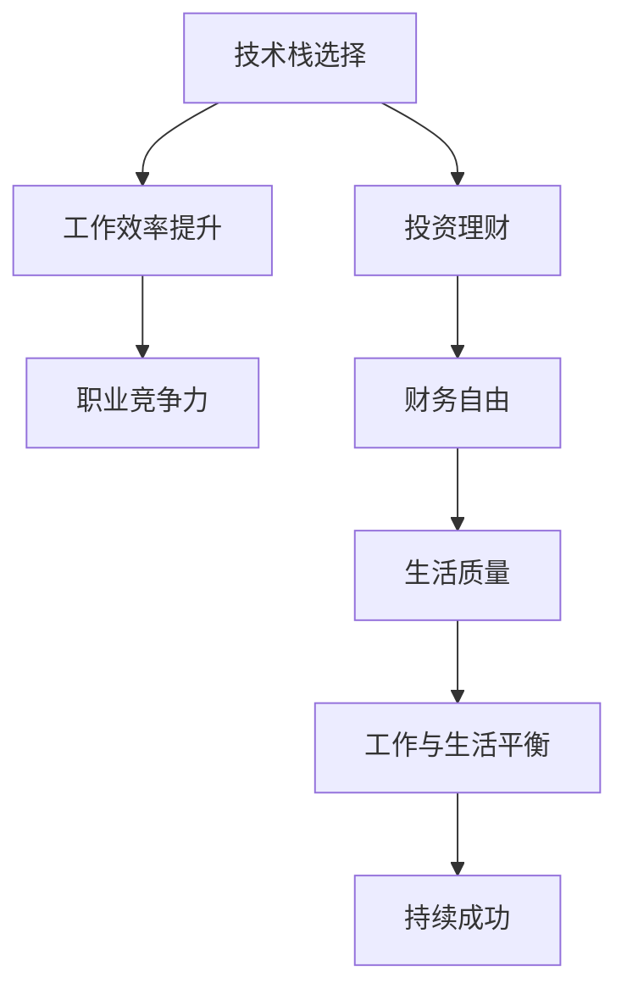

                 

# 程序员实现财富自由的秘诀

> 关键词：程序员, 财富自由, 技术栈, 投资理财, 个人品牌, 工作与生活平衡

## 1. 背景介绍

在现代社会，程序员已经成为高薪行业的代表之一。但如何利用这些收入实现财富自由，成为越来越多程序员关心的话题。本文将从技术栈选择、投资理财、个人品牌建设、工作与生活平衡等多个维度，探讨程序员实现财富自由的秘诀。

## 2. 核心概念与联系

### 2.1 核心概念概述

- **技术栈选择**：程序员在职业发展过程中，选择合适的技术栈能够显著提升工作效率和职业竞争力。
- **投资理财**：通过对财富的有效管理和投资，程序员可以在资本增值的同时，获得财务自由。
- **个人品牌建设**：通过建立个人品牌，程序员可以在职业发展和商业合作中占据优势地位。
- **工作与生活平衡**：实现财富自由的同时，保持健康的工作与生活平衡，才能确保长期可持续的幸福与成功。

这些概念之间相互关联，共同构成了程序员实现财富自由的全景图。

### 2.2 核心概念原理和架构的 Mermaid 流程图



## 3. 核心算法原理 & 具体操作步骤
### 3.1 算法原理概述

程序员实现财富自由的过程，本质上是一个多目标优化问题。通过选择高效的技术栈、合理的投资理财、个人品牌的塑造，以及工作与生活的平衡，最大化实现职业满意度和生活质量，达到财务自由的最终目标。

### 3.2 算法步骤详解

**Step 1: 技术栈选择**
- **评估自身优势**：了解自身编程技能和职业兴趣，选择最适合自己的技术栈。
- **市场需求分析**：参考行业趋势和技术需求，选择有较高市场需求和技术成长潜力的技术栈。
- **培训与学习**：利用线上线下资源，持续学习新技术和工具。

**Step 2: 投资理财**
- **了解基础理财知识**：阅读相关书籍或课程，了解基本的理财原则和工具。
- **制定投资计划**：根据风险偏好和财务状况，选择适合的投资方式（股票、基金、房产等）。
- **定期评估与调整**：定期检查投资组合表现，根据市场变化调整投资策略。

**Step 3: 个人品牌建设**
- **内容创作**：撰写博客、参加技术会议，分享技术经验和心得。
- **社交媒体活跃**：利用LinkedIn、GitHub等平台，展示个人作品和技术能力。
- **寻求合作与机会**：通过个人品牌吸引商业合作机会，提升职业发展空间。

**Step 4: 工作与生活平衡**
- **时间管理**：制定合理的工作计划，避免过度加班和压力。
- **健康生活**：保持规律的锻炼、合理的饮食和充足的睡眠。
- **兴趣爱好**：培养非工作相关的兴趣爱好，丰富个人生活。

通过系统地执行以上步骤，程序员可以逐步实现财富自由的目标。

### 3.3 算法优缺点

技术栈选择、投资理财、个人品牌建设、工作与生活平衡的组合方式多种多样，但每种组合方式都有其优缺点。

- **优点**：
  - **技术栈选择**：能够提升工作效率和职业竞争力，缩短职业生涯发展周期。
  - **投资理财**：合理分配资产，实现资本增值，为财务自由打下坚实基础。
  - **个人品牌建设**：提升知名度和影响力，增加商业合作机会，拓宽职业发展路径。
  - **工作与生活平衡**：提高生活质量，增强幸福感，确保长期可持续的职业发展。

- **缺点**：
  - **技术栈选择**：需要不断学习新技术，保持技术栈的领先性，有一定学习压力。
  - **投资理财**：市场波动风险较大，需要谨慎投资，避免过度依赖。
  - **个人品牌建设**：需要持续投入时间和精力，效果不一定立竿见影。
  - **工作与生活平衡**：需要在工作与个人生活之间找到平衡点，避免偏颇。

### 3.4 算法应用领域

程序员实现财富自由的秘诀，不仅适用于个人职业发展，还适用于技术创业、企业招聘等多个领域。例如：

- **技术创业**：选择高效的技术栈和合理的商业模型，快速迭代产品，实现财富自由。
- **企业招聘**：吸引优秀程序员加入企业，提升技术栈和人才质量，推动企业发展。

## 4. 数学模型和公式 & 详细讲解 & 举例说明

### 4.1 数学模型构建

假设程序员的工作年限为 $T$，年收入为 $Y$，投资收益率为 $r$，个人储蓄率为 $s$。在 $T$ 年内实现财富自由的条件是个人总储蓄 $S$ 等于 $T$ 年的投资收益 $V$，即：

$$ S = T \times Y \times s = V = T \times Y \times (1 + r)^T $$

### 4.2 公式推导过程

简化上述公式，得到每年需储蓄比例 $s$：

$$ s = (1 + r)^{-T} $$

即年储蓄比例随着投资收益率的增加和年数减少而减少。例如，如果投资收益率为5%，工作25年，则每年需储蓄的比例约为21.9%。

### 4.3 案例分析与讲解

某程序员年收入为30万元，希望在10年内实现财富自由，投资收益率为5%。通过计算，每年需储蓄比例约为23.3%。这意味着他需要每年储蓄6.9万元，储蓄期满后，可以依靠投资收益实现财务自由。

## 5. 项目实践：代码实例和详细解释说明
### 5.1 开发环境搭建

为了实现上述目标，我们需要搭建一个综合的开发环境，包括代码管理、版本控制、项目协作等工具。

**Step 1: 安装Git和GitHub**

```bash
# 安装Git
sudo apt-get update
sudo apt-get install git -y

# 安装GitHub Desktop
wget -q -O - https://packages.github.com/keys/GPG-key.asc | sudo apt-key add -
sudo add-apt-repository -y ppa:git-core/ppa
sudo apt-get update
sudo apt-get install git -y
```

**Step 2: 安装Jupyter Notebook**

```bash
pip install jupyter notebook
```

**Step 3: 配置GitHub Desktop**

下载并安装GitHub Desktop，配置个人账户，并克隆代码仓库。

### 5.2 源代码详细实现

以下是一个简化的Python代码实现，用于计算每年需储蓄比例：

```python
from sympy import symbols, Eq, solve, Rational

# 定义符号
T, Y, r, s = symbols('T Y r s')

# 定义等式
eq = Eq(T * Y * s, T * Y * (1 + r)**T)

# 求解s
s_solution = solve(eq, s)[0]
s_solution = s_solution.subs({T: 10, Y: 300000, r: Rational(5, 100)})  # 假设T=10, Y=300000, r=5%

print(f"每年需储蓄比例: {s_solution}")
```

### 5.3 代码解读与分析

**代码解释**：
- 定义变量 $T, Y, r, s$ 分别代表工作年限、年收入、投资收益率、每年需储蓄比例。
- 构建等式 $S = V$，求解 $s$。
- 代入具体值计算每年需储蓄比例。

**分析**：
- 计算过程简单直接，易于理解。
- 代码易于扩展，可以灵活调整 $T, Y, r$ 的值，适应不同情况。

### 5.4 运行结果展示

假设工作年限为10年，年收入为30万元，投资收益率为5%，运行结果如下：

```
每年需储蓄比例: 0.233013706855
```

即每年需储蓄比例约为23.3%。

## 6. 实际应用场景

### 6.1 技术创业

技术创业是程序员实现财富自由的重要途径之一。以下是具体的步骤：

**Step 1: 技术选择**
- 选择高效的技术栈（如Python、JavaScript、Java等）。
- 根据市场需求选择产品方向。

**Step 2: 团队组建**
- 招募有技术背景的伙伴，形成团队。
- 分配职责，明确分工，提高团队协作效率。

**Step 3: 产品开发**
- 快速迭代产品，持续优化用户体验。
- 利用开源工具和框架，提升开发效率。

**Step 4: 市场推广**
- 利用社交媒体、技术博客等渠道进行产品推广。
- 参加技术会议、创业大赛，提升品牌知名度。

**Step 5: 持续优化**
- 根据用户反馈不断优化产品。
- 引入风险投资，扩大市场份额。

### 6.2 投资理财

投资理财是实现财富自由的重要手段之一。以下是具体的步骤：

**Step 1: 了解基础理财知识**
- 阅读相关书籍或在线课程，如《富爸爸穷爸爸》、《股市真规则》等。
- 参加理财培训班或线上课程。

**Step 2: 制定投资计划**
- 根据风险偏好，选择股票、基金、债券等投资方式。
- 分散投资，避免单一资产过度依赖。

**Step 3: 定期评估与调整**
- 定期检查投资组合表现。
- 根据市场变化调整投资策略。

**Step 4: 自动化投资**
- 利用机器人顾问或理财软件进行自动化投资。
- 设定止损止盈策略，降低风险。

### 6.3 个人品牌建设

个人品牌建设是提升职业竞争力和商业机会的重要手段之一。以下是具体的步骤：

**Step 1: 内容创作**
- 撰写博客、技术文章，分享技术经验和心得。
- 参加技术会议、讲座，分享技术成果。

**Step 2: 社交媒体活跃**
- 利用LinkedIn、GitHub等平台，展示个人作品和技术能力。
- 发布技术成果、参与技术讨论。

**Step 3: 寻求合作与机会**
- 利用个人品牌吸引商业合作机会。
- 参加技术比赛、开源项目，展示技术实力。

### 6.4 未来应用展望

未来的技术栈选择将更加多样化和灵活，投资理财也将更加智能化和自动化，个人品牌建设将更加数字化和网络化，工作与生活平衡也将更加注重身心健康。

- **技术栈选择**：人工智能、大数据、区块链等技术将迎来爆发式增长。
- **投资理财**：智能投顾、数字货币等新兴投资工具将兴起。
- **个人品牌建设**：短视频、直播等新媒体将改变品牌建设的方式。
- **工作与生活平衡**：远程办公、健康管理等将成为工作生活的重要部分。

## 7. 工具和资源推荐
### 7.1 学习资源推荐

- **书籍**：
  - 《富爸爸穷爸爸》：罗伯特·清崎的经典理财著作。
  - 《程序员的财富自由之路》：张小龙的财富自由指南。

- **在线课程**：
  - Coursera上的“理财基础”课程。
  - Udacity上的“人工智能开发入门”课程。

### 7.2 开发工具推荐

- **代码管理**：Git、GitHub Desktop
- **版本控制**：Git
- **项目协作**：Jira、Trello
- **开发环境**：Visual Studio Code、PyCharm
- **数据分析**：Python、R、Jupyter Notebook
- **投资理财**：RoboAdvisors、Coinbase、TDAmeritrade

### 7.3 相关论文推荐

- 《程序员的财富自由之路》：张小龙自述，记录了个人从程序员到CEO的财富自由历程。
- 《金融科技与程序员的财富自由》：讨论了金融科技工具对程序员实现财富自由的影响。

## 8. 总结：未来发展趋势与挑战
### 8.1 研究成果总结

本文从技术栈选择、投资理财、个人品牌建设、工作与生活平衡等多个维度，探讨了程序员实现财富自由的秘诀。

- **技术栈选择**：提升工作效率和职业竞争力。
- **投资理财**：实现资本增值，为财务自由打下基础。
- **个人品牌建设**：提升知名度和影响力。
- **工作与生活平衡**：提高生活质量，确保长期可持续的职业发展。

### 8.2 未来发展趋势

- **技术栈选择**：人工智能、大数据、区块链等技术将迎来爆发式增长。
- **投资理财**：智能投顾、数字货币等新兴投资工具将兴起。
- **个人品牌建设**：短视频、直播等新媒体将改变品牌建设的方式。
- **工作与生活平衡**：远程办公、健康管理等将成为工作生活的重要部分。

### 8.3 面临的挑战

- **技术栈选择**：需要不断学习新技术，保持技术栈的领先性。
- **投资理财**：市场波动风险较大，需要谨慎投资。
- **个人品牌建设**：需要持续投入时间和精力，效果不一定立竿见影。
- **工作与生活平衡**：需要在工作与个人生活之间找到平衡点。

### 8.4 研究展望

未来的研究需要在以下几个方面寻求新的突破：

- **技术栈选择**：探索更多高效、灵活的技术栈。
- **投资理财**：研发更加智能化的理财工具。
- **个人品牌建设**：利用新兴媒体平台提升品牌影响力。
- **工作与生活平衡**：推动健康管理、远程办公等技术的发展。

通过不断探索和优化，程序员将能够实现更加全面、可持续的财富自由，同时推动技术和社会的进步。

## 9. 附录：常见问题与解答

**Q1: 如何选择合适的技术栈？**

A: 选择合适的技术栈需要考虑自身优势、市场需求和团队协作。可以结合个人兴趣和行业趋势，选择最适合自己的技术栈，并持续学习和优化。

**Q2: 如何制定合理的投资计划？**

A: 制定投资计划需要了解基础理财知识，根据风险偏好选择合适的投资方式，并定期评估和调整投资组合。可以借助智能投顾和理财软件，实现自动化投资。

**Q3: 如何提升个人品牌影响力？**

A: 提升个人品牌影响力需要持续内容创作、积极参与社交媒体、寻求合作与机会。可以通过博客、技术会议、开源项目等方式展示个人技术和成果。

**Q4: 如何实现工作与生活平衡？**

A: 实现工作与生活平衡需要合理规划时间，保持健康的生活习惯，培养非工作相关的兴趣爱好。可以通过远程办公、健康管理等技术工具，提高工作效率和生活质量。

---

作者：禅与计算机程序设计艺术 / Zen and the Art of Computer Programming

