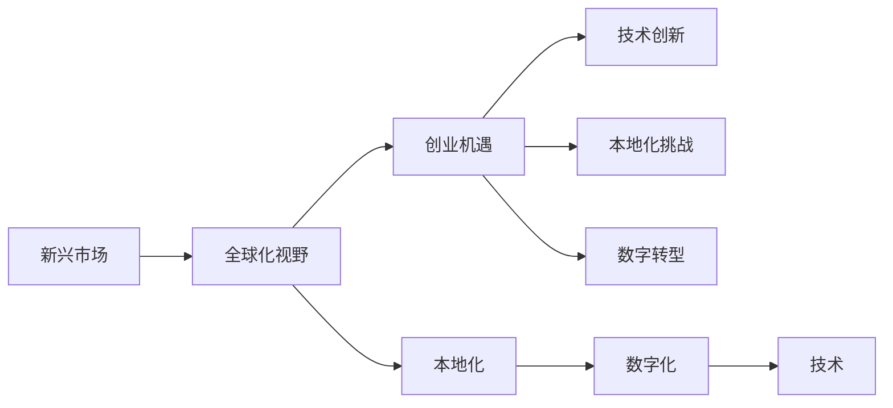

                 

# 程序员的全球化视野：新兴市场的创业机遇

> 关键词：新兴市场,全球化视野,创业机遇,技术创新,国际业务,本地化挑战,数字转型

## 1. 背景介绍

在过去十年里，全球经济格局和数字化转型速度发生了显著变化。新兴市场因其庞大的消费群体、快速的经济增长和巨大的市场潜力，成为了全球关注的焦点。在数字化大潮中，这些新兴市场为创业者提供了前所未有的机遇。然而，面对不同的文化、语言和商业环境的挑战，全球化视野下的创业，需要程序员具备更为广阔的视野和灵活的策略。本文将探讨如何利用技术创新，在复杂多变的新兴市场中抓住机遇，同时应对本地化挑战。

## 2. 核心概念与联系

### 2.1 核心概念概述

为了更好地理解全球化视野下的创业机遇，我们需要首先了解一些核心概念：

- **新兴市场**：指的是那些经济快速增长、消费能力逐渐增强，但仍然面临基础设施和技术瓶颈的发展中国家或地区。
- **全球化视野**：指在全球范围内考虑商业机会，不仅关注本地市场，还考虑国际业务的拓展和本地化策略。
- **创业机遇**：指在新兴市场中利用技术优势，开发创新产品或服务，满足当地消费者需求，实现商业成功。
- **技术创新**：指利用新技术，如人工智能、区块链、物联网等，解决本地化问题，创造商业价值。
- **本地化挑战**：指在全球化过程中，为了适应不同市场，需要解决的法律、语言、文化等方面的挑战。
- **数字转型**：指通过数字化手段，提升业务效率，实现商业模式的创新。

这些概念共同构成了全球化视野下创业的框架，旨在指导程序员如何利用技术创新，在全球化的背景下，成功捕捉并实现新兴市场的创业机遇。

### 2.2 核心概念原理和架构的 Mermaid 流程图



这个流程图展示了核心概念之间的联系：新兴市场是全球化视野的出发点，而创业机遇是最终目标。技术创新和本地化挑战是实现这一目标的重要手段，数字转型则是推动这一进程的驱动力。

## 3. 核心算法原理 & 具体操作步骤

### 3.1 算法原理概述

全球化视野下的创业机遇，可以通过以下算法原理进行分析和实现：

1. **市场需求分析**：通过分析新兴市场的消费者需求，确定产品或服务的潜在市场。
2. **技术匹配**：将技术优势与市场需求相结合，开发能够满足当地消费者需求的产品或服务。
3. **本地化适配**：针对不同市场的特定需求，进行产品或服务的本地化适配，如语言、文化和法律环境。
4. **数字技术应用**：利用新兴的数字化技术，提升产品或服务的质量和效率，实现创新商业模式的探索。

### 3.2 算法步骤详解

以下是具体步骤的详细说明：

1. **市场调研**：
    - 收集目标新兴市场的消费者行为数据，分析消费习惯和需求趋势。
    - 识别潜在的产品或服务需求，评估市场需求大小和增长潜力。

2. **技术选型**：
    - 根据市场需求，选择合适的技术平台或工具。例如，针对移动应用市场，可以选择Android或iOS开发平台。
    - 确定所需的核心技术，如人工智能、大数据、物联网等。

3. **产品设计**：
    - 基于市场需求和技术选型，设计符合当地用户习惯的产品或服务。
    - 考虑用户体验和界面设计，确保产品或服务易于使用和接受。

4. **本地化适配**：
    - 将产品或服务进行本地化适配，包括语言、文化、法律等方面。例如，进行UI/UX本地化设计，使用当地语言进行内容翻译。
    - 根据当地法律法规，确保产品或服务符合市场准入要求。

5. **数字化实施**：
    - 利用新兴的数字化技术，优化产品或服务的开发和部署流程。
    - 采用云计算、大数据分析等技术，提高业务运营效率和市场响应速度。

6. **市场推广**：
    - 制定市场推广策略，包括线上和线下渠道。例如，通过社交媒体、本地电商平台进行推广。
    - 参与本地化活动，提高品牌知名度和用户参与度。

7. **用户反馈和迭代**：
    - 收集用户反馈，评估产品或服务的实际表现。
    - 根据反馈不断迭代产品或服务，优化用户体验和功能。

### 3.3 算法优缺点

全球化视野下的创业机遇，其算法具有以下优点：

- **广泛市场潜力**：新兴市场人口众多，消费需求增长迅速，为产品或服务提供了广阔的市场空间。
- **技术创新应用**：利用前沿技术，可以提高产品或服务的质量和效率，满足新兴市场的创新需求。
- **提升本地竞争力**：通过本地化适配，能够更好地融入当地市场，提升品牌影响力和用户满意度。

但该算法也存在以下缺点：

- **市场不确定性**：新兴市场的经济环境和社会结构变化迅速，市场不确定性高。
- **文化差异挑战**：不同文化背景下的用户需求和接受度不同，产品或服务本地化难度较大。
- **法律法规风险**：不同地区的法律法规差异，增加了业务开展的复杂性和风险。

### 3.4 算法应用领域

全球化视野下的创业机遇，广泛应用于以下领域：

- **电商**：如阿里巴巴、亚马逊等，通过在新兴市场建立电商平台，拓展全球业务。
- **移动应用**：如滴滴出行、Grab等，利用移动互联网优势，解决当地出行问题。
- **金融科技**：如PayPal、Square等，提供支付和金融服务，帮助新兴市场消费者实现数字化生活。
- **教育科技**：如Coursera、Udacity等，提供在线教育资源，提升新兴市场教育水平。
- **健康科技**：如H2-Hero、DocTrue等，提供健康管理和医疗服务，改善新兴市场医疗条件。

## 4. 数学模型和公式 & 详细讲解 & 举例说明

### 4.1 数学模型构建

在数学模型构建中，我们可以采用以下公式来描述市场增长和用户转化率的关系：

$$ P(t) = P_0 \times (1+r)^t $$

其中，$P(t)$表示时间$t$时的市场规模，$P_0$表示初始市场规模，$r$表示市场增长率，$t$表示时间。

### 4.2 公式推导过程

推导过程如下：

$$ P(t) = P_0 \times (1+\frac{\Delta P}{P_0})^t $$
$$ = P_0 \times (1+\frac{\frac{\Delta P}{P_0}}{1+\frac{\Delta P}{P_0}})^t $$
$$ = P_0 \times (1+\frac{\Delta P}{P_0})^t $$
$$ = P_0 \times (1+r)^t $$

其中，$\Delta P$表示市场规模的增量。

### 4.3 案例分析与讲解

以阿里巴巴进入东南亚市场的案例为例：

- **市场调研**：阿里巴巴通过调研发现，东南亚市场电商渗透率低，消费者对在线购物有巨大需求。
- **技术选型**：利用阿里云和淘宝的技术平台，开发适合东南亚市场的电商平台。
- **产品设计**：设计符合当地用户习惯的移动应用界面，提供便捷的支付方式和物流服务。
- **本地化适配**：进行语言和文化的本地化适配，推出面向不同国家和地区的本地版本。
- **数字化实施**：利用大数据分析和云计算技术，提升运营效率和市场响应速度。
- **市场推广**：通过本地化的广告和促销活动，快速提高用户参与度和品牌知名度。
- **用户反馈和迭代**：收集用户反馈，持续优化产品体验和功能，提升用户满意度。

通过上述步骤，阿里巴巴在东南亚市场迅速站稳脚跟，实现了商业成功。

## 5. 项目实践：代码实例和详细解释说明

### 5.1 开发环境搭建

以下是开发环境搭建的步骤：

1. **选择开发语言**：
    - 选择适合目标市场的编程语言，如Java、Python、Kotlin等。
    - 考虑开发效率和社区支持，选择主流语言。

2. **配置开发工具**：
    - 安装IDE开发环境，如Android Studio、Xcode等。
    - 配置版本控制工具，如Git、SVN等。

3. **建立持续集成系统**：
    - 配置CI/CD流水线，如Jenkins、Travis CI等。
    - 进行自动化测试和部署，确保产品质量和稳定性。

4. **部署服务器环境**：
    - 选择合适的云服务提供商，如AWS、阿里云、腾讯云等。
    - 配置服务器环境，确保高可用性和可扩展性。

### 5.2 源代码详细实现

以下是一个简单的电商应用开发实例：

```python
# 导入必要的库
import flask
from flask_sqlalchemy import SQLAlchemy
from flask_login import LoginManager

# 初始化Flask应用
app = flask.Flask(__name__)

# 配置数据库连接
app.config['SQLALCHEMY_DATABASE_URI'] = 'sqlite:///app.db'
db = SQLAlchemy(app)

# 定义用户模型
class User(db.Model):
    id = db.Column(db.Integer, primary_key=True)
    username = db.Column(db.String(50), unique=True)
    password = db.Column(db.String(100))

# 配置登录管理器
login_manager = LoginManager(app)
login_manager.login_view = 'login'

# 定义用户注册视图
@app.route('/register', methods=['GET', 'POST'])
def register():
    if flask.request.method == 'POST':
        username = flask.request.form['username']
        password = flask.request.form['password']
        user = User(username=username, password=password)
        db.session.add(user)
        db.session.commit()
        return '注册成功'
    else:
        return flask.render_template('register.html')

# 定义用户登录视图
@app.route('/login', methods=['GET', 'POST'])
def login():
    if flask.request.method == 'POST':
        username = flask.request.form['username']
        password = flask.request.form['password']
        user = User.query.filter_by(username=username, password=password).first()
        if user:
            login_manager.login_user(user)
            return flask.redirect(flask.url_for('index'))
        else:
            return '用户名或密码错误'
    else:
        return flask.render_template('login.html')

# 定义用户登出视图
@app.route('/logout')
def logout():
    user = login_manager.get_current_user()
    if user:
        login_manager.logout_user()
        return flask.redirect(flask.url_for('index'))
    else:
        return '您已经登出'

# 定义商品列表视图
@app.route('/')
@login_required
def index():
    return flask.render_template('index.html')

# 运行应用
if __name__ == '__main__':
    app.run(debug=True)
```

### 5.3 代码解读与分析

**Flask框架**：
- Flask是一个轻量级的Python Web应用框架，易于上手和使用。
- 通过Flask，可以快速搭建Web应用，并进行前后端分离。

**SQLAlchemy库**：
- SQLAlchemy是Python中流行的ORM框架，支持关系型数据库的CRUD操作。
- 通过SQLAlchemy，可以方便地进行数据库操作，如新增、修改、查询和删除。

**Flask-Login库**：
- Flask-Login是一个用于用户认证和会话管理的扩展。
- 通过Flask-Login，可以方便地实现用户登录、登出和会话管理功能。

**代码分析**：
- 代码中，首先定义了User模型，用于存储用户信息。
- 通过Flask-Login，实现了用户登录、登出和会话管理功能。
- 定义了用户注册、登录和登出视图，实现基本的用户认证逻辑。
- 定义了商品列表视图，用于展示商品列表。

## 6. 实际应用场景

### 6.1 电商

新兴市场电商领域，由于消费需求和市场规模的快速增长，为电商平台提供了广阔的创业机会。例如，阿里巴巴通过在新兴市场建立电商平台，实现了业务扩展和市场份额的提升。通过本地化适配和技术创新，电商平台能够更好地满足当地消费者的需求，提升用户体验和销售转化率。

### 6.2 金融科技

在新兴市场金融科技领域，利用区块链和大数据技术，可以提供更为安全、高效的金融服务。例如，PayPal通过在新兴市场推出移动支付服务，帮助消费者实现便捷的支付和转账。利用智能合约技术，可以实现更为透明和可追溯的交易记录，提高金融服务的可信度。

### 6.3 教育科技

教育科技领域，可以利用人工智能和大数据技术，提供个性化的学习体验。例如，Coursera通过在新兴市场推出在线课程平台，为本地学生提供高质量的教育资源。通过本地化适配，平台能够更好地符合当地教育体系和文化需求，提高学生学习效果和平台粘性。

### 6.4 健康科技

在新兴市场健康科技领域，利用物联网和大数据分析技术，可以提供更为便捷和精准的健康管理服务。例如，H2-Hero通过在新兴市场推出健康管理应用，帮助当地居民进行日常健康监测和疾病预防。通过本地化适配，应用能够更好地符合当地居民的生活习惯和健康需求，提升健康管理效果。

## 7. 工具和资源推荐

### 7.1 学习资源推荐

为了帮助程序员更好地掌握全球化视野下的创业机遇，以下是一些优质的学习资源：

1. **Coursera**：提供全球领先的在线课程，涵盖编程、数据科学、人工智能等多个领域。
2. **edX**：提供来自顶尖大学的在线课程，帮助程序员提升专业知识和技能。
3. **Udemy**：提供丰富的编程和创业课程，帮助程序员进行技术学习和实践。
4. **LinkedIn Learning**：提供各类职业发展课程，帮助程序员提升职业素养和实战能力。
5. **GitHub**：全球最大的代码托管平台，提供大量开源项目和资源，帮助程序员学习和实践。

### 7.2 开发工具推荐

以下是几款常用的开发工具：

1. **Visual Studio Code**：轻量级且功能强大的文本编辑器，支持多种编程语言和插件。
2. **Atom**：开源的文本编辑器，支持自定义配置和插件扩展。
3. **PyCharm**：Python集成开发环境，提供丰富的功能和插件支持。
4. **Android Studio**：Android应用的开发工具，支持Android应用的开发、调试和发布。
5. **Xcode**：苹果官方的开发工具，支持iOS和macOS应用的开发、调试和发布。

### 7.3 相关论文推荐

以下是一些涉及全球化视野下创业的学术论文，推荐阅读：

1. **《The Globalization of the Digital Economy》**：探讨全球化对数字经济的影响，分析新兴市场的机遇和挑战。
2. **《Entrepreneurship in Emerging Markets》**：分析新兴市场创业的特点和趋势，提出相应的战略建议。
3. **《Blockchain and Financial Inclusion in Emerging Markets》**：研究区块链技术在金融普惠中的应用，提升新兴市场的金融服务水平。
4. **《Artificial Intelligence for Education in Emerging Markets》**：探讨人工智能在教育领域的应用，提升新兴市场的教育质量和公平性。
5. **《Health Information Technology in Emerging Markets》**：研究健康信息技术在新兴市场的应用，提高当地居民的健康水平。

## 8. 总结：未来发展趋势与挑战

### 8.1 研究成果总结

全球化视野下的创业机遇，为程序员提供了广阔的市场空间和发展机会。通过技术创新和本地化适配，可以满足新兴市场消费者的需求，实现商业成功。

### 8.2 未来发展趋势

未来，全球化视野下的创业将呈现以下发展趋势：

1. **技术创新加速**：随着人工智能、区块链、物联网等技术的发展，新兴市场的创业机会将不断增加。
2. **市场细分深入**：随着市场竞争加剧，细分市场的挖掘和开发将成为趋势，满足不同用户群体的需求。
3. **本地化需求提升**：不同市场的文化和法律法规差异，要求本地化策略更加精细和灵活。
4. **数字化转型加快**：数字化技术将进一步深入到各个行业，推动业务流程和商业模式的重构。

### 8.3 面临的挑战

尽管全球化视野下的创业充满了机遇，但也面临诸多挑战：

1. **市场环境复杂**：新兴市场的经济和政策环境变化迅速，增加了业务的不确定性。
2. **文化差异显著**：不同市场的文化和语言背景差异，增加了本地化适配的难度。
3. **法律法规多样**：不同地区的法律法规差异，增加了业务合规的风险。
4. **数据安全问题**：在跨境数据传输和存储中，需要考虑数据安全和隐私保护。

### 8.4 研究展望

未来，全球化视野下的创业需要进一步研究解决以下问题：

1. **跨文化交流**：研究如何有效地进行跨文化交流和沟通，减少文化误解和冲突。
2. **法律法规合规**：研究如何遵守不同市场的法律法规，降低合规风险。
3. **数据安全和隐私**：研究如何在跨境数据传输和存储中保障数据安全和隐私。
4. **技术融合创新**：研究如何将前沿技术和新业务模式相结合，实现创新和突破。

总之，全球化视野下的创业机遇与挑战并存。程序员需要在技术创新和本地化策略中找到平衡点，实现商业成功和市场拓展。只有勇于创新、敢于突破，才能在全球化的大潮中，抓住机遇，实现商业价值。

## 9. 附录：常见问题与解答

### Q1：如何在不同市场进行本地化适配？

A: 本地化适配需要考虑以下几个方面：
1. **语言翻译**：将产品或服务进行语言翻译，确保文本内容符合本地语言习惯。
2. **文化适应**：根据当地文化特点，调整UI/UX设计，确保用户界面符合当地用户习惯。
3. **法律法规遵从**：根据当地法律法规，确保产品或服务符合市场准入要求。
4. **用户反馈收集**：通过用户反馈，不断优化本地化适配，提升用户满意度。

### Q2：如何在新兴市场推广产品或服务？

A: 在新兴市场推广产品或服务，需要考虑以下几个方面：
1. **多渠道营销**：通过线上和线下渠道进行市场推广，提高用户参与度和品牌知名度。
2. **本地化广告**：根据当地文化和语言特点，设计符合本地市场的广告内容。
3. **本地化活动**：参与当地社区活动，提高品牌影响力和用户粘性。
4. **社交媒体营销**：利用社交媒体平台，进行品牌宣传和用户互动。

### Q3：如何管理新兴市场的供应链？

A: 在新兴市场管理供应链，需要考虑以下几个方面：
1. **本地化采购**：寻找本地供应商，降低物流成本和风险。
2. **质量控制**：制定质量控制标准，确保产品质量符合市场要求。
3. **物流管理**：利用本地物流资源，提高物流效率和成本控制。
4. **风险管理**：制定风险管理策略，应对市场变化和不可预测因素。

总之，全球化视野下的创业机遇与挑战并存。程序员需要在技术创新和本地化策略中找到平衡点，实现商业成功和市场拓展。只有勇于创新、敢于突破，才能在全球化的大潮中，抓住机遇，实现商业价值。

---

作者：禅与计算机程序设计艺术 / Zen and the Art of Computer Programming

